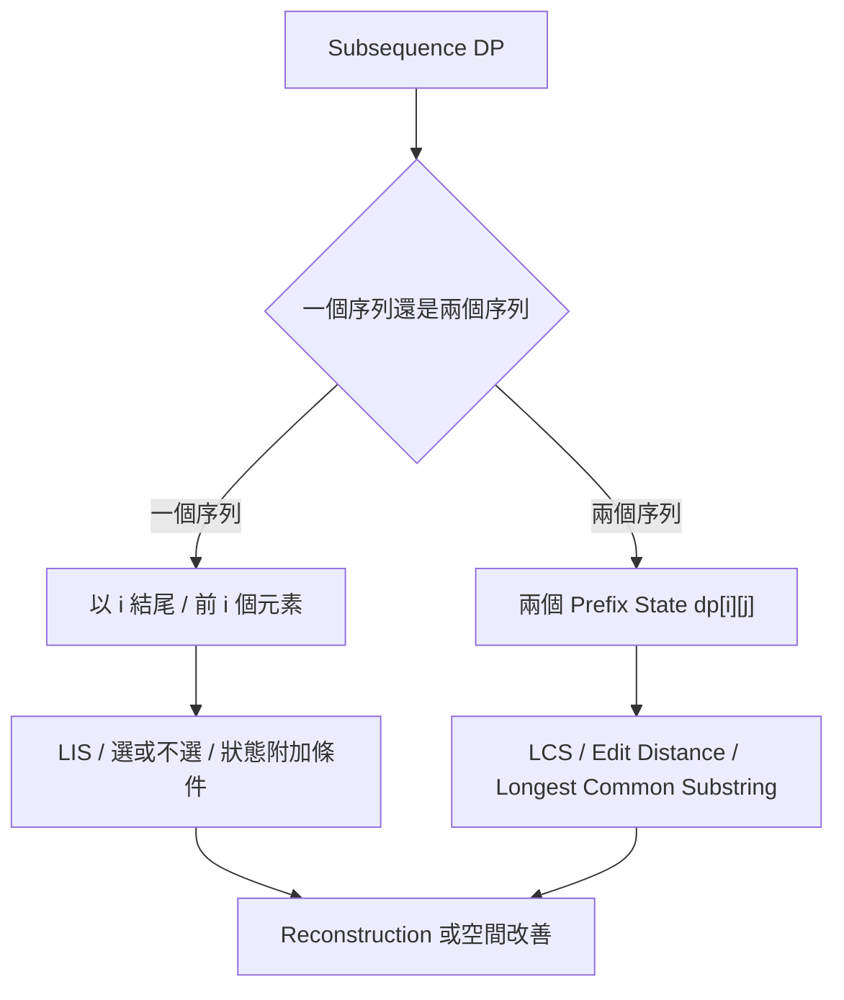
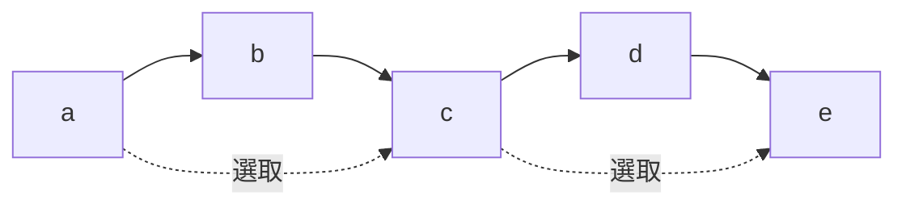
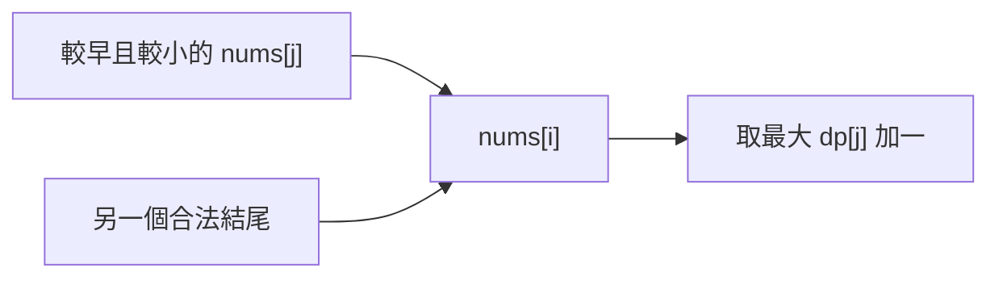
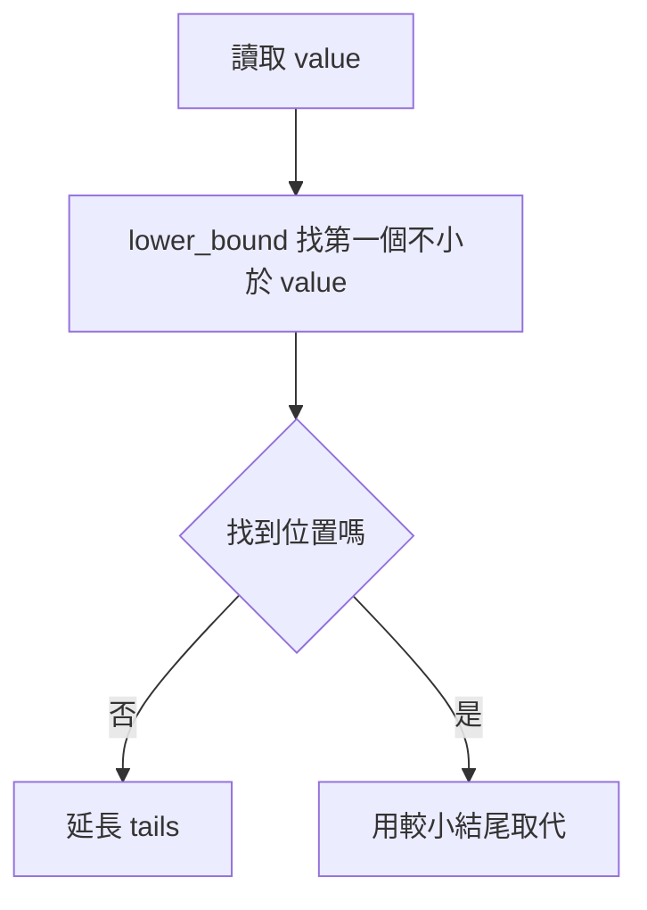
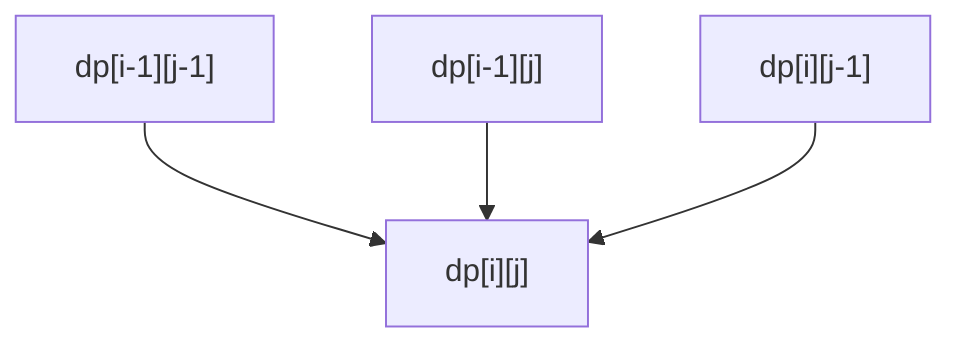
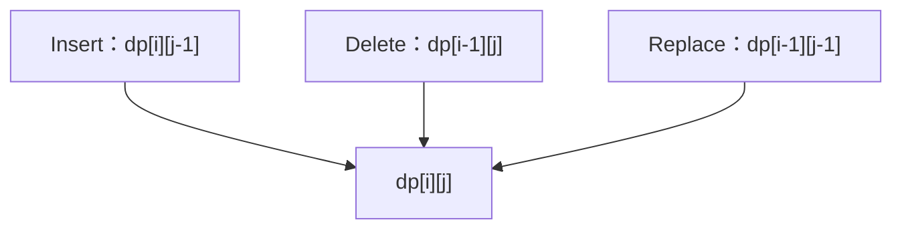
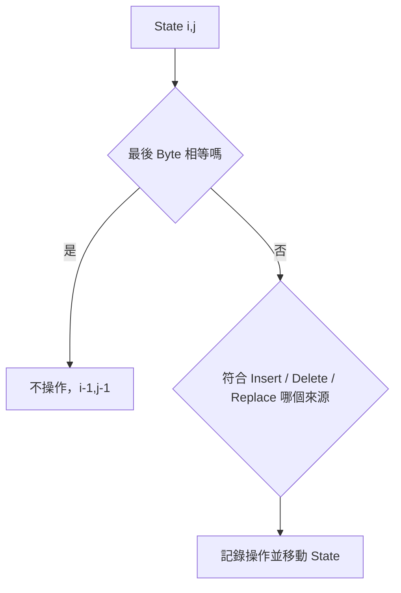
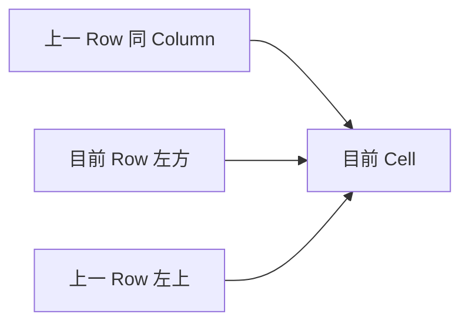
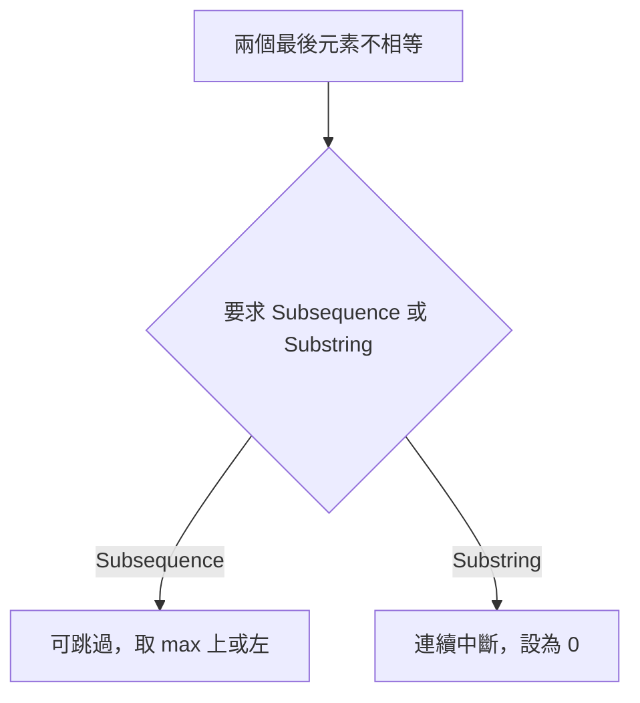
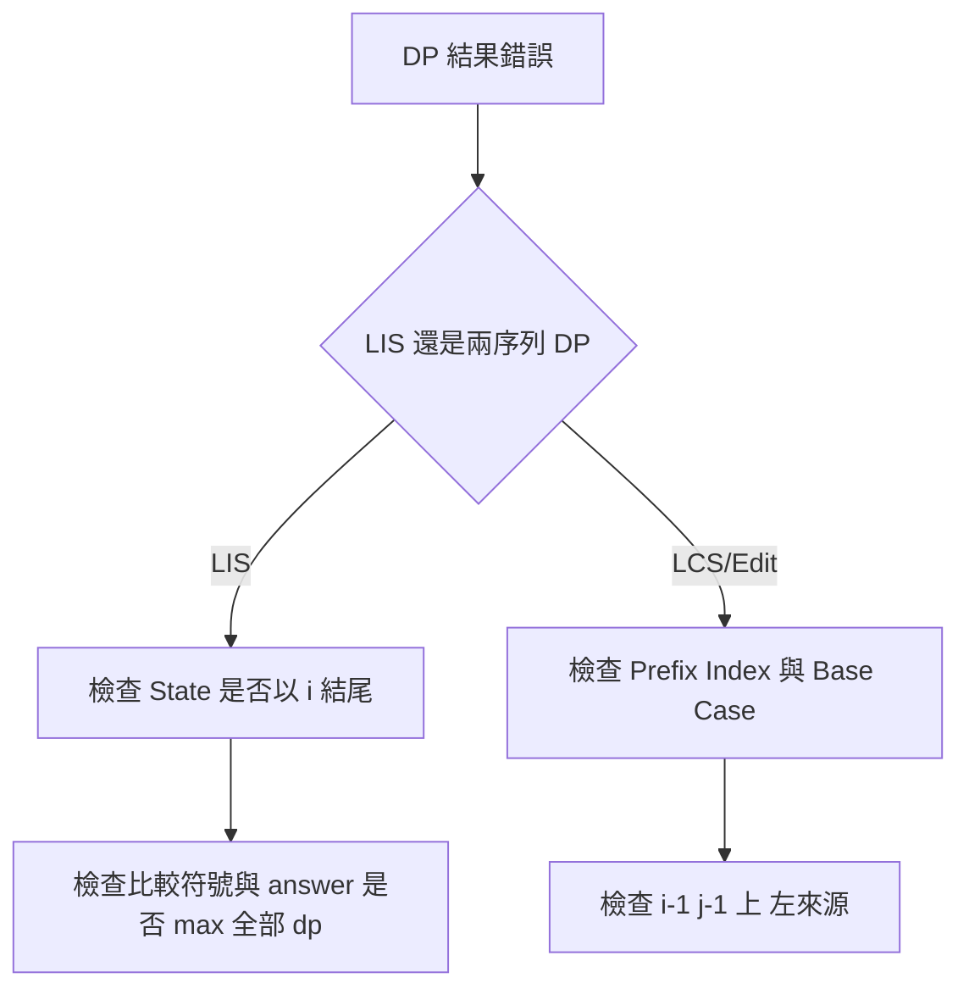

### 第 41 章　Subsequence Dynamic Programming

#### 適用範圍

本章介紹 Subsequence Dynamic Programming，包括 Subsequence 與 Substring、Longest Increasing Subsequence、Longest Common Subsequence、Edit Distance、兩個 Prefix 的 State、空間改善與 Reconstruction。

Subsequence 的核心特徵是「保留原順序，但可以跳過元素」。許多題目需要定義「目前答案是否以某個位置結尾」，或使用兩個 Prefix 描述已考慮範圍。原始章節已經涵蓋 LIS、LCS、Edit Distance、空間改善、Reconstruction，以及 Subsequence / Substring 的差異，本版會補上更完整的推導、範例、C++ 實作、除錯方式與常見變化題。citeturn47search1



#### 適用讀者

- 已理解一維 DP，但不熟悉 Subsequence 題型的讀者。
- 容易混淆 Subsequence 與 Substring 的讀者。
- 看得懂 LIS / LCS 程式，但不清楚 State 語意的讀者。
- 想理解 `tails` 為什麼不一定是一條實際 LIS 的讀者。
- 想從 DP Table 還原 LCS 或 Edit Distance 操作的讀者。
- 想理解空間壓縮與 Reconstruction 取捨的讀者。

#### 快速導覽

- [41.1 Subsequence 與 Substring](#411-subsequence-與-substring)
- [41.2 Subsequence DP 的 State 類型](#412-subsequence-dp-的-state-類型)
- [41.3 LIS 的 State](#413-lis-的-state)
- [41.4 完整案例：O(n²) LIS](#414-完整案例on²-lis)
- [41.5 LIS 的 O(n log n) 方法](#415-lis-的-on-log-n-方法)
- [41.6 LIS Reconstruction](#416-lis-reconstruction)
- [41.7 LCS 的兩個 Prefix State](#417-lcs-的兩個-prefix-state)
- [41.8 完整案例：LCS](#418-完整案例lcs)
- [41.9 LCS Reconstruction](#419-lcs-reconstruction)
- [41.10 Edit Distance](#4110-edit-distance)
- [41.11 完整案例：Edit Distance](#4111-完整案例edit-distance)
- [41.12 Edit Distance Reconstruction](#4112-edit-distance-reconstruction)
- [41.13 空間改善](#4113-空間改善)
- [41.14 Substring 題的差異](#4114-substring-題的差異)
- [41.15 常見變化題](#4115-常見變化題)
- [41.16 系統化 Debug](#4116-系統化-debug)
- [41.17 常見問題與判讀](#4117-常見問題與判讀)
- [41.18 本章檢查表](#4118-本章檢查表)
- [41.19 本章重點](#4119-本章重點)

#### 41.1 Subsequence 與 Substring

- Subsequence：保留順序，但可跳過元素。
- Substring / Subarray：必須連續。

例如：

```text
"ace" 是 "abcde" 的 Subsequence
但不是 Substring
```

原始章節也使用 `"ace"` 與 `"abcde"` 說明 Subsequence 與 Substring 的差異。citeturn47search1



Subsequence DP 通常在「選目前元素」與「跳過目前元素」之間建立 Transition。

##### 差異表

<table>
<tr><th>項目</th><th>Subsequence</th><th>Substring / Subarray</th></tr>
<tr><td>是否連續</td><td>不需要</td><td>需要</td></tr>
<tr><td>是否保留原順序</td><td>需要</td><td>需要</td></tr>
<tr><td>能否跳過元素</td><td>可以</td><td>不可以</td></tr>
<tr><td>典型題目</td><td>LIS、LCS</td><td>Longest Common Substring、Sliding Window</td></tr>
<tr><td>不匹配時</td><td>常可跳過其中一邊</td><td>連續性通常中斷</td></tr>
</table>

#### 41.2 Subsequence DP 的 State 類型

Subsequence DP 常見 State 有兩大類。

##### 以某個位置結尾

例如 LIS：

```text
dp[i] = 以 nums[i] 結尾的最佳答案
```

這種 State 強調「最後一個元素是 i」。答案通常不是 `dp[n-1]`，而是所有 `dp[i]` 的最大值。原始章節也提醒，LIS 的答案是所有 `dp[i]` 的最大值，不一定以最後一個元素結尾。citeturn47search1

##### 兩個 Prefix 的範圍

例如 LCS / Edit Distance：

```text
dp[i][j] = first 前 i 個元素與 second 前 j 個元素的答案
```

這種 State 使用空 Prefix 作為 Base Case，因此 DP Table 通常大小是 `(m + 1) × (n + 1)`。

##### 選擇 State 的問題

<table>
<tr><th>題目特徵</th><th>常見 State</th></tr>
<tr><td>單一序列，答案有結尾限制</td><td>`dp[i] = 以 i 結尾`</td></tr>
<tr><td>兩個序列比較</td><td>`dp[i][j] = 兩個 Prefix`</td></tr>
<tr><td>需要連續</td><td>不匹配時通常歸 0 或重啟</td></tr>
<tr><td>需要還原答案</td><td>完整表或額外 predecessor / parent</td></tr>
<tr><td>只要長度</td><td>可能可空間壓縮</td></tr>
</table>

#### 41.3 LIS 的 State

Longest Increasing Subsequence 的經典 O(n²) State：

```text
dp[i] = 以 nums[i] 結尾的 LIS 長度
```

Transition：

```text
dp[i] = 1 + max(dp[j])
其中 j < i 且 nums[j] < nums[i]
```

原始章節也使用這個 State 與 Transition 定義 LIS。citeturn47search1



##### 為什麼 State 是「以 i 結尾」

如果只定義：

```text
dp[i] = nums[0..i] 的 LIS 長度
```

雖然可以求長度，但要轉移時不知道目前 LIS 的結尾值，難以判斷下一個元素能否接上。

定義成「以 i 結尾」後，結尾值固定為 `nums[i]`，可以清楚檢查 `nums[j] < nums[i]`。

##### 嚴格遞增與非遞減

- 嚴格遞增：`nums[j] < nums[i]`
- 非遞減：`nums[j] <= nums[i]`

原始章節也提醒，嚴格遞增使用 `<`，非遞減要改成 `<=`，重複值測試可直接驗證語意。citeturn47search1

#### 41.4 完整案例：O(n²) LIS

```cpp
#include <algorithm>
#include <vector>

int lisLength(const std::vector<int>& nums)
{
    if (nums.empty())
    {
        return 0;
    }

    std::vector<int> dp(nums.size(), 1);
    int answer = 1;

    for (int i = 0; i < static_cast<int>(nums.size()); ++i)
    {
        for (int j = 0; j < i; ++j)
        {
            if (nums[j] < nums[i])
            {
                dp[i] = std::max(dp[i], dp[j] + 1);
            }
        }

        answer = std::max(answer, dp[i]);
    }

    return answer;
}
```

原始章節也提供相同的 O(n²) LIS 實作，並定義 Invariant：完成 Index i 後，`dp[i]` 是所有以 i 結尾的合法 Increasing Subsequence 中最大長度。citeturn47search1

##### Invariant

完成 `i` 後：

```text
dp[i] 是所有以 nums[i] 結尾的合法遞增子序列中最大長度。
```

##### 測試案例

```text
[] -> 0
[5] -> 1
[1,2,3] -> 3
[3,2,1] -> 1
[2,2,2] -> 1  嚴格遞增
[10,9,2,5,3,7,101,18] -> 4
```

#### 41.5 LIS 的 O(n log n) 方法

`tails[len - 1]` 保存目前所有長度為 len 的 Increasing Subsequence 中，最小可能結尾值。

原始章節也定義：`tails[len - 1]` 保存所有長度為 len 的 Increasing Subsequence 中，最小可能結尾值。citeturn47search1

```cpp
#include <algorithm>
#include <vector>

int lisLengthFast(const std::vector<int>& nums)
{
    std::vector<int> tails;

    for (int value : nums)
    {
        auto it = std::lower_bound(
            tails.begin(),
            tails.end(),
            value);

        if (it == tails.end())
        {
            tails.push_back(value);
        }
        else
        {
            *it = value;
        }
    }

    return static_cast<int>(tails.size());
}
```



##### tails 的語意

`tails` 不一定是原輸入的一條 LIS，它是「各長度最佳結尾」的摘要。原始章節也明確提醒，`tails` 不一定是原輸入的一條 LIS，若要 Reconstruction，需要保存 Position、Predecessor 與每個長度的最後 Index。citeturn47search1

例如：

```text
nums = [3, 5, 6, 2, 4]
```

`tails` 可能經過替換，最後內容不一定能直接當作實際 Subsequence。

##### lower_bound 與 upper_bound

- 嚴格遞增 LIS：使用 `lower_bound`，第一個 `>= value` 的位置。
- 非遞減 LIS：通常使用 `upper_bound`，第一個 `> value` 的位置。

這一點可用 `[2,2,2]` 測試。

#### 41.6 LIS Reconstruction

若只需要 LIS 長度，`tails` 足夠。但若要輸出一條 LIS，需要額外保存：

- 每個元素的 predecessor。
- 每個長度目前對應的最後元素 index。

```cpp
#include <algorithm>
#include <vector>

std::vector<int> reconstructLis(const std::vector<int>& nums)
{
    const int n = static_cast<int>(nums.size());

    if (n == 0)
    {
        return {};
    }

    std::vector<int> tailsValue;
    std::vector<int> tailsIndex;
    std::vector<int> predecessor(n, -1);

    for (int i = 0; i < n; ++i)
    {
        auto it = std::lower_bound(
            tailsValue.begin(),
            tailsValue.end(),
            nums[i]);

        int lengthIndex = static_cast<int>(it - tailsValue.begin());

        if (lengthIndex > 0)
        {
            predecessor[i] = tailsIndex[lengthIndex - 1];
        }

        if (it == tailsValue.end())
        {
            tailsValue.push_back(nums[i]);
            tailsIndex.push_back(i);
        }
        else
        {
            *it = nums[i];
            tailsIndex[lengthIndex] = i;
        }
    }

    std::vector<int> answer;
    int current = tailsIndex.back();

    while (current != -1)
    {
        answer.push_back(nums[current]);
        current = predecessor[current];
    }

    std::reverse(answer.begin(), answer.end());
    return answer;
}
```

##### 注意

若有多條 LIS，這個版本回傳其中一條。若題目要求字典序最小、Index 最小或其他 Tie-breaking，需要額外設計規則。

#### 41.7 LCS 的兩個 Prefix State

Longest Common Subsequence 對兩個序列定義：

```text
dp[i][j] = first 前 i 個元素與 second 前 j 個元素的 LCS 長度
```

Base Case：任一 Prefix 為空時，LCS 長度為 0。

若最後元素相等：

```text
dp[i][j] = dp[i - 1][j - 1] + 1
```

否則：

```text
dp[i][j] = max(dp[i - 1][j], dp[i][j - 1])
```

原始章節也用此 State 與 Transition 定義 LCS。citeturn47search1



##### 為什麼是前 i 個

使用前 i 個而不是 Index i，可自然處理空 Prefix：

```text
dp[0][j] = 0
dp[i][0] = 0
```

對應到字串實際字元時，最後一個字元是：

```text
first[i - 1]
second[j - 1]
```

原始章節也提醒 LCS 邊界錯誤常來自 Prefix Index 與字串 Index 混用，應使用 `first[i-1]`、`second[j-1]`。citeturn47search1

#### 41.8 完整案例：LCS

```cpp
#include <algorithm>
#include <string_view>
#include <vector>

int lcsLength(
    std::string_view first,
    std::string_view second)
{
    std::vector<std::vector<int>> dp(
        first.size() + 1,
        std::vector<int>(second.size() + 1, 0));

    for (std::size_t i = 1; i <= first.size(); ++i)
    {
        for (std::size_t j = 1; j <= second.size(); ++j)
        {
            if (first[i - 1] == second[j - 1])
            {
                dp[i][j] = dp[i - 1][j - 1] + 1;
            }
            else
            {
                dp[i][j] = std::max(
                    dp[i - 1][j],
                    dp[i][j - 1]);
            }
        }
    }

    return dp[first.size()][second.size()];
}
```

原始章節也提供相同 LCS 實作，並指出時間 O(mn)、空間 O(mn)，且此版本按 Byte 比較，不是完整 Unicode Grapheme 解法。citeturn47search1

##### 測試案例

```text
"", "abc" -> 0
"abc", "abc" -> 3
"abc", "def" -> 0
"abcde", "ace" -> 3
"abc", "bac" -> 2
```

#### 41.9 LCS Reconstruction

從 `dp[m][n]` 反向追蹤：

- 元素相等，加入答案並往左上。
- 不相等，往較大 DP 值方向。

原始章節也提供此 Reconstruction 流程，並提醒 Tie 時可得到不同但同長度的 LCS；若要求字典序最小，需要額外規則。citeturn47search1


```cpp
#include <algorithm>
#include <string>
#include <string_view>
#include <vector>

std::string reconstructLcs(
    std::string_view first,
    std::string_view second,
    const std::vector<std::vector<int>>& dp)
{
    std::string answer;
    std::size_t i = first.size();
    std::size_t j = second.size();

    while (i > 0 && j > 0)
    {
        if (first[i - 1] == second[j - 1])
        {
            answer.push_back(first[i - 1]);
            --i;
            --j;
        }
        else if (dp[i - 1][j] >= dp[i][j - 1])
        {
            --i;
        }
        else
        {
            --j;
        }
    }

    std::reverse(answer.begin(), answer.end());
    return answer;
}
```

##### Tie-breaking

上述程式在 Tie 時優先往上。這會回傳某一條 LCS，不保證字典序最小。如果題目指定輸出規則，需另外設計。

#### 41.10 Edit Distance

State：

```text
dp[i][j] = 將 first 前 i 個 Byte 轉成 second 前 j 個 Byte 的最少操作數
```

允許 Insert、Delete、Replace。

Base Case：

```text
dp[i][0] = i
dp[0][j] = j
```

若最後元素相等：

```text
dp[i][j] = dp[i - 1][j - 1]
```

否則：

```text
1 + min(
    dp[i][j - 1],     // Insert
    dp[i - 1][j],     // Delete
    dp[i - 1][j - 1]  // Replace
)
```

原始章節也用相同 State 與 Transition 說明 Edit Distance，並指出 Base Case 為空字串轉換成本。citeturn47search1



##### 三種操作的直覺

- Insert：先把 `first[0..i)` 轉成 `second[0..j-1)`，再插入 `second[j-1]`。
- Delete：先刪除 `first[i-1]`，再處理前 i-1 個。
- Replace：把 `first[i-1]` 替換成 `second[j-1]`。

#### 41.11 完整案例：Edit Distance

```cpp
#include <algorithm>
#include <string_view>
#include <vector>

int editDistance(
    std::string_view first,
    std::string_view second)
{
    std::vector<std::vector<int>> dp(
        first.size() + 1,
        std::vector<int>(second.size() + 1, 0));

    for (std::size_t i = 0; i <= first.size(); ++i)
    {
        dp[i][0] = static_cast<int>(i);
    }

    for (std::size_t j = 0; j <= second.size(); ++j)
    {
        dp[0][j] = static_cast<int>(j);
    }

    for (std::size_t i = 1; i <= first.size(); ++i)
    {
        for (std::size_t j = 1; j <= second.size(); ++j)
        {
            if (first[i - 1] == second[j - 1])
            {
                dp[i][j] = dp[i - 1][j - 1];
            }
            else
            {
                dp[i][j] = 1 + std::min({
                    dp[i][j - 1],
                    dp[i - 1][j],
                    dp[i - 1][j - 1]
                });
            }
        }
    }

    return dp[first.size()][second.size()];
}
```

原始章節也提供相同 Edit Distance 程式，並提醒操作成本若不同，Transition 應分別加上 Insert、Delete、Replace Cost。citeturn47search1

##### 複雜度

```text
時間：O(mn)
空間：O(mn)
```

#### 41.12 Edit Distance Reconstruction

若要輸出操作步驟，需要從 `dp[m][n]` 往回追。

```text
若 first[i-1] == second[j-1]：不需操作，往左上
若 dp[i][j] == dp[i][j-1] + 1：Insert
若 dp[i][j] == dp[i-1][j] + 1：Delete
若 dp[i][j] == dp[i-1][j-1] + 1：Replace
```

Tie 時可能有多組最短操作序列。若題目要求固定輸出順序，要定義操作優先級。

##### 操作還原流程



### 41.13 空間改善

LCS 與 Edit Distance 的目前 Row 只依賴上一 Row 與目前 Row 左側，可壓縮至 O(min(m,n)) 空間。

原始章節也指出，LCS 與 Edit Distance 的目前 Row 只依賴上一 Row 與目前 Row 左側，需要暫存左上舊值，避免更新後遺失。citeturn47search1



#### LCS 一維空間

```cpp
#include <algorithm>
#include <string_view>
#include <vector>

int lcsLengthCompressed(
    std::string_view first,
    std::string_view second)
{
    if (second.size() > first.size())
    {
        std::swap(first, second);
    }

    std::vector<int> dp(second.size() + 1, 0);

    for (std::size_t i = 1; i <= first.size(); ++i)
    {
        int diagonal = 0;

        for (std::size_t j = 1; j <= second.size(); ++j)
        {
            int old = dp[j];

            if (first[i - 1] == second[j - 1])
            {
                dp[j] = diagonal + 1;
            }
            else
            {
                dp[j] = std::max(dp[j], dp[j - 1]);
            }

            diagonal = old;
        }
    }

    return dp[second.size()];
}
```

##### 空間改善的代價

空間改善通常會讓 Reconstruction 困難。原始章節也提醒，若需輸出序列或操作步驟，應保留完整表或使用更進階的分治方法。citeturn47search1

#### 41.14 Substring 題的差異

Longest Common Substring 要求連續。

若最後元素不相等，目前連續長度通常歸 0：

```text
if equal: dp[i][j] = dp[i-1][j-1] + 1
else:     dp[i][j] = 0
```

LCS 不相等時則可跳過任一側，因此取上方、左方最大值。原始章節也用同樣方式說明 Substring 題與 Subsequence 題的不同。citeturn47search1



##### Longest Common Substring 範例

```cpp
#include <algorithm>
#include <string_view>
#include <vector>

int longestCommonSubstringLength(
    std::string_view first,
    std::string_view second)
{
    std::vector<std::vector<int>> dp(
        first.size() + 1,
        std::vector<int>(second.size() + 1, 0));

    int answer = 0;

    for (std::size_t i = 1; i <= first.size(); ++i)
    {
        for (std::size_t j = 1; j <= second.size(); ++j)
        {
            if (first[i - 1] == second[j - 1])
            {
                dp[i][j] = dp[i - 1][j - 1] + 1;
                answer = std::max(answer, dp[i][j]);
            }
        }
    }

    return answer;
}
```

#### 41.15 常見變化題

##### Longest Non-decreasing Subsequence

將 LIS 的比較條件從 `<` 改成 `<=`。O(n log n) 版本通常從 `lower_bound` 改成 `upper_bound`。

##### Count Number of LIS

State 需要保存兩件事：

```text
length[i] = 以 i 結尾的 LIS 長度
count[i] = 以 i 結尾且長度為 length[i] 的方法數
```

更新時：

- 若找到更長長度，覆蓋長度與方法數。
- 若找到相同長度，累加方法數。

##### Shortest Common Supersequence

可先求 LCS，再依 LCS 合併兩個字串。若需要長度：

```text
SCS length = len(first) + len(second) - LCS length
```

##### Distinct Subsequences

兩個 Prefix State 常見形式：

```text
dp[i][j] = first 前 i 個字元中，形成 second 前 j 個字元的方法數
```

Transition 需處理選或不選目前字元。

#### 41.16 系統化 Debug

##### LIS Debug 欄位

```text
i
nums[i]
所有 j < i 且 nums[j] < nums[i]
dp[j]
dp[i] 更新前後
answer
```

##### LCS / Edit Distance Debug 欄位

```text
i, j
first[i-1]
second[j-1]
dp[i-1][j-1]
dp[i-1][j]
dp[i][j-1]
dp[i][j]
```

##### 空間壓縮 Debug 欄位

```text
j
diagonal 舊左上
dp[j] 更新前是上一 Row 同 Column
dp[j-1] 是目前 Row 左方
dp[j] 更新後
```



### 41.17 常見問題與判讀

原始章節已列出常見問題，例如 LIS 重複值被延長、LIS 只看最後位置、tails 被誤當實際 LIS、LCS 邊界錯誤、LCS 變成 Substring、Edit Distance Base Case 錯誤、Reconstruction Tie、空間壓縮左上舊值被覆寫、Unicode 按 Byte 比較等。citeturn47search1

<table>
<tr><th>現象</th><th>可能原因</th><th>第一輪檢查</th></tr>
<tr><td>LIS 重複值被延長</td><td>`<` 與 `<=` 混用</td><td>嚴格遞增或非遞減</td></tr>
<tr><td>LIS 只看最後位置</td><td>忘記取所有 dp 最大值</td><td>答案是 `max(dp)`</td></tr>
<tr><td>tails 被誤當實際 LIS</td><td>State 語意錯誤</td><td>tails 是最小結尾摘要</td></tr>
<tr><td>LCS 邊界錯誤</td><td>Prefix Index 與字串 Index 混用</td><td>`first[i-1]`、`second[j-1]`</td></tr>
<tr><td>LCS 變成 Substring</td><td>不相等時設 0</td><td>Subsequence 應取上、左最大值</td></tr>
<tr><td>Edit Distance Base Case 錯誤</td><td>空字串轉換成本未初始化</td><td>`dp[i][0]=i`、`dp[0][j]=j`</td></tr>
<tr><td>Reconstruction 得到不同答案</td><td>Tie 有多條最佳路徑</td><td>定義 Tie-breaking</td></tr>
<tr><td>空間壓縮結果錯誤</td><td>左上舊值被覆寫</td><td>更新前保存 diagonal</td></tr>
<tr><td>Unicode 結果不符</td><td>按 Byte 比較 UTF-8</td><td>確認文字單位</td></tr>
<tr><td>Edit Distance 操作還原不唯一</td><td>多種最短操作序列</td><td>定義 Insert / Delete / Replace 優先序</td></tr>
</table>

#### 41.18 本章檢查表

- 我能區分 Subsequence 與 Substring。
- 我能定義以 Index i 結尾的 LIS State。
- 我知道嚴格遞增與非遞減的比較符號不同。
- 我能說明 tails 的最小結尾語意。
- 我知道 tails 不一定是一條實際 LIS。
- 我能定義 LCS 的兩個 Prefix State。
- 我會正確處理空 Prefix Base Case。
- 我能由完整 DP Table 還原一條 LCS。
- 我能分辨 Edit Distance 的 Insert、Delete、Replace Transition。
- 我能還原一組 Edit Distance 操作，並處理 Tie。
- 我知道空間改善需保存左上舊 State。
- 我知道空間改善與 Reconstruction 之間的取捨。
- 我會確認 String 是按 Byte、Code Point 或 Grapheme 處理。

原始章節檢查表也包含 Subsequence / Substring、LIS State、比較符號、tails 語意、LCS Prefix State、Base Case、Reconstruction、Edit Distance Transition、空間改善與文字單位等項目。citeturn47search1

#### 41.19 本章重點

- Subsequence 保留順序但可跳過元素，Substring 必須連續。
- O(n²) LIS 使用「以目前位置結尾」的 State。
- O(n log n) LIS 的 tails 保存各長度最小結尾，不一定是一條實際 LIS。
- 若要 LIS Reconstruction，需要保存 predecessor 與各長度最後 Index。
- LCS 使用兩個 Prefix State，元素相等取左上加一，不相等取上方與左方最大值。
- Edit Distance 由 Insert、Delete、Replace 三種操作建立 Transition。
- Reconstruction 需要完整 DP 資訊或額外 Parent、Decision。
- 一維空間改善降低記憶體，但更新順序與左上舊值必須正確管理。
- 字串 DP 的比較單位必須符合編碼需求。
