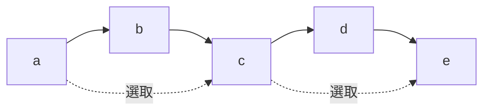
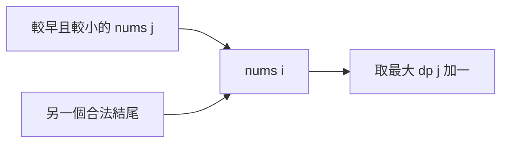
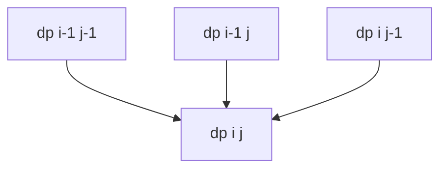
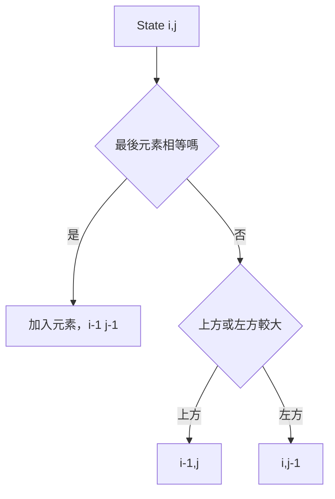
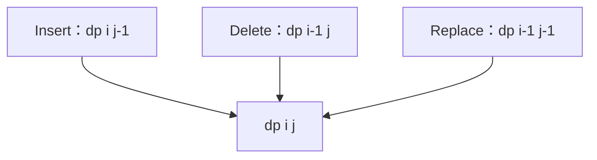
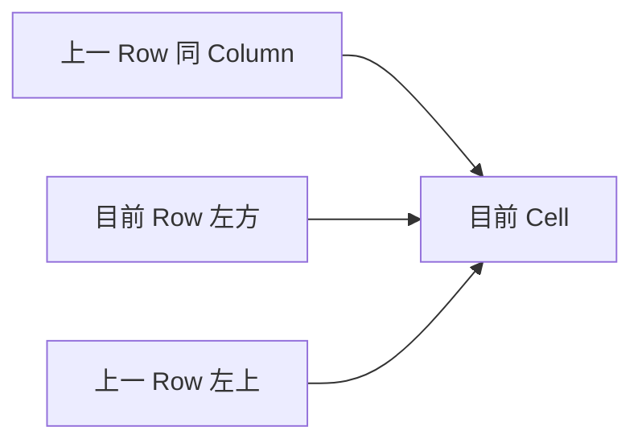
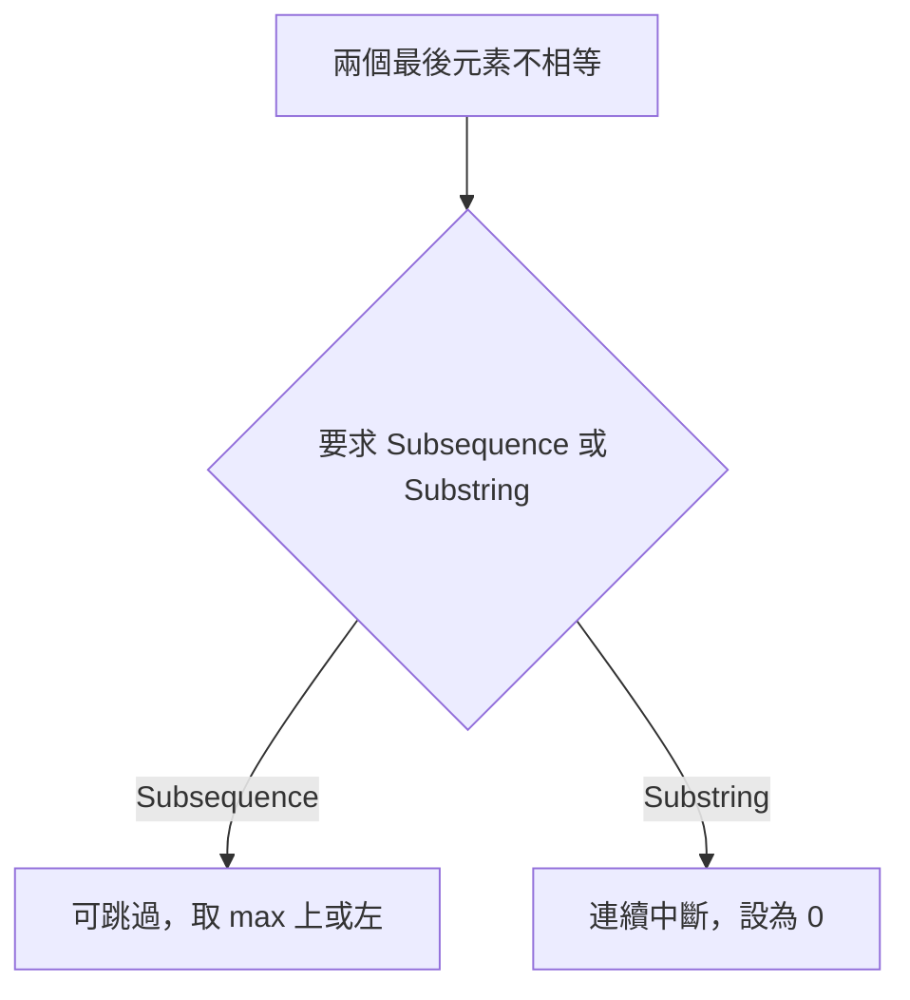

## 第 41 章　Subsequence Dynamic Programming

### 適用範圍

本章介紹 Subsequence Dynamic Programming，包括 Subsequence 與 Substring、Longest Increasing Subsequence、Longest Common Subsequence、Edit Distance、兩個 Prefix 的 State、空間改善與 Reconstruction。

Subsequence 保留原順序但可跳過元素。許多題目需要定義「目前答案是否以某個位置結尾」，或使用兩個 Prefix 描述已考慮範圍。

### 快速導覽

- [Subsequence 與 Substring](#411-subsequence-與-substring)
- [LIS 的 State](#412-lis-的-state)
- [完整案例：O(n²) LIS](#413-完整案例on²-lis)
- [LIS 的 O(n log n) 方法](#414-lis-的-on-log-n-方法)
- [LCS 的兩個 Prefix State](#415-lcs-的兩個-prefix-state)
- [完整案例：LCS](#416-完整案例lcs)
- [LCS Reconstruction](#417-lcs-reconstruction)
- [Edit Distance](#418-edit-distance)
- [完整案例：Edit Distance](#419-完整案例edit-distance)
- [空間改善](#4110-空間改善)
- [Substring 題的差異](#4111-substring-題的差異)
- [常見問題與判讀](#4112-常見問題與判讀)
- [本章檢查表](#4113-本章檢查表)
- [本章重點](#4114-本章重點)

### 41.1 Subsequence 與 Substring

- Subsequence：保留順序，但可跳過元素。
- Substring / Subarray：必須連續。

```text
"ace" 是 "abcde" 的 Subsequence
但不是 Substring
```



Subsequence DP 通常在「選目前元素」與「跳過目前元素」之間建立 Transition。

### 41.2 LIS 的 State

Longest Increasing Subsequence 的經典 O(n²) State：

```text
dp[i] = 以 nums[i] 結尾的 LIS 長度
```

Transition：

```text
dp[i] = 1 + max(dp[j])
其中 j < i 且 nums[j] < nums[i]
```



答案是所有 `dp[i]` 的最大值，不一定以最後一個元素結尾。

### 41.3 完整案例：O(n²) LIS

```cpp
#include <algorithm>
#include <vector>

int lisLength(const std::vector<int>& nums)
{
    if (nums.empty())
    {
        return 0;
    }

    std::vector<int> dp(nums.size(), 1);
    int answer = 1;

    for (int i = 0;
         i < static_cast<int>(nums.size());
         ++i)
    {
        for (int j = 0; j < i; ++j)
        {
            if (nums[j] < nums[i])
            {
                dp[i] = std::max(dp[i], dp[j] + 1);
            }
        }

        answer = std::max(answer, dp[i]);
    }

    return answer;
}
```

嚴格遞增使用 `<`；非遞減要改成 `<=`。重複值測試可直接驗證兩種語意。

Invariant：完成 Index i 後，`dp[i]` 是所有以 i 結尾的合法 Increasing Subsequence 中最大長度。

### 41.4 LIS 的 O(n log n) 方法

`tails[len - 1]` 保存目前所有長度為 len 的 Increasing Subsequence 中，最小可能結尾值。

```cpp
int lisLengthFast(const std::vector<int>& nums)
{
    std::vector<int> tails;

    for (int value : nums)
    {
        auto it = std::lower_bound(
            tails.begin(), tails.end(), value);

        if (it == tails.end())
        {
            tails.push_back(value);
        }
        else
        {
            *it = value;
        }
    }

    return static_cast<int>(tails.size());
}
```


`tails` 不一定是原輸入的一條 LIS，它是各長度最佳結尾的摘要。若要 Reconstruction，需要保存 Position、Predecessor 與每個長度的最後 Index。

### 41.5 LCS 的兩個 Prefix State

Longest Common Subsequence 對兩個序列定義：

```text
dp[i][j] = first 前 i 個元素與 second 前 j 個元素的 LCS 長度
```

Base Case：任一 Prefix 為空時，LCS 長度為 0。

若最後元素相等：

```text
dp[i][j] = dp[i-1][j-1] + 1
```

否則：

```text
dp[i][j] = max(dp[i-1][j], dp[i][j-1])
```



### 41.6 完整案例：LCS

```cpp
#include <string_view>

int lcsLength(
    std::string_view first,
    std::string_view second)
{
    std::vector<std::vector<int>> dp(
        first.size() + 1,
        std::vector<int>(second.size() + 1, 0));

    for (std::size_t i = 1; i <= first.size(); ++i)
    {
        for (std::size_t j = 1; j <= second.size(); ++j)
        {
            if (first[i - 1] == second[j - 1])
            {
                dp[i][j] = dp[i - 1][j - 1] + 1;
            }
            else
            {
                dp[i][j] = std::max(
                    dp[i - 1][j],
                    dp[i][j - 1]);
            }
        }
    }

    return dp[first.size()][second.size()];
}
```

時間 O(mn)，空間 O(mn)。此版本按 Byte 比較，不是完整 Unicode Grapheme 解法。

### 41.7 LCS Reconstruction

從 `dp[m][n]` 反向追蹤：

- 元素相等，加入答案並往左上。
- 不相等，往較大 DP 值方向。



Tie 時可得到不同但同長度的 LCS。若要求字典序最小，需要額外規則，不能任意選方向。

### 41.8 Edit Distance

State：

```text
dp[i][j] = 將 first 前 i 個 Byte 轉成 second 前 j 個 Byte 的最少操作數
```

允許 Insert、Delete、Replace。

Base Case：

```text
dp[i][0] = i
dp[0][j] = j
```

若最後元素相等：

```text
dp[i][j] = dp[i-1][j-1]
```

否則：

```text
1 + min(
    dp[i][j-1],
    dp[i-1][j],
    dp[i-1][j-1]
)
```

分別代表 Insert、Delete、Replace。



### 41.9 完整案例：Edit Distance

```cpp
int editDistance(
    std::string_view first,
    std::string_view second)
{
    std::vector<std::vector<int>> dp(
        first.size() + 1,
        std::vector<int>(second.size() + 1, 0));

    for (std::size_t i = 0; i <= first.size(); ++i)
    {
        dp[i][0] = static_cast<int>(i);
    }

    for (std::size_t j = 0; j <= second.size(); ++j)
    {
        dp[0][j] = static_cast<int>(j);
    }

    for (std::size_t i = 1; i <= first.size(); ++i)
    {
        for (std::size_t j = 1; j <= second.size(); ++j)
        {
            if (first[i - 1] == second[j - 1])
            {
                dp[i][j] = dp[i - 1][j - 1];
            }
            else
            {
                dp[i][j] = 1 + std::min({
                    dp[i][j - 1],
                    dp[i - 1][j],
                    dp[i - 1][j - 1]
                });
            }
        }
    }

    return dp[first.size()][second.size()];
}
```

操作成本若不同，Transition 應分別加上 Insert、Delete、Replace Cost。

### 41.10 空間改善

LCS 與 Edit Distance 的目前 Row 只依賴上一 Row 與目前 Row 左側，可壓縮至 O(min(m,n)) 空間。



需要暫存左上舊值，避免更新後遺失。空間改善通常會讓 Reconstruction 困難，若需輸出序列或操作步驟，應保留完整表或使用更進階的分治方法。

### 41.11 Substring 題的差異

Longest Common Substring 要求連續。若最後元素不相等，目前連續長度通常歸 0：

```text
if equal: dp[i][j] = dp[i-1][j-1] + 1
else:     dp[i][j] = 0
```

LCS 不相等時則可跳過任一側，因此取上方、左方最大值。



### 41.12 常見問題與判讀

| 現象 | 可能原因 | 第一輪檢查 |
|---|---|---|
| LIS 重複值被延長 | `<` 與 `<=` 混用 | 嚴格遞增或非遞減 |
| LIS 只看最後位置 | 忘記取所有 dp 最大值 | 答案是 `max(dp)` |
| tails 被誤當實際 LIS | State 語意錯誤 | tails 是最小結尾摘要 |
| LCS 邊界錯誤 | Prefix Index 與字串 Index 混用 | `first[i-1]`、`second[j-1]` |
| LCS 變成 Substring | 不相等時設 0 | Subsequence 應取上、左最大值 |
| Edit Distance Base Case 錯誤 | 空字串轉換成本未初始化 | `dp[i][0]=i`、`dp[0][j]=j` |
| Reconstruction 得到不同答案 | Tie 有多條最佳路徑 | 定義 Tie-breaking |
| 空間壓縮結果錯誤 | 左上舊值被覆寫 | 更新前保存 Diagonal |
| Unicode 結果不符 | 按 Byte 比較 UTF-8 | 確認文字單位 |

### 41.13 本章檢查表

- 我能區分 Subsequence 與 Substring。
- 我能定義以 Index i 結尾的 LIS State。
- 我知道嚴格遞增與非遞減的比較符號不同。
- 我能說明 `tails` 的最小結尾語意。
- 我能定義 LCS 的兩個 Prefix State。
- 我會正確處理空 Prefix Base Case。
- 我能由完整 DP Table 還原一條 LCS。
- 我能分辨 Edit Distance 的 Insert、Delete、Replace Transition。
- 我知道空間改善需保存左上舊 State。
- 我知道空間改善與 Reconstruction 之間的取捨。
- 我會確認 String 是按 Byte、Code Point 或 Grapheme 處理。

### 41.14 本章重點

- Subsequence 保留順序但可跳過元素，Substring 必須連續。
- O(n²) LIS 使用「以目前位置結尾」的 State。
- O(n log n) LIS 的 `tails` 保存各長度最小結尾，不一定是一條實際 LIS。
- LCS 使用兩個 Prefix State，元素相等取左上加一，不相等取上方與左方最大值。
- Edit Distance 由 Insert、Delete、Replace 三種操作建立 Transition。
- Reconstruction 需要完整 DP 資訊或額外 Parent、Decision。
- 一維空間改善降低記憶體，但更新順序與左上舊值必須正確管理。
- 字串 DP 的比較單位必須符合編碼需求。
