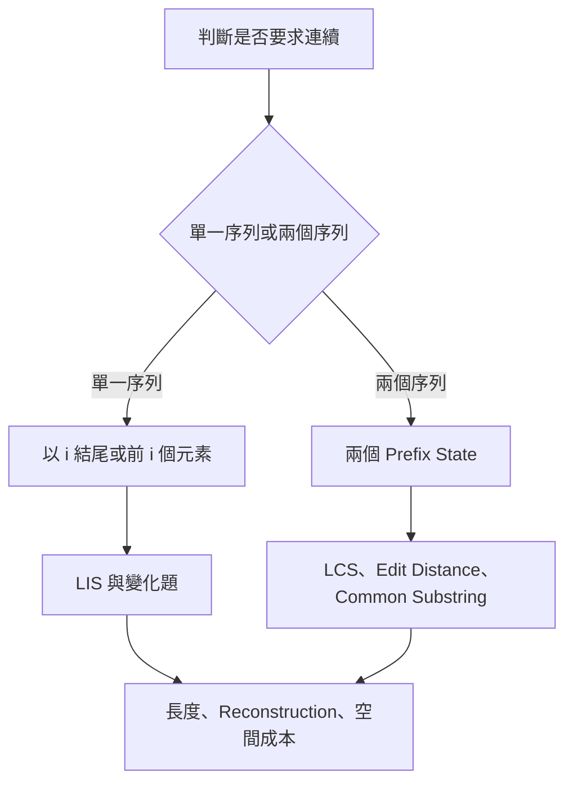
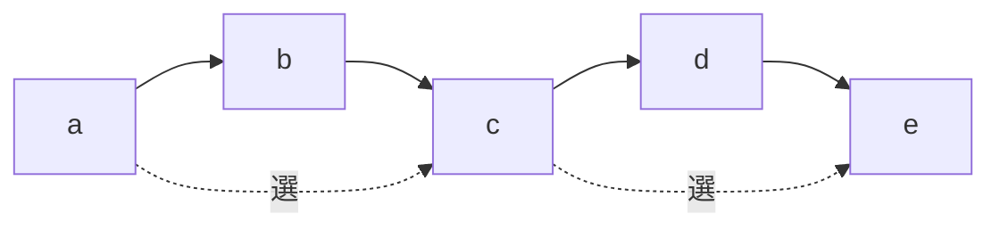
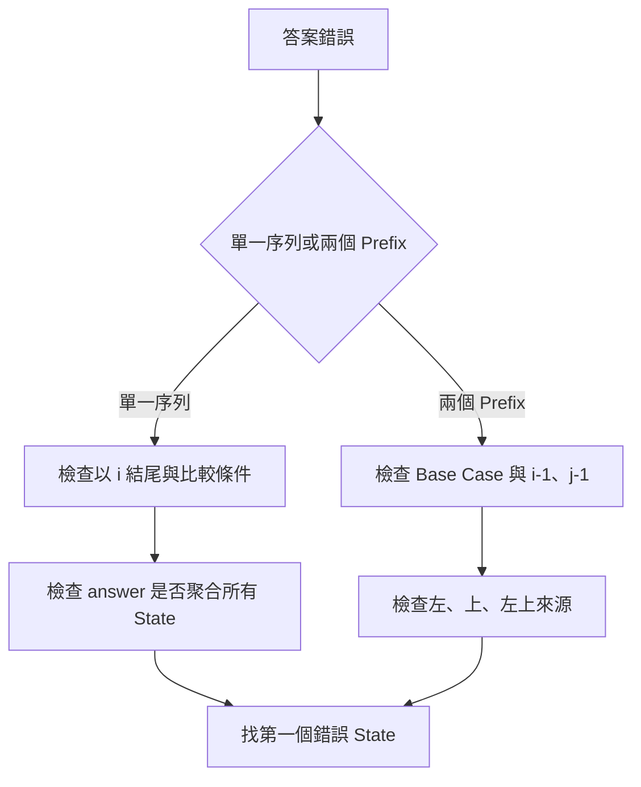

## 第 41 章　Subsequence Dynamic Programming

### 適用範圍

本章介紹 Subsequence Dynamic Programming，涵蓋 Longest Increasing Subsequence，簡稱 LIS、Longest Common Subsequence，簡稱 LCS、Edit Distance、Longest Common Substring、空間壓縮與 Reconstruction。

Subsequence 的核心特徵是：

```text
保留原本順序，但可以跳過元素。
```

這個特徵會形成兩種常見 State：

1. 單一序列中，固定答案的最後位置，例如「以 `nums[i]` 結尾」。
2. 兩個序列間，使用兩個 Prefix 描述已考慮範圍，例如「第一個序列前 `i` 個元素與第二個序列前 `j` 個元素」。

Subsequence DP 的難點通常不是二維 Table，而是：

- State 是否限制答案必須以某位置結尾。
- `i`、`j` 表示 Index，還是 Prefix Length。
- 不匹配時可以跳過哪一側。
- 嚴格遞增與非遞減使用哪個比較條件。
- 最佳長度是否足以還原實際序列。
- 空間壓縮是否覆蓋仍需使用的左上 State。
- 字串比較單位是 Byte、Code Point，還是 Grapheme Cluster。

本章使用以下分析流程：

1. 判斷題目要求 Subsequence 還是連續的 Substring / Subarray。
2. 判斷是單一序列還是兩個序列。
3. 用完整句子定義 State。
4. 設定空 Prefix、單一元素或其他 Base Case。
5. 從最後元素是否被使用推導 Transition。
6. 安排能先完成依賴 State 的計算順序。
7. 確認答案位於單一 State，還是需要聚合所有 State。
8. 視需求保存 Predecessor、Parent 或完整 Table。



### 適用讀者

- 已理解基本一維 DP，但不熟悉 Subsequence State 的讀者。
- 容易混淆 Subsequence、Substring 與 Subarray 的讀者。
- 看得懂 LIS、LCS 程式，卻說不清 State Definition 的讀者。
- 想理解 `tails` 為何不是一條實際 LIS 的讀者。
- 想從 DP Table 還原 LCS 或 Edit Distance 操作的讀者。
- 想理解空間壓縮、更新順序與 Reconstruction 取捨的讀者。

### 快速導覽

- [41.1 Subsequence 與連續區間](#411-subsequence-與連續區間)
- [41.2 常見 State 類型](#412-常見-state-類型)
- [41.3 完整案例：O(n²) LIS](#413-完整案例on²-lis)
- [41.4 O(n log n) LIS 與 tails](#414-on-log-n-lis-與-tails)
- [41.5 LIS Reconstruction](#415-lis-reconstruction)
- [41.6 LCS 的兩個 Prefix State](#416-lcs-的兩個-prefix-state)
- [41.7 完整案例：LCS](#417-完整案例lcs)
- [41.8 LCS Reconstruction 與 Tie-breaking](#418-lcs-reconstruction-與-tie-breaking)
- [41.9 Edit Distance 的 State 與操作](#419-edit-distance-的-state-與操作)
- [41.10 完整案例：Edit Distance](#4110-完整案例edit-distance)
- [41.11 Edit Distance Reconstruction](#4111-edit-distance-reconstruction)
- [41.12 空間壓縮與更新順序](#4112-空間壓縮與更新順序)
- [41.13 Longest Common Substring](#4113-longest-common-substring)
- [41.14 常見變化題](#4114-常見變化題)
- [41.15 複雜度與輸出成本](#4115-複雜度與輸出成本)
- [41.16 文字編碼與比較單位](#4116-文字編碼與比較單位)
- [41.17 系統化 Debug](#4117-系統化-debug)
- [41.18 常見問題與判讀](#4118-常見問題與判讀)
- [41.19 本章檢查表](#4119-本章檢查表)
- [41.20 本章重點](#4120-本章重點)

### 41.1 Subsequence 與連續區間

#### Subsequence

Subsequence 保留元素相對順序，但可跳過任意元素。

```text
"ace" 是 "abcde" 的 Subsequence
```

因為可以選擇 Index 0、2、4，而且順序仍為 `a -> c -> e`。

#### Substring / Subarray

Substring 與 Subarray 必須連續。

```text
"bcd" 是 "abcde" 的 Substring
"ace" 不是 "abcde" 的 Substring
```



| 項目 | Subsequence | Substring / Subarray |
|---|---|---|
| 保留原順序 | 是 | 是 |
| 必須連續 | 否 | 是 |
| 可跳過元素 | 是 | 否 |
| 不匹配時 | 常可跳過一側 | 目前連續關係通常中斷 |
| 常見題目 | LIS、LCS、Distinct Subsequences | Longest Common Substring、Maximum Subarray |

Subsequence DP 常在「使用目前元素」與「跳過目前元素」之間組合答案。連續題則常需要以目前位置結尾，並在不相容時重啟或歸零。

### 41.2 常見 State 類型

#### 以位置 `i` 結尾

```text
dp[i] = 以 nums[i] 作為最後一個元素的最佳答案
```

這種 State 固定了最後元素，因此可以判斷較早元素能否接在它前面。LIS 是代表案例。

答案通常不是 `dp[n - 1]`，而是：

```text
max(dp[0], dp[1], ..., dp[n - 1])
```

因為最佳 Subsequence 不一定以最後一個輸入元素結尾。

#### 前 `i` 個元素

```text
dp[i] = 考慮前 i 個元素時的答案
```

這裡的目前元素通常是 `data[i - 1]`，而 `dp[0]` 表示空 Prefix。

這種 State 適合「選或不選目前元素」且不必知道實際結尾值的問題。若下一步是否合法取決於最後值，單一 Prefix 最佳值可能不夠完整。

#### 兩個 Prefix

```text
dp[i][j]
= first 前 i 個元素與 second 前 j 個元素的答案
```

實際最後元素為：

```text
first[i - 1]
second[j - 1]
```

Table 通常為 `(m + 1) × (n + 1)`，讓空 Prefix 成為自然 Base Case。LCS 與 Edit Distance 都使用這種模型。

### 41.3 完整案例：O(n²) LIS

#### 問題規格

Longest Increasing Subsequence 要在保留原順序的前提下，找出最長的嚴格遞增 Subsequence 長度。

#### State

```text
dp[i] = 以 nums[i] 結尾的 LIS 長度
```

#### Base Case

任一單一元素本身都是長度 1 的 Increasing Subsequence：

```text
dp[i] = 1
```

#### Transition

若 `j < i` 且：

```text
nums[j] < nums[i]
```

則任何以 `nums[j]` 結尾的 Increasing Subsequence 都可接上 `nums[i]`：

```text
dp[i] = max(dp[i], dp[j] + 1)
```

#### 答案

```text
answer = max over all i dp[i]
```

#### C++20 實作

```cpp
#include <algorithm>
#include <vector>

int lisLength(const std::vector<int>& nums) {
    const int n = static_cast<int>(nums.size());

    if (n == 0) {
        return 0;
    }

    std::vector<int> dp(n, 1);
    int answer = 1;

    for (int i = 0; i < n; ++i) {
        for (int j = 0; j < i; ++j) {
            if (nums[j] < nums[i]) {
                dp[i] = std::max(
                    dp[i],
                    dp[j] + 1);
            }
        }

        answer = std::max(answer, dp[i]);
    }

    return answer;
}
```

#### Loop Invariant

完成 Index `i` 後：

```text
dp[i]
是所有以 nums[i] 結尾的嚴格遞增 Subsequence 中，
最大的長度。
```

因為所有可能倒數第二個位置 `j < i` 都已被枚舉。

#### 嚴格遞增與非遞減

- 嚴格遞增：`nums[j] < nums[i]`
- 非遞減：`nums[j] <= nums[i]`

`[2, 2, 2]` 是最直接的語意測試：嚴格遞增答案為 1，非遞減答案為 3。

#### 複雜度

- 時間複雜度 O(n²)。
- DP 空間 O(n)。

### 41.4 O(n log n) LIS 與 `tails`

O(n log n) 方法維護：

```text
tails[length - 1]
= 目前已看過的所有長度為 length 的嚴格遞增 Subsequence 中，
  最小可能的結尾值
```

較小的結尾值更容易接上未來元素，因此只需保存每個長度的最佳結尾摘要。

#### C++20 實作

```cpp
#include <algorithm>
#include <vector>

int lisLengthFast(const std::vector<int>& nums) {
    std::vector<int> tails;

    for (int value : nums) {
        const auto it = std::lower_bound(
            tails.begin(),
            tails.end(),
            value);

        if (it == tails.end()) {
            tails.push_back(value);
        } else {
            *it = value;
        }
    }

    return static_cast<int>(tails.size());
}
```

#### 為什麼使用 `lower_bound`

嚴格遞增 LIS 使用第一個 `>= value` 的位置：

- 若不存在，`value` 可延長目前最長長度。
- 若存在，以 `value` 取代該位置，可得到相同長度但更小或相同的結尾。

非遞減 Subsequence 通常改用 `upper_bound`，也就是第一個 `> value` 的位置。

#### `tails` 不是實際 LIS

`tails` 中不同位置的值可能來自不同時間與不同 Subsequence。替換某個結尾時，不保證整個 Array 仍對應原輸入中的一條合法 Subsequence。

因此：

```text
tails.size() 是 LIS 長度
tails 內容不一定是一條 LIS
```

若要還原實際序列，需要保存 Index 與 Predecessor。

### 41.5 LIS Reconstruction

#### 需要保存的資訊

- `predecessor[i]`：最佳路徑中，`nums[i]` 的前一個 Index。
- `tailsIndex[length - 1]`：目前該長度最佳結尾所在的 Index。
- `tailsValue`：供 Binary Search 使用的最小結尾值。

#### C++20 實作

```cpp
#include <algorithm>
#include <vector>

std::vector<int> reconstructLis(
    const std::vector<int>& nums) {

    const int n = static_cast<int>(nums.size());

    if (n == 0) {
        return {};
    }

    std::vector<int> tailsValue;
    std::vector<int> tailsIndex;
    std::vector<int> predecessor(n, -1);

    for (int i = 0; i < n; ++i) {
        const auto it = std::lower_bound(
            tailsValue.begin(),
            tailsValue.end(),
            nums[i]);

        const int lengthIndex =
            static_cast<int>(it - tailsValue.begin());

        if (lengthIndex > 0) {
            predecessor[i] = tailsIndex[lengthIndex - 1];
        }

        if (it == tailsValue.end()) {
            tailsValue.push_back(nums[i]);
            tailsIndex.push_back(i);
        } else {
            *it = nums[i];
            tailsIndex[lengthIndex] = i;
        }
    }

    std::vector<int> answer;
    int current = tailsIndex.back();

    while (current != -1) {
        answer.push_back(nums[current]);
        current = predecessor[current];
    }

    std::reverse(answer.begin(), answer.end());
    return answer;
}
```

此版本回傳其中一條 LIS。若有多條同長最佳解，而且題目要求字典序最小、Index 序列最小或其他規則，需要額外設計 Tie-breaking。只比較結尾值不一定足以滿足所有輸出規格。

### 41.6 LCS 的兩個 Prefix State

Longest Common Subsequence 比較兩個序列，要求找出同時為兩者 Subsequence 的最長長度。

#### State

```text
dp[i][j]
= first 前 i 個 Byte 與 second 前 j 個 Byte 的 LCS 長度
```

#### Base Case

任一側為空 Prefix 時，LCS 長度為 0：

```text
dp[0][j] = 0
dp[i][0] = 0
```

#### 最後元素相等

若：

```text
first[i - 1] == second[j - 1]
```

這個共同元素可以接在兩個較短 Prefix 的 LCS 後面：

```text
dp[i][j] = dp[i - 1][j - 1] + 1
```

#### 最後元素不相等

共同 Subsequence 不可能同時使用這兩個不同的最後元素，因此至少跳過其中一側：

```text
dp[i][j] = max(
    dp[i - 1][j],
    dp[i][j - 1]
)
```

### 41.7 完整案例：LCS

#### C++20 實作

```cpp
#include <algorithm>
#include <string_view>
#include <vector>

std::vector<std::vector<int>> buildLcsTable(
    std::string_view first,
    std::string_view second) {

    std::vector<std::vector<int>> dp(
        first.size() + 1,
        std::vector<int>(second.size() + 1, 0));

    for (std::size_t i = 1; i <= first.size(); ++i) {
        for (std::size_t j = 1; j <= second.size(); ++j) {
            if (first[i - 1] == second[j - 1]) {
                dp[i][j] = dp[i - 1][j - 1] + 1;
            } else {
                dp[i][j] = std::max(
                    dp[i - 1][j],
                    dp[i][j - 1]);
            }
        }
    }

    return dp;
}

int lcsLength(
    std::string_view first,
    std::string_view second) {

    const auto dp = buildLcsTable(first, second);
    return dp[first.size()][second.size()];
}
```

#### 填表 Invariant

計算 `dp[i][j]` 前：

- `dp[i - 1][j]` 已完成。
- `dp[i][j - 1]` 已完成。
- `dp[i - 1][j - 1]` 已完成。

因此由上到下、每列由左到右的順序合法。

#### 複雜度

設兩字串長度為 `m`、`n`：

- 時間複雜度 O(mn)。
- 空間複雜度 O(mn)。

### 41.8 LCS Reconstruction 與 Tie-breaking

從 `dp[m][n]` 反向追蹤：

1. 若最後元素相等，該元素可加入答案，往左上走。
2. 若不相等，往 DP 值較大的上方或左方走。

```cpp
#include <algorithm>
#include <string>
#include <string_view>
#include <vector>

std::string reconstructLcs(
    std::string_view first,
    std::string_view second,
    const std::vector<std::vector<int>>& dp) {

    std::string answer;
    std::size_t i = first.size();
    std::size_t j = second.size();

    while (i > 0 && j > 0) {
        if (first[i - 1] == second[j - 1]) {
            answer.push_back(first[i - 1]);
            --i;
            --j;
        } else if (dp[i - 1][j] >= dp[i][j - 1]) {
            --i;
        } else {
            --j;
        }
    }

    std::reverse(answer.begin(), answer.end());
    return answer;
}
```

當上方與左方值相等時，可能存在多條同長 LCS。上述版本優先往上，只保證回傳一條合法 LCS，不保證字典序最小。

若要求字典序最小 LCS，單純在 Tie 時固定往上或往左通常不足，需要更完整的 String Comparison、Memoized Reconstruction 或 Next-occurrence Structure。

### 41.9 Edit Distance 的 State 與操作

Edit Distance 計算把 `first` 轉成 `second` 所需的最少操作數。本節允許：

- Insert
- Delete
- Replace

每種操作成本皆為 1。

#### State

```text
dp[i][j]
= 將 first 前 i 個 Byte 轉成 second 前 j 個 Byte 的最少操作數
```

#### Base Case

```text
dp[i][0] = i
dp[0][j] = j
```

將長度 `i` 的 Prefix 轉成空字串需要刪除 `i` 次；空字串轉成長度 `j` 的 Prefix 需要插入 `j` 次。

#### 最後元素相等

```text
dp[i][j] = dp[i - 1][j - 1]
```

#### 最後元素不同

```text
dp[i][j] = 1 + min(
    dp[i][j - 1],      // Insert
    dp[i - 1][j],      // Delete
    dp[i - 1][j - 1]   // Replace
)
```

操作名稱是從「把 first 轉成 second」的方向解釋。若反向閱讀 Table，Insert 與 Delete 的敘述也會對調，因此 Reconstruction 時要固定方向。

### 41.10 完整案例：Edit Distance

```cpp
#include <algorithm>
#include <string_view>
#include <vector>

std::vector<std::vector<int>> buildEditDistanceTable(
    std::string_view first,
    std::string_view second) {

    std::vector<std::vector<int>> dp(
        first.size() + 1,
        std::vector<int>(second.size() + 1, 0));

    for (std::size_t i = 0; i <= first.size(); ++i) {
        dp[i][0] = static_cast<int>(i);
    }

    for (std::size_t j = 0; j <= second.size(); ++j) {
        dp[0][j] = static_cast<int>(j);
    }

    for (std::size_t i = 1; i <= first.size(); ++i) {
        for (std::size_t j = 1; j <= second.size(); ++j) {
            if (first[i - 1] == second[j - 1]) {
                dp[i][j] = dp[i - 1][j - 1];
            } else {
                dp[i][j] = 1 + std::min({
                    dp[i][j - 1],
                    dp[i - 1][j],
                    dp[i - 1][j - 1]
                });
            }
        }
    }

    return dp;
}

int editDistance(
    std::string_view first,
    std::string_view second) {

    const auto dp = buildEditDistanceTable(first, second);
    return dp[first.size()][second.size()];
}
```

若 Insert、Delete、Replace 成本不同，Transition 必須分別加上對應成本，Base Case 也要使用累積 Insert / Delete 成本，而不是固定等於 Prefix Length。

#### 複雜度

- 時間複雜度 O(mn)。
- 空間複雜度 O(mn)。

### 41.11 Edit Distance Reconstruction

可定義操作：

```cpp
enum class EditType {
    Match,
    Insert,
    Delete,
    Replace
};
```

回溯 `dp[i][j]` 時：

- 字元相等且來源為左上，記錄 Match。
- `dp[i][j] == dp[i][j - 1] + 1`，記錄 Insert。
- `dp[i][j] == dp[i - 1][j] + 1`，記錄 Delete。
- `dp[i][j] == dp[i - 1][j - 1] + 1`，記錄 Replace。

多個條件可能同時成立，代表存在多組最短操作序列。若輸出必須固定，需要定義 Insert、Delete、Replace 的優先順序，或依操作內容進行更完整比較。

回溯得到的操作通常是由後往前，需要反轉後再套用。若要輸出實際位置，還要明確定義 Position 是相對原字串、目前修改後字串，還是 DP Prefix。

### 41.12 空間壓縮與更新順序

LCS 與 Edit Distance 的目前 Cell 只依賴：

- 上方：上一列同一欄。
- 左方：目前列前一欄。
- 左上：上一列前一欄。

因此可壓縮成一列，但必須保存左上舊值。

#### LCS 一列版本

```cpp
#include <algorithm>
#include <string_view>
#include <utility>
#include <vector>

int lcsLengthCompressed(
    std::string_view first,
    std::string_view second) {

    if (second.size() > first.size()) {
        std::swap(first, second);
    }

    std::vector<int> dp(second.size() + 1, 0);

    for (std::size_t i = 1; i <= first.size(); ++i) {
        int diagonal = 0;

        for (std::size_t j = 1; j <= second.size(); ++j) {
            const int oldAbove = dp[j];

            if (first[i - 1] == second[j - 1]) {
                dp[j] = diagonal + 1;
            } else {
                dp[j] = std::max(dp[j], dp[j - 1]);
            }

            diagonal = oldAbove;
        }
    }

    return dp[second.size()];
}
```

每輪內層迴圈開始時：

```text
diagonal = 舊 dp[i - 1][j - 1]
dp[j] = 舊 dp[i - 1][j]
dp[j - 1] = 新 dp[i][j - 1]
```

更新後才能令 `diagonal = oldAbove`，供下一欄使用。

#### 壓縮的取捨

- 只求長度或成本時，空間可降為 O(min(m, n))。
- 需要直接回溯序列或操作時，完整 Table 比較簡單。
- 進階方法可以在低空間下 Reconstruction，但推導與程式會更複雜。

### 41.13 Longest Common Substring

Longest Common Substring 要求連續，因此 State 不同於 LCS。

#### State

```text
dp[i][j]
= 以 first[i - 1] 與 second[j - 1] 結尾的
  Longest Common Substring 長度
```

#### Transition

```text
若最後 Byte 相同：
    dp[i][j] = dp[i - 1][j - 1] + 1
否則：
    dp[i][j] = 0
```

不匹配時歸 0，因為以目前兩位置結尾的連續共同區段已中斷。

#### C++20 實作

```cpp
#include <algorithm>
#include <string_view>
#include <vector>

int longestCommonSubstringLength(
    std::string_view first,
    std::string_view second) {

    std::vector<std::vector<int>> dp(
        first.size() + 1,
        std::vector<int>(second.size() + 1, 0));

    int answer = 0;

    for (std::size_t i = 1; i <= first.size(); ++i) {
        for (std::size_t j = 1; j <= second.size(); ++j) {
            if (first[i - 1] == second[j - 1]) {
                dp[i][j] = dp[i - 1][j - 1] + 1;
                answer = std::max(answer, dp[i][j]);
            }
        }
    }

    return answer;
}
```

答案是所有 Cell 的最大值，不一定位於右下角。

### 41.14 常見變化題

#### Longest Non-decreasing Subsequence

- O(n²)：比較條件改為 `nums[j] <= nums[i]`。
- O(n log n)：通常使用 `upper_bound`。

#### Number of LIS

每個位置需要兩項資訊：

```text
length[i] = 以 i 結尾的 LIS 最大長度
count[i] = 以 i 結尾且長度為 length[i] 的方法數
```

找到更長 Candidate 時，覆蓋 Length 與 Count；找到相同 Length 時，累加 Count。最後只加總具有全域最大 Length 的位置。

#### Shortest Common Supersequence

只求長度時：

```text
SCS Length
= first.length + second.length - LCS Length
```

要還原實際 SCS，可沿 LCS Table 回溯，將被跳過的兩側元素依序加入。

#### Distinct Subsequences

```text
dp[i][j]
= source 前 i 個元素中，形成 target 前 j 個元素的方法數
```

若最後元素相等，可選或不選 Source 的目前元素；若不相等，只能跳過 Source 目前元素。方法數容易 Overflow，需依題目規格選型別或 Modulo。

#### Weighted Edit Distance

每種操作成本不同時，State 不變，但每條 Transition 加上不同 Cost。若允許 Transposition，則需要額外 Transition，並確認它使用的 Prefix 範圍。

### 41.15 複雜度與輸出成本

| 題型 | 時間 | DP 空間 |
|---|---:|---:|
| O(n²) LIS | O(n²) | O(n) |
| Binary Search LIS | O(n log n) | O(n) |
| LCS | O(mn) | O(mn) 或壓縮為 O(min(m,n)) |
| Edit Distance | O(mn) | O(mn) 或壓縮為 O(min(m,n)) |
| Longest Common Substring | O(mn) | O(mn)，也可壓縮 |

Reconstruction 還要計入輸出長度與 Parent / Predecessor 空間。若題目要求列出所有最佳 Subsequence，輸出數量本身可能很大，不能只報告單一路徑 DP 的成本。

### 41.16 文字編碼與比較單位

本章使用 `std::string_view` 的範例都按 Byte 比較。

UTF-8 中：

- 一個 Code Point 可能包含多個 Bytes。
- 一個使用者看到的文字單位，也就是 Grapheme Cluster，可能包含多個 Code Points。

因此 Byte-based LCS 或 Edit Distance 不一定等同於使用者認知的字元距離。

正式需求應先選定單位：

- Byte
- Unicode Code Point
- Grapheme Cluster
- 正規化後的文字單位

若兩個視覺相同字串使用不同 Unicode Normalization，逐 Byte 或逐 Code Point 比較也可能得到不同答案。編碼處理屬於輸入模型的一部分，不是 DP 自動解決的問題。

### 41.17 系統化 Debug

#### LIS 記錄欄位

```text
i
nums[i]
所有合法 j < i
dp[j]
candidate = dp[j] + 1
dp[i] 更新前後
全域 answer
```

#### LCS / Edit Distance 記錄欄位

```text
i, j
first[i - 1]
second[j - 1]
左上 dp[i - 1][j - 1]
上方 dp[i - 1][j]
左方 dp[i][j - 1]
本次 Transition
dp[i][j]
```

#### 壓縮版本記錄欄位

```text
diagonal
oldAbove = dp[j] 更新前
dp[j - 1] 目前列左方
dp[j] 更新後
```

#### 建議排查順序

1. 重新寫出 State Definition。
2. 確認 `i`、`j` 是 Index 還是 Prefix Length。
3. 手算空輸入與單一元素。
4. LIS 檢查答案是否取所有 `dp[i]` 最大值。
5. LCS 檢查不匹配時是否真的可跳過一側。
6. Edit Distance 先驗證第一列與第一欄。
7. 空間壓縮先還原成完整 Table 比較。
8. Reconstruction 檢查每一步是否保持最佳值。
9. 用小輸入和暴力枚舉比對。
10. 保留第一個不符合 State Definition 的 Cell。



### 41.18 常見問題與判讀

| 現象 | 可能原因 | 第一輪檢查 |
|---|---|---|
| LIS 重複值被延長 | `<` 與 `<=` 混用 | 題目是嚴格遞增或非遞減 |
| LIS 只看最後位置 | 誤把答案當成 `dp[n - 1]` | 取所有 `dp[i]` 最大值 |
| `tails` 不是合法 Subsequence | 將摘要誤當實際路徑 | Reconstruction 要保存 Index 與 Predecessor |
| LCS 邊界錯位 | Prefix Length 與 Index 混用 | 使用 `first[i - 1]`、`second[j - 1]` |
| LCS 變成 Common Substring | 不匹配時把 Cell 設為 0 | LCS 應取上方與左方最大值 |
| Common Substring 答案漏掉 | 只回傳右下角 | 取所有 Cell 的最大值 |
| Edit Distance 空字串錯誤 | 第一列、第一欄未初始化 | `dp[i][0]=i`、`dp[0][j]=j` |
| Edit 操作名稱對不上 | 轉換方向不一致 | 固定從 First 轉成 Second 解釋 |
| Reconstruction 結果不同 | 存在多條同值最佳路徑 | 定義 Tie-breaking |
| 壓縮後答案錯誤 | 左上舊值被覆蓋 | 更新前保存 `oldAbove` |
| Unicode 結果不符預期 | 以 Byte 比較 UTF-8 | 先定義 Code Point 或 Grapheme 單位 |
| 方法數變成負數或異常值 | Integer Overflow | 檢查型別與 Modulo 規格 |

### 41.19 本章檢查表

- 我能區分 Subsequence 與連續 Substring / Subarray。
- 我能定義「以 Index `i` 結尾」的 State。
- 我知道 LIS 的答案不一定以最後元素結尾。
- 我能區分嚴格遞增與非遞減的比較條件。
- 我能說明 `tails` 的最小結尾語意。
- 我知道 `tails` 不一定是一條實際 LIS。
- 我能使用 Predecessor 還原一條 LIS。
- 我能定義 LCS 的兩個 Prefix State。
- 我會正確處理空 Prefix Base Case。
- 我能解釋 LCS 不匹配時為何可跳過一側。
- 我能從完整 Table 還原一條 LCS。
- 我能分辨 Edit Distance 的 Insert、Delete、Replace Transition。
- 我知道操作回溯可能有多個同值選擇。
- 我能說明 Common Substring 不匹配時為何歸 0。
- 我知道壓縮一列時要保存左上舊 State。
- 我能分析空間壓縮與 Reconstruction 的取捨。
- 我會確認文字是按 Byte、Code Point 或 Grapheme 比較。
- 我會逐 Cell 尋找第一個不符合 State Definition 的位置。

### 41.20 本章重點

- Subsequence 保留原順序但可跳過元素；Substring 與 Subarray 必須連續。
- 單一序列常使用「以目前位置結尾」的 State。
- 兩個序列比較常使用兩個 Prefix State。
- O(n²) LIS 枚舉所有合法前驅，答案是所有結尾 State 的最大值。
- O(n log n) LIS 的 `tails` 保存各長度的最小可能結尾，不是實際路徑。
- LIS Reconstruction 需要 Index 與 Predecessor。
- LCS 最後元素相等時取左上加一，不相等時可跳過任一側。
- Edit Distance 使用 Insert、Delete、Replace 的最小成本建立 Transition。
- Longest Common Substring 要求連續，不匹配時目前結尾長度歸 0。
- 空間壓縮需同時保留上方、左方與左上舊值的語意。
- 最佳值不一定足以還原答案，必要時應保存 Parent 或完整 Table。
- Tie-breaking、Overflow、Modulo 與文字編碼都屬於題目規格的一部分。
- Debug 時應先確認 State 與 Index 語意，再找第一個錯誤 Cell。
