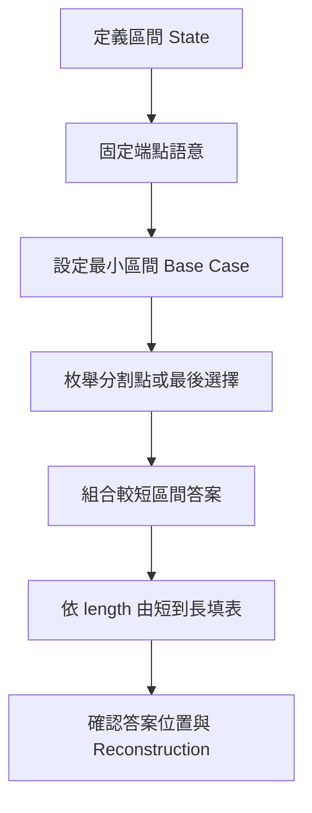
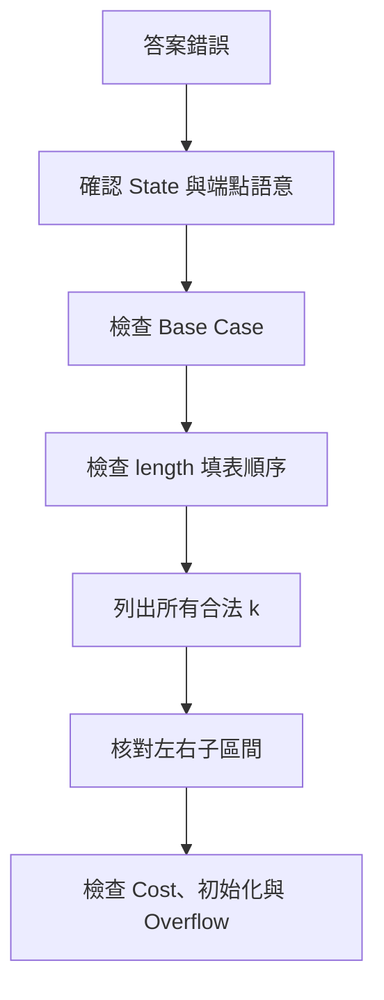

## 第 42 章　Interval Dynamic Programming

### 適用範圍

本章介紹 Interval Dynamic Programming，簡稱 Interval DP。這類問題以一段連續區間作為 State，常見於矩陣括號化、相鄰合併、Palindrome、Burst Balloons、Optimal Binary Search Tree 與區間計數。

Interval DP 的難點通常不是二維 Array，而是把區間語意與「最後一步」說清楚：

- `dp[left][right]` 包含哪些元素？
- 使用閉區間、半開區間，還是 Open Interval？
- 最小可直接回答的區間是什麼？
- `k` 表示切割位置，還是最後被選的元素？
- 左右子區間如何組合？
- 本次合併成本在什麼時候加入？
- 為什麼計算順序能保證相依 State 已完成？

本章會建立以下固定流程：

1. 用完整句子定義區間 State。
2. 固定端點是否包含。
3. 設定空區間、單一元素或相鄰端點的 Base Case。
4. 從最後一次合併、最後一次選擇或內部區間推導 Transition。
5. 依區間長度由短到長填表。
6. 確認 `left`、`right` 與 `k` 的合法範圍。
7. 分析 State 數量與每個 State 的 Transition 成本。
8. 視需求保存分割點，以還原括號化或選擇順序。



### 適用讀者

- 已理解一維與 Grid DP，但不熟悉以區間作為 State 的讀者。
- 容易混淆 Closed、Half-open 與 Open Interval 的讀者。
- 看得懂三層迴圈，卻不清楚填表順序與 `k` 範圍的讀者。
- 想理解 Matrix Chain Multiplication、Palindrome DP、Stone Merge 與 Burst Balloons 的讀者。
- 常在最小區間、初始化、Overflow 或 Reconstruction 上出錯的讀者。

### 快速導覽

- [42.1 Interval DP 前到底要分析什麼](#421-interval-dp-前到底要分析什麼)
- [42.2 區間 State 與端點語意](#422-區間-state-與端點語意)
- [42.3 為什麼依區間長度填表](#423-為什麼依區間長度填表)
- [42.4 分割點與最後一步](#424-分割點與最後一步)
- [42.5 完整案例：Matrix Chain Multiplication](#425-完整案例matrix-chain-multiplication)
- [42.6 完整案例：Palindrome Table](#426-完整案例palindrome-table)
- [42.7 完整案例：Burst Balloons](#427-完整案例burst-balloons)
- [42.8 Stone Merge 與 Prefix Sum](#428-stone-merge-與-prefix-sum)
- [42.9 計數型與 Boolean Interval DP](#429-計數型與-boolean-interval-dp)
- [42.10 初始化與不可達 State](#4210-初始化與不可達-state)
- [42.11 Reconstruction 與 Tie-breaking](#4211-reconstruction-與-tie-breaking)
- [42.12 複雜度分析](#4212-複雜度分析)
- [42.13 系統化 Debug](#4213-系統化-debug)
- [42.14 常見問題與判讀](#4214-常見問題與判讀)
- [42.15 本章檢查表](#4215-本章檢查表)
- [42.16 本章重點](#4216-本章重點)

### 42.1 Interval DP 前到底要分析什麼

假設有一段資料，需要決定不同合併順序的最低成本。

第一步先整理：

<table>
<tr><th>分析項目</th><th>要回答的問題</th><th>常見錯誤</th></tr>
<tr><td>State</td><td>`dp[left][right]` 表示哪一段區間的答案？</td><td>只寫「區間答案」，但沒有定義端點</td></tr>
<tr><td>區間語意</td><td>使用 `[left, right]` 還是 `[left, right)`？</td><td>轉移時混用閉區間與半開區間</td></tr>
<tr><td>最小區間</td><td>空區間、單一元素、長度 2 的答案是什麼？</td><td>讀到不存在的內部區間</td></tr>
<tr><td>分割方式</td><td>完整區間可以在哪些位置切開？</td><td>`k` 範圍多一格或少一格</td></tr>
<tr><td>組合方式</td><td>左右答案如何加上本次成本？</td><td>忘記本次合併成本</td></tr>
<tr><td>目標</td><td>取最小、最大、計數或 Boolean？</td><td>初始化值不符合語意</td></tr>
</table>

### 42.2 區間 State 與端點語意

State Definition 必須同時說明區間內容與答案語意。

不完整的定義：

```text
dp[left][right] = 區間答案
```

較完整的定義：

```text
dp[left][right]
= 將矩陣 left 到 right 完成相乘時，
  所需的最低純量乘法次數
```

#### Closed Interval `[left, right]`

- 包含 `left`。
- 包含 `right`。
- 長度為 `right - left + 1`。
- 單一元素為 `left == right`。
- 切割後常為 `[left, k]` 與 `[k + 1, right]`。

#### Half-open Interval `[left, right)`

- 包含 `left`。
- 不包含 `right`。
- 長度為 `right - left`。
- 空區間為 `left == right`。
- 單一元素為 `right == left + 1`。
- 切割後常為 `[left, k)` 與 `[k, right)`。

#### Open Interval `(left, right)`

Open Interval 不包含兩端，適合把端點視為固定邊界。例如 Burst Balloons：

```text
dp[left][right]
= 戳破 left 與 right 之間所有氣球的最高分數
```

此時 `(left, right)` 為空的條件是：

```text
right == left + 1
```

| 表示方式 | 包含端點 | 長度或空區間 | 常見用途 |
|---|---|---|---|
| `[left, right]` | 兩端皆包含 | 長度 `right - left + 1` | Matrix Chain、Stone Merge、Palindrome |
| `[left, right)` | 不包含右端 | 長度 `right - left` | Iterator 風格區間 |
| `(left, right)` | 兩端皆不包含 | `right == left + 1` 時為空 | Burst Balloons 的固定邊界 |

同一份程式中不能混用不同端點語意。State、Base Case、`k` 範圍、答案位置與 Debug 輸出都必須一致。

### 42.3 為什麼依區間長度填表

若 Closed Interval State 使用：

```text
dp[left][k]
dp[k + 1][right]
```

兩個子區間都比 `[left, right]` 短。因此 Bottom-up 通常依 `length` 由小到大計算：

```cpp
for (int length = 1; length <= n; ++length) {
    for (int left = 0;
         left + length - 1 < n;
         ++left) {

        const int right = left + length - 1;
        // compute dp[left][right]
    }
}
```


#### 填表 Invariant

開始處理長度 `length` 前：

```text
所有長度小於 length 的合法區間都已完成。
```

因此 Transition 使用的左右子區間或內部區間都可以直接讀取。

有些 Interval DP 也可以使用 Top-down Memoization。Top-down 不必手動安排 `length` 迴圈，但遞迴函式仍須保證每次呼叫的區間更小，並處理 Recursive Stack 與 Memo Sentinel。

### 42.4 分割點與最後一步

Interval DP 常透過「最後一步」建立互不漏失的候選集合。

#### `k` 是切割位置

對 Closed Interval `[left, right]`：

```text
[left, k]
[k + 1, right]
```

合法範圍為：

```text
left <= k < right
```

常見於 Matrix Chain 與 Stone Merge。

```cpp
for (int k = left; k < right; ++k) {
    const long long candidate =
        dp[left][k]
        + dp[k + 1][right]
        + combineCost(left, k, right);
}
```

#### `k` 是最後被選的元素

若 `k` 是最後被處理的內部元素，左右子問題可能是：

```text
(left, k)
(k, right)
```

或：

```text
[left, k - 1]
[k + 1, right]
```

取決於 State Definition。Burst Balloons 屬於這一類。

#### 為什麼要枚舉所有 `k`

不同 `k` 代表不同的最後合併或最後選擇。只選單一 `k` 會漏掉其他括號化或處理順序。DP 對所有合法 `k` 取最小值、最大值、方法數加總或 Boolean OR。

### 42.5 完整案例：Matrix Chain Multiplication

#### 問題規格

給定一串可相乘矩陣：

```text
A1: 10 × 30
A2: 30 × 5
A3: 5 × 60
```

矩陣乘法滿足結合律，但不同括號化的純量乘法次數不同。要求最低成本，不需要真的計算矩陣內容。

若：

```text
dimensions = [10, 30, 5, 60]
```

則矩陣 `Ai` 的尺寸為：

```text
dimensions[i - 1] × dimensions[i]
```

#### State

```text
dp[left][right]
= 將矩陣 Aleft 到 Aright 完成相乘的最低成本
```

本案例使用 1-based Matrix Index。

#### Base Case

```text
dp[i][i] = 0
```

單一矩陣不需要乘法。

#### Transition

在矩陣 `Ak` 後切開：

```text
dp[left][right]
= min over k (
    dp[left][k]
    + dp[k + 1][right]
    + dimensions[left - 1]
      × dimensions[k]
      × dimensions[right]
)
```

其中：

```text
left <= k < right
```

#### C++20 實作

```cpp
#include <algorithm>
#include <limits>
#include <stdexcept>
#include <vector>

long long matrixChainMinimumCost(
    const std::vector<long long>& dimensions) {

    if (dimensions.size() < 2) {
        return 0;
    }

    for (long long dimension : dimensions) {
        if (dimension <= 0) {
            throw std::invalid_argument(
                "matrix dimensions must be positive");
        }
    }

    const int matrixCount =
        static_cast<int>(dimensions.size()) - 1;

    if (matrixCount <= 1) {
        return 0;
    }

    const long long INF =
        std::numeric_limits<long long>::max() / 4;

    std::vector<std::vector<long long>> dp(
        matrixCount + 1,
        std::vector<long long>(matrixCount + 1, 0));

    for (int length = 2;
         length <= matrixCount;
         ++length) {

        for (int left = 1;
             left + length - 1 <= matrixCount;
             ++left) {

            const int right = left + length - 1;
            dp[left][right] = INF;

            for (int k = left; k < right; ++k) {
                const long long mergeCost =
                    dimensions[left - 1]
                    * dimensions[k]
                    * dimensions[right];

                const long long candidate =
                    dp[left][k]
                    + dp[k + 1][right]
                    + mergeCost;

                dp[left][right] = std::min(
                    dp[left][right],
                    candidate);
            }
        }
    }

    return dp[1][matrixCount];
}
```

若矩陣維度可能很大，三數相乘仍可能超過 `long long`。正式程式應依輸入上限使用 Checked Arithmetic 或更寬的中間型別。

#### 手動驗證

```text
(A1 × A2) × A3
成本 = 10×30×5 + 10×5×60
     = 1500 + 3000
     = 4500

A1 × (A2 × A3)
成本 = 30×5×60 + 10×30×60
     = 9000 + 18000
     = 27000
```

因此答案為 4500。

#### 複雜度

- O(n²) 個區間 State。
- 每個 State 枚舉 O(n) 個 `k`。
- 時間複雜度 O(n³)。
- 空間複雜度 O(n²)。

### 42.6 完整案例：Palindrome Table

#### State

```text
isPalindrome[left][right]
= text[left..right] 是否為 Palindrome
```

使用 Closed Interval。

#### Base Case 與 Transition

單一字元一定是 Palindrome。長度 2 只需比較兩端。更長區間則要求兩端相同，而且內部區間也是 Palindrome：

```text
text[left] == text[right]
and
(length <= 2 or isPalindrome[left + 1][right - 1])
```

#### C++20 實作

```cpp
#include <string_view>
#include <vector>

std::vector<std::vector<bool>> buildPalindromeTable(
    std::string_view text) {

    const int n = static_cast<int>(text.size());

    std::vector<std::vector<bool>> isPalindrome(
        n,
        std::vector<bool>(n, false));

    for (int length = 1; length <= n; ++length) {
        for (int left = 0;
             left + length - 1 < n;
             ++left) {

            const int right = left + length - 1;

            if (text[left] != text[right]) {
                continue;
            }

            isPalindrome[left][right] =
                length <= 2
                || isPalindrome[left + 1][right - 1];
        }
    }

    return isPalindrome;
}
```

`length <= 2` 不只是避免越界，也表達內部區間長度為 0 或不存在時，不需要額外否定 Palindrome。

#### 複雜度

每個區間只做 O(1) Transition：

- 時間複雜度 O(n²)。
- 空間複雜度 O(n²)。

Interval DP 不一定是 O(n³)。是否有第三層取決於每個 State 是否需要枚舉分割點。

### 42.7 完整案例：Burst Balloons

#### 為什麼從最後一步思考

若直接選第一個戳破的氣球，該氣球消失後左右鄰居會改變，State 很難只由原始區間端點描述。

改問：

```text
在目前區間中，最後一個被戳破的氣球是誰？
```

當 `k` 是最後一個時，區間內其他氣球已消失，`k` 的相鄰值就是固定邊界 `left` 與 `right`。

#### State

在原資料兩側加入虛擬邊界 1：

```text
values = [1] + nums + [1]
```

定義 Open Interval：

```text
dp[left][right]
= 戳破 left 與 right 之間全部氣球的最高分數
```

`left` 與 `right` 本身不被戳破。

#### Base Case

```text
right == left + 1
```

表示中間沒有氣球，答案為 0。

#### Transition

令 `k` 為 `(left, right)` 中最後戳破的氣球：

```text
dp[left][right]
= max over k (
    dp[left][k]
    + dp[k][right]
    + values[left] × values[k] × values[right]
)
```

合法範圍：

```text
left < k < right
```

#### C++20 實作

```cpp
#include <algorithm>
#include <vector>

long long maxCoins(const std::vector<int>& nums) {
    std::vector<long long> values;
    values.reserve(nums.size() + 2);
    values.push_back(1);

    for (int value : nums) {
        values.push_back(value);
    }

    values.push_back(1);

    const int n = static_cast<int>(values.size());

    std::vector<std::vector<long long>> dp(
        n,
        std::vector<long long>(n, 0));

    for (int distance = 2; distance < n; ++distance) {
        for (int left = 0;
             left + distance < n;
             ++left) {

            const int right = left + distance;

            for (int k = left + 1; k < right; ++k) {
                const long long candidate =
                    dp[left][k]
                    + dp[k][right]
                    + values[left]
                      * values[k]
                      * values[right];

                dp[left][right] = std::max(
                    dp[left][right],
                    candidate);
            }
        }
    }

    return dp[0][n - 1];
}
```

若題目允許負值，Maximum State 不能預設以 0 表示所有非 Base State，應依規格使用 `NEG_INF`。經典 Burst Balloons 通常採非負值，但教材中的初始化仍應和題目限制一起閱讀。

#### 複雜度

- 時間複雜度 O(n³)。
- 空間複雜度 O(n²)。

### 42.8 Stone Merge 與 Prefix Sum

#### 問題模型

有一排石堆，每次只能合併相鄰兩段，合併成本為兩段總重量，求合併成一堆的最低總成本。

#### State

```text
dp[left][right]
= 將 left 到 right 的石堆合併成一堆的最低成本
```

#### Base Case

```text
dp[i][i] = 0
```

單一石堆不需合併。

#### Transition

最後一次合併一定將 `[left, k]` 與 `[k + 1, right]` 兩堆合併：

```text
dp[left][right]
= min over k (
    dp[left][k]
    + dp[k + 1][right]
    + rangeSum(left, right)
)
```

本次成本是整段重量，和 `k` 無關，但左右子問題成本會隨 `k` 改變。

#### Prefix Sum

```cpp
#include <vector>

std::vector<long long> buildPrefix(
    const std::vector<int>& stones) {

    std::vector<long long> prefix(
        stones.size() + 1,
        0);

    for (std::size_t i = 0; i < stones.size(); ++i) {
        prefix[i + 1] = prefix[i] + stones[i];
    }

    return prefix;
}

long long rangeSum(
    const std::vector<long long>& prefix,
    int left,
    int right) {

    return prefix[right + 1] - prefix[left];
}
```

若每次 Transition 都重新掃描 `[left, right]` 求和，會增加額外成本。Prefix Sum 將區間和查詢降為 O(1)。

標準版本時間 O(n³)、空間 O(n²)。某些 Stone Merge 變形滿足進階最佳化條件，但應先確認標準 State 與 Transition 正確，再研究 Knuth Optimization 等方法。

### 42.9 計數型與 Boolean Interval DP

Interval DP 不只用於最小值與最大值。

#### Boolean

Palindrome Table：

```text
dp[left][right] = 該區間是否符合條件
```

Transition 常使用 AND、OR 或端點條件。

#### Count

若一個完整結構由左右子結構組合：

```text
dp[left][right]
+= dp[left][k] × dp[k + 1][right]
```

乘法表示任一左側方案都可搭配任一右側方案。加法前必須確認不同 `k` 對應的完整結構分類不重疊，否則會重複計數。

#### 多狀態區間

Parsing、Boolean Parenthesization 等題目，單一區間可能要保存多種結果：

```text
dp[left][right][state]
```

例如 `state` 表示最終值為 true / false，或形成哪種 Grammar Symbol。此時複雜度還要乘上 State 種類與狀態組合成本。

若答案可能很大，應依題目規格取 Modulo；若沒有要求取模，不可自行改變答案語意。

### 42.10 初始化與不可達 State

初始化必須符合輸出目標：

| 目標 | 常見初始化 | 注意事項 |
|---|---|---|
| Minimum | `INF` | Base Case 另設真實值 |
| Maximum | `NEG_INF` 或 0 | 只有空選擇合法且答案非負時才可用 0 |
| Count | 0 | Base Case 設定空結構或單一結構的方法數 |
| Boolean | `false` | 由 Base Case 與合法 Transition 設為 true |

使用 Sentinel 時，先確認相依 State 可達，再做加法：

```cpp
if (dp[left][k] == INF ||
    dp[k + 1][right] == INF) {
    continue;
}
```

`INF = max / 4` 可以保留部分加法空間，但不能取代輸入上限分析與可達性檢查。

### 42.11 Reconstruction 與 Tie-breaking

若題目不只要求最佳值，還要輸出括號化、切割位置或選擇順序，需要保存最佳 `k`。

Matrix Chain 可以另外建立：

```text
split[left][right] = 取得最低成本時採用的 k
```

每當 Candidate 改善答案時同步更新：

```cpp
if (candidate < dp[left][right]) {
    dp[left][right] = candidate;
    split[left][right] = k;
}
```

回溯時：

```text
print(left, right):
    若 left == right，輸出 Aleft
    否則讀取 k = split[left][right]
    輸出 "("
    print(left, k)
    print(k + 1, right)
    輸出 ")"
```

若多個 `k` 具有相同最佳值，應先定義 Tie-breaking，例如優先較小 `k`、較平衡切割或任一最佳答案。Tie-breaking 要在更新 `split` 時處理。

### 42.12 複雜度分析

一般分析方式：

```text
總時間
= 合法區間 State 數量
× 每個 State 的 Transition 成本
```

| 題型 | State 數量 | 每個 State 成本 | 總時間 |
|---|---:|---:|---:|
| Matrix Chain | O(n²) | O(n) | O(n³) |
| Stone Merge | O(n²) | O(n) | O(n³) |
| Burst Balloons | O(n²) | O(n) | O(n³) |
| Palindrome Table | O(n²) | O(1) | O(n²) |

空間通常為 O(n²)，但若保存 `split`、多種區間狀態或大整數，還要另外計入。

不是所有二維 Table 都是 Interval DP，也不是所有 Interval DP 都是 O(n³)。判斷依據是 State 是否表示連續區間，以及 Transition 實際枚舉多少候選。

### 42.13 系統化 Debug

Interval DP 最適合按區間長度逐層檢查。

#### 每輪記錄欄位

```text
length
left
right
區間實際包含的元素
k 的語意
左子區間
右子區間
左右 dp 值
本次 combine cost
candidate
更新後 dp[left][right]
```

#### 建議排查順序

1. 用一句話重寫 State Definition。
2. 畫出端點是否包含。
3. 手算空區間、單一元素與長度 2。
4. 確認填表前相依小區間已完成。
5. 列出 `k` 的第一個值與最後一個值。
6. 對每個 `k` 寫出左右子區間，確認沒有重疊或漏元素。
7. 檢查本次合併成本是否加入一次。
8. 檢查初始化是否符合 Min、Max、Count 或 Boolean。
9. 對 `n <= 6` 使用暴力遞迴交叉比對。
10. 保留第一個與手算不一致的區間。



#### 最小測試

- 空輸入。
- 單一元素或單一矩陣。
- 長度 2。
- 長度 3，可完整列出所有 `k`。
- Palindrome 端點相同與不同。
- 所有權重相同。
- Burst Balloons 無氣球與單一氣球。
- 多個分割點得到相同最佳值。
- 成本接近型別上限。

### 42.14 常見問題與判讀

| 現象 | 可能原因 | 第一輪檢查 |
|---|---|---|
| 讀到未完成 State | 未依區間長度計算 | 小區間是否先於大區間 |
| 分割後漏元素 | Closed 與 Half-open 語意混用 | 寫出左右區間的實際 Index |
| 子區間重疊 | `k` 同時被放入兩側 | 確認 `k` 是切割點或最後元素 |
| `k` 越界 | 枚舉上下界錯誤 | Closed Split 常為 `left <= k < right` |
| Minimum 答案為 0 | 非 Base State 沒有初始化為 `INF` | 檢查初始化語意 |
| Maximum 在負值題得到 0 | 空選擇其實不合法 | 使用 `NEG_INF` 或合法 Base Case |
| Matrix Chain 成本異常 | 維度 Index 錯位 | 核對 `dimensions[left-1]、[k]、[right]` |
| Palindrome 長度 2 出錯 | 直接讀不存在的內部區間 | 先處理 `length <= 2` |
| Burst Balloons 鄰居無法固定 | 從第一個戳破者思考 | 改枚舉最後戳破的 `k` |
| Stone Merge 變成 O(n⁴) | 每個 Transition 重新掃描區間求和 | 使用 Prefix Sum |
| 計數結果重複 | 不同 `k` 代表的方案集合重疊 | 驗證分類是否互斥 |
| 成本 Overflow | 中間乘法或加法型別不足 | 使用較寬型別並檢查上限 |
| 無法輸出括號化 | 只保存最佳值 | 另存 `split[left][right]` |

### 42.15 本章檢查表

- 我能用完整句子定義 `dp[left][right]`。
- 我能說明區間是 Closed、Half-open 還是 Open。
- 我知道空區間、單一元素與相鄰端點的 Base Case。
- 我能依 State Dependency 安排由短到長的填表順序。
- 我能分辨 `k` 是切割位置還是最後被選的元素。
- 我能列出 `k` 的完整合法範圍。
- 我能證明左右子區間沒有重疊或漏失。
- 我能推導 Matrix Chain 的合併成本。
- 我知道 Palindrome DP 為何只需 O(1) Transition。
- 我知道 Burst Balloons 為何從最後一步思考。
- 我能使用 Prefix Sum 支援 Stone Merge 的區間和。
- 我會依 Min、Max、Count 或 Boolean 選擇初始化。
- 我會檢查 Sentinel、Overflow 與不可達 State。
- 我知道需要 Reconstruction 時要保存最佳分割點。
- 我能由 State 數量與 Transition 成本分析複雜度。
- 我會用短區間找出第一個錯誤 State。

### 42.16 本章重點

- Interval DP 以連續區間作為 State。
- State 必須明確說明端點是否包含，以及保存什麼答案。
- Closed、Half-open 與 Open Interval 的 Base Case 與 `k` 範圍不同。
- 較長區間通常依賴較短區間，因此 Bottom-up 常依 `length` 遞增。
- 分割點代表一種最後合併方式，最後被選元素則可能把區間拆成不同形狀。
- Matrix Chain 與 Stone Merge 通常枚舉所有 Split，時間 O(n³)。
- Palindrome Table 每個 State 只檢查端點與內部區間，時間 O(n²)。
- Burst Balloons 從最後一步推導，可以固定當下左右鄰居。
- Prefix Sum 可避免在每個 Stone Merge Transition 中重新計算區間和。
- 初始化必須符合 Minimum、Maximum、Count 或 Boolean 的 State 語意。
- 最佳值不一定足以還原方案，必要時要保存 Split 或 Parent。
- 複雜度應由合法 State 數量與每個 State 的候選數重新分析。
- Debug 時先固定端點語意，再按短區間逐層核對。
