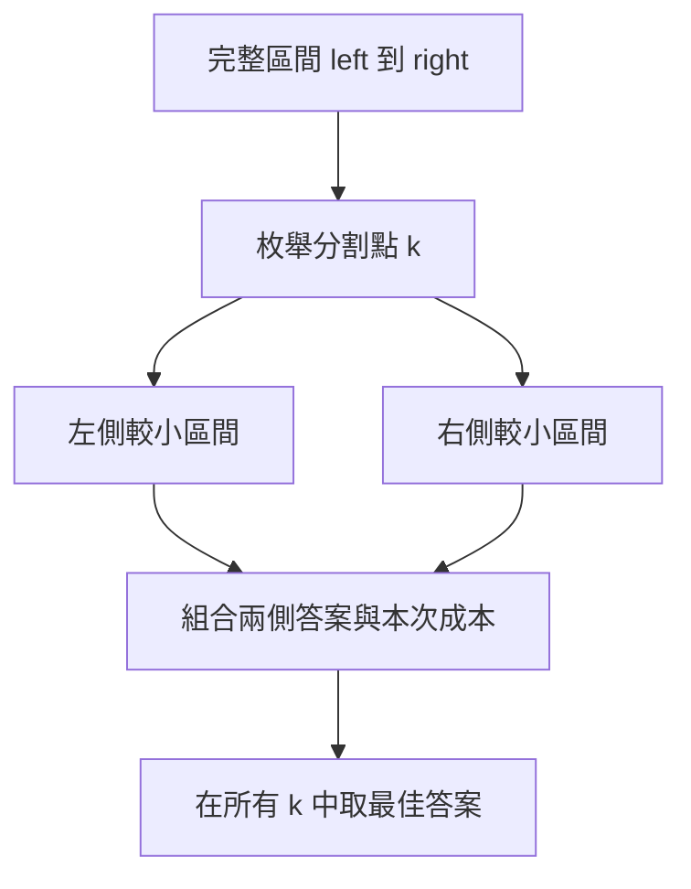
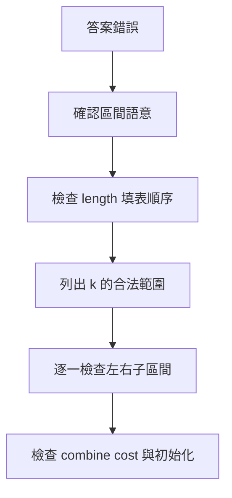

## 第 42 章　Interval Dynamic Programming

### 適用範圍

本章說明 Interval Dynamic Programming，也就是以一段連續區間作為 State 的 DP。Interval DP 常見於合併成本、括號化、Palindrome、Burst Balloons、Stone Merge、Optimal BST 等問題。

原始章節已經指出，第一次接觸 Interval DP 時，常見困難不是二維 Array，而是不清楚：`dp[left][right]` 到底表示哪一段資料、為什麼要先計算短區間、分割點 `k` 是切在元素上還是兩個元素之間、為什麼同一個區間要枚舉多個分割點。citeturn46search1

本章會把原始架構補成完整流程：

- 先定義區間 State 與端點語意。
- 決定 Base Case。
- 依區間長度 Bottom-up 填表。
- 枚舉分割點或最後一步。
- 合併左右子區間答案。
- 分析 O(n³)、O(n²) 等成本來源。
- 用小區間手動檢查轉移公式。



### 適用讀者

- 已理解一維、二維 DP，但不熟悉區間 State 的讀者。
- 容易混淆 Inclusive 與 Half-open Interval 的讀者。
- 看得懂三層迴圈，卻不清楚迴圈順序的讀者。
- 想理解 Matrix Chain Multiplication、Palindrome DP、Burst Balloons 的讀者。
- 常在 `left`、`right`、`k` 範圍上出現越界或漏元素的讀者。

### 快速導覽

- [42.1 Interval DP 前到底要分析什麼](#421-interval-dp-前到底要分析什麼)
- [42.2 區間 State](#422-區間-state)
- [42.3 閉區間與半開區間](#423-閉區間與半開區間)
- [42.4 為什麼先算短區間](#424-為什麼先算短區間)
- [42.5 分割點](#425-分割點)
- [42.6 Matrix Chain Multiplication](#426-matrix-chain-multiplication)
- [42.7 Palindrome Interval DP](#427-palindrome-interval-dp)
- [42.8 Burst Balloons 的思考方向](#428-burst-balloons-的思考方向)
- [42.9 Stone Merge 類型](#429-stone-merge-類型)
- [42.10 計數型 Interval DP](#4210-計數型-interval-dp)
- [42.11 實作順序與模板](#4211-實作順序與模板)
- [42.12 複雜度分析](#4212-複雜度分析)
- [42.13 系統化 Debug](#4213-系統化-debug)
- [42.14 常見問題與判讀](#4214-常見問題與判讀)
- [42.15 本章檢查表](#4215-本章檢查表)
- [42.16 本章重點](#4216-本章重點)

### 42.1 Interval DP 前到底要分析什麼

假設有一段資料，需要決定不同合併順序的最低成本。

第一步先整理：

<table>
<tr><th>分析項目</th><th>要回答的問題</th><th>常見錯誤</th></tr>
<tr><td>State</td><td>`dp[left][right]` 表示哪一段區間的答案？</td><td>只寫「區間答案」，但沒有定義端點</td></tr>
<tr><td>區間語意</td><td>使用 `[left, right]` 還是 `[left, right)`？</td><td>轉移時混用閉區間與半開區間</td></tr>
<tr><td>最小區間</td><td>空區間、單一元素、長度 2 的答案是什麼？</td><td>讀到不存在的內部區間</td></tr>
<tr><td>分割方式</td><td>完整區間可以在哪些位置切開？</td><td>`k` 範圍多一格或少一格</td></tr>
<tr><td>組合方式</td><td>左右答案如何加上本次成本？</td><td>忘記本次合併成本</td></tr>
<tr><td>目標</td><td>取最小、最大、計數或 Boolean？</td><td>初始化值不符合語意</td></tr>
</table>

Interval DP 的重點是，較長區間的答案會依賴較短區間。因此 Bottom-up 通常依區間長度遞增計算。原始章節也明確指出，較長區間依賴較短區間，所以通常依區間長度遞增。citeturn46search1

### 42.2 區間 State

本章主要使用閉區間：

```text
dp[left][right] = 處理資料 left 到 right 的答案
```

例如：

```text
dp[2][4]
```

代表包含 Index 2、3、4 的區間。原始章節也使用閉區間 `dp[left][right]`，並說明 `dp[2][4]` 包含 Index 2、3、4。citeturn46search1

State 定義不能只寫「區間答案」，還要說明：

- 區間中包含哪些元素。
- 是否已完成合併或選擇。
- 保存的是最低成本、最高分數、方法數或可行性。
- 區間外的元素是否已固定或不參與。

#### State 定義範例

<table>
<tr><th>題型</th><th>State</th><th>語意</th></tr>
<tr><td>Matrix Chain</td><td>`dp[i][j]`</td><td>將矩陣 Ai 到 Aj 相乘的最低成本</td></tr>
<tr><td>Palindrome</td><td>`dp[left][right]`</td><td>字串 left 到 right 是否為 Palindrome</td></tr>
<tr><td>Stone Merge</td><td>`dp[left][right]`</td><td>合併 left 到 right 的最低成本</td></tr>
<tr><td>Burst Balloons</td><td>`dp[left][right]`</td><td>戳破 open interval 內氣球的最高分數</td></tr>
<tr><td>Counting Parse</td><td>`dp[left][right]`</td><td>left 到 right 可形成某狀態的方法數</td></tr>
</table>

### 42.3 閉區間與半開區間

Interval DP 最常見錯誤是端點語意混用。

#### 閉區間 `[left, right]`

- 包含 left。
- 包含 right。
- 長度為 `right - left + 1`。
- 單一元素為 `left == right`。

適合初學者，因為可直觀看到左右端都包含。

#### 半開區間 `[left, right)`

- 包含 left。
- 不包含 right。
- 長度為 `right - left`。
- 空區間為 `left == right`。
- STL Iterator 慣用半開語意。

#### 比較表

<table>
<tr><th>項目</th><th>閉區間 `[left, right]`</th><th>半開區間 `[left, right)`</th></tr>
<tr><td>是否包含 right</td><td>是</td><td>否</td></tr>
<tr><td>長度</td><td>`right - left + 1`</td><td>`right - left`</td></tr>
<tr><td>單一元素</td><td>`left == right`</td><td>`right == left + 1`</td></tr>
<tr><td>空區間</td><td>需額外表示</td><td>`left == right`</td></tr>
<tr><td>分割方式</td><td>`[left,k]` 與 `[k+1,right]`</td><td>`[left,k)` 與 `[k,right)`</td></tr>
</table>

本章主要用閉區間。若你選半開區間，整個章節的 `k` 範圍與 Base Case 都要一致改寫。

### 42.4 為什麼先算短區間

若 `dp[left][right]` 會使用：

```text
dp[left][k]
dp[k + 1][right]
```

這兩段都比原區間短。因此應先完成短區間。原始章節也以同樣依賴說明，若直接由 `left = 0`、`right = n - 1` 開始填表，小區間可能尚未計算。citeturn46search1

```cpp
for (int length = 2; length <= n; ++length)
{
    for (int left = 0; left + length - 1 < n; ++left)
    {
        int right = left + length - 1;
        // 計算 dp[left][right]
    }
}
```


#### 填表順序的 Invariant

在開始計算長度 `length` 的區間前：

```text
所有長度小於 length 的區間都已經計算完成。
```

因此分割出來的左右小區間都可以直接讀取。

### 42.5 分割點

對閉區間 `[left, right]`，若 `k` 表示左側最後一個元素，切割結果是：

```text
[left, k]
[k + 1, right]
```

合法範圍：

```text
left <= k < right
```

每個 `k` 代表一種最後合併方式。DP 要枚舉所有合法 `k`，再取最佳答案。原始章節也使用相同的分割定義與範圍。citeturn46search1

```cpp
for (int k = left; k < right; ++k)
{
    candidate = dp[left][k]
              + dp[k + 1][right]
              + combineCost(left, k, right);
}
```

#### 為什麼要枚舉所有 k

因為不同的最後合併方式可能產生不同成本。例如：

```text
((A B) C)
(A (B C))
```

這兩種括號化的最後一次合併不同，成本也不同。Interval DP 透過枚舉 `k` 代表所有可能的最後分割。

#### k 的兩種常見語意

<table>
<tr><th>語意</th><th>左右區間</th><th>k 範圍</th></tr>
<tr><td>k 是左區間最後一個元素</td><td>`[left,k]` 和 `[k+1,right]`</td><td>`left <= k < right`</td></tr>
<tr><td>k 是最後被選的元素</td><td>依題目可能是 `[left,k-1]` 和 `[k+1,right]`</td><td>通常 `left <= k <= right`</td></tr>
</table>

Matrix Chain 常用第一種。Burst Balloons 常用第二種：「k 是最後戳破的氣球」。

### 42.6 Matrix Chain Multiplication

給定矩陣：

```text
A1: 10 × 30
A2: 30 × 5
A3: 5 × 60
```

矩陣乘法的括號順序會影響乘法次數：

```text
(A1 × A2) × A3
A1 × (A2 × A3)
```

原始章節也使用同一組矩陣尺寸說明 Matrix Chain Multiplication。citeturn46search1

#### State

若：

```text
dimensions = [10, 30, 5, 60]
```

則：

```text
dp[i][j] = 將矩陣 Ai 到 Aj 相乘的最低純量乘法次數
```

#### Transition

在 k 後切開：

```text
dp[i][j] = min(
    dp[i][k] + dp[k + 1][j]
    + dimensions[i - 1] * dimensions[k] * dimensions[j]
)
```

原始章節也列出相同 Transition。citeturn46search1

#### C++ 實作

```cpp
#include <algorithm>
#include <limits>
#include <vector>

long long matrixChainMinimumCost(
    const std::vector<int>& dimensions)
{
    int matrixCount = static_cast<int>(dimensions.size()) - 1;

    if (matrixCount <= 1)
    {
        return 0;
    }

    const long long INF = std::numeric_limits<long long>::max() / 4;

    std::vector<std::vector<long long>> dp(
        matrixCount + 1,
        std::vector<long long>(matrixCount + 1, 0));

    for (int length = 2; length <= matrixCount; ++length)
    {
        for (int left = 1; left + length - 1 <= matrixCount; ++left)
        {
            int right = left + length - 1;
            dp[left][right] = INF;

            for (int k = left; k < right; ++k)
            {
                long long candidate = dp[left][k]
                    + dp[k + 1][right]
                    + 1LL * dimensions[left - 1]
                         * dimensions[k]
                         * dimensions[right];

                dp[left][right] = std::min(dp[left][right], candidate);
            }
        }
    }

    return dp[1][matrixCount];
}
```

原始章節也提供相同概念的 C++ 實作，並指出時間複雜度為 O(n³)，空間為 O(n²)。citeturn46search1

#### 手動檢查範例

```text
(A1 × A2)：10 * 30 * 5 = 1500
結果尺寸：10 × 5
再乘 A3：10 * 5 * 60 = 3000
總成本：4500

(A2 × A3)：30 * 5 * 60 = 9000
結果尺寸：30 × 60
再乘 A1：10 * 30 * 60 = 18000
總成本：27000
```

所以最佳為 4500。

### 42.7 Palindrome Interval DP

判斷字串區間是否為 Palindrome，可以定義：

```text
dp[left][right] = text[left..right] 是否為 Palindrome
```

Transition：

```text
text[left] == text[right]
而且內部區間也是 Palindrome
```

```cpp
if (text[left] == text[right])
{
    dp[left][right] = length <= 2 || dp[left + 1][right - 1];
}
```

原始章節也說明，`length <= 2` 用來處理單一字元與兩字元區間，避免讀取不存在的內部區間。citeturn46search1

#### C++ 實作

```cpp
#include <string>
#include <vector>

std::vector<std::vector<bool>> buildPalindromeTable(
    const std::string& text)
{
    int n = static_cast<int>(text.size());
    std::vector<std::vector<bool>> dp(
        n,
        std::vector<bool>(n, false));

    for (int length = 1; length <= n; ++length)
    {
        for (int left = 0; left + length - 1 < n; ++left)
        {
            int right = left + length - 1;

            if (text[left] != text[right])
            {
                dp[left][right] = false;
            }
            else
            {
                dp[left][right] = length <= 2 || dp[left + 1][right - 1];
            }
        }
    }

    return dp;
}
```

#### 複雜度

```text
時間：O(n²)
空間：O(n²)
```

這類問題沒有枚舉分割點，因此不是 O(n³)。Interval DP 不一定都會有三層迴圈，取決於 Transition。

### 42.8 Burst Balloons 的思考方向

Burst Balloons 若直接想「第一個戳破誰」，周圍鄰居會持續改變，State 不容易固定。

較穩定的想法是：

```text
在區間中，最後一個被戳破的氣球是誰？
```

若 k 是最後一個，當時它的左右鄰居就是區間外固定邊界。左右內部區間已先被處理，因此可拆成兩個較小子問題。原始章節也指出，這個案例說明 Interval DP 常需要改變觀察順序；當「第一步」使狀態難以描述時，可以嘗試從「最後一步」推導。citeturn46search1

#### 常見 State

加入左右虛擬邊界後：

```text
values = [1] + nums + [1]
```

定義 open interval：

```text
dp[left][right] = 戳破 (left, right) 之間所有氣球的最高分數
```

注意這裡是 open interval，不包含 left 與 right。

#### Transition

若 k 是 `(left, right)` 中最後戳破的氣球：

```text
dp[left][right] = max(
    dp[left][k] + dp[k][right]
    + values[left] * values[k] * values[right]
)
```

合法範圍：

```text
left < k < right
```

#### C++ 實作

```cpp
#include <algorithm>
#include <vector>

int maxCoins(const std::vector<int>& nums)
{
    std::vector<int> value;
    value.push_back(1);

    for (int x : nums)
    {
        value.push_back(x);
    }

    value.push_back(1);

    int n = static_cast<int>(value.size());
    std::vector<std::vector<int>> dp(
        n,
        std::vector<int>(n, 0));

    for (int length = 2; length < n; ++length)
    {
        for (int left = 0; left + length < n; ++left)
        {
            int right = left + length;

            for (int k = left + 1; k < right; ++k)
            {
                dp[left][right] = std::max(
                    dp[left][right],
                    dp[left][k]
                    + dp[k][right]
                    + value[left] * value[k] * value[right]);
            }
        }
    }

    return dp[0][n - 1];
}
```

#### 為什麼區間長度從 2 開始

若 `right = left + 1`，open interval `(left, right)` 中沒有氣球，答案是 0。從 length = 2 開始，表示中間至少可能有一個 k。

### 42.9 Stone Merge 類型

Stone Merge 類型問題常是：

```text
每次合併相鄰兩堆石頭，成本為合併後總重量，求最小總成本。
```

#### State

```text
dp[left][right] = 將 left 到 right 合併成一堆的最低成本
```

#### Transition

最後一次合併時，一定是把左側某段與右側某段合併：

```text
dp[left][right] = min(
    dp[left][k] + dp[k + 1][right] + sum(left, right)
)
```

其中 `sum(left, right)` 可用 Prefix Sum 取得。

#### C++ 片段

```cpp
long long rangeSum(
    const std::vector<long long>& prefix,
    int left,
    int right)
{
    return prefix[right + 1] - prefix[left];
}
```

這類題型常有 O(n³) DP，也可能有進階最佳化條件，但初學時先掌握標準 Interval DP。

### 42.10 計數型 Interval DP

Interval DP 不只可做最小或最大，也可做計數或 Boolean。

#### Boolean

Palindrome：

```text
dp[left][right] = 是否為 Palindrome
```

#### Count

假設某題要計算區間可形成合法結構的方法數，常見形式：

```text
dp[left][right] += dp[left][k] * dp[k+1][right]
```

若答案很大，需取 mod。

#### Min / Max

Matrix Chain、Stone Merge、Burst Balloons：

```text
dp[left][right] = min / max over k
```

不同目標會影響初始化：

<table>
<tr><th>目標</th><th>初始化</th></tr>
<tr><td>Minimum</td><td>INF</td></tr>
<tr><td>Maximum</td><td>0 或 NEG_INF，依題目</td></tr>
<tr><td>Count</td><td>0</td></tr>
<tr><td>Boolean</td><td>false，再依條件設 true</td></tr>
</table>

### 42.11 實作順序與模板

#### 閉區間分割模板

```cpp
for (int length = 1; length <= n; ++length)
{
    for (int left = 0; left + length - 1 < n; ++left)
    {
        int right = left + length - 1;

        if (length == 1)
        {
            // base case
            continue;
        }

        for (int k = left; k < right; ++k)
        {
            // combine dp[left][k] and dp[k + 1][right]
        }
    }
}
```

#### Open Interval 最後一步模板

以 Burst Balloons 類型為例：

```cpp
for (int length = 2; length < n; ++length)
{
    for (int left = 0; left + length < n; ++left)
    {
        int right = left + length;

        for (int k = left + 1; k < right; ++k)
        {
            // k is the last chosen element inside (left, right)
        }
    }
}
```

#### Palindrome 模板

```cpp
for (int length = 1; length <= n; ++length)
{
    for (int left = 0; left + length - 1 < n; ++left)
    {
        int right = left + length - 1;
        dp[left][right] = text[left] == text[right]
            && (length <= 2 || dp[left + 1][right - 1]);
    }
}
```

### 42.12 複雜度分析

Interval DP 的複雜度通常由三個維度決定：

```text
區間長度 × left 位置 × 分割點 k
```

若 State 數為 O(n²)，每個 State 枚舉 O(n) 個 k：

```text
時間 O(n³)
空間 O(n²)
```

但不是所有 Interval DP 都是 O(n³)。

<table>
<tr><th>題型</th><th>State 數</th><th>每個 State 成本</th><th>總時間</th></tr>
<tr><td>Matrix Chain</td><td>O(n²)</td><td>O(n)</td><td>O(n³)</td></tr>
<tr><td>Stone Merge 標準版</td><td>O(n²)</td><td>O(n)</td><td>O(n³)</td></tr>
<tr><td>Burst Balloons</td><td>O(n²)</td><td>O(n)</td><td>O(n³)</td></tr>
<tr><td>Palindrome Table</td><td>O(n²)</td><td>O(1)</td><td>O(n²)</td></tr>
</table>

空間通常是 O(n²)，因為需要保存所有區間答案。

### 42.13 系統化 Debug

Interval DP Debug 時，先固定小 n，列出每個長度的填表結果。

#### Debug 欄位

```text
length
left
right
k
左區間語意
右區間語意
dp[left][k]
dp[k+1][right]
combine cost
candidate
dp[left][right]
```

#### 小型測試

- 空輸入。
- 單一元素。
- 長度 2。
- 長度 3，可手算所有分割。
- 端點相同 / 不同的 Palindrome。
- Matrix Chain 只有一個矩陣。
- Burst Balloons 只有一個氣球。



### 42.14 常見問題與判讀

原始章節的常見問題包含：讀到未計算 State、分割後漏元素、k 造成空區間或越界、成本溢位、Palindrome 長度 2 出錯。citeturn46search1

<table>
<tr><th>現象</th><th>可能原因</th><th>第一輪檢查</th></tr>
<tr><td>讀到未計算 State</td><td>沒有依區間長度計算</td><td>確認小區間先於大區間</td></tr>
<tr><td>分割後漏元素</td><td>區間語意不一致</td><td>明確寫出左右區間</td></tr>
<tr><td>k 造成空區間或越界</td><td>分割點範圍錯誤</td><td>閉區間常用 `left <= k < right`</td></tr>
<tr><td>成本溢位</td><td>多個維度相乘使用 int</td><td>使用 `long long` 並先轉型</td></tr>
<tr><td>Palindrome 長度 2 出錯</td><td>直接讀取內部區間</td><td>先處理 `length <= 2`</td></tr>
<tr><td>Burst Balloons State 不固定</td><td>從第一步思考，鄰居會變</td><td>改從最後一步思考</td></tr>
<tr><td>Minimum DP 得到 0</td><td>未把非 Base State 初始化為 INF</td><td>檢查初始化語意</td></tr>
<tr><td>計數型 DP 過大</td><td>未取 mod 或型別不足</td><td>依題目使用 modulo</td></tr>
</table>

### 42.15 本章檢查表

- 我能完整定義 `dp[left][right]`。
- 我能統一使用閉區間或半開區間。
- 我知道 Bottom-up Interval DP 通常依區間長度遞增。
- 我能寫出分割後的左右區間。
- 我能說明為什麼要枚舉所有 k。
- 我能分辨 k 是「分割點」還是「最後選的一個元素」。
- 我能推導 Matrix Chain Multiplication 的合併成本。
- 我知道 Palindrome DP 如何處理長度 1 與長度 2。
- 我知道 Burst Balloons 要從最後一步思考。
- 我會測試空輸入、單一元素與長度 2 的區間。
- 我會檢查初始化、Overflow 與區間越界。

原始章節檢查表也包含：完整定義 `dp[left][right]`、統一區間語意、依區間長度遞增、寫出左右區間、說明枚舉所有 k、推導 Matrix Chain 成本，以及測試空輸入、單一元素與長度 2 區間。citeturn46search1

### 42.16 本章重點

- Interval DP 使用一段連續區間作為 State。
- State 必須明確定義端點是否包含。
- 大區間通常依賴較小區間，所以先計算短區間。
- 分割點代表一種最後合併方式。
- Matrix Chain Multiplication 會枚舉所有分割點並取最低成本。
- Palindrome DP 依賴左右字元與內部區間，通常是 O(n²)。
- Burst Balloons 這類問題從最後一步思考，比從第一步思考更容易固定 State。
- Interval DP 的常見複雜度是 O(n³) 時間與 O(n²) 空間，但需依 Transition 重新分析。
