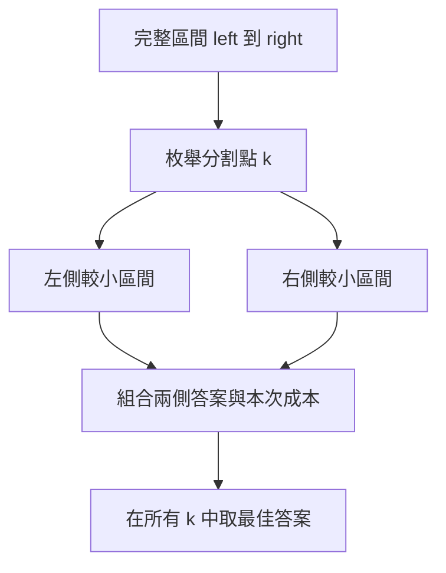

## 第 42 章　Interval Dynamic Programming

### 適用範圍

本章說明 Interval Dynamic Programming，也就是以一段連續區間作為 State 的 DP。

第一次接觸 Interval DP 時，常見困難不是二維 Array，而是不清楚：

- `dp[left][right]` 到底表示哪一段資料？
- 為什麼要先計算短區間，再計算長區間？
- 分割點 `k` 是切在元素上，還是兩個元素之間？
- 為什麼同一個區間要枚舉多個分割點？

本章會先從「將完整區間切成兩個較小區間」建立畫面，再進入 Matrix Chain Multiplication、Palindrome 與 Burst Balloons。



### 適用讀者

- 已理解一維、二維 DP，但不熟悉區間 State 的讀者。
- 容易混淆 Inclusive 與 Half-open Interval 的讀者。
- 看得懂三層迴圈，卻不清楚迴圈順序的讀者。
- 想理解 Matrix Chain Multiplication 與 Palindrome DP 的讀者。

### 快速導覽

- [42.1 Interval DP 前到底要分析什麼](#421-interval-dp-前到底要分析什麼)
- [42.2 區間 State](#422-區間-state)
- [42.3 為什麼先算短區間](#423-為什麼先算短區間)
- [42.4 分割點](#424-分割點)
- [42.5 Matrix Chain Multiplication](#425-matrix-chain-multiplication)
- [42.6 Palindrome Interval DP](#426-palindrome-interval-dp)
- [42.7 Burst Balloons 的思考方向](#427-burst-balloons-的思考方向)
- [42.8 常見問題與判讀](#428-常見問題與判讀)
- [42.9 本章檢查表](#429-本章檢查表)
- [42.10 本章重點](#4210-本章重點)

### 42.1 Interval DP 前到底要分析什麼

假設有一段資料，需要決定不同合併順序的最低成本。

第一步先整理：

<table>
<tr><th>分析項目</th><th>要回答的問題</th></tr>
<tr><td>State</td><td>`dp[left][right]` 表示哪一段區間的答案？</td></tr>
<tr><td>區間語意</td><td>使用 `[left, right]` 還是 `[left, right)`？</td></tr>
<tr><td>最小區間</td><td>空區間或單一元素的答案是什麼？</td></tr>
<tr><td>分割方式</td><td>完整區間可以在哪些位置切開？</td></tr>
<tr><td>組合方式</td><td>左右答案如何加上本次成本？</td></tr>
<tr><td>目標</td><td>取最小、最大、計數或 Boolean？</td></tr>
</table>

Interval DP 的重點是，較長區間的答案會依賴較短區間。因此 Bottom-up 通常依區間長度遞增計算。

### 42.2 區間 State

本章主要使用閉區間：

```text
dp[left][right] = 處理資料 left 到 right 的答案
```

例如：

```text
dp[2][4]
```

代表包含 Index 2、3、4 的區間。

State 定義不能只寫「區間答案」，還要說明：

- 區間中包含哪些元素。
- 是否已完成合併或選擇。
- 保存的是最低成本、最高分數或可行性。

### 42.3 為什麼先算短區間

若 `dp[left][right]` 會使用：

```text
dp[left][k]
dp[k + 1][right]
```

這兩段都比原區間短。因此應先完成短區間。

```cpp
for (int length = 2; length <= n; ++length)
{
    for (int left = 0; left + length - 1 < n; ++left)
    {
        int right = left + length - 1;
        // 計算 dp[left][right]
    }
}
```


若直接由 `left = 0`、`right = n - 1` 開始填表，所依賴的小區間可能尚未計算。

### 42.4 分割點

對區間 `[left, right]`，若 `k` 表示左側最後一個元素，切割結果是：

```text
[left, k]
[k + 1, right]
```

合法範圍：

```text
left <= k < right
```

每個 `k` 代表一種最後合併方式。DP 要枚舉所有合法 `k`，再取最佳答案。

```cpp
for (int k = left; k < right; ++k)
{
    candidate = dp[left][k]
              + dp[k + 1][right]
              + combineCost(left, k, right);
}
```

### 42.5 Matrix Chain Multiplication

給定矩陣：

```text
A1: 10 × 30
A2: 30 × 5
A3: 5 × 60
```

矩陣乘法的括號順序會影響乘法次數。

```text
(A1 × A2) × A3
A1 × (A2 × A3)
```

#### State

若 `dimensions = [10, 30, 5, 60]`：

```text
dp[i][j] = 將矩陣 Ai 到 Aj 相乘的最低純量乘法次數
```

#### Transition

在 k 後切開：

```text
dp[i][j] = min(
    dp[i][k]
    + dp[k + 1][j]
    + dimensions[i - 1] * dimensions[k] * dimensions[j]
)
```

#### C++ 實作

```cpp
#include <algorithm>
#include <limits>
#include <vector>

long long matrixChainMinimumCost(
    const std::vector<int>& dimensions)
{
    int matrixCount = static_cast<int>(dimensions.size()) - 1;

    if (matrixCount <= 1)
    {
        return 0;
    }

    std::vector<std::vector<long long>> dp(
        matrixCount + 1,
        std::vector<long long>(matrixCount + 1, 0));

    for (int length = 2; length <= matrixCount; ++length)
    {
        for (int left = 1;
             left + length - 1 <= matrixCount;
             ++left)
        {
            int right = left + length - 1;
            dp[left][right] = std::numeric_limits<long long>::max();

            for (int k = left; k < right; ++k)
            {
                long long candidate =
                    dp[left][k]
                    + dp[k + 1][right]
                    + 1LL * dimensions[left - 1]
                          * dimensions[k]
                          * dimensions[right];

                dp[left][right] = std::min(
                    dp[left][right], candidate);
            }
        }
    }

    return dp[1][matrixCount];
}
```

時間複雜度為 O(n³)，空間為 O(n²)。

### 42.6 Palindrome Interval DP

判斷字串區間是否為 Palindrome，可以定義：

```text
dp[left][right] = text[left..right] 是否為 Palindrome
```

Transition：

```text
text[left] == text[right]
而且內部區間也是 Palindrome
```

```cpp
if (text[left] == text[right])
{
    dp[left][right] =
        length <= 2 || dp[left + 1][right - 1];
}
```

這裡 `length <= 2` 處理單一字元與兩字元區間，避免讀取不存在的內部區間。

### 42.7 Burst Balloons 的思考方向

Burst Balloons 若直接想「第一個戳破誰」，周圍鄰居會持續改變，State 不容易固定。

較穩定的想法是：

```text
在區間中，最後一個被戳破的氣球是誰？
```

若 k 是最後一個，當時它的左右鄰居就是區間外固定邊界。左右內部區間已先被處理，因此可拆成兩個較小子問題。

這個案例說明 Interval DP 常需要改變觀察順序。當「第一步」使狀態難以描述時，可以嘗試從「最後一步」推導。

### 42.8 常見問題與判讀

<table>
<tr><th>現象</th><th>可能原因</th><th>第一輪檢查</th></tr>
<tr><td>讀到未計算 State</td><td>沒有依區間長度計算</td><td>確認小區間先於大區間</td></tr>
<tr><td>分割後漏元素</td><td>區間語意不一致</td><td>明確寫出左右區間</td></tr>
<tr><td>k 造成空區間或越界</td><td>分割點範圍錯誤</td><td>閉區間常用 `left <= k < right`</td></tr>
<tr><td>成本溢位</td><td>多個維度相乘使用 int</td><td>使用 `long long` 並先轉型</td></tr>
<tr><td>Palindrome 長度 2 出錯</td><td>直接讀取內部區間</td><td>先處理 `length <= 2`</td></tr>
</table>

### 42.9 本章檢查表

- 我能完整定義 `dp[left][right]`。
- 我能統一使用閉區間或半開區間。
- 我知道 Bottom-up Interval DP 通常依區間長度遞增。
- 我能寫出分割後的左右區間。
- 我能說明為什麼要枚舉所有 k。
- 我能推導 Matrix Chain Multiplication 的合併成本。
- 我會測試空輸入、單一元素與長度 2 的區間。

### 42.10 本章重點

- Interval DP 使用一段連續區間作為 State。
- State 必須明確定義端點是否包含。
- 大區間通常依賴較小區間，所以先計算短區間。
- 分割點代表一種最後合併方式。
- Matrix Chain Multiplication 會枚舉所有分割點並取最低成本。
- Palindrome DP 依賴左右字元與內部區間。
- 有些問題從最後一步思考，比從第一步思考更容易固定 State。
