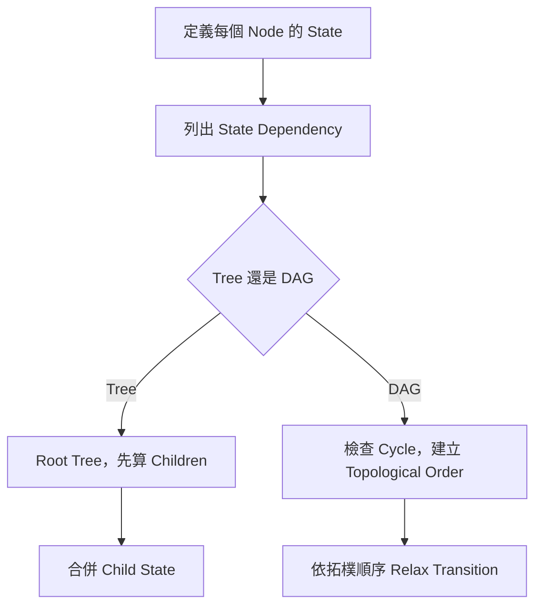
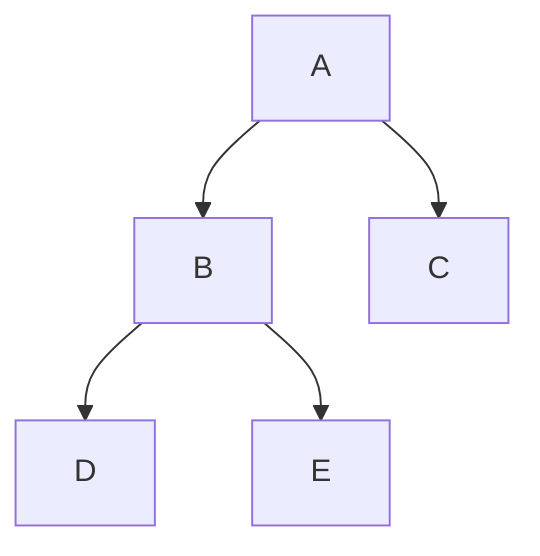
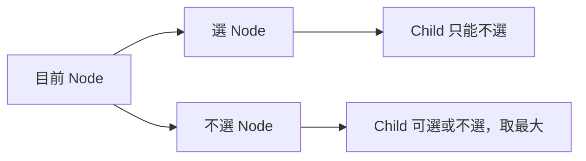
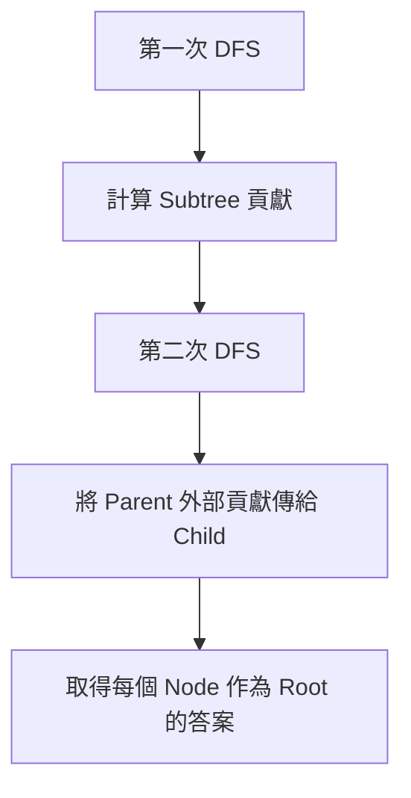
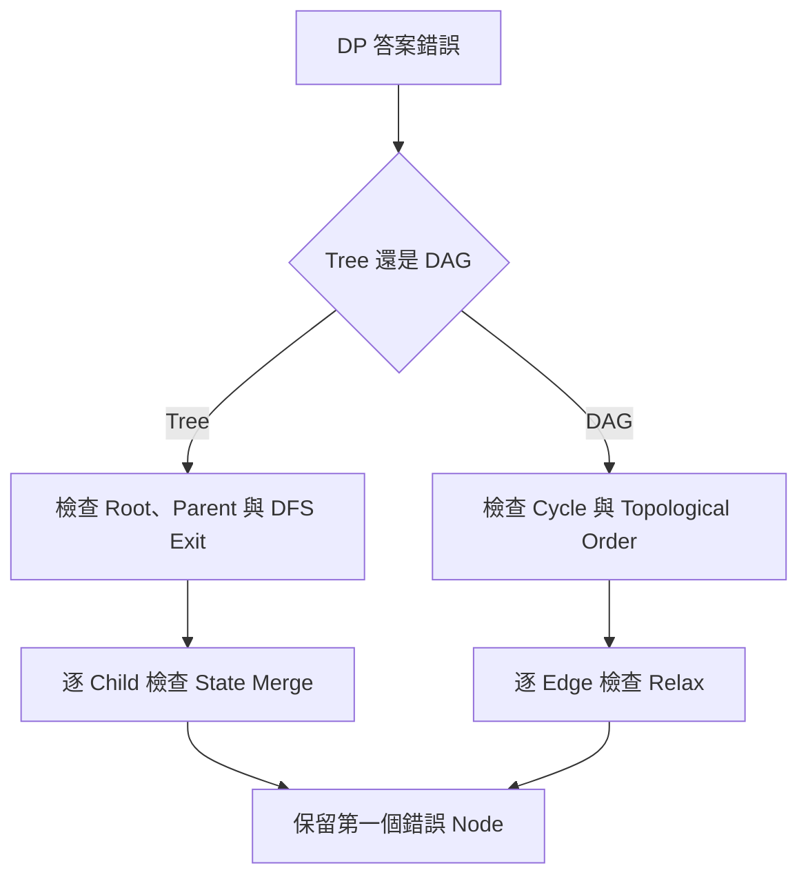

## 第 43 章　Tree 與 DAG Dynamic Programming

### 適用範圍

本章介紹如何在 Tree 與 Directed Acyclic Graph，簡稱 DAG，上進行 Dynamic Programming。

一般一維 DP 會依 Index 由小到大計算；Tree 與 DAG 沒有天然的線性順序，因此第一個問題不是「要開幾維 Array」，而是：

```text
目前 State 依賴哪些 State？
要用什麼順序，才能先完成所有依賴？
```

Tree DP 通常先指定 Root，讓無向 Tree 形成 Parent / Child 關係，再以 Postorder 或 DFS Exit 順序完成 Children，最後合併 Parent。DAG DP 則利用 Topological Order，保證每條 Directed Edge 的來源先於目的地處理。

本章會建立以下分析流程：

1. 定義 `dp[node]` 涵蓋單一 Node、整棵 Subtree，還是「到達 Node」的路徑資訊。
2. 確認目前 State 需要由哪些 Neighbor State 組成。
3. 判斷是否需要選 / 不選、上一個位置或其他額外維度。
4. 為 Tree 選擇 Root，並決定 Parent / Child 方向。
5. 為 DAG 檢查 Directed Cycle，並取得 Topological Order。
6. 設定 Leaf、Source 或其他 Base Case。
7. 推導 Transition 與答案位置。
8. 分析遞迴深度、Overflow、Reconstruction 與多個最佳解。



### 適用讀者

- 已理解基本 DP，但不熟悉非線性 State Dependency 的讀者。
- 能寫 DFS，卻不清楚為何 Tree DP 常在 DFS 回程時合併答案的讀者。
- 容易把 `dp[node]` 誤解成只描述 Node 本身的讀者。
- 想理解 Maximum Independent Set、Tree Diameter、Rerooting 與 DAG Longest Path 的讀者。
- 在無向 Tree 中容易走回 Parent，或在 DAG 中未依 Topological Order 計算的讀者。
- 需要處理深 Tree、不可達 State、路徑數 Overflow 或 Reconstruction 的讀者。

### 快速導覽

- [43.1 Tree DP 前到底要分析什麼](#431-tree-dp-前到底要分析什麼)
- [43.2 Subtree State 與函式契約](#432-subtree-state-與函式契約)
- [43.3 DFS Exit 與 Child Merge](#433-dfs-exit-與-child-merge)
- [43.4 選與不選 State](#434-選與不選-state)
- [43.5 完整案例：Maximum Weighted Independent Set](#435-完整案例maximum-weighted-independent-set)
- [43.6 常見 Tree DP 模型](#436-常見-tree-dp-模型)
- [43.7 Rerooting 的兩階段模型](#437-rerooting-的兩階段模型)
- [43.8 完整案例：每個 Node 的距離總和](#438-完整案例每個-node-的距離總和)
- [43.9 DAG DP 與 Topological Order](#439-dag-dp-與-topological-order)
- [43.10 完整案例：DAG Longest Path](#4310-完整案例dag-longest-path)
- [43.11 完整案例：DAG Path Count](#4311-完整案例dag-path-count)
- [43.12 Tree DP 與 DAG DP 比較](#4312-tree-dp-與-dag-dp-比較)
- [43.13 Reconstruction、Tie-breaking 與深度問題](#4313-reconstructiontie-breaking-與深度問題)
- [43.14 複雜度分析](#4314-複雜度分析)
- [43.15 系統化 Debug](#4315-系統化-debug)
- [43.16 常見問題與判讀](#4316-常見問題與判讀)
- [43.17 本章檢查表](#4317-本章檢查表)
- [43.18 本章重點](#4318-本章重點)

### 43.1 Tree DP 前到底要分析什麼

假設每個 Tree Node 有一筆價值，相鄰 Node 不能同時選，求最大總價值。

<table>
<tr><th>分析項目</th><th>本題內容</th><th>影響</th></tr>
<tr><td>資料結構</td><td>無向 Tree</td><td>DFS 時要排除 parent</td></tr>
<tr><td>Root</td><td>可任選一個 Node 作為 Root</td><td>Root 後會形成 Parent / Child 關係</td></tr>
<tr><td>限制</td><td>Parent 與 Child 不能同時選</td><td>需要分成選與不選 State</td></tr>
<tr><td>需要的 State</td><td>目前 Node 選或不選</td><td>`dp[node][0]`、`dp[node][1]`</td></tr>
<tr><td>計算方向</td><td>先完成 Children，再組合 Parent</td><td>Postorder / DFS Exit</td></tr>
<tr><td>答案</td><td>Root 選與不選兩種狀態的最大值</td><td>`max(dp[root][0], dp[root][1])`</td></tr>
</table>

#### Tree DP 前五問

1. Root 是否任選？
2. `dp[node]` 表示單一節點，還是整棵 Subtree？
3. Parent 需要知道 Child 哪些資訊？
4. Transition 是合併所有 Child，還是選其中一個 Child？
5. 答案在 Root，還是每個 Node 都要答案？

### 43.2 Subtree State 與函式契約

指定 Root 後，每個 Node 都代表一棵 Subtree。

可以定義：

```text
dp[node][0] = 不選 node 時，node Subtree 的最大總價值
dp[node][1] = 選 node 時，node Subtree 的最大總價值
```



計算 A 前，需要先完成 B、C；計算 B 前，需要先完成 D、E。

#### 遞迴函式契約

Tree DP 的 DFS 應先寫出契約。例如：

```text
treeDp(node, parent)
完成以 node 為 Root 的 Subtree DP，
而且不沿著 parent 方向返回。
```

契約中的「Subtree」依目前選定的 Root 決定。相同的無向 Tree 若換 Root，Parent / Child 關係會改變；若題目只求全樹單一答案，通常可任選 Root。若題目要求每個 Node 作為 Root 的答案，則需要 Rerooting 或其他全樹資訊傳遞。

#### Subtree State 的常見形式

<table>
<tr><th>題型</th><th>State 例子</th><th>語意</th></tr>
<tr><td>Subtree Size</td><td>`size[node]`</td><td>node Subtree 的節點數</td></tr>
<tr><td>Height</td><td>`height[node]`</td><td>node 往下最長路徑長度</td></tr>
<tr><td>Independent Set</td><td>`dp[node][0/1]`</td><td>node 不選 / 選時 Subtree 最佳值</td></tr>
<tr><td>Tree Diameter</td><td>`height[node]` + global answer</td><td>合併兩條最深 Child path</td></tr>
<tr><td>Tree Knapsack</td><td>`dp[node][k]`</td><td>node Subtree 選 k 個時的最佳值</td></tr>
</table>

### 43.3 DFS Exit 與 Child Merge

Tree DP 常在 DFS Exit 時完成 Transition。原因是：進入 node 時，Child 的答案還沒有算完；等 Child DFS 回來後，才有足夠資訊合併 Parent。

對「相鄰 Node 不能同時選」問題：

若選目前 Node，Child 就不能選：

```text
dp[node][1] += dp[child][0]
```

若不選目前 Node，每個 Child 可以選或不選，取較大者：

```text
dp[node][0] += max(dp[child][0], dp[child][1])
```



#### 合併 Child 的常見模式

<table>
<tr><th>合併類型</th><th>例子</th></tr>
<tr><td>加總所有 Child</td><td>Subtree Size、Independent Set</td></tr>
<tr><td>取最大 Child</td><td>Height</td></tr>
<tr><td>取前兩大 Child</td><td>Diameter through node</td></tr>
<tr><td>Child DP 做背包合併</td><td>Tree Knapsack</td></tr>
<tr><td>取 min / max 狀態</td><td>Minimum Vertex Cover on Tree</td></tr>
</table>

### 43.4 選與不選 State

以 Leaf 為例：

```text
dp[leaf][0] = 0
dp[leaf][1] = value[leaf]
```

對內部 Node：

1. 先把選中自己的價值放入 `dp[node][1]`。
2. 逐一合併每個 Child 的答案。
3. 不選自己的 State 可自由選擇 Child 最佳狀態。

#### 如何判斷需要選 / 不選 State

如果 Parent 的合法決策取決於 Child 本身是否被選，就需要讓 Child 的 DP 回傳「選」與「不選」兩種情況。

不夠的 State：

```text
dp[node] = node Subtree 最大值
```

問題：Parent 不知道這個最大值是否選了 node。

足夠的 State：

```text
dp[node][0] = 不選 node 的最佳值
dp[node][1] = 選 node 的最佳值
```

### 43.5 完整案例：Maximum Weighted Independent Set

#### 問題規格

給定一棵無向 Tree，每個 Node 有一個 `value`。選擇一些 Node，使任何相鄰 Node 不能同時被選，並最大化總價值。

本節假設：

- `graph` 是合法且連通的無向 Tree。
- Node 編號為 `0` 到 `n - 1`。
- `graph.size() == value.size()`。
- 空 Tree 的答案定義為 0。

#### State

```text
dp[node][0]
= 不選 node 時，node Subtree 可取得的最大總價值

dp[node][1]
= 選 node 時，node Subtree 可取得的最大總價值
```

#### Base Case

對 Leaf：

```text
dp[leaf][0] = 0
dp[leaf][1] = value[leaf]
```

一般 Node 也可以使用相同初始化，再逐一合併 Child。

#### Transition

若選 `node`，每個 Child 都不能選：

```text
dp[node][1] += dp[child][0]
```

若不選 `node`，每個 Child 可獨立選擇較好的合法狀態：

```text
dp[node][0] += max(dp[child][0], dp[child][1])
```

#### C++20 實作

```cpp
#include <algorithm>
#include <array>
#include <stdexcept>
#include <vector>

void computeIndependentSetDp(
    const std::vector<std::vector<int>>& graph,
    const std::vector<long long>& value,
    int node,
    int parent,
    std::vector<std::array<long long, 2>>& dp) {

    dp[node][0] = 0;
    dp[node][1] = value[node];

    for (int child : graph[node]) {
        if (child == parent) {
            continue;
        }

        computeIndependentSetDp(
            graph,
            value,
            child,
            node,
            dp);

        dp[node][0] += std::max(
            dp[child][0],
            dp[child][1]);

        dp[node][1] += dp[child][0];
    }
}

long long maximumIndependentValue(
    const std::vector<std::vector<int>>& graph,
    const std::vector<long long>& value) {

    if (graph.size() != value.size()) {
        throw std::invalid_argument(
            "graph and value sizes must match");
    }

    if (graph.empty()) {
        return 0;
    }

    std::vector<std::array<long long, 2>> dp(
        graph.size(),
        std::array<long long, 2>{0, 0});

    computeIndependentSetDp(
        graph,
        value,
        0,
        -1,
        dp);

    return std::max(dp[0][0], dp[0][1]);
}
```

#### 正確性思路

以 Postorder 歸納：

1. Leaf 的兩個 State 符合定義。
2. 假設所有 Child State 都正確。
3. 選 `node` 時，限制迫使所有 Child 使用不選狀態。
4. 不選 `node` 時，各 Child Subtree 彼此沒有 Edge，可獨立取兩個狀態的最大值。
5. 加總所有 Child 後，兩個 Parent State 都符合定義。

Root 沒有 Parent 限制，因此答案是兩個 Root State 的最大值。

#### 複雜度

- 每條無向 Edge 被檢查固定次數，時間複雜度 O(V)。
- DP Table 使用 O(V) 空間。
- Recursive Call Stack 使用 O(h) 空間，其中 `h` 是 Rooted Tree Height。

### 43.6 常見 Tree DP 模型

#### Subtree Size

```text
size[node] = 1 + sum(size[child])
```

```cpp
int computeSubtreeSize(
    const std::vector<std::vector<int>>& graph,
    int node,
    int parent,
    std::vector<int>& subtreeSize)
{
    subtreeSize[node] = 1;

    for (int child : graph[node])
    {
        if (child == parent)
        {
            continue;
        }

        subtreeSize[node] += computeSubtreeSize(
            graph,
            child,
            node,
            subtreeSize);
    }

    return subtreeSize[node];
}
```

#### Height

```text
height[node] = 1 + max(height[child])
```

Leaf 的 height 可定義為 0 或 1，依題目使用 Edge 數或 Node 數決定。

#### Diameter

對每個 node，若最深兩條 Child path 長度為 first、second，則經過 node 的 Diameter 候選為：

```text
first + second
```

具體加法要依 height 定義是 Edge 數還是 Node 數調整。

#### Minimum Vertex Cover on Tree

若選 node，就可以選或不選 child；若不選 node，child 必須選。

```text
dp[node][1] = 1 + sum(min(dp[child][0], dp[child][1]))
dp[node][0] = sum(dp[child][1])
```

### 43.7 Rerooting 的兩階段模型

有些題目要求每個 Node 作為 Root 時的答案。直接對每個 Root 重新 DFS，時間可能是 O(V²)。Rerooting 會重用相鄰 Root 之間的大部分結果。



#### Rerooting 的核心問題

當 Root 從 parent 移到 child 時，要回答：

```text
哪些貢獻要從 parent 移除？
哪些貢獻要加入 child？
```

#### Rerooting 適合題型

- 每個 Node 作為 Root 的 Subtree / 距離答案。
- Tree 中每個 Node 到所有其他 Node 的距離和。
- 每個 Node 作為中心時的某種成本。
- 需要全樹答案，但每個 Root 都要輸出。

### 43.8 完整案例：每個 Node 的距離總和

#### 問題規格

對 Tree 中每個 `node`，計算它到所有其他 Node 的 Edge Distance 總和。

若對每個 Root 都重新 DFS，時間為 O(V²)。Rerooting 使用兩次 DFS 將時間降低為 O(V)。

#### 第一階段：以 0 為 Root

計算：

```text
subtreeSize[node] = node Subtree 的 Node 數量
answer[0] = Root 0 到所有 Node 的距離總和
```

#### 第二階段：從 Parent 轉移到 Child

Root 從 `parent` 移到相鄰 `child` 時：

- `child` Subtree 內共有 `subtreeSize[child]` 個 Node，距離各減少 1。
- Subtree 外共有 `n - subtreeSize[child]` 個 Node，距離各增加 1。

因此：

```text
answer[child]
= answer[parent]
- subtreeSize[child]
+ (n - subtreeSize[child])
```

#### C++20 實作

```cpp
#include <stdexcept>
#include <vector>

void collectSubtreeInformation(
    const std::vector<std::vector<int>>& graph,
    int node,
    int parent,
    int depth,
    std::vector<int>& subtreeSize,
    long long& rootDistanceSum) {

    subtreeSize[node] = 1;
    rootDistanceSum += depth;

    for (int child : graph[node]) {
        if (child == parent) {
            continue;
        }

        collectSubtreeInformation(
            graph,
            child,
            node,
            depth + 1,
            subtreeSize,
            rootDistanceSum);

        subtreeSize[node] += subtreeSize[child];
    }
}

void propagateRerootAnswers(
    const std::vector<std::vector<int>>& graph,
    int node,
    int parent,
    const std::vector<int>& subtreeSize,
    std::vector<long long>& answer) {

    const long long n =
        static_cast<long long>(graph.size());

    for (int child : graph[node]) {
        if (child == parent) {
            continue;
        }

        answer[child] =
            answer[node]
            - subtreeSize[child]
            + (n - subtreeSize[child]);

        propagateRerootAnswers(
            graph,
            child,
            node,
            subtreeSize,
            answer);
    }
}

std::vector<long long> sumOfDistancesFromEachNode(
    const std::vector<std::vector<int>>& graph) {

    const int n = static_cast<int>(graph.size());

    if (n == 0) {
        return {};
    }

    std::vector<int> subtreeSize(n, 0);
    std::vector<long long> answer(n, 0);
    long long rootDistanceSum = 0;

    collectSubtreeInformation(
        graph,
        0,
        -1,
        0,
        subtreeSize,
        rootDistanceSum);

    answer[0] = rootDistanceSum;

    propagateRerootAnswers(
        graph,
        0,
        -1,
        subtreeSize,
        answer);

    return answer;
}
```

#### Rerooting Invariant

第二次 DFS 處理 `node` 時：

1. `answer[node]` 已是 `node` 到全 Tree 的距離總和。
2. `subtreeSize[child]` 仍以初始 Root 0 的方向定義。
3. Parent 到 Child 的公式可在 O(1) 時間算出 `answer[child]`。

#### 複雜度

兩次 DFS 都是 O(V)，總時間 O(V)，額外資料 O(V)，Recursive Call Stack O(h)。

### 43.9 DAG DP 與 Topological Order

DAG 沒有 Directed Cycle，因此其 State Dependency 可以排成合法先後順序。

若存在 Edge：

```text
u -> v
```

而 `dp[v]` 依賴 `dp[u]`，就必須先完成 `u`。Topological Order 保證每條 Directed Edge 的來源都出現在目的地之前。

#### Kahn Algorithm

```cpp
#include <optional>
#include <queue>
#include <vector>

std::optional<std::vector<int>> topologicalSort(
    const std::vector<std::vector<int>>& graph) {

    const int n = static_cast<int>(graph.size());
    std::vector<int> indegree(n, 0);

    for (int node = 0; node < n; ++node) {
        for (int next : graph[node]) {
            ++indegree[next];
        }
    }

    std::queue<int> ready;

    for (int node = 0; node < n; ++node) {
        if (indegree[node] == 0) {
            ready.push(node);
        }
    }

    std::vector<int> order;
    order.reserve(n);

    while (!ready.empty()) {
        const int node = ready.front();
        ready.pop();
        order.push_back(node);

        for (int next : graph[node]) {
            --indegree[next];

            if (indegree[next] == 0) {
                ready.push(next);
            }
        }
    }

    if (static_cast<int>(order.size()) != n) {
        return std::nullopt;
    }

    return order;
}
```

若無法取得包含全部 Node 的 Topological Order，表示 Graph 有 Directed Cycle，不能直接使用本章的 DAG DP 填表方式。

DAG DP 的 State 可以描述：

- 從 Source 到達某 Node 的最長或最短距離。
- 從 Source 到某 Node 的路徑數。
- 從某 Node 出發的最佳後續答案。
- 完成某項 Dependency 後的最早或最晚時間。

State Definition 會決定 Edge Relax 的方向。若定義「到達 `v` 的答案」，通常由 Predecessor 更新 `v`；若定義「從 `u` 出發的答案」，也可反向 Topological Order 合併 Successor。

### 43.10 完整案例：DAG Longest Path

#### 問題規格

給定 Weighted DAG 與 `source`，求從 `source` 到每個 Node 的最長距離。允許 Edge Weight 為負數，但 Graph 必須是 DAG。

#### State

```text
dp[node] = 從 source 到 node 的最長距離
```

不可達 Node 使用 `NEG_INF`。

#### Transition

對每條 Edge `node -> next`：

```text
dp[next] = max(
    dp[next],
    dp[node] + weight(node, next)
)
```

只有 `dp[node]` 可達時才能 Relax。

#### C++20 實作

```cpp
#include <algorithm>
#include <limits>
#include <stdexcept>
#include <vector>

struct Edge {
    int to;
    long long weight;
};

std::vector<long long> longestPathInDag(
    const std::vector<std::vector<Edge>>& graph,
    const std::vector<int>& topologicalOrder,
    int source) {

    const int n = static_cast<int>(graph.size());

    if (source < 0 || source >= n) {
        throw std::out_of_range("invalid source");
    }

    const long long NEG_INF =
        std::numeric_limits<long long>::lowest() / 4;

    std::vector<long long> dp(n, NEG_INF);
    dp[source] = 0;

    for (int node : topologicalOrder) {
        if (dp[node] == NEG_INF) {
            continue;
        }

        for (const Edge& edge : graph[node]) {
            dp[edge.to] = std::max(
                dp[edge.to],
                dp[node] + edge.weight);
        }
    }

    return dp;
}
```

#### 為什麼負 Edge 仍可處理

DAG 沒有 Cycle，Topological Order 會在處理 `node` 前完成所有能到達它的 Predecessor。每條 Edge 只需 Relax 一次，不需要 Dijkstra 的非負權重前提。

使用 Sentinel 仍需依題目成本上限檢查 `dp[node] + edge.weight` 是否可能 Overflow。

#### 複雜度

- Topological Sort：O(V + E)。
- DP Relax：O(V + E)。
- 總時間：O(V + E)。
- Graph、Order 與 DP 空間：O(V + E)。

### 43.11 完整案例：DAG Path Count

#### 問題規格

給定 DAG 與 `source`，計算從 `source` 到每個 Node 的 Directed Path 數量。

#### State 與 Base Case

```text
dp[node] = 從 source 到 node 的路徑數
dp[source] = 1
```

`dp[source] = 1` 表示從 Source 到自身的空路徑有一種。若題目不把空路徑算入答案，應在輸出規格中另行處理，而不是模糊修改 Transition。

#### Transition

對每條 Edge `node -> next`：

```text
dp[next] += dp[node]
```

每條到達 `node` 的路徑都可再接上這條 Edge，形成一條到達 `next` 的路徑。

#### C++20 實作

```cpp
#include <cstdint>
#include <stdexcept>
#include <vector>

std::vector<std::uint64_t> countPathsInDag(
    const std::vector<std::vector<int>>& graph,
    const std::vector<int>& topologicalOrder,
    int source) {

    const int n = static_cast<int>(graph.size());

    if (source < 0 || source >= n) {
        throw std::out_of_range("invalid source");
    }

    std::vector<std::uint64_t> dp(n, 0);
    dp[source] = 1;

    for (int node : topologicalOrder) {
        if (dp[node] == 0) {
            continue;
        }

        for (int next : graph[node]) {
            dp[next] += dp[node];
        }
    }

    return dp;
}
```

路徑數可能非常大。若題目要求 Modulo，應在每次加法後依規格取模；若要求精確大整數，需使用合適型別或函式庫。`std::uint64_t` 仍可能 Overflow。

若 Graph 中有 Parallel Edges，兩條不同 Edge 是否代表兩條不同路徑，必須由題目定義。上面的 Transition 會把每條 Edge 視為獨立選擇。

### 43.12 Tree DP 與 DAG DP 比較

| 項目 | Tree DP | DAG DP |
|---|---|---|
| 資料結構 | Tree，常以無向 Adjacency List 表示 | Directed Acyclic Graph |
| 依賴方向 | Root 後形成 Parent / Child | Directed Edge 與 Topological Order |
| 常見順序 | DFS Exit / Postorder | Topological Order |
| Cycle 處理 | 排除 Parent，且輸入必須真的是 Tree | 必須確認沒有 Directed Cycle |
| 常見 State | Subtree、選 / 不選、Height | 到達 Node 的距離、路徑數、Dependency Value |
| 合併方式 | 合併所有 Child 或取前幾大 Child | 沿 Edge Relax Successor |
| 常見擴充 | Rerooting、Tree Knapsack | Longest / Shortest Path、Path Count |

共同核心是：

```text
先完成目前 State 依賴的資訊，再計算目前 State。
```

Tree 的 Rooting 與 DAG 的 Topological Sort，都是在建立清楚的 Dependency Order。

### 43.13 Reconstruction、Tie-breaking 與深度問題

#### Reconstruction

若只保存最佳值，未必能還原實際選擇。

Maximum Independent Set 可在第二次 DFS 中依 Parent 選擇狀態決定 Child：

- Parent 已選，Child 必須不選。
- Parent 未選，Child 可選擇較大的 State。

DAG Longest Path 可保存：

```text
parent[next] = node
```

每當 `dp[next]` 被改善時同步更新 Parent，最後從目標逆向回溯。

#### Tie-breaking

若兩個候選值相同，題目可能允許任一答案，也可能要求：

- 字典序較小路徑。
- Node 數較少或較多。
- 編號較小的前驅。

Tie-breaking 應寫入 Transition，不能只在回溯時臨時決定，否則保存的 Parent 可能不符合需求。

#### 深 Tree 的 Recursive Stack

鏈狀 Tree 的 Height 可達 O(V)，Recursive DFS 可能超過執行環境的 Stack 限制。可改用 Iterative DFS：

1. 先建立 Parent 與 Traversal Order。
2. 反向 Traversal Order，以 Postorder 合併 Child DP。
3. Rerooting 第二階段再依正向 Order 傳遞 Parent 資訊。

這不改變 DP State，只改變求值方式。

### 43.14 複雜度分析

不要因為是 Tree 或 DAG 就直接寫 O(V + E)。還要看每次合併的成本。

#### 線性合併

若每條 Edge 只做 O(1) State 更新：

```text
時間：O(V + E)
```

Tree 中 `E = V - 1`，因此常簡寫為 O(V)。

#### Tree Knapsack

若 `dp[node][k]` 需要逐 Child 合併不同選取數量，單次 Merge 可能是 O(K²)，總時間取決於 Subtree Size 與容量上限，不能只算 DFS Edge 數。

#### Rerooting

若 Parent 到 Child 的轉移可在 O(1) 完成，兩次 DFS 為 O(V)。若每次轉 Root 都重新掃描所有 Neighbor Contribution，則高 Degree Node 可能造成額外成本。一般 Rerooting 會使用 Prefix / Suffix Merge 或排除單一 Child 的技巧，確保總成本符合預期。

#### DAG DP

若每條 Edge Relax 為 O(1)，時間 O(V + E)。若 State 還包含容量、顏色或其他維度，應再乘上額外 State 與 Transition 成本。

### 43.15 系統化 Debug

#### Tree DP 記錄欄位

```text
node
parent
children
進入 node 時的 Base State
每個 child 的最終 State
合併 child 前後的 node State
離開 node 時的最終 State
```

#### DAG DP 記錄欄位

```text
Topological Order
目前 node 是否可達
處理前 dp[node]
Edge node -> next
更新前 dp[next]
候選值
更新後 dp[next]
```

#### 建議排查順序

1. 用單一 Node 驗證 Base Case。
2. 用兩個 Node 驗證 Parent / Child 限制。
3. 用三個 Node 的鏈與星狀 Tree 比較合併行為。
4. 確認無向 Tree 不會走回 Parent。
5. 確認 State 描述整棵 Subtree，而非單一 Node。
6. DAG 先檢查 Topological Order 是否含全部 Node。
7. 確認不可達 State 不會參與 Transition。
8. 用暴力枚舉比對小型 Tree 或 DAG。
9. 保留第一個不符合 State Definition 的 Node。



#### 最小測試

Tree：

- 空 Tree。
- 單一 Node。
- 兩個 Node。
- 三個 Node 的 Chain。
- Star Tree。
- 所有 Value 為負數、0 或相同值。
- 深度接近 V 的 Chain。

DAG：

- 單一 Node。
- 一條 Directed Chain。
- 多個 Source。
- 多條路徑匯入同一 Node。
- 不可達 Node。
- Negative Edge Weight。
- Parallel Edges。
- 含 Directed Cycle 的反例。

### 43.16 常見問題與判讀

| 現象 | 可能原因 | 第一輪檢查 |
|---|---|---|
| Parent 與 Child 互相遞迴 | 無向 Tree 未排除 Parent | 傳入 `parent` 或使用 `visited` |
| 選與不選結果錯誤 | State 沒有區分目前 Node 狀態 | 檢查 Parent 是否需要知道 Child 有沒有選 |
| Parent 在 Child 前完成 | 合併時機錯誤 | Tree DP 是否在 DFS Exit / Postorder 計算 |
| Leaf 答案錯誤 | Height、Distance 或空 Subtree 定義不一致 | 明確使用 Edge 數或 Node 數 |
| Rerooting 仍是 O(V²) | 對每個 Root 重新完整 DFS | 重用 Subtree 與外部貢獻 |
| Rerooting 某些 Node 錯誤 | 移除與加入的貢獻數量有誤 | 逐 Edge 驗證 Parent-to-Child 公式 |
| Recursive Stack Overflow | Tree 太深 | 改用 Iterative Postorder |
| DAG DP 讀到未完成 State | 未依 Topological Order | 檢查每條 Edge 的順序 |
| Topological Order 不完整 | Graph 有 Directed Cycle | 確認 Order Size 等於 V |
| Longest Path 從不可達點延伸 | Sentinel 未檢查 | Relax 前跳過 `NEG_INF` |
| 路徑數異常 | Overflow 或 Modulo 遺漏 | 依規格檢查型別與取模 |
| 路徑數多算 | Parallel Edge 語意未定義 | 確認 Edge 是否視為不同選擇 |
| 只能得到最佳值，無法還原 | 未保存 Parent / Choice | 在更新最佳值時同步保存來源 |

### 43.17 本章檢查表

- 我能說明 `dp[node]` 是否包含整棵 Subtree。
- 我能為 Tree DP 寫出清楚的遞迴函式契約。
- 我知道 Rooting 如何建立 Parent / Child 關係。
- 我知道無向 Tree DFS 要排除 Parent。
- 我能依限制判斷是否需要選 / 不選 State。
- 我能說明 Tree DP 為何通常先完成 Children。
- 我能推導 Subtree Size、Height、Diameter 與 Independent Set 的合併方式。
- 我知道 Height 與 Diameter 必須先決定使用 Edge 數或 Node 數。
- 我能說明 Rerooting 的 Bottom-up 與 Top-down 兩階段。
- 我能推導 Root 從 Parent 移到 Child 時的貢獻變化。
- 我知道 DAG DP 需要完整 Topological Order。
- 我能使用 Kahn Algorithm 偵測 Directed Cycle。
- 我能處理 DAG Longest Path 的不可達 State。
- 我會檢查 Path Count 的 Overflow、Modulo 與 Parallel Edge 語意。
- 我知道何時要保存 Parent 以進行 Reconstruction。
- 我會把 Recursive Stack 納入空間複雜度。
- 我會依每次 Merge 的成本分析，而不是一律寫 O(V + E)。
- 我能用小型 Tree 或 DAG 找出第一個錯誤 State。

### 43.18 本章重點

- Tree DP 與 DAG DP 的共同核心，是先完成依賴 State，再計算目前 State。
- Tree DP 常以整棵 Subtree 作為 State 範圍，而不是只描述單一 Node。
- Rooting 將無向 Tree 轉成 Parent / Child Dependency。
- Tree DP 常在 DFS Exit 或 Postorder 合併 Child State。
- 若 Parent 的合法選擇取決於 Child 是否被選，就需要分開 State。
- 無向 Tree 必須排除 Parent；輸入若不保證為 Tree，還要另外檢查 Cycle 與連通性。
- Diameter、Height 與 Distance 必須先固定使用 Edge 數或 Node 數。
- Rerooting 以 Bottom-up 計算 Subtree，再以 Top-down 傳遞外部貢獻。
- DAG DP 依賴沒有 Directed Cycle，並使用 Topological Order 安排求值順序。
- DAG Longest Path 可以處理 Negative Edge，因為沒有 Cycle 且依拓樸順序 Relax。
- Path Count 的 Base Case、Overflow、Modulo 與 Parallel Edge 語意必須明確。
- 最佳值不一定足以 Reconstruction，必要時要保存 Parent 或 Choice。
- 深 Tree 可能造成 Recursive Stack Overflow，可改用 Iterative Postorder。
- 複雜度取決於 State 數量與 Merge / Transition 成本，不是看到 Tree 或 DAG 就固定為線性。
