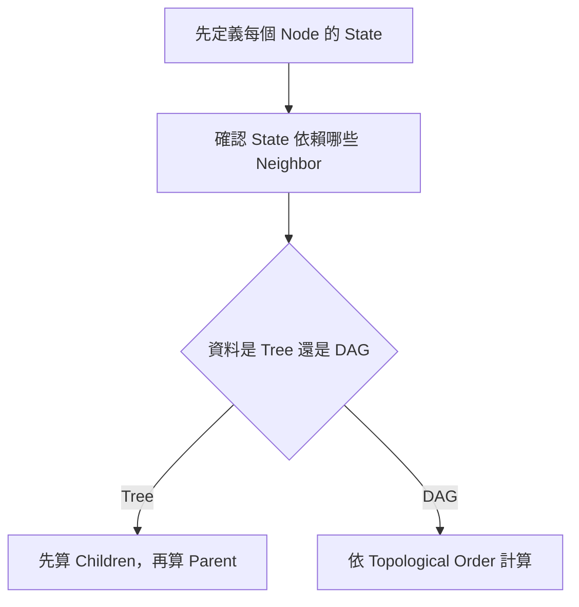
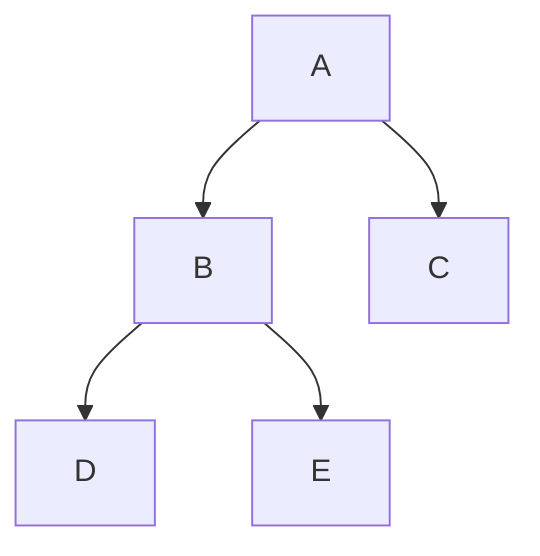
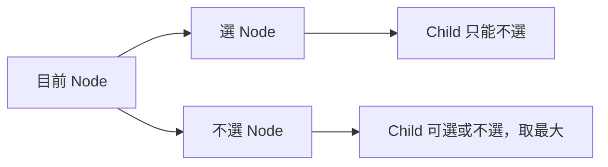
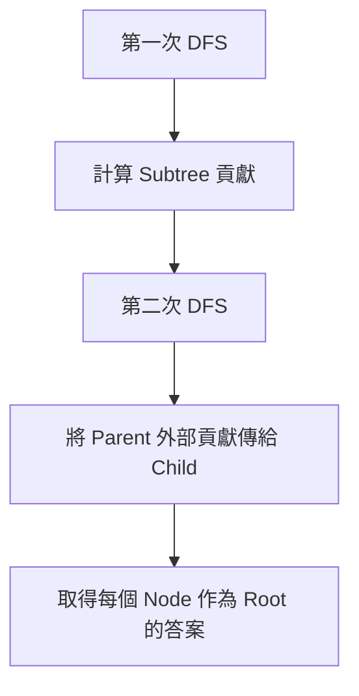

## 第 43 章　Tree 與 DAG Dynamic Programming

### 適用範圍

本章說明如何在 Tree 與 Directed Acyclic Graph，簡稱 DAG，上進行 Dynamic Programming。

Tree DP 的核心是先完成 Child 或 Subtree，再把結果交給 Parent。DAG DP 的核心是依照不違反依賴的順序計算 State。

第一次接觸時，常見困難是：

- `dp[node]` 代表單一節點，還是整棵 Subtree？
- 為什麼 Tree DFS 的 Exit 時機適合計算 DP？
- 選擇目前節點後，Child 為什麼有些狀態不能選？
- DAG 為什麼需要 Topological Order？
- Rerooting 為什麼不能對每個 Root 重新 DFS？



### 快速導覽

- [43.1 Tree DP 前到底要分析什麼](#431-tree-dp-前到底要分析什麼)
- [43.2 Subtree State](#432-subtree-state)
- [43.3 Parent-Child Transition](#433-parent-child-transition)
- [43.4 選擇與不選擇](#434-選擇與不選擇)
- [43.5 完整 Tree DP 範例](#435-完整-tree-dp-範例)
- [43.6 Rerooting](#436-rerooting)
- [43.7 DAG DP](#437-dag-dp)
- [43.8 Topological Order](#438-topological-order)
- [43.9 常見問題與判讀](#439-常見問題與判讀)
- [43.10 本章檢查表](#4310-本章檢查表)
- [43.11 本章重點](#4311-本章重點)

### 43.1 Tree DP 前到底要分析什麼

假設每個 Tree Node 有一筆價值，相鄰 Node 不能同時選，求最大總價值。

<table>
<tr><th>分析項目</th><th>本題內容</th></tr>
<tr><td>資料結構</td><td>無向 Tree</td></tr>
<tr><td>Root</td><td>可任選一個 Node 作為 Root</td></tr>
<tr><td>限制</td><td>Parent 與 Child 不能同時選</td></tr>
<tr><td>需要的 State</td><td>目前 Node 選或不選</td></tr>
<tr><td>計算方向</td><td>先完成 Children，再組合 Parent</td></tr>
<tr><td>答案</td><td>Root 選與不選兩種狀態的最大值</td></tr>
</table>

若只使用一個 `dp[node]`，無法區分目前 Node 是否已選，Parent 就不知道 Child 哪些答案合法。因此需要兩個 State。

### 43.2 Subtree State

指定 Root 後，每個 Node 都代表一棵 Subtree。

可以定義：

```text
dp[node][0] = 不選 node 時，node Subtree 的最大總價值
dp[node][1] = 選 node 時，node Subtree 的最大總價值
```

這裡的答案不是只有目前 Node，而是包含它下面所有 Descendants。



計算 A 前，需要先完成 B、C；計算 B 前，需要先完成 D、E。

### 43.3 Parent-Child Transition

若選目前 Node，Child 就不能選：

```text
dp[node][1] += dp[child][0]
```

若不選目前 Node，每個 Child 可以選或不選，取較大者：

```text
dp[node][0] += max(dp[child][0], dp[child][1])
```



Transition 必須根據相鄰限制推導，不是固定模板。

### 43.4 選擇與不選擇

以 Leaf 為例：

```text
dp[leaf][0] = 0
dp[leaf][1] = value[leaf]
```

對內部 Node：

1. 先把選中自己的價值放入 `dp[node][1]`。
2. 逐一合併每個 Child 的答案。
3. 不選自己的 State 可自由選擇 Child 最佳狀態。

這類「選或不選」State 也常出現在 House Robber on Tree、Maximum Independent Set on Tree 等問題。

### 43.5 完整 Tree DP 範例

```cpp
#include <algorithm>
#include <array>
#include <vector>

void treeDp(
    const std::vector<std::vector<int>>& graph,
    const std::vector<long long>& value,
    int node,
    int parent,
    std::vector<std::array<long long, 2>>& dp)
{
    dp[node][0] = 0;
    dp[node][1] = value[node];

    for (int child : graph[node])
    {
        if (child == parent)
        {
            continue;
        }

        treeDp(graph, value, child, node, dp);

        dp[node][0] += std::max(dp[child][0], dp[child][1]);
        dp[node][1] += dp[child][0];
    }
}

long long maximumIndependentValue(
    const std::vector<std::vector<int>>& graph,
    const std::vector<long long>& value)
{
    if (graph.empty())
    {
        return 0;
    }

    std::vector<std::array<long long, 2>> dp(graph.size());
    treeDp(graph, value, 0, -1, dp);

    return std::max(dp[0][0], dp[0][1]);
}
```

使用無向 Adjacency List 時，要用 `parent` 避免沿同一條 Edge 返回上一層。

時間複雜度為 O(V)，因為每條 Tree Edge 只被檢查固定次數。

### 43.6 Rerooting

有些題目要求每個 Node 作為 Root 時的答案。

直接對每個 Root 重新 DFS，時間可能是 O(V²)。Rerooting 會重用相鄰 Root 之間的大部分結果。

通常分兩階段：

1. Bottom-up 計算每個 Subtree 對目前 Root 的貢獻。
2. Top-down 將 Parent 方向的貢獻傳給 Child。



Rerooting 的公式依問題而異。新手應先確定「從 Parent 移到 Child 時，哪些貢獻要移除、哪些要加入」。

### 43.7 DAG DP

DAG 沒有 Directed Cycle，因此 State 依賴可以形成先後順序。

例如最長路徑：

```text
dp[v] = 到達 v 的最長距離
```

對 Edge `u -> v`：

```text
dp[v] = max(dp[v], dp[u] + weight(u, v))
```

必須先完成 u，才能更新 v。因此需要 Topological Order。

### 43.8 Topological Order

Topological Order 保證每條 Directed Edge `u -> v` 中，u 會出現在 v 前面。

```cpp
for (int node : topologicalOrder)
{
    for (const Edge& edge : graph[node])
    {
        dp[edge.to] = std::max(
            dp[edge.to],
            dp[node] + edge.weight);
    }
}
```

若 Graph 有 Directed Cycle，就不存在完整 Topological Order，這個 DAG DP 計算方式也失去前置條件。

### 43.9 常見問題與判讀

<table>
<tr><th>現象</th><th>可能原因</th><th>第一輪檢查</th></tr>
<tr><td>Parent 與 Child 互相遞迴</td><td>無向 Tree 未排除 Parent</td><td>傳入 parent 或使用 visited</td></tr>
<tr><td>選與不選結果錯誤</td><td>只定義單一 State</td><td>確認未來是否需知道目前是否已選</td></tr>
<tr><td>Parent 在 Child 前計算</td><td>計算時機錯誤</td><td>Tree DP 多在 DFS Exit 後組合</td></tr>
<tr><td>DAG DP 讀到未完成 State</td><td>沒有依 Topological Order</td><td>先確認所有依賴已完成</td></tr>
<tr><td>Rerooting 仍為 O(V²)</td><td>對每個 Root 重新完整 DFS</td><td>重用 Subtree 與 Parent 貢獻</td></tr>
</table>

### 43.10 本章檢查表

- 我能定義 `dp[node]` 是否包含整棵 Subtree。
- 我能依 Parent-Child 限制推導 State。
- 我知道 Tree DP 通常先算 Children。
- 我能使用 parent 避免無向 Tree 走回上一層。
- 我能說明選與不選兩個 State。
- 我知道 Rerooting 會重用相鄰 Root 的結果。
- 我知道 DAG DP 需要無 Cycle 與合法計算順序。
- 我能使用 Topological Order 計算 DAG State。

### 43.11 本章重點

- Tree DP 常以 Subtree 作為 State 範圍。
- Parent 的答案通常由所有 Child 的答案組成。
- 若未來合法選擇取決於目前是否選取，就需要分開 State。
- Tree DP 常在 DFS Exit 時完成 Transition。
- Rerooting 用兩階段傳遞 Subtree 與外部貢獻。
- DAG DP 依賴無 Cycle，並按照 Topological Order 計算。
- Tree 與 DAG 的共同核心是先完成依賴 State，再計算目前 State。
