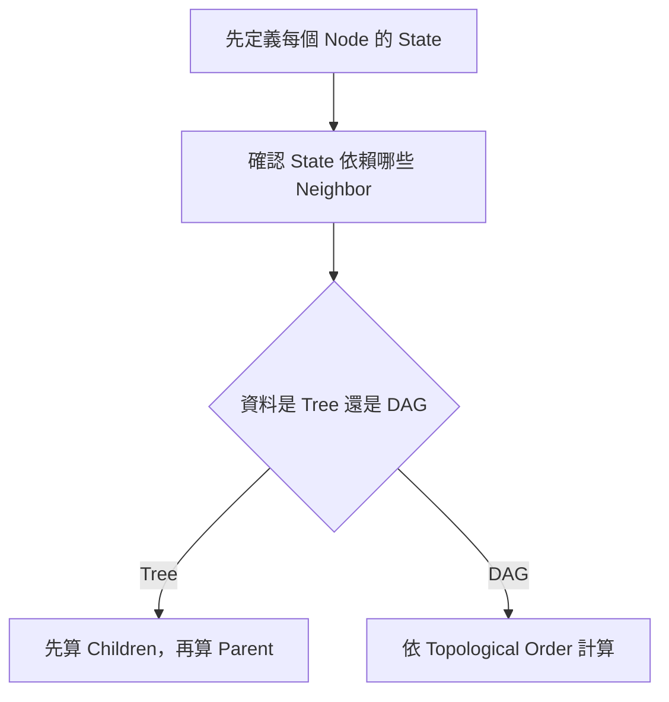
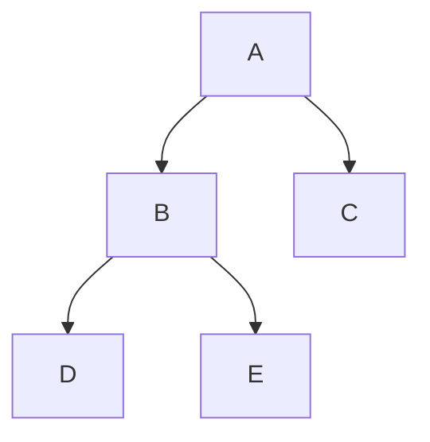
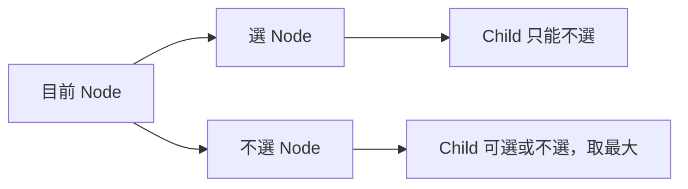
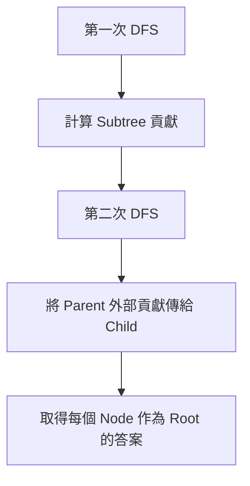
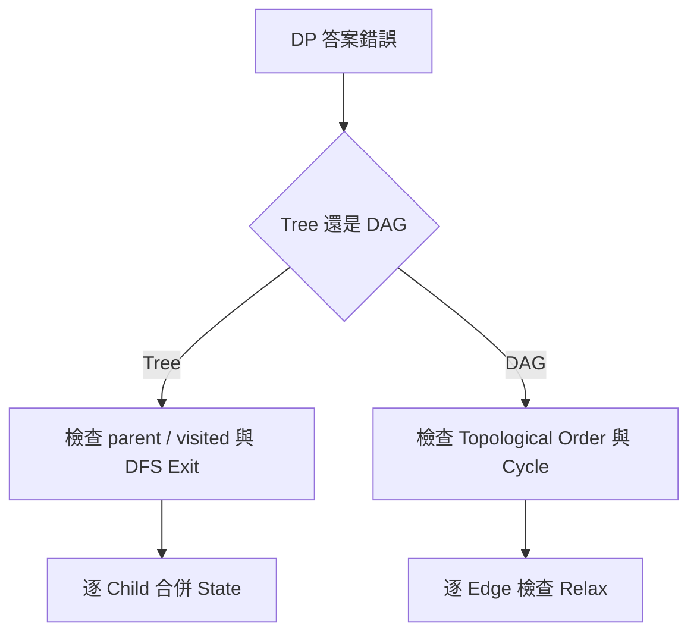

## 第 43 章　Tree 與 DAG Dynamic Programming

### 適用範圍

本章說明如何在 Tree 與 Directed Acyclic Graph，簡稱 DAG，上進行 Dynamic Programming。

Tree DP 的核心是先完成 Child 或 Subtree，再把結果交給 Parent。DAG DP 的核心是依照不違反依賴的順序計算 State。原始章節也指出，初學時常見困難包含：`dp[node]` 到底代表單一節點或整棵 Subtree、為什麼 DFS Exit 時機適合計算 DP、選擇目前節點後 Child 狀態如何受限、DAG 為什麼需要 Topological Order，以及 Rerooting 為什麼不能對每個 Root 重新 DFS。citeturn44search1

本版會在原始主線上補強：

- Tree DP 的 State 範圍與 Transition 推導。
- 選 / 不選類 Tree DP 的完整可編譯 C++ 實作。
- Tree Height、Diameter、Subtree Size 等常見 Tree DP 模型。
- Rerooting 的觀念與範例推導。
- DAG DP 的 Topological Order、最長路、路徑計數。
- Tree / DAG DP 的 Debug 表與常見錯誤。



### 適用讀者

- 已學過一維 DP，但不熟悉 Tree / Graph 上 State 依賴的讀者。
- 能寫 DFS，但不清楚 DFS 回來時要如何合併 Child State 的讀者。
- 容易把 `dp[node]` 誤解成只和 node 本身有關的讀者。
- 想理解 Maximum Independent Set on Tree、Tree Diameter、Rerooting、DAG Longest Path 的讀者。
- 常在無向 Tree 中忘記排除 Parent，或在 DAG 中沒有依 Topological Order 計算的讀者。

### 快速導覽

- [43.1 Tree DP 前到底要分析什麼](#431-tree-dp-前到底要分析什麼)
- [43.2 Subtree State](#432-subtree-state)
- [43.3 DFS Exit 時機與 Parent-Child Transition](#433-dfs-exit-時機與-parent-child-transition)
- [43.4 選擇與不選擇](#434-選擇與不選擇)
- [43.5 完整 Tree DP 範例：Maximum Independent Set](#435-完整-tree-dp-範例maximum-independent-set)
- [43.6 常見 Tree DP 模型](#436-常見-tree-dp-模型)
- [43.7 Rerooting](#437-rerooting)
- [43.8 Rerooting 範例：所有 Root 的距離和](#438-rerooting-範例所有-root-的距離和)
- [43.9 DAG DP](#439-dag-dp)
- [43.10 Topological Order](#4310-topological-order)
- [43.11 DAG DP 範例：最長路徑](#4311-dag-dp-範例最長路徑)
- [43.12 DAG DP 範例：路徑數](#4312-dag-dp-範例路徑數)
- [43.13 Tree DP 與 DAG DP 比較](#4313-tree-dp-與-dag-dp-比較)
- [43.14 系統化 Debug](#4314-系統化-debug)
- [43.15 常見問題與判讀](#4315-常見問題與判讀)
- [43.16 本章檢查表](#4316-本章檢查表)
- [43.17 本章重點](#4317-本章重點)

### 43.1 Tree DP 前到底要分析什麼

假設每個 Tree Node 有一筆價值，相鄰 Node 不能同時選，求最大總價值。

<table>
<tr><th>分析項目</th><th>本題內容</th><th>影響</th></tr>
<tr><td>資料結構</td><td>無向 Tree</td><td>DFS 時要排除 parent</td></tr>
<tr><td>Root</td><td>可任選一個 Node 作為 Root</td><td>Root 後會形成 Parent / Child 關係</td></tr>
<tr><td>限制</td><td>Parent 與 Child 不能同時選</td><td>需要分成選與不選 State</td></tr>
<tr><td>需要的 State</td><td>目前 Node 選或不選</td><td>`dp[node][0]`、`dp[node][1]`</td></tr>
<tr><td>計算方向</td><td>先完成 Children，再組合 Parent</td><td>Postorder / DFS Exit</td></tr>
<tr><td>答案</td><td>Root 選與不選兩種狀態的最大值</td><td>`max(dp[root][0], dp[root][1])`</td></tr>
</table>

若只使用一個 `dp[node]`，無法區分目前 Node 是否已選，Parent 就不知道 Child 哪些答案合法。因此需要兩個 State。原始章節也以同一題說明，未來合法選擇若取決於目前是否已選取，就需要分開 State。citeturn44search1

#### Tree DP 前五問

1. Root 是否任選？
2. `dp[node]` 表示單一節點，還是整棵 Subtree？
3. Parent 需要知道 Child 哪些資訊？
4. Transition 是合併所有 Child，還是選其中一個 Child？
5. 答案在 Root，還是每個 Node 都要答案？

### 43.2 Subtree State

指定 Root 後，每個 Node 都代表一棵 Subtree。

可以定義：

```text
dp[node][0] = 不選 node 時，node Subtree 的最大總價值
dp[node][1] = 選 node 時，node Subtree 的最大總價值
```

這裡的答案不是只有目前 Node，而是包含它下面所有 Descendants。原始章節也特別強調，Tree DP 中的 Subtree State 包含整棵 Subtree，而不只是 node 本身。citeturn44search1



計算 A 前，需要先完成 B、C；計算 B 前，需要先完成 D、E。

#### Subtree State 的常見形式

<table>
<tr><th>題型</th><th>State 例子</th><th>語意</th></tr>
<tr><td>Subtree Size</td><td>`size[node]`</td><td>node Subtree 的節點數</td></tr>
<tr><td>Height</td><td>`height[node]`</td><td>node 往下最長路徑長度</td></tr>
<tr><td>Independent Set</td><td>`dp[node][0/1]`</td><td>node 不選 / 選時 Subtree 最佳值</td></tr>
<tr><td>Tree Diameter</td><td>`height[node]` + global answer</td><td>合併兩條最深 Child path</td></tr>
<tr><td>Tree Knapsack</td><td>`dp[node][k]`</td><td>node Subtree 選 k 個時的最佳值</td></tr>
</table>

### 43.3 DFS Exit 時機與 Parent-Child Transition

Tree DP 常在 DFS Exit 時完成 Transition。原因是：進入 node 時，Child 的答案還沒有算完；等 Child DFS 回來後，才有足夠資訊合併 Parent。

對「相鄰 Node 不能同時選」問題：

若選目前 Node，Child 就不能選：

```text
dp[node][1] += dp[child][0]
```

若不選目前 Node，每個 Child 可以選或不選，取較大者：

```text
dp[node][0] += max(dp[child][0], dp[child][1])
```

原始章節也列出這兩條 Transition，並提醒 Transition 必須根據相鄰限制推導，不是固定模板。citeturn44search1



#### 合併 Child 的常見模式

<table>
<tr><th>合併類型</th><th>例子</th></tr>
<tr><td>加總所有 Child</td><td>Subtree Size、Independent Set</td></tr>
<tr><td>取最大 Child</td><td>Height</td></tr>
<tr><td>取前兩大 Child</td><td>Diameter through node</td></tr>
<tr><td>Child DP 做背包合併</td><td>Tree Knapsack</td></tr>
<tr><td>取 min / max 狀態</td><td>Minimum Vertex Cover on Tree</td></tr>
</table>

### 43.4 選擇與不選擇

以 Leaf 為例：

```text
dp[leaf][0] = 0
dp[leaf][1] = value[leaf]
```

對內部 Node：

1. 先把選中自己的價值放入 `dp[node][1]`。
2. 逐一合併每個 Child 的答案。
3. 不選自己的 State 可自由選擇 Child 最佳狀態。

原始章節也指出，這類「選或不選」State 常出現在 House Robber on Tree、Maximum Independent Set on Tree 等問題。citeturn44search1

#### 如何判斷需要選 / 不選 State

如果 Parent 的合法決策取決於 Child 本身是否被選，就需要讓 Child 的 DP 回傳「選」與「不選」兩種情況。

不夠的 State：

```text
dp[node] = node Subtree 最大值
```

問題：Parent 不知道這個最大值是否選了 node。

足夠的 State：

```text
dp[node][0] = 不選 node 的最佳值
dp[node][1] = 選 node 的最佳值
```

### 43.5 完整 Tree DP 範例：Maximum Independent Set

題目：給定一棵無向 Tree，每個 Node 有 value。選一些 Node，使任何相鄰 Node 不能同時被選，最大化 value 總和。

```cpp
#include <algorithm>
#include <array>
#include <vector>

void treeDp(
    const std::vector<std::vector<int>>& graph,
    const std::vector<long long>& value,
    int node,
    int parent,
    std::vector<std::array<long long, 2>>& dp)
{
    dp[node][0] = 0;
    dp[node][1] = value[node];

    for (int child : graph[node])
    {
        if (child == parent)
        {
            continue;
        }

        treeDp(graph, value, child, node, dp);

        dp[node][0] += std::max(dp[child][0], dp[child][1]);
        dp[node][1] += dp[child][0];
    }
}

long long maximumIndependentValue(
    const std::vector<std::vector<int>>& graph,
    const std::vector<long long>& value)
{
    if (graph.empty())
    {
        return 0;
    }

    std::vector<std::array<long long, 2>> dp(graph.size());
    treeDp(graph, value, 0, -1, dp);

    return std::max(dp[0][0], dp[0][1]);
}
```

原始章節也提供了這個 Tree DP 範例，並提醒無向 Adjacency List 中要用 `parent` 避免沿同一條 Edge 返回上一層。citeturn44search1

#### 複雜度

```text
時間：O(V)
空間：O(V) + 遞迴 Stack O(h)
```

每條 Tree Edge 只被檢查固定次數。原始章節也指出此範例時間複雜度為 O(V)。citeturn44search1

### 43.6 常見 Tree DP 模型

#### Subtree Size

```text
size[node] = 1 + sum(size[child])
```

```cpp
int computeSubtreeSize(
    const std::vector<std::vector<int>>& graph,
    int node,
    int parent,
    std::vector<int>& subtreeSize)
{
    subtreeSize[node] = 1;

    for (int child : graph[node])
    {
        if (child == parent)
        {
            continue;
        }

        subtreeSize[node] += computeSubtreeSize(
            graph,
            child,
            node,
            subtreeSize);
    }

    return subtreeSize[node];
}
```

#### Height

```text
height[node] = 1 + max(height[child])
```

Leaf 的 height 可定義為 0 或 1，依題目使用 Edge 數或 Node 數決定。

#### Diameter

對每個 node，若最深兩條 Child path 長度為 first、second，則經過 node 的 Diameter 候選為：

```text
first + second
```

具體加法要依 height 定義是 Edge 數還是 Node 數調整。

#### Minimum Vertex Cover on Tree

若選 node，就可以選或不選 child；若不選 node，child 必須選。

```text
dp[node][1] = 1 + sum(min(dp[child][0], dp[child][1]))
dp[node][0] = sum(dp[child][1])
```

這和 Independent Set 的 Transition 不同，原因是限制不同。這也呼應原始章節的提醒：Transition 必須由限制推導，不是固定模板。citeturn44search1

### 43.7 Rerooting

有些題目要求每個 Node 作為 Root 時的答案。直接對每個 Root 重新 DFS，時間可能是 O(V²)。Rerooting 會重用相鄰 Root 之間的大部分結果。

原始章節也說明，Rerooting 通常分兩階段：Bottom-up 計算每個 Subtree 對目前 Root 的貢獻，Top-down 將 Parent 方向的貢獻傳給 Child。citeturn44search1



#### Rerooting 的核心問題

當 Root 從 parent 移到 child 時，要回答：

```text
哪些貢獻要從 parent 移除？
哪些貢獻要加入 child？
```

原始章節也提醒，新手應先確定「從 Parent 移到 Child 時，哪些貢獻要移除、哪些要加入」。citeturn44search1

#### Rerooting 適合題型

- 每個 Node 作為 Root 的 Subtree / 距離答案。
- Tree 中每個 Node 到所有其他 Node 的距離和。
- 每個 Node 作為中心時的某種成本。
- 需要全樹答案，但每個 Root 都要輸出。

### 43.8 Rerooting 範例：所有 Root 的距離和

題目：給定一棵 Tree，對每個 node，求它到所有其他 Node 的距離總和。

#### 第一階段：以 0 為 Root

計算：

```text
subtreeSize[node]
distanceSum[0] = root 0 到所有 Node 的距離總和
```

#### 第二階段：從 parent 轉移到 child

假設目前知道 `answer[parent]`，要算 `answer[child]`。

Root 從 parent 移到 child：

- child Subtree 中的所有 Node 距離都減少 1，共 `subtreeSize[child]` 個。
- 其他 Node 距離都增加 1，共 `n - subtreeSize[child]` 個。

所以：

```text
answer[child] = answer[parent]
              - subtreeSize[child]
              + (n - subtreeSize[child])
```

#### C++ 片段

```cpp
void dfsSubtree(
    const std::vector<std::vector<int>>& graph,
    int node,
    int parent,
    int depth,
    std::vector<int>& subtreeSize,
    long long& rootDistanceSum)
{
    subtreeSize[node] = 1;
    rootDistanceSum += depth;

    for (int child : graph[node])
    {
        if (child == parent)
        {
            continue;
        }

        dfsSubtree(
            graph,
            child,
            node,
            depth + 1,
            subtreeSize,
            rootDistanceSum);

        subtreeSize[node] += subtreeSize[child];
    }
}

void dfsReroot(
    const std::vector<std::vector<int>>& graph,
    int node,
    int parent,
    const std::vector<int>& subtreeSize,
    std::vector<long long>& answer)
{
    const int n = static_cast<int>(graph.size());

    for (int child : graph[node])
    {
        if (child == parent)
        {
            continue;
        }

        answer[child] = answer[node]
                      - subtreeSize[child]
                      + (n - subtreeSize[child]);

        dfsReroot(graph, child, node, subtreeSize, answer);
    }
}

std::vector<long long> sumOfDistancesFromEachNode(
    const std::vector<std::vector<int>>& graph)
{
    const int n = static_cast<int>(graph.size());
    std::vector<int> subtreeSize(n, 0);
    std::vector<long long> answer(n, 0);

    long long rootDistanceSum = 0;
    dfsSubtree(graph, 0, -1, 0, subtreeSize, rootDistanceSum);

    answer[0] = rootDistanceSum;
    dfsReroot(graph, 0, -1, subtreeSize, answer);

    return answer;
}
```

#### 複雜度

```text
兩次 DFS：O(V)
空間：O(V) + 遞迴 Stack
```

### 43.9 DAG DP

DAG 沒有 Directed Cycle，因此 State 依賴可以形成先後順序。

例如最長路徑：

```text
dp[v] = 到達 v 的最長距離
```

對 Edge `u -> v`：

```text
dp[v] = max(dp[v], dp[u] + weight(u, v))
```

必須先完成 u，才能更新 v。因此需要 Topological Order。原始章節也明確指出，DAG DP 必須依 Topological Order，否則可能讀到未完成 State。citeturn44search1

#### DAG DP 常見題型

<table>
<tr><th>題型</th><th>State</th><th>Transition</th></tr>
<tr><td>Longest Path in DAG</td><td>`dp[v]` 到 v 的最長距離</td><td>由 predecessor 或 outgoing edge 更新</td></tr>
<tr><td>Path Count</td><td>`dp[v]` 到 v 的路徑數</td><td>加總前一層 State</td></tr>
<tr><td>Course Schedule</td><td>Topological Order</td><td>Indegree 遞減</td></tr>
<tr><td>DAG Shortest Path</td><td>`dist[v]`</td><td>Topological Order Relax Edge</td></tr>
<tr><td>Dependency DP</td><td>依題目定義</td><td>依拓樸順序合併所需資訊</td></tr>
</table>

### 43.10 Topological Order

Topological Order 保證每條 Directed Edge `u -> v` 中，u 會出現在 v 前面。

原始章節也說明，若 Graph 有 Directed Cycle，就不存在完整 Topological Order，DAG DP 的計算方式也失去前置條件。citeturn44search1

#### Kahn Algorithm

```cpp
#include <queue>
#include <vector>

std::vector<int> topologicalSort(
    const std::vector<std::vector<int>>& graph)
{
    const int n = static_cast<int>(graph.size());
    std::vector<int> indegree(n, 0);

    for (int node = 0; node < n; ++node)
    {
        for (int next : graph[node])
        {
            ++indegree[next];
        }
    }

    std::queue<int> ready;

    for (int node = 0; node < n; ++node)
    {
        if (indegree[node] == 0)
        {
            ready.push(node);
        }
    }

    std::vector<int> order;

    while (!ready.empty())
    {
        int node = ready.front();
        ready.pop();
        order.push_back(node);

        for (int next : graph[node])
        {
            --indegree[next];

            if (indegree[next] == 0)
            {
                ready.push(next);
            }
        }
    }

    return order;
}
```

若 `order.size() != n`，表示 Graph 中存在 Directed Cycle，不能直接做 DAG DP。

### 43.11 DAG DP 範例：最長路徑

給定 DAG 與 weighted edge，從 source 出發，求到每個 Node 的最長距離。

```cpp
#include <algorithm>
#include <limits>
#include <vector>

struct Edge
{
    int to;
    long long weight;
};

std::vector<long long> longestPathInDag(
    const std::vector<std::vector<Edge>>& graph,
    const std::vector<int>& topologicalOrder,
    int source)
{
    const long long NEG_INF = std::numeric_limits<long long>::lowest() / 4;
    const int n = static_cast<int>(graph.size());

    std::vector<long long> dp(n, NEG_INF);
    dp[source] = 0;

    for (int node : topologicalOrder)
    {
        if (dp[node] == NEG_INF)
        {
            continue;
        }

        for (const Edge& edge : graph[node])
        {
            dp[edge.to] = std::max(
                dp[edge.to],
                dp[node] + edge.weight);
        }
    }

    return dp;
}
```

原始章節也提供了類似的 DAG DP pseudo code：依 Topological Order，對每條 Edge `u -> v` 更新 `dp[v]`。citeturn44search1

#### 複雜度

```text
Topological Sort：O(V + E)
DP Relax Edge：O(V + E)
總時間：O(V + E)
空間：O(V + E)
```

### 43.12 DAG DP 範例：路徑數

題目：給定 DAG，求從 source 到每個 Node 的路徑數。

```cpp
std::vector<long long> countPathsInDag(
    const std::vector<std::vector<int>>& graph,
    const std::vector<int>& topologicalOrder,
    int source)
{
    const int n = static_cast<int>(graph.size());
    std::vector<long long> dp(n, 0);
    dp[source] = 1;

    for (int node : topologicalOrder)
    {
        for (int next : graph[node])
        {
            dp[next] += dp[node];
        }
    }

    return dp;
}
```

若答案很大，需依題目要求取 mod。

#### 注意

若 source 在 Topological Order 中較後面，不影響正確性。source 前面的 Node dp 為 0，處理它們不會造成貢獻。

### 43.13 Tree DP 與 DAG DP 比較

<table>
<tr><th>項目</th><th>Tree DP</th><th>DAG DP</th></tr>
<tr><td>資料結構</td><td>Tree，通常無向</td><td>Directed Acyclic Graph</td></tr>
<tr><td>依賴方向</td><td>Root 後 Parent / Child</td><td>Directed Edge 與 Topological Order</td></tr>
<tr><td>計算順序</td><td>DFS Exit / Postorder</td><td>Topological Order</td></tr>
<tr><td>Cycle 問題</td><td>無向 Tree 需排除 parent</td><td>不能有 Directed Cycle</td></tr>
<tr><td>常見 State</td><td>Subtree、選 / 不選、Height</td><td>到達某 Node 的值、路徑數、最長距離</td></tr>
<tr><td>常見錯誤</td><td>忘記 parent，State 不足</td><td>未拓樸排序，讀未完成 State</td></tr>
</table>

#### 共同核心

Tree 與 DAG 的共同核心是：

```text
先完成依賴 State，再計算目前 State。
```

這也是原始章節的本章重點之一。citeturn44search1

### 43.14 系統化 Debug

#### Tree DP Debug 欄位

```text
node
parent
children
進入 node 時初始 dp
每個 child 回傳後的 dp[child]
合併 child 後的 dp[node]
離開 node 時的最終 dp
```

#### DAG DP Debug 欄位

```text
topological order
node 是否已可達
dp[node] 目前值
edge.to
更新前 dp[edge.to]
更新後 dp[edge.to]
```



#### 小型測試

Tree DP：

- 空 Tree。
- 單一 Node。
- 兩個 Node。
- 鏈狀 Tree。
- 星狀 Tree。
- 所有 value 都相同。

DAG DP：

- 單一 Node。
- 一條鏈。
- 多個 source。
- 不可達 Node。
- 有 Cycle 的反例。
- 多條路徑到同一 Node。

### 43.15 常見問題與判讀

原始章節的常見問題包含：Parent 與 Child 互相遞迴、選與不選結果錯誤、Parent 在 Child 前計算、DAG DP 讀到未完成 State、Rerooting 仍為 O(V²)。citeturn44search1

<table>
<tr><th>現象</th><th>可能原因</th><th>第一輪檢查</th></tr>
<tr><td>Parent 與 Child 互相遞迴</td><td>無向 Tree 未排除 Parent</td><td>傳入 parent 或使用 visited</td></tr>
<tr><td>選與不選結果錯誤</td><td>只定義單一 State</td><td>確認未來是否需知道目前是否已選</td></tr>
<tr><td>Parent 在 Child 前計算</td><td>計算時機錯誤</td><td>Tree DP 多在 DFS Exit 後組合</td></tr>
<tr><td>DAG DP 讀到未完成 State</td><td>沒有依 Topological Order</td><td>先確認所有依賴已完成</td></tr>
<tr><td>Rerooting 仍為 O(V²)</td><td>對每個 Root 重新完整 DFS</td><td>重用 Subtree 與 Parent 貢獻</td></tr>
<tr><td>Tree DP Stack Overflow</td><td>Tree 太深</td><td>考慮 iterative DFS 或調整環境</td></tr>
<tr><td>DAG Longest Path 錯誤</td><td>不可達 State 初始化錯</td><td>使用 NEG_INF 並跳過不可達</td></tr>
<tr><td>路徑數過大</td><td>未取 mod 或 Overflow</td><td>依題目使用 modulo</td></tr>
<tr><td>Topological Order 不完整</td><td>Graph 有 Directed Cycle</td><td>檢查 order size 是否等於 V</td></tr>
</table>

### 43.16 本章檢查表

- 我能定義 `dp[node]` 是否包含整棵 Subtree。
- 我能依 Parent-Child 限制推導 State。
- 我知道 Tree DP 通常先算 Children。
- 我能使用 parent 避免無向 Tree 走回上一層。
- 我能說明選與不選兩個 State。
- 我知道 Tree Diameter、Height、Subtree Size 的 DP 合併方式。
- 我知道 Rerooting 會重用相鄰 Root 的結果。
- 我能說明從 Parent 移到 Child 時哪些貢獻移除、哪些加入。
- 我知道 DAG DP 需要無 Cycle 與合法計算順序。
- 我能使用 Topological Order 計算 DAG State。
- 我會檢查不可達 State、Overflow 與 Cycle。

原始章節檢查表也包含 Subtree State、Parent-Child 限制、先算 Children、使用 parent、選與不選 State、Rerooting、DAG 無 Cycle 與 Topological Order 等項目。citeturn44search1

### 43.17 本章重點

- Tree DP 常以 Subtree 作為 State 範圍。
- Parent 的答案通常由所有 Child 的答案組成。
- 若未來合法選擇取決於目前是否選取，就需要分開 State。
- Tree DP 常在 DFS Exit 時完成 Transition。
- 無向 Tree 實作時要排除 parent，避免走回上一層。
- Rerooting 用兩階段傳遞 Subtree 與外部貢獻。
- DAG DP 依賴無 Cycle，並按照 Topological Order 計算。
- Tree 與 DAG 的共同核心是先完成依賴 State，再計算目前 State。
