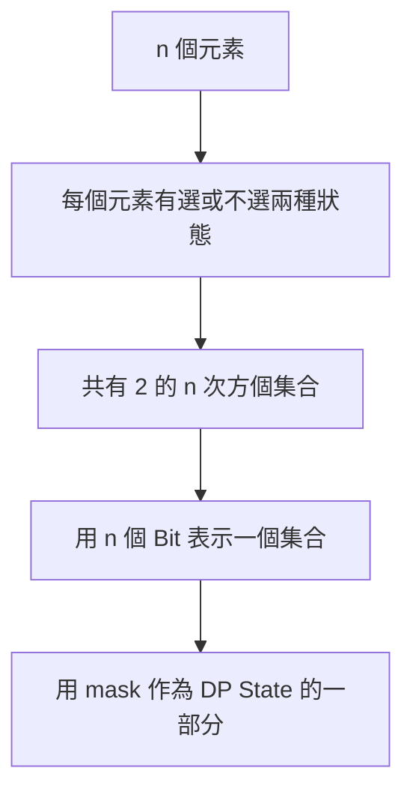
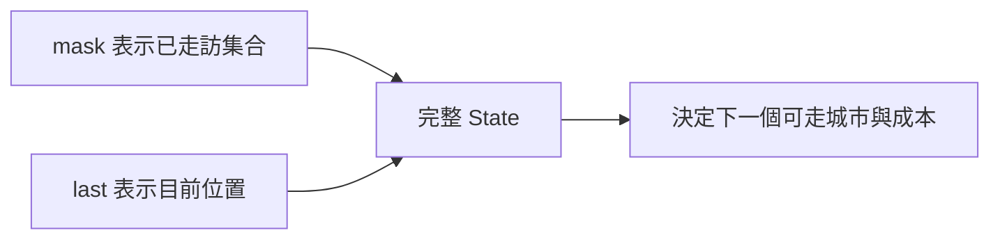
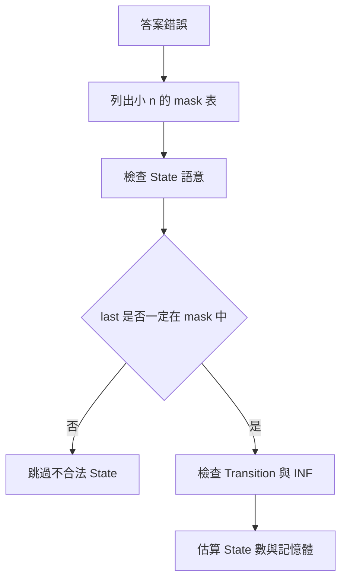

## 第 44 章　State Compression DP

### 適用範圍

本章說明 State Compression DP，也常稱為 Bitmask DP。它用一個整數的 Binary Bits 表示「哪些元素已經選過」，再把這個集合狀態放進 Dynamic Programming 的 State 中。

原始章節已經整理出核心觀念：Bitmask DP 適合元素數量不大，但需要記錄集合狀態的問題，例如 Traveling Salesperson Problem、Assignment 與訪問所有節點。它也指出初學時常見困難包括：整數如何代表集合、如何判斷第 i 個元素是否已選、為什麼 `dp[mask][last]` 還需要 `last`、為什麼複雜度有 `2^n`，以及 n 到多少時記憶體會無法接受。citeturn44search1

本版會補上更完整的推導方式、常見 State 設計、TSP 與 Assignment 的可編譯 C++ 實作、Submask 枚舉、複雜度估算與 Debug 方法。



### 適用讀者

- 已了解基本 DP，但不熟悉用整數表示集合的讀者。
- 常看到 `dp[mask][last]`，但不清楚 `last` 為何必要的讀者。
- 想理解 TSP、Assignment、Hamiltonian Path、訪問所有節點最短路的讀者。
- 常低估 `2^n` 記憶體與時間成本的讀者。
- Bit 操作、Submask 枚舉或 INF 加法容易出錯的讀者。

### 快速導覽

- [44.1 Bitmask DP 前到底要分析什麼](#441-bitmask-dp-前到底要分析什麼)
- [44.2 Bitmask 表示集合](#442-bitmask-表示集合)
- [44.3 常用 Bit 操作](#443-常用-bit-操作)
- [44.4 Subset 與 Submask](#444-subset-與-submask)
- [44.5 State 與最後位置](#445-state-與最後位置)
- [44.6 TSP](#446-tsp)
- [44.7 Assignment 問題](#447-assignment-問題)
- [44.8 Hamiltonian Path 與訪問所有節點](#448-hamiltonian-path-與訪問所有節點)
- [44.9 Subset DP 與 Merge Subset](#449-subset-dp-與-merge-subset)
- [44.10 時間與空間限制](#4410-時間與空間限制)
- [44.11 實作與記憶體技巧](#4411-實作與記憶體技巧)
- [44.12 系統化 Debug](#4412-系統化-debug)
- [44.13 常見問題與判讀](#4413-常見問題與判讀)
- [44.14 本章檢查表](#4414-本章檢查表)
- [44.15 本章重點](#4415-本章重點)

### 44.1 Bitmask DP 前到底要分析什麼

假設有 4 個城市，需要記錄目前已經走過哪些城市。

<table>
<tr><th>分析項目</th><th>本題內容</th><th>影響</th></tr>
<tr><td>元素數量</td><td>4 個城市</td><td>集合數量為 16</td></tr>
<tr><td>集合資訊</td><td>哪些城市已走訪</td><td>可用 4 個 Bit 表示</td></tr>
<tr><td>集合數量</td><td>2 的 4 次方</td><td>可枚舉所有 mask</td></tr>
<tr><td>是否只知道集合就足夠</td><td>不夠，還要知道目前停在哪個城市</td><td>需要 last 維度</td></tr>
<tr><td>State</td><td>已走訪集合與目前位置</td><td>常見形式為二維 DP</td></tr>
<tr><td>限制</td><td>n 必須足夠小</td><td>才能枚舉所有集合</td></tr>
</table>

原始章節也用 4 個城市說明，Bitmask DP 的前置條件通常不是資料值小，而是「需要記錄的元素數量 n 小」。citeturn44search1

#### 使用 Bitmask DP 前先問

1. 元素數量 n 有多大？
2. 每個元素是否只有選或不選兩種狀態？
3. `mask` 能否完整表示目前選取集合？
4. 是否還需要額外資訊，例如目前位置、剩餘容量、最後顏色？
5. State 數量與 Transition 成本是否可接受？
6. 不可達 State 如何初始化？

### 44.2 Bitmask 表示集合

對 4 個元素，從右到左的 Bit 0 到 3 分別代表元素 0 到 3。

```text
mask = 0101₂
```

表示元素 0 與 2 已選。原始章節也用 `0101₂` 說明元素 0 與 2 已選。citeturn44search1

<table>
<tr><th>元素</th><th>對應 Bit</th><th>是否在 0101 中</th></tr>
<tr><td>0</td><td>最低位</td><td>是</td></tr>
<tr><td>1</td><td>第 1 位</td><td>否</td></tr>
<tr><td>2</td><td>第 2 位</td><td>是</td></tr>
<tr><td>3</td><td>第 3 位</td><td>否</td></tr>
</table>

#### 全部元素已選

```cpp
int fullMask = (1 << n) - 1;
```

若 n 較大，要注意位移型別與 Overflow，可使用：

```cpp
long long fullMask = (1LL << n) - 1;
```

原始章節也提醒，n 很大時要注意位移型別與 Overflow，可使用 `1LL << n`。citeturn44search1

#### Mask 的語意要固定

同一題中，Bit 1 可以代表「已選」，也可以代表「未選」，但必須全程一致。建議使用最直覺的語意：

```text
bit i = 1 代表元素 i 已選或已訪問
bit i = 0 代表元素 i 尚未選或尚未訪問
```

### 44.3 常用 Bit 操作

#### 判斷第 i 個元素是否已選

```cpp
bool selected = (mask & (1 << i)) != 0;
```

#### 加入第 i 個元素

```cpp
int nextMask = mask | (1 << i);
```

#### 移除第 i 個元素

```cpp
int nextMask = mask & ~(1 << i);
```

#### 切換第 i 個元素

```cpp
int nextMask = mask ^ (1 << i);
```

原始章節也列出這四種常用操作，並提醒不要使用加法加入 Bit，因為若該 Bit 原本已是 1，加法可能產生進位，改變其他 Bit。citeturn44search1

#### 加法加入 Bit 的風險

假設：

```text
mask = 0011₂
想加入 bit 0
```

如果使用：

```cpp
mask += (1 << 0);
```

結果：

```text
0011 + 0001 = 0100
```

不只沒有保持 bit 0，還把其他 Bit 改掉。應使用 OR：

```cpp
mask |= (1 << 0);
```

#### C++ 型別建議

若 n 小於 31，可用 int。若 n 可能到 63，可使用 unsigned long long，但仍要確認位移量小於 64。

```cpp
unsigned long long bit = 1ULL << i;
```

### 44.4 Subset 與 Submask

#### 枚舉所有集合

```cpp
for (int mask = 0; mask < (1 << n); ++mask)
{
    // mask 表示一個 subset
}
```

這會枚舉從空集合到全集的所有 `2^n` 個集合。原始章節也使用這個迴圈說明所有集合枚舉。citeturn44search1

#### 枚舉某個 mask 的所有非空 Submask

```cpp
for (int submask = mask; submask > 0; submask = (submask - 1) & mask)
{
    // submask 是 mask 的非空子集合
}
```

最後若需要空集合，要另外處理 `submask == 0`。原始章節也提醒，枚舉非空 Submask 時，若需要空集合要另外處理 0。citeturn44search1

#### 包含空集合的寫法

```cpp
int submask = mask;

while (true)
{
    // process submask

    if (submask == 0)
    {
        break;
    }

    submask = (submask - 1) & mask;
}
```

#### 所有 mask 的所有 submask

若對每個 mask 都枚舉它的所有 submask，總複雜度通常是 O(3^n)，不是 O(2^n)。原始章節也特別提醒這一點。citeturn44search1

直覺解釋：每個元素有三種狀態：

1. 不在 mask。
2. 在 mask，但不在 submask。
3. 在 mask，也在 submask。

因此總量是 `3^n`。

### 44.5 State 與最後位置

在路徑問題中，只知道走過哪些城市通常不夠。

例如同樣走過 `{0, 1, 2}`：

```text
目前在 1
目前在 2
```

下一步成本可能不同。因此需要定義：

```text
dp[mask][last] = 已走訪 mask 中城市，且目前停在 last 的最低成本
```

原始章節也用這個例子說明，路徑問題通常需要同時保存已走訪集合與目前位置。citeturn44search1



#### last 必須在 mask 中

`last` 必須包含在 `mask` 中，否則 State 語意不成立。原始章節也明確提醒，`last` 必須包含在 `mask` 中。citeturn44search1

可以在迴圈中跳過不合法 State：

```cpp
if ((mask & (1 << last)) == 0)
{
    continue;
}
```

#### 什麼時候不需要 last

有些題目的「目前步驟」可由 mask 推出。例如 Assignment 問題中，若依序處理第 0、1、2、... 個人，已分配工作數等於目前要處理的人員 Index。因此只需要 `dp[mask]`。

### 44.6 TSP

Traveling Salesperson Problem：從起點 0 出發，拜訪每個城市一次，最後回到起點，求最低成本。

#### State

```text
dp[mask][last] = 已走訪 mask 中城市，且目前停在 last 的最低成本
```

#### Base Case

```text
dp[1 << 0][0] = 0
```

表示只走訪城市 0，目前也在 0，成本為 0。原始章節也以此作為 TSP Base Case。citeturn44search1

#### Transition

從目前 `last` 前往尚未走訪的 `next`：

```text
nextMask = mask | (1 << next)
dp[nextMask][next] = min(
    dp[nextMask][next],
    dp[mask][last] + cost[last][next]
)
```

原始章節也列出相同 Transition。citeturn44search1

#### C++ 實作

```cpp
#include <algorithm>
#include <limits>
#include <vector>

long long tsp(const std::vector<std::vector<long long>>& cost)
{
    const int n = static_cast<int>(cost.size());

    if (n == 0)
    {
        return 0;
    }

    const int stateCount = 1 << n;
    const long long INF = std::numeric_limits<long long>::max() / 4;

    std::vector<std::vector<long long>> dp(
        stateCount,
        std::vector<long long>(n, INF));

    dp[1 << 0][0] = 0;

    for (int mask = 0; mask < stateCount; ++mask)
    {
        for (int last = 0; last < n; ++last)
        {
            if ((mask & (1 << last)) == 0)
            {
                continue;
            }

            if (dp[mask][last] == INF)
            {
                continue;
            }

            for (int next = 0; next < n; ++next)
            {
                if ((mask & (1 << next)) != 0)
                {
                    continue;
                }

                const int nextMask = mask | (1 << next);

                dp[nextMask][next] = std::min(
                    dp[nextMask][next],
                    dp[mask][last] + cost[last][next]);
            }
        }
    }

    const int fullMask = stateCount - 1;
    long long answer = INF;

    for (int last = 0; last < n; ++last)
    {
        if (dp[fullMask][last] == INF)
        {
            continue;
        }

        answer = std::min(
            answer,
            dp[fullMask][last] + cost[last][0]);
    }

    return answer;
}
```

原始章節也提供 TSP 程式與時間空間複雜度；本版補上合法 State 檢查、完整 include 與可編譯型別。citeturn44search1

#### 複雜度

```text
State 數量：2^n × n
每個 State 枚舉 next：O(n)
時間：O(2^n × n^2)
空間：O(2^n × n)
```

### 44.7 Assignment 問題

有 n 個人與 n 個工作，每個人執行每個工作有不同成本，要求一對一分配的最低總成本。

若依序處理人員，可以只用 mask 表示哪些工作已分配：

```text
dp[mask] = 已分配 mask 中工作時的最低成本
```

目前要處理的人員 Index 可以由已選工作數得到：

```cpp
int person = std::popcount(static_cast<unsigned>(mask));
```

原始章節也用 Assignment 問題說明，State 是否需要額外維度，取決於其他資訊能否由 mask 唯一推導。citeturn44search1

#### C++ 實作

```cpp
#include <algorithm>
#include <bit>
#include <limits>
#include <vector>

long long assignmentMinimumCost(
    const std::vector<std::vector<long long>>& cost)
{
    const int n = static_cast<int>(cost.size());
    const int stateCount = 1 << n;
    const long long INF = std::numeric_limits<long long>::max() / 4;

    std::vector<long long> dp(stateCount, INF);
    dp[0] = 0;

    for (int mask = 0; mask < stateCount; ++mask)
    {
        if (dp[mask] == INF)
        {
            continue;
        }

        const int person = std::popcount(static_cast<unsigned>(mask));

        if (person >= n)
        {
            continue;
        }

        for (int job = 0; job < n; ++job)
        {
            if ((mask & (1 << job)) != 0)
            {
                continue;
            }

            const int nextMask = mask | (1 << job);

            dp[nextMask] = std::min(
                dp[nextMask],
                dp[mask] + cost[person][job]);
        }
    }

    return dp[stateCount - 1];
}
```

若不能使用 C++20 的 `std::popcount`，可自行計算 bit count，或使用編譯器內建函式。正式教材中建議先保留可讀性，確定工具鏈支援後再替換。

#### 複雜度

```text
State 數量：2^n
每個 State 枚舉 job：O(n)
時間：O(2^n × n)
空間：O(2^n)
```

### 44.8 Hamiltonian Path 與訪問所有節點

Bitmask DP 也常用於判斷是否存在 Hamiltonian Path，或在小圖中尋找訪問所有節點的最短路。

#### Hamiltonian Path State

```text
dp[mask][last] = 是否存在一條路徑，剛好走訪 mask，且最後在 last
```

Transition：

```text
若 dp[mask][last] 為 true，且 last -> next 有 edge，且 next 不在 mask，
則 dp[mask | (1 << next)][next] = true
```

#### Graph 題注意

- 若圖是無向，Edge 需雙向加入。
- 若圖是有向，Transition 只能走 outgoing edge。
- `last` 仍必須在 `mask` 中。
- 若可從任意起點開始，Base Case 是所有單點 mask。

#### 訪問所有節點最短路

如果圖是 unweighted，而且可以從任意節點開始，常見做法是 BFS over State：

```text
state = (mask, node)
```

這不是傳統 Bottom-up DP，但仍是 State Compression 思想：mask 表示已訪問集合，node 表示目前位置。

### 44.9 Subset DP 與 Merge Subset

有些 DP 需要把一個集合拆成兩個子集合。

常見 State：

```text
dp[mask] = 集合 mask 的最佳答案
```

Transition 可能需要枚舉 submask：

```cpp
for (int submask = mask; submask > 0; submask = (submask - 1) & mask)
{
    int other = mask ^ submask;
    // combine dp[submask] and dp[other]
}
```

#### 避免重複拆分

若 `submask` 和 `other` 的順序不重要，會重複計算兩次：

```text
A + B
B + A
```

可加入限制，例如只處理 `submask < other` 或固定包含某個元素的那一側，依題目語意選擇。

#### 複雜度

對所有 mask 枚舉 submask 通常是 O(3^n)。這類方法 n 必須更小，或需要額外最佳化。

### 44.10 時間與空間限制

`2^n` 成長很快。原始章節也提供了 n 與 `2^n` 的對照，並提醒 n = 25 以上可能造成明顯時間與空間壓力。citeturn44search1

<table>
<tr><th>n</th><th>2^n</th><th>粗略判讀</th></tr>
<tr><td>10</td><td>1,024</td><td>很容易處理</td></tr>
<tr><td>20</td><td>1,048,576</td><td>常見 Bitmask DP 上限附近</td></tr>
<tr><td>25</td><td>33,554,432</td><td>記憶體與時間都需仔細估算</td></tr>
<tr><td>30</td><td>1,073,741,824</td><td>通常不可直接完整枚舉</td></tr>
</table>

使用 Bitmask DP 前應估算：

```text
State 數 × 每個 State 大小 × 額外維度
```

原始章節也明確提醒，不要只看到 n 看起來不大，就忽略指數成長。citeturn44search1

#### 記憶體估算例子

`dp[2^20][20]`，每格 `long long` 8 bytes：

```text
1,048,576 × 20 × 8 bytes
約 160 MB
```

這還不包含 vector overhead 與其他資料。若記憶體限制是 128 MB，可能不安全。

#### 時間估算例子

TSP 時間 O(2^n × n²)。若 n = 20：

```text
2^20 × 20 × 20
約 419,430,400 次 Transition
```

常數、語言、硬體與剪枝都會影響實際可行性。

### 44.11 實作與記憶體技巧

#### 使用一維陣列攤平二維 State

如果 `vector<vector<long long>>` overhead 太高，可以攤平成一維：

```cpp
std::vector<long long> dp(stateCount * n, INF);

auto at = [n](int mask, int last)
{
    return mask * n + last;
};

dp[at(1 << 0, 0)] = 0;
```

這通常能改善記憶體連續性，也較容易估算空間。

#### 跳過不可達 State

```cpp
if (dp[mask][last] == INF)
{
    continue;
}
```

原始章節也在 TSP 與常見問題中提醒，INF 加法前要先略過不可達 State。citeturn44search1

#### 預先列出未選元素

有時可以用位元技巧枚舉未選元素：

```cpp
int remaining = fullMask ^ mask;

while (remaining != 0)
{
    int bit = remaining & -remaining;
    int next = __builtin_ctz(bit);
    remaining -= bit;
}
```

這種寫法依賴編譯器內建函式與 int 寬度。教材初學版建議先使用清楚的 `for next in 0..n-1`，確認正確後再最佳化。

#### Rolling Array 不一定可行

有些 DP 可依 popcount 分層，只保留上一層。但若 Transition 需要任意 mask 或最後要回溯路徑，就可能需要保留完整表。不要只因空間大就直接壓縮，先確認依賴關係。

### 44.12 系統化 Debug

Bitmask DP Debug 最重要的是先把小 n 的 mask 寫出來。

#### n = 3 的所有 mask

<table>
<tr><th>mask 十進位</th><th>Binary</th><th>集合</th></tr>
<tr><td>0</td><td>000</td><td>{}</td></tr>
<tr><td>1</td><td>001</td><td>{0}</td></tr>
<tr><td>2</td><td>010</td><td>{1}</td></tr>
<tr><td>3</td><td>011</td><td>{0,1}</td></tr>
<tr><td>4</td><td>100</td><td>{2}</td></tr>
<tr><td>5</td><td>101</td><td>{0,2}</td></tr>
<tr><td>6</td><td>110</td><td>{1,2}</td></tr>
<tr><td>7</td><td>111</td><td>{0,1,2}</td></tr>
</table>

#### Debug 記錄欄位

```text
mask
mask 的集合語意
last 是否在 mask 中
dp[mask][last] 目前值
next 是否已在 mask 中
nextMask 是否正確
Transition 成本
更新後 dp[nextMask][next]
```

#### 常見測試

- n = 0。
- n = 1。
- 所有 cost 都相同。
- 有不可達邊。
- 起點回到起點成本很大。
- Assignment 中某人對某工作成本極大。
- TSP 中不合法 State 是否被跳過。



### 44.13 常見問題與判讀

原始章節已列出常見問題，例如集合內容判斷相反、加入元素後 mask 錯誤、TSP State 不足、讀取不合法 State、INF 加法溢位、記憶體超出限制、Submask 少空集合等。citeturn44search1

<table>
<tr><th>現象</th><th>可能原因</th><th>第一輪檢查</th></tr>
<tr><td>集合內容判斷相反</td><td>Bit 編號與元素編號不一致</td><td>用 n = 3 手動寫出每個 mask</td></tr>
<tr><td>加入元素後 mask 錯誤</td><td>使用加法而非 OR</td><td>使用 OR 新增 Bit</td></tr>
<tr><td>TSP State 不足</td><td>只保存 mask，沒有目前位置</td><td>加入 last 維度</td></tr>
<tr><td>讀取不合法 State</td><td>last 不在 mask 中</td><td>檢查 State 語意</td></tr>
<tr><td>INF 加法溢位</td><td>未先略過不可達 State</td><td>先檢查是否為 INF</td></tr>
<tr><td>記憶體超出限制</td><td>低估 State 數與額外維度</td><td>先計算 Byte 數</td></tr>
<tr><td>Submask 少空集合</td><td>迴圈在 0 前停止</td><td>必要時另外處理 0</td></tr>
<tr><td>Assignment 人員 Index 錯</td><td>popcount 型別或語意錯誤</td><td>確認 bit 數等於已分配工作數</td></tr>
<tr><td>Shift 結果錯誤</td><td>n 接近型別寬度</td><td>使用足夠寬 unsigned 型別</td></tr>
<tr><td>空間壓縮後答案錯</td><td>覆蓋仍需使用的舊 State</td><td>重新檢查依賴順序</td></tr>
</table>

### 44.14 本章檢查表

- 我能用 Bitmask 表示已選元素集合。
- 我能判斷、加入與移除某個 Bit。
- 我知道全部集合數是 `2^n`。
- 我能枚舉所有 Mask 與某 Mask 的 Submask。
- 我知道所有 Mask 的所有 Submask 可能是 O(3^n)。
- 我能說明 `dp[mask][last]` 兩個維度的用途。
- 我知道何時可只使用 `dp[mask]`。
- 我知道 TSP 的 Base Case、Transition 與回到起點成本。
- 我能寫出 Assignment 的 `dp[mask]` 轉移。
- 我能估算 O(2^n × n²) 是否可接受。
- 我會檢查位移型別、INF 與記憶體大小。
- 我會用小 n 手動列出 mask 與 State。

原始章節檢查表也包含類似項目：能用 Bitmask 表示集合、判斷加入移除 Bit、知道 `2^n`、枚舉 Mask 與 Submask、理解 `dp[mask][last]`、TSP Base Case 與回到起點成本、估算複雜度，以及檢查位移型別、INF 與記憶體大小。citeturn44search1

### 44.15 本章重點

- Bitmask 用每個 Bit 表示一個元素是否已選。
- n 個元素共有 `2^n` 個集合 State。
- Bitmask DP 的前置條件是需要記錄的元素數量 n 足夠小。
- 路徑問題常需同時保存已走訪集合與目前位置。
- TSP 常使用 `dp[mask][last]`。
- Assignment 問題有時可由 mask 的 Bit 數推導目前步驟，因此可用 `dp[mask]`。
- Submask 枚舉的總成本可能達 O(3^n)。
- State Compression DP 適合 n 小但集合資訊重要的問題。
- 使用前必須估算時間、空間、位移型別與 INF 運算。
- Debug 時先用小 n 列出所有 mask，確認 State 語意與 Transition。
