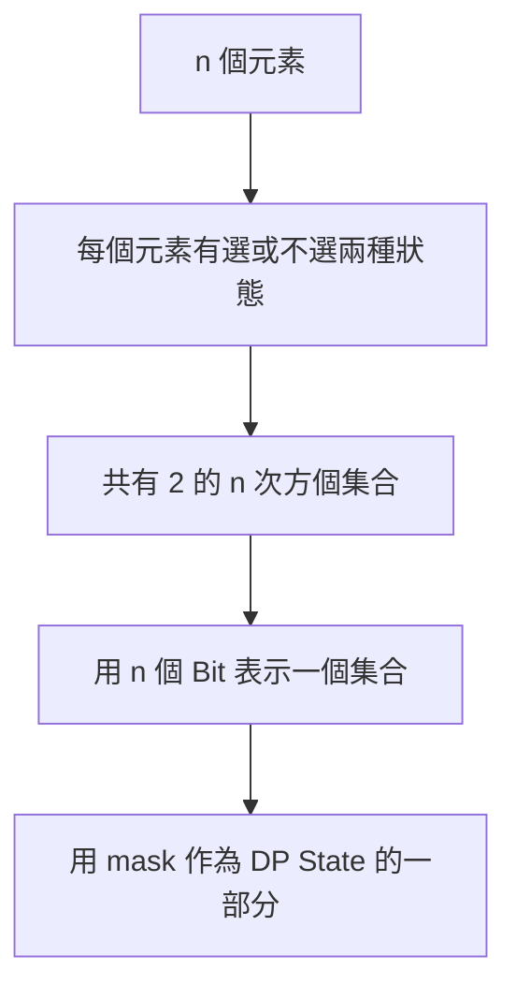
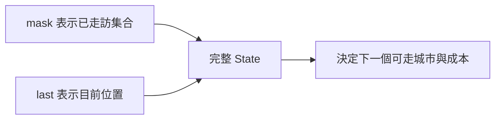

## 第 44 章　State Compression DP

### 適用範圍

本章說明 State Compression DP，也常稱為 Bitmask DP。它用一個整數的 Binary Bits 表示「哪些元素已經選過」。

這種方法適合元素數量不大，但需要記錄集合狀態的問題，例如 Traveling Salesperson Problem、Assignment 與訪問所有節點。

第一次接觸時，常見困難是：

- 一個整數怎麼代表集合？
- 如何判斷第 i 個元素是否已選？
- `dp[mask][last]` 為什麼還需要 last？
- 為什麼複雜度有 `2^n`？
- n 到多少時記憶體會無法接受？



### 快速導覽

- [44.1 Bitmask DP 前到底要分析什麼](#441-bitmask-dp-前到底要分析什麼)
- [44.2 Bitmask 表示集合](#442-bitmask-表示集合)
- [44.3 常用 Bit 操作](#443-常用-bit-操作)
- [44.4 Subset 與 Submask](#444-subset-與-submask)
- [44.5 State 與最後位置](#445-state-與最後位置)
- [44.6 TSP](#446-tsp)
- [44.7 Assignment 問題](#447-assignment-問題)
- [44.8 時間與空間限制](#448-時間與空間限制)
- [44.9 常見問題與判讀](#449-常見問題與判讀)
- [44.10 本章檢查表](#4410-本章檢查表)
- [44.11 本章重點](#4411-本章重點)

### 44.1 Bitmask DP 前到底要分析什麼

假設有 4 個城市，需要記錄目前已經走過哪些城市。

<table>
<tr><th>分析項目</th><th>本題內容</th></tr>
<tr><td>元素數量</td><td>4 個城市</td></tr>
<tr><td>集合資訊</td><td>哪些城市已走訪</td></tr>
<tr><td>集合數量</td><td>`2^4 = 16`</td></tr>
<tr><td>是否只知道集合就足夠</td><td>不夠，還要知道目前停在哪個城市</td></tr>
<tr><td>State</td><td>`dp[mask][last]`</td></tr>
<tr><td>限制</td><td>n 必須足夠小，才能枚舉所有 mask</td></tr>
</table>

Bitmask DP 的前置條件通常不是資料值小，而是「需要記錄的元素數量 n 小」。

### 44.2 Bitmask 表示集合

對 4 個元素，從右到左的 Bit 0 到 3 分別代表元素 0 到 3。

```text
mask = 0101₂
```

表示元素 0 與 2 已選。

<table>
<tr><th>元素</th><th>對應 Bit</th><th>是否在 0101 中</th></tr>
<tr><td>0</td><td>0001</td><td>是</td></tr>
<tr><td>1</td><td>0010</td><td>否</td></tr>
<tr><td>2</td><td>0100</td><td>是</td></tr>
<tr><td>3</td><td>1000</td><td>否</td></tr>
</table>

全部元素已選的 Mask：

```cpp
int fullMask = (1 << n) - 1;
```

n 很大時要注意位移型別與 Overflow，可使用 `1LL << n`。

### 44.3 常用 Bit 操作

#### 判斷第 i 個元素是否已選

```cpp
bool selected = (mask & (1 << i)) != 0;
```

#### 加入第 i 個元素

```cpp
int nextMask = mask | (1 << i);
```

#### 移除第 i 個元素

```cpp
int nextMask = mask & ~(1 << i);
```

#### 切換第 i 個元素

```cpp
int nextMask = mask ^ (1 << i);
```

不要使用加法加入 Bit。若該 Bit 原本已是 1，加法可能產生進位，改變其他 Bit。

### 44.4 Subset 與 Submask

若要枚舉所有集合：

```cpp
for (int mask = 0; mask < (1 << n); ++mask)
{
    // mask 表示一個 Subset
}
```

若要枚舉某個 mask 的所有非空 Submask：

```cpp
for (int submask = mask;
     submask > 0;
     submask = (submask - 1) & mask)
{
    // submask 是 mask 的非空子集合
}
```

最後若需要空集合，要另外處理 `submask == 0`。

枚舉所有 mask 的所有 submask，總複雜度通常為 O(3^n)，不是 O(2^n)。

### 44.5 State 與最後位置

在路徑問題中，只知道走過哪些城市通常不夠。

例如同樣走過 `{0, 1, 2}`：

```text
目前在 1
目前在 2
```

下一步成本可能不同。因此定義：

```text
dp[mask][last] = 已走訪 mask 中城市，且目前停在 last 的最低成本
```



`last` 必須包含在 `mask` 中，否則 State 語意不成立。

### 44.6 TSP

Traveling Salesperson Problem：從起點 0 出發，拜訪每個城市一次，最後回到起點，求最低成本。

#### Base Case

```text
dp[1 << 0][0] = 0
```

表示只走訪城市 0，目前也在 0，成本為 0。

#### Transition

從目前 `last` 前往尚未走訪的 `next`：

```text
nextMask = mask | (1 << next)

dp[nextMask][next] = min(
    dp[nextMask][next],
    dp[mask][last] + cost[last][next]
)
```

#### C++ 實作

```cpp
#include <algorithm>
#include <limits>
#include <vector>

long long tsp(const std::vector<std::vector<int>>& cost)
{
    int n = static_cast<int>(cost.size());

    if (n == 0)
    {
        return 0;
    }

    int stateCount = 1 << n;
    const long long INF = std::numeric_limits<long long>::max() / 4;

    std::vector<std::vector<long long>> dp(
        stateCount,
        std::vector<long long>(n, INF));

    dp[1][0] = 0;

    for (int mask = 0; mask < stateCount; ++mask)
    {
        for (int last = 0; last < n; ++last)
        {
            if (dp[mask][last] == INF)
            {
                continue;
            }

            for (int next = 0; next < n; ++next)
            {
                if (mask & (1 << next))
                {
                    continue;
                }

                int nextMask = mask | (1 << next);
                dp[nextMask][next] = std::min(
                    dp[nextMask][next],
                    dp[mask][last] + cost[last][next]);
            }
        }
    }

    int fullMask = stateCount - 1;
    long long answer = INF;

    for (int last = 0; last < n; ++last)
    {
        answer = std::min(
            answer,
            dp[fullMask][last] + cost[last][0]);
    }

    return answer;
}
```

時間複雜度為 O(2^n × n²)，空間為 O(2^n × n)。

### 44.7 Assignment 問題

有 n 個人與 n 個工作，每個人執行每個工作有不同成本，要求一對一分配的最低總成本。

若依序處理人員，可以只用 mask 表示哪些工作已分配：

```text
dp[mask] = 已分配 mask 中工作時的最低成本
```

目前要處理的人員 Index 可以由已選工作數得到：

```cpp
int person = std::popcount(static_cast<unsigned>(mask));
```

接著枚舉尚未分配的工作。這說明 State 是否需要額外維度，取決於其他資訊能否由 mask 唯一推導。

### 44.8 時間與空間限制

`2^n` 成長很快：

<table>
<tr><th>n</th><th>2^n</th></tr>
<tr><td>10</td><td>1,024</td></tr>
<tr><td>20</td><td>1,048,576</td></tr>
<tr><td>25</td><td>33,554,432</td></tr>
<tr><td>30</td><td>1,073,741,824</td></tr>
</table>

即使單一 State 很小，n = 25 以上也可能造成明顯時間與空間壓力。使用 Bitmask DP 前應估算：

```text
State 數 × 每個 State 大小 × 額外維度
```

不要只看到 n 看起來不大，就忽略指數成長。

### 44.9 常見問題與判讀

<table>
<tr><th>現象</th><th>可能原因</th><th>第一輪檢查</th></tr>
<tr><td>集合內容判斷相反</td><td>Bit 編號與元素編號不一致</td><td>用 n = 3 手動寫出每個 mask</td></tr>
<tr><td>加入元素後 mask 錯誤</td><td>使用加法而非 OR</td><td>使用 `mask | (1 << i)`</td></tr>
<tr><td>TSP State 不足</td><td>只保存 mask，沒有目前位置</td><td>加入 last 維度</td></tr>
<tr><td>讀取不合法 State</td><td>last 不在 mask 中</td><td>檢查 State 語意</td></tr>
<tr><td>INF 加法溢位</td><td>未先略過不可達 State</td><td>先檢查是否為 INF</td></tr>
<tr><td>記憶體超出限制</td><td>低估 `2^n × n`</td><td>先計算 State 數與 Byte 數</td></tr>
<tr><td>Submask 少空集合</td><td>迴圈在 0 前停止</td><td>必要時另外處理 0</td></tr>
</table>

### 44.10 本章檢查表

- 我能用 Bitmask 表示已選元素集合。
- 我能判斷、加入與移除某個 Bit。
- 我知道全部集合數是 `2^n`。
- 我能枚舉所有 Mask 與某 Mask 的 Submask。
- 我能說明 `dp[mask][last]` 兩個維度的用途。
- 我知道 TSP 的 Base Case 與回到起點成本。
- 我能估算 O(2^n × n²) 是否可接受。
- 我會檢查位移型別、INF 與記憶體大小。

### 44.11 本章重點

- Bitmask 用每個 Bit 表示一個元素是否已選。
- n 個元素共有 `2^n` 個集合 State。
- 路徑問題常需同時保存已走訪集合與目前位置。
- TSP 常使用 `dp[mask][last]`。
- Assignment 問題有時可由 mask 的 Bit 數推導目前步驟。
- Submask 枚舉的總成本可能達 O(3^n)。
- State Compression DP 適合 n 小但集合資訊重要的問題。
- 使用前必須估算時間、空間、位移型別與 INF 運算。
