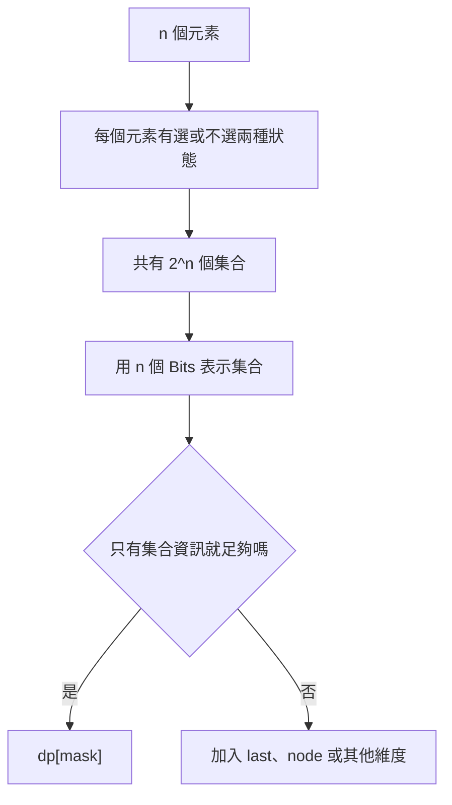
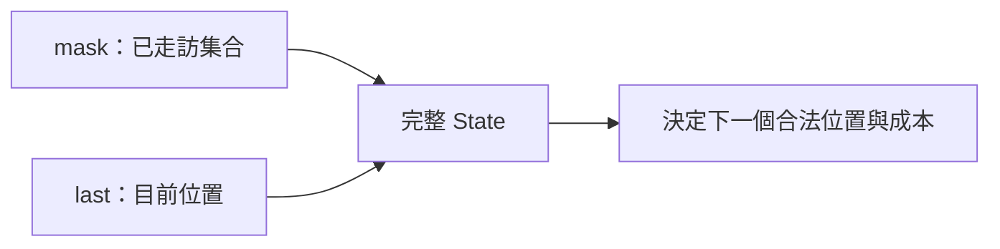
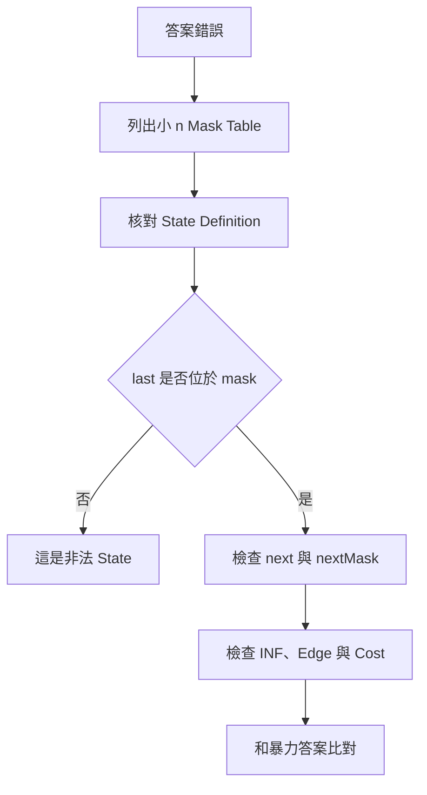

## 第 44 章　State Compression DP

### 適用範圍

本章介紹 State Compression DP，常見形式是 Bitmask DP。它使用整數的 Binary Bits 表示一個集合，再把這個集合放進 Dynamic Programming、BFS 或其他 State Search 中。

例如有 4 個城市時，可以讓 Bit 0 到 Bit 3 分別代表城市 0 到城市 3 是否已走訪：

```text
mask = 0101₂
```

表示城市 0 與城市 2 已走訪。

State Compression 的價值不是單純把 Boolean Array 寫成整數，而是讓整個集合可以：

- 作為 DP Table 的 Index。
- 快速判斷、加入或移除元素。
- 枚舉所有集合或 Submask。
- 搭配目前位置、最後選擇或其他資訊，形成完整 State。

這類方法的主要限制是指數成長。`n` 個元素共有 `2^n` 個集合，因此真正需要先確認的不是資料值大小，而是「必須追蹤的元素數量 `n` 是否足夠小」。

本章使用以下固定流程：

1. 定義每個 Bit 代表什麼。
2. 判斷單一 `mask` 是否足以描述子問題。
3. 補上目前位置、最後元素或其他必要維度。
4. 定義 Base Case 與 Transition。
5. 確認 State 的計算順序或搜尋方式。
6. 估算 `2^n`、`n × 2^n` 或 `3^n` 的時間與空間。
7. 檢查 Shift Width、不可達 State 與 Overflow。
8. 使用小型 Mask Table 驗證 State Definition。



### 適用讀者

- 已理解基本 DP，但不熟悉以整數表示集合的讀者。
- 看到 `dp[mask][last]`，卻不清楚 `last` 為何必要的讀者。
- 想理解 TSP、Assignment、Hamiltonian Path 與 Visit-all-nodes State 的讀者。
- 容易低估 `2^n` 記憶體與 Transition 數量的讀者。
- 在 Shift、Submask Enumeration、INF 加法或型別寬度上容易出錯的讀者。
- 想區分 Bitmask DP 與 BFS over `(mask, node)` 的讀者。

### 快速導覽

- [44.1 State Compression 前要分析什麼](#441-state-compression-前要分析什麼)
- [44.2 Bitmask 如何表示集合](#442-bitmask-如何表示集合)
- [44.3 常用 Bit 操作](#443-常用-bit-操作)
- [44.4 枚舉 Mask 與 Submask](#444-枚舉-mask-與-submask)
- [44.5 State Definition：什麼時候需要 last](#445-state-definition什麼時候需要-last)
- [44.6 完整案例：Assignment Problem](#446-完整案例assignment-problem)
- [44.7 完整案例：Traveling Salesperson Problem](#447-完整案例traveling-salesperson-problem)
- [44.8 Hamiltonian Path 與 BFS over State](#448-hamiltonian-path-與-bfs-over-state)
- [44.9 Merge Subset 與 O(3^n)](#449-merge-subset-與-o3n)
- [44.10 時間與記憶體估算](#4410-時間與記憶體估算)
- [44.11 C++ 型別、Shift 與 INF](#4411-c-型別shift-與-inf)
- [44.12 記憶體配置與 Reconstruction](#4412-記憶體配置與-reconstruction)
- [44.13 系統化 Debug](#4413-系統化-debug)
- [44.14 常見問題與判讀](#4414-常見問題與判讀)
- [44.15 本章檢查表](#4415-本章檢查表)
- [44.16 本章重點](#4416-本章重點)

### 44.1 State Compression 前要分析什麼

假設有 4 個城市，需要記錄目前已走訪哪些城市。

| 分析項目 | 本題內容 | 影響 |
|---|---|---|
| 元素數量 | 4 個城市 | 共有 16 個集合 |
| 集合語意 | 哪些城市已走訪 | 可用 4 個 Bits 表示 |
| 單一 Mask 是否足夠 | 不足 | 還需知道目前在哪個城市 |
| 額外狀態 | 目前位置 `last` | 常形成 `dp[mask][last]` |
| 不可達 State | 尚未形成的走訪狀態 | 需要 `INF` 或布林初始值 |
| 規模限制 | `n` 必須小 | 才能完整枚舉集合 |

使用 State Compression 前，先回答：

1. `n` 是多少？
2. 每個元素是否可用少量離散狀態表示？
3. Bit 1 代表已選、未選、已完成，還是其他語意？
4. `mask` 是否足以決定未來所有合法選擇？
5. 是否還要保存目前位置、最後元素、剩餘資源或其他資訊？
6. 完整 State 數量是多少？
7. 每個 State 會枚舉多少 Transition？
8. Base Case 與答案位置是什麼？
9. 不可達 State 如何表示？
10. 是否需要 Reconstruction？

State Compression 不限定每個元素只能有兩種狀態。如果每個元素有三種狀態，也可以使用 Base-3 Encoding；但「Bitmask DP」通常特指以二進位表示集合的版本。本章集中討論二進位集合狀態。

### 44.2 Bitmask 如何表示集合

對 4 個元素，從最低位開始，Bit 0 到 Bit 3 分別代表元素 0 到元素 3。

```text
Bit 位置：3 2 1 0
mask：    0 1 0 1
```

因此 `0101₂` 表示集合 `{0, 2}`。

| 元素 | 對應 Bit | 是否位於 `0101₂` |
|---:|---:|---|
| 0 | Bit 0 | 是 |
| 1 | Bit 1 | 否 |
| 2 | Bit 2 | 是 |
| 3 | Bit 3 | 否 |

#### 空集合與全集

```cpp
const int emptyMask = 0;
const int fullMask = (1 << n) - 1;
```

當 `n = 4`：

```text
emptyMask = 0000₂
fullMask  = 1111₂
```

#### Mask 語意必須固定

建議採用：

```text
Bit i = 1：元素 i 已選或已走訪
Bit i = 0：元素 i 尚未選或尚未走訪
```

也可以反過來定義，但同一題的 Base Case、Transition、答案與 Debug 輸出都必須保持一致。

### 44.3 常用 Bit 操作

以下假設 `mask` 與 `bit` 使用無號整數型別：

```cpp
using Mask = std::uint64_t;
const Mask bit = Mask{1} << i;
```

#### 判斷第 `i` 個元素是否已選

```cpp
const bool selected = (mask & bit) != 0;
```

#### 加入第 `i` 個元素

```cpp
const Mask nextMask = mask | bit;
```

#### 移除第 `i` 個元素

```cpp
const Mask nextMask = mask & ~bit;
```

#### 切換第 `i` 個元素

```cpp
const Mask nextMask = mask ^ bit;
```

#### 判斷是否為 Subset

若 `subset` 的所有 Bits 都包含在 `mask` 中：

```cpp
const bool isSubset = (subset & mask) == subset;
```

#### 計算已選元素數量

C++20：

```cpp
#include <bit>

const int selectedCount = std::popcount(mask);
```

當 `mask` 是 `std::uint64_t` 時，`std::popcount` 可直接配合其無號型別使用。

#### 不要使用加法加入 Bit

假設：

```text
mask = 0011₂
```

若用加法再次加入 Bit 0：

```text
0011₂ + 0001₂ = 0100₂
```

進位會改變其他 Bits。加入集合元素應使用 OR：

```cpp
mask |= bit;
```

### 44.4 枚舉 Mask 與 Submask

#### 枚舉所有集合

```cpp
const std::size_t stateCount = std::size_t{1} << n;

for (std::size_t mask = 0; mask < stateCount; ++mask) {
    // mask 表示一個集合
}
```

共有 `2^n` 個 Mask，包含空集合與全集。

#### 枚舉某個 Mask 的所有非空 Submask

```cpp
for (std::size_t submask = mask;
     submask != 0;
     submask = (submask - 1) & mask) {
    // submask 是 mask 的非空子集合
}
```

這個更新式先將 `submask` 減 1，再以 `mask` 過濾，得到下一個屬於 `mask` 的 Submask。

#### 包含空集合

```cpp
std::size_t submask = mask;

while (true) {
    // process submask

    if (submask == 0) {
        break;
    }

    submask = (submask - 1) & mask;
}
```

當 `submask == 0` 時必須先停止，否則無號整數減 1 會 Wrap Around。

#### 枚舉 Proper Non-empty Submask

若不希望 `submask == mask`，可從：

```cpp
for (std::size_t submask = (mask - 1) & mask;
     submask != 0;
     submask = (submask - 1) & mask) {
    // 非空且不等於 mask
}
```

開始。此寫法應在 `mask != 0` 時使用。

#### 所有 Mask 的所有 Submask

對每個 `mask` 枚舉其所有 `submask`，總量為 O(3^n)。

對每個元素而言，有三種關係：

1. 不位於 `mask`。
2. 位於 `mask`，但不位於 `submask`。
3. 同時位於 `mask` 與 `submask`。

因此總組合數為 `3^n`，不是 `2^n × 2^n`，也不是單純 `2^n`。

### 44.5 State Definition：什麼時候需要 `last`

State 是否只需要 `mask`，取決於未來選擇能否只由集合決定。

#### 只需要 `mask`

Assignment Problem 若按照人員 0、1、2 依序分配工作，可以定義：

```text
dp[mask] = 已分配 mask 中工作時的最低總成本
```

已分配工作數量就是下一位人員 Index：

```text
person = popcount(mask)
```

因此不必另外保存 `person`。

#### 需要 `mask` 與 `last`

路徑問題只知道已走訪集合通常不夠。

同樣走訪 `{0, 1, 2}`：

```text
目前停在城市 1
目前停在城市 2
```

下一步可走位置與成本可能不同，因此 TSP 常定義：

```text
dp[mask][last]
= 從起點出發，剛好走訪 mask 中城市，
  且目前停在 last 的最低成本
```



#### State Invariant

對任何可達的 `dp[mask][last]`：

1. `last` 必須位於 `mask` 中。
2. 路徑走訪的城市集合恰好是 `mask`。
3. 路徑最後停在 `last`。
4. Table 中保存滿足上述條件的最低成本。

若 `last` 不在 `mask` 中，State 沒有合理語意，應跳過。

### 44.6 完整案例：Assignment Problem

#### 問題規格

有 `n` 個人與 `n` 個工作。`cost[person][job]` 表示某人執行某工作的成本。每人恰好分配一個工作，每個工作也只能分配一次，求最低總成本。

#### State

```text
dp[mask]
= 已將 mask 中的工作分配給前 popcount(mask) 位人員時，
  可得到的最低總成本
```

這個定義同時表達：

- `mask` 中哪些工作已被使用。
- 下一位要分配的人可由 Bit 數量推出。

#### Base Case

```text
dp[0] = 0
```

尚未分配任何工作，也尚未產生成本。

#### Transition

令：

```text
person = popcount(mask)
```

對每個尚未位於 `mask` 中的 `job`：

```text
nextMask = mask | (1 << job)

dp[nextMask] = min(
    dp[nextMask],
    dp[mask] + cost[person][job]
)
```

#### C++20 實作

```cpp
#include <algorithm>
#include <bit>
#include <cstdint>
#include <limits>
#include <stdexcept>
#include <vector>

long long assignmentMinimumCost(
    const std::vector<std::vector<int>>& cost) {

    const int n = static_cast<int>(cost.size());

    for (const auto& row : cost) {
        if (static_cast<int>(row.size()) != n) {
            throw std::invalid_argument("cost must be square");
        }
    }

    if (n >= 63) {
        throw std::invalid_argument("too many jobs for uint64_t mask");
    }

    using Mask = std::uint64_t;
    const Mask stateCount = Mask{1} << n;
    const long long INF = std::numeric_limits<long long>::max() / 4;

    std::vector<long long> dp(
        static_cast<std::size_t>(stateCount),
        INF);

    dp[0] = 0;

    for (Mask mask = 0; mask < stateCount; ++mask) {
        const std::size_t index = static_cast<std::size_t>(mask);

        if (dp[index] == INF) {
            continue;
        }

        const int person = std::popcount(mask);

        if (person == n) {
            continue;
        }

        for (int job = 0; job < n; ++job) {
            const Mask bit = Mask{1} << job;

            if ((mask & bit) != 0) {
                continue;
            }

            const Mask nextMask = mask | bit;
            const std::size_t nextIndex =
                static_cast<std::size_t>(nextMask);

            dp[nextIndex] = std::min(
                dp[nextIndex],
                dp[index] + cost[person][job]);
        }
    }

    return dp.back();
}
```

#### 正確性思路

對一個包含 `k` 個工作的 `mask`：

- State 表示前 `k` 位人員已完成分配。
- Transition 為第 `k` 位人員選擇一個尚未使用的工作。
- 每次只增加一個工作，因此每人與每個工作都恰好使用一次。
- 對所有合法工作取最小值，因此 `dp[nextMask]` 保存對應分配集合的最低成本。

#### 複雜度

- State 數量：`2^n`。
- 每個 State 最多枚舉 `n` 個工作。
- 時間複雜度：O(n × 2^n)。
- 空間複雜度：O(2^n)。

若要還原具體分配，還需要保存每個 `nextMask` 是由哪個 `mask` 與 `job` 更新而來。

### 44.7 完整案例：Traveling Salesperson Problem

#### 問題規格

從城市 0 出發，每個城市恰好拜訪一次，最後回到城市 0，求最低總成本。

本節假設 `cost[u][v]` 都是可用的有限邊成本。若圖可能缺邊，應另外以 `std::optional`、布林 Matrix 或明確 Sentinel 表示不可通行，不能把不存在的邊直接當成一般成本。

#### State

```text
dp[mask][last]
= 從城市 0 出發，走訪集合恰好為 mask，
  且目前停在 last 的最低成本
```

#### Base Case

```text
dp[1 << 0][0] = 0
```

只走訪起點，目前也停在起點，成本為 0。

#### Transition

從 `last` 前往尚未走訪的 `next`：

```text
nextMask = mask | (1 << next)

dp[nextMask][next] = min(
    dp[nextMask][next],
    dp[mask][last] + cost[last][next]
)
```

#### 答案

當所有城市都已走訪後，還要補上回到起點的成本：

```text
answer = min over last (
    dp[fullMask][last] + cost[last][0]
)
```

#### C++20 實作

```cpp
#include <algorithm>
#include <cstdint>
#include <limits>
#include <optional>
#include <stdexcept>
#include <vector>

std::optional<long long> tsp(
    const std::vector<std::vector<int>>& cost) {

    const int n = static_cast<int>(cost.size());

    if (n == 0) {
        return 0;
    }

    for (const auto& row : cost) {
        if (static_cast<int>(row.size()) != n) {
            throw std::invalid_argument("cost must be square");
        }
    }

    if (n >= 63) {
        throw std::invalid_argument("too many cities for uint64_t mask");
    }

    using Mask = std::uint64_t;
    const Mask stateCount = Mask{1} << n;
    const Mask fullMask = stateCount - 1;
    const long long INF = std::numeric_limits<long long>::max() / 4;

    std::vector<std::vector<long long>> dp(
        static_cast<std::size_t>(stateCount),
        std::vector<long long>(n, INF));

    dp[1][0] = 0;

    for (Mask mask = 0; mask < stateCount; ++mask) {
        if ((mask & Mask{1}) == 0) {
            continue;
        }

        for (int last = 0; last < n; ++last) {
            const Mask lastBit = Mask{1} << last;

            if ((mask & lastBit) == 0) {
                continue;
            }

            const std::size_t maskIndex =
                static_cast<std::size_t>(mask);

            if (dp[maskIndex][last] == INF) {
                continue;
            }

            for (int next = 0; next < n; ++next) {
                const Mask nextBit = Mask{1} << next;

                if ((mask & nextBit) != 0) {
                    continue;
                }

                const Mask nextMask = mask | nextBit;
                const std::size_t nextIndex =
                    static_cast<std::size_t>(nextMask);

                dp[nextIndex][next] = std::min(
                    dp[nextIndex][next],
                    dp[maskIndex][last] + cost[last][next]);
            }
        }
    }

    long long answer = INF;
    const std::size_t fullIndex =
        static_cast<std::size_t>(fullMask);

    for (int last = 0; last < n; ++last) {
        if (dp[fullIndex][last] == INF) {
            continue;
        }

        answer = std::min(
            answer,
            dp[fullIndex][last] + cost[last][0]);
    }

    if (answer == INF) {
        return std::nullopt;
    }

    return answer;
}
```

#### 為什麼 Mask 可以由小到大填表

每次 Transition 都只會加入一個尚未走訪城市，因此：

```text
nextMask > mask
```

對一般非負整數 Mask 成立。更本質的說法是 `popcount(nextMask) = popcount(mask) + 1`，State Dependency 從較少元素的集合指向較多元素的集合，不會形成循環。

#### 複雜度

```text
State 數量：O(n × 2^n)
每個 State 最多枚舉 n 個 next
時間複雜度：O(n² × 2^n)
空間複雜度：O(n × 2^n)
```

### 44.8 Hamiltonian Path 與 BFS over State

#### Hamiltonian Path DP

可定義：

```text
dp[mask][last]
= 是否存在一條路徑，恰好走訪 mask 中節點，
  且最後停在 last
```

若可以從任意節點開始，Base Case 為：

```text
dp[1 << node][node] = true
```

對每個節點 `node`。

若 `dp[mask][last]` 為 true，且存在 Edge `last -> next`，而且 `next` 尚未位於 `mask`：

```text
dp[mask | (1 << next)][next] = true
```

#### Visit-all-nodes BFS

若 Graph 無權、允許重複經過節點，並要求走訪所有節點的最短步數，Hamiltonian Path DP 的「每個節點恰好一次」模型可能不適用。

常見做法是 BFS over State：

```text
state = (mask, node)
```

- `mask`：至今曾走訪過哪些節點。
- `node`：目前位置。
- BFS Layer：目前走過的 Edge 數。

Base Case 可將所有單點 State 同時加入 Queue，表示可從任意節點開始。第一次到達 `mask == fullMask` 時，BFS 層數就是最低步數。

這個方法使用 State Compression，但求值方式是 BFS，不是 Bottom-up DP。應根據邊權、允許重訪與答案目標選擇搜尋方式。

### 44.9 Merge Subset 與 O(3^n)

有些問題需要把一個集合拆成兩部分：

```text
dp[mask] = 集合 mask 的最佳答案
```

Transition 可能枚舉 `mask` 的 Submask：

```cpp
for (std::size_t submask = (mask - 1) & mask;
     submask != 0;
     submask = (submask - 1) & mask) {

    const std::size_t other = mask ^ submask;

    // combine dp[submask] and dp[other]
}
```

#### 避免對稱拆分重複

若 `{A, B}` 與 `{B, A}` 是同一種拆分，直接枚舉會計算兩次。

可以採用其中一種規則：

- 只處理 `submask < other`。
- 固定讓某個特定 Bit 位於 `submask`。
- 依題目語意規定左右兩側角色。

哪種規則適合，取決於兩個子集合是否真的對稱。

#### 複雜度

所有 `mask` 的所有 `submask` 總量是 O(3^n)。如果每次合併還有額外成本，應再乘上該成本。

因此 Merge Subset 類題可接受的 `n` 往往比 O(n × 2^n) 的 Assignment 更小。

### 44.10 時間與記憶體估算

`2^n` 成長很快：

| `n` | `2^n` | 粗略判讀 |
|---:|---:|---|
| 10 | 1,024 | 通常容易處理 |
| 15 | 32,768 | 多數完整 Table 仍小 |
| 20 | 1,048,576 | 需開始計算維度與每格大小 |
| 25 | 33,554,432 | 時間與記憶體壓力明顯 |
| 30 | 1,073,741,824 | 通常無法直接完整枚舉 |

這些只是規模感，不是固定上限。實際可行性還取決於：

- State 是否乘上 `n`、`n²` 或其他維度。
- 每個 State 的 Transition 數量。
- 每格用 `bool`、`int`、`long long` 或更大結構。
- Memory Limit、Time Limit、語言與資料配置方式。
- 是否只建立可達 State。

#### 記憶體估算

`dp[2^20][20]` 每格使用 8-byte `long long`：

```text
1,048,576 × 20 × 8 bytes
= 167,772,160 bytes
≈ 160 MiB
```

這還沒有計入外層 `vector` 物件、Allocator Metadata、Parent Table 與其他資料。

#### Transition 數量估算

TSP 的上界常寫成：

```text
2^n × n × n
```

當 `n = 20`：

```text
1,048,576 × 20 × 20
≈ 4.19 億個候選 Transition
```

實際上部分 State 不合法或可被跳過，但估算時應先使用安全上界，再判斷是否需要改善。

### 44.11 C++ 型別、Shift 與 INF

#### Shift Width

以下寫法的左側是 `int`：

```cpp
1 << n
```

若 `n` 接近或超過 `int` 的 Bit Width，結果可能不符合預期。較清楚的寫法是先選定 Mask Type：

```cpp
#include <cstdint>

using Mask = std::uint64_t;
const Mask bit = Mask{1} << i;
```

仍必須保證：

```text
0 <= i < 64
```

使用 64-bit Mask 只解決表示範圍，不代表 `2^63` 個 State 可以配置。

#### Table Index Type

`std::vector::size_type` 通常是無號型別。配置 Table 時，可使用 `std::size_t` 表示元素數量與 Index：

```cpp
const std::size_t stateCount = std::size_t{1} << n;
```

前提是 `n` 小於 `std::size_t` 的 Bit Width，而且 State Count 可實際配置。

#### INF

```cpp
const long long INF =
    std::numeric_limits<long long>::max() / 4;
```

使用較小的 Sentinel 可保留加法空間，但仍應先略過不可達 State：

```cpp
if (dp[mask][last] == INF) {
    continue;
}
```

若 `cost` 可能很大或可能為負，還要根據題目上限確認：

- 合法路徑成本是否可能接近 `INF`。
- `dp + cost` 是否仍可能 Overflow。
- 是否需要以 Checked Arithmetic 或更寬型別處理。

#### 不可達邊與不可達 State 不同

- 不可達 State：目前沒有任何合法方案形成此 State。
- 不可達 Edge：從某節點不能直接走到另一節點。

兩者應分開表示。不要只用同一個數字，卻沒有在 Transition 前辨認它代表哪種不可達。

### 44.12 記憶體配置與 Reconstruction

#### 攤平二維 Table

`std::vector<std::vector<long long>>` 會為每列建立獨立 `vector`。若記憶體與 Cache Locality 很重要，可以攤平成一維：

```cpp
std::vector<long long> dp(
    static_cast<std::size_t>(stateCount) * n,
    INF);

const auto index = [n](std::size_t mask, int last) {
    return mask * static_cast<std::size_t>(n)
         + static_cast<std::size_t>(last);
};
```

好處包括：

- 資料連續。
- 額外物件較少。
- 記憶體較容易估算。

#### 稀疏 State

如果 `2^n` 很大，但實際可達 State 很少，可以考慮 Hash Map 保存已出現 State。這不會改變最差情況的指數複雜度，而且 Hash Table 還有額外成本；只有 State Space 確實稀疏時才可能有利。

#### 依 Popcount 分層

若所有 Transition 都從 `k` 個 Bits 走向 `k + 1` 個 Bits，可以按 Popcount 分層處理。有時只需保留相鄰層，但要先確認：

- 後續是否只依賴前一層。
- 最終是否需要任意舊 State。
- 是否需要 Reconstruction。

#### Reconstruction

若要還原 TSP 路徑或 Assignment 配對，可保存 Parent：

```text
parent[nextMask][next] = last
```

或 Assignment 中：

```text
chosenJob[nextMask] = job
```

從 Full Mask 反向移除最後加入的 Bit，即可重建選擇順序。若只保留 Rolling Layer，Parent 資訊可能隨之遺失。

### 44.13 系統化 Debug

Bitmask DP 最有效的排查方式，是先把 `n = 3` 的所有 Mask 寫出來。

| 十進位 | Binary | 集合 |
|---:|:---:|---|
| 0 | `000` | `{}` |
| 1 | `001` | `{0}` |
| 2 | `010` | `{1}` |
| 3 | `011` | `{0, 1}` |
| 4 | `100` | `{2}` |
| 5 | `101` | `{0, 2}` |
| 6 | `110` | `{1, 2}` |
| 7 | `111` | `{0, 1, 2}` |

#### 每輪記錄欄位

```text
mask 的 Binary
mask 對應集合
last 是否位於 mask
目前 dp 值
候選 next 是否已位於 mask
nextMask 的 Binary 與集合
Transition Cost
更新前與更新後的 dp
```

#### 建議排查順序

1. 固定 `n = 2` 或 `n = 3`。
2. 寫出每一個 Mask 的集合語意。
3. 確認 Base Case 的 Bits 正確。
4. 檢查所有可達 `dp[mask][last]` 是否滿足 `last ∈ mask`。
5. 檢查加入 `next` 後，只有該 Bit 從 0 變 1。
6. 略過不可達 State，再執行加法。
7. 將小型結果與暴力枚舉比較。
8. 最後才檢查記憶體配置與效能。



#### 最小測試

- `n = 0`。
- `n = 1`。
- `n = 2`。
- 所有成本都相同。
- 唯一最佳解。
- 多個同成本最佳解。
- 存在不可達 Edge。
- 起點與終點相同的最小 TSP。
- Assignment 中某工作只能由特定人員執行。
- Full Mask、Empty Mask、單一 Bit Mask。
- Submask Enumeration 是否包含或排除 0 符合規格。

### 44.14 常見問題與判讀

| 現象 | 可能原因 | 第一輪檢查 |
|---|---|---|
| 集合內容判斷相反 | Bit 語意前後不一致 | 用 `n = 3` 寫出 Mask Table |
| 加入元素後 Mask 錯誤 | 使用加法而不是 OR | 使用 `mask | bit` |
| TSP State 不足 | 只保存集合，沒有目前位置 | 增加 `last` 維度 |
| 讀取無語意 State | `last` 不在 `mask` 中 | 檢查 State Invariant |
| Assignment 人員錯位 | `popcount(mask)` 與 State 定義不一致 | 確認已選工作數等於已分配人數 |
| INF 加法異常 | 未略過不可達 State | 加法前檢查 `dp != INF` |
| 缺邊被當成一般成本 | Edge 與 State 共用不清楚的 Sentinel | 分開表示不可達 Edge |
| 記憶體超限 | 忽略 `n` 維度或每格大小 | 先計算總 Bytes |
| Submask 少空集合 | 非空枚舉在 0 前停止 | 規格需要時另行處理 0 |
| Submask 無窮循環 | 無號 0 減 1 Wrap Around | 在 `submask == 0` 時先停止 |
| Shift 結果異常 | 左側型別太窄或位移量過大 | 使用固定寬度無號型別並檢查 Width |
| O(3^n) 被誤算成 O(2^n) | 對每個 Mask 又枚舉 Submask | 使用三種元素關係分析 |
| Rolling 後無法還原路徑 | Parent 或舊層被移除 | 壓縮前確認 Reconstruction 需求 |
| BFS / DP 模型混淆 | 沒先確認邊權與是否允許重訪 | 定義 State、Transition 與求值順序 |

### 44.15 本章檢查表

- 我能說明每個 Bit 代表什麼。
- 我能從 Mask 寫出其集合內容。
- 我能判斷、加入、移除與切換某個 Bit。
- 我知道加入元素應使用 OR，而不是加法。
- 我知道 `n` 個二元元素共有 `2^n` 個集合。
- 我能枚舉所有 Mask 與某個 Mask 的 Submask。
- 我知道所有 Mask 的所有 Submask 總量可達 O(3^n)。
- 我能判斷 State 只需 `mask`，還是需要 `last` 等額外資訊。
- 我能寫出 Assignment 的 State、Base Case 與 Transition。
- 我能寫出 TSP 的 State、Base Case、Transition 與回到起點的答案。
- 我知道 Hamiltonian Path DP 與 Visit-all-nodes BFS 的差異。
- 我會分開表示不可達 State 與不可達 Edge。
- 我會在 INF 加法前略過不可達 State。
- 我會檢查 Shift Width 與 Mask Type。
- 我能估算 State Count、Transition Count 與總 Bytes。
- 我知道是否可壓縮空間取決於 State Dependency 與 Reconstruction。
- 我會用 `n = 2` 或 `n = 3` 的 Mask Table 排查第一個錯誤 State。

### 44.16 本章重點

- Bitmask 使用每個 Bit 表示一個元素的集合狀態。
- `n` 個二元元素共有 `2^n` 個集合，因此 `n` 必須足夠小。
- State Compression 的重點是完整 State Definition，不只是 Bit 語法。
- Assignment 可由 `popcount(mask)` 推出目前步驟，因此常只需 `dp[mask]`。
- 路徑問題通常還要保存目前位置，因此常使用 `dp[mask][last]`。
- `last` 必須位於 `mask` 中，否則 State 沒有合理語意。
- TSP 的 Full Mask State仍要加上返回起點的成本。
- Visit-all-nodes 問題可能使用 BFS over `(mask, node)`，不一定是 Bottom-up DP。
- 枚舉所有 Mask 的所有 Submask，總成本通常為 O(3^n)。
- 使用前必須估算 State 數、Transition 數、每格大小與額外維度。
- 固定寬度無號型別可讓 Shift 語意更清楚，但不能解決指數記憶體問題。
- 不可達 Edge、不可達 State 與 INF 應有清楚且分離的語意。
- 空間壓縮前要確認依賴關係與 Reconstruction 需求。
- Debug 時先列出小型 Mask Table，再檢查 State、Transition 與 INF。
