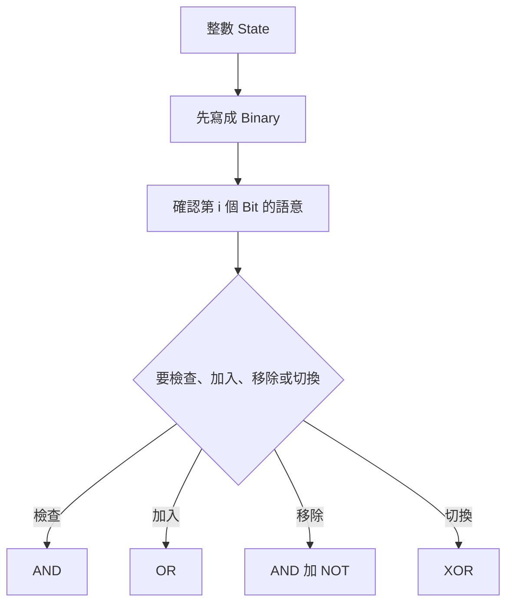

## 第 45 章　Bit Manipulation

### 適用範圍

本章說明如何使用 Binary Bit 表示與修改整數狀態。Bit Manipulation 常用在權限旗標、集合狀態、奇偶判斷、Power of Two、只出現一次的元素與 State Compression DP。

第一次接觸時，常見困難不是不會寫 `&` 或 `|`，而是不清楚每個 Bit 代表什麼，以及運算前後哪些 Bit 會改變。

本章會建立固定流程：

- 先將十進位數字寫成 Binary。
- 明確定義第 i 個 Bit 的語意。
- 一次只追蹤一個運算。
- 區分 AND、OR、XOR、NOT 與 Shift。
- 再整理常見技巧與前置條件。



### 適用讀者

- 不熟悉 Binary 表示法的讀者。
- 容易混淆 `&`、`|`、`^` 與 `~` 的讀者。
- 想理解 Bitmask 與 State Compression DP 的讀者。
- 常在 signed Shift、Overflow 與 Operator Precedence 出錯的讀者。

### 快速導覽

- [45.1 Bit 前到底要分析什麼](#451-bit-前到底要分析什麼)
- [45.2 Binary 與 Bit Position](#452-binary-與-bit-position)
- [45.3 AND、OR、XOR、NOT](#453-andorxornot)
- [45.4 Left Shift 與 Right Shift](#454-left-shift-與-right-shift)
- [45.5 檢查、設定、清除與切換 Bit](#455-檢查設定清除與切換-bit)
- [45.6 常用技巧](#456-常用技巧)
- [45.7 Single Number](#457-single-number)
- [45.8 Bitmask 表示集合](#458-bitmask-表示集合)
- [45.9 複雜度](#459-複雜度)
- [45.10 常見問題與判讀](#4510-常見問題與判讀)
- [45.11 本章檢查表](#4511-本章檢查表)
- [45.12 本章重點](#4512-本章重點)

### 45.1 Bit 前到底要分析什麼

假設要判斷整數 `mask` 的第 i 個 Bit 是否為 1。

<table>
<tr><th>分析項目</th><th>本題內容</th></tr>
<tr><td>Bit 編號</td><td>由右至左，最低位為 0</td></tr>
<tr><td>目標</td><td>檢查第 i 個 Bit</td></tr>
<tr><td>Mask</td><td>`1 << i`</td></tr>
<tr><td>運算</td><td>使用 AND 保留共同為 1 的位置</td></tr>
<tr><td>結果</td><td>非 0 表示該 Bit 為 1</td></tr>
</table>

### 45.2 Binary 與 Bit Position

十進位 13：

```text
13 = 1101₂
```

<table>
<tr><th>Bit Position</th><th>3</th><th>2</th><th>1</th><th>0</th></tr>
<tr><td>Bit</td><td>1</td><td>1</td><td>0</td><td>1</td></tr>
<tr><td>權重</td><td>8</td><td>4</td><td>2</td><td>1</td></tr>
</table>

### 45.3 AND、OR、XOR、NOT

<table>
<tr><th>a</th><th>b</th><th>a AND b</th><th>a OR b</th><th>a XOR b</th></tr>
<tr><td>0</td><td>0</td><td>0</td><td>0</td><td>0</td></tr>
<tr><td>0</td><td>1</td><td>0</td><td>1</td><td>1</td></tr>
<tr><td>1</td><td>0</td><td>0</td><td>1</td><td>1</td></tr>
<tr><td>1</td><td>1</td><td>1</td><td>1</td><td>0</td></tr>
</table>

常見性質：

```text
x & 0 = 0
x | 0 = x
x ^ 0 = x
x ^ x = 0
```

`~x` 會反轉型別中的所有 Bit，不只是目前顯示的幾位，因此要注意整數寬度與 signed 表示。

### 45.4 Left Shift 與 Right Shift

```cpp
1 << i
```

表示將 1 向左移 i 位，可建立只含第 i 個 Bit 的 Mask。

對非負且不溢位的數字，左移一位常對應乘以 2，右移一位常對應除以 2。但 signed 負數與溢位行為不宜只靠這個直覺推論。

若位數可能較大，使用適當 unsigned 型別：

```cpp
1ULL << i
```

### 45.5 檢查、設定、清除與切換 Bit

#### 檢查

```cpp
bool isSet = (mask & (1U << i)) != 0;
```

#### 設定為 1

```cpp
mask |= (1U << i);
```

#### 清除為 0

```cpp
mask &= ~(1U << i);
```

#### 切換

```cpp
mask ^= (1U << i);
```

括號可以降低 Operator Precedence 誤解。

### 45.6 常用技巧

#### 判斷奇偶

```cpp
bool odd = (value & 1) != 0;
```

#### 清除最低位的 1

```cpp
value &= value - 1;
```

例如：

```text
value     = 1011000
value - 1 = 1010111
AND       = 1010000
```

#### 取得最低位的 1

對二補數整數常見寫法：

```cpp
unsigned lowbit = value & (~value + 1U);
```

亦常看到 `value & -value`，但使用 unsigned 型別較容易控制位元語意。

#### 判斷 Power of Two

對正整數：

```cpp
bool isPowerOfTwo(unsigned value)
{
    return value != 0 && (value & (value - 1)) == 0;
}
```

前置條件 `value != 0` 不可省略。

### 45.7 Single Number

若所有元素出現兩次，只有一個元素出現一次，可利用：

```text
x ^ x = 0
x ^ 0 = x
XOR 可交換與結合
```

```cpp
int singleNumber(const std::vector<int>& nums)
{
    int answer = 0;

    for (int value : nums)
    {
        answer ^= value;
    }

    return answer;
}
```

這個方法依賴「其他元素恰好出現兩次」。條件改變時，不能直接套用。

### 45.8 Bitmask 表示集合

若 n 個元素各自只有選或不選，可以用 n 個 Bit 表示集合。

```text
mask = 0101₂
```

表示元素 0 與 2 已選。

```cpp
int fullMask = (1 << n) - 1;
```

當 n 接近型別 Bit 寬度時，要改用較大型別並檢查 Shift 範圍。

### 45.9 複雜度

單次固定寬度整數 Bit 運算通常視為 O(1)。

但枚舉所有 Mask：

```text
O(2^n)
```

枚舉所有 Mask 的全部 Submask：

```text
O(3^n)
```

不能因為單次 Bit 運算快，就忽略 State 數量的指數成長。

### 45.10 常見問題與判讀

<table>
<tr><th>現象</th><th>可能原因</th><th>第一輪檢查</th></tr>
<tr><td>檢查 Bit 結果相反</td><td>Bit 編號或括號錯誤</td><td>先畫 Binary 與 Position</td></tr>
<tr><td>Power of Two 把 0 判為 true</td><td>漏掉 `value != 0`</td><td>測試 0、1、2、3</td></tr>
<tr><td>Shift 結果異常</td><td>位移超過型別寬度或 signed 問題</td><td>使用適當 unsigned 型別</td></tr>
<tr><td>加入集合後其他 Bit 改變</td><td>使用加法加入已存在 Bit</td><td>使用 OR</td></tr>
<tr><td>XOR 解法錯誤</td><td>出現次數條件不符</td><td>重新確認每個值的頻率</td></tr>
</table>

### 45.11 本章檢查表

- 我能將小型十進位整數寫成 Binary。
- 我知道最低位是 Bit 0。
- 我能區分 AND、OR、XOR 與 NOT。
- 我能檢查、設定、清除與切換指定 Bit。
- 我知道 Power of Two 判斷要排除 0。
- 我能說明 `x & (x - 1)` 清除最低位 1。
- 我會檢查 signed、型別寬度與 Shift 範圍。
- 我知道 Bitmask 枚舉可能是指數複雜度。

### 45.12 本章重點

- Bit Manipulation 的第一步是定義每個 Bit 的語意。
- AND 適合檢查，OR 適合設定，XOR 適合切換。
- `x & (x - 1)` 會清除最低位的 1。
- XOR 技巧必須符合元素出現次數的前置條件。
- 固定寬度 Bit 運算雖可視為 O(1)，集合 State 數仍可能是 O(2^n)。
