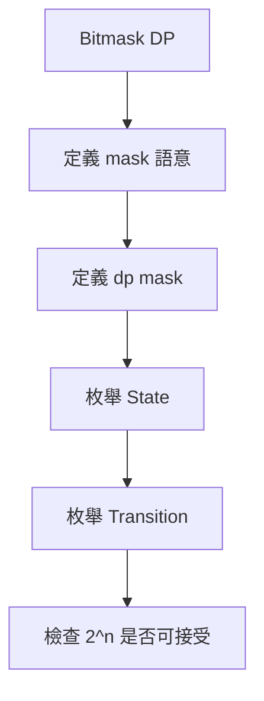

## 第 45 章　Bit Manipulation

### 適用範圍

本章說明如何使用 Binary Bit 表示與修改整數狀態。Bit Manipulation 常用在權限旗標、集合狀態、奇偶判斷、Power of Two、只出現一次的元素、Submask Enumeration 與 State Compression DP。

原始章節已經建立了很好的主線：先將十進位數字寫成 Binary、明確定義第 i 個 Bit 的語意、一次只追蹤一個運算、區分 AND / OR / XOR / NOT / Shift，再整理常見技巧與前置條件。citeturn43search1

本版會補上更完整的推導、常見陷阱、C++ 型別注意事項、集合操作、Submask 枚舉與可直接測試的程式片段。


### 適用讀者

- 不熟悉 Binary 表示法的讀者。
- 容易混淆 `&`、`|`、`^` 與 `~` 的讀者。
- 想理解 Bitmask 與 State Compression DP 的讀者。
- 常在 signed Shift、Overflow 與 Operator Precedence 出錯的讀者。
- 想把 Bitmask 當成集合使用，但不確定如何新增、刪除、枚舉元素的讀者。

### 快速導覽

- [45.1 Bit 前到底要分析什麼](#451-bit-前到底要分析什麼)
- [45.2 Binary 與 Bit Position](#452-binary-與-bit-position)
- [45.3 AND、OR、XOR、NOT](#453-andorxornot)
- [45.4 Left Shift 與 Right Shift](#454-left-shift-與-right-shift)
- [45.5 檢查、設定、清除與切換 Bit](#455-檢查設定清除與切換-bit)
- [45.6 常用技巧](#456-常用技巧)
- [45.7 Single Number](#457-single-number)
- [45.8 Bitmask 表示集合](#458-bitmask-表示集合)
- [45.9 枚舉 Mask、元素與 Submask](#459-枚舉-mask元素與-submask)
- [45.10 Bitmask DP 基礎](#4510-bitmask-dp-基礎)
- [45.11 C++ 型別與 Shift 風險](#4511-c-型別與-shift-風險)
- [45.12 複雜度](#4512-複雜度)
- [45.13 常見問題與判讀](#4513-常見問題與判讀)
- [45.14 本章檢查表](#4514-本章檢查表)
- [45.15 本章重點](#4515-本章重點)

### 45.1 Bit 前到底要分析什麼

假設要判斷整數 `mask` 的第 i 個 Bit 是否為 1。

<table>
<tr><th>分析項目</th><th>本題內容</th><th>會影響什麼</th></tr>
<tr><td>Bit 編號</td><td>由右至左，最低位為 0</td><td>`1 << i` 的 i 從 0 開始</td></tr>
<tr><td>目標</td><td>檢查第 i 個 Bit</td><td>使用 AND，不修改 mask</td></tr>
<tr><td>Mask</td><td>`1U << i`</td><td>只開啟第 i 個 Bit</td></tr>
<tr><td>運算</td><td>使用 AND 保留共同為 1 的位置</td><td>結果非 0 表示該 Bit 為 1</td></tr>
<tr><td>型別</td><td>i 是否可能很大</td><td>可能需 `1ULL << i`</td></tr>
</table>

原始章節也用同樣流程說明：先確認 Bit 編號、目標、Mask、運算與結果語意，再寫程式。citeturn43search1

#### Bit 題先問五件事

1. 每個 Bit 代表什麼？
2. Bit 編號從 0 還是 1 開始？
3. 要檢查、設定、清除、切換，還是枚舉？
4. 使用 signed 還是 unsigned 型別？
5. 最大需要幾個 Bit？

若沒有先回答第 1 點，Bitmask 會很難 Debug。因為同一個數字可以代表權限、集合、狀態、方向、顏色或 DP State。

### 45.2 Binary 與 Bit Position

十進位 13：

```text
13 = 1101₂
```

<table>
<tr><th>Bit Position</th><th>3</th><th>2</th><th>1</th><th>0</th></tr>
<tr><td>Bit</td><td>1</td><td>1</td><td>0</td><td>1</td></tr>
<tr><td>權重</td><td>8</td><td>4</td><td>2</td><td>1</td></tr>
</table>

因此：

```text
13 = 8 + 4 + 1
   = 2^3 + 2^2 + 2^0
```

原始章節也使用 13 = 1101₂ 說明 Bit Position 與權重。citeturn43search1

#### 最低位是 Bit 0

```text
1 << 0 = 0001₂
1 << 1 = 0010₂
1 << 2 = 0100₂
1 << 3 = 1000₂
```

所以第 i 個 Bit 對應權重：

```text
2^i
```

#### 手動追蹤建議

剛開始練習時，建議把小數字寫成固定寬度：

```text
mask = 13 = 1101₂
用 8-bit 寫成 00001101₂
```

這樣在看 `~`、清除 Bit、XOR 時比較不容易誤判。

### 45.3 AND、OR、XOR、NOT

<table>
<tr><th>a</th><th>b</th><th>a AND b</th><th>a OR b</th><th>a XOR b</th></tr>
<tr><td>0</td><td>0</td><td>0</td><td>0</td><td>0</td></tr>
<tr><td>0</td><td>1</td><td>0</td><td>1</td><td>1</td></tr>
<tr><td>1</td><td>0</td><td>0</td><td>1</td><td>1</td></tr>
<tr><td>1</td><td>1</td><td>1</td><td>1</td><td>0</td></tr>
</table>

原始章節也列出 AND、OR、XOR 的真值表，以及 `x & 0 = 0`、`x | 0 = x`、`x ^ 0 = x`、`x ^ x = 0` 等性質。citeturn43search1

#### AND：保留共同為 1 的 Bit

```text
  1101
& 0101
= 0101
```

用途：

- 檢查某 Bit 是否為 1。
- 遮罩保留某些 Bit。
- 清除最低位 1 的技巧。

#### OR：只要其中一邊是 1 就設為 1

```text
  1000
| 0101
= 1101
```

用途：

- 設定某 Bit 為 1。
- 合併集合。
- 合併旗標。

#### XOR：不同為 1，相同為 0

```text
  1101
^ 0101
= 1000
```

用途：

- 切換某 Bit。
- 消除成對出現的值。
- 判斷兩個狀態差異。

#### NOT：反轉所有 Bit

`~x` 會反轉型別中的所有 Bit，不只是目前顯示的幾位。原始章節也提醒，需要注意整數寬度與 signed 表示。citeturn43search1

例如用 8-bit 示意：

```text
x  = 00001101
~x = 11110010
```

在 C++ 中，`~` 對 signed 整數可能讓結果看起來是負數。若目標是操作 Bitmask，建議使用 unsigned 型別。

### 45.4 Left Shift 與 Right Shift

```cpp
1 << i
```

表示將 1 向左移 i 位，可建立只含第 i 個 Bit 的 Mask。原始章節也用這個表示建立第 i 個 Bit 的 Mask，並提醒位數可能較大時使用 `1ULL << i`。citeturn43search1

#### Left Shift

```text
1 << 0 = 0001
1 << 1 = 0010
1 << 2 = 0100
1 << 3 = 1000
```

對非負且不溢位的數字，左移一位常對應乘以 2。

#### Right Shift

```text
1000 >> 1 = 0100
0100 >> 1 = 0010
```

對非負整數，右移一位常對應除以 2 並向下取整。

#### 不要只靠乘除直覺

原始章節也提醒，signed 負數與溢位行為不宜只靠「左移乘以 2、右移除以 2」推論。citeturn43search1

風險包含：

- 位移量大於或等於型別寬度。
- signed 左移溢位。
- signed 負數右移的行為不適合用數學除法直覺解釋。

建議：

```cpp
1ULL << i
```

並確認 `i < 64`。

### 45.5 檢查、設定、清除與切換 Bit

以下假設使用 unsigned 型別。

#### 檢查

```cpp
bool isSet = (mask & (1U << i)) != 0;
```

AND 後若不是 0，代表第 i 個 Bit 原本是 1。

#### 設定為 1

```cpp
mask |= (1U << i);
```

OR 可把第 i 個 Bit 設為 1，其他 Bit 不變。

#### 清除為 0

```cpp
mask &= ~(1U << i);
```

`1U << i` 只有第 i 個 Bit 為 1，取 NOT 後，只有第 i 個 Bit 為 0，其他 Bit 為 1。AND 後就清掉第 i 個 Bit。

#### 切換

```cpp
mask ^= (1U << i);
```

XOR 可將第 i 個 Bit 由 0 變 1，或由 1 變 0。

原始章節也用這四個操作整理檢查、設定、清除與切換，並提醒括號可降低 Operator Precedence 誤解。citeturn43search1

#### 一次追蹤範例

```text
mask = 1101₂
清除 bit 2：
1 << 2      = 0100₂
~(1 << 2)   = 1011₂  以 4-bit 示意
mask & 1011 = 1001₂
```

### 45.6 常用技巧

#### 判斷奇偶

```cpp
bool odd = (value & 1) != 0;
```

最低位為 1 表示奇數，為 0 表示偶數。

#### 清除最低位的 1

```cpp
value &= value - 1;
```

例如：

```text
value     = 1011000
value - 1 = 1010111
AND       = 1010000
```

原始章節也用這個例子說明 `value & (value - 1)` 會清除最低位的 1。citeturn43search1

#### 取得最低位的 1

對 unsigned 整數常見寫法：

```cpp
unsigned lowbit = value & (~value + 1U);
```

也常看到：

```cpp
unsigned lowbit = value & -value;
```

但在初學階段，使用 unsigned 型別較容易控制位元語意。原始章節也有相同提醒。citeturn43search1

#### 判斷 Power of Two

對正整數：

```cpp
bool isPowerOfTwo(unsigned value)
{
    return value != 0 && (value & (value - 1)) == 0;
}
```

前置條件 `value != 0` 不可省略。原始章節也特別提醒，Power of Two 判斷要排除 0。citeturn43search1

#### 計算 1 的數量

C++20 可用：

```cpp
#include <bit>

int count = std::popcount(value);
```

若不能使用 C++20，可用清除最低位 1 的方式：

```cpp
int countBits(unsigned value)
{
    int count = 0;

    while (value != 0)
    {
        value &= value - 1;
        ++count;
    }

    return count;
}
```

這個方法執行次數等於 1 的 Bit 數。

### 45.7 Single Number

若所有元素出現兩次，只有一個元素出現一次，可利用：

```text
x ^ x = 0
x ^ 0 = x
XOR 可交換與結合
```

```cpp
#include <vector>

int singleNumber(const std::vector<int>& nums)
{
    int answer = 0;

    for (int value : nums)
    {
        answer ^= value;
    }

    return answer;
}
```

原始章節也指出，這個方法依賴「其他元素恰好出現兩次」，條件改變時不能直接套用。citeturn43search1

#### 為什麼成立

假設：

```text
nums = [4, 1, 2, 1, 2]
```

XOR 全部：

```text
4 ^ 1 ^ 2 ^ 1 ^ 2
= 4 ^ (1 ^ 1) ^ (2 ^ 2)
= 4 ^ 0 ^ 0
= 4
```

#### 條件改變時

<table>
<tr><th>條件</th><th>是否可直接用 XOR 全部</th></tr>
<tr><td>其他數出現兩次，只有一個出現一次</td><td>可以</td></tr>
<tr><td>其他數出現三次</td><td>不可以，需 Bit Count mod 3</td></tr>
<tr><td>有兩個數各出現一次</td><td>不可以直接得到兩個答案，需分組</td></tr>
<tr><td>出現次數不固定</td><td>不可以</td></tr>
</table>

### 45.8 Bitmask 表示集合

若 n 個元素各自只有選或不選，可以用 n 個 Bit 表示集合。

```text
mask = 0101₂
```

表示元素 0 與 2 已選。原始章節也使用這個例子說明 Bitmask 表示集合。citeturn43search1

#### 集合操作

假設元素 i 對應第 i 個 Bit：

```cpp
bool contains(unsigned mask, int i)
{
    return (mask & (1U << i)) != 0;
}

unsigned addElement(unsigned mask, int i)
{
    return mask | (1U << i);
}

unsigned removeElement(unsigned mask, int i)
{
    return mask & ~(1U << i);
}

unsigned toggleElement(unsigned mask, int i)
{
    return mask ^ (1U << i);
}
```

#### Full Mask

```cpp
unsigned fullMask = (1U << n) - 1;
```

前提是 `n` 小於型別 Bit 數。原始章節也提醒，n 接近型別 Bit 寬度時，要改用較大型別並檢查 Shift 範圍。citeturn43search1

若 n 可能到 64：

```cpp
unsigned long long fullMask = (1ULL << n) - 1ULL;
```

但仍要確認 `n < 64`。若 n 等於 64，`1ULL << 64` 不安全。

#### Union、Intersection、Difference

Bitmask 可視為集合：

```cpp
unsigned unionSet = a | b;
unsigned intersectionSet = a & b;
unsigned differenceSet = a & ~b;
```

### 45.9 枚舉 Mask、元素與 Submask

#### 枚舉所有 Mask

```cpp
for (int mask = 0; mask < (1 << n); ++mask)
{
    // process mask
}
```

總共有 `2^n` 個 Mask。

如果 n 可能較大，使用：

```cpp
for (unsigned long long mask = 0; mask < (1ULL << n); ++mask)
{
}
```

前提是 n 小於 64。

#### 枚舉 Mask 中的元素

```cpp
for (int i = 0; i < n; ++i)
{
    if ((mask & (1 << i)) != 0)
    {
        // element i is selected
    }
}
```

成本是 O(n)。若對每個 Mask 都做一次，總成本是 O(n × 2^n)。

#### 枚舉 Submask

```cpp
for (int submask = mask; submask != 0; submask = (submask - 1) & mask)
{
    // submask is a non-empty submask of mask
}
```

若也要包含 0：

```cpp
int submask = mask;
while (true)
{
    // process submask

    if (submask == 0)
    {
        break;
    }

    submask = (submask - 1) & mask;
}
```

#### 為什麼 `(submask - 1) & mask` 可行

`submask - 1` 會清掉某個最低位 1 並把右側變成 1，再 AND 回原 mask，就得到下一個仍屬於 mask 的 submask。

### 45.10 Bitmask DP 基礎

Bitmask DP 常用於 n 較小，且每個元素只有選或不選的題目。

常見 State：

```text
dp[mask] = 選取集合 mask 時的最佳值或方法數
```

例如 Traveling Salesperson 類型：

```text
dp[mask][last] = 已拜訪 mask，最後停在 last 的最小成本
```

#### State 數量

若有 n 個元素，mask 數量是：

```text
2^n
```

若還有 last 維度，State 數量可能是：

```text
2^n × n
```

Transition 若再枚舉下一個點，時間常見為：

```text
O(2^n × n^2)
```

#### 實作注意

- n 通常不能太大。
- 初始化不可達 State 時，不要和合法 0 混淆。
- Shift 時要確認型別寬度。
- `mask` 的語意要固定，例如 Bit 1 代表已選或未選，不要中途換定義。



### 45.11 C++ 型別與 Shift 風險

Bit Manipulation 最容易出錯的地方之一是型別與 Shift。

#### `1 << i` 的型別

`1` 是 int。如果 i 很大，`1 << i` 可能溢位或行為不符合預期。

較安全：

```cpp
1U << i
1ULL << i
```

依需要選擇 unsigned 或 unsigned long long。

#### Shift 範圍

若型別是 32-bit，不能位移 32 或更多。若是 64-bit，不能位移 64 或更多。

```cpp
if (i < 64)
{
    unsigned long long mask = 1ULL << i;
}
```

#### Operator Precedence

建議寫括號：

```cpp
if ((mask & (1U << i)) != 0)
{
}
```

不要寫成難以閱讀的形式：

```cpp
if (mask & 1U << i)
{
}
```

雖然某些情況下語法仍可解析，但可讀性差，容易延伸出錯。

#### signed 與 `~`

對 signed 整數使用 `~` 可能產生負數。若要當作 Bitmask 使用，優先使用 unsigned 型別。

### 45.12 複雜度

固定寬度整數的單次 Bit 運算通常視為 O(1)。原始章節也指出，單次固定寬度整數 Bit 運算通常視為 O(1)。citeturn43search1

但要注意 State 數量。

#### 枚舉所有 Mask

```text
O(2^n)
```

#### 對每個 Mask 枚舉所有元素

```text
O(n × 2^n)
```

#### 枚舉所有 Mask 的全部 Submask

```text
O(3^n)
```

原始章節也提醒，不能因為單次 Bit 運算快，就忽略 State 數量的指數成長。citeturn43search1

#### 為什麼所有 Mask 的 Submask 是 O(3^n)

對每個元素，有三種狀態：

1. 不在 mask。
2. 在 mask 但不在 submask。
3. 在 mask 且在 submask。

因此總組合數是 `3^n`。

### 45.13 常見問題與判讀

原始章節已列出常見現象：檢查 Bit 結果相反、Power of Two 把 0 判為 true、Shift 結果異常、加入集合後其他 Bit 改變、XOR 解法錯誤等。citeturn43search1

<table>
<tr><th>現象</th><th>可能原因</th><th>第一輪檢查</th></tr>
<tr><td>檢查 Bit 結果相反</td><td>Bit 編號或括號錯誤</td><td>先畫 Binary 與 Position</td></tr>
<tr><td>Power of Two 把 0 判為 true</td><td>漏掉 `value != 0`</td><td>測試 0、1、2、3</td></tr>
<tr><td>Shift 結果異常</td><td>位移超過型別寬度或 signed 問題</td><td>使用適當 unsigned 型別</td></tr>
<tr><td>加入集合後其他 Bit 改變</td><td>使用加法加入已存在 Bit</td><td>使用 OR</td></tr>
<tr><td>XOR 解法錯誤</td><td>出現次數條件不符</td><td>重新確認每個值的頻率</td></tr>
<tr><td>清除 Bit 後變成負數</td><td>signed + `~` 造成符號影響</td><td>改用 unsigned 型別</td></tr>
<tr><td>Full Mask 溢位</td><td>`1 << n` 超過 int 寬度</td><td>改用 `1ULL` 並檢查 n</td></tr>
<tr><td>Bitmask DP 超時</td><td>State 是指數級</td><td>估算 `2^n` 或 `n × 2^n`</td></tr>
<tr><td>Submask 枚舉漏掉 0</td><td>使用 `submask != 0` 形式</td><td>若需要空集合，額外處理 0</td></tr>
</table>

### 45.14 本章檢查表

- 我能將小型十進位整數寫成 Binary。
- 我知道最低位是 Bit 0。
- 我能區分 AND、OR、XOR 與 NOT。
- 我能檢查、設定、清除與切換指定 Bit。
- 我知道 Power of Two 判斷要排除 0。
- 我能說明 `x & (x - 1)` 清除最低位 1。
- 我知道 `lowbit` 的 unsigned 寫法。
- 我會檢查 signed、型別寬度與 Shift 範圍。
- 我能用 Bitmask 表示集合並做 union / intersection / difference。
- 我能枚舉所有 Mask、Mask 中元素與 Submask。
- 我知道 Bitmask 枚舉可能是指數複雜度。
- 我能判斷 XOR 技巧的前置條件是否成立。

原始章節檢查表也包含 Binary、Bit 0、AND / OR / XOR / NOT、檢查設定清除切換、Power of Two 排除 0、`x & (x - 1)`、signed 與 Shift 範圍、Bitmask 指數複雜度等項目。citeturn43search1

### 45.15 本章重點

- Bit Manipulation 的第一步是定義每個 Bit 的語意。
- AND 適合檢查，OR 適合設定，XOR 適合切換。
- `~` 會反轉型別中的所有 Bit，不只是畫面上看到的幾位。
- `x & (x - 1)` 會清除最低位的 1。
- Power of Two 判斷必須排除 0。
- XOR 技巧必須符合元素出現次數的前置條件。
- Bitmask 可用來表示集合，但要注意型別寬度與 Shift 範圍。
- 固定寬度 Bit 運算雖可視為 O(1)，集合 State 數仍可能是 O(2^n)。
- Submask 枚舉很方便，但所有 Mask 的全部 Submask 總量是 O(3^n)。
