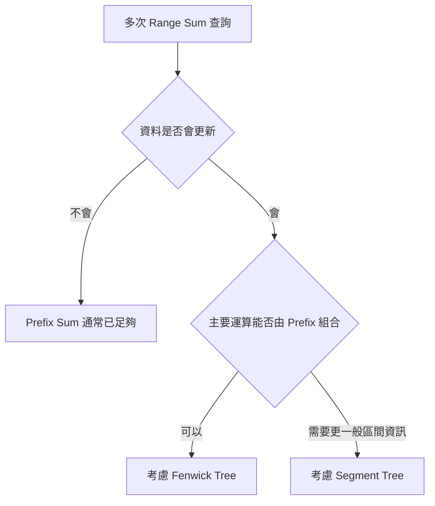
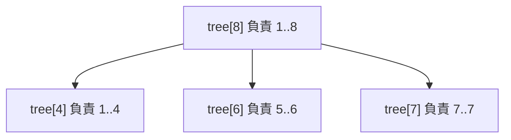
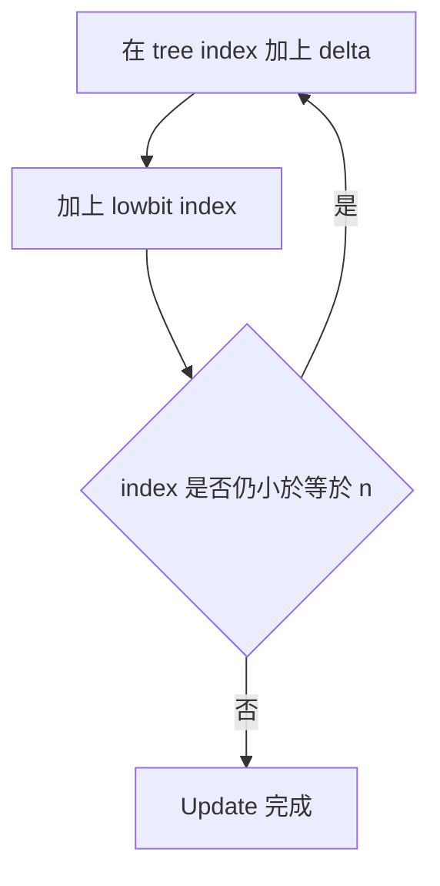
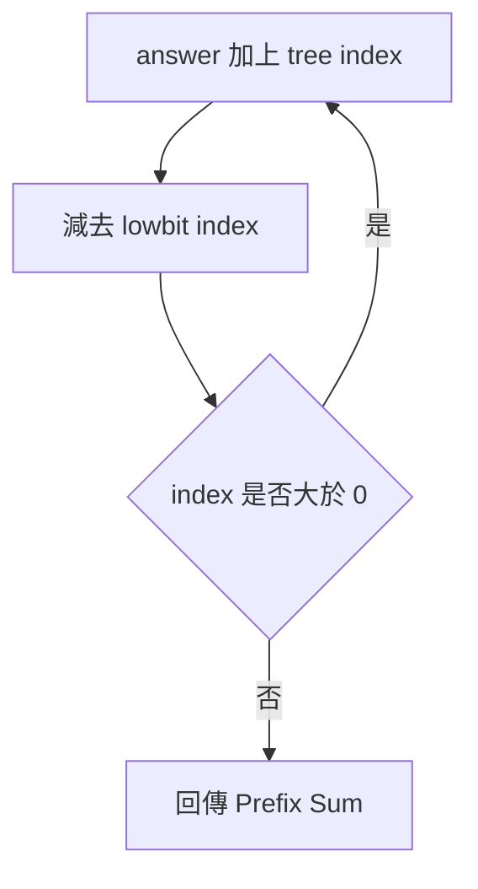

## 第 46 章　Fenwick Tree

### 適用範圍

本章說明 Fenwick Tree，也稱為 Binary Indexed Tree，簡稱 BIT。Fenwick Tree 適合處理一組數值會持續更新，而且需要反覆查詢 Prefix Sum 的問題。

第一次接觸 Fenwick Tree 時，常見困難不是不會寫 `while`，而是不清楚：

- `tree[i]` 保存的是原始值，還是一段區間的總和？
- `i & -i` 為什麼可以取得某段區間的長度？
- Update 為什麼往較大的 Index 移動？
- Query 為什麼往較小的 Index 移動？
- 為什麼 Fenwick Tree 常使用 1-based Index？
- Range Sum 為什麼可以用兩個 Prefix Sum 相減？

這些困難通常不是語法問題，而是還沒有先看懂每個 `tree[i]` 所負責的區間。

本章會建立一套固定流程：

- 先確認題目是靜態查詢，還是資料會持續更新。
- 從 Prefix Sum 的限制推導 Fenwick Tree。
- 使用小型 Array 手動畫出每個 Tree Index 的負責範圍。
- 理解 `lowbit` 的用途。
- 分別追蹤 Update 與 Prefix Query。
- 再延伸到 Range Sum、Set Value、Frequency Table 與 Order Statistics。



### 適用讀者

- 已理解 Prefix Sum，但不熟悉動態區間查詢的讀者。
- 第一次看到 `i & -i`，不知道它與區間有何關係的讀者。
- 容易混淆原始 Array Index 與 Fenwick Tree Index 的讀者。
- 想理解 Point Update、Prefix Query 與 Range Sum 的讀者。
- 想比較 Prefix Sum、Fenwick Tree 與 Segment Tree 的讀者。

### 快速導覽

- [46.1 Fenwick Tree 前到底要分析什麼](#461-fenwick-tree-前到底要分析什麼)
- [46.2 為什麼 Prefix Sum 不一定足夠](#462-為什麼-prefix-sum-不一定足夠)
- [46.3 資料結構設計](#463-資料結構設計)
- [46.4 Lowbit](#464-lowbit)
- [46.5 每個 Tree Index 負責哪一段](#465-每個-tree-index-負責哪一段)
- [46.6 Point Update](#466-point-update)
- [46.7 Prefix Query](#467-prefix-query)
- [46.8 Range Sum](#468-range-sum)
- [46.9 完整 C++ 實作](#469-完整-c-實作)
- [46.10 Build Fenwick Tree](#4610-build-fenwick-tree)
- [46.11 Set Value 與 Add Delta](#4611-set-value-與-add-delta)
- [46.12 Frequency Table 與第 k 小](#4612-frequency-table-與第-k-小)
- [46.13 Fenwick Tree 與 Segment Tree](#4613-fenwick-tree-與-segment-tree)
- [46.14 複雜度](#4614-複雜度)
- [46.15 常見問題與判讀](#4615-常見問題與判讀)
- [46.16 本章檢查表](#4616-本章檢查表)
- [46.17 本章重點](#4617-本章重點)

### 46.1 Fenwick Tree 前到底要分析什麼

假設題目如下：

給定一組整數，需要反覆執行：

- 將某個位置增加一個值。
- 查詢 Index `left` 到 `right` 的總和。

第一步先整理問題：

<table>
<tr><th>分析項目</th><th>本題內容</th></tr>
<tr><td>資料</td><td>一組整數</td></tr>
<tr><td>更新</td><td>Point Update，單一位置增加 delta</td></tr>
<tr><td>查詢</td><td>Range Sum</td></tr>
<tr><td>更新與查詢次數</td><td>很多次</td></tr>
<tr><td>是否需要原始值</td><td>若支援 Set Value，通常需要</td></tr>
<tr><td>可利用性質</td><td>Range Sum 可由兩個 Prefix Sum 相減</td></tr>
</table>

這張表會直接影響方法：

- 若資料不更新，Prefix Sum 建立 O(n)、查詢 O(1) 已足夠。
- 若資料會更新，普通 Prefix Sum 每次更新可能要改動後方 O(n) 個位置。
- Fenwick Tree 將 Update 與 Prefix Query 都控制在 O(log n)。

### 46.2 為什麼 Prefix Sum 不一定足夠

對原始資料：

```text
values = [3, 2, 5, 1, 4]
```

Prefix Sum：

```text
prefix = [0, 3, 5, 10, 11, 15]
```

查詢 `[1, 3]`：

```text
prefix[4] - prefix[1] = 11 - 3 = 8
```

查詢很快。但若 `values[1]` 從 2 增加為 7，後面的 Prefix Sum 都要更新。

<table>
<tr><th>方法</th><th>Point Update</th><th>Range Sum Query</th></tr>
<tr><td>直接 Array</td><td>O(1)</td><td>O(n)</td></tr>
<tr><td>Prefix Sum</td><td>O(n)</td><td>O(1)</td></tr>
<tr><td>Fenwick Tree</td><td>O(log n)</td><td>O(log n)</td></tr>
</table>

Fenwick Tree 是在更新與查詢之間取得平衡。

### 46.3 資料結構設計

Fenwick Tree 使用一個 Array `tree`。本章使用 1-based Index：

```text
原始 Index：0, 1, 2, ..., n - 1
Tree Index：1, 2, 3, ..., n
```

若呼叫端使用 0-based Index，進入 Fenwick Tree 後先加一：

```cpp
int index = originalIndex + 1;
```

使用 1-based Index 的原因是 `lowbit(0) == 0`。若 Update 從 0 開始，`index += lowbit(index)` 不會前進，可能形成無窮迴圈。

### 46.4 Lowbit

Lowbit 表示一個正整數 Binary 中最低位的 1 所代表的值。

常見寫法：

```cpp
int lowbit(int value)
{
    return value & -value;
}
```

例如：

<table>
<tr><th>十進位</th><th>Binary</th><th>Lowbit</th></tr>
<tr><td>1</td><td>0001</td><td>1</td></tr>
<tr><td>2</td><td>0010</td><td>2</td></tr>
<tr><td>3</td><td>0011</td><td>1</td></tr>
<tr><td>4</td><td>0100</td><td>4</td></tr>
<tr><td>6</td><td>0110</td><td>2</td></tr>
<tr><td>8</td><td>1000</td><td>8</td></tr>
</table>

在 Fenwick Tree 中，`lowbit(i)` 也表示 `tree[i]` 負責的區間長度。

對 signed 最小值做負號可能涉及 Overflow。Fenwick Tree Index 通常是正數且遠小於型別上限，但實務介面仍應驗證範圍。若要強調純位元語意，可使用合適的 unsigned 型別設計。

### 46.5 每個 Tree Index 負責哪一段

`tree[i]` 保存的區間是：

```text
[i - lowbit(i) + 1, i]
```

這裡是 Tree 的 1-based Index。

<table>
<tr><th>i</th><th>lowbit(i)</th><th>負責區間</th></tr>
<tr><td>1</td><td>1</td><td>[1, 1]</td></tr>
<tr><td>2</td><td>2</td><td>[1, 2]</td></tr>
<tr><td>3</td><td>1</td><td>[3, 3]</td></tr>
<tr><td>4</td><td>4</td><td>[1, 4]</td></tr>
<tr><td>5</td><td>1</td><td>[5, 5]</td></tr>
<tr><td>6</td><td>2</td><td>[5, 6]</td></tr>
<tr><td>7</td><td>1</td><td>[7, 7]</td></tr>
<tr><td>8</td><td>8</td><td>[1, 8]</td></tr>
</table>



這張圖只用來呈現區間涵蓋關係。Fenwick Tree 並不是一般以節點 Pointer 建立的 Tree。

### 46.6 Point Update

假設原始 Index 4 的值增加 `delta`。

這個變化會影響所有「負責區間包含該位置」的 Tree Index。

Update 的移動方式：

```cpp
index += lowbit(index);
```

#### 逐輪追蹤

若 n = 8，更新 Tree Index 5：

```text
5 -> 6 -> 8 -> 結束
```

原因：

- `tree[5]` 負責 `[5,5]`。
- `tree[6]` 負責 `[5,6]`。
- `tree[8]` 負責 `[1,8]`。

這三段都包含位置 5。



#### C++ Update

```cpp
void add(int index, long long delta)
{
    ++index; // 0-based 轉成 1-based

    while (index < static_cast<int>(tree.size()))
    {
        tree[index] += delta;
        index += index & -index;
    }
}
```

### 46.7 Prefix Query

`prefixSum(index)` 計算原始 Array `[0, index]` 的總和。

每次讀取 `tree[index]` 後，移除目前 Index 的 Lowbit：

```cpp
index -= lowbit(index);
```

#### 逐輪追蹤

查詢 Tree Index 7 的 Prefix Sum：

```text
7 -> 6 -> 4 -> 0
```

對應區間：

```text
[7,7] + [5,6] + [1,4]
```

剛好完整涵蓋 `[1,7]`，而且不重複。



#### C++ Prefix Query

```cpp
long long prefixSum(int index) const
{
    ++index; // 0-based 轉成 1-based
    long long answer = 0;

    while (index > 0)
    {
        answer += tree[index];
        index -= index & -index;
    }

    return answer;
}
```

### 46.8 Range Sum

Inclusive Range `[left, right]`：

```text
rangeSum(left, right)
= prefixSum(right) - prefixSum(left - 1)
```

當 `left == 0` 時，`left - 1 == -1`。可以讓 `prefixSum(-1)` 自然回傳 0，或額外處理邊界。

```cpp
long long rangeSum(int left, int right) const
{
    if (left > right)
    {
        return 0;
    }

    return prefixSum(right) - prefixSum(left - 1);
}
```

### 46.9 完整 C++ 實作

```cpp
#include <iostream>
#include <stdexcept>
#include <vector>

class FenwickTree
{
private:
    std::vector<long long> tree;

public:
    explicit FenwickTree(int size)
        : tree(size + 1, 0)
    {
        if (size < 0)
        {
            throw std::invalid_argument("size must be non-negative");
        }
    }

    int size() const
    {
        return static_cast<int>(tree.size()) - 1;
    }

    void add(int index, long long delta)
    {
        if (index < 0 || index >= size())
        {
            throw std::out_of_range("FenwickTree index out of range");
        }

        for (int i = index + 1;
             i < static_cast<int>(tree.size());
             i += i & -i)
        {
            tree[i] += delta;
        }
    }

    long long prefixSum(int index) const
    {
        if (index < 0)
        {
            return 0;
        }

        if (index >= size())
        {
            throw std::out_of_range("FenwickTree index out of range");
        }

        long long answer = 0;

        for (int i = index + 1; i > 0; i -= i & -i)
        {
            answer += tree[i];
        }

        return answer;
    }

    long long rangeSum(int left, int right) const
    {
        if (left < 0 || right >= size() || left > right)
        {
            throw std::out_of_range("invalid range");
        }

        return prefixSum(right) - prefixSum(left - 1);
    }
};

int main()
{
    std::vector<int> values{3, 2, 5, 1, 4};
    FenwickTree fenwick(static_cast<int>(values.size()));

    for (int i = 0; i < static_cast<int>(values.size()); ++i)
    {
        fenwick.add(i, values[i]);
    }

    std::cout << fenwick.rangeSum(1, 3) << '\n'; // 8

    fenwick.add(2, 3); // values[2] 從 5 增加成 8

    std::cout << fenwick.rangeSum(1, 3) << '\n'; // 11
}
```

### 46.10 Build Fenwick Tree

最容易理解的建立方式，是將每個原始值依序 `add`：

```cpp
for (int i = 0; i < n; ++i)
{
    fenwick.add(i, values[i]);
}
```

時間為 O(n log n)。

也可以使用 O(n) Build。對 1-based Tree：

```cpp
for (int i = 1; i <= n; ++i)
{
    tree[i] += values[i - 1];

    int parent = i + (i & -i);
    if (parent <= n)
    {
        tree[parent] += tree[i];
    }
}
```

初學時建議先掌握 O(n log n) 建立方式，再理解 O(n) Build 的區間累積方向。

### 46.11 Set Value 與 Add Delta

Fenwick Tree 的基礎 Update 語意通常是：

```text
在某位置增加 delta
```

若題目要求：

```text
將 values[index] 設成 newValue
```

要先計算差值：

```cpp
long long delta = newValue - values[index];
values[index] = newValue;
fenwick.add(index, delta);
```

如果沒有保留原始 `values[index]`，就無法直接知道 delta，除非額外用 Query 取得目前單點值。

### 46.12 Frequency Table 與第 k 小

Fenwick Tree 也可以保存頻率：

```text
tree 中的 Prefix Sum = 小於等於某個值的元素數量
```

這時可用 Binary Search 或 Fenwick Tree Binary Lifting 找到：

```text
最小的 index，使 prefixSum(index) >= k
```

也就是依頻率找第 k 小。

前置條件是 Frequency 不可為負，因為 Prefix Count 必須保持單調。若任意更新使頻率變成負數，這個查找條件會失效。

### 46.13 Fenwick Tree 與 Segment Tree

<table>
<tr><th>項目</th><th>Fenwick Tree</th><th>Segment Tree</th></tr>
<tr><td>實作複雜度</td><td>較短</td><td>較高</td></tr>
<tr><td>Point Update</td><td>O(log n)</td><td>O(log n)</td></tr>
<tr><td>Prefix Sum</td><td>O(log n)</td><td>O(log n)</td></tr>
<tr><td>一般 Range Query</td><td>需能由 Prefix 組合</td><td>可支援更多結合運算</td></tr>
<tr><td>Range Update</td><td>可透過差分技巧延伸</td><td>可使用 Lazy Propagation</td></tr>
<tr><td>空間</td><td>O(n)</td><td>O(n)</td></tr>
</table>

Fenwick Tree 適合 Prefix Sum、Frequency 與可由 Prefix 相減取得的 Range Sum。若需要 Range Minimum、複雜區間更新或更一般的節點資訊，Segment Tree 通常較直接。

### 46.14 複雜度

<table>
<tr><th>工作</th><th>時間</th><th>額外空間</th></tr>
<tr><td>Point Add</td><td>O(log n)</td><td>O(1)</td></tr>
<tr><td>Prefix Sum</td><td>O(log n)</td><td>O(1)</td></tr>
<tr><td>Range Sum</td><td>O(log n)</td><td>O(1)</td></tr>
<tr><td>逐點 Build</td><td>O(n log n)</td><td>Tree 共 O(n)</td></tr>
<tr><td>線性 Build</td><td>O(n)</td><td>Tree 共 O(n)</td></tr>
</table>

`log n` 來自每次透過 Lowbit 跳過一整段 Binary 區間，而不是逐格移動。

### 46.15 常見問題與判讀

<table>
<tr><th>現象</th><th>可能原因</th><th>第一輪檢查</th></tr>
<tr><td>Update 無法停止</td><td>從 Tree Index 0 開始</td><td>Fenwick Tree 內部使用 1-based Index</td></tr>
<tr><td>查詢少第一個元素</td><td>0-based 與 1-based 轉換錯誤</td><td>畫出原始 Index 與 Tree Index</td></tr>
<tr><td>Range Sum 邊界錯誤</td><td>混淆 Inclusive 與 Half-open</td><td>明確寫出 Prefix 相減公式</td></tr>
<tr><td>Set Value 後答案錯誤</td><td>把 newValue 當成 delta</td><td>先計算 `newValue - oldValue`</td></tr>
<tr><td>總和溢位</td><td>Tree 使用 int</td><td>總和與 delta 使用 long long</td></tr>
<tr><td>第 k 小查找錯誤</td><td>Frequency 出現負數</td><td>確認 Prefix Count 保持單調</td></tr>
<tr><td>用 Fenwick 查 Range Minimum</td><td>運算不能直接由兩個 Prefix 相減</td><td>重新評估 Segment Tree</td></tr>
</table>

### 46.16 本章檢查表

- 我能說明 Fenwick Tree 適合動態 Prefix Sum。
- 我知道內部通常使用 1-based Index。
- 我能計算正整數的 Lowbit。
- 我能說明 `tree[i]` 的負責區間。
- 我能手動追蹤 Update 的 Index 變化。
- 我能手動追蹤 Prefix Query 的 Index 變化。
- 我能使用兩個 Prefix Sum 計算 Inclusive Range Sum。
- 我能區分 Point Add 與 Set Value。
- 我知道 Frequency 查找需要單調 Prefix Count。
- 我能判斷何時應改用 Segment Tree。
- 我會測試空資料、單一元素、Index 0、最後 Index 與負數值。

### 46.17 本章重點

- Fenwick Tree 在 Point Update 與 Prefix Query 之間取得 O(log n) 平衡。
- 內部使用 1-based Index，可避免 Lowbit 在 0 無法前進。
- `lowbit(i)` 表示 `tree[i]` 負責的區間長度。
- Update 使用 `i += lowbit(i)` 找到所有包含該位置的區間。
- Query 使用 `i -= lowbit(i)` 將 Prefix 拆成互不重疊的區間。
- Range Sum 可由兩個 Prefix Sum 相減。
- 基礎 Update 是增加 delta；Set Value 需要先轉成差值。
- Fenwick Tree 適合 Sum、Frequency 與可由 Prefix 組合的查詢。
- 更一般的 Range Query 或 Range Update 可考慮 Segment Tree。
