## 第 47 章　Segment Tree

### 適用範圍

本章介紹 Segment Tree 的核心模型，包括樹狀區間分解、Range Query、Point Update、Range Update、Lazy Propagation、Merge Function、Identity Element，以及時間與空間複雜度。

Segment Tree 適合資料會更新，而且需要反覆查詢區間摘要的情境，例如：

- 區間總和。
- 區間最小值或最大值。
- 區間 GCD。
- 區間統計摘要。
- Point Update 搭配 Range Query。
- Range Update 搭配 Range Query。

Segment Tree 並不是看到「區間」就一定要使用。若資料完全靜態，Prefix Sum 或 Sparse Table 可能更簡單；若只需要 Prefix Sum 與 Point Update，Fenwick Tree 可能更精簡。選擇前需要先確認 Update、Query 與 Merge 的形式。

本章會建立一套固定流程：

1. 明確定義每個 Tree Node 代表的 Interval。
2. 定義 Node 保存的摘要 State。
3. 定義左右 Child State 如何 Merge。
4. 定義查詢無重疊時的 Identity Element。
5. 區分完整覆蓋、部分重疊與完全不重疊。
6. Point Update 後沿 Ancestor 路徑重新計算。
7. Range Update 時定義 Lazy Tag 的語意與組合方式。
8. 分析每次 Query、Update 會拜訪多少 Tree Node。
9. 使用空輸入、單一元素、整段查詢與邊界區間測試。

### 適用讀者

- 面對動態 Range Query，不確定 Prefix Sum 是否足夠的讀者。
- 會背 Segment Tree Template，但不清楚 Node Interval 的讀者。
- 容易混淆 Inclusive 與 Half-open Interval 的讀者。
- Query 遇到無重疊時，不知道該回傳什麼的讀者。
- Point Update 後忘記重新計算 Ancestor 的讀者。
- Range Update 寫得出來，但不理解 Lazy Tag 語意的讀者。
- 需要比較 Segment Tree、Fenwick Tree、Prefix Sum 與 Sparse Table 的讀者。

### 快速導覽

- [Segment Tree 到底保存什麼](#471-segment-tree-到底保存什麼)
- [第一步：定義 Interval 與 State](#472-第一步定義-interval-與-state)
- [樹狀區間分解](#473-樹狀區間分解)
- [Merge 與 Identity Element](#474-merge-與-identity-element)
- [建立 Segment Tree](#475-建立-segment-tree)
- [Range Query](#476-range-query)
- [完整案例：區間總和查詢](#477-完整案例區間總和查詢)
- [Point Update](#478-point-update)
- [完整案例：Point Assignment](#479-完整案例point-assignment)
- [Iterative Segment Tree](#4710-iterative-segment-tree)
- [Range Update 的問題](#4711-range-update-的問題)
- [Lazy Propagation](#4712-lazy-propagation)
- [完整案例：Range Add 與 Range Sum](#4713-完整案例range-add-與-range-sum)
- [Lazy Tag 的組合](#4714-lazy-tag-的組合)
- [複雜度推導](#4715-複雜度推導)
- [工具選擇](#4716-工具選擇)
- [C 語言中的 Segment Tree](#4717-c-語言中的-segment-tree)
- [系統化 Debug](#4718-系統化-debug)
- [常見問題與判讀](#4719-常見問題與判讀)
- [本章檢查表](#4720-本章檢查表)
- [本章重點](#4721-本章重點)

### 47.1 Segment Tree 到底保存什麼

Segment Tree 的每個 Node 代表原 Array 的一段連續 Interval，並保存該 Interval 的摘要。

以 Sum 為例：

```text
values = [2, 1, 5, 3]
```

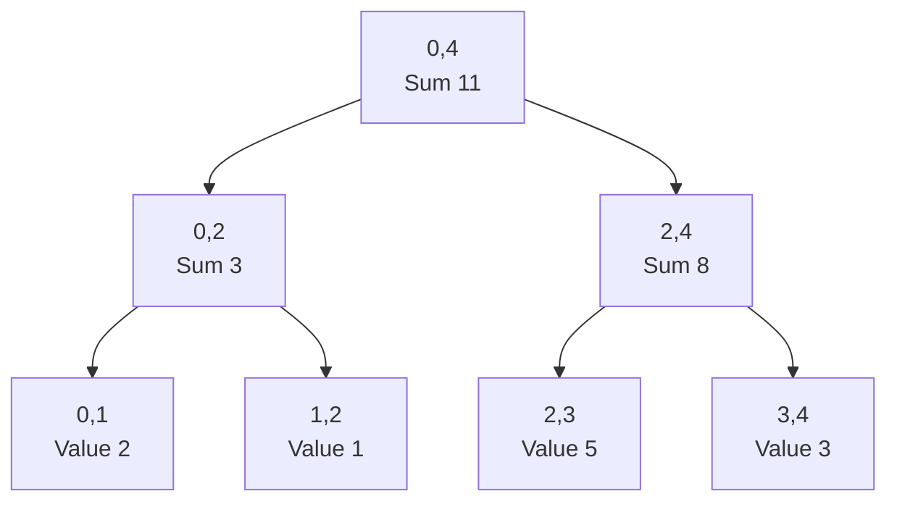

本章統一使用 Half-open Interval：

```text
[left, right)
```

因此 Root `[0, n)` 代表整個 Array，Leaf `[i, i + 1)` 代表單一元素 `values[i]`。

Tree Node 通常不保存原始元素清單，而保存可合併的摘要，例如 Sum、Minimum 或 Maximum。

### 47.2 第一步：定義 Interval 與 State

開始撰寫前，先回答：

```text
Node Interval 是什麼？
Node State 是什麼？
Left 與 Right 如何 Merge？
無重疊時回傳什麼？
```

以 Range Sum 為例：

```text
State    = Interval 內所有元素總和
Merge    = leftSum + rightSum
Identity = 0
```

以 Range Minimum 為例：

```text
State    = Interval 內最小值
Merge    = min(leftMin, rightMin)
Identity = +Infinity
```

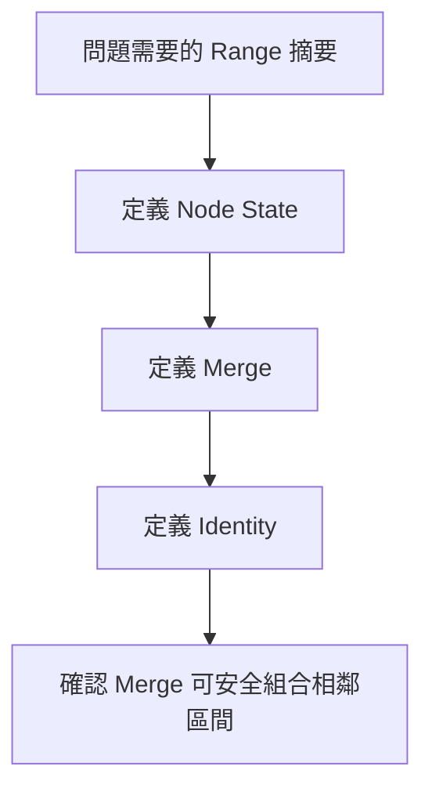

若無法由左右 Child 的摘要得到 Parent 摘要，這個 State 就不足以直接建立 Segment Tree。

### 47.3 樹狀區間分解

對 Node Interval `[left, right)`：

```text
mid = left + (right - left) / 2
Left Child  = [left, mid)
Right Child = [mid, right)
```

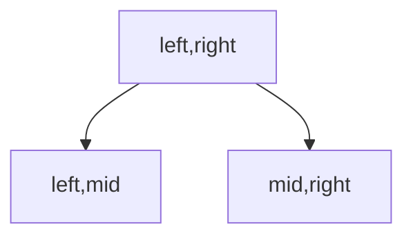

當 `right - left == 1` 時，Interval 只包含一個元素，是 Leaf。

Segment Tree 不要求 n 為 2 的次方。遞迴分割仍可建立 Tree，只是左右形狀不一定完全對稱。

#### Array Index 表示

若 Root 使用 Index 1：

```text
Left Child  = node * 2
Right Child = node * 2 + 1
```

Tree Array 常配置約 `4 * n` 格，作為簡單安全的遞迴實作空間。另一種 Iterative Segment Tree 會將 Leaf 放在連續區域，通常使用約 `2 * size` 空間。

### 47.4 Merge 與 Identity Element

Merge 必須讓相鄰、不重疊區間的摘要可組成聯集摘要：

```text
summary([l,r))
= merge(summary([l,m)), summary([m,r)))
```

Identity Element 滿足：

```text
merge(identity, x) = x
merge(x, identity) = x
```

| Query | Merge | Identity |
|---|---|---|
| Sum | 加法 | 0 |
| Minimum | `min` | 正 Infinity |
| Maximum | `max` | 負 Infinity |
| GCD | `gcd` | 0 |
| Product | 乘法 | 1 |

Identity 必須和合法資料語意相容。Range Maximum 若資料可能全是負數，無重疊不能回傳 0，否則會錯誤蓋過真實負值。

### 47.5 建立 Segment Tree

以下建立 Range Sum Segment Tree：

```cpp
#include <vector>

class SegmentTree
{
public:
    explicit SegmentTree(const std::vector<long long>& values)
        : size_(static_cast<int>(values.size())),
          tree_(values.empty() ? 1 : 4 * values.size(), 0)
    {
        if (!values.empty())
        {
            build(1, 0, size_, values);
        }
    }

private:
    int size_;
    std::vector<long long> tree_;

    void build(
        int node,
        int left,
        int right,
        const std::vector<long long>& values)
    {
        if (right - left == 1)
        {
            tree_[node] = values[left];
            return;
        }

        const int mid = left + (right - left) / 2;
        build(node * 2, left, mid, values);
        build(node * 2 + 1, mid, right, values);
        tree_[node] = tree_[node * 2] + tree_[node * 2 + 1];
    }
};
```

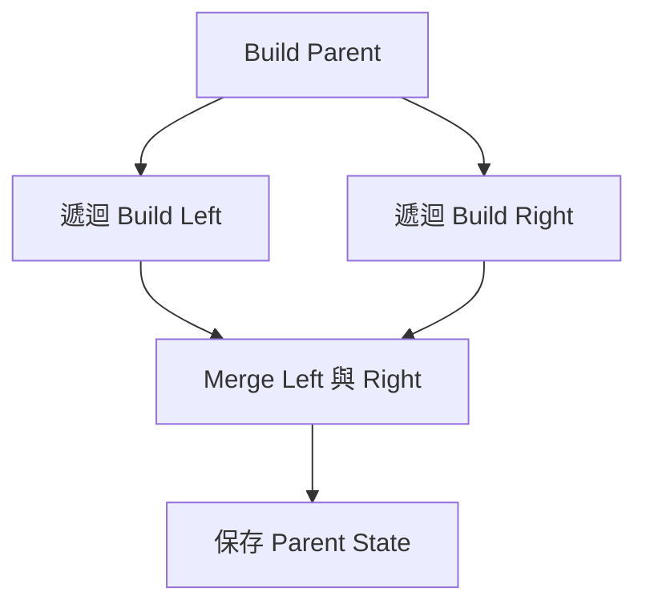

Build 每個 Tree Node 一次，所以時間為 O(n)。

### 47.6 Range Query

Query `[queryLeft, queryRight)` 和目前 Node Interval 有三種關係。

#### 完全不重疊

```text
right <= queryLeft 或 queryRight <= left
```

回傳 Identity。

#### 完整覆蓋

```text
queryLeft <= left 且 right <= queryRight
```

直接回傳目前 Node State，不必繼續往下。

#### 部分重疊

分別查詢 Left、Right Child，再 Merge。

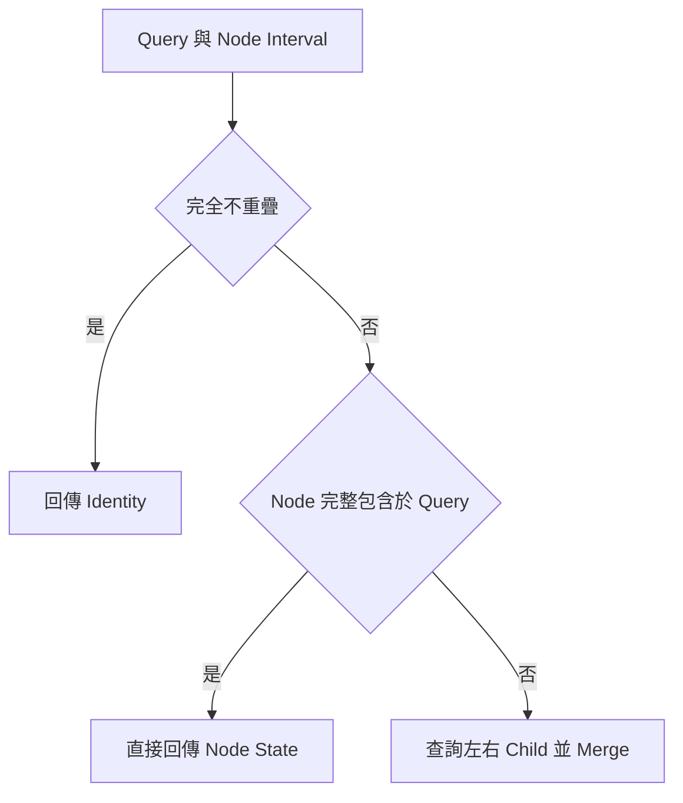

這三種情況是 Range Query 正確性與效率的核心。

### 47.7 完整案例：區間總和查詢

在前述 Class 加入：

```cpp
public:
    long long rangeSum(int queryLeft, int queryRight) const
    {
        if (queryLeft < 0 || queryRight < queryLeft ||
            queryRight > size_)
        {
            return 0;
        }

        return query(1, 0, size_, queryLeft, queryRight);
    }

private:
    long long query(
        int node,
        int left,
        int right,
        int queryLeft,
        int queryRight) const
    {
        if (right <= queryLeft || queryRight <= left)
        {
            return 0;
        }

        if (queryLeft <= left && right <= queryRight)
        {
            return tree_[node];
        }

        const int mid = left + (right - left) / 2;
        return query(
                   node * 2,
                   left,
                   mid,
                   queryLeft,
                   queryRight)
             + query(
                   node * 2 + 1,
                   mid,
                   right,
                   queryLeft,
                   queryRight);
    }
```

#### 範例

查詢 `[1, 4)`：

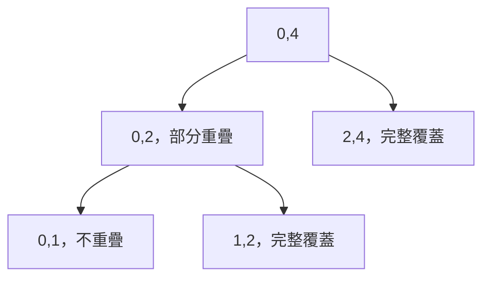

結果由 `[1,2)` 與 `[2,4)` 的 Sum 合併。

#### Query Invariant

每次 `query(node, left, right, ql, qr)` 回傳：

> Node Interval `[left,right)` 和 Query Interval `[ql,qr)` 交集內的正確摘要。

### 47.8 Point Update

Point Assignment 將 `values[index]` 改成新值。

流程：

1. 沿 Tree 找到包含 Index 的 Leaf。
2. 更新 Leaf State。
3. 返回時重新 Merge 每個 Ancestor。

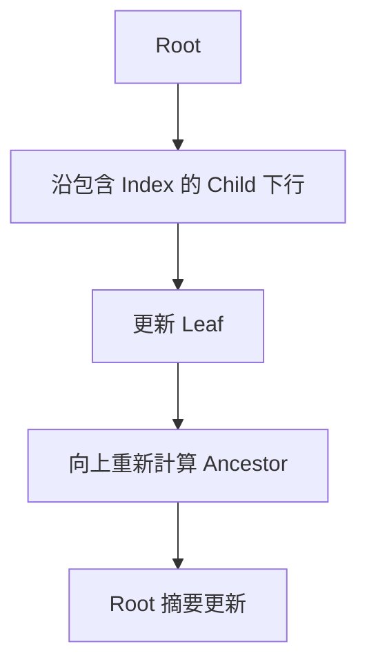

每層只進入一個 Child，Tree Height 為 O(log n)，因此 Point Update 為 O(log n)。

### 47.9 完整案例：Point Assignment

```cpp
public:
    bool assign(int index, long long value)
    {
        if (index < 0 || index >= size_)
        {
            return false;
        }

        assign(1, 0, size_, index, value);
        return true;
    }

private:
    void assign(
        int node,
        int left,
        int right,
        int index,
        long long value)
    {
        if (right - left == 1)
        {
            tree_[node] = value;
            return;
        }

        const int mid = left + (right - left) / 2;

        if (index < mid)
        {
            assign(node * 2, left, mid, index, value);
        }
        else
        {
            assign(node * 2 + 1, mid, right, index, value);
        }

        tree_[node] = tree_[node * 2] + tree_[node * 2 + 1];
    }
```

常見錯誤是只改 Leaf，沒有重新計算 Parent，導致後續整段 Query 仍讀到舊摘要。

### 47.10 Iterative Segment Tree

Iterative 版本常把 Leaf 放在 `[size, 2*size)`：

```text
Leaf i 位於 tree[size + i]
Parent i 位於 i / 2
```

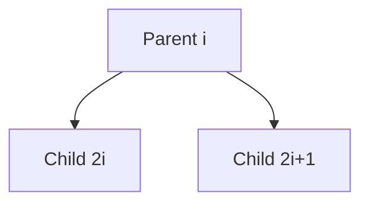

優點：

- 避免遞迴。
- Point Update 與 Range Query 程式常較短。
- 資料布局連續。

缺點：

- Lazy Propagation 與複雜 State 較難閱讀。
- Half-open Iterative Query 的左右移動需要仔細推導。

學習初期可先掌握遞迴版的 Interval 與 Postcondition，再理解 Iterative 版。

### 47.11 Range Update 的問題

若對 `[ql, qr)` 每個元素都加上 Delta，逐一 Point Update 需要：

```text
O(k log n)
```

其中 k 是區間長度。

若資料只需最後一次還原，可使用 Difference Array。但若 Range Update 與 Range Query 交錯，就需要在 Tree Node 上保存尚未下傳的更新，這就是 Lazy Propagation。

### 47.12 Lazy Propagation

Lazy Tag 表示：

> 此 Node Interval 的摘要已套用更新，但更新尚未傳給 Child。

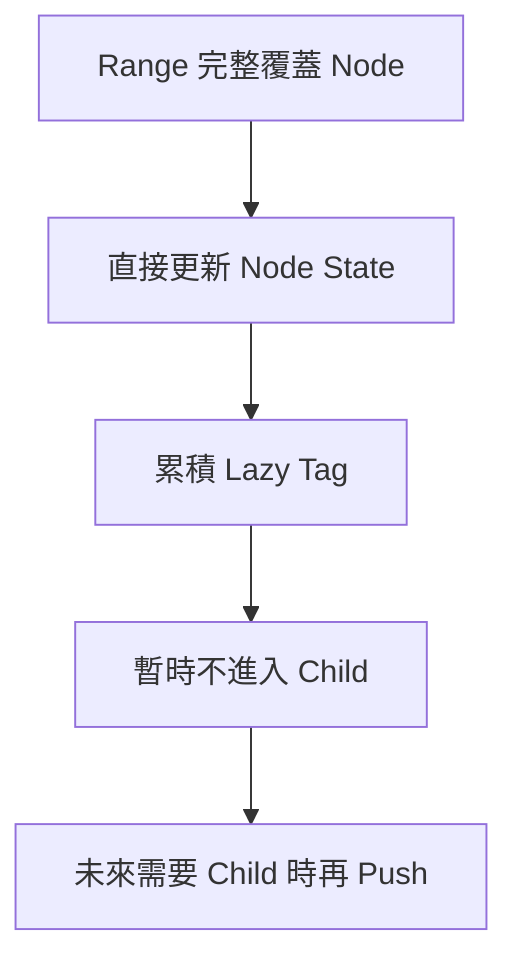

以 Range Add、Range Sum 為例，Node `[left,right)` 加 Delta：

```text
tree[node] += delta * (right - left)
lazy[node] += delta
```

因為 Interval 中每個元素都增加 Delta，總和增加 `Delta × Length`。

### 47.13 完整案例：Range Add 與 Range Sum

核心輔助函式：

```cpp
void apply(
    int node,
    int left,
    int right,
    long long delta)
{
    tree_[node] += delta * (right - left);
    lazy_[node] += delta;
}

void push(int node, int left, int right)
{
    if (lazy_[node] == 0 || right - left == 1)
    {
        return;
    }

    const int mid = left + (right - left) / 2;
    apply(node * 2, left, mid, lazy_[node]);
    apply(node * 2 + 1, mid, right, lazy_[node]);
    lazy_[node] = 0;
}
```

Range Add：

```cpp
void add(
    int node,
    int left,
    int right,
    int queryLeft,
    int queryRight,
    long long delta)
{
    if (right <= queryLeft || queryRight <= left)
    {
        return;
    }

    if (queryLeft <= left && right <= queryRight)
    {
        apply(node, left, right, delta);
        return;
    }

    push(node, left, right);
    const int mid = left + (right - left) / 2;
    add(node * 2, left, mid, queryLeft, queryRight, delta);
    add(node * 2 + 1, mid, right, queryLeft, queryRight, delta);
    tree_[node] = tree_[node * 2] + tree_[node * 2 + 1];
}
```

Query 在需要進入 Child 前也應先 `push`，確保 Child State 包含所有延遲更新。

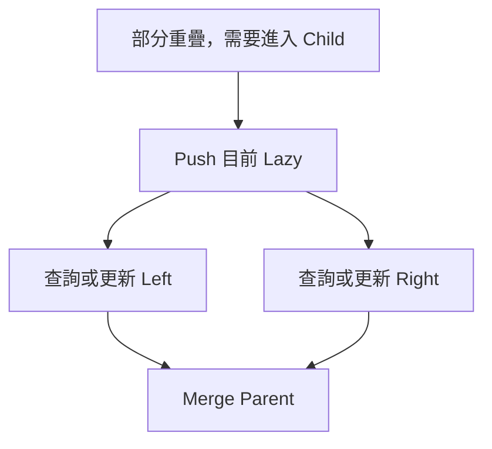

### 47.14 Lazy Tag 的組合

不同 Update 的 Tag 組合規則不同。

#### Range Add

兩次更新可直接相加：

```text
lazy += delta
```

#### Range Assignment

後一次 Assignment 覆蓋前一次 Assignment，通常還需額外 Boolean 表示 Tag 是否存在，因為指定值 0 也可能是合法更新。

#### Assignment 加 Add

兩種 Tag 的先後順序會影響結果，需要明確定義 Composition：

```text
先 Assign，再 Add
先 Add，再 Assign
```

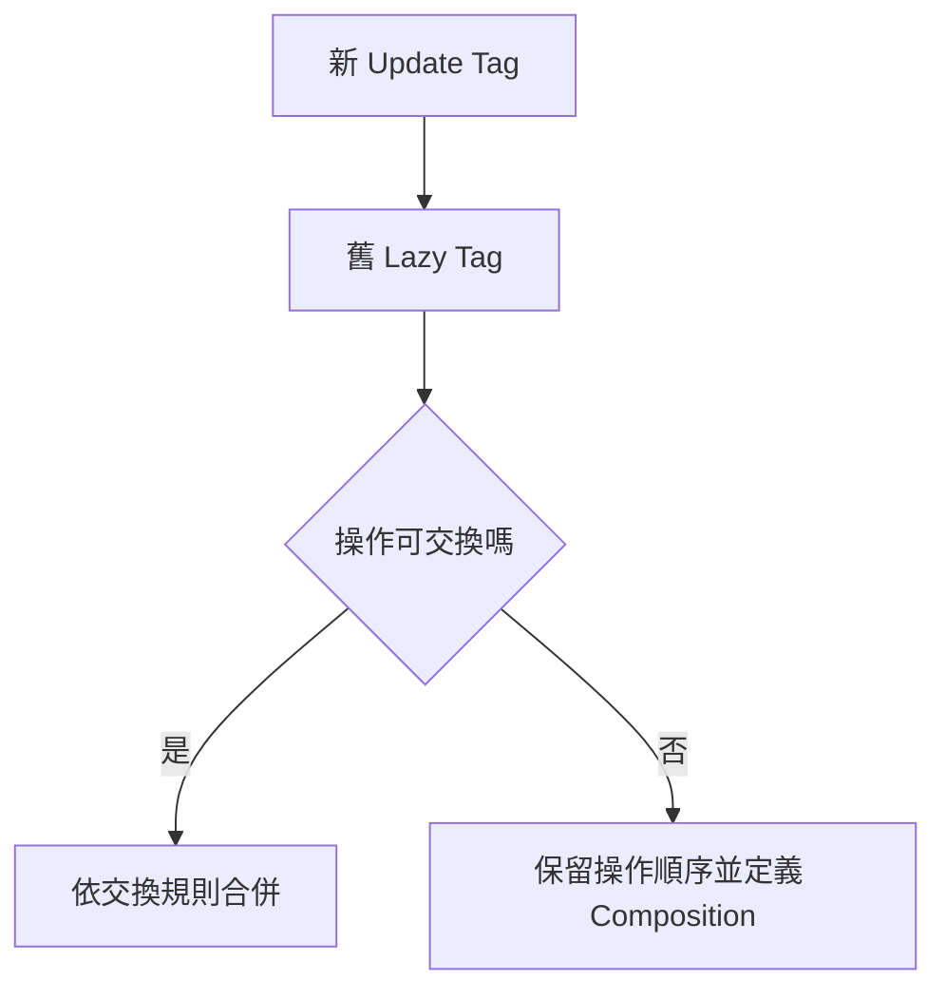

Lazy Propagation 最困難的部分通常不是 Tree Traversal，而是 Node State 如何套用 Tag，以及多個 Tag 如何組合。

### 47.15 複雜度推導

#### Build

每個 Tree Node 建立一次：

```text
O(n)
```

#### Point Update

每層進入一個 Child：

```text
O(log n)
```

#### Range Query

對每一層，只有少量邊界 Node 需要繼續分裂；完整覆蓋的區間直接回傳。因此典型 Range Query 為：

```text
O(log n)
```

對一般可合併摘要，區間可分解為 O(log n) 個 Canonical Segment。

#### Lazy Range Update

完整覆蓋時停止下行，典型 Range Update 為：

```text
O(log n)
```

#### 空間

```text
O(n)
```

遞迴版本另有 O(log n) Call Stack，極端空輸入與非法區間需由介面先處理。

### 47.16 工具選擇

| 需求 | 常見選擇 |
|---|---|
| 靜態 Range Sum | Prefix Sum |
| 靜態 Idempotent Query | Sparse Table |
| Point Update + Prefix Sum | Fenwick Tree |
| 一般 Point Update + Range Query | Segment Tree |
| Range Update + Range Query | Lazy Segment Tree |
| 批次 Range Add，最後一次輸出 | Difference Array |

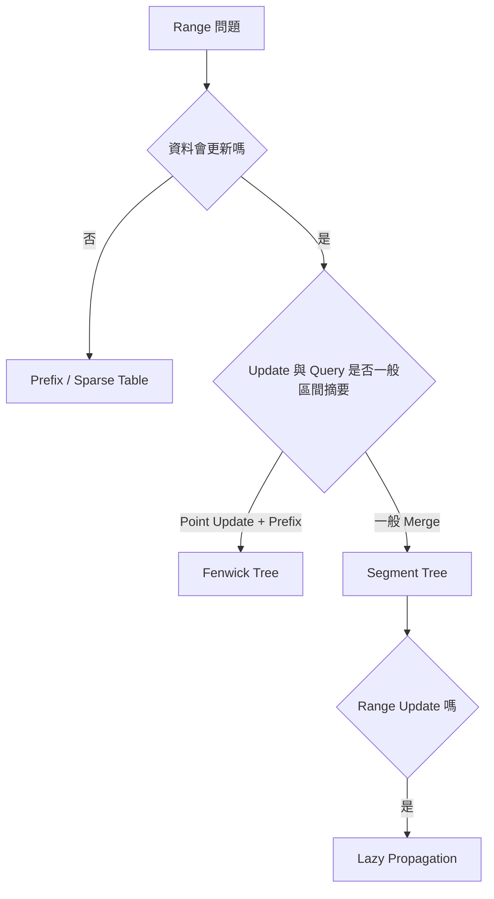

### 47.17 C 語言中的 Segment Tree

C 版本通常由呼叫端配置：

```c
struct SegmentTree
{
    long long *tree;
    long long *lazy;
    size_t length;
    size_t capacity;
};
```

需要明確處理：

- `4 * n` 的 Size 計算是否 Overflow。
- `malloc` 或 `calloc` 失敗。
- 空輸入。
- 最終 `free`。
- Recursive Index 是否超出 Capacity。
- Update、Query 的邊界是否合法。

若配置失敗，不應留下部分初始化卻可被查詢的 Tree。

### 47.18 系統化 Debug

建議記錄：

```text
Tree Node Index
Node Interval
Query / Update Interval
Overlap 類型
Node State 更新前後
Lazy Tag 更新前後
是否 Push
Merge Result
```

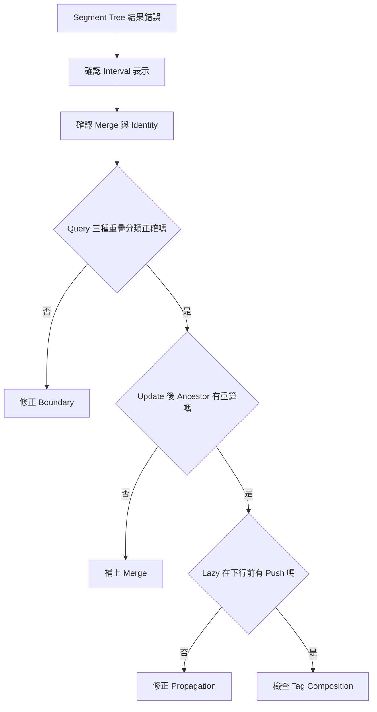

重要測試：

- 空 Array。
- 單一元素。
- 查詢空區間 `[x,x)`。
- 查詢整段 `[0,n)`。
- 查詢第一格與最後一格。
- Point Update 後查詢 Ancestor 區間。
- Range Update 完整覆蓋 Root。
- 多次重疊 Range Update。
- 全負數的 Range Maximum。
- 極大 Sum 與乘上 Interval Length 的 Overflow。

### 47.19 常見問題與判讀

| 現象 | 可能原因 | 第一輪檢查 |
|---|---|---|
| Query 差一格 | Inclusive 與 Half-open 混用 | 統一 `[left,right)` |
| 無重疊卻影響答案 | Identity 錯誤 | Max 不應無條件回 0 |
| Point Update 後整段仍舊 | 未重算 Ancestor | 返回時 Merge Child |
| Range Update 只更新部分 Query | Lazy 未 Push | 下行前傳給 Child |
| Sum 加值幅度錯誤 | 忘記乘 Interval Length | `delta * length` |
| Assignment 0 消失 | 用 0 表示沒有 Lazy Tag | 另存 Tag 存在旗標 |
| 多種 Lazy Update 順序錯 | Composition 未定義 | 明確寫出先後語意 |
| 空輸入遞迴錯誤 | 直接 Build `[0,0)` | Constructor 先判斷 |
| Tree Array 越界 | Capacity 不足或 Index 公式錯 | 檢查 `4*n` 與 Child Index |
| Overflow | State 或 Tag 使用窄型別 | 使用寬型別並檢查乘法 |

### 47.20 本章檢查表

- 我能說明每個 Node 代表的 Interval。
- 我能定義 Node State、Merge 與 Identity。
- 我一致使用 Half-open Interval。
- 我能區分無重疊、完整覆蓋與部分重疊。
- 我能說明 Build 為何是 O(n)。
- 我知道 Point Update 後要重新計算 Ancestor。
- 我能說明 Query 為何分解成 O(log n) 個 Segment。
- 我知道 Lazy Tag 表示尚未傳給 Child 的更新。
- 我會在進入 Child 前 Push Lazy。
- 我能定義 Tag 如何套用 Node State。
- 我能定義多個 Tag 的 Composition。
- 我會依 Update、Query 型態比較 Prefix、Fenwick、Sparse Table 與 Segment Tree。
- 我會測試空區間、整段、邊界與重疊更新。

### 47.21 本章重點

- Segment Tree 將 Array 分解成階層式 Interval，每個 Node 保存可合併摘要。
- Merge 與 Identity Element 決定 Query 如何組合結果。
- Half-open Interval 能讓 Leaf、空區間與邊界規則保持一致。
- Range Query 依完全不重疊、完整覆蓋與部分重疊三種情況處理。
- Point Update 修改 Leaf 後，必須沿 Ancestor 路徑重新 Merge。
- Lazy Propagation 讓完整覆蓋的 Range Update 停在高層 Node，將更新延後傳給 Child。
- Lazy Tag 必須明確定義套用方式與 Composition 順序。
- Build 為 O(n)，典型 Query、Point Update 與 Lazy Range Update 為 O(log n)，空間為 O(n)。
- Segment Tree 適合動態且一般化的 Range Query，但較簡單需求可能使用 Prefix Sum、Fenwick Tree 或 Sparse Table。
