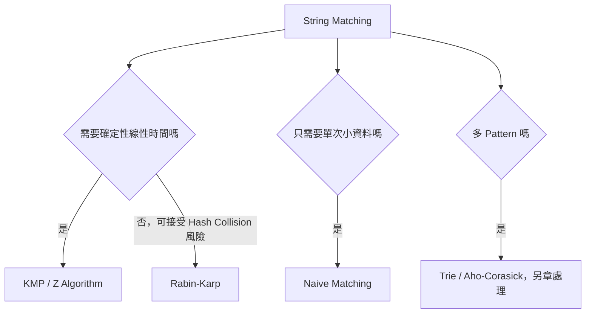
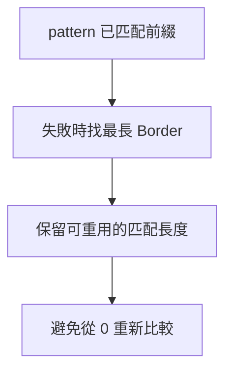
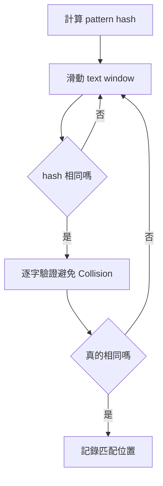
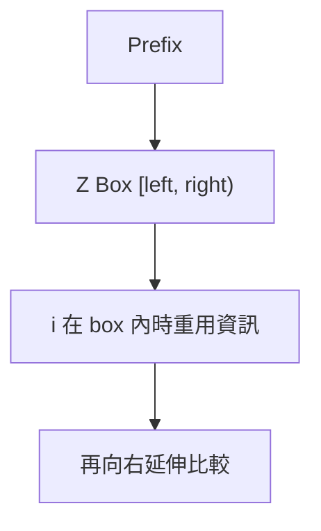

## 第 48 章　String Matching

### 適用範圍

本章整理 String Matching 的常見方法，包括問題定義、Naive Matching、KMP、Rabin-Karp、Z Algorithm、複雜度與常見錯誤。原始章節目前是骨架，包含問題定義、KMP、Rabin-Karp、Z Algorithm、複雜度與重點整理，本版會補上完整推導、範例、C++ 實作與判讀流程。citeturn42search1

String Matching 的核心問題是：

```text
給定 text 與 pattern，找出 pattern 在 text 中出現的位置。
```

延伸問題包括：

- 是否存在匹配。
- 計算出現次數。
- 列出所有起始位置。
- 多個 Pattern 查詢。
- Prefix / Border / Period 分析。
- 字串相等性快速比較。

本章聚焦單一 Pattern Matching 的三個主方法：

- KMP：利用 Prefix Function 避免重複比較。
- Rabin-Karp：利用 Rolling Hash 快速比較 Substring。
- Z Algorithm：計算每個位置與整體字串 Prefix 的最長共同前綴。



### 適用讀者

- 已會基本 String 與迴圈，但不熟悉線性字串匹配的讀者。
- 使用 Naive Matching 會超時，想理解 KMP、Rabin-Karp、Z Algorithm 的讀者。
- 容易混淆 Prefix、Suffix、Border、Prefix Function 與 Z Array 的讀者。
- 想知道 Hash Collision 與二次驗證關係的讀者。
- 需要完整 C++ 實作與測試案例的讀者。

### 快速導覽

- [48.1 問題定義](#481-問題定義)
- [48.2 Naive Matching](#482-naive-matching)
- [48.3 Prefix、Suffix 與 Border](#483-prefixsuffix-與-border)
- [48.4 KMP 的核心想法](#484-kmp-的核心想法)
- [48.5 Prefix Function](#485-prefix-function)
- [48.6 KMP 完整實作](#486-kmp-完整實作)
- [48.7 Rabin-Karp](#487-rabin-karp)
- [48.8 Rolling Hash 實作](#488-rolling-hash-實作)
- [48.9 Z Algorithm 的核心想法](#489-z-algorithm-的核心想法)
- [48.10 Z Algorithm 完整實作](#4810-z-algorithm-完整實作)
- [48.11 KMP、Rabin-Karp、Z Algorithm 比較](#4811-kmprabin-karpz-algorithm-比較)
- [48.12 常見題型](#4812-常見題型)
- [48.13 常見問題與判讀](#4813-常見問題與判讀)
- [48.14 本章檢查表](#4814-本章檢查表)
- [48.15 本章重點](#4815-本章重點)

### 48.1 問題定義

給定：

```text
text    = "ababcabcabababd"
pattern = "ababd"
```

要找出 pattern 在 text 中完整出現的位置。

若從 0-based Index 看，pattern 出現在 text 的 Index 10：

```text
text:    a b a b c a b c a b a b a b d
index:   0 1 2 3 4 5 6 7 8 9 10 11 12 13 14
pattern:                     a  b  a  b  d
```

常見輸出形式：

<table>
<tr><th>輸出需求</th><th>例子</th></tr>
<tr><td>是否存在</td><td>true / false</td></tr>
<tr><td>第一個出現位置</td><td>10 或 -1</td></tr>
<tr><td>全部出現位置</td><td>`[10]`</td></tr>
<tr><td>出現次數</td><td>1</td></tr>
</table>

#### 邊界條件

String Matching 應先定義：

- pattern 為空字串時怎麼處理？
- text 為空字串時怎麼處理？
- 是否允許重疊匹配？
- 是否大小寫敏感？
- 是否只處理 ASCII，還是 Unicode 字元？

本章 C++ 範例以 `std::string` 的 byte / char 序列為基礎，不處理 Unicode grapheme cluster 問題。

#### 重疊匹配

例如：

```text
text    = "aaaa"
pattern = "aa"
```

若允許重疊，匹配位置是：

```text
0, 1, 2
```

若不允許重疊，可能只取：

```text
0, 2
```

演算法實作前應先確認題目需求。本章預設列出所有重疊匹配。

### 48.2 Naive Matching

Naive Matching 枚舉 pattern 在 text 中的每個可能起點，再逐字比較。

```cpp
#include <string>
#include <vector>

std::vector<int> naiveSearch(
    const std::string& text,
    const std::string& pattern)
{
    std::vector<int> positions;

    if (pattern.empty())
    {
        return positions;
    }

    const int n = static_cast<int>(text.size());
    const int m = static_cast<int>(pattern.size());

    for (int start = 0; start + m <= n; ++start)
    {
        bool matched = true;

        for (int j = 0; j < m; ++j)
        {
            if (text[start + j] != pattern[j])
            {
                matched = false;
                break;
            }
        }

        if (matched)
        {
            positions.push_back(start);
        }
    }

    return positions;
}
```

#### 複雜度

```text
起點數量約 O(n)
每個起點最多比較 O(m)
總時間 O(nm)
額外空間 O(1)，不含輸出
```

#### Naive Matching 適用情況

- text 與 pattern 很短。
- 只需要快速寫出 Oracle。
- 用於對拍 KMP、Rabin-Karp 或 Z Algorithm。
- 題目限制允許 O(nm)。

#### Naive Matching 的瓶頸

若比較失敗後，下一個起點又從 pattern[0] 開始比，會重複比較很多已知資訊。

例如：

```text
text    = "aaaaaaaaab"
pattern = "aaaab"
```

很多起點都會比到很後面才失敗，造成接近 O(nm)。

### 48.3 Prefix、Suffix 與 Border

理解 KMP 與 Z Algorithm 前，先整理幾個名詞。

#### Prefix

Prefix 是從字串開頭開始的一段。

```text
s = "abcab"
prefixes: "a", "ab", "abc", "abca", "abcab"
```

#### Suffix

Suffix 是到字串結尾結束的一段。

```text
s = "abcab"
suffixes: "b", "ab", "cab", "bcab", "abcab"
```

#### Border

Border 是同時為 Prefix 與 Suffix 的字串，但通常不包含整個字串本身。

```text
s = "abab"
proper prefixes: "a", "ab", "aba"
proper suffixes: "b", "ab", "bab"
border: "ab"
```

KMP 的 Prefix Function 保存的就是每個前綴的最長 Border 長度。



### 48.4 KMP 的核心想法

KMP，全名 Knuth-Morris-Pratt Algorithm，用 Prefix Function 避免重複比較。

當目前已匹配 pattern 的前 j 個字元，但下一個字元失敗時：

```text
pattern[0..j-1] 已匹配
pattern[j] 失敗
```

KMP 不把 j 直接歸 0，而是找到目前已匹配字串的最長 Border。這代表某段 Prefix 也同時是 Suffix，可以保留下來繼續比較。

#### 例子

```text
pattern = "ababd"
```

若已匹配：

```text
"abab"
```

失敗時，`"abab"` 的最長 Border 是 `"ab"`，長度 2。因此可以把目前匹配長度 j 從 4 回退到 2，而不是 0。

#### KMP 的兩個階段

1. 對 pattern 建立 Prefix Function。
2. 掃描 text，使用 Prefix Function 控制匹配長度回退。

### 48.5 Prefix Function

Prefix Function `pi[i]` 表示：

```text
pattern[0..i] 這個前綴中，最長 proper border 的長度。
```

例如：

```text
pattern = "ababd"
index:     0 1 2 3 4
char:      a b a b d
pi:        0 0 1 2 0
```

#### 建立 Prefix Function

```cpp
#include <string>
#include <vector>

std::vector<int> buildPrefixFunction(const std::string& pattern)
{
    const int m = static_cast<int>(pattern.size());
    std::vector<int> pi(m, 0);

    for (int i = 1; i < m; ++i)
    {
        int length = pi[i - 1];

        while (length > 0 && pattern[i] != pattern[length])
        {
            length = pi[length - 1];
        }

        if (pattern[i] == pattern[length])
        {
            ++length;
        }

        pi[i] = length;
    }

    return pi;
}
```

#### Invariant

處理位置 i 時，`length` 表示目前考慮的 Border 長度。若 `pattern[i]` 無法延伸這個 Border，就持續回退到更短 Border。

#### 複雜度

雖然有 while，但 length 每次回退會變小，整體建立 Prefix Function 是 O(m)。

### 48.6 KMP 完整實作

```cpp
#include <string>
#include <vector>

std::vector<int> kmpSearch(
    const std::string& text,
    const std::string& pattern)
{
    std::vector<int> positions;

    if (pattern.empty())
    {
        return positions;
    }

    const std::vector<int> pi = buildPrefixFunction(pattern);
    const int n = static_cast<int>(text.size());
    const int m = static_cast<int>(pattern.size());

    int matched = 0;

    for (int i = 0; i < n; ++i)
    {
        while (matched > 0 && text[i] != pattern[matched])
        {
            matched = pi[matched - 1];
        }

        if (text[i] == pattern[matched])
        {
            ++matched;
        }

        if (matched == m)
        {
            positions.push_back(i - m + 1);
            matched = pi[matched - 1];
        }
    }

    return positions;
}
```

#### 為什麼找到一次後要回退

若允許重疊匹配，找到一次後不能直接把 `matched` 設成 0，而應回退到 `pi[m - 1]`。

例如：

```text
text    = "aaaa"
pattern = "aa"
```

匹配位置應為 0、1、2。

#### 複雜度

```text
Prefix Function：O(m)
掃描 text：O(n)
總時間：O(n + m)
額外空間：O(m)，不含輸出
```

### 48.7 Rabin-Karp

Rabin-Karp 使用 Rolling Hash 將字串片段轉成 Hash 值。若 pattern 的 Hash 與某個 text 子字串 Hash 相同，就可能匹配。

#### 核心想法

```text
hash(pattern) == hash(text[start..start+m))
```

若 Hash 不同，必定不匹配。若 Hash 相同，可能匹配，也可能是 Collision。

因此 Rabin-Karp 通常需要二次驗證，特別是在要求確定正確答案時。



#### 適用情況

- 多 Pattern 或多次 Substring 比較的基礎。
- 需要快速比較等長 Substring。
- 可接受 Hash Collision 風險，或會做二次驗證。
- 搭配 Double Hash 降低 Collision 機率。

#### 注意

- Hash Collision 是 Rabin-Karp 的核心風險。
- 若用單一 mod，理論上仍可能誤判。
- 若要求完全正確，Hash 相同後需實際比較字串。

### 48.8 Rolling Hash 實作

以下實作使用單一 mod，並在 Hash 相同後逐字驗證，確保答案正確。

```cpp
#include <string>
#include <vector>

std::vector<int> rabinKarpSearch(
    const std::string& text,
    const std::string& pattern)
{
    std::vector<int> positions;

    if (pattern.empty())
    {
        return positions;
    }

    const int n = static_cast<int>(text.size());
    const int m = static_cast<int>(pattern.size());

    if (m > n)
    {
        return positions;
    }

    const long long base = 911382323;
    const long long mod = 1'000'000'007;

    long long patternHash = 0;
    long long windowHash = 0;
    long long highestPower = 1;

    for (int i = 0; i < m; ++i)
    {
        patternHash = (patternHash * base + static_cast<unsigned char>(pattern[i])) % mod;
        windowHash = (windowHash * base + static_cast<unsigned char>(text[i])) % mod;

        if (i + 1 < m)
        {
            highestPower = highestPower * base % mod;
        }
    }

    for (int start = 0; start + m <= n; ++start)
    {
        if (patternHash == windowHash)
        {
            bool same = true;

            for (int j = 0; j < m; ++j)
            {
                if (text[start + j] != pattern[j])
                {
                    same = false;
                    break;
                }
            }

            if (same)
            {
                positions.push_back(start);
            }
        }

        if (start + m < n)
        {
            long long remove = static_cast<unsigned char>(text[start]) * highestPower % mod;
            windowHash = (windowHash - remove + mod) % mod;
            windowHash = (windowHash * base + static_cast<unsigned char>(text[start + m])) % mod;
        }
    }

    return positions;
}
```

#### 複雜度

若 Hash 相同時都做二次驗證，最差仍可能 O(nm)，但平均情況通常接近 O(n + m)。若不做驗證，時間可接近 O(n + m)，但會有 Collision 造成錯誤的風險。

#### 常見錯誤

- 減去舊字元後沒有加回 mod，導致負數。
- `char` 是 signed 時導致負值，建議轉成 `unsigned char`。
- 忘記處理 pattern 比 text 長。
- Hash 相同後沒有驗證，卻聲稱答案一定正確。

### 48.9 Z Algorithm 的核心想法

Z Algorithm 對字串 s 計算 Z Array：

```text
z[i] = s[i..] 與 s[0..] 的最長共同前綴長度
```

例如：

```text
s = "ababa"
z = [0, 0, 3, 0, 1]
```

`z[2] = 3`，因為：

```text
s[2..] = "aba"
s[0..] = "aba"
```

#### 用 Z Algorithm 做 Pattern Matching

將 pattern、分隔符、text 串接：

```text
combined = pattern + '#' + text
```

若某個位置 i 的 `z[i] >= pattern.size()`，表示從 text 對應位置開始匹配 pattern。

分隔符必須是 pattern 與 text 中不會出現的字元。

### 48.10 Z Algorithm 完整實作

```cpp
#include <string>
#include <vector>

std::vector<int> buildZArray(const std::string& s)
{
    const int n = static_cast<int>(s.size());
    std::vector<int> z(n, 0);

    int left = 0;
    int right = 0;

    for (int i = 1; i < n; ++i)
    {
        if (i < right)
        {
            z[i] = std::min(right - i, z[i - left]);
        }

        while (i + z[i] < n && s[z[i]] == s[i + z[i]])
        {
            ++z[i];
        }

        if (i + z[i] > right)
        {
            left = i;
            right = i + z[i];
        }
    }

    return z;
}

std::vector<int> zSearch(
    const std::string& text,
    const std::string& pattern)
{
    std::vector<int> positions;

    if (pattern.empty())
    {
        return positions;
    }

    const char separator = '#';
    std::string combined = pattern + separator + text;
    std::vector<int> z = buildZArray(combined);

    const int m = static_cast<int>(pattern.size());

    for (int i = m + 1; i < static_cast<int>(combined.size()); ++i)
    {
        if (z[i] >= m)
        {
            positions.push_back(i - m - 1);
        }
    }

    return positions;
}
```

#### Z Box Invariant

Z Algorithm 維護一段 `[left, right)`，表示目前已知與 Prefix 匹配的最右區間。當 i 落在這段內，可以重用之前算過的 Z 值。



#### 複雜度

```text
建立 Z Array：O(n)
Pattern Matching：O(n + m)
額外空間：O(n + m)
```

### 48.11 KMP、Rabin-Karp、Z Algorithm 比較

<table>
<tr><th>方法</th><th>時間</th><th>空間</th><th>優點</th><th>注意事項</th></tr>
<tr><td>Naive</td><td>O(nm)</td><td>O(1)</td><td>最容易寫，可作 Oracle</td><td>大資料可能超時</td></tr>
<tr><td>KMP</td><td>O(n + m)</td><td>O(m)</td><td>確定性線性時間</td><td>Prefix Function 較容易寫錯</td></tr>
<tr><td>Rabin-Karp</td><td>平均接近 O(n + m)</td><td>O(1)</td><td>適合 Hash 型比較</td><td>Collision，需驗證或 Double Hash</td></tr>
<tr><td>Z Algorithm</td><td>O(n + m)</td><td>O(n + m)</td><td>概念統一，Prefix 類問題好用</td><td>需處理 separator</td></tr>
</table>

#### 選擇建議

- 只做小資料或當 Oracle：Naive。
- 需要確定性單 Pattern Matching：KMP 或 Z Algorithm。
- 需要許多 Substring Hash 比較：Rabin-Karp / Rolling Hash。
- 題目涉及 Prefix match、Border、重複結構：KMP 或 Z Algorithm。

### 48.12 常見題型

#### 找 pattern 所有出現位置

- KMP。
- Z Algorithm。
- Rabin-Karp + 驗證。

#### 判斷字串是否由重複 Pattern 組成

可用 Prefix Function：

```text
若 n % (n - pi[n-1]) == 0，則可由長度 n - pi[n-1] 的 pattern 重複組成。
```

前提是 `pi[n-1] > 0`。

#### 最長 Border

- Prefix Function 的最後一格。
- Z Algorithm 也可處理。

#### 多次 Substring 相等查詢

- Rolling Hash。
- Suffix Array / LCP，較進階。

#### 多 Pattern Matching

- Trie。
- Aho-Corasick，另章處理。

### 48.13 常見問題與判讀

<table>
<tr><th>現象</th><th>可能原因</th><th>第一輪檢查</th></tr>
<tr><td>KMP 漏掉重疊匹配</td><td>找到後 matched 設成 0</td><td>改成 `matched = pi[matched - 1]`</td></tr>
<tr><td>Prefix Function 全部偏小</td><td>回退邏輯錯誤</td><td>檢查 `length = pi[length - 1]`</td></tr>
<tr><td>Rabin-Karp 偶爾誤判</td><td>Hash Collision</td><td>Hash 相同後逐字驗證</td></tr>
<tr><td>Rolling Hash 變負數</td><td>減法後未正規化</td><td>`(x - y + mod) % mod`</td></tr>
<tr><td>Z Algorithm 位置偏移</td><td>忘記 separator 長度</td><td>位置是 `i - m - 1`</td></tr>
<tr><td>Separator 出現在字串中</td><td>分隔符不唯一</td><td>選不會出現的分隔符或改用其他方式</td></tr>
<tr><td>空 pattern 行為不明</td><td>規格未定義</td><td>先確認題目需求</td></tr>
<tr><td>Pattern 比 Text 長</td><td>未處理邊界</td><td>應直接回傳空結果</td></tr>
</table>

### 48.14 本章檢查表

- 我已定義 pattern 為空時的行為。
- 我知道是否允許重疊匹配。
- 我會先用 Naive Matching 當作小型 Oracle。
- 我能說明 Prefix、Suffix 與 Border。
- 我能建立 Prefix Function。
- 我知道 KMP 找到匹配後要回退以支援重疊。
- 我知道 Rabin-Karp 有 Hash Collision 風險。
- 我會在 Hash 相同後逐字驗證，若需要確定正確答案。
- 我能建立 Z Array 並處理 separator。
- 我能比較 KMP、Rabin-Karp、Z Algorithm 的適用情境。

### 48.15 本章重點

- String Matching 的基本問題是找出 pattern 在 text 中的出現位置。
- Naive Matching 容易實作，但最差 O(nm)。
- KMP 使用 Prefix Function，失敗時回退到最長 Border，避免重複比較。
- Prefix Function `pi[i]` 表示 `pattern[0..i]` 的最長 proper border 長度。
- KMP 可在 O(n + m) 時間找出所有匹配，並支援重疊匹配。
- Rabin-Karp 使用 Rolling Hash，平均效率好，但需處理 Hash Collision。
- Z Algorithm 計算每個位置與字串 Prefix 的最長共同前綴，也能做 O(n + m) Matching。
- 空 pattern、重疊匹配、separator、Hash 負數與 Collision 是常見邊界問題。
