### 第 49 章　Line Sweep 與 Coordinate Compression

#### 適用範圍

本章介紹 Line Sweep 與 Coordinate Compression，包括 Event 建模、排序規則、同座標事件處理、Interval Union Length、Maximum Overlap、Difference Event、離散座標映射，以及搭配 Fenwick Tree、Segment Tree 的綜合應用。

Line Sweep 的核心是把幾何或時間問題改寫成依座標排序的事件序列，再由左往右維護目前狀態。Coordinate Compression 則保留座標的順序與相等關係，把很大或稀疏的值域映射成緊密 Index。原始章節也提醒，真正需要先確認的是 Sweep Axis、Event 語意、Interval 邊界、同座標處理順序，以及 Compression 是否需要保留實際長度。citeturn41search1

本版會在既有內容上補強：

- Line Sweep 的固定推導流程。
- Event Grouping 與 Tie-breaking 的設計方式。
- Maximum Overlap 與 Union Length 的完整 C++ 實作。
- Coordinate Compression 的點壓縮與區段壓縮差異。
- Fenwick Tree 與 Segment Tree 搭配 Sweep 的情境。
- Rectangle Union Area 的實作觀念。
- C 語言實作、Debug 表格與常見錯誤判讀。

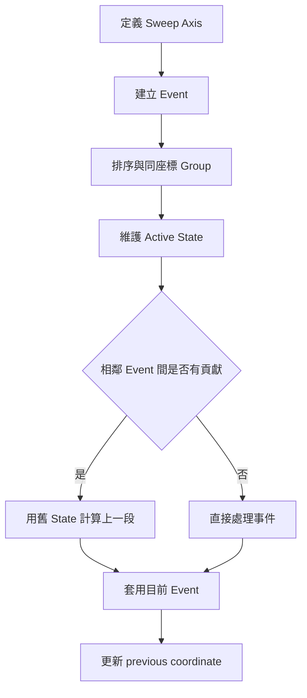

#### 適用讀者

- 面對大量 Interval Overlap，不確定該如何排序事件的讀者。
- 容易在相同座標的 Start、End Event 上產生差一錯誤的讀者。
- 想把巨大座標用 Fenwick Tree 或 Segment Tree 處理的讀者。
- Compression 後誤把 Index 差當成實際長度的讀者。
- 需要計算 Union Length、Maximum Overlap 或 Rectangle Area 的讀者。
- 想理解 Line Sweep、Difference Array 與 Event Sorting 關係的讀者。

#### 快速導覽

- [49.1 Line Sweep 到底做什麼](#491-line-sweep-到底做什麼)
- [49.2 第一步：定義 Sweep Axis 與 Event](#492-第一步定義-sweep-axis-與-event)
- [49.3 Interval 與同座標事件](#493-interval-與同座標事件)
- [49.4 完整案例：最大重疊數量](#494-完整案例最大重疊數量)
- [49.5 完整案例：Interval Union Length](#495-完整案例interval-union-length)
- [49.6 Difference Event](#496-difference-event)
- [49.7 Coordinate Compression](#497-coordinate-compression)
- [49.8 完整案例：壓縮巨大座標](#498-完整案例壓縮巨大座標)
- [49.9 點 Compression 與區段 Compression](#499-點-compression-與區段-compression)
- [49.10 Line Sweep 搭配 Fenwick Tree](#4910-line-sweep-搭配-fenwick-tree)
- [49.11 Line Sweep 搭配 Segment Tree](#4911-line-sweep-搭配-segment-tree)
- [49.12 Rectangle Union Area](#4912-rectangle-union-area)
- [49.13 常見題型](#4913-常見題型)
- [49.14 正確性與複雜度](#4914-正確性與複雜度)
- [49.15 C 語言中的實作](#4915-c-語言中的實作)
- [49.16 系統化 Debug](#4916-系統化-debug)
- [49.17 常見問題與判讀](#4917-常見問題與判讀)
- [49.18 本章檢查表](#4918-本章檢查表)
- [49.19 本章重點](#4919-本章重點)

#### 49.1 Line Sweep 到底做什麼

Line Sweep 將問題中的關鍵變化點轉成 Event，再依座標排序。Sweep 由左往右經過 Event，維護目前有效的 Interval、物件或統計 State。原始章節也指出，在兩個相鄰 Event 座標之間，若沒有其他 Event，Active State 不會改變，因此不需要逐一處理巨大座標範圍中的每個位置。citeturn41search1

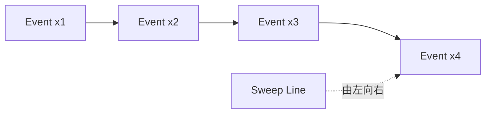

常見 State：

- Active Interval 數量。
- 目前覆蓋長度。
- 目前最高或最低值。
- 另一個維度上的 Active Set。
- Fenwick Tree 或 Segment Tree 中的統計摘要。

##### Line Sweep 適合什麼問題

<table>
<tr><th>題目特徵</th><th>可考慮 Sweep 的原因</th></tr>
<tr><td>Interval 開始與結束</td><td>只有端點會改變 Active State</td></tr>
<tr><td>時間軸上的事件</td><td>依時間排序處理狀態改變</td></tr>
<tr><td>二維矩形覆蓋</td><td>掃 x，維護 y 方向覆蓋</td></tr>
<tr><td>離線 Query</td><td>將 Update 與 Query 依座標排序</td></tr>
<tr><td>巨大稀疏座標</td><td>只處理出現過的座標或壓縮後 Index</td></tr>
</table>

#### 49.2 第一步：定義 Sweep Axis 與 Event

一維 Interval `[left, right)` 可產生兩個 Event：

```text
(left, +1)   區間開始
(right, -1)  區間結束
```

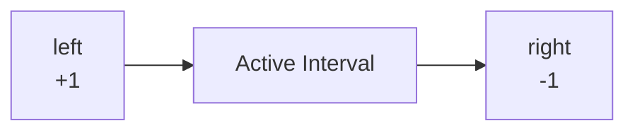

典型 Event 結構：

```cpp
struct Event
{
    long long coordinate;
    int delta;
};
```

複雜問題可能還需要：

- Event Type。
- 另一維區間。
- Query ID。
- Weight。
- 原始 Index。

Event 欄位應足以更新 Sweep State，不能只保存座標而遺失事件語意。原始章節也有相同提醒。citeturn41search1

##### 定義 Event 的檢查表

- Sweep Axis 是 x、y、時間，還是其他排序 Key？
- Event 代表開始、結束、查詢、加入、移除，還是狀態改變？
- Event 是否需要保存原始 Index 或 Query ID？
- 同座標 Event 是否需要 Group？
- Event 排序是否與題目語意一致？

#### 49.3 Interval 與同座標事件

本章主要使用 Half-open Interval `[left, right)`。

相接區間：

```text
[1, 3) 和 [3, 5)
```

在座標 3 沒有共同覆蓋正長度。

若只求 Maximum Active Count，可將同座標所有 Delta 先合併，再更新 Active。這可避免 Start、End 的任意排序影響結果。原始章節也建議優先使用 Half-open Interval、對同座標同類更新先 Group，並文件化不同 Event Type 的排序順序。citeturn41search1

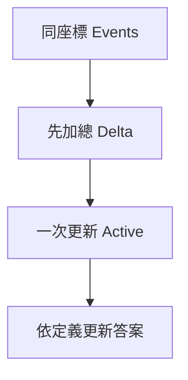

##### Half-open 與 Closed Interval

<table>
<tr><th>語意</th><th>相接端點是否重疊</th><th>例子</th></tr>
<tr><td>`[left, right)`</td><td>否</td><td>`[1,3)` 與 `[3,5)` 不重疊</td></tr>
<tr><td>`[left, right]`</td><td>是</td><td>`[1,3]` 與 `[3,5]` 在 3 重疊</td></tr>
</table>

若題目是 Closed Interval，Start、Query、End 的 Tie-breaking 需依題目語意重新推導，不能直接套 Half-open 的事件順序。

##### 同座標事件的常見處理

<table>
<tr><th>需求</th><th>建議處理</th></tr>
<tr><td>只算 Active Count</td><td>同座標 delta 加總後一次更新</td></tr>
<tr><td>有 Query 且 Closed Interval</td><td>明確定義 Start、Query、End 順序</td></tr>
<tr><td>同 x 的點不應互相影響</td><td>同 x 先全部 Query，再一起 Update</td></tr>
<tr><td>Rectangle Area</td><td>先用上一段 x 差計算面積，再處理目前 x Event</td></tr>
</table>

#### 49.4 完整案例：最大重疊數量

##### 問題規格

給定多個 Half-open Interval `[left, right)`，求任意位置同時被多少個 Interval 覆蓋的最大值。零長度 Interval 不產生覆蓋。

```cpp
#include <algorithm>
#include <utility>
#include <vector>

int maximumOverlap(
    const std::vector<std::pair<long long, long long>>& intervals)
{
    std::vector<std::pair<long long, int>> events;

    for (const auto& [left, right] : intervals)
    {
        if (left >= right)
        {
            continue;
        }

        events.push_back({left, +1});
        events.push_back({right, -1});
    }

    std::sort(events.begin(), events.end());

    int active = 0;
    int answer = 0;

    for (std::size_t i = 0; i < events.size(); )
    {
        const long long coordinate = events[i].first;
        int delta = 0;

        while (i < events.size() &&
               events[i].first == coordinate)
        {
            delta += events[i].second;
            ++i;
        }

        active += delta;
        answer = std::max(answer, active);
    }

    return answer;
}
```

##### Sweep Invariant

處理完座標 x 的所有 Event 後：

```text
active 等於在 x 右側緊鄰區段上有效的 Interval 數量。
```

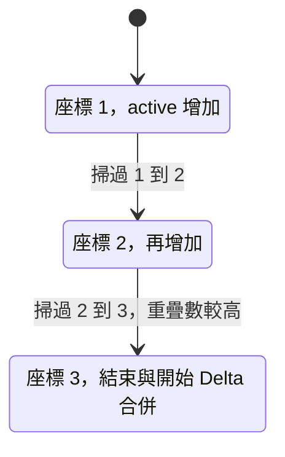

##### 複雜度

- 建立 Event：O(n)。
- 排序：O(n log n)。
- Sweep：O(n)。
- 總時間：O(n log n)。
- 額外空間：O(n)。

#### 49.5 完整案例：Interval Union Length

##### 問題規格

求多個 Half-open Interval 聯集的總長度。

```cpp
#include <algorithm>
#include <utility>
#include <vector>

long long intervalUnionLength(
    const std::vector<std::pair<long long, long long>>& intervals)
{
    std::vector<std::pair<long long, int>> events;

    for (const auto& [left, right] : intervals)
    {
        if (left >= right)
        {
            continue;
        }

        events.push_back({left, +1});
        events.push_back({right, -1});
    }

    std::sort(events.begin(), events.end());

    long long answer = 0;
    long long previous = 0;
    int active = 0;
    std::size_t i = 0;

    while (i < events.size())
    {
        const long long coordinate = events[i].first;

        if (active > 0)
        {
            answer += coordinate - previous;
        }

        int delta = 0;

        while (i < events.size() &&
               events[i].first == coordinate)
        {
            delta += events[i].second;
            ++i;
        }

        active += delta;
        previous = coordinate;
    }

    return answer;
}
```

##### 更新順序

到達目前 coordinate 時，`[previous, coordinate)` 的覆蓋狀態仍由舊 `active` 決定。因此：

1. 先累加上一段長度。
2. 再處理目前座標 Event。
3. 更新 `previous`。

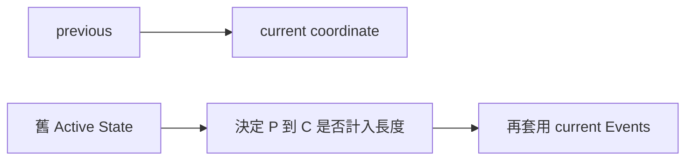

若先更新 Active 再計算上一段，會把目前座標的變化錯誤套用到前一段。原始章節也明確指出 Union Length 需要先用舊 Active State 計算上一段，再套用目前事件。citeturn41search1

#### 49.6 Difference Event

Line Sweep 的一維 Count Event 和 Difference Array 具有相同精神：

```text
left 位置 +delta
right 位置 -delta
```

若座標範圍小且連續，可直接用 Difference Array；若座標很大或稀疏，可排序 Event 或先 Coordinate Compression。原始章節也用同樣流程區分 Difference Array 與 Event Sorting / Compression。citeturn41search1

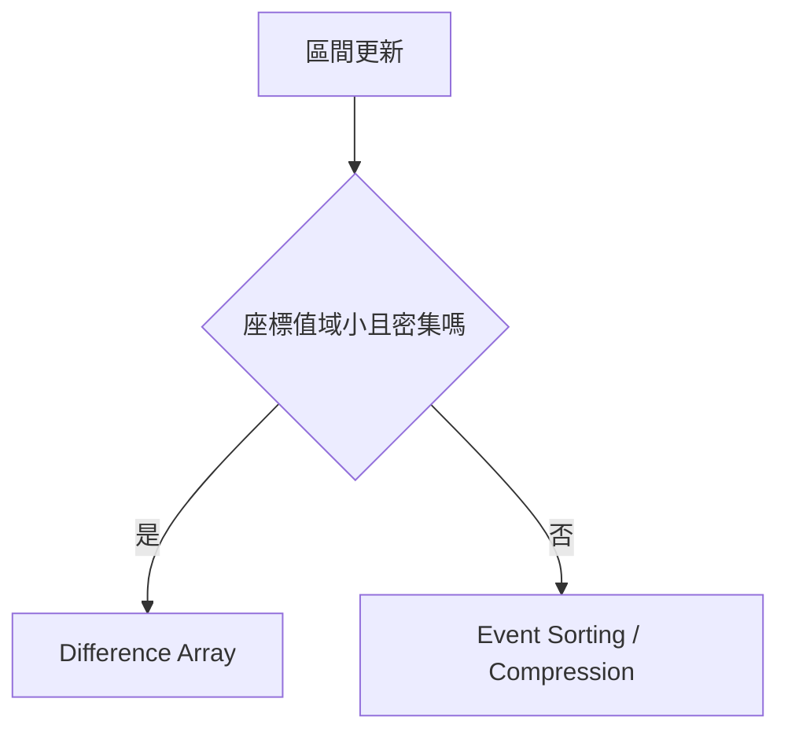

##### Difference Array 適合

- 座標是 `0..n-1`。
- n 不大。
- 多次 Range Add。
- 最後才需要還原全部值。

##### Event Sorting 適合

- 座標巨大。
- 座標只出現少量端點。
- 只需要處理變化點。
- 可離線排序 Event。

#### 49.7 Coordinate Compression

Coordinate Compression 保留原始值的：

- 相等關係。
- 小於與大於順序。

流程：

1. 收集所有需要的座標。
2. 排序。
3. 去除重複。
4. 以 Lower Bound 找壓縮 Index。

```cpp
#include <algorithm>
#include <vector>

std::vector<long long> compressCoordinates(
    std::vector<long long> coordinates)
{
    std::sort(coordinates.begin(), coordinates.end());
    coordinates.erase(
        std::unique(coordinates.begin(), coordinates.end()),
        coordinates.end());

    return coordinates;
}

int compressedIndex(
    const std::vector<long long>& coordinates,
    long long value)
{
    return static_cast<int>(
        std::lower_bound(
            coordinates.begin(),
            coordinates.end(),
            value)
        - coordinates.begin());
}
```

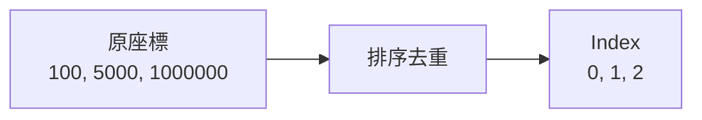

Compression 不代表原始距離相同。5000 與 1000000 在壓縮後只差 1 個 Index，但實際長度差為 995000。原始章節也特別提醒，Compression 保留順序，不保留距離。citeturn41search1

#### 49.8 完整案例：壓縮巨大座標

假設需對巨大座標上的點做 Count Update 與 Prefix Query：

```text
Update coordinate x
Query 有多少 Update coordinate <= q
```

先收集所有 Update 與 Query 相關座標，Compression 後使用 Fenwick Tree。原始章節也提醒，若 Query Coordinate 不一定在 Compression Array 中，可使用 `upper_bound` 找不大於 q 的座標數量，而不是要求 q 必須正好存在。citeturn41search1

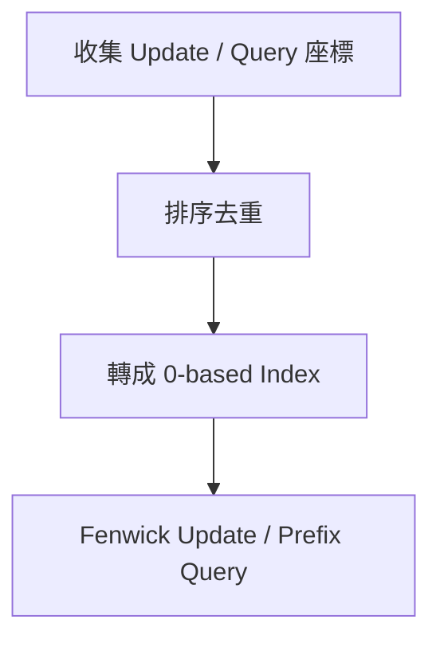

##### Query 不在壓縮座標中

若要回答 `<= q` 的數量：

```cpp
int countLessOrEqualIndex(
    const std::vector<long long>& coordinates,
    long long q)
{
    return static_cast<int>(
        std::upper_bound(
            coordinates.begin(),
            coordinates.end(),
            q)
        - coordinates.begin()) - 1;
}
```

如果回傳 -1，表示沒有任何壓縮座標 `<= q`。

##### 離線收集注意

若所有 Query 已知，最簡單是把 Update 與 Query 需要的座標都先收集。若 Query 是線上輸入且不可預先得知，就不一定能做完整 Compression，可能要改用 Ordered Map、Dynamic Segment Tree 或其他結構。

#### 49.9 點 Compression 與區段 Compression

##### 點 Compression

只關心座標點的相對順序，例如：

- Rank。
- Count。
- Inversion Count。
- Point Update / Prefix Query。

這時壓縮後 Index 可代表一個點。

##### 區段 Compression

若要計算 Length、Area 或覆蓋區段，需要保留相鄰原始座標差：

```text
segment i 代表 [coordinate[i], coordinate[i + 1])
length = coordinate[i + 1] - coordinate[i]
```

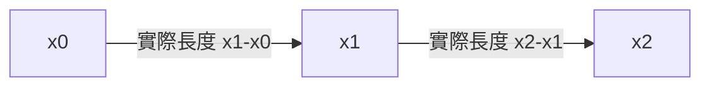

Segment Tree Leaf 可以代表壓縮後的一段，而不是單一座標點。若有 m 個唯一坐標，區段數通常為 m - 1。原始章節也強調，點數與區段數不可混淆。citeturn41search1

#### 49.10 Line Sweep 搭配 Fenwick Tree

典型二維 Point 題：依 x 排序 Sweep，Fenwick Tree 維護已處理點的 y Frequency。

例如計算每個點左下方點數：

1. 依 x 排序。
2. Compression 所有 y。
3. Query y 以下 Prefix Count。
4. 將目前點的 y 加入 Fenwick Tree。

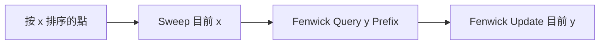

相同 x 的點若不應互相計入，需先對整組同 x 點完成 Query，再一起 Update。這是 Tie-breaking 的另一種形式。原始章節也有相同提醒。citeturn41search1

##### 同 x Group 模式

```text
for each group with same x:
    first answer all queries using current Fenwick
    then update all points in this group
```

這樣可避免同 x 的點互相影響。

#### 49.11 Line Sweep 搭配 Segment Tree

若 Sweep 過程要維護另一維的：

- 覆蓋長度。
- Maximum Count。
- Range Add 與全域摘要。

可將另一維座標壓縮後交給 Lazy Segment Tree。

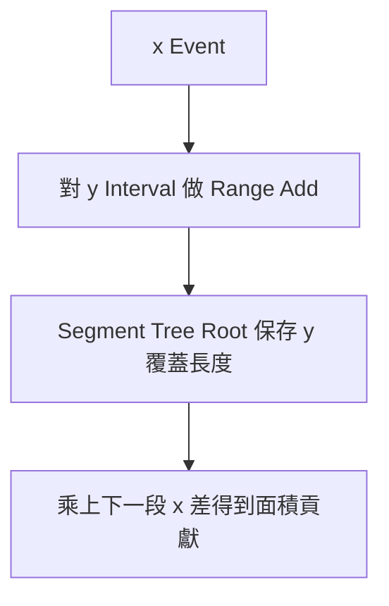

Node State 必須知道區段實際座標長度，而不是只知道壓縮 Index 數量。原始章節也特別指出，Rectangle Area 或覆蓋長度需要使用原始座標差。citeturn41search1

##### Segment Tree 常見 State

<table>
<tr><th>欄位</th><th>語意</th></tr>
<tr><td>coverCount</td><td>目前這段被完整覆蓋的次數</td></tr>
<tr><td>coveredLength</td><td>目前這段實際被覆蓋的 y 長度</td></tr>
<tr><td>left, right</td><td>壓縮區段範圍</td></tr>
</table>

若 `coverCount > 0`，整段覆蓋長度是原始座標差。若 `coverCount == 0`，覆蓋長度由子節點合併。

#### 49.12 Rectangle Union Area

每個 Rectangle `[x1, x2) × [y1, y2)` 產生兩個 x Event：

```text
(x1, y1, y2, +1)
(x2, y1, y2, -1)
```

Sweep x，Segment Tree 維護目前 y 聯集長度：

```text
area += coveredYLength * (currentX - previousX)
```

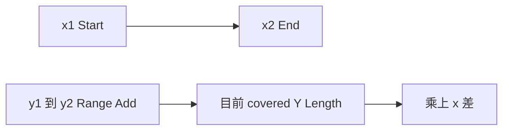

為避免 Overflow，Area 通常使用 64-bit，且乘法前就應轉成足夠寬型別。原始章節也有相同提醒。citeturn41search1

##### Rectangle Area 的固定順序

1. 將所有 Rectangle 轉成 x Event。
2. 收集所有 y1、y2，做區段 Compression。
3. 依 x 排序 Event。
4. 到達 currentX 時，先用舊的 coveredYLength 乘上 x 差。
5. 再套用 currentX 的所有 y Range Add。
6. 更新 previousX。

##### 常見錯誤

- 用 y Index 數量當作 y 長度。
- m 個 y 座標建成 m 個葉節點，而非 m - 1 個區段。
- 先更新 x Event 再算上一段面積。
- 沒有忽略零寬或零高 Rectangle。

#### 49.13 常見題型

原始章節列出常見題型，包括 Meeting Room Maximum Overlap、Interval Union Length、Calendar Event Count、Skyline、Rectangle Union Area、Inversion Count、二維 Dominance Count、Offline Range Query、最近點或交叉事件的幾何 Sweep。citeturn41search1

<table>
<tr><th>題型</th><th>常見 State / 工具</th></tr>
<tr><td>Meeting Room Maximum Overlap</td><td>Event + active count</td></tr>
<tr><td>Interval Union Length</td><td>Event + active count + previous coordinate</td></tr>
<tr><td>Calendar Event Count</td><td>Difference Event / Ordered Map</td></tr>
<tr><td>Skyline</td><td>Sweep + Multiset / Heap</td></tr>
<tr><td>Rectangle Union Area</td><td>x Sweep + y Segment Tree</td></tr>
<tr><td>Inversion Count</td><td>Coordinate Compression + Fenwick Tree</td></tr>
<tr><td>二維 Dominance Count</td><td>x Sweep + y Fenwick Tree</td></tr>
<tr><td>Offline Range Query</td><td>排序 Query + Fenwick / Segment Tree</td></tr>
</table>

不同題型的 Active Set、Tie-breaking 與第二維資料結構不同，不能只記住 Start +1、End -1。原始章節也有相同提醒。citeturn41search1

#### 49.14 正確性與複雜度

##### Sweep Invariant

處理完所有座標小於 x 的 Event 後，資料結構正確表示 Sweep Line 位於下一事件前的 Active State。

##### 為何只需 Event 座標

相鄰 Event 之間沒有狀態變化，整段貢獻可一次計算。

##### 常見複雜度

- 建立 2n 個 Event：O(n)。
- Event Sorting：O(n log n)。
- 線性 Sweep：O(n)。
- 每個 Event 搭配 Fenwick / Segment Tree：O(log n)。
- 總時間常為 O(n log n)。
- Compression 空間 O(n)。

二維 Rectangle Union Area 仍常為 O(n log n)，但 State 與實作常數較大。原始章節也列出相同複雜度方向。citeturn41search1

#### 49.15 C 語言中的實作

C 可用 `qsort` 排序 Event。

```c
struct Event
{
    long long coordinate;
    int delta;
};

int compare_event(const void* left, const void* right)
{
    const struct Event* a = (const struct Event*)left;
    const struct Event* b = (const struct Event*)right;

    if (a->coordinate < b->coordinate)
    {
        return -1;
    }

    if (a->coordinate > b->coordinate)
    {
        return 1;
    }

    return 0;
}
```

Comparator 不應使用：

```c
return (int)(a->coordinate - b->coordinate);
```

因為差值可能 Overflow 或截斷。原始章節也明確提醒 C comparator 不應用差值回傳 int。citeturn41search1

Compression 在 C 中需要自行配置座標 Array、排序、去重，並處理 Size 計算與配置失敗。

#### 49.16 系統化 Debug

逐輪記錄：

```text
Event Coordinate
Event Type / Delta
同座標 Group
previous Coordinate
State 更新前
上一段貢獻
State 更新後
Compression Index
原始座標差
```

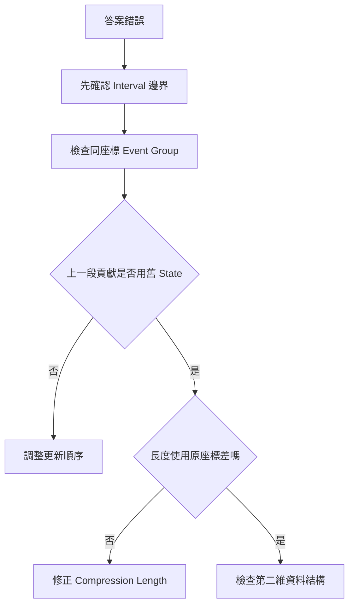

重要測試：

- 空 Interval 集合。
- 單一 Interval。
- 零長度 Interval。
- 完全重疊。
- 完全不重疊。
- 只在端點相接。
- 多個 Event 同座標。
- 負座標。
- 極大座標與極大面積。
- 重複點與重複 Rectangle。

原始章節也列出了相同的 Debug 記錄欄位與重要測試。citeturn41search1

#### 49.17 常見問題與判讀

<table>
<tr><th>現象</th><th>可能原因</th><th>第一輪檢查</th></tr>
<tr><td>相接 Interval 被算成重疊</td><td>Closed 與 Half-open 混用</td><td>統一 `[left, right)`</td></tr>
<tr><td>Union Length 差一段</td><td>先更新 Event 才算上一段</td><td>先用舊 Active 算距離</td></tr>
<tr><td>同座標結果不穩定</td><td>Tie-breaking 未定義</td><td>Group Event 或明確排序</td></tr>
<tr><td>Compression 後長度錯誤</td><td>使用 Index 差</td><td>使用原座標差</td></tr>
<tr><td>相同 x 的點互相計入</td><td>Query 後立即逐點 Update</td><td>同 x 先全部 Query 再 Update</td></tr>
<tr><td>Rectangle Area Overflow</td><td>乘法使用窄型別</td><td>使用 64-bit 並先轉型</td></tr>
<tr><td>Segment Tree Leaf 數錯誤</td><td>Point 數與 Segment 數混淆</td><td>m 個點形成 m - 1 段</td></tr>
<tr><td>Comparator 排序錯誤</td><td>用差值回傳 int</td><td>使用明確小於、大於比較</td></tr>
<tr><td>重複座標 Mapping 不一致</td><td>未排序去重</td><td>建立唯一坐標陣列</td></tr>
</table>

這些現象也出現在原始章節的常見問題表中，尤其是 Half-open / Closed 混用、Union Length 更新順序、Compression 使用原座標差、同 x Group、Rectangle Area Overflow 與 Segment 數混淆。citeturn41search1

#### 49.18 本章檢查表

- 我能定義 Sweep Axis 與每種 Event。
- 我一致使用 Half-open 或明確的 Closed Interval。
- 我能說明同座標 Event 的處理順序。
- 我知道上一段貢獻由更新前 State 決定。
- 我能使用 Event 計算 Maximum Overlap 與 Union Length。
- 我能完成排序、去重與 Lower Bound Compression。
- 我知道 Compression 保留順序，不保留距離。
- 我會使用原始座標差計算 Length 與 Area。
- 我能區分點 Compression 與區段 Compression。
- 我知道同 x Group 何時需要延後 Update。
- 我能將 Fenwick Tree 或 Segment Tree 加入 Sweep。
- 我會檢查 Comparator、Overflow、零長度與重複 Event。

原始章節也包含這些檢查項目，特別是 Sweep Axis、Event、Half-open / Closed、同座標事件、上一段貢獻、Compression 與原始座標差。citeturn41search1

#### 49.19 本章重點

- Line Sweep 將問題轉成依座標排序的 Event，並在相鄰 Event 之間維護不變 State。
- Event 與 Tie-breaking 必須由 Interval 和 Query 語意推導。
- Half-open Interval 能自然處理相接端點與零長度區間。
- Union Length 必須先用舊 Active State 計算上一段，再套用目前 Event。
- Coordinate Compression 保留相等與順序關係，但不保留實際距離。
- 計算 Length 或 Area 時要使用原始座標差。
- 點 Count 常搭配 Fenwick Tree，Range Cover 常搭配 Lazy Segment Tree。
- 相同 Sweep Coordinate 的 Query、Update 常需要 Group 處理。
- Event Sorting、Compression 與 Tree Update 的組合通常形成 O(n log n) 解法。
