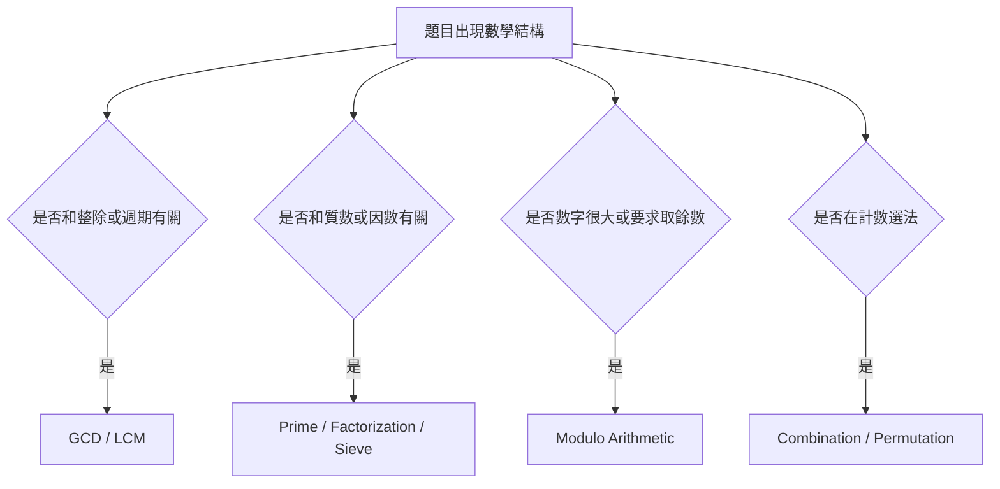
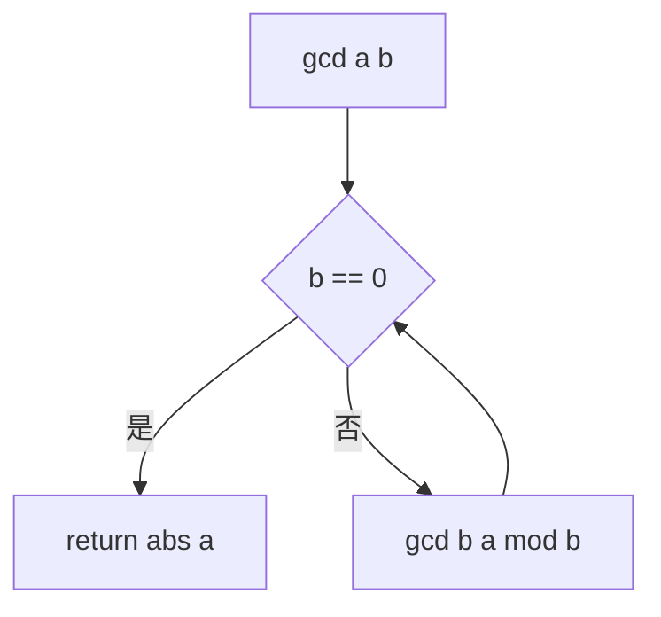
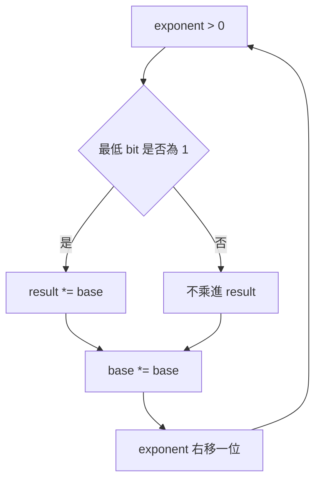

## 第 50 章　演算法常用數學

### 適用範圍

本章整理演算法題中最常用的數學工具，包括數論基礎、GCD / LCM、質數、模運算與組合數學。原始章節目前是骨架，包含數論基礎、GCD / LCM、質數、模運算、組合數學與重點整理。本版會補上定義、推導、C++ 實作、常見錯誤與測試方式。citeturn40search1

演算法中的數學不是為了寫複雜公式，而是用來回答：

- 某個條件是否可整除？
- 兩個數是否有共同週期？
- 如何快速判斷質數？
- 如何避免數字過大？
- 如何計算排列、組合與計數？
- 如何在 Modulo 下做加法、乘法、除法？



### 適用讀者

- 會寫基本 C++，但不熟悉數論與組合公式的讀者。
- 常在 GCD、LCM、Modulo、Overflow 上出錯的讀者。
- 想理解 Euclidean Algorithm、Sieve、Fast Power 的讀者。
- 想在題目中判斷何時需要質因數分解、模反元素或組合數的讀者。

### 快速導覽

- [50.1 數學題先分析什麼](#501-數學題先分析什麼)
- [50.2 整除、因數與倍數](#502-整除因數與倍數)
- [50.3 GCD](#503-gcd)
- [50.4 LCM](#504-lcm)
- [50.5 Euclidean Algorithm](#505-euclidean-algorithm)
- [50.6 質數判斷](#506-質數判斷)
- [50.7 Sieve of Eratosthenes](#507-sieve-of-eratosthenes)
- [50.8 Prime Factorization](#508-prime-factorization)
- [50.9 模運算基礎](#509-模運算基礎)
- [50.10 Fast Power](#5010-fast-power)
- [50.11 Modular Inverse](#5011-modular-inverse)
- [50.12 組合數學](#5012-組合數學)
- [50.13 Combination under Modulo](#5013-combination-under-modulo)
- [50.14 常見數學模型](#5014-常見數學模型)
- [50.15 常見錯誤與判讀](#5015-常見錯誤與判讀)
- [50.16 本章檢查表](#5016-本章檢查表)
- [50.17 本章重點](#5017-本章重點)

### 50.1 數學題先分析什麼

遇到數學題，不要先背公式。先把題目轉成幾個問題：

<table>
<tr><th>問題</th><th>可能工具</th></tr>
<tr><td>是否問共同週期、同步時間、最大共同單位？</td><td>GCD、LCM</td></tr>
<tr><td>是否問能否整除、是否存在因數？</td><td>Divisibility、Factorization</td></tr>
<tr><td>是否問質數、質因數或多次質數查詢？</td><td>Prime Test、Sieve</td></tr>
<tr><td>是否數字很大，答案需取 mod？</td><td>Modulo Arithmetic、Fast Power</td></tr>
<tr><td>是否問選幾個、排列幾種、路徑幾條？</td><td>Combination、Permutation、DP Counting</td></tr>
<tr><td>是否需要除法但在 mod 下？</td><td>Modular Inverse</td></tr>
</table>

同時要先估算數值範圍：

- 單一輸入是否放得進 `int`？
- 中間乘法是否需要 `long long`？
- 組合數是否非常大？
- Modulo 是否為質數？
- 除法是否能在 mod 下合法處理？

### 50.2 整除、因數與倍數

若整數 `a` 能被 `b` 整除，表示存在整數 `k`：

```text
a = b * k
```

也可寫成：

```text
a % b == 0
```

前提是 `b != 0`。

#### 因數與倍數

- 若 `b` 整除 `a`，則 `b` 是 `a` 的因數。
- `a` 是 `b` 的倍數。

例如：

```text
12 = 3 * 4
```

因此 3 與 4 都是 12 的因數，12 是 3 與 4 的倍數。

#### 常見應用

- 判斷週期是否同步。
- 判斷能否平均分配。
- 找矩形面積的可能邊長。
- 判斷數字是否有某種結構。
- Prime Factorization。

#### C++ 注意

```cpp
if (b != 0 && a % b == 0)
{
    // b divides a
}
```

不要對 0 取餘數。

### 50.3 GCD

GCD 是 Greatest Common Divisor，最大公因數。

```text
gcd(a, b) = 同時整除 a 與 b 的最大正整數
```

例如：

```text
gcd(12, 18) = 6
```

因為 6 是 12 與 18 的共同因數，而且是最大的。

#### 常見用途

- 化簡分數。
- 判斷兩個數是否互質。
- 計算 LCM。
- 解決共同週期、分組、網格步長問題。
- 幾何中判斷線段上的整點數量。

#### 互質

若：

```text
gcd(a, b) = 1
```

則 a 與 b 互質。

#### C++ 標準函式

```cpp
#include <numeric>

int g = std::gcd(a, b);
```

若處理負數，`std::gcd` 會回傳非負結果。仍建議在題目語意上先確認是否應使用絕對值。

### 50.4 LCM

LCM 是 Least Common Multiple，最小公倍數。

```text
lcm(a, b) = 同時為 a 與 b 倍數的最小正整數
```

例如：

```text
lcm(12, 18) = 36
```

#### 公式

```text
lcm(a, b) = abs(a / gcd(a, b) * b)
```

不要寫成：

```text
abs(a * b) / gcd(a, b)
```

因為 `a * b` 可能先 Overflow。

#### C++ 寫法

```cpp
#include <cstdlib>
#include <numeric>

long long safeLcm(long long a, long long b)
{
    if (a == 0 || b == 0)
    {
        return 0;
    }

    return std::llabs(a / std::gcd(a, b) * b);
}
```

#### 常見用途

- 週期同步。
- 多個事件再次同時發生的時間。
- 分母通分。
- 循環狀態的共同週期。

### 50.5 Euclidean Algorithm

Euclidean Algorithm 用來快速計算 GCD。

核心性質：

```text
gcd(a, b) = gcd(b, a % b)
```

直到 `b == 0`：

```text
gcd(a, 0) = abs(a)
```



#### 遞迴版本

```cpp
#include <cstdlib>

long long gcdRecursive(long long a, long long b)
{
    if (b == 0)
    {
        return std::llabs(a);
    }

    return gcdRecursive(b, a % b);
}
```

#### 迭代版本

```cpp
#include <cstdlib>

long long gcdIterative(long long a, long long b)
{
    a = std::llabs(a);
    b = std::llabs(b);

    while (b != 0)
    {
        long long remainder = a % b;
        a = b;
        b = remainder;
    }

    return a;
}
```

#### 複雜度

Euclidean Algorithm 的時間複雜度通常寫作：

```text
O(log min(a, b))
```

它比枚舉所有因數快很多。

### 50.6 質數判斷

質數是大於 1，且只有 1 與自己兩個正因數的整數。

```text
2, 3, 5, 7, 11, 13, ...
```

1 不是質數。

#### 試除法

若 `n` 有一個大於 `sqrt(n)` 的因數，必然也有一個小於 `sqrt(n)` 的配對因數。因此只需檢查到 `sqrt(n)`。

```cpp
bool isPrime(long long n)
{
    if (n < 2)
    {
        return false;
    }

    if (n == 2)
    {
        return true;
    }

    if (n % 2 == 0)
    {
        return false;
    }

    for (long long d = 3; d <= n / d; d += 2)
    {
        if (n % d == 0)
        {
            return false;
        }
    }

    return true;
}
```

#### 複雜度

試除法為：

```text
O(sqrt(n))
```

若只判斷少量數字，通常足夠。若要判斷大量 `1..N` 的質數，考慮 Sieve。

### 50.7 Sieve of Eratosthenes

Sieve of Eratosthenes 用來預先找出 `1..N` 中所有質數。

#### 核心想法

- 先假設每個數都是質數。
- 從 2 開始，若 p 是質數，就把 p 的倍數標記為合數。
- 從 `p * p` 開始標記，因為更小的倍數已被更小質數處理過。

```cpp
#include <vector>

std::vector<bool> buildPrimeTable(int n)
{
    std::vector<bool> isPrime(n + 1, true);

    if (n >= 0)
    {
        isPrime[0] = false;
    }

    if (n >= 1)
    {
        isPrime[1] = false;
    }

    for (int p = 2; p <= n / p; ++p)
    {
        if (!isPrime[p])
        {
            continue;
        }

        for (int multiple = p * p; multiple <= n; multiple += p)
        {
            isPrime[multiple] = false;
        }
    }

    return isPrime;
}
```

#### 複雜度

常見時間複雜度：

```text
O(n log log n)
```

空間：

```text
O(n)
```

#### 使用情境

- 多次查詢某數是否為質數。
- 需要列出一段範圍內全部質數。
- 需要用質數做因數分解。

### 50.8 Prime Factorization

Prime Factorization 是把一個整數拆成質數乘積。

例如：

```text
60 = 2^2 * 3 * 5
```

#### 試除法分解

```cpp
#include <utility>
#include <vector>

std::vector<std::pair<long long, int>> factorize(long long n)
{
    std::vector<std::pair<long long, int>> factors;

    for (long long p = 2; p <= n / p; ++p)
    {
        if (n % p != 0)
        {
            continue;
        }

        int exponent = 0;

        while (n % p == 0)
        {
            n /= p;
            ++exponent;
        }

        factors.push_back({p, exponent});
    }

    if (n > 1)
    {
        factors.push_back({n, 1});
    }

    return factors;
}
```

#### 因數個數公式

若：

```text
n = p1^a1 * p2^a2 * ... * pk^ak
```

則正因數個數為：

```text
(a1 + 1) * (a2 + 1) * ... * (ak + 1)
```

因為每個質因數可以選 0 到 ai 次。

### 50.9 模運算基礎

Modulo 表示取餘數。

```text
a mod m
```

在 C++ 中：

```cpp
int r = a % m;
```

前提是 `m != 0`。

#### 基本性質

```text
(a + b) mod m = ((a mod m) + (b mod m)) mod m
(a - b) mod m = ((a mod m) - (b mod m)) mod m
(a * b) mod m = ((a mod m) * (b mod m)) mod m
```

#### 負數正規化

C++ 中負數 `%` 的結果可能為負。若需要結果落在 `[0, m)`，可寫：

```cpp
long long normalizeModulo(long long value, long long mod)
{
    return ((value % mod) + mod) % mod;
}
```

前提是 `mod > 0`。

#### 乘法 Overflow

```cpp
long long result = (a * b) % mod;
```

如果 a、b 很大，可能先 Overflow。一般 int 範圍可以先轉：

```cpp
long long result = (1LL * a * b) % mod;
```

若 a、b 接近 64-bit 上限，可能需要更寬中間型別或專門技巧。

### 50.10 Fast Power

Fast Power 又稱 Binary Exponentiation，用來快速計算：

```text
base^exponent mod m
```

核心想法是把 exponent 看成 Binary。每次平方 base，若目前 bit 是 1，就乘進答案。



```cpp
long long modPow(long long base, long long exponent, long long mod)
{
    base = normalizeModulo(base, mod);
    long long result = 1 % mod;

    while (exponent > 0)
    {
        if (exponent & 1LL)
        {
            result = result * base % mod;
        }

        base = base * base % mod;
        exponent >>= 1LL;
    }

    return result;
}
```

#### 複雜度

```text
O(log exponent)
```

#### 注意

- `mod` 必須大於 0。
- 若 `base * base` 可能超過 `long long`，需改用更安全的乘法。
- `0^0` 的定義依問題規格決定。

### 50.11 Modular Inverse

Modulo 下的除法不能直接寫：

```text
a / b mod m
```

需要乘上 b 的 Modular Inverse。

```text
a / b mod m = a * inv(b) mod m
```

其中 `inv(b)` 滿足：

```text
b * inv(b) ≡ 1 (mod m)
```

#### 何時存在 Inverse

b 在 mod m 下有乘法反元素，當且僅當：

```text
gcd(b, m) = 1
```

#### Fermat's Little Theorem

若 m 是質數，且 b 不是 m 的倍數：

```text
b^(m-1) ≡ 1 (mod m)
```

因此：

```text
inv(b) = b^(m-2) mod m
```

C++：

```cpp
long long modInversePrime(long long value, long long mod)
{
    return modPow(value, mod - 2, mod);
}
```

前提：

- mod 是質數。
- value 與 mod 互質。

#### 常見錯誤

- 在 mod 下直接做整數除法。
- mod 不是質數卻使用 Fermat。
- denominator 和 mod 不互質。
- denominator 為 0。

### 50.12 組合數學

組合數學常用於計算選法數量。

#### Factorial

```text
n! = 1 * 2 * 3 * ... * n
0! = 1
```

#### Permutation

從 n 個不同元素中選 k 個並排列：

```text
P(n, k) = n! / (n-k)!
```

順序不同算不同。

#### Combination

從 n 個不同元素中選 k 個，不考慮順序：

```text
C(n, k) = n! / (k! * (n-k)!)
```

也寫作：

```text
n choose k
```

#### 基本性質

```text
C(n, k) = C(n, n-k)
C(n, 0) = 1
C(n, n) = 1
C(n, k) = C(n-1, k-1) + C(n-1, k)
```

最後一條是 Pascal's Identity。

#### C++ 使用 long long 計算小範圍組合

```cpp
#include <algorithm>

long long combinationSmall(int n, int k)
{
    if (k < 0 || k > n)
    {
        return 0;
    }

    k = std::min(k, n - k);
    long long result = 1;

    for (int i = 1; i <= k; ++i)
    {
        result = result * (n - k + i) / i;
    }

    return result;
}
```

注意：這只適合答案能放進 `long long` 的情況。

### 50.13 Combination under Modulo

若答案很大，題目常要求：

```text
C(n, k) mod MOD
```

若 MOD 是質數，可預處理 factorial 與 inverse factorial。

#### 預處理

```cpp
#include <vector>

struct CombinationMod
{
    long long mod;
    std::vector<long long> factorial;
    std::vector<long long> inverseFactorial;

    CombinationMod(int maxN, long long modValue)
        : mod(modValue),
          factorial(maxN + 1, 1),
          inverseFactorial(maxN + 1, 1)
    {
        for (int i = 1; i <= maxN; ++i)
        {
            factorial[i] = factorial[i - 1] * i % mod;
        }

        inverseFactorial[maxN] = modPow(factorial[maxN], mod - 2, mod);

        for (int i = maxN; i >= 1; --i)
        {
            inverseFactorial[i - 1] = inverseFactorial[i] * i % mod;
        }
    }

    long long choose(int n, int k) const
    {
        if (k < 0 || k > n)
        {
            return 0;
        }

        return factorial[n] * inverseFactorial[k] % mod
             * inverseFactorial[n - k] % mod;
    }
};
```

#### 前置條件

- MOD 是質數。
- `0 <= n <= maxN`。
- 使用 Fermat Inverse 時，分母不能是 MOD 的倍數。

若 MOD 不是質數，需要其他方法，例如 Pascal DP、Extended GCD 或更進階的組合數方法，需依題目限制選擇。

### 50.14 常見數學模型

<table>
<tr><th>題目特徵</th><th>常見工具</th><th>檢查重點</th></tr>
<tr><td>共同週期</td><td>LCM</td><td>先用 GCD 避免乘法 Overflow</td></tr>
<tr><td>最大可切單位</td><td>GCD</td><td>是否允許 0 或負數</td></tr>
<tr><td>大量質數查詢</td><td>Sieve</td><td>N 的大小與記憶體</td></tr>
<tr><td>單次質數判斷</td><td>Trial Division</td><td>檢查到 sqrt(n)</td></tr>
<tr><td>大指數取模</td><td>Fast Power</td><td>乘法 Overflow</td></tr>
<tr><td>取模除法</td><td>Modular Inverse</td><td>是否互質，MOD 是否質數</td></tr>
<tr><td>選 k 個</td><td>Combination</td><td>順序是否重要</td></tr>
<tr><td>排列方案</td><td>Permutation</td><td>是否可重複、是否有相同元素</td></tr>
<tr><td>格子路徑數</td><td>Combination 或 DP</td><td>是否有障礙物</td></tr>
</table>

### 50.15 常見錯誤與判讀

<table>
<tr><th>現象</th><th>可能原因</th><th>第一輪檢查</th></tr>
<tr><td>LCM 結果變負或異常</td><td>`a * b` 先 Overflow</td><td>先除以 GCD 再乘</td></tr>
<tr><td>1 被判成質數</td><td>漏掉 `n < 2`</td><td>測試 0、1、2、3</td></tr>
<tr><td>質數判斷大數錯</td><td>`d * d` Overflow</td><td>改成 `d <= n / d`</td></tr>
<tr><td>Sieve 記憶體過高</td><td>N 太大</td><td>估算 O(N) 空間</td></tr>
<tr><td>Modulo 出現負數</td><td>未正規化</td><td>`((x % mod) + mod) % mod`</td></tr>
<tr><td>取模除法錯誤</td><td>直接做 `/` 或 inverse 不存在</td><td>檢查 gcd 與 MOD 是否質數</td></tr>
<tr><td>Combination 溢位</td><td>中間階乘太大</td><td>使用 Mod 或 DP</td></tr>
<tr><td>Fast Power 錯誤</td><td>忘記每步取 mod</td><td>乘法後立即 `% mod`</td></tr>
<tr><td>組合與排列混淆</td><td>順序是否重要未定義</td><td>先判斷不同順序是否算不同答案</td></tr>
</table>

### 50.16 本章檢查表

- 我知道題目是整除、質數、Modulo、組合，還是其他數學模型。
- 我會先估算中間結果是否會 Overflow。
- 我能使用 `std::gcd` 或 Euclidean Algorithm。
- 我知道 LCM 應先除以 GCD 再乘。
- 我知道 1 不是質數。
- 我能判斷何時用 Trial Division，何時用 Sieve。
- 我知道 C++ 負數 `%` 需要正規化。
- 我能使用 Fast Power 計算大指數取模。
- 我知道 Modulo 下除法需要 Modular Inverse。
- 我知道 Fermat Inverse 需要質數 mod 與互質條件。
- 我能區分 Permutation 與 Combination。
- 我知道 Combination under Modulo 的前置條件。

### 50.17 本章重點

- 數學工具應由題目模型選擇，不應直接背公式套用。
- GCD 用於共同因數，LCM 用於共同週期，且 LCM 需注意 Overflow。
- Euclidean Algorithm 可在 O(log min(a,b)) 時間計算 GCD。
- 質數判斷要先排除小於 2 的數，試除只需到 sqrt(n)。
- 大量質數查詢可用 Sieve of Eratosthenes。
- Modulo 加減乘可分別取模，但除法需要 Modular Inverse。
- Fast Power 可在 O(log exponent) 計算大指數取模。
- Combination 與 Permutation 的差異在於順序是否重要。
- 組合數在 Modulo 下常使用 factorial 與 inverse factorial，但需確認 MOD 是否為質數。
