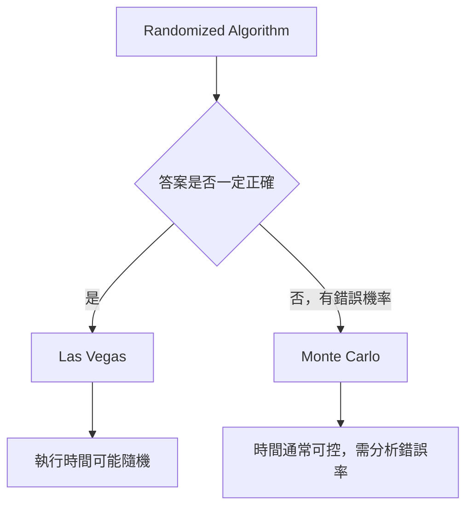
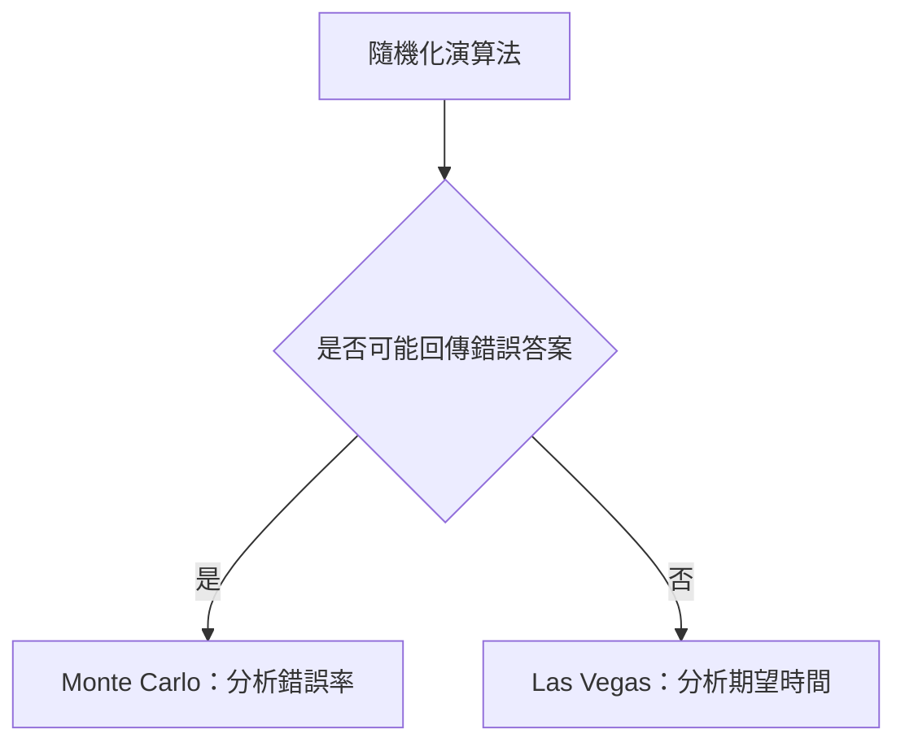
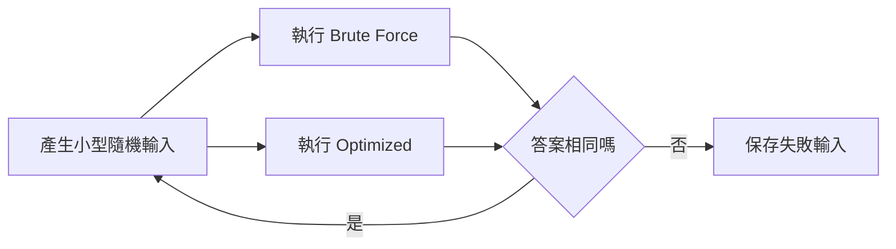

## 第 51 章　Probability 與 Randomized Algorithm

### 適用範圍

本章說明演算法中常見的機率觀念與隨機化演算法。原始章節目前只有章節骨架，包含機率基礎、期望值、隨機化演算法、Monte Carlo、Las Vegas 與重點整理。本版會補上完整概念、判斷方式、範例與 C++ 實作方向。citeturn39search1

在演算法中，Randomness 通常不是為了「猜答案」，而是用來：

- 打散輸入順序，降低特定最差排列造成的風險。
- 用簡單方法取得期望上良好的時間複雜度。
- 用機率方式快速檢查或估計某些結果。
- 在完整精確解太昂貴時，提供可控制錯誤機率的近似或判斷。

本章會特別區分 Monte Carlo 與 Las Vegas：

- Monte Carlo：執行時間通常可控，但答案可能有小機率錯。
- Las Vegas：答案一定正確，但執行時間是隨機變數。



### 適用讀者

- 已熟悉基本演算法複雜度，但不熟悉機率分析的讀者。
- 看過 Randomized QuickSort、Randomized Select，但不清楚「期望時間」的讀者。
- 容易混淆 Monte Carlo 與 Las Vegas 的讀者。
- 想在 C++ 中安全使用 random number generator 的讀者。
- 想理解「錯誤機率可以降低」是什麼意思的讀者。

### 快速導覽

- [51.1 為什麼演算法需要機率](#511-為什麼演算法需要機率)
- [51.2 機率基礎](#512-機率基礎)
- [51.3 條件機率與獨立事件](#513-條件機率與獨立事件)
- [51.4 期望值](#514-期望值)
- [51.5 Indicator Random Variable](#515-indicator-random-variable)
- [51.6 隨機化演算法](#516-隨機化演算法)
- [51.7 Monte Carlo Algorithm](#517-monte-carlo-algorithm)
- [51.8 Las Vegas Algorithm](#518-las-vegas-algorithm)
- [51.9 Randomized QuickSort](#519-randomized-quicksort)
- [51.10 Randomized Select](#5110-randomized-select)
- [51.11 隨機測試與對拍](#5111-隨機測試與對拍)
- [51.12 C++ 隨機數使用方式](#5112-c-隨機數使用方式)
- [51.13 常見錯誤與判讀](#5113-常見錯誤與判讀)
- [51.14 本章檢查表](#5114-本章檢查表)
- [51.15 本章重點](#5115-本章重點)

### 51.1 為什麼演算法需要機率

有些演算法的最差情況輸入會造成很差的表現。例如 QuickSort 若每次 Pivot 都選到極端值，可能退化成 O(n²)。如果 Pivot 隨機選取，特定輸入順序比較不容易穩定觸發最差分割。

隨機化常見目的：

<table>
<tr><th>目的</th><th>例子</th><th>重點</th></tr>
<tr><td>避免固定最差案例</td><td>Randomized QuickSort</td><td>輸入固定，但演算法選擇隨機</td></tr>
<tr><td>降低期望時間</td><td>Randomized Select</td><td>期望線性時間</td></tr>
<tr><td>快速機率判斷</td><td>Primality Test、Hash Fingerprint</td><td>可能有錯誤機率</td></tr>
<tr><td>測試程式</td><td>Random Testing、Fuzzing</td><td>用大量小型隨機輸入找反例</td></tr>
<tr><td>近似估計</td><td>Monte Carlo Simulation</td><td>用樣本估計複雜量</td></tr>
</table>

使用機率時要清楚說明：

- 隨機性來自哪裡？
- 正確性是否仍保證？
- 時間複雜度是最差、期望，還是高機率？
- 錯誤機率是否可控制或降低？

### 51.2 機率基礎

機率描述事件發生的可能性。若事件 A 的機率為 `P(A)`，則：

```text
0 <= P(A) <= 1
```

一定發生的事件機率為 1，不可能發生的事件機率為 0。

#### Sample Space

Sample Space 是所有可能結果的集合。

例如丟一顆公平六面骰：

```text
S = {1, 2, 3, 4, 5, 6}
```

事件「點數為偶數」：

```text
A = {2, 4, 6}
P(A) = 3 / 6 = 1 / 2
```

#### Complement

事件 A 不發生的機率：

```text
P(not A) = 1 - P(A)
```

若隨機演算法單次失敗機率為 1/4，單次成功機率為：

```text
1 - 1/4 = 3/4
```

#### Union Bound

若有多個壞事件 `A1, A2, ..., Ak`，則：

```text
P(A1 or A2 or ... or Ak) <= P(A1) + P(A2) + ... + P(Ak)
```

Union Bound 不要求事件互相獨立。它常用來粗略界定「任何一個錯誤發生」的機率上界。

### 51.3 條件機率與獨立事件

條件機率表示在已知 B 發生時，A 發生的機率。

```text
P(A | B) = P(A and B) / P(B)
```

前提是 `P(B) > 0`。

#### 獨立事件

若 A 與 B 獨立，則：

```text
P(A and B) = P(A) * P(B)
```

也可寫成：

```text
P(A | B) = P(A)
```

意思是：知道 B 發生，不改變 A 的機率。

#### 演算法中的注意

不要隨便假設事件獨立。例如 Hash Collision、抽樣結果、重複測試結果是否獨立，取決於隨機來源與演算法設計。

若每次測試使用獨立隨機選擇，單次錯誤機率為 `p`，重複 k 次且全部錯的機率為：

```text
p^k
```

但若每次使用相同 seed 或相同隨機選擇，錯誤不一定會下降。

### 51.4 期望值

期望值是隨機變數的平均結果。若隨機變數 X 可能取值 `x1, x2, ..., xn`，則：

```text
E[X] = sum xi * P(X = xi)
```

例如公平骰子的點數期望值：

```text
E[X] = (1 + 2 + 3 + 4 + 5 + 6) / 6 = 3.5
```

期望值不一定是實際可能出現的值。骰子不會擲出 3.5，但長期平均接近 3.5。

#### Linearity of Expectation

期望值線性性：

```text
E[X + Y] = E[X] + E[Y]
```

不需要 X 與 Y 獨立。

對多個隨機變數：

```text
E[X1 + X2 + ... + Xn] = E[X1] + E[X2] + ... + E[Xn]
```

這在分析演算法時很有用，尤其是把總成本拆成許多小事件的成本。

### 51.5 Indicator Random Variable

Indicator Random Variable 是只取 0 或 1 的隨機變數。

若事件 A 發生：

```text
I_A = 1
```

若事件 A 不發生：

```text
I_A = 0
```

它的期望值是：

```text
E[I_A] = P(A)
```

#### 用於計算期望次數

假設有 n 次操作，每次操作是否發生某事件用 `I_i` 表示。總發生次數：

```text
X = I_1 + I_2 + ... + I_n
```

期望次數：

```text
E[X] = E[I_1] + E[I_2] + ... + E[I_n]
     = P(event 1) + P(event 2) + ... + P(event n)
```

常見用途：

- Randomized QuickSort 中某兩個元素是否被比較。
- Hash Table 中某個 Key 是否發生 Collision。
- 隨機測試中某類反例是否被抽到。

### 51.6 隨機化演算法

Randomized Algorithm 是在演算法過程中使用隨機選擇的演算法。

要分析一個隨機化演算法，至少回答：

<table>
<tr><th>問題</th><th>說明</th></tr>
<tr><td>隨機選擇是什麼</td><td>Pivot、樣本、Hash Function、測試點</td></tr>
<tr><td>輸入是否固定</td><td>通常將輸入視為固定，隨機性來自演算法</td></tr>
<tr><td>答案是否一定正確</td><td>區分 Monte Carlo 與 Las Vegas</td></tr>
<tr><td>時間如何分析</td><td>Worst-case、Expected、High Probability</td></tr>
<tr><td>錯誤機率如何控制</td><td>重複測試、獨立樣本、降低單次錯誤率</td></tr>
</table>

#### 隨機化不是不負責任

使用 Randomness 仍需要正確性或錯誤機率分析。不能只說「機率很小」而不說清楚小到多少，以及如何得到這個界線。

#### Expected Time 與 Worst-case Time

Randomized QuickSort 常見說法是 Expected O(n log n)，但 Worst-case 仍可能 O(n²)。差別在於：最差情況不再只由輸入決定，也受到隨機 Pivot 影響。

### 51.7 Monte Carlo Algorithm

Monte Carlo Algorithm 通常有固定或可控的執行時間，但答案可能有小機率錯。

#### 特徵

- 執行時間通常可預期。
- 可能回傳錯誤答案。
- 需要分析錯誤機率。
- 可透過重複獨立測試降低錯誤率。

#### One-sided Error 與 Two-sided Error

<table>
<tr><th>類型</th><th>說明</th></tr>
<tr><td>One-sided Error</td><td>只有某一種答案可能錯，例如 false positive 或 false negative</td></tr>
<tr><td>Two-sided Error</td><td>true 與 false 都可能錯</td></tr>
</table>

若單次錯誤機率為 `p`，且每次獨立，重複 k 次後所有測試都錯的機率為：

```text
p^k
```

例如 `p = 1/4`，重複 10 次：

```text
(1/4)^10 = 1 / 1,048,576
```

#### 常見例子

- 隨機化 Primality Test。
- Hash Fingerprint 判斷字串或集合是否相同。
- Monte Carlo Simulation 估計面積、機率或期望。

#### 注意事項

- 重複測試必須盡量獨立。
- 隨機來源與 seed 會影響結果。
- 在需要百分之百正確的系統中，Monte Carlo 的錯誤率必須能被規格接受。

### 51.8 Las Vegas Algorithm

Las Vegas Algorithm 的答案一定正確，但執行時間可能是隨機變數。

#### 特徵

- 結果正確性有保證。
- 執行時間可能不同。
- 分析重點常是 Expected Running Time。

#### 常見例子

- Randomized QuickSort：排序結果一定正確，但時間依 Pivot 選擇而變。
- Randomized Select：選到第 k 小一定正確，但時間依 Pivot 分割而變。
- 某些隨機重試演算法：如果抽到不好選擇就重試，直到得到可驗證的正確結果。

#### 與 Monte Carlo 比較

<table>
<tr><th>類型</th><th>答案正確性</th><th>執行時間</th><th>分析重點</th></tr>
<tr><td>Monte Carlo</td><td>可能有小機率錯</td><td>通常可控</td><td>錯誤機率</td></tr>
<tr><td>Las Vegas</td><td>一定正確</td><td>可能隨機</td><td>期望時間</td></tr>
</table>



### 51.9 Randomized QuickSort

QuickSort 的核心是選 Pivot，將資料分成比 Pivot 小與大的部分，再遞迴排序。

若 Pivot 選得很差，例如每次都是最小或最大元素，時間可能退化成 O(n²)。若每次隨機選 Pivot，對固定輸入而言，壞分割不容易穩定發生。

#### 基本流程

```cpp
#include <algorithm>
#include <random>
#include <vector>

int partitionAroundPivot(
    std::vector<int>& values,
    int left,
    int right,
    std::mt19937& rng)
{
    std::uniform_int_distribution<int> dist(left, right - 1);
    int pivotIndex = dist(rng);
    std::swap(values[pivotIndex], values[right - 1]);

    int pivot = values[right - 1];
    int store = left;

    for (int i = left; i + 1 < right; ++i)
    {
        if (values[i] < pivot)
        {
            std::swap(values[i], values[store]);
            ++store;
        }
    }

    std::swap(values[store], values[right - 1]);
    return store;
}

void randomizedQuickSort(
    std::vector<int>& values,
    int left,
    int right,
    std::mt19937& rng)
{
    if (right - left <= 1)
    {
        return;
    }

    int pivotPosition = partitionAroundPivot(values, left, right, rng);
    randomizedQuickSort(values, left, pivotPosition, rng);
    randomizedQuickSort(values, pivotPosition + 1, right, rng);
}
```

#### 複雜度

- Worst-case：O(n²)。
- Expected：O(n log n)。
- 額外 Stack：平均 O(log n)，最差 O(n)，視遞迴深度。

#### 注意重複值

若資料中大量重複值，普通二分 Partition 可能表現較差。可考慮 Three-way Partition，將 `< pivot`、`== pivot`、`> pivot` 分開。

### 51.10 Randomized Select

Randomized Select 用來找第 k 小元素。與 QuickSort 不同，它只需要遞迴到包含第 k 小的那一側。

#### 流程

1. 隨機選 Pivot。
2. Partition。
3. 若 Pivot 位置就是 k，回傳。
4. 若 k 在左側，只遞迴左側。
5. 若 k 在右側，只遞迴右側。

```cpp
int randomizedSelect(
    std::vector<int>& values,
    int left,
    int right,
    int k,
    std::mt19937& rng)
{
    while (true)
    {
        if (right - left == 1)
        {
            return values[left];
        }

        int pivotPosition = partitionAroundPivot(values, left, right, rng);

        if (k == pivotPosition)
        {
            return values[k];
        }

        if (k < pivotPosition)
        {
            right = pivotPosition;
        }
        else
        {
            left = pivotPosition + 1;
        }
    }
}
```

#### 複雜度

- Expected：O(n)。
- Worst-case：O(n²)。
- 答案一定正確，因此屬於 Las Vegas 類型。

#### 使用前檢查

- k 是 0-based 還是 1-based？
- 是否允許修改輸入？Partition 會重排資料。
- 重複值如何處理？第 k 小通常依排序後位置定義。

### 51.11 隨機測試與對拍

Randomness 不只用在演算法，也常用於測試。

對拍流程：



#### 適合對拍的情境

- 改善版較複雜。
- Brute Force 在小 n 下可行。
- 輸出比較容易驗證。
- 想找邊界與反例。

#### 隨機資料必須符合限制

例如：

- 若題目要求已排序，產生後要排序。
- 若 Graph 不允許 Self-loop，就不能產生 `u == v` 的 Edge。
- 若值域有限，生成時要限制範圍。
- 若輸出有多個合法答案，要驗證 Postcondition，而不是只比字串。

隨機測試不能取代人工設計的邊界案例，但能補充大量小型變化。

### 51.12 C++ 隨機數使用方式

C++ 建議使用 `<random>`，而不是傳統 `rand()`。

#### 基本寫法

```cpp
#include <iostream>
#include <random>

int main()
{
    std::mt19937 rng(12345);
    std::uniform_int_distribution<int> dist(1, 6);

    for (int i = 0; i < 10; ++i)
    {
        std::cout << dist(rng) << '\n';
    }
}
```

#### 固定 Seed 與隨機 Seed

固定 Seed：

```cpp
std::mt19937 rng(12345);
```

優點：

- 結果可重現。
- Debug 方便。
- 對拍找到失敗案例時可重跑。

使用 `std::random_device`：

```cpp
std::random_device rd;
std::mt19937 rng(rd());
```

優點：

- 每次可能不同。

注意：不同平台的 `random_device` 行為與品質可能不同。演算法題與測試通常建議保存 seed，方便重現。

#### 均勻整數分布

```cpp
std::uniform_int_distribution<int> dist(left, right);
int value = dist(rng);
```

這會在閉區間 `[left, right]` 中取值。

#### 洗牌

```cpp
std::shuffle(values.begin(), values.end(), rng);
```

避免使用 `random_shuffle`，它在新版 C++ 已不建議使用。

#### 常見錯誤

- 每次呼叫函式都重新建立相同 seed 的 rng，導致每次結果相同。
- 使用 `%` 對亂數取模，可能造成分布偏差。
- 忘記保存 seed，導致錯誤案例無法重現。
- 在需要可重現測試時使用不可控隨機來源。

### 51.13 常見錯誤與判讀

<table>
<tr><th>現象</th><th>可能原因</th><th>第一輪檢查</th></tr>
<tr><td>隨機演算法偶爾錯</td><td>Monte Carlo 錯誤率或實作 Bug</td><td>區分是否應保證正確</td></tr>
<tr><td>重複測試錯誤率沒下降</td><td>每次測試不獨立或 Seed 相同</td><td>檢查隨機來源</td></tr>
<tr><td>Randomized QuickSort 仍很慢</td><td>大量重複值或 Partition 不佳</td><td>考慮 Three-way Partition</td></tr>
<tr><td>Randomized Select 回傳錯位置</td><td>k 的 0-based / 1-based 混淆</td><td>明確定義 k</td></tr>
<tr><td>測試無法重現</td><td>沒有保存 Seed 或輸入</td><td>記錄 seed 與失敗案例</td></tr>
<tr><td>機率分析過度樂觀</td><td>錯誤假設事件獨立</td><td>檢查獨立性條件</td></tr>
<tr><td>答案可能錯卻當成保證正確</td><td>混淆 Monte Carlo 與 Las Vegas</td><td>重新分類演算法</td></tr>
<tr><td>Hash Fingerprint 誤判</td><td>Collision</td><td>估算 Collision 機率或加入驗證</td></tr>
</table>

### 51.14 本章檢查表

- 我能說明隨機性來自演算法哪一步。
- 我能區分輸入隨機與演算法隨機。
- 我能說明答案是否一定正確。
- 我能區分 Monte Carlo 與 Las Vegas。
- 我知道期望時間不等於最差時間。
- 我知道 Linearity of Expectation 不需要獨立性。
- 我能使用 Indicator Random Variable 分析期望次數。
- 我知道重複測試降低錯誤率需要獨立性。
- 我能用 `<random>` 產生可重現的隨機測試。
- 我會保存 seed 與失敗輸入。
- 我知道 Randomized QuickSort 與 Randomized Select 的期望複雜度。

### 51.15 本章重點

- 隨機化演算法使用隨機選擇降低固定最差輸入的影響，或以機率方式快速判斷與估計。
- 機率分析要先定義 Sample Space、事件與隨機變數。
- 期望值是平均結果，不一定是實際可出現的值。
- 期望值線性性可用來拆解總成本，而且不需要獨立性。
- Indicator Random Variable 常用於計算事件發生的期望次數。
- Monte Carlo 通常時間可控，但答案可能有錯誤機率。
- Las Vegas 答案一定正確，但執行時間可能是隨機變數。
- Randomized QuickSort 期望 O(n log n)，最差仍可能 O(n²)。
- Randomized Select 期望 O(n)，答案仍正確。
- C++ 應優先使用 `<random>`，並保存 Seed 以利 Debug。
