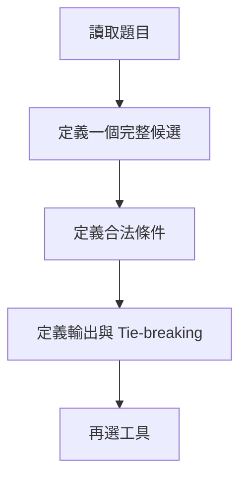
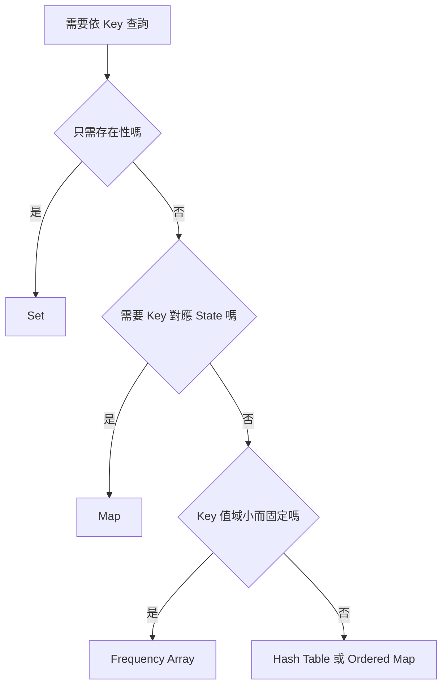
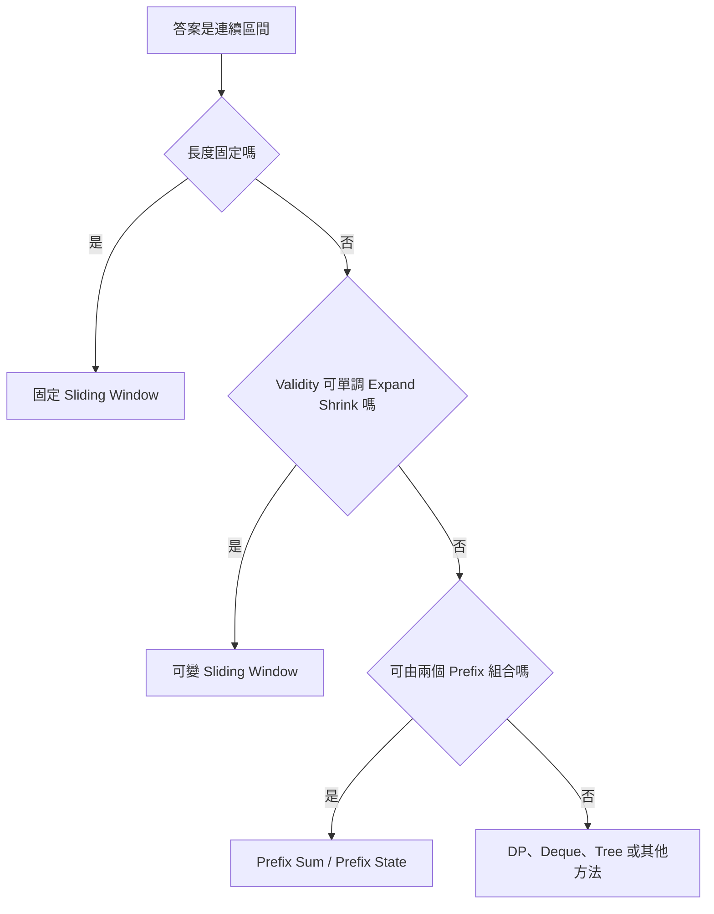
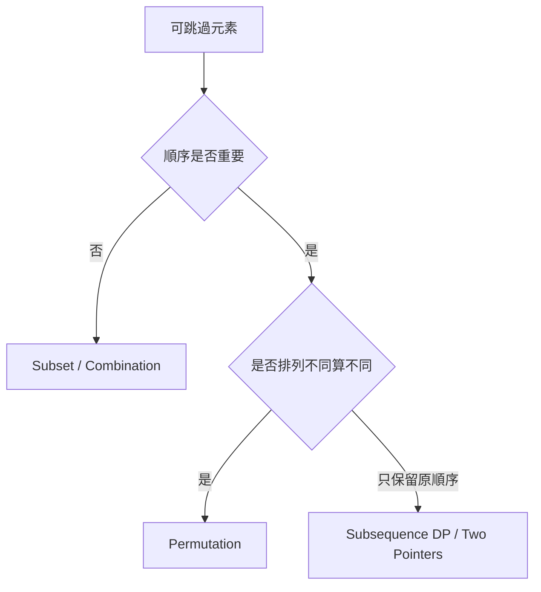
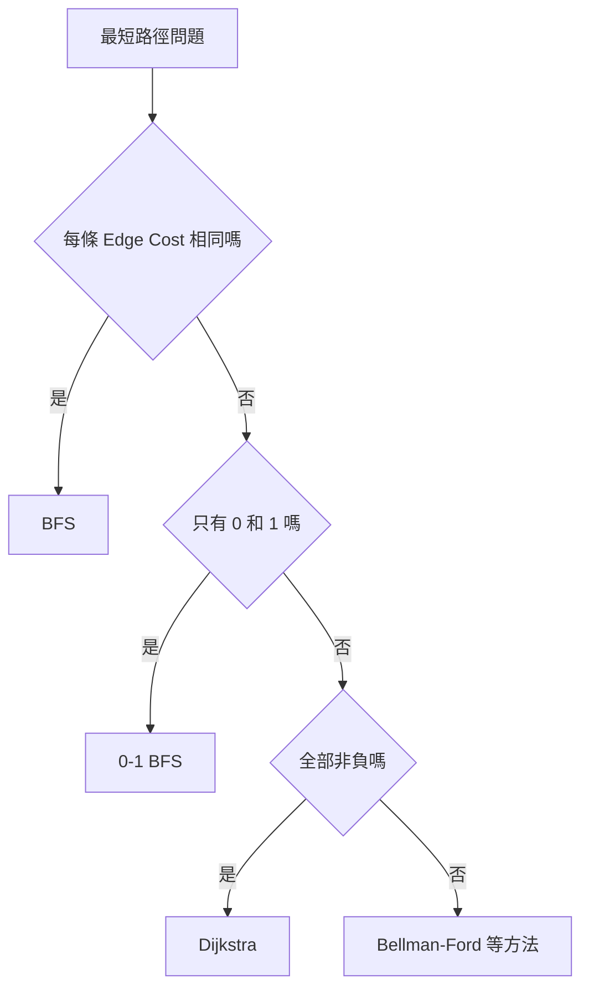
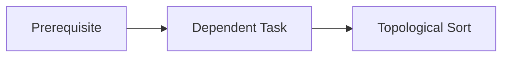
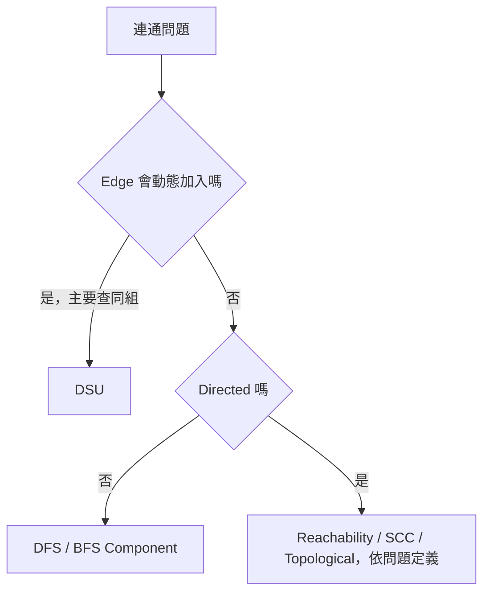
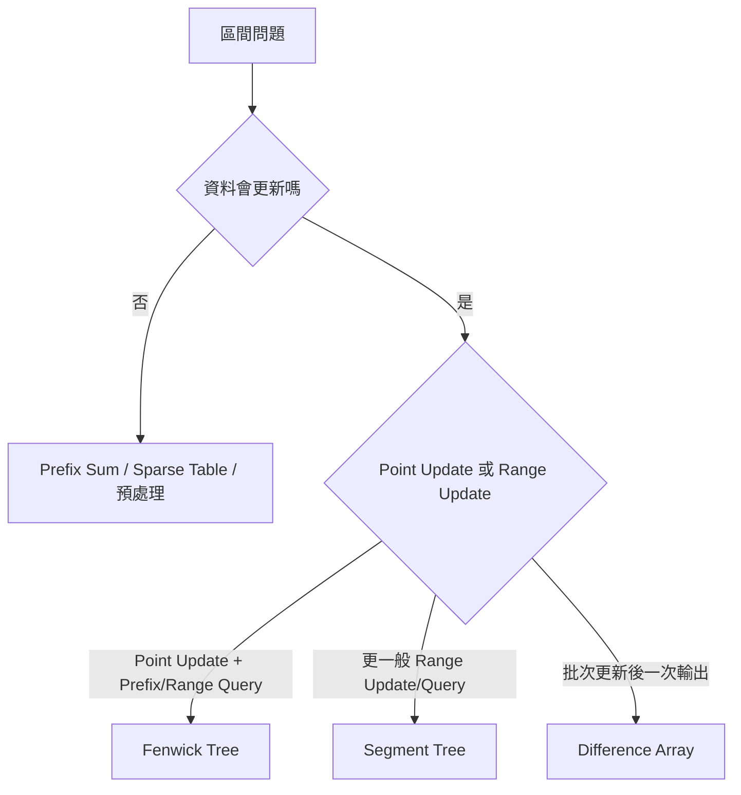
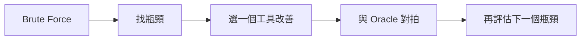

## 第 52 章　從題目特徵選擇工具

### 適用範圍

本章建立一套從題目語意選擇資料結構與演算法的流程。重點不是看到關鍵字就套模板，而是先辨識答案結構、輸入限制、可利用性質與主要成本。

### 快速導覽

- [先定義答案](#521-先定義答案)
- [查找、重複與頻率](#522-查找重複與頻率)
- [連續區間](#523-連續區間)
- [Subset、Combination 與順序](#524-subsetcombination-與順序)
- [排序與單調性](#525-排序與單調性)
- [最短步數與最低成本](#526-最短步數與最低成本)
- [相依順序](#527-相依順序)
- [連通關係](#528-連通關係)
- [最佳化與重複子問題](#529-最佳化與重複子問題)
- [動態區間查詢](#5210-動態區間查詢)
- [無法辨識題型時](#5211-無法辨識題型時)
- [工具選擇檢查表](#5212-工具選擇檢查表)
- [本章重點](#5213-本章重點)

### 52.1 先定義答案

先問：

- 回傳存在性、數量、最佳值、實際路徑，還是全部答案？
- 候選必須連續嗎？
- 順序不同算不同答案嗎？
- 是否需原始 Index？
- 是否允許修改或排序輸入？

同一份資料若輸出要求不同，工具可能完全不同。

### 52.2 查找、重複與頻率

- Membership：Set。
- Frequency、First Index、Last Index：Map。
- 小型固定值域：Array 可能更直接。
- 需要排序、最小 Key、Range Query：Ordered Map 或排序。

Hash 查找通常是平均 O(1)，不是所有情況下的最差保證。

### 52.3 連續區間

連續 Subarray 或 Substring 常見工具：

| 特徵 | 可考慮工具 |
|---|---|
| 固定長度 | Sliding Window |
| 可增量維護且具單調性 | Variable Sliding Window |
| 大量靜態區間 Sum | Prefix Sum |
| 區間 Max、Min 動態更新 | Segment Tree、Deque、Multiset |
| 含負數的特定 Sum 問題 | Prefix Sum + Hash / Monotonic Deque |

看到「區間」不代表一定使用 Sliding Window。Left 能否只向前需要證明。

### 52.4 Subset、Combination 與順序

- 每個元素選或不選：Subset、Backtracking、Bitmask。
- 選固定 k 個且不重視順序：Combination。
- 順序不同視為不同：Permutation。
- 具有重疊 State 與最佳化目標：可能使用 DP。

### 52.5 排序與單調性

排序可建立：

- Binary Search 的邊界分界。
- Two Pointers 的排除理由。
- Greedy 的選擇順序。
- 相鄰元素關係。

但排序可能破壞：

- 原始 Index。
- 原相對順序。
- Subarray 連續性。

需要原 Index 時，可排序 `(value, index)`。若不能改變輸入語意，應改用其他工具。

### 52.6 最短步數與最低成本

若問題是連接所有 Node 的最低總建設成本，而不是 Source 到 Target，可能是 MST。

### 52.7 相依順序

「A 必須先於 B」可建成 Directed Edge `A -> B`。

- 是否存在合法順序：Cycle Detection / Topological Sort。
- 任意合法順序：Kahn 或 DFS Postorder。
- 字典序最小：Kahn + Min-heap。
- 順序是否唯一：每輪 Ready Set 大小。

### 52.8 連通關係

- 靜態 Graph Reachability：DFS/BFS。
- Connected Component：外層掃描所有 Node，再啟動 DFS/BFS。
- 動態合併、詢問是否同組：DSU。
- Directed Strong Connectivity：SCC 演算法。
- 連接全部 Node 最低成本：MST。

### 52.9 最佳化與重複子問題

若暴力搜尋多次求相同 State，可考慮 Memoization 或 Bottom-up DP。

DP 前要定義：

- State。
- Transition。
- Base Case。
- 計算順序。
- 最終答案位置。

若每步局部選擇可證明安全，可考慮 Greedy；若無法證明，不應只因程式較短就採用。

### 52.10 動態區間查詢

資料結構選擇需同時看 Update、Query 的型態與順序。

### 52.11 無法辨識題型時

1. 寫出完整 Brute Force。
2. 計算候選數量與每個候選成本。
3. 標出重複查找、重複區間計算或重複 State。
4. 找排序、單調性、相依關係或可合併摘要。
5. 只改善一個瓶頸。
6. 保留 Brute Force 做小型 Oracle。

### 52.12 工具選擇檢查表

- 我已定義答案、合法性與 Tie-breaking。
- 我知道候選是否連續以及順序是否重要。
- 我知道是否可排序，以及排序會破壞什麼。
- 我知道查詢是 Membership、Frequency、極值或 Range。
- 我知道 Graph Edge 的方向與 Weight 條件。
- 我知道資料是否靜態，更新與查詢是否交錯。
- 我能說明工具成立的 Precondition。
- 我保留小型直接解法驗證改善版本。

### 52.13 本章重點

- 演算法工具應由答案結構、輸入限制與可利用性質選擇。
- 查找與 Frequency 常對應 Set、Map 或固定 Array。
- 連續區間可能使用 Window、Prefix 或 Range Query 結構。
- 最短路方法由 Edge Weight 條件決定。
- 相依順序使用 Directed Graph 與 Topological Sort。
- 動態連通可考慮 DSU，靜態走訪可使用 BFS 或 DFS。
- 無法辨識時，先建立 Brute Force，再從重複工作找改善方向。
