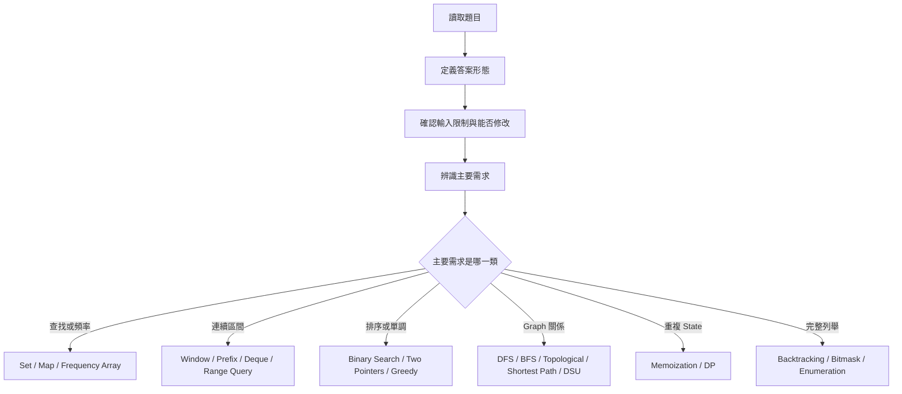
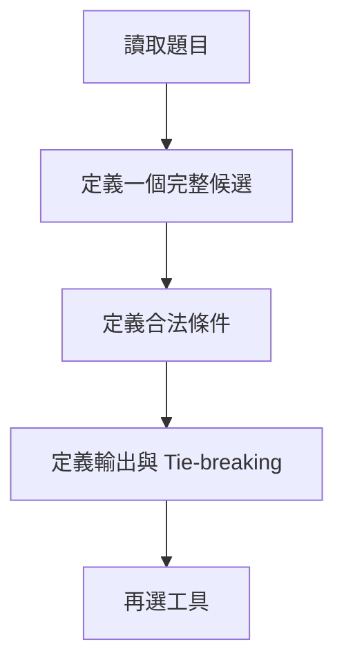
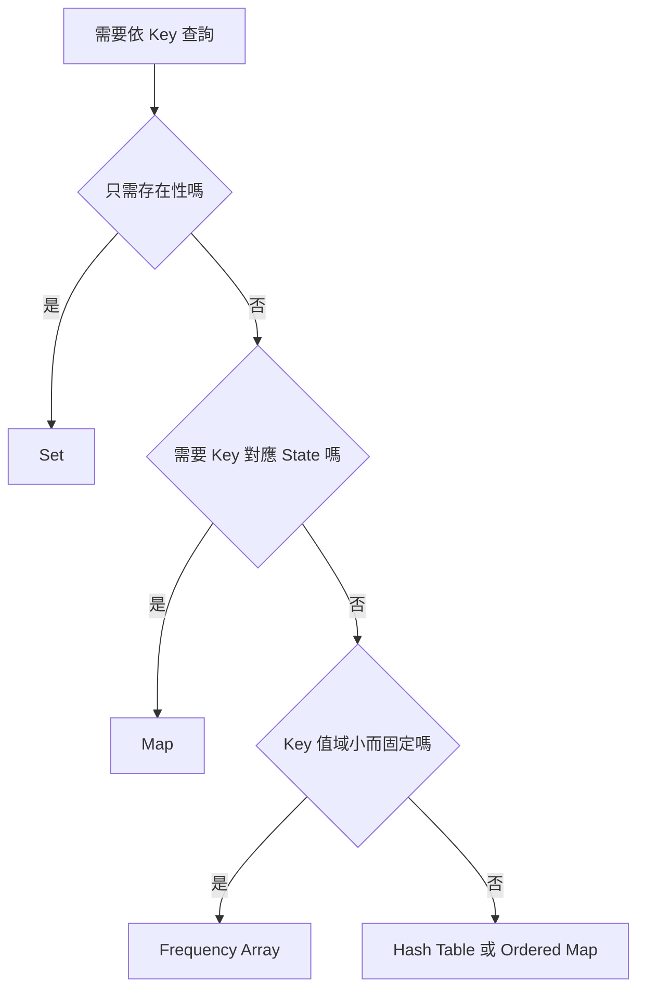
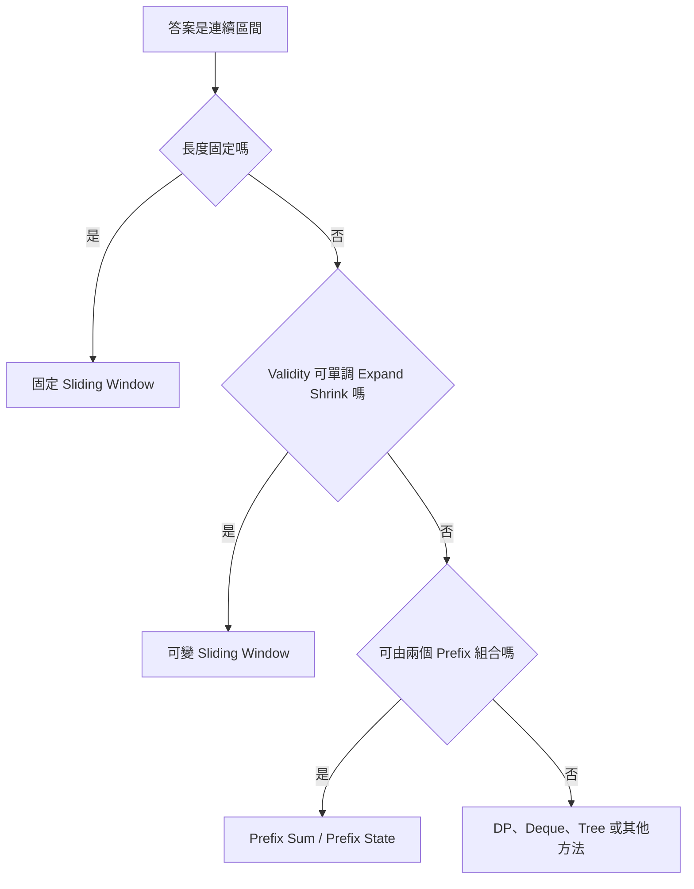
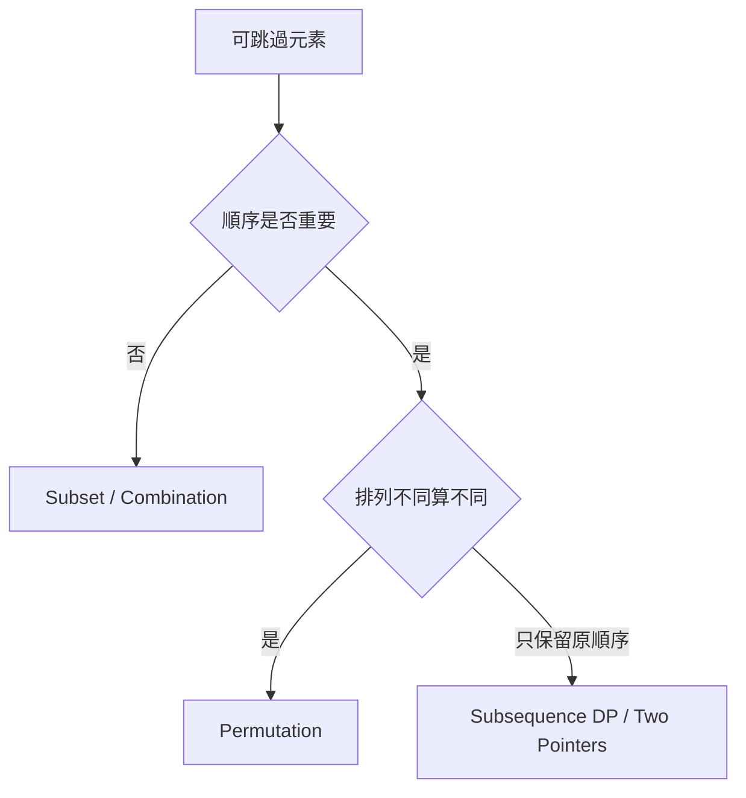
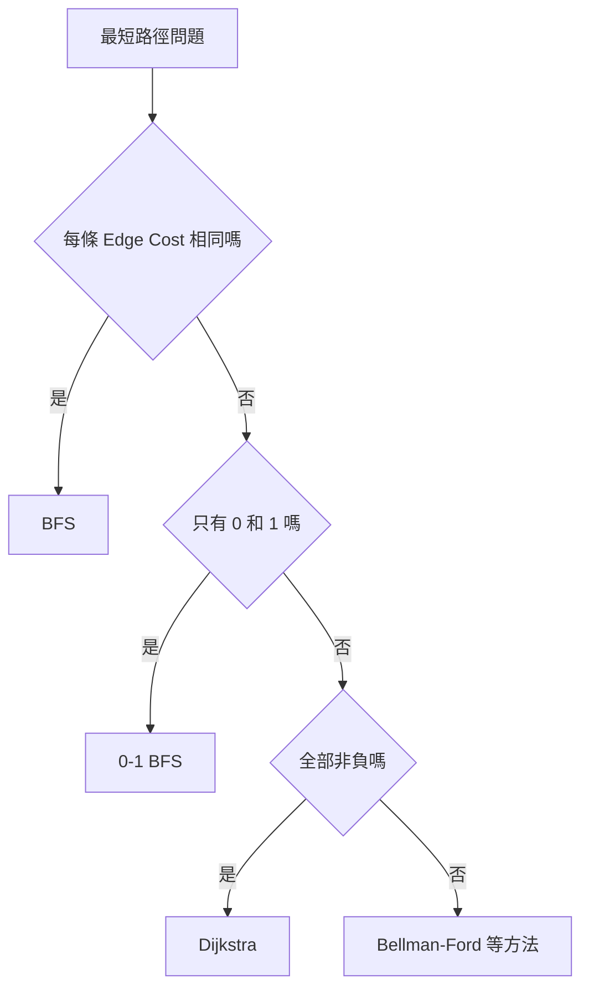
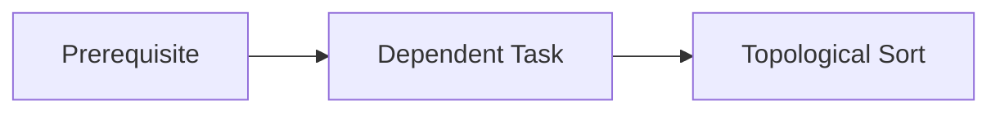
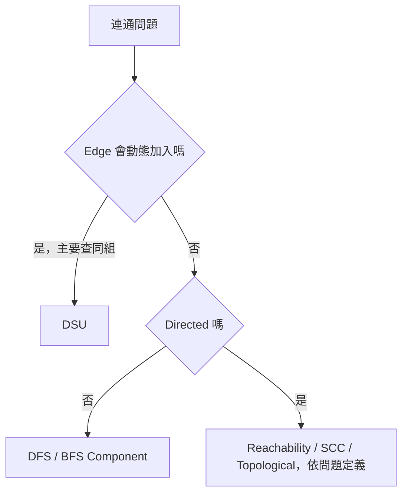
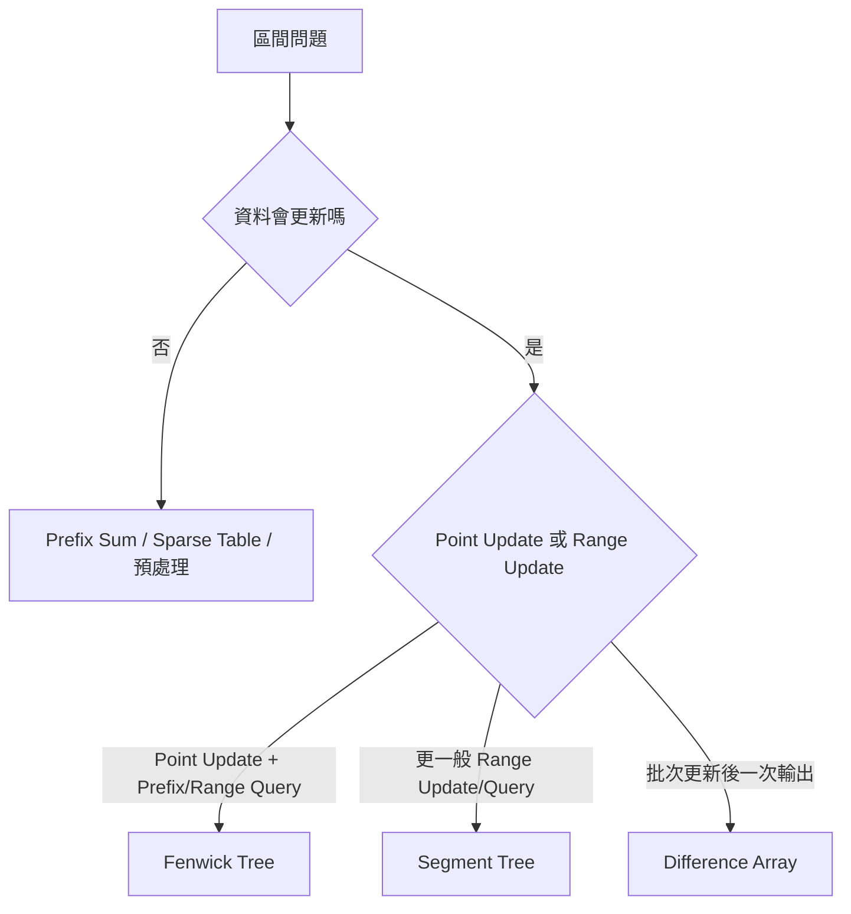
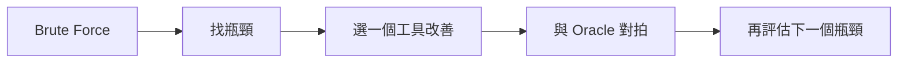

### 第 52 章　從題目特徵選擇工具

#### 適用範圍

本章建立一套從題目語意選擇資料結構與演算法的流程。重點不是看到關鍵字就套模板，而是先辨識答案結構、輸入限制、可利用性質與主要成本。原始章節已經整理出：先定義答案、查找與頻率、連續區間、Subset / Combination / 順序、排序與單調性、最短步數與最低成本、相依順序、連通關係、最佳化與重複子問題、動態區間查詢，以及無法辨識題型時回到 Brute Force 的流程。citeturn38search1

本章的定位接近「工具選擇速查」與「解題前問診表」。它不取代第 53 章的完整決策樹，也不取代第 54 章從 Brute Force 推導最佳化，而是幫助你在讀題後先縮小候選工具範圍。



每個工具選擇後，都必須再確認 Precondition、Invariant、複雜度與測試案例。

#### 適用讀者

- 看到題目時不知道該先想哪個資料結構的讀者。
- 容易只憑關鍵字選工具，例如有「區間」就用 Sliding Window 的讀者。
- 想分清楚 Set、Map、Frequency Array、Heap、Deque、Fenwick、Segment Tree 使用情境的讀者。
- 想知道 Graph 題該用 BFS、DFS、Dijkstra、Topological Sort 還是 DSU 的讀者。
- 想建立「工具選擇後仍要驗證前置條件」習慣的讀者。

#### 快速導覽

- [52.1 先定義答案](#521-先定義答案)
- [52.2 查找、重複與頻率](#522-查找重複與頻率)
- [52.3 連續區間](#523-連續區間)
- [52.4 Subset、Combination 與順序](#524-subsetcombination-與順序)
- [52.5 排序與單調性](#525-排序與單調性)
- [52.6 最短步數與最低成本](#526-最短步數與最低成本)
- [52.7 相依順序](#527-相依順序)
- [52.8 連通關係](#528-連通關係)
- [52.9 最佳化與重複子問題](#529-最佳化與重複子問題)
- [52.10 動態區間查詢](#5210-動態區間查詢)
- [52.11 極值與 Top K](#5211-極值與-top-k)
- [52.12 字串與前綴](#5212-字串與前綴)
- [52.13 無法辨識題型時](#5213-無法辨識題型時)
- [52.14 工具選擇後如何驗證](#5214-工具選擇後如何驗證)
- [52.15 常見誤判](#5215-常見誤判)
- [52.16 工具選擇紀錄模板](#5216-工具選擇紀錄模板)
- [52.17 工具選擇檢查表](#5217-工具選擇檢查表)
- [52.18 本章重點](#5218-本章重點)

#### 52.1 先定義答案

選工具之前，先定義答案。原始章節也提醒，第一步應先問：回傳存在性、數量、最佳值、實際路徑，還是全部答案；候選是否必須連續；順序不同是否算不同答案；是否需要原始 Index；是否允許修改或排序輸入。citeturn38search1



##### 答案形態會改變工具

同一份輸入，不同輸出會導向不同工具。

<table>
<tr><th>輸出要求</th><th>可能工具</th><th>原因</th></tr>
<tr><td>是否存在重複值</td><td>Hash Set</td><td>只需 Membership</td></tr>
<tr><td>每個值出現次數</td><td>Hash Map / Frequency Array</td><td>需要 Key 對應 Count</td></tr>
<tr><td>回傳第一個重複位置</td><td>Map：value -> first index</td><td>需要保存 Index</td></tr>
<tr><td>回傳全部重複值並排序</td><td>Map + Sort 或 Ordered Map</td><td>需要輸出順序</td></tr>
<tr><td>找最大連續區間</td><td>Sliding Window / Prefix / DP</td><td>候選必須連續</td></tr>
<tr><td>列出所有子集合</td><td>Backtracking / Bitmask</td><td>需要完整枚舉答案</td></tr>
</table>

##### 先確認 Tie-breaking

若有多個合法答案，要問：

- 任意答案即可嗎？
- 要最小 Index？
- 要字典序最小？
- 要最短或最長？
- 輸出順序固定嗎？

Tie-breaking 常會改變資料結構。例如任意 Topological Order 可用一般 Queue；字典序最小 Topological Order 可能需要 Min Heap。

#### 52.2 查找、重複與頻率

若題目需要依 Key 查詢，先判斷 Key 對應的資訊。

原始章節的流程是：只需存在性用 Set；需要 Key 對應 State 用 Map；Key 值域小而固定時 Frequency Array 可能更直接；需要排序、最小 Key、Range Query 時考慮 Ordered Map 或排序。它也提醒 Hash 查找通常是平均 O(1)，不是所有情況下的最差保證。citeturn38search1



##### Set

適合：

- 是否出現過。
- 是否已經 visited。
- 是否存在某個 Key。

例子：

```cpp
std::unordered_set<int> seen;

if (seen.contains(value))
{
    return true;
}

seen.insert(value);
```

##### Map

適合：

- Frequency。
- First Index。
- Last Index。
- Parent。
- Distance。
- State Count。

例子：

```cpp
std::unordered_map<int, int> frequency;
++frequency[value];
```

##### Frequency Array

若 Key 值域很小，例如 `0 <= value <= 100`：

```cpp
std::vector<int> frequency(101, 0);
++frequency[value];
```

這通常比 Hash Table 更直接，也避免 Hash 成本，但前提是值域固定且可接受。

##### Ordered Map / Sort

若需要：

- 依 Key 排序走訪。
- 找最小或最大 Key。
- Lower Bound / Upper Bound。
- Range Query。

就不能只看平均 O(1) 而使用 Hash Table。

#### 52.3 連續區間

連續 Subarray 或 Substring 題，先確認「連續」的語意，再決定 Window、Prefix 或 Range Query。

原始章節已列出：固定長度用 Sliding Window；可增量維護且具單調性用 Variable Sliding Window；大量靜態區間 Sum 用 Prefix Sum；區間 Max / Min 動態更新可考慮 Segment Tree、Deque、Multiset；含負數的特定 Sum 問題可考慮 Prefix Sum + Hash 或 Monotonic Deque。citeturn38search1



##### 固定 Sliding Window

適合長度固定的區間：

```text
所有長度 k 的 Subarray 中最大 Sum
```

每次右移一格，只需要移除左端、加入右端。

##### 可變 Sliding Window

適合 Window Validity 具有單調性：

```text
最長子字串，最多包含 k 種字元
```

若右端擴張導致失效，左端往右縮通常能恢復 Validity。

##### Prefix Sum

適合 Range Sum 類 Query：

```text
sum(left, right) = prefix[right] - prefix[left]
```

前提是 Operation 可由兩個 Prefix 關係組合。

##### Prefix Sum + Hash

適合：

```text
Subarray Sum equals k
```

尤其當 Array 可含負數時，Sum 不具 Sliding Window 單調性。

##### Deque / Segment Tree / Multiset

若要維護 Window Maximum / Minimum：

- 固定 Sliding Window Maximum：Monotonic Deque。
- 動態插入刪除與取極值：Multiset 或 Heap + Lazy Deletion。
- 動態 Range Query：Segment Tree。

##### 注意

原始章節也提醒，看到「區間」不代表一定使用 Sliding Window，Left 能否只向前需要證明。citeturn38search1

#### 52.4 Subset、Combination 與順序

若題目是在一組元素中做選擇，要先確認順序語意。

原始章節整理：每個元素選或不選是 Subset、Backtracking、Bitmask；選固定 k 個且不重視順序是 Combination；順序不同視為不同是 Permutation；若具有重疊 State 與最佳化目標，可能使用 DP。citeturn38search1



##### Subset

每個元素選或不選：

```text
2^n 個候選
```

工具：Backtracking、Bitmask、DP。

##### Combination

選固定 k 個，不重視順序：

```text
C(n, k) 個候選
```

Backtracking 時通常使用 `start` 避免重複排列。

##### Permutation

順序不同算不同：

```text
n! 個候選
```

需要 `used` 或其他狀態避免重複使用元素。

##### Subsequence

保留原順序，但可跳過元素。常見工具：

- Two Pointers。
- DP。
- Greedy + Binary Search，依題目。

#### 52.5 排序與單調性

排序可以建立結構，但也可能破壞語意。

原始章節指出，排序可建立 Binary Search 的邊界分界、Two Pointers 的排除理由、Greedy 的選擇順序與相鄰元素關係；但排序可能破壞原始 Index、原相對順序與 Subarray 連續性。若需要原 Index，可排序 `(value, index)`。citeturn38search1

排序可導向：

- Binary Search。
- Two Pointers。
- Greedy。
- 相鄰去重。
- Interval Merge。

排序前問：

<table>
<tr><th>問題</th><th>影響</th></tr>
<tr><td>是否需要原始 Index?</td><td>需要保存 `(value, index)`</td></tr>
<tr><td>是否要求原相對順序?</td><td>可能需要 Stable Sort 或不能排序</td></tr>
<tr><td>答案是否必須是 Subarray?</td><td>排序會破壞連續性</td></tr>
<tr><td>是否允許修改輸入?</td><td>不允許時要複製</td></tr>
<tr><td>排序成本是否可接受?</td><td>總時間要包含 O(n log n)</td></tr>
</table>

##### Binary Search

需要排序或單調 Predicate。

##### Two Pointers

需要移動 Pointer 時能證明排除一批候選。

##### Greedy

需要證明局部選擇安全，不是只因排序後看起來好選。

#### 52.6 最短步數與最低成本

最短路方法由 Edge Cost 決定。

原始章節的流程是：Edge Cost 相同用 BFS；只有 0 和 1 用 0-1 BFS；全部非負用 Dijkstra；否則考慮 Bellman-Ford 等方法。它也提醒，如果問題是連接所有 Node 的最低總建設成本，而不是 Source 到 Target，可能是 MST。citeturn38search1



##### 選法表

<table>
<tr><th>需求</th><th>工具</th><th>前置條件</th></tr>
<tr><td>最少步數</td><td>BFS</td><td>每步成本相同</td></tr>
<tr><td>Weight 只有 0 / 1</td><td>0-1 BFS</td><td>Edge Weight 只為 0 或 1</td></tr>
<tr><td>非負 Weight 最短路</td><td>Dijkstra</td><td>所有 Weight 非負</td></tr>
<tr><td>有負 Edge</td><td>Bellman-Ford 等</td><td>需處理負環語意</td></tr>
<tr><td>所有點兩兩最短路</td><td>Floyd-Warshall 等</td><td>V 通常不能太大</td></tr>
<tr><td>連接全部 Node 最低成本</td><td>MST</td><td>Weighted Undirected Graph</td></tr>
</table>

##### 常見誤判

- 有「最短」不一定是 BFS。
- Grid 題不一定是 BFS，若移動成本不同就要重新評估。
- MST 不是 Source 到 Target 最短路。
- Dijkstra 不適合負權重 Edge。

#### 52.7 相依順序

「A 必須先於 B」可建成 Directed Edge `A -> B`。

原始章節列出：是否存在合法順序可用 Cycle Detection / Topological Sort；任意合法順序可用 Kahn 或 DFS Postorder；字典序最小可用 Kahn + Min Heap；順序是否唯一可看每輪 Ready Set 大小。citeturn38search1



##### 常見問題

<table>
<tr><th>需求</th><th>工具</th><th>檢查</th></tr>
<tr><td>是否能完成所有任務</td><td>Cycle Detection</td><td>是否有 Directed Cycle</td></tr>
<tr><td>輸出任意合法順序</td><td>Kahn / DFS Topological</td><td>輸出數量是否等於 Node 數</td></tr>
<tr><td>字典序最小順序</td><td>Kahn + Min Heap</td><td>Ready Set 每次取最小</td></tr>
<tr><td>順序是否唯一</td><td>檢查 Ready Set 大小</td><td>若某輪有多個選擇，通常不唯一</td></tr>
</table>

##### 前置條件

Topological Order 需要 DAG。如果有 Directed Cycle，就不存在能包含所有 Node 的合法拓樸順序。

#### 52.8 連通關係

原始章節整理：靜態 Graph Reachability 用 DFS / BFS；Connected Component 需外層掃描所有 Node 再啟動 DFS / BFS；動態合併與同組查詢用 DSU；Directed Strong Connectivity 可用 SCC；連接全部 Node 最低成本是 MST。citeturn38search1



##### 靜態連通

若 Graph 不變，想找 Component 或可達性，DFS / BFS 通常足夠。

##### 動態合併

若 Edge 持續新增，並詢問兩點是否同組，DSU 很適合。

##### Directed Graph

有向 Graph 的可達性不對稱。若要互相可達，通常要考慮 Strongly Connected Components。

##### MST

如果目標是以最低總成本連接所有 Node，這不是一般 Reachability，而是 Minimum Spanning Tree 題。

#### 52.9 最佳化與重複子問題

若暴力搜尋多次求相同 State，可考慮 Memoization 或 Bottom-up DP。原始章節列出 DP 前要定義 State、Transition、Base Case、計算順序與最終答案位置。它也提醒，若每步局部選擇可證明安全，可考慮 Greedy；若無法證明，不應只因程式較短就採用。citeturn38search1

##### DP 前五問

```text
State 是什麼？
Transition 是什麼？
Base Case 是什麼？
計算順序是什麼？
答案在哪裡？
```

##### Greedy 前三問

```text
局部選擇是什麼？
為什麼存在某個最佳解包含這個選擇？
能否建立反例？
```

##### Backtracking / DP / Greedy 的區別

<table>
<tr><th>方法</th><th>適用情況</th></tr>
<tr><td>Backtracking</td><td>需要完整搜尋可能解，State 不一定大量重複</td></tr>
<tr><td>Memoization / DP</td><td>相同 State 從不同路徑重複出現</td></tr>
<tr><td>Greedy</td><td>可證明局部選擇安全</td></tr>
</table>

#### 52.10 動態區間查詢

如果題目包含多次 Update 與 Query，要同時看更新型態與查詢型態。

原始章節的流程是：資料不更新時可用 Prefix Sum / Sparse Table / 預處理；有更新時看 Point Update 或 Range Update；Point Update + Prefix / Range Query 可用 Fenwick Tree；更一般 Range Update / Query 用 Segment Tree；批次更新後一次輸出用 Difference Array。citeturn38search1



##### 判斷表

<table>
<tr><th>情境</th><th>工具</th><th>提醒</th></tr>
<tr><td>多次靜態 Range Sum</td><td>Prefix Sum</td><td>資料不更新</td></tr>
<tr><td>靜態 Range Min / Max</td><td>Sparse Table 等</td><td>適合靜態 RMQ</td></tr>
<tr><td>批次 Range Add，最後輸出</td><td>Difference Array</td><td>離線處理</td></tr>
<tr><td>Point Update + Prefix Sum</td><td>Fenwick Tree</td><td>操作可由 Prefix 組合</td></tr>
<tr><td>Point Update + Range Min / Max</td><td>Segment Tree</td><td>Node State 可 Merge</td></tr>
<tr><td>Range Update + Range Query</td><td>Lazy Segment Tree</td><td>需要定義 Lazy State</td></tr>
</table>

#### 52.11 極值與 Top K

若題目反覆需要目前最小、最大或前 k 個候選，要考慮 Heap、Deque、Balanced Tree 或排序。

<table>
<tr><th>需求</th><th>工具</th><th>注意事項</th></tr>
<tr><td>只需一次排序後取前 k</td><td>Sort</td><td>O(n log n)</td></tr>
<tr><td>資料流 Top K</td><td>大小 k 的 Heap</td><td>O(n log k)</td></tr>
<tr><td>反覆取目前最小 / 最大</td><td>Priority Queue</td><td>處理 Stale Entry</td></tr>
<tr><td>Sliding Window Maximum</td><td>Monotonic Deque</td><td>同時處理過期與支配</td></tr>
<tr><td>需要刪任意值並取極值</td><td>Multiset / Balanced Tree</td><td>O(log n)</td></tr>
</table>

Heap 不是完整排序結構，也不擅長查任意值是否存在。

#### 52.12 字串與前綴

字串題先看需求：

<table>
<tr><th>需求</th><th>工具</th><th>提醒</th></tr>
<tr><td>逐字元掃描</td><td>Loop / Counting</td><td>先處理空字串與大小寫規則</td></tr>
<tr><td>固定 Pattern 匹配</td><td>KMP、Z Algorithm、Rolling Hash</td><td>Hash 需處理 Collision</td></tr>
<tr><td>大量前綴查詢</td><td>Trie</td><td>路徑存在不等於完整單字存在</td></tr>
<tr><td>Palindrome</td><td>Two Pointers、DP、Manacher</td><td>依輸出需求選擇</td></tr>
<tr><td>Substring 題</td><td>Sliding Window、Prefix、Hash</td><td>確認是否要求連續</td></tr>
<tr><td>Subsequence 題</td><td>Two Pointers、DP</td><td>保留原順序但可跳過</td></tr>
</table>

字串題最常見的誤判是混淆 Substring 與 Subsequence。

#### 52.13 無法辨識題型時

原始章節建議：寫出完整 Brute Force、計算候選數量與每個候選成本、標出重複查找、重複區間計算或重複 State、找排序、單調性、相依關係或可合併摘要、只改善一個瓶頸、保留 Brute Force 做小型 Oracle。citeturn38search1



##### 不知道用什麼時，先做這五步

1. 寫出一個完整候選。
2. 枚舉所有候選。
3. 計算候選數量。
4. 找出重複工作。
5. 只改善最明顯的一個瓶頸。

這樣即使最後需要看提示，也能知道自己卡在哪一層：模型、候選空間、複雜度、State，還是實作。

#### 52.14 工具選擇後如何驗證

選出工具後，必須補上驗證。

<table>
<tr><th>工具</th><th>必須驗證</th></tr>
<tr><td>Hash Table</td><td>Key / Value 語意、平均成本、是否要原 Index</td></tr>
<tr><td>Sliding Window</td><td>Window Validity 是否單調，State 是否可增量更新</td></tr>
<tr><td>Prefix Sum</td><td>區間語意與 Operation 是否可由 Prefix 組合</td></tr>
<tr><td>Binary Search</td><td>Predicate 是否單調，區間是否嚴格縮小</td></tr>
<tr><td>Heap</td><td>是否只需 Top，如何處理 Stale Entry</td></tr>
<tr><td>DFS / BFS</td><td>Visited 時機、Graph 方向、Edge Cost</td></tr>
<tr><td>Topological Sort</td><td>Graph 是否為 DAG，Cycle 如何處理</td></tr>
<tr><td>Dijkstra</td><td>Weight 是否非負，INF 與 Stale Entry</td></tr>
<tr><td>DP</td><td>State 是否完整，Transition 與 Base Case 是否明確</td></tr>
<tr><td>Greedy</td><td>是否有 Exchange、Stay-ahead 或其他證明</td></tr>
<tr><td>Fenwick / Segment Tree</td><td>Update / Query 型態與 Node State 是否正確</td></tr>
</table>

#### 52.15 常見誤判

<table>
<tr><th>誤判</th><th>檢查方向</th></tr>
<tr><td>看到區間就用 Sliding Window</td><td>Validity 是否單調？Left 能否只向前？</td></tr>
<tr><td>看到最短就用 BFS</td><td>Edge Cost 是否全部相同？</td></tr>
<tr><td>看到最佳化就用 Greedy</td><td>是否有正確性證明？</td></tr>
<tr><td>看到重複工作就用 DP</td><td>State 是否有限且 Transition 明確？</td></tr>
<tr><td>看到查找就用 Hash</td><td>是否需要排序、Range Query 或最差保證？</td></tr>
<tr><td>看到 Query 就用 Segment Tree</td><td>資料是否靜態？Prefix Sum 是否已足夠？</td></tr>
<tr><td>看到排序能幫忙就直接排序</td><td>是否破壞原 Index、穩定性或連續性？</td></tr>
<tr><td>看到 Graph 就 DFS</td><td>是否需要最短步數、拓樸順序或權重最短路？</td></tr>
</table>

#### 52.16 工具選擇紀錄模板

```markdown
# 題目名稱

## 1. 答案定義
- 回傳類型：存在性 / 數量 / 最佳值 / 路徑 / 全部答案
- 候選是否連續：
- 順序是否重要：
- 是否需要原 Index：
- 是否允許修改輸入：

## 2. 輸入限制
- n / V / E / q：
- 值域：
- 是否排序：
- 是否有負數：
- 是否動態更新：

## 3. 候選工具
- 工具 A：
  - 支持理由：
  - Precondition：
  - 反例：
  - 時間 / 空間：
- 工具 B：
  - 支持理由：
  - Precondition：
  - 反例：
  - 時間 / 空間：

## 4. 最終選擇
- 選擇工具：
- State / Invariant：
- 為什麼成立：
- 為什麼其他工具不適合：

## 5. 測試
- 邊界案例：
- 反例：
- 最差規模：
- 是否和 Brute Force 對拍：
```

#### 52.17 工具選擇檢查表

原始章節的檢查表包含：已定義答案、合法性與 Tie-breaking；知道候選是否連續以及順序是否重要；知道是否可排序，以及排序會破壞什麼；知道查詢是 Membership、Frequency、極值或 Range；知道 Graph Edge 的方向與 Weight 條件；知道資料是否靜態、更新與查詢是否交錯；能說明工具成立的 Precondition；保留小型直接解法驗證改善版本。citeturn38search1

擴充檢查：

- 我已定義答案、合法性與 Tie-breaking。
- 我知道候選是否連續以及順序是否重要。
- 我知道是否需要原始 Index。
- 我知道是否可排序，以及排序會破壞什麼。
- 我知道查詢是 Membership、Frequency、極值或 Range。
- 我知道 Graph Edge 的方向與 Weight 條件。
- 我知道資料是否靜態，更新與查詢是否交錯。
- 我能說明工具成立的 Precondition。
- 我能說明工具不成立時的反例。
- 我有用複雜度過濾不可行選項。
- 我保留小型直接解法驗證改善版本。

#### 52.18 本章重點

- 演算法工具應由答案結構、輸入限制與可利用性質選擇。
- 同一份資料，輸出要求不同，工具可能完全不同。
- 查找與 Frequency 常對應 Set、Map 或固定 Array。
- 連續區間可能使用 Window、Prefix、Deque 或 Range Query 結構。
- 最短路方法由 Edge Weight 條件決定。
- 相依順序使用 Directed Graph 與 Topological Sort。
- 動態連通可考慮 DSU，靜態走訪可使用 BFS 或 DFS。
- DP 前要確認 State、Transition、Base Case、Order 與 Answer。
- Greedy 需要證明，不應只因程式較短採用。
- 無法辨識時，先建立 Brute Force，再從重複工作找改善方向。
