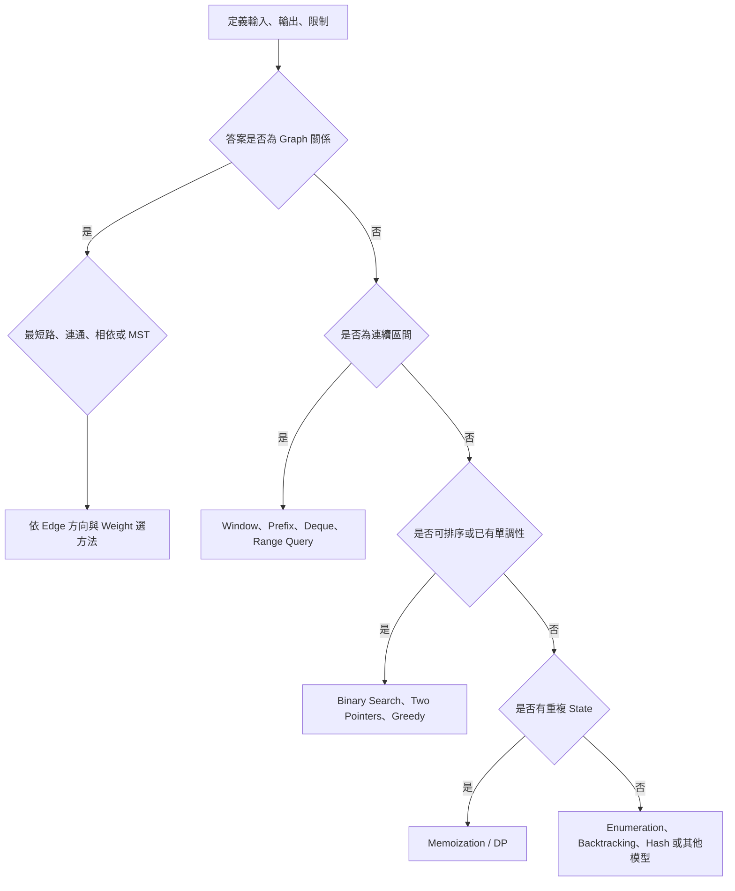
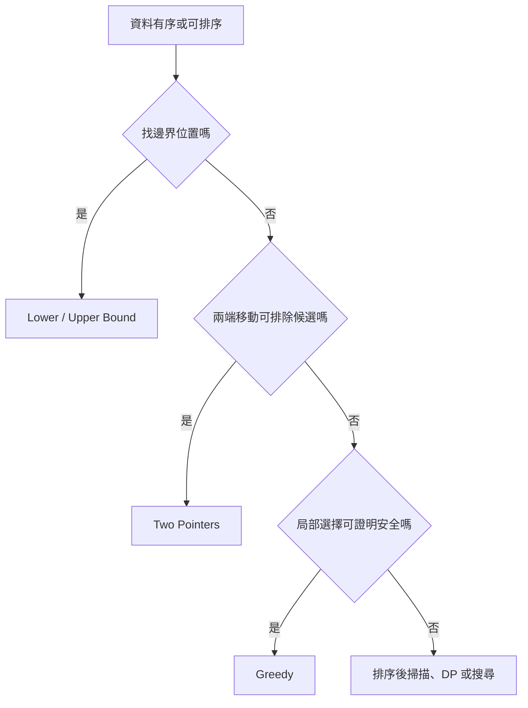
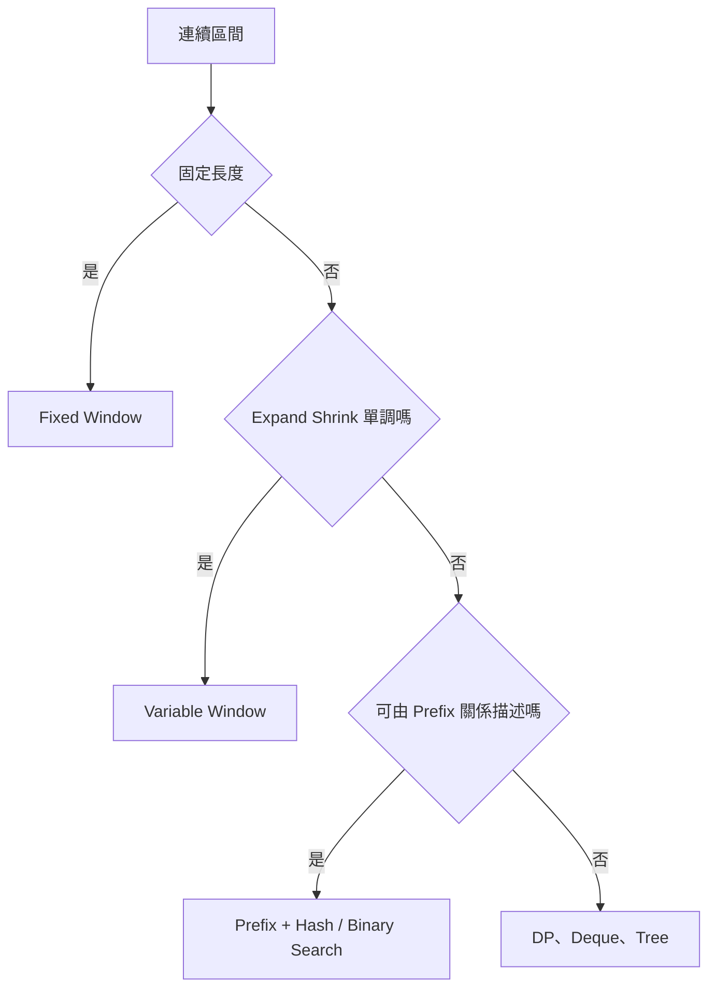
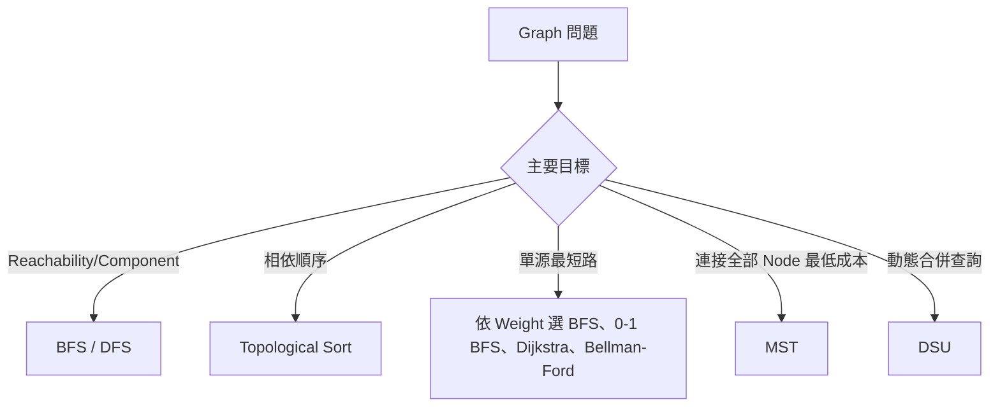
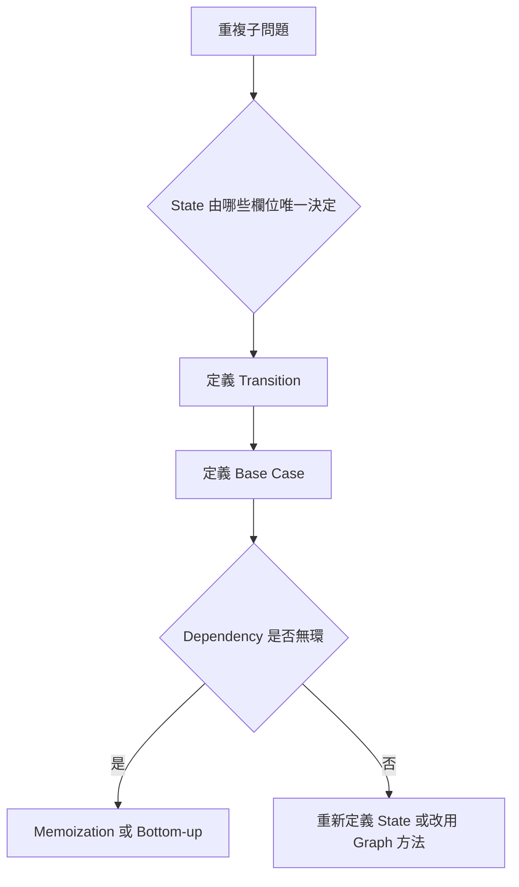
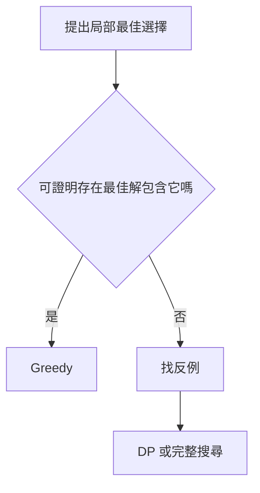

## 第 53 章　演算法選擇決策樹

### 適用範圍

本章將常見題型整理成決策流程。決策樹用來提出候選方法，不取代 Precondition、正確性證明與複雜度分析。

### 53.1 主決策樹



每個葉節點都只是下一步調查方向。

### 53.2 排序與單調性



排序前要檢查原 Index、穩定性與連續性需求。

### 53.3 連續區間

- 固定長度且 State 可增量更新：固定 Sliding Window。
- 可變長度且 Validity 單調：Variable Sliding Window。
- 大量靜態 Sum Query：Prefix Sum。
- Sum 等於 k 且可含負數：Prefix Sum + Hash。
- Window Maximum：Monotonic Deque。
- 動態 Range：Fenwick / Segment Tree。



### 53.4 Graph 分支



Directed、Undirected 與 Weight 是必要前置資訊。

### 53.5 DP 分支

若選擇序列會產生重複 State：



常見分類：

- Prefix / Sequence DP。
- Grid DP。
- Knapsack。
- Subsequence DP。
- Interval DP。
- Tree DP。

### 53.6 Greedy 或完整搜尋

Greedy 需要 Exchange、Stay-ahead、Cut Property 等證明。若無法證明，先使用：

- Enumeration。
- Backtracking。
- DP。
- Branch and Bound。



### 53.7 動態更新

| Update / Query | 常見工具 |
|---|---|
| 無 Update，多次 Prefix Sum | Prefix Sum |
| 批次 Range Add，最後一次輸出 | Difference Array |
| Point Update、Prefix Sum | Fenwick Tree |
| 一般 Range Query / Update | Segment Tree |
| 動態 Connected Component 合併 | DSU |

### 53.8 複雜度過濾

先由限制估算可接受規模：

```text
n 約 10^5：通常不能 O(n²)
n 約 20：2^n 可能可行
n 約 10：n! 仍需評估
V、E 大：優先 Adjacency List
```

這些只是量級判讀，實際限制還受常數、記憶體、語言與時間限制影響。

### 53.9 決策結果驗證

選出候選方法後，仍需回答：

1. Precondition 是否成立？
2. State 或 Invariant 是什麼？
3. 每次移動或選擇排除哪些候選？
4. 是否一定終止？
5. 時間與空間是否符合限制？
6. 反例與邊界案例是否通過？

### 53.10 常見誤判

| 誤判 | 檢查方向 |
|---|---|
| 有兩個 Pointer 就叫 Sliding Window | 是否維護連續 Window State |
| 有「最短」就用 BFS | Edge Cost 是否相同 |
| 有「相依」就一定能排序 | Graph 是否有 Cycle |
| 有最佳化就用 Greedy | 是否有正確性證明 |
| 有區間就用 Prefix Sum | Operation 是否可由 Prefix 抵消 |
| 有重複工作就一定是 DP | State 是否有限且 Transition 明確 |

### 53.11 本章檢查表

- 我先定義問題，再走決策樹。
- 我知道決策樹只提出候選方法。
- 我會確認排序、單調性、連續性與 Weight。
- 我能區分 Graph、DP、Greedy、Window 與搜尋問題。
- 我會用輸入限制過濾不可行複雜度。
- 我能為最後選擇的方法補上證明與測試。

### 53.12 本章重點

- 決策樹用於縮小方法範圍，不取代正確性推導。
- 排序與單調性常導向 Binary Search、Two Pointers 或 Greedy。
- 連續區間需區分 Window、Prefix 與動態 Range Query。
- Graph 方法由目標、方向與 Weight 決定。
- 重複 State 可考慮 DP，但要先定義 State 與 Transition。
- Greedy 沒有證明時，應回到搜尋、DP 或反例分析。
