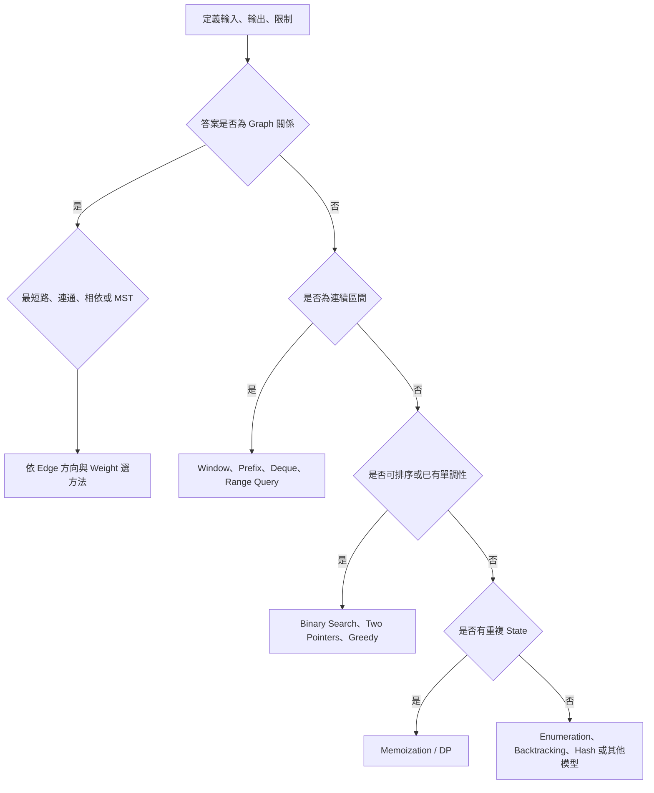
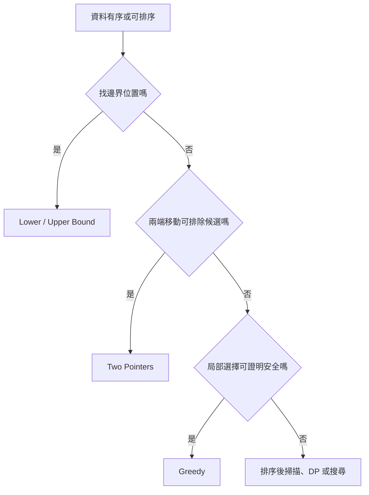
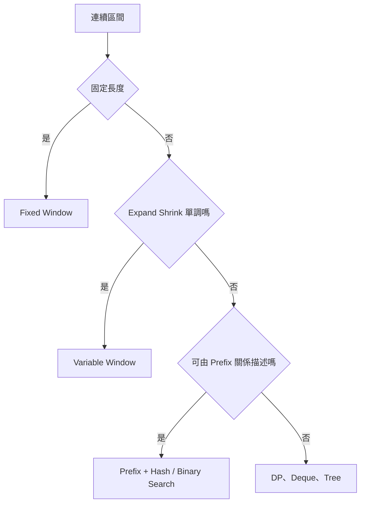
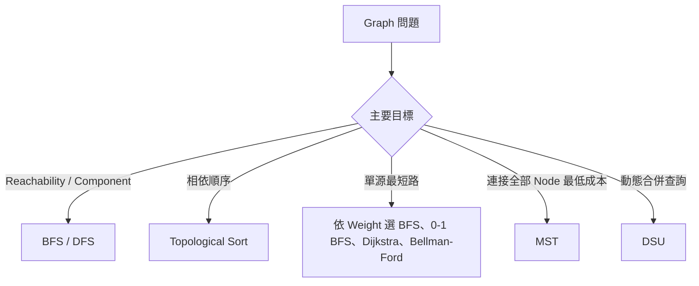
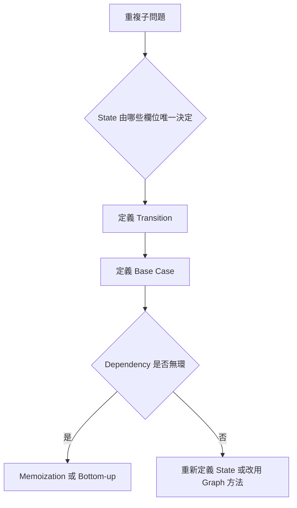
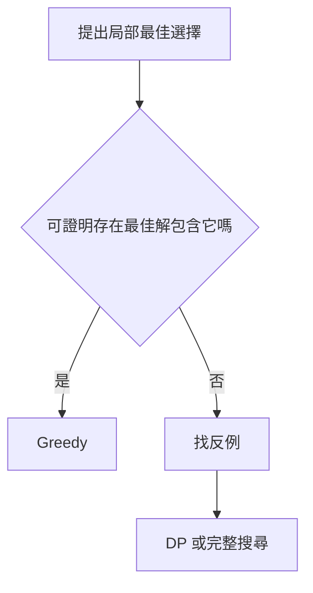
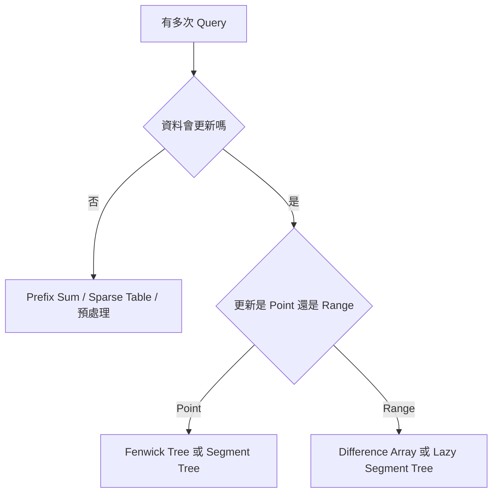
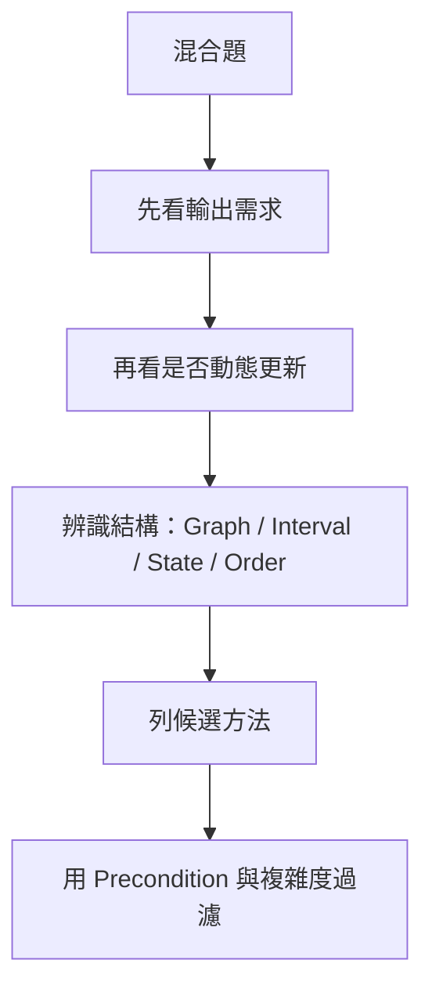

### 第 53 章　演算法選擇決策樹

#### 適用範圍

本章將常見題型整理成決策流程。決策樹用來提出候選方法，不取代 Precondition、正確性證明與複雜度分析。原始章節已經整理出主決策樹、排序與單調性、連續區間、Graph、DP、Greedy、動態更新、複雜度過濾與常見誤判等分支。citeturn37search1

本章的重點不是讓你看到某個關鍵字就直接選演算法，而是建立一套問問題的順序：

1. 先定義輸入、輸出與限制。
2. 判斷答案需要的是 Graph 關係、連續區間、排序結構、重複 State，還是完整列舉。
3. 針對每個候選方法確認前置條件。
4. 用複雜度過濾不可行方法。
5. 最後補上 Invariant、State、正確性與測試。



每個葉節點都只是下一步調查方向，不能當作最終答案。原始章節也提醒，決策樹只提出候選方法，不取代正確性推導。citeturn37search1

#### 適用讀者

- 看到題目時不知道該從哪個演算法開始想的讀者。
- 容易只憑關鍵字選方法，例如看到「最短」就用 BFS 的讀者。
- 想把 Window、Prefix、Binary Search、Graph、DP、Greedy 分清楚的讀者。
- 題目混合多個概念時，需要先縮小候選方法的讀者。
- 想建立「選方法後仍要驗證前置條件」習慣的讀者。

#### 快速導覽

- [53.1 使用決策樹前先問什麼](#531-使用決策樹前先問什麼)
- [53.2 主決策樹](#532-主決策樹)
- [53.3 排序與單調性](#533-排序與單調性)
- [53.4 連續區間](#534-連續區間)
- [53.5 Graph 分支](#535-graph-分支)
- [53.6 DP 分支](#536-dp-分支)
- [53.7 Greedy 或完整搜尋](#537-greedy-或完整搜尋)
- [53.8 動態更新](#538-動態更新)
- [53.9 複雜度過濾](#539-複雜度過濾)
- [53.10 方法選擇後的驗證](#5310-方法選擇後的驗證)
- [53.11 混合題如何拆解](#5311-混合題如何拆解)
- [53.12 常見誤判](#5312-常見誤判)
- [53.13 決策紀錄模板](#5313-決策紀錄模板)
- [53.14 本章檢查表](#5314-本章檢查表)
- [53.15 本章重點](#5315-本章重點)

#### 53.1 使用決策樹前先問什麼

使用決策樹前，先把題目整理成下列表格。

<table>
<tr><th>問題</th><th>要確認的內容</th><th>可能影響</th></tr>
<tr><td>輸入是什麼</td><td>Array、String、Tree、Graph、Interval、Query</td><td>決定資料模型</td></tr>
<tr><td>輸出是什麼</td><td>存在性、數量、位置、最佳值、全部解</td><td>決定是否需要枚舉或最佳化</td></tr>
<tr><td>限制是多少</td><td>n、V、E、值域、Query 數</td><td>過濾不可行複雜度</td></tr>
<tr><td>資料是否有順序</td><td>已排序、可排序、需保留原順序</td><td>Binary Search、Two Pointers、Greedy</td></tr>
<tr><td>是否連續</td><td>Subarray、Substring、Interval</td><td>Window、Prefix、Range Query</td></tr>
<tr><td>是否有關係結構</td><td>Edge、Parent、Dependency、Connectivity</td><td>Graph、Tree、DSU、Topological Sort</td></tr>
<tr><td>是否重複子問題</td><td>相同 State 是否反覆出現</td><td>Memoization、DP</td></tr>
<tr><td>是否有更新</td><td>Point Update、Range Update、Query 次數</td><td>Fenwick Tree、Segment Tree、DSU</td></tr>
</table>

若這些欄位沒先寫清楚，決策樹可能會導向錯誤方向。

#### 53.2 主決策樹

主決策樹的第一層不是演算法名稱，而是題目模型。

##### 是否為 Graph 關係

若題目中有：

- Node 與 Edge。
- 連通性。
- 路徑。
- 相依關係。
- 先後順序。
- 需要連接所有點。

就先考慮 Graph 分支。

##### 是否為連續區間

若題目要求：

- 連續 Subarray。
- 連續 Substring。
- Range Sum。
- Sliding Window。
- Interval 合併。
- 多次區間查詢。

就先考慮 Window、Prefix、Deque 或 Range Query。

##### 是否可排序或已有單調性

若資料可排序，或答案空間有單調分界，可以考慮：

- Binary Search。
- Two Pointers。
- Greedy。
- 排序後掃描。

##### 是否有重複 State

若直接遞迴或搜尋中，相同條件反覆出現，就考慮 Memoization 或 DP。

##### 都不明顯時

可以先回到：

- Enumeration。
- Backtracking。
- Hash。
- Direct Simulation。
- Brute Force Oracle。

#### 53.3 排序與單調性

原始章節的排序與單調性分支，會先問是否找邊界位置、兩端移動是否可排除候選、局部選擇是否可證明安全。citeturn37search1



##### Binary Search

適合：

- 找第一個不小於 target。
- 找第一個使 Predicate 為 true 的答案。
- 已排序資料中查找邊界。

必要條件：

- 資料有序，或 Predicate 單調。
- 每次能排除一半候選。
- 更新後區間嚴格縮小。

##### Two Pointers

適合：

- 排序後找 Pair。
- 兩端移動可以排除一整批候選。
- 左右端點有明確單調關係。

不適合：

- 移動任一端都無法證明排除候選。
- 題目需要保留原始順序且排序會破壞語意。

##### Greedy

適合：

- 局部選擇能用 Exchange Argument、Stay-ahead 或 Cut Property 證明安全。
- 排序後每次選擇不會破壞全域最佳。

不適合：

- 只能憑直覺說「看起來選最大最好」。
- 找不到理由說明局部選擇一定存在於某個最佳解中。

##### 排序前檢查

原始章節也提醒，排序前要檢查原 Index、穩定性與連續性需求。citeturn37search1

- 是否需要回傳原 Index？
- 相同 Key 是否需要保留原相對順序？
- 題目要求的是 Subarray / Substring 嗎？排序會破壞連續性。
- 是否允許修改輸入？
- 排序成本 O(n log n) 是否可接受？

#### 53.4 連續區間

原始章節列出連續區間常見方向：固定長度 Sliding Window、可變長度且 Validity 單調的 Window、大量靜態 Sum Query 使用 Prefix Sum、Sum 等於 k 且可含負數使用 Prefix Sum + Hash、Window Maximum 使用 Monotonic Deque，動態 Range 使用 Fenwick / Segment Tree。citeturn37search1



##### Fixed Sliding Window

適合：

```text
所有長度為 k 的連續區間
```

常見 State：

```text
目前 Window 的 Sum / Count / Frequency
```

每次右移一格：加入新元素，移除舊元素。

##### Variable Sliding Window

適合：

- Window Validity 具有單調性。
- 擴張與收縮有明確規則。
- 常見於非負數 Sum、最多 k 種字元、最長無重複 Substring。

如果資料含負數，Sum 類 Window 的單調性常會失效。

##### Prefix Sum

適合：

- Range Sum Query。
- 靜態資料。
- 區間值可由兩個 Prefix 組合。

##### Prefix Sum + Hash

適合：

- Subarray Sum equals k。
- 陣列可含負數，Sliding Window 不成立。
- 需要查詢以前是否出現過某個 Prefix。

##### Monotonic Deque

適合：

- Sliding Window Maximum / Minimum。
- 舊候選被新候選支配。
- 需要同時處理過期與支配關係。

##### Fenwick Tree / Segment Tree

適合：

- 有動態更新。
- Query 次數多。
- Fenwick 偏向 Prefix / Sum 類。
- Segment Tree 支援較一般的 Range Query / Update。

#### 53.5 Graph 分支

原始章節的 Graph 分支依主要目標選方法：Reachability / Component 用 BFS / DFS，相依順序用 Topological Sort，單源最短路依 Weight 選 BFS、0-1 BFS、Dijkstra、Bellman-Ford，連接全部 Node 最低成本用 MST，動態合併查詢用 DSU。citeturn37search1



##### Graph 分支前置問題

先問：

- Directed 還是 Undirected？
- Weighted 還是 Unweighted？
- Weight 是否可能為負？
- 是否需要最短距離，還是只需要可達性？
- 是否需要輸出 Path？
- Graph 是否可能有 Cycle？
- Edge 是靜態，還是動態新增？

##### 選法對照

<table>
<tr><th>需求</th><th>候選方法</th><th>前置條件</th></tr>
<tr><td>可達性 / Component</td><td>DFS、BFS</td><td>Graph 表示與 Visited 正確</td></tr>
<tr><td>Unweighted Shortest Steps</td><td>BFS</td><td>Edge Cost 相同</td></tr>
<tr><td>Weight 只有 0 / 1</td><td>0-1 BFS</td><td>Edge Weight 只為 0 或 1</td></tr>
<tr><td>非負 Weight</td><td>Dijkstra</td><td>所有 Weight 非負</td></tr>
<tr><td>可能負 Edge</td><td>Bellman-Ford 等</td><td>需處理負環定義</td></tr>
<tr><td>DAG Dependency</td><td>Topological Sort / DAG DP</td><td>Directed Acyclic Graph</td></tr>
<tr><td>Minimum Spanning Tree</td><td>Kruskal、Prim</td><td>Weighted Undirected Graph</td></tr>
<tr><td>動態合併 Component</td><td>DSU</td><td>多為新增 Edge，不需刪除後分裂</td></tr>
</table>

原始章節也強調，Directed、Undirected 與 Weight 是必要前置資訊。citeturn37search1

#### 53.6 DP 分支

如果選擇序列會產生重複 State，就進入 DP 分支。

原始章節指出，DP 分支要先問 State 由哪些欄位唯一決定，再定義 Transition、Base Case，並檢查 Dependency 是否無環；若不無環，可能需要重新定義 State 或改用 Graph 方法。citeturn37search1



##### DP 使用前檢查

- 相同 State 是否真的會重複出現？
- State 是否保存足以決定未來的資訊？
- Transition 是否只依賴較小或已知 State？
- Base Case 是否明確？
- 答案在哪個 State？
- State 數量與 Transition 成本是否可接受？

##### 常見 DP 類型

原始章節列出 Prefix / Sequence DP、Grid DP、Knapsack、Subsequence DP、Interval DP、Tree DP。citeturn37search1

<table>
<tr><th>類型</th><th>常見 State</th><th>常見順序</th></tr>
<tr><td>Prefix / Sequence DP</td><td>`dp[i]` 表示前 i 個</td><td>由小到大</td></tr>
<tr><td>Grid DP</td><td>`dp[r][c]`</td><td>依格子依賴方向</td></tr>
<tr><td>Knapsack</td><td>`dp[i][w]` 或 `dp[w]`</td><td>依 item 與容量</td></tr>
<tr><td>Subsequence DP</td><td>`dp[i][j]`</td><td>兩個序列位置</td></tr>
<tr><td>Interval DP</td><td>`dp[left][right]`</td><td>依區間長度</td></tr>
<tr><td>Tree DP</td><td>`dp[node][state]`</td><td>Postorder / Subtree</td></tr>
</table>

#### 53.7 Greedy 或完整搜尋

Greedy 需要證明，不是看到最佳化就直接使用。

原始章節也指出，Greedy 需要 Exchange、Stay-ahead、Cut Property 等證明；若無法證明，先使用 Enumeration、Backtracking、DP 或 Branch and Bound。citeturn37search1



##### Greedy 檢查方式

- Exchange Argument：能否把任一最佳解交換成包含 Greedy Choice，而且不變差？
- Stay-ahead：Greedy 每一步是否都不落後於任一其他策略？
- Cut Property：對 MST 類問題，跨 Cut 的安全 Edge 是否可選？
- Counterexample：能否設計一個案例讓局部最佳失敗？

##### 若 Greedy 無法證明

先回到：

- Backtracking：完整搜尋所有可能。
- DP：保存重複 State。
- Branch and Bound：用上界或下界剪枝。
- Brute Force Oracle：小資料驗證 Greedy 是否總是正確。

#### 53.8 動態更新

原始章節列出動態更新對照表：無 Update 多次 Prefix Sum 用 Prefix Sum；批次 Range Add 最後一次輸出用 Difference Array；Point Update + Prefix Sum 用 Fenwick Tree；一般 Range Query / Update 用 Segment Tree；動態 Connected Component 合併用 DSU。citeturn37search1

<table>
<tr><th>Update / Query</th><th>常見工具</th><th>檢查問題</th></tr>
<tr><td>無 Update，多次 Prefix Sum</td><td>Prefix Sum</td><td>資料是否靜態？</td></tr>
<tr><td>批次 Range Add，最後一次輸出</td><td>Difference Array</td><td>是否離線處理？</td></tr>
<tr><td>Point Update、Prefix Sum</td><td>Fenwick Tree</td><td>Query 是否可由 Prefix 組合？</td></tr>
<tr><td>一般 Range Query / Update</td><td>Segment Tree</td><td>Node State 與 Merge 是什麼？</td></tr>
<tr><td>動態 Connected Component 合併</td><td>DSU</td><td>是否只有合併，不需刪除後分裂？</td></tr>
</table>

##### 動態題判斷流程



#### 53.9 複雜度過濾

決策樹提出候選方法後，要用 Constraints 過濾。

原始章節提供量級判讀：n 約 10^5 通常不能 O(n²)，n 約 20 時 2^n 可能可行，n 約 10 時 n! 仍需評估，V、E 大時優先 Adjacency List。也提醒實際限制還受常數、記憶體、語言與時間限制影響。citeturn37search1

<table>
<tr><th>規模</th><th>常見可考慮方向</th><th>提醒</th></tr>
<tr><td>`n <= 10`</td><td>Permutation、Backtracking</td><td>仍需看剪枝與輸出大小</td></tr>
<tr><td>`n <= 20`</td><td>Subset、Bitmask DP</td><td>2^n 約百萬級時仍需看 Transition</td></tr>
<tr><td>`n <= 200`</td><td>O(n³) 可能可評估</td><td>常數與記憶體仍重要</td></tr>
<tr><td>`n <= 2000`</td><td>O(n²) 可能可評估</td><td>語言與時限會影響</td></tr>
<tr><td>`n <= 10^5`</td><td>O(n log n)、O(n)</td><td>通常不適合 O(n²)</td></tr>
<tr><td>`V, E` 很大</td><td>Adjacency List</td><td>Matrix 可能 O(V²) 爆記憶體</td></tr>
</table>

##### 複雜度不是只看 n

還要看：

- Query 數 q。
- 值域 K。
- Graph 的 V 和 E。
- 輸出數量 k。
- DP State 數與 Transition 成本。
- 記憶體限制。

#### 53.10 方法選擇後的驗證

原始章節列出，選出候選方法後仍需回答：Precondition 是否成立、State 或 Invariant 是什麼、每次移動或選擇排除哪些候選、是否一定終止、時間與空間是否符合限制、反例與邊界案例是否通過。citeturn37search1

可以使用下列檢查表：

<table>
<tr><th>項目</th><th>要回答的問題</th></tr>
<tr><td>Precondition</td><td>排序、單調性、非負 Weight、DAG 等條件是否成立？</td></tr>
<tr><td>State / Invariant</td><td>目前方法維護什麼資訊？</td></tr>
<tr><td>排除理由</td><td>每次移動 Pointer、剪枝或 Greedy 選擇排除了什麼？</td></tr>
<tr><td>終止性</td><td>哪個量每次更接近結束？</td></tr>
<tr><td>複雜度</td><td>時間與空間是否符合限制？</td></tr>
<tr><td>反例</td><td>能否建立案例破壞錯誤直覺？</td></tr>
<tr><td>邊界</td><td>空、一筆、重複值、最大值是否通過？</td></tr>
</table>

#### 53.11 混合題如何拆解

很多題不是單一分類。例如：

```text
給定多個動態加入的 Edge，回答兩點是否連通。
```

同時包含：

- Graph 關係。
- 動態更新。
- Connectivity Query。

決策結果可能是 DSU。

再例如：

```text
給定一個 Array，多次更新單點，多次查詢區間和。
```

同時包含：

- Array。
- 動態更新。
- Range Query。

決策結果可能是 Fenwick Tree 或 Segment Tree。

##### 混合題拆解步驟

1. 先找主要輸出需求。
2. 再找資料是否動態更新。
3. 再找是否有排序、單調、Graph、DP State。
4. 最後用複雜度過濾。



#### 53.12 常見誤判

原始章節列出常見誤判：有兩個 Pointer 就叫 Sliding Window、有「最短」就用 BFS、有「相依」就一定能排序、有最佳化就用 Greedy、有區間就用 Prefix Sum、有重複工作就一定是 DP。citeturn37search1

<table>
<tr><th>誤判</th><th>檢查方向</th><th>補充說明</th></tr>
<tr><td>有兩個 Pointer 就叫 Sliding Window</td><td>是否維護連續 Window State</td><td>Two Pointers 可能是排序後 Pair 搜尋</td></tr>
<tr><td>有「最短」就用 BFS</td><td>Edge Cost 是否相同</td><td>Weighted Graph 可能需要 Dijkstra 或其他方法</td></tr>
<tr><td>有「相依」就一定能排序</td><td>Graph 是否有 Cycle</td><td>有 Cycle 時不存在完整 Topological Order</td></tr>
<tr><td>有最佳化就用 Greedy</td><td>是否有正確性證明</td><td>無證明時先找反例或 DP</td></tr>
<tr><td>有區間就用 Prefix Sum</td><td>Operation 是否可由 Prefix 抵消</td><td>Min / Max 通常不能直接用兩個 Prefix 相減</td></tr>
<tr><td>有重複工作就一定是 DP</td><td>State 是否有限且 Transition 明確</td><td>也可能是 Hash、Prefix 或資料結構問題</td></tr>
<tr><td>看到排序就能改原資料</td><td>是否需要原 Index 或原順序</td><td>必要時排序 Pair 或複製</td></tr>
<tr><td>看到 Query 就用 Segment Tree</td><td>是否靜態，是否只需 Prefix</td><td>Prefix Sum 或 Fenwick 可能更簡單</td></tr>
</table>

#### 53.13 決策紀錄模板

```markdown
# 題目名稱

## 1. 題目模型
- 輸入：
- 輸出：
- Constraint：
- 是否有更新：

## 2. 決策樹路徑
- 是否為 Graph：
- 是否為連續區間：
- 是否可排序或有單調性：
- 是否有重複 State：
- 是否需要動態資料結構：

## 3. 候選方法
- 方法 A：
  - Precondition：
  - 時間 / 空間：
  - 失效反例：
- 方法 B：
  - Precondition：
  - 時間 / 空間：
  - 失效反例：

## 4. 最終選擇
- 選擇方法：
- State 或 Invariant：
- 排除候選的理由：
- 終止原因：
- 複雜度：

## 5. 測試
- 邊界：
- 反例：
- 最差規模：
```

#### 53.14 本章檢查表

- 我先定義問題，再走決策樹。
- 我知道決策樹只提出候選方法。
- 我會確認排序、單調性、連續性與 Weight。
- 我能區分 Graph、DP、Greedy、Window 與搜尋問題。
- 我會用輸入限制過濾不可行複雜度。
- 我能為最後選擇的方法補上 Precondition、Invariant 與測試。
- 我能說明為什麼沒有選其他候選方法。
- 我能建立至少一個反例，檢查錯誤方向。
- 我知道混合題要先看輸出需求，再看資料更新與結構。

原始章節也提出類似檢查表：先定義問題，再走決策樹；決策樹只提出候選；確認排序、單調性、連續性與 Weight；區分 Graph、DP、Greedy、Window 與搜尋；用限制過濾複雜度；最後補上證明與測試。citeturn37search1

#### 53.15 本章重點

- 決策樹用於縮小方法範圍，不取代正確性推導。
- 方法選擇前，先定義輸入、輸出、限制與資料模型。
- 排序與單調性常導向 Binary Search、Two Pointers 或 Greedy。
- 連續區間需區分 Window、Prefix、Deque 與動態 Range Query。
- Graph 方法由目標、方向與 Weight 決定。
- 重複 State 可考慮 DP，但要先定義 State 與 Transition。
- Greedy 沒有證明時，應回到搜尋、DP 或反例分析。
- 動態更新題要先區分 Point Update、Range Update 與 Query 類型。
- 複雜度過濾要同時考慮 n、V、E、q、值域與輸出大小。
- 混合題要先拆主要輸出需求，再逐步判斷結構與前置條件。
