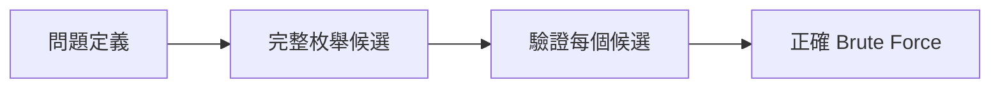
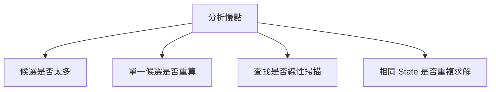
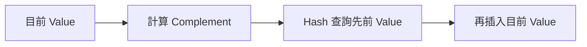
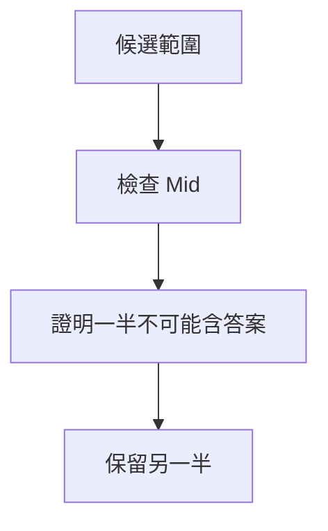
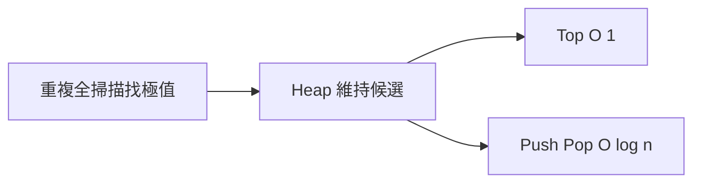
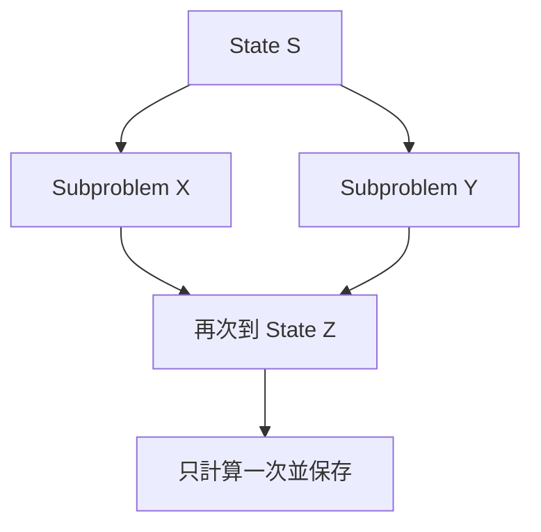
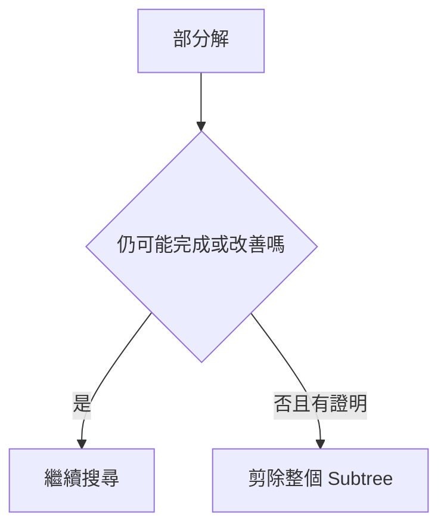
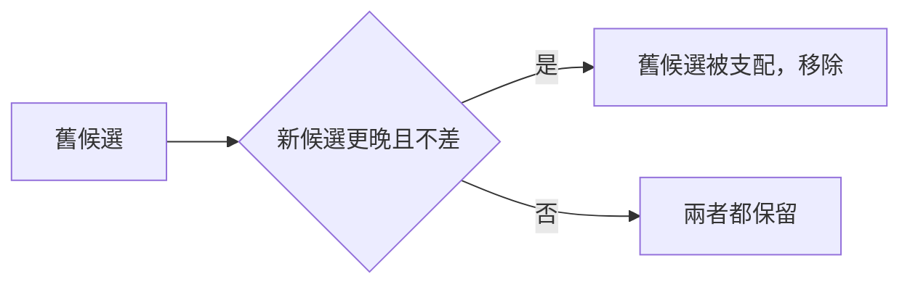
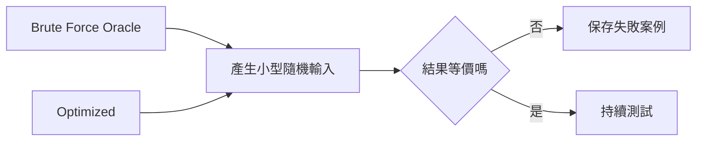

## 第 54 章　從暴力解推導最佳化

### 適用範圍

本章建立一套由 Brute Force 出發，辨識重複搜尋、重複區間計算、重複 State 與不必要候選，再逐步使用 Hash Table、Prefix Sum、Binary Search、Heap、DP 與剪枝改善的方法。

最佳化的目標不是直接換成更複雜的演算法，而是先指出目前成本花在哪裡，並只替換瓶頸，同時保留正確性與測試 Oracle。

### 54.1 從正確直接解法開始

第一版解法應做到：

- 完整涵蓋候選。
- 容易人工追蹤。
- 清楚標示每層成本。
- 能處理小型輸入。



沒有正確基準時，最佳化後即使更快，也難以判斷是否漏解。

### 54.2 拆解總成本

常見公式：

```text
總成本 = 候選數量 × 每個候選檢查成本
```

例如 O(n²) 個區間，每個重新求和 O(n)，總時間 O(n³)。



### 54.3 Hash Table 改善查找

Two Sum Brute Force 枚舉所有 Pair，O(n²)。

觀察：處理 `nums[i]` 時，只需知道 `target - nums[i]` 是否已出現。



把每次 O(n) 的先前查找改為平均 O(1)，總時間可降為平均 O(n)。先查再插可避免同一 Index 配對自己。

改善前後應保持相同 Postcondition，並測試重複值與 Overflow。

### 54.4 Prefix Sum 改善區間

Brute Force 對每個 `[left,right)` 重新加總形成 O(n³)。

第一步可固定 Left 並累加 Right，降為 O(n²)。若有大量靜態查詢，再建立 Prefix Sum：

```text
rangeSum = prefix[right] - prefix[left]
```


最佳化常有多個層次，不一定一次跳到最終方法。

### 54.5 Binary Search 縮小範圍

若候選有序或 Predicate 單調，可以把線性搜尋 O(n) 改成 O(log n)。



必要條件：

- 有序或單調分界。
- 每次更新嚴格縮小。
- 搜尋範圍涵蓋答案。

不能只因為數值範圍大就套 Binary Search。

### 54.6 Heap 維持極值

若流程反覆需要目前最小或最大候選，Brute Force 每次掃描 O(n) 可能改用 Heap 的 O(log n) Push/Pop。



應確認是否需要刪除任意元素、更新 Priority，以及 Stale Entry 如何處理。

### 54.7 DP 保存重複 State

遞迴搜尋若多條路徑到達相同 State，可使用 Memoization：



最佳化步驟：

1. 列出遞迴參數。
2. 移除不影響未來答案的資訊。
3. 將剩餘欄位定義為 State Key。
4. 保存 Result。
5. 確認 State 數與 Transition 成本。

### 54.8 剪枝

剪枝只在能證明整個 Subtree 不可能產生合法或更佳答案時成立。



剪枝常依賴：

- 非負數。
- 排序。
- 剩餘容量上界。
- 樂觀最佳值上界。

Precondition 不成立時，剪枝可能漏解。

### 54.9 移除被支配候選

Monotonic Stack、Monotonic Queue 與部分 Greedy 方法會移除不可能優於新候選的舊候選。

例如 Sliding Window Maximum：新 Index 更靠右且 Value 不小於舊 Index，舊候選永遠不會再成為答案。



必須同時證明 Value 與生命週期上的支配關係。

### 54.10 排序換取結構

排序 O(n log n) 可能換來：

- Two Pointers O(n)。
- Binary Search O(log n) 查詢。
- Greedy Scan。
- 相鄰去重。

總成本仍需包含排序。也要確認排序不破壞原 Index、穩定性或連續區間語意。

### 54.11 正確性驗證

每次改善都應回答：

1. 新 State 是否保留原問題所需資訊？
2. 被排除候選為何不可能是答案？
3. 預處理公式是否完全等價？
4. 更新順序是否使用正確版本的 State？
5. 最差輸入是否仍符合限制？



多答案問題應驗證 Postcondition，不一定比較完全相同的輸出。

### 54.12 漸進式改善案例

區間 Sum：

```text
O(n³)：枚舉 left、right，再重新求和
O(n²)：固定 left，向右累積 Sum
O(n+q)：Prefix 預處理後回答 q 次查詢
```

Two Sum：

```text
O(n²)：枚舉 Pair
平均 O(n)：Hash 保存先前 Value
O(n log n)：排序後 Two Pointers，需處理原 Index
```

不同改善版本的空間、輸出順序與 Precondition 不同，不能只比較時間。

### 54.13 停止最佳化的時機

當前解法已符合：

- 輸入規模。
- 時間限制。
- 記憶體限制。
- 可讀性與維護需求。
- 最差情況要求。

就不必為了理論上更低階的複雜度增加過多風險。

### 54.14 常見問題與判讀

| 現象 | 可能原因 | 第一輪檢查 |
|---|---|---|
| 最佳化後漏解 | 排除理由不成立 | 和 Brute Force 對拍 |
| 複雜度沒有下降 | 只搬移迴圈位置 | 計算總處理次數 |
| Hash 版本 Index 錯誤 | State 保存不足 | Key 與 Value 的語意 |
| Prefix 版本差一格 | 區間定義混用 | 統一 `[left,right)` |
| Binary Search 死迴圈 | 新區間未縮小 | 兩元素案例 |
| DP Memo Key 錯誤 | 合併了未來行為不同的 State | 列出所有影響欄位 |
| 剪枝在負數漏解 | 單調 Precondition 不成立 | 建立反例 |
| Heap 記憶體增加 | Stale Entry 未清理或候選過多 | Pop 時驗證 |
| 排序版無法回傳原 Index | 未保存位置 | 排序 Pair `(value,index)` |

### 54.15 本章檢查表

- 我先建立正確且可驗證的直接解法。
- 我能拆分候選數量與單一候選成本。
- 我能指出真正的重複搜尋或計算。
- 我知道 Hash、Prefix、Binary Search、Heap、DP 各改善哪種瓶頸。
- 我能說明每個被排除候選的理由。
- 我會檢查排序、單調性與剪枝 Precondition。
- 我保留 Brute Force 作為小型 Oracle。
- 我會比較時間、空間、最差情況與可讀性。

### 54.16 本章重點

- 最佳化應從正確 Brute Force 與精確成本分析開始。
- Hash Table 改善重複查找，Prefix Sum 改善重複區間計算。
- Binary Search 利用單調分界縮小候選範圍。
- Heap 適合反覆維持目前極值，DP 適合保存重複 State。
- 剪枝與被支配候選移除都需要正確性證明。
- 排序可換取結構，但必須計入排序成本與語意變化。
- 每次改善都應和直接解法對拍，並測試反例與邊界。
- 符合實際限制後即可停止，不必為複雜度標籤犧牲可靠性。
