### 第 54 章　從暴力解推導最佳化

#### 適用範圍

本章建立一套由 Brute Force 出發，逐步推導改善方法的流程。目標不是一看到題目就直接套 Hash Table、Prefix Sum、Binary Search、Heap、DP 或剪枝，而是先回答三個問題：

1. 目前直接解法完整嗎？
2. 成本主要花在哪裡？
3. 哪個資料性質可以減少這個成本？

原始章節已經整理出本章核心：從 Brute Force 出發，辨識重複搜尋、重複區間計算、重複 State 與不必要候選，再逐步使用 Hash Table、Prefix Sum、Binary Search、Heap、DP 與剪枝改善。原始章節也提醒，最佳化的目標不是直接換成更複雜的演算法，而是指出目前成本花在哪裡，只替換瓶頸，同時保留正確性與測試 Oracle。citeturn36search1

本章會補上更細的推導方法：如何列候選空間、如何拆成本、如何判斷該用哪個工具、如何避免改善後漏解，以及如何知道何時該停止改善。

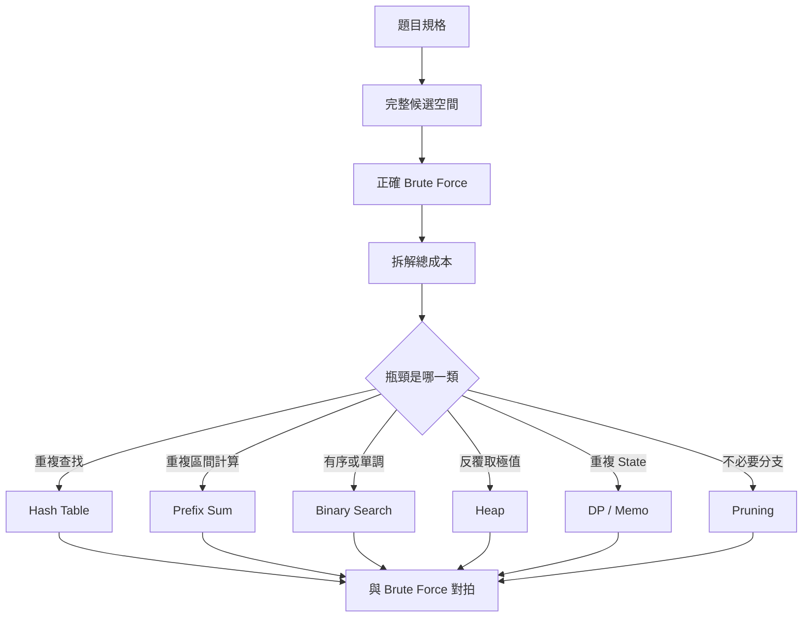

#### 適用讀者

- 能寫出直接解法，但不知道如何改善的讀者。
- 看到題目關鍵字就急著套演算法，卻容易漏掉前置條件的讀者。
- 想了解 Hash、Prefix、Binary Search、Heap、DP、剪枝各自改善哪種瓶頸的讀者。
- 改善後常出現漏解、Index 錯誤、State 不足或複雜度沒有下降的讀者。
- 想把 Brute Force 保留成 Oracle，使用對拍驗證改善版的讀者。

#### 快速導覽

- [54.1 從正確直接解法開始](#541-從正確直接解法開始)
- [54.2 拆解總成本](#542-拆解總成本)
- [54.3 重複查找：Hash Table](#543-重複查找hash-table)
- [54.4 重複區間計算：Prefix Sum](#544-重複區間計算prefix-sum)
- [54.5 有序或單調：Binary Search](#545-有序或單調binary-search)
- [54.6 反覆取極值：Heap](#546-反覆取極值heap)
- [54.7 重複 State：DP 與 Memoization](#547-重複-statedp-與-memoization)
- [54.8 不必要分支：剪枝](#548-不必要分支剪枝)
- [54.9 被支配候選：Monotonic 結構](#549-被支配候選monotonic-結構)
- [54.10 排序換取結構](#5410-排序換取結構)
- [54.11 正確性驗證](#5411-正確性驗證)
- [54.12 漸進式改善案例](#5412-漸進式改善案例)
- [54.13 何時停止改善](#5413-何時停止改善)
- [54.14 改善方法選擇表](#5414-改善方法選擇表)
- [54.15 常見問題與判讀](#5415-常見問題與判讀)
- [54.16 本章檢查表](#5416-本章檢查表)
- [54.17 本章重點](#5417-本章重點)

#### 54.1 從正確直接解法開始

第一版解法應做到：

- 完整涵蓋候選。
- 容易人工追蹤。
- 清楚標示每層成本。
- 能處理小型輸入。

原始章節也指出，沒有正確基準時，最佳化後即使更快，也難以判斷是否漏解。citeturn36search1

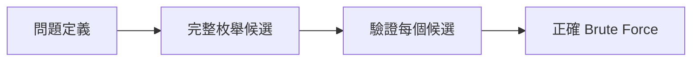

##### 為什麼要先寫 Brute Force

Brute Force 有三個用途：

1. **確認候選空間**：你知道答案可能在哪裡。
2. **建立正確性基準**：小資料時可作為 Oracle。
3. **暴露瓶頸**：你能看到重複查找、重複加總或重複 State。

例如 Two Sum：

```text
候選 = 所有 i < j 的 Pair
檢查 = nums[i] + nums[j] 是否等於 target
```

直接解法雖然是 O(n²)，但它完整列出所有可能配對，因此適合作為正確性基準。

##### 直接解法不等於隨便寫

直接解法仍要處理：

- 空輸入。
- 單一元素。
- 重複值。
- 負數。
- 最大值造成的 Overflow。
- 是否允許使用同一個 Index。

否則後續改善會建立在不可靠的基準上。

#### 54.2 拆解總成本

改善前要拆解成本。常見公式：

```text
總成本 = 候選數量 × 每個候選檢查成本
```

原始章節也用區間 Sum 舉例：O(n²) 個區間，每個重新求和 O(n)，總時間 O(n³)。citeturn36search1

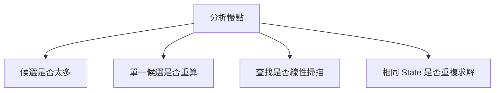

##### 常見成本拆解

<table>
<tr><th>題型</th><th>候選數量</th><th>單一候選成本</th><th>總成本</th></tr>
<tr><td>Two Sum Brute Force</td><td>O(n²) Pair</td><td>O(1)</td><td>O(n²)</td></tr>
<tr><td>所有 Subarray Sum，重新求和</td><td>O(n²) 區間</td><td>O(n)</td><td>O(n³)</td></tr>
<tr><td>所有 Subset</td><td>O(2^n)</td><td>依輸出或檢查成本</td><td>常見 O(n × 2^n)</td></tr>
<tr><td>所有 Permutation</td><td>O(n!)</td><td>依檢查成本</td><td>常見 O(n × n!)</td></tr>
<tr><td>遞迴重複 State</td><td>可能指數級</td><td>子問題重算</td><td>視重複程度</td></tr>
</table>

##### 問自己三件事

1. 候選是不是太多？
2. 每個候選檢查時是不是重複做了相同工作？
3. 是否有某個 State 被不同路徑重複求解？

不同瓶頸對應不同改善方向。

#### 54.3 重複查找：Hash Table

Hash Table 常用來改善「反覆查某個值是否已出現」的情況。

原始章節以 Two Sum 為例：Brute Force 枚舉所有 Pair 是 O(n²)，但處理 `nums[i]` 時，只需要知道 `target - nums[i]` 是否已出現，因此可用 Hash 查詢先前 Value，將總時間降為平均 O(n)。原始章節也提醒，先查再插可避免同一 Index 配對自己。citeturn36search1

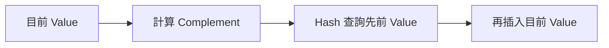

##### Brute Force

```cpp
bool twoSumBruteForce(
    const std::vector<int>& nums,
    int target)
{
    for (int i = 0; i < static_cast<int>(nums.size()); ++i)
    {
        for (int j = i + 1; j < static_cast<int>(nums.size()); ++j)
        {
            if (nums[i] + nums[j] == target)
            {
                return true;
            }
        }
    }

    return false;
}
```

##### Hash 改善

```cpp
#include <unordered_set>
#include <vector>

bool twoSumHash(
    const std::vector<int>& nums,
    int target)
{
    std::unordered_set<int> seen;

    for (int value : nums)
    {
        int complement = target - value;

        if (seen.contains(complement))
        {
            return true;
        }

        seen.insert(value);
    }

    return false;
}
```

##### 重要檢查

- Hash Set 保存的是「先前出現過的值」。
- 先查再插，避免同一個 Index 配對自己。
- 若要回傳 Index，Hash Value 應從 Set 改成 Map。
- 若 `target - value` 可能 Overflow，要使用較寬型別或重新估算值域。
- Hash 查詢是平均 O(1)，不是所有情況下都保證 O(1)。

#### 54.4 重複區間計算：Prefix Sum

Prefix Sum 常用來改善「反覆計算區間和」的情況。

原始章節指出，Brute Force 對每個 `[left, right)` 重新加總會形成 O(n³)。第一步可固定 left 並累加 right，降為 O(n²)。若有大量靜態查詢，再建立 Prefix Sum，使用 `rangeSum = prefix[right] - prefix[left]`。citeturn36search1

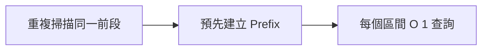

##### O(n³)：每個區間重新求和

```cpp
long long maxSubarraySumCubic(const std::vector<int>& nums)
{
    long long best = std::numeric_limits<long long>::lowest();
    int n = static_cast<int>(nums.size());

    for (int left = 0; left < n; ++left)
    {
        for (int right = left; right < n; ++right)
        {
            long long sum = 0;

            for (int i = left; i <= right; ++i)
            {
                sum += nums[i];
            }

            best = std::max(best, sum);
        }
    }

    return best;
}
```

##### O(n²)：固定 left，向右累加

```cpp
long long maxSubarraySumQuadratic(const std::vector<int>& nums)
{
    long long best = std::numeric_limits<long long>::lowest();
    int n = static_cast<int>(nums.size());

    for (int left = 0; left < n; ++left)
    {
        long long sum = 0;

        for (int right = left; right < n; ++right)
        {
            sum += nums[right];
            best = std::max(best, sum);
        }
    }

    return best;
}
```

##### Prefix Sum：多次靜態查詢

```cpp
std::vector<long long> buildPrefix(const std::vector<int>& nums)
{
    std::vector<long long> prefix(nums.size() + 1, 0);

    for (int i = 0; i < static_cast<int>(nums.size()); ++i)
    {
        prefix[i + 1] = prefix[i] + nums[i];
    }

    return prefix;
}

long long rangeSum(
    const std::vector<long long>& prefix,
    int left,
    int right)
{
    return prefix[right] - prefix[left];
}
```

##### 重要檢查

- `prefix[i]` 包含原資料 `[0, i)`。
- `rangeSum(left, right)` 使用半開區間 `[left, right)`。
- 若資料會動態更新，普通 Prefix Sum 更新成本可能是 O(n)。
- Sum 可能超過 int，Prefix Array 常用 `long long`。

#### 54.5 有序或單調：Binary Search

Binary Search 用來改善「候選空間具有排序或單調分界」的情況。

原始章節指出，如果候選有序或 Predicate 單調，可以把線性搜尋 O(n) 改為 O(log n)，但必要條件是有序或單調分界、每次更新嚴格縮小、搜尋範圍涵蓋答案。不能只因數值範圍大就套 Binary Search。citeturn36search1

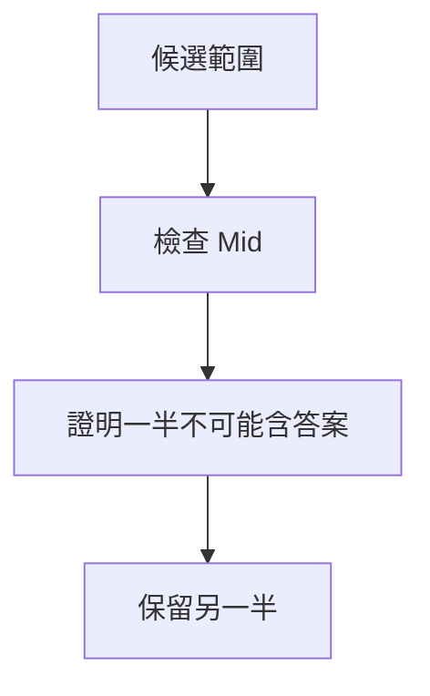

##### Binary Search 改善的不是所有搜尋

可以使用 Binary Search 的情況：

- 已排序 Array 中找 Lower Bound。
- 答案範圍存在 First True / Last True。
- Predicate 具有單調性。

不適合的情況：

- 候選沒有順序。
- Predicate 不單調。
- 每次檢查 Mid 無法排除一半。

##### First True 模板

```cpp
int firstTrue(int left, int right)
{
    // 搜尋 [left, right) 中第一個 true
    while (left < right)
    {
        int mid = left + (right - left) / 2;

        if (predicate(mid))
        {
            right = mid;
        }
        else
        {
            left = mid + 1;
        }
    }

    return left;
}
```

##### 重要檢查

- Predicate 是否真的單調？
- `left`、`right` 是否涵蓋答案？
- 每次更新是否嚴格縮小？
- `mid` 計算是否避免 Overflow？
- 回傳的是 Index、Value，還是答案候選？

#### 54.6 反覆取極值：Heap

Heap 適合改善「反覆需要目前最小或最大候選」的情況。

原始章節指出，若流程反覆需要目前最小或最大候選，Brute Force 每次掃描 O(n) 可能改用 Heap，以 O(log n) Push / Pop 維持候選，Top 為 O(1)。也要確認是否需要刪除任意元素、更新 Priority，以及 Stale Entry 如何處理。citeturn36search1

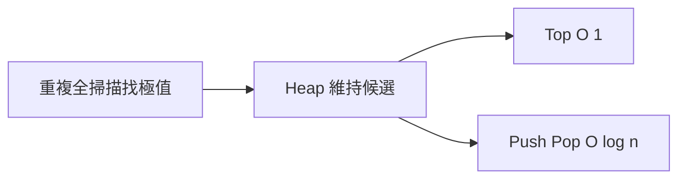

##### 適合 Heap 的場景

- 每次要取目前最小距離。
- 每次要取目前最大收益。
- 只需要 Top K。
- 多個排序序列合併。
- 事件依時間或優先權處理。

##### 不適合只用 Heap 的場景

- 需要快速查任意值是否存在。
- 需要快速刪除任意元素。
- 需要完整排序走訪全部元素。
- 需要 Lower Bound 或 Range Query。

##### Stale Entry

Dijkstra 常見寫法會把同一 Node 的多個距離放入 Heap。取出時要檢查是否過期：

```cpp
if (distance != best[node])
{
    continue;
}
```

#### 54.7 重複 State：DP 與 Memoization

DP 適合改善「相同 State 被不同路徑重複求解」的情況。

原始章節指出，遞迴搜尋若多條路徑到達相同 State，可使用 Memoization，只計算一次並保存結果；最佳化步驟包含列出遞迴參數、移除不影響未來答案的資訊、定義 State Key、保存 Result，並確認 State 數與 Transition 成本。citeturn36search1

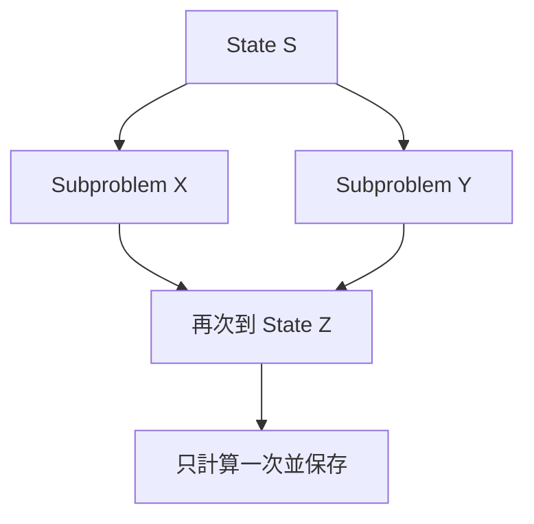

##### 從遞迴到 Memo

以 Fibonacci 為例：

```cpp
long long fibMemo(int n, std::vector<long long>& memo)
{
    if (n <= 1)
    {
        return n;
    }

    if (memo[n] != -1)
    {
        return memo[n];
    }

    memo[n] = fibMemo(n - 1, memo) + fibMemo(n - 2, memo);
    return memo[n];
}
```

##### State Key 檢查

State Key 必須保留所有會影響未來答案的資訊。

若兩個情況未來合法選擇不同，卻被合併成同一個 State，就會出錯。

檢查問題：

- 遞迴參數中哪些會影響後續選擇？
- 哪些只是歷史資訊，不影響未來？
- Memo 的 Key 是否足以區分不同未來？
- Result 是否只依賴 State，而非其他外部 Mutable State？

#### 54.8 不必要分支：剪枝

剪枝只在能證明整個 Subtree 不可能產生合法或更佳答案時成立。

原始章節也指出，剪枝常依賴非負數、排序、剩餘容量上界、樂觀最佳值上界；Precondition 不成立時，剪枝可能漏解。citeturn36search1

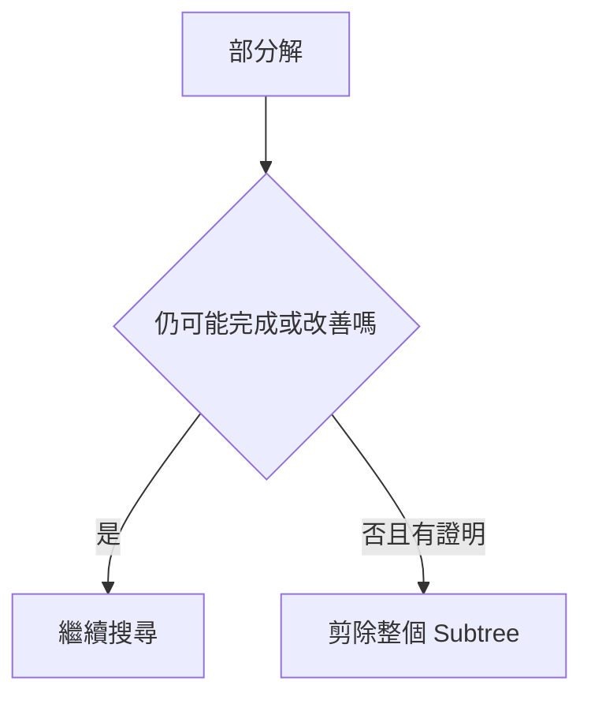

##### 剪枝成立例子

Subset Sum 若所有剩餘數字都是非負數，且目前 sum 已經大於 target，則繼續加入只會更大，因此可以剪枝。

##### 剪枝不成立例子

若剩餘數字可能有負數，sum 超過 target 後仍可能透過負數降回 target。這時直接剪枝會漏解。

##### 剪枝檢查

- 剪掉的分支是否真的不可能成功？
- 是否依賴資料排序？
- 是否依賴非負數？
- 是否依賴目前最好答案？
- 是否能建出反例？

#### 54.9 被支配候選：Monotonic 結構

有些候選會被新候選完全取代，未來不可能成為答案。

原始章節以 Sliding Window Maximum 為例：新 Index 更靠右且 Value 不小於舊 Index，舊候選永遠不會再成為答案。這需要同時證明 Value 與生命週期上的支配關係。citeturn36search1

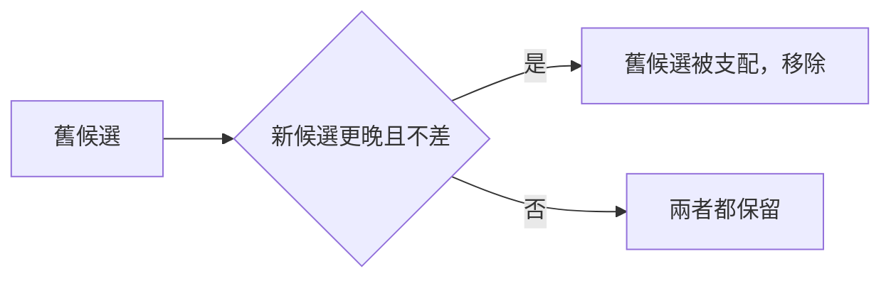

##### Sliding Window Maximum

使用 Monotonic Deque：

- Deque 中 Index 由左到右遞增。
- 對應 Value 由左到右遞減。
- 新元素進來時，移除所有比它小或等於它且更舊的候選。
- 視窗左端移動時，移除過期 Index。

##### 支配條件

一個候選被移除，需要同時確認：

- 新候選在 Value 上不差。
- 新候選在生命週期上更晚過期或不更早過期。
- 未來所有查詢中，舊候選都不可能勝過新候選。

#### 54.10 排序換取結構

排序 O(n log n) 可能換來：

- Two Pointers O(n)。
- Binary Search O(log n) 查詢。
- Greedy Scan。
- 相鄰去重。
- 區間合併。

原始章節也提醒，總成本仍需包含排序，且要確認排序不破壞原 Index、穩定性或連續區間語意。citeturn36search1

##### Two Sum：排序版本

若只需判斷是否存在 Pair，可以排序後 Two Pointers。

但若需要回傳原 Index，排序時必須保存原位置：

```cpp
std::vector<std::pair<int, int>> pairs;

for (int i = 0; i < static_cast<int>(nums.size()); ++i)
{
    pairs.push_back({nums[i], i});
}

std::sort(pairs.begin(), pairs.end());
```

##### 排序前檢查

- 題目是否允許修改輸入？
- 是否需要原始 Index？
- 相同 Key 是否需要保留原順序？
- 排序後是否破壞「連續 Subarray」語意？
- 排序成本是否可接受？

#### 54.11 正確性驗證

每次改善都應回答：

- 新 State 是否保留原問題所需資訊？
- 被排除候選為何不可能是答案？
- 預處理公式是否完全等價？
- 更新順序是否使用正確版本的 State？
- 最差輸入是否仍符合限制？

原始章節也列出了這些正確性驗證問題，並提醒多答案問題應驗證 Postcondition，不一定比較完全相同的輸出。citeturn36search1

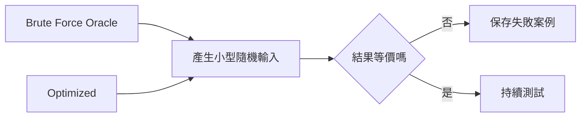

##### 對拍流程

1. 產生小型隨機輸入。
2. 執行 Brute Force。
3. 執行改善版。
4. 比較 Postcondition。
5. 若不同，保存失敗案例。
6. 將失敗案例縮小。

##### 多答案問題

如果題目允許多個合法答案，不要只比較輸出字串完全相同。應檢查：

- 是否符合輸出格式。
- 是否使用合法元素或 Index。
- 是否滿足題目條件。
- 成本或長度是否符合最佳性要求。

#### 54.12 漸進式改善案例

原始章節列出兩個漸進式改善案例：區間 Sum 從 O(n³) 到 O(n²) 再到 Prefix，Two Sum 從 O(n²) 到 Hash 平均 O(n)，也可排序後 Two Pointers。原始章節也提醒，不同改善版本的空間、輸出順序與 Precondition 不同，不能只比較時間。citeturn36search1

##### 區間 Sum

```text
O(n³)：枚舉 left、right，再重新求和
O(n²)：固定 left，向右累積 sum
O(n + q)：Prefix 預處理後回答 q 次查詢
```

比較：

<table>
<tr><th>版本</th><th>時間</th><th>空間</th><th>適用情況</th></tr>
<tr><td>重新求和</td><td>O(n³)</td><td>O(1)</td><td>只作為最直覺基準</td></tr>
<tr><td>固定 left 累加</td><td>O(n²)</td><td>O(1)</td><td>枚舉所有區間且每次只需 Sum</td></tr>
<tr><td>Prefix Sum</td><td>Build O(n)，Query O(1)</td><td>O(n)</td><td>多次靜態 Range Query</td></tr>
</table>

##### Two Sum

```text
O(n²)：枚舉 Pair
平均 O(n)：Hash 保存先前 Value
O(n log n)：排序後 Two Pointers，需處理原 Index
```

比較：

<table>
<tr><th>版本</th><th>時間</th><th>空間</th><th>注意事項</th></tr>
<tr><td>枚舉 Pair</td><td>O(n²)</td><td>O(1)</td><td>可作 Oracle</td></tr>
<tr><td>Hash</td><td>平均 O(n)</td><td>O(n)</td><td>需處理重複值與 Index</td></tr>
<tr><td>排序 + Two Pointers</td><td>O(n log n)</td><td>視是否複製</td><td>若需原 Index，要保存 Pair</td></tr>
</table>

#### 54.13 何時停止改善

當前解法已符合：

- 輸入規模。
- 時間限制。
- 記憶體限制。
- 可讀性與維護需求。
- 最差情況要求。

就不必為了理論上更低階的複雜度增加過多風險。原始章節也明確提出，符合實際限制後即可停止，不必為複雜度標籤犧牲可靠性。citeturn36search1

##### 停止前問三件事

1. 是否已用最差資料測試？
2. 是否已與 Brute Force 對拍小資料？
3. 改善後程式是否仍容易解釋與維護？

如果答案都是「是」，通常可以停止。

#### 54.14 改善方法選擇表

<table>
<tr><th>觀察到的瓶頸</th><th>可考慮方法</th><th>前置條件</th></tr>
<tr><td>反覆查某值是否出現</td><td>Hash Table</td><td>Key 可 Hash，平均成本可接受</td></tr>
<tr><td>反覆計算區間和</td><td>Prefix Sum</td><td>資料多為靜態，Query 可由 Prefix 組合</td></tr>
<tr><td>候選具單調分界</td><td>Binary Search</td><td>Predicate 單調，範圍涵蓋答案</td></tr>
<tr><td>反覆取最小或最大</td><td>Heap</td><td>只需 Top，能處理 Stale Entry</td></tr>
<tr><td>相同 State 重複出現</td><td>Memoization / DP</td><td>State Key 完整且可保存 Result</td></tr>
<tr><td>整個分支不可能成功</td><td>剪枝</td><td>有可證明的上界或不可能條件</td></tr>
<tr><td>舊候選永遠不如新候選</td><td>Monotonic Stack / Queue</td><td>Value 與生命週期皆被支配</td></tr>
<tr><td>排序後結構更明顯</td><td>Sort + Scan / Two Pointers</td><td>排序不破壞所需語意</td></tr>
</table>

#### 54.15 常見問題與判讀

原始章節已列出許多常見現象，例如最佳化後漏解、複雜度沒有下降、Hash 版本 Index 錯誤、Prefix 差一格、Binary Search 死迴圈、DP Memo Key 錯誤、剪枝在負數漏解、Heap 記憶體增加、排序版無法回傳原 Index 等。citeturn36search1

<table>
<tr><th>現象</th><th>可能原因</th><th>第一輪檢查</th></tr>
<tr><td>最佳化後漏解</td><td>排除理由不成立</td><td>和 Brute Force 對拍</td></tr>
<tr><td>複雜度沒有下降</td><td>只搬移迴圈位置</td><td>計算總處理次數</td></tr>
<tr><td>Hash 版本 Index 錯誤</td><td>State 保存不足</td><td>Key 與 Value 的語意</td></tr>
<tr><td>Prefix 版本差一格</td><td>區間定義混用</td><td>統一 `[left, right)`</td></tr>
<tr><td>Binary Search 死迴圈</td><td>新區間未縮小</td><td>用兩元素案例檢查</td></tr>
<tr><td>DP Memo Key 錯誤</td><td>合併了未來行為不同的 State</td><td>列出所有影響未來的欄位</td></tr>
<tr><td>剪枝在負數漏解</td><td>單調 Precondition 不成立</td><td>建立反例</td></tr>
<tr><td>Heap 記憶體增加</td><td>Stale Entry 未清理或候選過多</td><td>Pop 時驗證</td></tr>
<tr><td>排序版無法回傳原 Index</td><td>未保存位置</td><td>排序 Pair `(value, index)`</td></tr>
<tr><td>Monotonic Queue 答案錯</td><td>只證明 Value 支配，漏掉生命週期</td><td>檢查 Index 是否更晚過期</td></tr>
<tr><td>改善後更慢</td><td>資料規模太小或常數過大</td><td>量測實際 Workload</td></tr>
</table>

#### 54.16 本章檢查表

- 我先建立正確且可驗證的直接解法。
- 我能拆分候選數量與單一候選成本。
- 我能指出真正的重複搜尋或計算。
- 我知道 Hash、Prefix、Binary Search、Heap、DP 各改善哪種瓶頸。
- 我能說明每個被排除候選的理由。
- 我會檢查排序、單調性與剪枝 Precondition。
- 我能判斷 State Key 是否包含所有影響未來的資訊。
- 我會檢查 Monotonic 結構中的 Value 與生命週期支配。
- 我保留 Brute Force 作為小型 Oracle。
- 我會比較時間、空間、最差情況與可讀性。
- 我知道何時應停止改善。

原始章節也包含相同方向的檢查表：先建立正確直接解法、拆候選數量與單一候選成本、指出重複搜尋或計算、理解 Hash / Prefix / Binary Search / Heap / DP 的瓶頸類型、說明排除候選理由、檢查前置條件、保留 Brute Force 作為 Oracle，並比較時間、空間、最差情況與可讀性。citeturn36search1

#### 54.17 本章重點

- 最佳化應從正確 Brute Force 與精確成本分析開始。
- Hash Table 改善重複查找，Prefix Sum 改善重複區間計算。
- Binary Search 利用單調分界縮小候選範圍。
- Heap 適合反覆維持目前極值，DP 適合保存重複 State。
- 剪枝與被支配候選移除都需要正確性證明。
- 排序可換取結構，但必須計入排序成本與語意變化。
- 每次改善都應和直接解法對拍，並測試反例與邊界。
- 不同改善版本常有不同空間成本、Postcondition 與前置條件。
- 符合實際限制後即可停止，不必為複雜度標籤犧牲可靠性。
