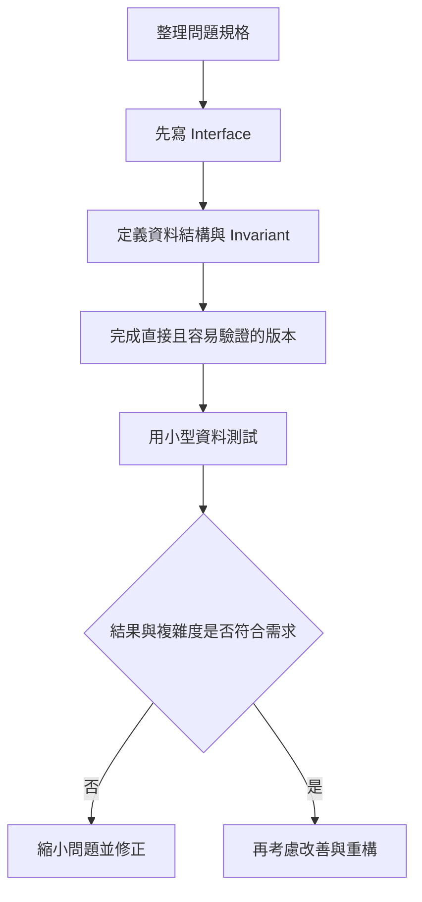
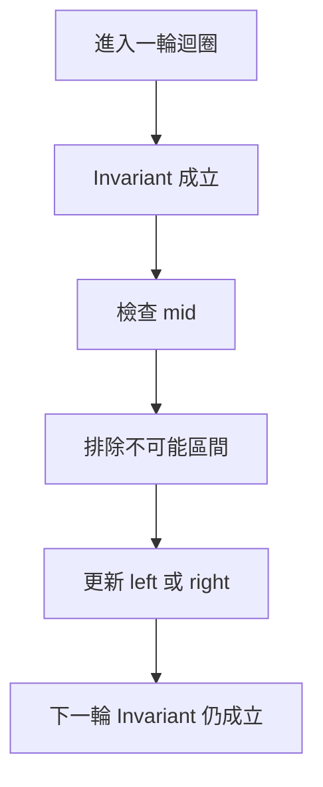

## 第 55 章　演算法實作方法

### 適用範圍

本章說明已經想出演算法後，如何將想法整理成較容易驗證、修改與除錯的 C++ 程式。

很多程式錯誤不是演算法方向錯誤，而是實作時同時處理太多事情：函式輸入還沒定義，就開始寫迴圈；區間語意尚未統一，就混用不同端點；狀態用途沒有寫清楚，就直接修改多個變數。

本章會建立一套固定流程：

- 先寫 Interface，明確定義輸入與輸出。
- 決定是否允許修改輸入。
- 寫出資料結構與 Invariant。
- 將可獨立驗證的工作拆成 Helper Function。
- 統一 Index、Iterator 與區間語意。
- 先完成容易確認正確的版本，再考慮改善。
- 使用命名、斷言與小型測試進行自我審查。



### 適用讀者

- 能說出演算法想法，但很難從空白檔案開始的讀者。
- 程式寫到一半才發現函式參數不足的讀者。
- 常混淆 Index、Iterator、閉區間與半開區間的讀者。
- 想降低函式過長、狀態分散與修改範圍過大的讀者。

### 快速導覽

- [55.1 實作前到底要分析什麼](#551-實作前到底要分析什麼)
- [55.2 先寫 Interface](#552-先寫-interface)
- [55.3 定義資料結構與 Invariant](#553-定義資料結構與-invariant)
- [55.4 Helper Function](#554-helper-function)
- [55.5 Index、Iterator 與區間](#555-indexiterator-與區間)
- [55.6 Mutable 與 Immutable State](#556-mutable-與-immutable-state)
- [55.7 避免過早改善](#557-避免過早改善)
- [55.8 命名與自我審查](#558-命名與自我審查)
- [55.9 完整案例](#559-完整案例)
- [55.10 常見問題與判讀](#5510-常見問題與判讀)
- [55.11 本章檢查表](#5511-本章檢查表)
- [55.12 本章重點](#5512-本章重點)

### 55.1 實作前到底要分析什麼

假設題目要求：給定已排序整數 Array 與 target，回傳 target 的第一個 Index，不存在時回傳 -1。

<table>
<tr><th>分析項目</th><th>本題內容</th></tr>
<tr><td>輸入</td><td>已排序整數 Array、target</td></tr>
<tr><td>輸出</td><td>第一個相等位置或 -1</td></tr>
<tr><td>是否修改輸入</td><td>否</td></tr>
<tr><td>重複值</td><td>可能存在</td></tr>
<tr><td>區間語意</td><td>使用 `[left, right)`</td></tr>
<tr><td>空輸入</td><td>回傳 -1</td></tr>
</table>

這張表會決定函式參數、`const`、區間初始值與終止條件。

### 55.2 先寫 Interface

Interface 先回答呼叫端如何使用函式：

```cpp
int findFirst(
    const std::vector<int>& nums,
    int target);
```

這個宣告表達：

- `nums` 以唯讀參考傳入，不複製也不修改。
- `target` 是要找的值。
- 回傳值是 Index，找不到以 -1 表示。

如果可能沒有答案，也可以使用 `std::optional<int>`。選擇哪一種形式取決於專案介面與題目規格。

### 55.3 定義資料結構與 Invariant

Invariant 是程式執行過程中持續成立的敘述。

Binary Search 可維護：

```text
答案若存在，一定仍在 [left, right) 中。
```

每次更新 `left` 或 `right` 後，都要保持這句話成立。



Invariant 不是額外註解，而是判斷更新是否安全的依據。

### 55.4 Helper Function

Helper Function 適合拆出：

- 有清楚輸入與輸出的子工作。
- 可獨立測試的判斷。
- 在多處重複出現的流程。
- 會讓主流程難以閱讀的細節。

例如 Merge Sort 可拆成：

```cpp
void mergeRange(...);
void mergeSortRange(...);
```

但不要只為縮短行數而拆出沒有清楚語意的函式。好的 Helper 應由名稱看出目的，而不是只有 `process()`、`handle()`。

### 55.5 Index、Iterator 與區間

使用 Index 時，要統一區間語意。

半開區間 `[left, right)`：

- 包含 left。
- 不包含 right。
- 長度為 `right - left`。
- 空區間為 `left == right`。

Iterator Range 也採半開語意：

```cpp
std::sort(nums.begin(), nums.end());
```

`end()` 指向最後元素的下一個位置，不可解參考。

### 55.6 Mutable 與 Immutable State

若函式不需修改輸入，使用 `const`：

```cpp
long long sum(const std::vector<int>& nums);
```

若演算法需要排序，但題目不允許修改輸入，可以複製：

```cpp
std::vector<int> sorted = nums;
std::sort(sorted.begin(), sorted.end());
```

Backtracking 中的 `path` 是 Mutable State。每次修改後要在返回前還原。是否修改輸入、修改哪些狀態，都應在寫程式前明確決定。

### 55.7 避免過早改善

第一版應優先：

- 容易說明。
- 容易手動追蹤。
- 容易與直接解法比較。
- 邊界條件明確。

確認正確後，再依實際瓶頸處理：

- 時間是否超出限制。
- 空間是否過高。
- 是否有明確重複工作。
- 是否值得改成較複雜的資料結構。

不要在尚未確認正確前，同時加入狀態壓縮、位元技巧與多層重構。

### 55.8 命名與自我審查

名稱應表達角色：

```cpp
left
right
mid
currentSum
bestLength
visited
parent
```

避免大量使用無法看出用途的名稱，例如 `a`、`b`、`tmp`。短名稱可用於非常局部且語意明確的迴圈 Index。

自我審查時可逐一問：

- 每個變數保存什麼？
- 它何時改變？
- 改變後哪個 Invariant 仍成立？
- 空輸入是否安全？
- 型別是否能保存最大答案？

### 55.9 完整案例

```cpp
#include <vector>

int findFirst(
    const std::vector<int>& nums,
    int target)
{
    int left = 0;
    int right = static_cast<int>(nums.size());

    // Invariant：第一個大於等於 target 的位置若存在，
    // 一定在 [left, right) 中。
    while (left < right)
    {
        int mid = left + (right - left) / 2;

        if (nums[mid] < target)
        {
            left = mid + 1;
        }
        else
        {
            right = mid;
        }
    }

    if (left < static_cast<int>(nums.size()) &&
        nums[left] == target)
    {
        return left;
    }

    return -1;
}
```

建議測試：

```text
[]，target = 3
[3]，target = 3
[1,2,2,2,4]，target = 2
[1,2,4]，target = 3
```

### 55.10 常見問題與判讀

<table>
<tr><th>現象</th><th>可能原因</th><th>第一輪檢查</th></tr>
<tr><td>寫到一半缺少資訊</td><td>Interface 未先定義</td><td>重新整理輸入、輸出與修改限制</td></tr>
<tr><td>邊界條件反覆修改</td><td>區間語意不一致</td><td>先寫出 `[left, right)` 或 `[left, right]`</td></tr>
<tr><td>函式過長</td><td>多個子工作混在一起</td><td>找出可獨立測試的 Helper</td></tr>
<tr><td>修改後其他地方出錯</td><td>共享 Mutable State 過多</td><td>縮小狀態作用範圍</td></tr>
<tr><td>改善後無法驗證</td><td>沒有保留直接版本</td><td>先用基礎解法作為參考</td></tr>
</table>

### 55.11 本章檢查表

- 我已先寫出 Input、Output 與 Interface。
- 我已確認是否允許修改輸入。
- 我能說明主要 State 與 Invariant。
- 我已統一 Index、Iterator 與區間語意。
- Helper Function 有清楚的單一目的。
- 我先完成容易驗證的版本，再考慮改善。
- 我測過空輸入、單一元素與邊界資料。
- 我能說明每個主要變數的用途與更新時機。

### 55.12 本章重點

- 實作前先定義 Interface，可以提早暴露規格缺口。
- Invariant 用來說明每次更新後仍保留哪些正確性條件。
- Helper Function 應拆分有明確輸入、輸出與目的的子工作。
- Index、Iterator 與區間語意必須保持一致。
- Mutable State 應縮小作用範圍，並明確定義還原時機。
- 第一版先追求可驗證與正確，再處理效能與重構。
