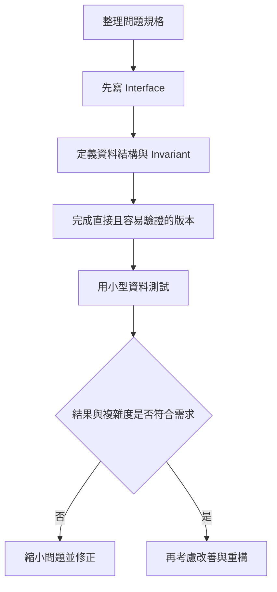
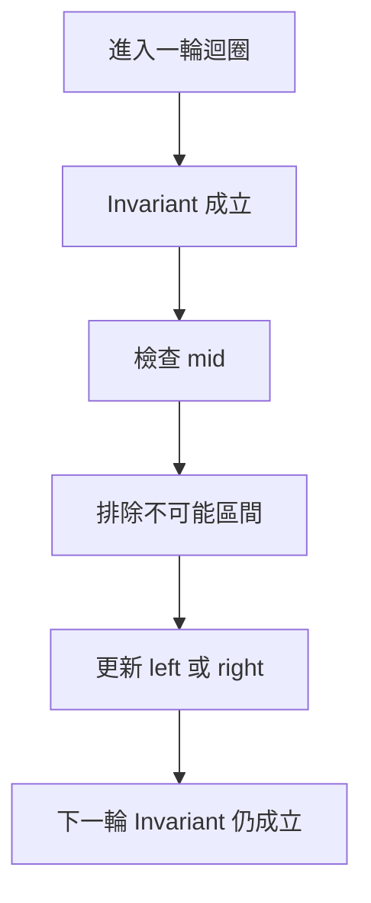
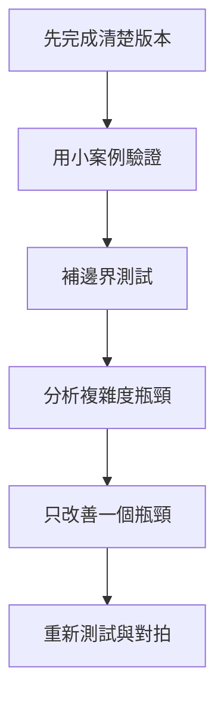

## 第 55 章　演算法實作方法

### 適用範圍

本章說明已經想出演算法後，如何將想法整理成較容易驗證、修改與除錯的 C++ 程式。

很多程式錯誤不是演算法方向錯誤，而是實作時同時處理太多事情：函式輸入還沒定義，就開始寫迴圈；區間語意尚未統一，就混用不同端點；狀態用途沒有寫清楚，就直接修改多個變數。原始章節已經建立了固定流程：先寫 Interface、定義資料結構與 Invariant、拆 Helper Function、統一 Index 與 Iterator、先完成容易驗證的版本，再考慮改善。citeturn35search1

本版會把這套流程補成更完整的實作方法，包含如何從題目規格推導函式介面、如何命名 State、如何選擇 Mutable / Immutable State、如何拆 Helper、如何建立 Postcondition 與自我審查清單。



### 適用讀者

- 能說出演算法想法，但很難從空白檔案開始的讀者。
- 程式寫到一半才發現函式參數不足的讀者。
- 常混淆 Index、Iterator、閉區間與半開區間的讀者。
- 想降低函式過長、狀態分散與修改範圍過大的讀者。
- 想建立 C++ 演算法題的固定實作流程的讀者。

### 快速導覽

- [55.1 實作前到底要分析什麼](#551-實作前到底要分析什麼)
- [55.2 先寫 Interface](#552-先寫-interface)
- [55.3 回傳型別與錯誤表示](#553-回傳型別與錯誤表示)
- [55.4 決定是否修改輸入](#554-決定是否修改輸入)
- [55.5 定義資料結構與 Invariant](#555-定義資料結構與-invariant)
- [55.6 Helper Function](#556-helper-function)
- [55.7 Index、Iterator 與區間](#557-indexiterator-與區間)
- [55.8 Mutable 與 Immutable State](#558-mutable-與-immutable-state)
- [55.9 避免過早改善](#559-避免過早改善)
- [55.10 命名與自我審查](#5510-命名與自我審查)
- [55.11 實作順序建議](#5511-實作順序建議)
- [55.12 完整案例：findFirst](#5512-完整案例findfirst)
- [55.13 完整案例：mergeIntervals](#5513-完整案例mergeintervals)
- [55.14 常見問題與判讀](#5514-常見問題與判讀)
- [55.15 實作前檢查表](#5515-實作前檢查表)
- [55.16 本章重點](#5516-本章重點)

### 55.1 實作前到底要分析什麼

假設題目要求：給定已排序整數 Array 與 target，回傳 target 的第一個 Index，不存在時回傳 -1。

先不要寫 `while`，先整理規格：

<table>
<tr><th>分析項目</th><th>本題內容</th><th>會影響的實作</th></tr>
<tr><td>輸入</td><td>已排序整數 Array、target</td><td>可使用 Binary Search</td></tr>
<tr><td>輸出</td><td>第一個相等位置或 -1</td><td>需要 Lower Bound 後再檢查相等</td></tr>
<tr><td>是否修改輸入</td><td>否</td><td>使用 `const std::vector<int>&`</td></tr>
<tr><td>重複值</td><td>可能存在</td><td>不能找到任意位置就結束</td></tr>
<tr><td>區間語意</td><td>使用 `[left, right)`</td><td>`right` 初始為 `nums.size()`</td></tr>
<tr><td>空輸入</td><td>回傳 -1</td><td>Loop 可自然不進入，最後檢查越界</td></tr>
<tr><td>Index 型別</td><td>回傳 int</td><td>需確認輸入大小可轉成 int</td></tr>
</table>

這張表會決定函式參數、`const`、區間初始值與終止條件。原始章節也用同一題示範，說明規格表會決定函式參數、`const`、區間初始值與終止條件。citeturn35search1

### 55.2 先寫 Interface

Interface 先回答呼叫端如何使用函式。

```cpp
int findFirst(
    const std::vector<int>& nums,
    int target);
```

這個宣告表達：

- `nums` 以唯讀參考傳入，不複製也不修改。
- `target` 是要找的值。
- 回傳值是 Index。
- 找不到以 -1 表示。

原始章節也指出，Interface 可以表達 `nums` 不複製、不修改，`target` 是搜尋值，回傳值是 Index。citeturn35search1

#### Interface 應先回答的問題

<table>
<tr><th>問題</th><th>可能選擇</th></tr>
<tr><td>輸入是否會被修改？</td><td>`const T&`、`T&`、`T value`</td></tr>
<tr><td>答案是否可能不存在？</td><td>`-1`、`std::optional<T>`、`bool + output parameter`</td></tr>
<tr><td>答案是否可能很多？</td><td>回傳 `std::vector<T>` 或透過 callback / output iterator</td></tr>
<tr><td>輸入是否很大？</td><td>避免不必要複製</td></tr>
<tr><td>函式是否需要保留狀態？</td><td>普通函式、class、struct context</td></tr>
</table>

#### 不好的起點

```cpp
void solve()
{
    // 直接讀全域輸入並輸出
}
```

這種寫法在競賽題可快速完成，但不利於單元測試、重用與對拍。若本章目標是建立可驗證的演算法實作，建議核心邏輯仍拆成明確輸入與輸出的函式。

### 55.3 回傳型別與錯誤表示

找不到答案時，可以用不同方式表示。

#### 使用 -1

```cpp
int findFirst(const std::vector<int>& nums, int target);
```

適合 Index 題，因為合法 Index 不可能是 -1。

#### 使用 optional

```cpp
std::optional<int> findFirstOptional(
    const std::vector<int>& nums,
    int target);
```

適合「不存在」是正常結果，且不想使用 Sentinel 的情況。

#### 使用 bool + output parameter

```cpp
bool findMinimum(
    const std::vector<int>& nums,
    int& result);
```

適合需要避免 optional，或已經有專案介面慣例時使用。

#### 回傳容器

```cpp
std::vector<int> findAllPositions(
    const std::vector<int>& nums,
    int target);
```

若答案可能很多，要記得輸出本身可能是 O(k) 空間與時間。

### 55.4 決定是否修改輸入

實作前要先確認題目是否允許修改輸入。

#### 不修改輸入

```cpp
long long sum(const std::vector<int>& nums);
```

這是唯讀輸入。

#### 原地修改

```cpp
void normalize(std::vector<int>& nums);
```

呼叫者會看到修改後的結果。

#### 需要排序但不允許修改輸入

```cpp
std::vector<int> sorted = nums;
std::sort(sorted.begin(), sorted.end());
```

這會產生 O(n) 額外空間與 O(n) 複製成本。原始章節也提醒，若演算法需要排序但題目不允許修改輸入，可以先複製再排序。citeturn35search1

#### 修改限制會影響演算法選擇

- 允許修改：可排序原資料、原地 partition、原地標記。
- 不允許修改：需複製、使用額外資料結構，或改用其他方法。
- 需要保留原 Index：排序時需保存 Pair。

### 55.5 定義資料結構與 Invariant

Invariant 是程式執行過程中特定時間點持續成立的敘述。

Binary Search 可維護：

```text
第一個不小於 target 的位置若存在，一定仍在 [left, right) 中。
```

每次更新 `left` 或 `right` 後，都要保持這句話成立。原始章節也指出，Invariant 不是額外註解，而是判斷更新是否安全的依據。citeturn35search1



#### 常見 Invariant 例子

<table>
<tr><th>題型</th><th>Invariant</th></tr>
<tr><td>Two Pointers</td><td>被排除的候選不可能成為答案</td></tr>
<tr><td>Sliding Window</td><td>Window State 恰好對應 `[left, right)` 的內容</td></tr>
<tr><td>BFS</td><td>已入列 Node 已被發現，Distance 是第一次到達距離</td></tr>
<tr><td>Heap</td><td>Top 是目前最高優先權候選，或讀取前會排除 Stale Entry</td></tr>
<tr><td>DP</td><td>已計算 State 符合 State 定義</td></tr>
<tr><td>DSU</td><td>每個集合有一個 Root，`find(x)` 回傳 Root</td></tr>
</table>

### 55.6 Helper Function

Helper Function 適合拆出：

- 有清楚輸入與輸出的子工作。
- 可獨立測試的判斷。
- 在多處重複出現的流程。
- 會讓主流程難以閱讀的細節。

原始章節也提醒，不要只為縮短行數而拆出沒有清楚語意的函式；好的 Helper 應由名稱看出目的，而不是只有 `process()`、`handle()`。citeturn35search1

#### 好的 Helper

```cpp
bool isValidIndex(int index, int size)
{
    return 0 <= index && index < size;
}
```

語意清楚，輸入與輸出明確。

#### 不好的 Helper

```cpp
void work()
{
    // 讀取並修改多個外部狀態
}
```

這種 Helper 名稱不清楚、輸入輸出不明確，也不容易單獨測試。

#### Helper 拆分檢查

- 這個 Helper 是否有單一目的？
- 名稱是否說明它做什麼？
- 參數是否足以表達它需要的資料？
- 是否依賴太多外部 Mutable State？
- 是否能用小型資料單獨測試？

### 55.7 Index、Iterator 與區間

使用 Index 時，要統一區間語意。

半開區間 `[left, right)`：

- 包含 left。
- 不包含 right。
- 長度為 `right - left`。
- 空區間為 `left == right`。

Iterator Range 也採半開語意：

```cpp
std::sort(nums.begin(), nums.end());
```

`end()` 指向最後元素的下一個位置，不可解參考。原始章節也明確說明了這些半開區間特性。citeturn35search1

#### 閉區間與半開區間比較

<table>
<tr><th>項目</th><th>閉區間 `[left, right]`</th><th>半開區間 `[left, right)`</th></tr>
<tr><td>包含 right</td><td>是</td><td>否</td></tr>
<tr><td>長度</td><td>`right - left + 1`</td><td>`right - left`</td></tr>
<tr><td>空區間</td><td>通常需特殊表示</td><td>`left == right`</td></tr>
<tr><td>整個 Array</td><td>`[0, n - 1]`</td><td>`[0, n)`</td></tr>
<tr><td>STL Iterator</td><td>不是慣例</td><td>慣例</td></tr>
</table>

#### 實作規則

同一個函式內不要混用兩套語意。若函式接收 `[left, right)`，Helper 也應維持相同語意，除非名稱與註解明確轉換。

### 55.8 Mutable 與 Immutable State

Mutable State 是會在演算法過程中改變的狀態。Immutable State 是初始化後不再改變或應視為唯讀的資料。

#### Immutable State

```cpp
int target;
const std::vector<int>& nums;
```

這類資料應盡量不被修改，避免推理變複雜。

#### Mutable State

```cpp
int left;
int right;
std::vector<int> path;
std::vector<bool> visited;
```

Mutable State 需要回答：

- 何時初始化？
- 何時修改？
- 修改後哪個 Invariant 成立？
- 是否需要還原？
- 作用範圍是否能縮小？

#### Backtracking 中的 Mutable State

```cpp
path.push_back(value);
backtrack(...);
path.pop_back();
```

原始章節也指出，Backtracking 中的 `path` 是 Mutable State，每次修改後要在返回前還原。citeturn35search1

#### 縮小 Mutable State 作用範圍

不要把所有變數都放成全域。若 State 只在某個 Helper 中使用，就放在 Helper 裡。若需要跨遞迴共享，才透過參數或 class member 傳遞。

### 55.9 避免過早改善

第一版應優先：

- 容易說明。
- 容易手動追蹤。
- 容易與直接解法比較。
- 邊界條件明確。

原始章節也強調，第一版應先追求容易說明、容易手動追蹤、容易與直接解法比較與邊界明確。citeturn35search1

確認正確後，再依實際瓶頸處理：

- 時間是否超出限制。
- 空間是否過高。
- 是否有明確重複工作。
- 是否值得改成較複雜的資料結構。

不要在尚未確認正確前，同時加入：

- 狀態壓縮。
- 位元技巧。
- 過度模板化。
- 多層抽象。
- 巨大的巨集或全域工具。

#### 實作順序建議



### 55.10 命名與自我審查

名稱應表達角色：

```cpp
left
right
mid
currentSum
bestLength
visited
parent
distance
componentCount
```

避免大量使用無法看出用途的名稱，例如 `a`、`b`、`tmp`。短名稱可用於非常局部且語意明確的迴圈 Index。原始章節也列出類似命名建議。citeturn35search1

#### 命名對照

<table>
<tr><th>不清楚</th><th>較清楚</th></tr>
<tr><td>`x`</td><td>`target`、`currentValue`</td></tr>
<tr><td>`ans`</td><td>`bestLength`、`minimumCost`、`componentCount`</td></tr>
<tr><td>`flag`</td><td>`found`、`isValid`、`hasCycle`</td></tr>
<tr><td>`arr`</td><td>`nums`、`costs`、`intervals`</td></tr>
<tr><td>`mp`</td><td>`frequency`、`indexByValue`、`parentByNode`</td></tr>
</table>

#### 自我審查問題

原始章節已列出：每個變數保存什麼、何時改變、改變後哪個 Invariant 仍成立、空輸入是否安全、型別是否能保存最大答案。citeturn35search1

可以再補上：

- 函式是否修改輸入？
- 變數作用範圍是否過大？
- Helper 是否有單一目的？
- 是否有 Sentinel 與合法值衝突？
- 是否已測試空、一筆、兩筆資料？
- 是否有必要保留直接解法做對拍？

### 55.11 實作順序建議

實作一題時，可依序進行：

1. 寫一句題目摘要。
2. 寫 Interface。
3. 寫 Input / Output / Constraint 表。
4. 寫主要 State 與 Invariant。
5. 寫最小可編譯版本。
6. 補主流程。
7. 跑最小測試。
8. 跑邊界測試。
9. 補 Helper 或重構。
10. 分析複雜度。
11. 若需要，再改善效能。

#### 最小可編譯版本

```cpp
#include <vector>

int findFirst(
    const std::vector<int>& nums,
    int target)
{
    return -1;
}
```

先確定 Interface 與 Include 正確，再逐步補內容。這能避免寫很久後才發現參數型別或回傳型別不合適。

### 55.12 完整案例：findFirst

題目：給定已排序整數 Array 與 target，回傳 target 第一次出現的位置，若不存在回傳 -1。

#### Interface

```cpp
int findFirst(
    const std::vector<int>& nums,
    int target);
```

#### Invariant

```text
第一個不小於 target 的位置若存在，一定在 [left, right) 中。
```

#### 程式

```cpp
#include <vector>

int findFirst(
    const std::vector<int>& nums,
    int target)
{
    int left = 0;
    int right = static_cast<int>(nums.size());

    while (left < right)
    {
        int mid = left + (right - left) / 2;

        if (nums[mid] < target)
        {
            left = mid + 1;
        }
        else
        {
            right = mid;
        }
    }

    if (left < static_cast<int>(nums.size()) &&
        nums[left] == target)
    {
        return left;
    }

    return -1;
}
```

這是原始章節完整案例的修正版，補齊了 `std::vector<int>` 與 `static_cast<int>`，讓程式可直接編譯。原始章節也使用相同 Invariant 與 `[left, right)` Binary Search。citeturn35search1

#### 測試

```text
[]，target = 3 -> -1
[3]，target = 3 -> 0
[3]，target = 4 -> -1
[1,2,2,2,4]，target = 2 -> 1
[1,2,4]，target = 3 -> -1
[1,2,4]，target = 0 -> -1
[1,2,4]，target = 5 -> -1
```

### 55.13 完整案例：mergeIntervals

題目：給定多個閉區間 `[start, end]`，合併重疊區間。

#### 規格整理

<table>
<tr><th>分析項目</th><th>本題內容</th></tr>
<tr><td>輸入</td><td>多個 Interval</td></tr>
<tr><td>輸出</td><td>合併後互不重疊的 Interval</td></tr>
<tr><td>是否修改輸入</td><td>可選；此版本傳值，排序副本</td></tr>
<tr><td>區間語意</td><td>閉區間</td></tr>
<tr><td>重疊條件</td><td>`current.start <= last.end`</td></tr>
</table>

#### Interface

```cpp
std::vector<Interval> mergeIntervals(
    std::vector<Interval> intervals);
```

這裡故意以 Value 傳入，表示函式可以排序自己的副本，不修改呼叫端原始資料。

#### 程式

```cpp
#include <algorithm>
#include <vector>

struct Interval
{
    int start;
    int end;
};

std::vector<Interval> mergeIntervals(
    std::vector<Interval> intervals)
{
    if (intervals.empty())
    {
        return {};
    }

    std::sort(
        intervals.begin(),
        intervals.end(),
        [](const Interval& a, const Interval& b)
        {
            if (a.start != b.start)
            {
                return a.start < b.start;
            }

            return a.end < b.end;
        });

    std::vector<Interval> merged;
    merged.push_back(intervals[0]);

    for (int i = 1; i < static_cast<int>(intervals.size()); ++i)
    {
        Interval& last = merged.back();
        const Interval& current = intervals[i];

        if (current.start <= last.end)
        {
            last.end = std::max(last.end, current.end);
        }
        else
        {
            merged.push_back(current);
        }
    }

    return merged;
}
```

#### 實作重點

- Interface 以 Value 傳入，允許排序副本。
- Comparator 使用 `<`，不是 `<=`。
- `last.end` 使用 `max`，避免被包含區間縮短。
- 空輸入先處理。
- `merged.back()` 是目前合併結果的最後區間，不一定是原始上一個區間。

### 55.14 常見問題與判讀

原始章節列出常見現象，例如寫到一半缺少資訊、邊界條件反覆修改、函式過長、共享 Mutable State 過多、改善後無法驗證。citeturn35search1

<table>
<tr><th>現象</th><th>可能原因</th><th>第一輪檢查</th></tr>
<tr><td>寫到一半缺少資訊</td><td>Interface 未先定義</td><td>重新整理輸入、輸出與修改限制</td></tr>
<tr><td>邊界條件反覆修改</td><td>區間語意不一致</td><td>先寫出 `[left, right)` 或 `[left, right]`</td></tr>
<tr><td>函式過長</td><td>多個子工作混在一起</td><td>找出可獨立測試的 Helper</td></tr>
<tr><td>修改後其他地方出錯</td><td>共享 Mutable State 過多</td><td>縮小狀態作用範圍</td></tr>
<tr><td>改善後無法驗證</td><td>沒有保留直接版本</td><td>先用基礎解法作為參考</td></tr>
<tr><td>程式可讀性差</td><td>命名只描述型別，不描述角色</td><td>改用 current、best、visited、distance 等角色名稱</td></tr>
<tr><td>Helper 反而更難懂</td><td>Helper 依賴太多外部狀態</td><td>讓 Helper 輸入輸出明確</td></tr>
<tr><td>複雜度分析困難</td><td>主流程和資料建立混在一起</td><td>拆出 Build、Query、Update 等階段</td></tr>
</table>

### 55.15 實作前檢查表

- 我已先寫出 Input、Output 與 Interface。
- 我已確認是否允許修改輸入。
- 我已決定找不到答案時如何表示。
- 我能說明主要 State 與 Invariant。
- 我已統一 Index、Iterator 與區間語意。
- Helper Function 有清楚的單一目的。
- Mutable State 的作用範圍已盡量縮小。
- 每個主要變數都有角色明確的名稱。
- 我先完成容易驗證的版本，再考慮改善。
- 我測過空輸入、單一元素與邊界資料。
- 我知道直接解法或舊版本是否能作為 Oracle。
- 我能說明每個主要變數的用途與更新時機。

原始章節的檢查表也包含 Interface、修改輸入、State / Invariant、Index / Iterator、Helper Function、容易驗證版本、邊界測試與主要變數用途等項目。citeturn35search1

### 55.16 本章重點

- 實作前先定義 Interface，可以提早暴露規格缺口。
- 回傳型別與找不到答案的表示方式，應由題目規格決定。
- 是否允許修改輸入會影響參數型別、排序方式與空間成本。
- Invariant 用來說明每次更新後仍保留哪些正確性條件。
- Helper Function 應拆分有明確輸入、輸出與目的的子工作。
- Index、Iterator 與區間語意必須保持一致。
- Mutable State 應縮小作用範圍，並明確定義還原時機。
- 第一版先追求可驗證與正確，再處理效能與重構。
- 命名應描述變數角色，而不只是型別或暫存用途。
- 完整實作流程應包含規格、Interface、Invariant、測試、複雜度與自我審查。
