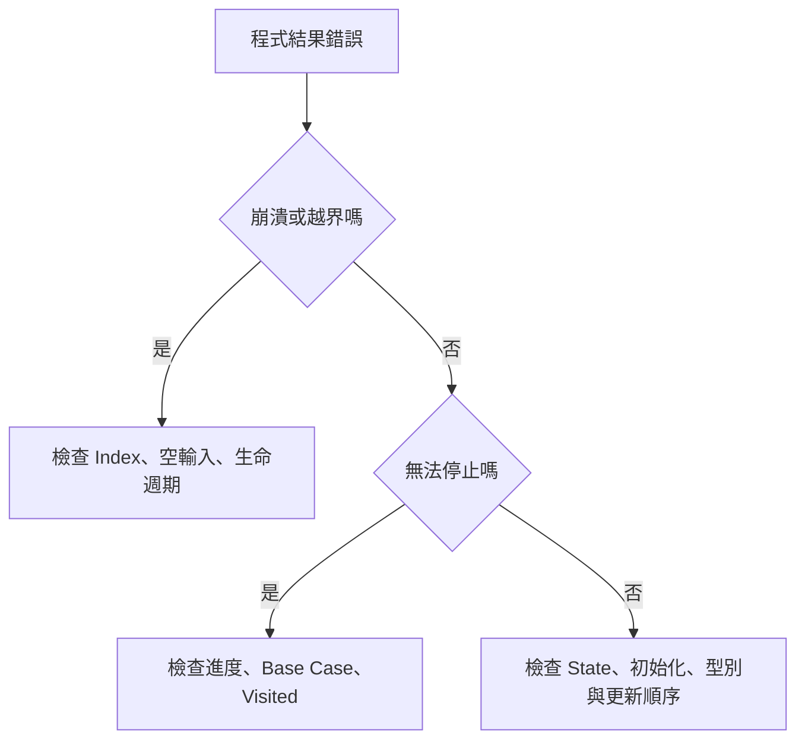

## 第 56 章　常見 Bug 類型

### 適用範圍

本章整理演算法實作中經常出現的 Bug 類型。目的不是背錯誤清單，而是看到錯誤現象時，能快速縮小檢查範圍。

原始章節已經整理出常見 Bug 來源：區間與 Index、空輸入與最小輸入、迴圈進度、遞迴 Base Case、Backtracking 狀態還原、Graph 的 Visited 時機、Integer Overflow、Comparator、過期 Heap 資料與 DP 初始化。citeturn34search1

本章會進一步補上：

- 錯誤現象如何對應到檢查方向。
- 每一類 Bug 的最小錯誤案例。
- 錯誤程式、修正程式與檢查表。
- 不同題型中，同一類 Bug 如何變形。
- 如何把 Bug 轉成 Regression Test。



### 適用讀者

- 常在小輸入正確、大輸入錯誤的讀者。
- 常在空輸入、單一元素或最後一格越界的讀者。
- Binary Search、Sliding Window 或 DP 常改 `<`、`<=` 試到通過的讀者。
- 寫 Backtracking、DFS、BFS 時常遇到重複答案或無限循環的讀者。
- 想建立 Bug 到檢查方向的對照表與 Regression Test 的讀者。

### 快速導覽

- [56.1 Bug 分類方式](#561-bug-分類方式)
- [56.2 Off-by-one 與越界](#562-off-by-one-與越界)
- [56.3 空輸入與最小輸入](#563-空輸入與最小輸入)
- [56.4 無窮迴圈](#564-無窮迴圈)
- [56.5 Base Case 與問題縮小](#565-base-case-與問題縮小)
- [56.6 Backtracking 狀態還原](#566-backtracking-狀態還原)
- [56.7 Graph 的 Visited 時機](#567-graph-的-visited-時機)
- [56.8 Integer Overflow 與 Underflow](#568-integer-overflow-與-underflow)
- [56.9 Comparator 錯誤](#569-comparator-錯誤)
- [56.10 過期 Heap 資料](#5610-過期-heap-資料)
- [56.11 DP 初始化與更新順序](#5611-dp-初始化與更新順序)
- [56.12 Pointer、Iterator 與生命週期](#5612-pointeriterator-與生命週期)
- [56.13 Modulo、Sentinel 與 INF](#5613-modulosentinel-與-inf)
- [56.14 C++ 容器常見誤用](#5614-c-容器常見誤用)
- [56.15 Bug 快速對照](#5615-bug-快速對照)
- [56.16 如何把 Bug 轉成 Regression Test](#5616-如何把-bug-轉成-regression-test)
- [56.17 本章檢查表](#5617-本章檢查表)
- [56.18 本章重點](#5618-本章重點)

### 56.1 Bug 分類方式

常見 Bug 可以依現象先分成六類：

<table>
<tr><th>現象</th><th>優先檢查</th></tr>
<tr><td>崩潰或 Runtime Error</td><td>Index 越界、空輸入、失效 Pointer、Stack Overflow</td></tr>
<tr><td>少一筆或多一筆</td><td>Off-by-one、區間端點、迴圈上下界</td></tr>
<tr><td>程式不停止</td><td>迴圈進度、遞迴 Base Case、Visited 時機</td></tr>
<tr><td>小資料錯</td><td>規格理解、Base Case、State 定義、Transition</td></tr>
<tr><td>大資料才錯</td><td>Overflow、複雜度、遞迴深度、記憶體</td></tr>
<tr><td>偶爾錯</td><td>未初始化、越界、生命週期、未固定順序</td></tr>
</table>

除錯時先判斷現象，再選擇檢查方向。不要一開始就隨機修改比較符號。

### 56.2 Off-by-one 與越界

Off-by-one 是端點多一格或少一格。原始章節也指出，合法 Index 是 0 到 `size - 1`，若迴圈使用 `i <= size` 就會越界。citeturn34search1

錯誤版本：

```cpp
for (int i = 0; i <= static_cast<int>(nums.size()); ++i)
{
    std::cout << nums[i] << '\n';
}
```

修正版本：

```cpp
for (int i = 0; i < static_cast<int>(nums.size()); ++i)
{
    std::cout << nums[i] << '\n';
}
```

#### 常見 Off-by-one 場景

<table>
<tr><th>場景</th><th>常見錯誤</th><th>檢查問題</th></tr>
<tr><td>Array 走訪</td><td>`i <= size`</td><td>最後合法 Index 是多少？</td></tr>
<tr><td>相鄰比較</td><td>`nums[i + 1]` 越界</td><td>`i + 1 < size` 是否成立？</td></tr>
<tr><td>Binary Search</td><td>left、right 更新後區間不一致</td><td>閉區間還是半開區間？</td></tr>
<tr><td>Prefix Sum</td><td>Range 少算或多算一格</td><td>`prefix[i]` 包含哪些元素？</td></tr>
<tr><td>Substring</td><td>長度與右端點混淆</td><td>第二個參數是長度還是結尾位置？</td></tr>
</table>

#### 固定檢查

- 空輸入時 `size - 1` 是否 underflow？
- `i + 1` 是否仍小於 size？
- `right` 是最後合法位置，還是下一個位置？
- `end()` 是否被解參考？
- `left == right` 表示一個元素，還是空區間？

原始章節也列出了這些固定檢查方向。citeturn34search1

### 56.3 空輸入與最小輸入

很多程式只在一般資料下成立：

```cpp
int maximum = nums[0];
```

空 Array 時會越界。原始章節也指出，應由規格決定空輸入是否非法、是否回傳 `optional`、是否有預設值，或是否由呼叫端保證非空。citeturn34search1

#### 常見安全處理方式

##### 方式一：空輸入有定義答案

```cpp
int sum(const std::vector<int>& nums)
{
    int answer = 0;

    for (int value : nums)
    {
        answer += value;
    }

    return answer;
}
```

空輸入總和自然為 0。

##### 方式二：空輸入沒有答案

```cpp
std::optional<int> maximumValue(const std::vector<int>& nums)
{
    if (nums.empty())
    {
        return std::nullopt;
    }

    int best = nums[0];

    for (int value : nums)
    {
        best = std::max(best, value);
    }

    return best;
}
```

##### 方式三：題目保證非空

即使題目保證非空，也可以在註解或 Interface 中寫清楚前置條件。正式系統中則可能仍需防禦式檢查。

#### 建議基本測試

```text
[]
[x]
[x, y]
```

原始章節也建議先測空輸入、單一元素與兩個元素。citeturn34search1

### 56.4 無窮迴圈

迴圈必須有明確進度。原始章節也提醒，檢查時應問：「每一輪後，哪個量一定變小或更接近終止條件？」citeturn34search1

#### Binary Search 常見問題

```cpp
left = mid;
```

若 `mid == left`，區間可能不再縮小。

錯誤例子：

```cpp
while (left < right)
{
    int mid = left + (right - left) / 2;

    if (condition(mid))
    {
        left = mid;
    }
    else
    {
        right = mid - 1;
    }
}
```

若 `left + 1 == right`，mid 可能等於 left，`left = mid` 不會前進。

#### 迴圈 Debug 表

<table>
<tr><th>輪次</th><th>left</th><th>right</th><th>mid</th><th>更新</th><th>是否縮小</th></tr>
<tr><td>1</td><td>0</td><td>1</td><td>0</td><td>`left = mid`</td><td>否</td></tr>
</table>

#### 常見原因

- Index 沒有更新。
- 更新後又被重設。
- 浮點比較永遠不達到精確相等。
- 遞迴參數沒有縮小。
- Graph 沒有 visited，一直繞 Cycle。

### 56.5 Base Case 與問題縮小

遞迴 Bug 常來自：

- Base Case 缺少最小輸入。
- Recursive Case 沒有縮小問題。
- Backtracking 離開分支前沒有還原狀態。

原始章節也列出這三個常見來源。citeturn34search1

#### 錯誤：少處理 n == 0

```cpp
int factorial(int n)
{
    if (n == 1)
    {
        return 1;
    }

    return n * factorial(n - 1);
}
```

若 `n == 0`，會一路往負數遞迴。

修正：

```cpp
int factorial(int n)
{
    if (n == 0 || n == 1)
    {
        return 1;
    }

    return n * factorial(n - 1);
}
```

#### 遞迴檢查表

- Base Case 是否包含最小合法輸入？
- 每次呼叫後，問題是否更接近 Base Case？
- 是否可能因 underflow 或 overflow 遠離 Base Case？
- Graph 或 Tree 是否可能走回上一層？
- 最大遞迴深度是否可接受？

### 56.6 Backtracking 狀態還原

Backtracking 常見模式：

```cpp
path.push_back(value);
backtrack(...);
path.pop_back();
```

原始章節也指出，每一項狀態修改，都應有對應還原，例如 `used[i] = true` 對應 `used[i] = false`。citeturn34search1

#### 錯誤：忘記還原 used

```cpp
used[i] = true;
path.push_back(nums[i]);

backtrack();

path.pop_back();
// 忘記 used[i] = false;
```

這會讓後續分支以為 i 已被使用。

修正：

```cpp
used[i] = true;
path.push_back(nums[i]);

backtrack();

path.pop_back();
used[i] = false;
```

#### 回溯狀態表

<table>
<tr><th>修改</th><th>對應還原</th></tr>
<tr><td>`path.push_back(x)`</td><td>`path.pop_back()`</td></tr>
<tr><td>`used[i] = true`</td><td>`used[i] = false`</td></tr>
<tr><td>`sum += x`</td><td>`sum -= x`</td></tr>
<tr><td>`count[key]++`</td><td>`count[key]--` 或必要時 erase</td></tr>
</table>

#### 重複答案與去重

Backtracking 若使用排序後去重，要確認：

- 跳過的是同一層的重複選擇，還是不同層的合法選擇。
- `i > start` 與 `i > 0` 的語意不同。
- 去重條件是否依賴排序。

### 56.7 Graph 的 Visited 時機

Graph Traversal 若太晚標記 Visited，同一 Node 可能被重複加入 Queue 或 Stack。原始章節也指出，常見做法是在第一次發現並加入容器時標記。citeturn34search1

```cpp
visited[next] = true;
pending.push(next);
```

#### BFS：入列時標記

```cpp
std::queue<int> pending;
pending.push(start);
visited[start] = true;

while (!pending.empty())
{
    int node = pending.front();
    pending.pop();

    for (int next : graph[node])
    {
        if (!visited[next])
        {
            visited[next] = true;
            pending.push(next);
        }
    }
}
```

入列時標記可避免同一 Node 被多個 Parent 重複加入。

#### DFS：進入函式時標記

```cpp
void dfs(int node)
{
    visited[node] = true;

    for (int next : graph[node])
    {
        if (!visited[next])
        {
            dfs(next);
        }
    }
}
```

#### Directed Cycle：Boolean visited 不夠

有向圖 Cycle Detection 常需要三色狀態：

```text
0 = 未走訪
1 = 目前 DFS 路徑中
2 = 已完成
```

只使用 Boolean visited 可能無法區分「走訪中」與「已完成」。

### 56.8 Integer Overflow 與 Underflow

即使最後答案使用 `long long`，中間運算仍可能先以 `int` 溢位。原始章節也用面積計算提醒，若 `width`、`height` 都是 int，乘法會先以 int 執行。citeturn34search1

錯誤：

```cpp
long long area = width * height;
```

修正：

```cpp
long long area = 1LL * width * height;
```

#### Pair Count 錯誤

```cpp
long long pairs = n * (n - 1) / 2;
```

若 n 是 int，前半段可能先 Overflow。

修正：

```cpp
long long pairs = 1LL * n * (n - 1) / 2;
```

#### Binary Search Mid

```cpp
int mid = left + (right - left) / 2;
```

這比 `(left + right) / 2` 更能避免加法 Overflow。

#### INF 加法

```cpp
if (distance[u] != INF)
{
    long long candidate = distance[u] + weight;
}
```

不要讓 INF 無條件參與加法。

原始章節也提醒，要注意 Prefix Sum、路徑成本、組合數、`left + right` 與 INF 加法。citeturn34search1

### 56.9 Comparator 錯誤

`std::sort` Comparator 必須表示嚴格弱序。原始章節也指出，`return a <= b;` 在 `a == b` 時會讓兩個方向都可能回傳 true。citeturn34search1

錯誤：

```cpp
return a <= b;
```

正確：

```cpp
return a < b;
```

#### 多欄位排序

```cpp
std::sort(items.begin(), items.end(),
    [](const Item& a, const Item& b)
    {
        if (a.start != b.start)
        {
            return a.start < b.start;
        }
        return a.end < b.end;
    });
```

要明確處理相等情況，不要讓規則互相矛盾。

#### 常見 Comparator 問題

- 使用 `<=` 或 `>=`。
- Comparator 依賴會改變的外部狀態。
- 相等時回傳不一致。
- 多欄位排序漏掉 tie-breaker，導致輸出順序不符合需求。
- Comparator 做昂貴計算，排序時被大量呼叫。

### 56.10 過期 Heap 資料

某些演算法會將同一 Node 的不同版本放入 Heap。舊版本不一定能從中間刪除，因此取出時要檢查是否已過期。原始章節也有相同說明。citeturn34search1

```cpp
if (distance != best[node])
{
    continue;
}
```

#### Dijkstra 常見模式

```cpp
while (!heap.empty())
{
    auto [distance, node] = heap.top();
    heap.pop();

    if (distance != best[node])
    {
        continue;
    }

    for (const Edge& edge : graph[node])
    {
        long long candidate = distance + edge.weight;

        if (candidate < best[edge.to])
        {
            best[edge.to] = candidate;
            heap.push({candidate, edge.to});
        }
    }
}
```

#### Lazy Deletion

若使用 Lazy Deletion，讀取 Top 前可能要持續移除失效項目：

```cpp
while (!heap.empty() && isStale(heap.top()))
{
    heap.pop();
}
```

原始章節也提醒，Lazy Deletion 需要在讀取 Top 前持續移除失效項目。citeturn34search1

### 56.11 DP 初始化與更新順序

DP 常見錯誤：

- 不可達 State 被初始化為 0。
- 最小值問題使用太小的 INF。
- Base Case 漏設。
- Bottom-up 順序讀到未完成 State。
- 原地更新覆蓋仍需要的舊值。

原始章節也列出這些 DP 初始化問題，並提醒初始化值必須符合 State 語意，而不是所有題目都填 0。citeturn34search1

#### 不可達 State 與合法 0

如果 `dp[i] = 0` 表示合法方法數為 0，就不能同時用 0 表示不可達。

可使用：

```cpp
const long long INF = std::numeric_limits<long long>::max() / 4;
std::vector<long long> dp(n + 1, INF);
dp[0] = 0;
```

#### 0/1 Knapsack 更新方向

```cpp
for (int item = 0; item < n; ++item)
{
    for (int capacity = W; capacity >= weight[item]; --capacity)
    {
        dp[capacity] = std::max(
            dp[capacity],
            dp[capacity - weight[item]] + value[item]);
    }
}
```

若由小到大更新，可能讓同一 item 被使用多次。

#### DP Debug 問題

- `dp[i]` 的完整語意是什麼？
- Base Case 是否對應最小輸入？
- Transition 依賴的 State 是否已經算完？
- 初始化值是否可能是合法答案？
- 空間壓縮是否覆蓋尚未使用的舊值？

### 56.12 Pointer、Iterator 與生命週期

這類 Bug 常造成偶爾崩潰或難以重現。

#### 回傳區域變數位址

```cpp
int* bad()
{
    int value = 10;
    return &value;
}
```

函式返回後，`value` 已失效，回傳 Pointer 變成 Dangling Pointer。

#### vector 重新配置

```cpp
std::vector<int> values{1, 2, 3};
int* first = &values[0];
values.push_back(4);
```

若 `push_back` 造成重新配置，`first` 可能失效。

#### erase 迴圈

錯誤：

```cpp
for (auto it = values.begin(); it != values.end(); ++it)
{
    if (*it < 0)
    {
        values.erase(it);
    }
}
```

修正：

```cpp
for (auto it = values.begin(); it != values.end(); )
{
    if (*it < 0)
    {
        it = values.erase(it);
    }
    else
    {
        ++it;
    }
}
```

### 56.13 Modulo、Sentinel 與 INF

#### Modulo 與負數

C++ 中負數 `%` 的結果可能為負。

```cpp
int normalized = ((value % mod) + mod) % mod;
```

前提是 `mod > 0`。

#### Sentinel 衝突

如果所有 int 都可能是合法答案，就不應使用 `INT_MIN` 表示不存在。

替代方式：

- `std::optional<T>`。
- 額外 Boolean。
- Enum State。
- 分離的 visited / reachable Array。

#### INF 太小或參與加法

```cpp
const long long INF = std::numeric_limits<long long>::max() / 4;
```

使用 INF 時仍需估算最大合法答案，並避免不可達 State 直接參與加法。

### 56.14 C++ 容器常見誤用

#### `unordered_map::operator[]` 會插入

```cpp
if (count[key] > 0)
{
}
```

若 key 不存在，這行會插入預設值。唯讀查詢可使用：

```cpp
if (count.contains(key))
{
}
```

或：

```cpp
auto it = count.find(key);
if (it != count.end())
{
}
```

#### `priority_queue::pop()` 不回傳值

要先讀 top，再 pop：

```cpp
auto current = heap.top();
heap.pop();
```

#### `vector::reserve()` 不改變 size

```cpp
values.reserve(100);
values[0] = 1; // 錯誤，size 仍是 0
```

應使用 `resize()` 或 `push_back()`。

### 56.15 Bug 快速對照

原始章節已有 Bug 快速對照表，包含偶爾崩潰、少一筆或多一筆、程式不停止、大資料才錯、答案重複與最佳值異常等現象。citeturn34search1

<table>
<tr><th>現象</th><th>優先檢查</th><th>常見最小測試</th></tr>
<tr><td>偶爾崩潰</td><td>越界、空輸入、失效 Pointer、Stack 深度</td><td>`[]`、`[x]`、深鏈 Tree</td></tr>
<tr><td>少一筆或多一筆</td><td>Off-by-one、區間端點、迴圈上限</td><td>長度 1、2、最後一格</td></tr>
<tr><td>程式不停止</td><td>迴圈進度、遞迴縮小、Visited</td><td>兩元素 Binary Search、Graph Cycle</td></tr>
<tr><td>大資料才錯</td><td>Overflow、複雜度、遞迴深度</td><td>最大 n、最大值、長鏈</td></tr>
<tr><td>答案重複</td><td>Visited 太晚、Backtracking 去重、重複 Edge</td><td>Diamond Graph、重複值</td></tr>
<tr><td>最佳值異常</td><td>DP 初始化、INF、Comparator、過期 Heap 資料</td><td>不可達 State、相等 Key</td></tr>
<tr><td>結果順序不穩定</td><td>Hash Container、未指定排序</td><td>多個合法答案</td></tr>
<tr><td>修完舊錯又出現</td><td>缺少 Regression Test</td><td>原最小失敗案例</td></tr>
</table>

### 56.16 如何把 Bug 轉成 Regression Test

修正 Bug 後，應保存能觸發它的最小案例。

Regression Test 建議包含：

```text
原本失敗案例
相鄰邊界案例
一般案例
不應受修正影響的案例
```

#### 命名方式

```text
handles_empty_input
handles_single_element
does_not_reuse_same_index
skips_stale_heap_entries
keeps_unreachable_state_separate
```

Bug 的價值在於它能變成未來避免同類錯誤的測試。

### 56.17 本章檢查表

- 我已測試空輸入與單一元素。
- 我已明確定義區間端點。
- 每個迴圈都有可證明的進度。
- 每個遞迴都有 Base Case，而且問題會縮小。
- 每個 Backtracking 修改都有對應還原。
- Graph 的 Visited 標記時機明確。
- Directed Cycle 不只使用單一 Boolean visited。
- 中間運算型別足以保存最大值。
- Comparator 使用嚴格比較。
- Heap Top 使用前會排除過期資料。
- DP 初始化符合 State 語意。
- Pointer、Iterator 與 Reference 的生命週期有效。
- Sentinel、INF 與合法答案不衝突。
- Bug 修正後已加入 Regression Test。

### 56.18 本章重點

- 常見 Bug 多集中在邊界、狀態、型別與更新時機。
- Off-by-one 應從區間定義檢查，而不是反覆試 `<` 與 `<=`。
- 空輸入與最小輸入應先測，避免一般案例掩蓋問題。
- 無窮迴圈與遞迴通常代表問題沒有持續縮小。
- Backtracking 與 Graph Traversal 要特別關注狀態修改時機。
- Overflow 可能在指定給大型別前已經發生。
- Comparator、Heap 與 DP 都有必須維持的結構條件。
- Pointer、Iterator、Reference 的失效常造成偶發錯誤。
- 每個修正後的 Bug 都應轉成 Regression Test。
