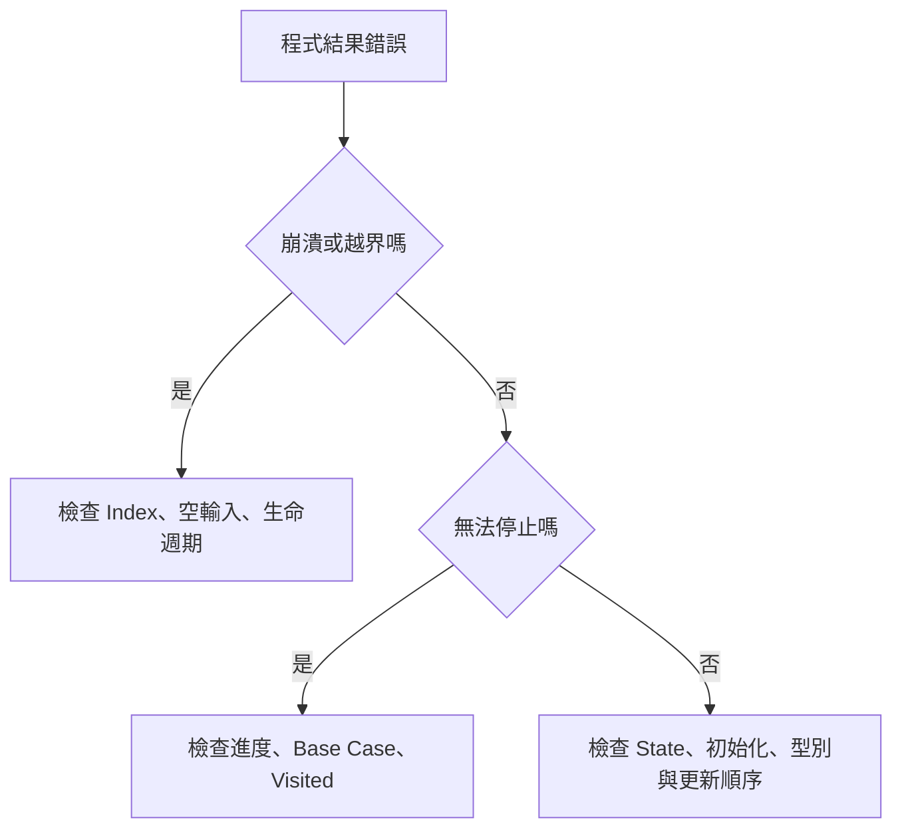

## 第 56 章　常見 Bug 類型

### 適用範圍

本章整理演算法實作中經常出現的 Bug 類型。目的不是背錯誤清單，而是看到錯誤現象時，能快速縮小檢查範圍。

常見 Bug 通常集中在：

- 區間與 Index。
- 空輸入與最小輸入。
- 迴圈是否持續前進。
- 遞迴 Base Case。
- Backtracking 狀態還原。
- Graph 的 Visited 時機。
- Integer Overflow。
- Comparator 規則。
- Heap 過期資料。
- DP State 與初始化。



### 56.1 Off-by-one 與越界

Off-by-one 是端點多一格或少一格。

錯誤版本：

```cpp
for (int i = 0; i <= static_cast<int>(nums.size()); ++i)
{
    std::cout << nums[i] << '\n';
}
```

合法 Index 是 0 到 `size - 1`，因此條件應為 `< size`。

#### 固定檢查

- 空輸入時 `size - 1` 是否 underflow？
- `i + 1` 是否仍小於 size？
- `right` 是最後合法位置，還是下一個位置？
- `end()` 是否被解參考？

### 56.2 空輸入與最小輸入

很多程式只在一般資料下成立：

```cpp
int maximum = nums[0];
```

空 Array 時會越界。應由規格決定：

- 空輸入是否非法。
- 是否回傳 `optional`。
- 是否有預設值。
- 是否在呼叫前保證非空。

建議先測：

```text
[]
[x]
[x, y]
```

### 56.3 無窮迴圈

迴圈必須有明確進度。

Binary Search 常見問題：

```cpp
left = mid;
```

若 `mid == left`，區間可能不再縮小。應依區間定義更新為 `mid + 1` 或改變另一端。

檢查時問：

```text
每一輪後，哪個量一定變小或更接近終止條件？
```

### 56.4 Base Case 與狀態還原

遞迴 Bug 常來自：

- Base Case 缺少最小輸入。
- Recursive Case 沒有縮小問題。
- Backtracking 離開分支前沒有還原狀態。

```cpp
path.push_back(value);
backtrack(...);
path.pop_back();
```

每一項狀態修改，都應有對應還原，例如 `used[i] = true` 對應 `used[i] = false`。

### 56.5 Visited 時機

Graph Traversal 若太晚標記 Visited，同一 Node 可能被重複加入 Queue 或 Stack。

常見做法是在第一次發現並加入容器時標記：

```cpp
visited[next] = true;
pending.push(next);
```

若是 Recursive DFS，通常在進入函式後立即標記。

### 56.6 Integer Overflow

即使最後答案使用 `long long`，中間運算仍可能先以 `int` 溢位：

```cpp
long long area = width * height;
```

若兩者都是 int，乘法先以 int 執行。應先轉型：

```cpp
long long area = 1LL * width * height;
```

也要注意：

- Prefix Sum。
- 路徑成本。
- 組合數。
- `left + right`。
- INF 加法。

### 56.7 Comparator

`std::sort` Comparator 必須表示嚴格弱序。

錯誤：

```cpp
return a <= b;
```

當 `a == b` 時，兩個方向都可能回傳 true。

正確：

```cpp
return a < b;
```

多欄位排序要明確處理相等情況，不要讓規則互相矛盾。

### 56.8 過期 Heap 資料

某些演算法會將同一 Node 的不同版本放入 Heap。舊版本不一定能從中間刪除，因此取出時要檢查是否已過期。

```cpp
if (distance != best[node])
{
    continue;
}
```

Lazy Deletion 也需要在讀取 Top 前持續移除失效項目。

### 56.9 DP 初始化

DP 常見錯誤：

- 不可達 State 被初始化為 0。
- 最小值問題使用太小的 INF。
- Base Case 漏設。
- Bottom-up 順序讀到未完成 State。
- 原地更新覆蓋仍需要的舊值。

初始化值必須符合 State 語意，而不是所有題目都填 0。

### 56.10 Bug 快速對照

<table>
<tr><th>現象</th><th>優先檢查</th></tr>
<tr><td>偶爾崩潰</td><td>越界、空輸入、失效 Pointer、Stack 深度</td></tr>
<tr><td>少一筆或多一筆</td><td>Off-by-one、區間端點、迴圈上限</td></tr>
<tr><td>程式不停止</td><td>迴圈進度、遞迴縮小、Visited</td></tr>
<tr><td>大資料才錯</td><td>Overflow、複雜度、遞迴深度</td></tr>
<tr><td>答案重複</td><td>Visited 太晚、Backtracking 去重、重複 Edge</td></tr>
<tr><td>最佳值異常</td><td>DP 初始化、INF、Comparator、過期 Heap 資料</td></tr>
</table>

### 56.11 本章檢查表

- 我已測試空輸入與單一元素。
- 我已明確定義區間端點。
- 每個迴圈都有可證明的進度。
- 每個遞迴都有 Base Case，而且問題會縮小。
- 每個 Backtracking 修改都有對應還原。
- Graph 的 Visited 標記時機明確。
- 中間運算型別足以保存最大值。
- Comparator 使用嚴格比較。
- Heap Top 使用前會排除過期資料。
- DP 初始化符合 State 語意。

### 56.12 本章重點

- 常見 Bug 多集中在邊界、狀態、型別與更新時機。
- Off-by-one 應從區間定義檢查，而不是反覆試 `<` 與 `<=`。
- 無窮迴圈與遞迴通常代表問題沒有持續縮小。
- Backtracking 與 Graph Traversal 要特別關注狀態修改時機。
- Overflow 可能在指定給大型別前已經發生。
- Comparator、Heap 與 DP 都有必須維持的結構條件。
