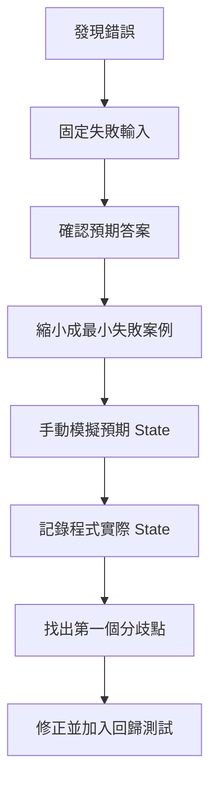
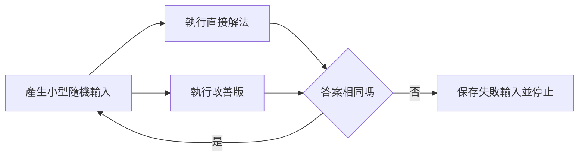

## 第 57 章　演算法除錯流程

### 適用範圍

本章建立一套可以重複使用的演算法除錯流程。除錯不是看到錯誤後隨機修改條件，而是先確認規格，再縮小輸入，找出第一個與預期不同的 State。

固定流程如下：

- 確認問題定義與預期答案。
- 保存可重現的失敗輸入。
- 縮小成最小失敗案例。
- 手動列出每一步預期 State。
- 記錄程式實際 State。
- 找出第一個分歧點。
- 修正後加入 Regression Test。
- 必要時使用直接解法對拍。



### 57.1 第一步：確認問題定義

先確認錯的是程式，還是對題目的理解。

應重新寫出：

- 輸入與輸出。
- 區間端點。
- 空輸入結果。
- 重複值規則。
- 是否允許修改輸入。
- 預期輸出順序。

多個合法答案的題目，不應只比較單一順序。例如 DFS 與 Topological Sort 可能有多種合法結果。

### 57.2 保存可重現的失敗案例

不要只記得「某次大資料錯了」。應保存：

```text
輸入
預期輸出
實際輸出
執行環境
是否每次都能重現
```

若錯誤無法穩定重現，優先檢查未初始化資料、越界、生命週期與未定義行為。

### 57.3 最小失敗案例

將失敗輸入逐步縮小，但保留錯誤。

例如排序在 1000 筆資料錯誤，可以嘗試：

- 移除一半資料。
- 只保留重複值附近。
- 減少到 5 至 10 個元素。
- 檢查空、單一、兩個元素。

最小案例能降低干擾，讓錯誤的第一個分歧更明顯。

### 57.4 手動模擬

建立表格，記錄每輪關鍵 State。

Binary Search 可記錄：

<table>
<tr><th>輪次</th><th>left</th><th>right</th><th>mid</th><th>nums[mid]</th><th>更新</th></tr>
<tr><td>1</td><td>0</td><td>5</td><td>2</td><td>4</td><td>`right = 2`</td></tr>
</table>

目標不是記錄所有變數，而是記錄足以驗證 Invariant 的 State。

### 57.5 Pointer、Index 與區間

遇到越界或少一筆時，先畫出合法位置：

```text
Index: 0 1 2 3
Size: 4
合法 Index: [0, 4)
```

Pointer 或 Iterator 則要檢查：

- 是否仍指向有效物件。
- 容器修改後是否失效。
- 是否解參考 `end()`。
- 物件生命週期是否結束。

### 57.6 遞迴樹與 Call Stack

遞迴錯誤可以記錄：

- 本層參數。
- Base Case 是否成立。
- 呼叫哪些子問題。
- 子問題回傳什麼。
- 本層如何組合答案。

使用縮排輸出能呈現深度：

```cpp
std::cerr << std::string(depth * 2, ' ')
          << "dfs(" << node << ")\n";
```

若遞迴不停止，找出哪個參數沒有朝 Base Case 前進。

### 57.7 Graph Traversal Order

Graph Debug 建議記錄：

```text
目前 Node
發現哪個 Neighbor
為什麼略過 Neighbor
何時標記 Visited
Stack 或 Queue 內容
Parent、Distance、State
```

若輸出順序不同，先確認題目是否真的要求唯一順序。若只要求可達性，順序不同不一定是錯誤。

### 57.8 DP Table

DP Debug 不應只看最後答案。先列出每個 State 的預期值：

<table>
<tr><th>i</th><th>State 意義</th><th>預期</th><th>實際</th></tr>
<tr><td>0</td><td>Base Case</td><td>0</td><td>0</td></tr>
<tr><td>1</td><td>Base Case</td><td>1</td><td>1</td></tr>
<tr><td>2</td><td>由前兩格組合</td><td>1</td><td>0</td></tr>
</table>

第一個錯誤 State 常能指出：

- Base Case 錯誤。
- Transition 漏掉來源。
- 計算順序錯誤。
- 原地更新覆蓋舊值。

### 57.9 使用 Invariant 找第一個分歧

不要只問「最後答案為什麼錯」，而要問：

```text
哪一輪開始，原本應成立的條件不再成立？
```

例如 Two Pointers：

```text
[left, right] 是否仍包含所有可能答案？
```

Heap：

```text
每個 Parent 是否仍符合 Heap Property？
```

DSU：

```text
每個集合是否仍有唯一 Root？
```

第一個破壞 Invariant 的步驟通常比最後錯誤位置更接近問題來源。

### 57.10 對拍與隨機測試

對拍是使用兩個版本處理相同小型輸入：

- 一個較慢但容易確認正確的直接解法。
- 一個需要驗證的改善版。



隨機資料必須符合題目限制。若使用 Synthetic Data，要明確知道它只能補充測試，不能取代邊界案例與人工設計反例。

### 57.11 修正後的 Regression Test

修正 Bug 後，將該最小失敗案例保留下來。之後每次修改都重新執行，避免同一問題再次出現。

Regression Test 最少應包含：

- 原本失敗案例。
- 相鄰邊界案例。
- 一般案例。
- 不應受修正影響的案例。

### 57.12 除錯順序表

<table>
<tr><th>現象</th><th>建議起點</th></tr>
<tr><td>崩潰</td><td>Index、Pointer、空輸入、Stack 深度</td></tr>
<tr><td>無法停止</td><td>迴圈進度、Base Case、Visited</td></tr>
<tr><td>少一筆或多一筆</td><td>區間端點、迴圈上下界</td></tr>
<tr><td>大資料才錯</td><td>Overflow、複雜度、遞迴深度</td></tr>
<tr><td>小資料也錯</td><td>規格、State、Base Case、Transition</td></tr>
<tr><td>偶爾錯</td><td>未初始化、越界、生命週期、依賴未固定順序</td></tr>
</table>

### 57.13 本章檢查表

- 我已確認題目規格與預期答案。
- 我已保存可重現的失敗輸入。
- 我已縮小成容易手動模擬的案例。
- 我記錄的是關鍵 State，不是無差別輸出所有變數。
- 我能指出第一個預期與實際不同的位置。
- 我已檢查 Index、Pointer、遞迴與 Visited 時機。
- DP 會逐格比較，而不是只看最後答案。
- 我保留直接解法以便對拍。
- 修正後已加入 Regression Test。

### 57.14 本章重點

- 除錯應從固定失敗輸入開始，而不是隨機修改程式。
- 最小失敗案例能降低干擾並凸顯錯誤條件。
- 手動模擬要記錄足以驗證 Invariant 的 State。
- 第一個分歧點通常比最後錯誤輸出更接近問題來源。
- Graph、Recursion 與 DP 都應使用符合其結構的追蹤方式。
- 對拍可用簡單可信版本驗證複雜版本。
- 修正後保留 Regression Test，避免問題再次出現。
