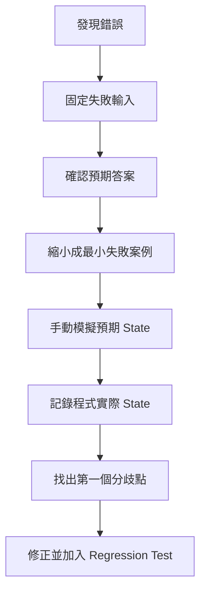
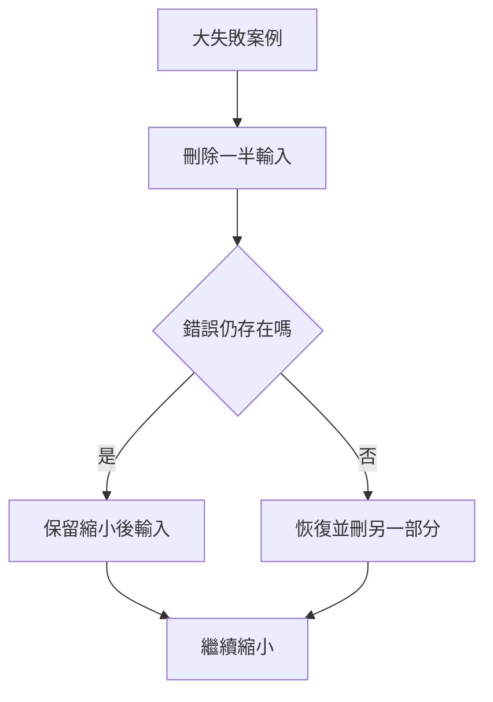
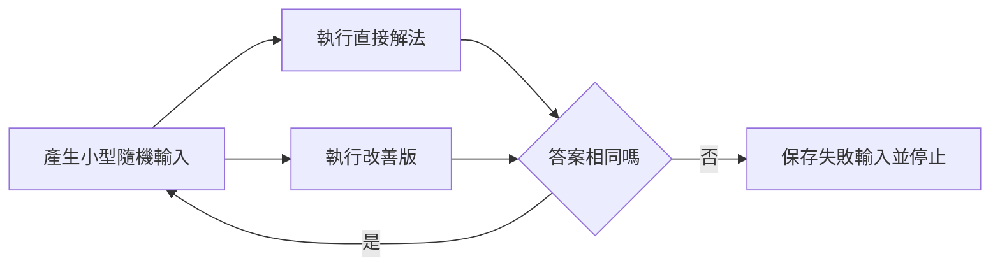

## 第 57 章　演算法除錯流程

### 適用範圍

本章建立一套可以重複使用的演算法除錯流程。除錯不是看到錯誤後隨機修改條件，也不是把 `<` 改成 `<=` 試到通過，而是先確認問題定義，再固定失敗輸入，縮小案例，找出第一個與預期不同的 State。

原始章節已經整理出核心流程：確認問題定義與預期答案、保存可重現輸入、縮小成最小失敗案例、手動列出預期 State、記錄實際 State、找出第一個分歧點、修正後加入 Regression Test，必要時使用直接解法對拍。citeturn33search1

本版會把這些流程補成更細的實作步驟，包含 Binary Search、Pointer / Index、Recursion、Graph、DP、Heap、DSU 與隨機對拍的除錯方式。



### 適用讀者

- 遇到 Wrong Answer、Runtime Error 或 Time Limit 時，不知道從哪裡開始查的讀者。
- 常靠猜測修改條件，但修完一個案例又壞另一個案例的讀者。
- 只看最後輸出，沒有追蹤中間 State 的讀者。
- 想建立 Graph、DP、Recursion、Pointer 等不同題型的 Debug 模板的讀者。
- 想用 Brute Force 與隨機測試驗證改善版的讀者。

### 快速導覽

- [57.1 除錯的核心原則](#571-除錯的核心原則)
- [57.2 第一步：確認問題定義](#572-第一步確認問題定義)
- [57.3 保存可重現的失敗案例](#573-保存可重現的失敗案例)
- [57.4 建立最小失敗案例](#574-建立最小失敗案例)
- [57.5 手動模擬與 State 表格](#575-手動模擬與-state-表格)
- [57.6 Pointer、Index 與區間](#576-pointerindex-與區間)
- [57.7 迴圈與 Binary Search 除錯](#577-迴圈與-binary-search-除錯)
- [57.8 遞迴樹與 Call Stack](#578-遞迴樹與-call-stack)
- [57.9 Graph Traversal Order](#579-graph-traversal-order)
- [57.10 DP Table 除錯](#5710-dp-table-除錯)
- [57.11 Heap、DSU 與資料結構 Invariant](#5711-heapdsu-與資料結構-invariant)
- [57.12 使用 Invariant 找第一個分歧](#5712-使用-invariant-找第一個分歧)
- [57.13 對拍與隨機測試](#5713-對拍與隨機測試)
- [57.14 修正後的 Regression Test](#5714-修正後的-regression-test)
- [57.15 除錯紀錄模板](#5715-除錯紀錄模板)
- [57.16 除錯順序表](#5716-除錯順序表)
- [57.17 常見問題與判讀](#5717-常見問題與判讀)
- [57.18 本章檢查表](#5718-本章檢查表)
- [57.19 本章重點](#5719-本章重點)

### 57.1 除錯的核心原則

有效除錯有三個核心原則。

#### 原則一：先固定輸入，不要只記得現象

錯誤必須能重現，才容易定位。不要只記得「大資料錯了」，而要保存：

- 輸入。
- 預期輸出。
- 實際輸出。
- 執行環境。
- 是否每次都重現。

#### 原則二：找第一個分歧，不是只看最後錯誤

最後輸出錯，只表示中間某個 State 曾經錯。真正有價值的是找到：

```text
預期 State 和實際 State 從哪一步開始不同？
```

#### 原則三：一次只改一項

若同時修改 Index、Base Case、資料結構與 Comparator，即使通過了，也不知道真正原因。一次只修改一項，修正後加入 Regression Test。


### 57.2 第一步：確認問題定義

先確認錯的是程式，還是題目理解。原始章節也提醒，第一步應重新確認輸入、輸出、區間端點、空輸入結果、重複值規則、是否允許修改輸入與預期輸出順序。citeturn33search1

應重新寫出：

<table>
<tr><th>項目</th><th>要確認的問題</th></tr>
<tr><td>輸入</td><td>型別、範圍、是否排序、是否重複</td></tr>
<tr><td>輸出</td><td>回傳值、無答案表示、是否允許多個答案</td></tr>
<tr><td>區間</td><td>閉區間 `[left, right]` 或半開區間 `[left, right)`</td></tr>
<tr><td>空輸入</td><td>回傳什麼，是否為合法輸入</td></tr>
<tr><td>重複值</td><td>是否允許同值，是否要求不同 Index</td></tr>
<tr><td>修改限制</td><td>是否可排序或原地修改</td></tr>
<tr><td>順序要求</td><td>輸出是否需排序，或任意合法順序都可</td></tr>
</table>

多個合法答案的題目，不應只比較單一輸出順序。例如 DFS 與 Topological Sort 可能有多種合法結果；此時應驗證輸出是否符合條件，而不是只比字串完全相同。原始章節也有相同提醒。citeturn33search1

### 57.3 保存可重現的失敗案例

不要只記得「某次大資料錯了」。應保存：

```text
輸入：
預期輸出：
實際輸出：
重現步驟：
執行環境：
是否每次都能重現：
相關版本或 Commit：
```

若錯誤無法穩定重現，優先檢查：

- 未初始化資料。
- 越界存取。
- Dangling Pointer 或 Reference。
- Iterator 失效。
- Signed Overflow。
- 依賴 Hash / Traversal 的非固定順序。
- 多執行緒資料競爭，若題目或系統涉及並行。

原始章節也指出，若錯誤無法穩定重現，優先檢查未初始化資料、越界、生命週期與未定義行為。citeturn33search1

### 57.4 建立最小失敗案例

最小失敗案例不是最短輸入，而是「仍能保留錯誤，且足夠容易手動追蹤」的輸入。

例如排序在 1000 筆資料錯誤，可以嘗試：

- 移除一半資料。
- 只保留錯誤結果附近的資料。
- 只保留重複值附近。
- 減少到 5 至 10 個元素。
- 檢查空、單一、兩個元素。

原始章節也提到，縮小案例可以降低干擾，讓第一個分歧更明顯。citeturn33search1

#### 縮小案例的常用策略



如果是 Graph 題，可嘗試刪除 Node、Edge 或 Component。如果是 DP 題，可縮短序列長度或限制值域。如果是字串題，可保留觸發錯誤的最短 substring。

### 57.5 手動模擬與 State 表格

手動模擬的目標不是把所有變數都印出來，而是記錄足以驗證 Invariant 的 State。原始章節也強調，目標不是記錄所有變數，而是記錄足以驗證 Invariant 的 State。citeturn33search1

Binary Search 可記錄：

<table>
<tr><th>輪次</th><th>left</th><th>right</th><th>mid</th><th>nums[mid]</th><th>預期更新</th><th>實際更新</th></tr>
<tr><td>1</td><td>0</td><td>5</td><td>2</td><td>4</td><td>`right = 2`</td><td>待填</td></tr>
</table>

Sliding Window 可記錄：

<table>
<tr><th>步驟</th><th>left</th><th>right</th><th>window</th><th>state</th><th>valid?</th><th>answer</th></tr>
<tr><td>1</td><td>0</td><td>0</td><td>`a`</td><td>freq</td><td>是</td><td>1</td></tr>
</table>

Graph BFS 可記錄：

<table>
<tr><th>步驟</th><th>Queue</th><th>目前 Node</th><th>新發現 Neighbor</th><th>visited</th><th>distance</th></tr>
<tr><td>1</td><td>`[0]`</td><td>0</td><td>1, 2</td><td>{0,1,2}</td><td>`dist[1]=1`</td></tr>
</table>

### 57.6 Pointer、Index 與區間

遇到越界、少一筆、多一筆時，先畫出合法位置。

```text
Index:        0  1  2  3
Size:         4
合法 Index:   [0, 4)
最後合法 Index = 3
end() 指向 Index 4 的概念位置，不可解參考
```

原始章節也建議遇到越界或少一筆時，先畫出合法位置，並檢查 Pointer 或 Iterator 是否有效、容器修改後是否失效、是否解參考 `end()`、物件生命週期是否結束。citeturn33search1

#### Index Debug 檢查

- `i + 1` 是否小於 size？
- `i - 1` 是否在 i 為 0 時安全？
- `right + 1` 是否可能越界？
- 空輸入時 `size - 1` 是否 underflow？
- 區間是 inclusive 還是 half-open？
- Iterator 是否因 `push_back`、`erase`、`rehash` 失效？

### 57.7 迴圈與 Binary Search 除錯

迴圈錯誤最常見的兩種現象：

- 無法停止。
- 跳過或重複處理某個位置。

對每個 while 迴圈，問：

```text
每一輪後，哪個量一定更接近終止條件？
```

Binary Search 要特別記錄：

- 區間語意。
- Invariant。
- mid 是否可能等於 left 或 right。
- 更新後區間是否嚴格縮小。

Half-open Lower Bound 範例：

```cpp
int left = 0;
int right = static_cast<int>(nums.size());

while (left < right)
{
    int mid = left + (right - left) / 2;

    if (nums[mid] < target)
    {
        left = mid + 1;
    }
    else
    {
        right = mid;
    }
}
```

Invariant：第一個不小於 target 的位置若存在，仍位於 `[left, right)`。

### 57.8 遞迴樹與 Call Stack

遞迴錯誤可以記錄：

- 本層參數。
- Base Case 是否成立。
- 呼叫哪些子問題。
- 子問題回傳什麼。
- 本層如何組合答案。

原始章節也列出上述項目，並建議使用縮排輸出呈現遞迴深度。citeturn33search1

```cpp
void dfs(int node, int depth)
{
    std::cerr << std::string(depth * 2, ' ')
              << "dfs(" << node << ")\n";
}
```

#### 遞迴不停止時

檢查：

- 問題是否變小。
- Base Case 是否可達。
- Graph 或 Tree 是否有 Cycle 卻沒有 parent / visited。
- 參數是否因整數 underflow 或 overflow 變成意外值。

#### Backtracking 錯誤時

檢查每一個修改是否有還原：

```cpp
path.push_back(value);
used[i] = true;

backtrack(...);

used[i] = false;
path.pop_back();
```

若答案互相污染，通常是 path、used、count、sum 等 Mutable State 沒有還原。

### 57.9 Graph Traversal Order

Graph Debug 建議記錄：

```text
目前 Node
發現哪個 Neighbor
為什麼略過 Neighbor
何時標記 Visited
Stack 或 Queue 內容
Parent、Distance、State
```

這一點也出現在原始章節。原始章節也提醒，如果輸出順序不同，先確認題目是否真的要求唯一順序；若只要求可達性，順序不同不一定是錯誤。citeturn33search1

#### BFS 常見檢查

- 是否在入列時標記 visited？
- distance 是否只在第一次發現時設定？
- Queue 是否依 Layer 處理？
- 是否把 Weighted Graph 誤用普通 BFS？

#### DFS 常見檢查

- 是否有 visited 或 parent？
- Directed Cycle 是否使用三色狀態？
- Undirected Cycle 是否排除 parent Edge？
- Recursive DFS 是否可能 Stack Overflow？

#### Topological Sort 常見檢查

- Indegree 是否正確計算？
- 每移除一個 Node，是否更新所有 outgoing neighbor？
- 最後輸出數量是否等於 Node 數？
- 若不等於，是否表示存在 Cycle？

### 57.10 DP Table 除錯

DP Debug 不應只看最後答案。原始章節也指出，應先列出每個 State 的預期值，第一個錯誤 State 常能指出 Base Case、Transition、計算順序或原地更新錯誤。citeturn33search1

DP 表格可記錄：

<table>
<tr><th>State</th><th>State 意義</th><th>依賴來源</th><th>預期</th><th>實際</th></tr>
<tr><td>`dp[0]`</td><td>Base Case</td><td>無</td><td>0</td><td>0</td></tr>
<tr><td>`dp[1]`</td><td>Base Case</td><td>無</td><td>1</td><td>1</td></tr>
<tr><td>`dp[2]`</td><td>由前兩格組合</td><td>`dp[0]`, `dp[1]`</td><td>1</td><td>0</td></tr>
</table>

#### DP Debug 順序

1. 先確認 State 定義是否完整。
2. 檢查 Base Case。
3. 檢查計算順序。
4. 檢查 Transition 是否漏來源。
5. 檢查不可達 State 與合法 0 是否分開。
6. 若有空間壓縮，檢查更新方向是否覆蓋舊值。

### 57.11 Heap、DSU 與資料結構 Invariant

除錯資料結構時，要先寫出 Invariant。

#### Heap

```text
Min Heap：每個 Parent <= Children。
Top 是目前 Heap 中最小值。
```

若使用 Lazy Deletion 或 Dijkstra Stale Entry，讀取 Top 前要先清除過期資料，或取出後檢查是否等於目前最佳 State。

#### DSU

```text
每個集合有一個 Root。
Root 滿足 parent[root] == root。
find(x) 回傳 x 所屬集合 Root。
```

常見錯誤：直接比較 `parent[a]` 與 `parent[b]`，而不是比較 `find(a)` 與 `find(b)`。

#### Segment Tree

```text
每個 Node 保存對應區間的合併結果。
Parent = merge(left child, right child)。
Lazy Tag 和 Node State 一致。
```

資料結構 Debug 的核心是：每次更新後，Invariant 是否仍成立。

### 57.12 使用 Invariant 找第一個分歧

不要只問「最後答案為什麼錯」，而要問：

```text
哪一輪開始，原本應成立的條件不再成立？
```

原始章節也列出 Two Pointers、Heap、DSU 的 Invariant 例子，並指出第一個破壞 Invariant 的步驟通常比最後錯誤位置更接近問題來源。citeturn33search1

例子：

<table>
<tr><th>題型</th><th>可追蹤 Invariant</th></tr>
<tr><td>Two Pointers</td><td>被排除的候選不可能成為答案</td></tr>
<tr><td>Sliding Window</td><td>Window State 對應 `[left, right)` 的內容</td></tr>
<tr><td>Binary Search</td><td>答案仍位於目前候選區間</td></tr>
<tr><td>Heap</td><td>Top 是目前最高優先權有效項目</td></tr>
<tr><td>DSU</td><td>同集合元素 find 後 Root 相同</td></tr>
<tr><td>DP</td><td>每個已計算 State 都符合定義</td></tr>
</table>

### 57.13 對拍與隨機測試

對拍是使用兩個版本處理相同小型輸入：

- 一個較慢但容易確認正確的直接解法。
- 一個需要驗證的改善版。

原始章節也說明，對拍可用直接解法與改善版比較，若答案不同就保存失敗輸入並停止。citeturn33search1



#### 隨機測試注意事項

- 隨機資料必須符合題目限制。
- 小型輸入優先，方便縮小與手動追蹤。
- 必須包含邊界與人工反例。
- Synthetic Data 只能補充測試，不能取代規格分析。

原始章節也提醒，Synthetic Data 只能補充測試，不能取代邊界案例與人工設計反例。citeturn33search1

### 57.14 修正後的 Regression Test

修正 Bug 後，將最小失敗案例保留下來。之後每次修改都重新執行，避免同一問題再次出現。

Regression Test 最少包含：

- 原本失敗案例。
- 相鄰邊界案例。
- 一般案例。
- 不應受修正影響的案例。

原始章節也列出這四類 Regression Test。citeturn33search1

#### Regression Test 命名

建議把測試目的寫出來：

```text
handles_empty_input
handles_duplicate_values
handles_left_boundary
does_not_reuse_same_index
skips_stale_heap_entries
```

這比只寫 `test1`、`test2` 更容易在未來理解。

### 57.15 除錯紀錄模板

```markdown
# Debug 紀錄

## 1. 現象
- 錯誤類型：Wrong Answer / Runtime Error / TLE / Memory Limit / Non-deterministic
- 實際輸出：
- 預期輸出：

## 2. 可重現案例
- 輸入：
- 執行方式：
- 是否每次重現：
- 環境：

## 3. 最小失敗案例
- 縮小後輸入：
- 為什麼仍保留錯誤：

## 4. 問題定義確認
- 輸入：
- 輸出：
- 邊界：
- 重複值：
- 順序要求：

## 5. 預期 State
- Step 1：
- Step 2：
- Step 3：

## 6. 實際 State
- Step 1：
- Step 2：
- Step 3：

## 7. 第一個分歧點
- 分歧位置：
- 預期：
- 實際：
- 破壞哪個 Invariant：

## 8. 修正
- 修改項目：
- 為什麼有效：
- 是否影響其他案例：

## 9. Regression Test
- 原失敗案例：
- 相鄰邊界：
- 一般案例：
- 反例：
```

### 57.16 除錯順序表

<table>
<tr><th>現象</th><th>建議起點</th></tr>
<tr><td>崩潰</td><td>Index、Pointer、空輸入、Stack 深度</td></tr>
<tr><td>無法停止</td><td>迴圈進度、Base Case、Visited</td></tr>
<tr><td>少一筆或多一筆</td><td>區間端點、迴圈上下界</td></tr>
<tr><td>大資料才錯</td><td>Overflow、複雜度、遞迴深度</td></tr>
<tr><td>小資料也錯</td><td>規格、State、Base Case、Transition</td></tr>
<tr><td>偶爾錯</td><td>未初始化、越界、生命週期、依賴未固定順序</td></tr>
<tr><td>輸出順序不同</td><td>題目是否要求唯一順序</td></tr>
<tr><td>修一題壞一題</td><td>缺少 Regression Test 或 Invariant 不明確</td></tr>
</table>

原始章節也提供了相同方向的除錯順序表，包含崩潰、無法停止、少一筆或多一筆、大資料才錯、小資料也錯、偶爾錯等現象。citeturn33search1

### 57.17 常見問題與判讀

<table>
<tr><th>問題</th><th>常見原因</th><th>修正方向</th></tr>
<tr><td>只看最後答案</td><td>沒有追蹤中間 State</td><td>手動建立 State 表</td></tr>
<tr><td>一直猜比較符號</td><td>區間語意未定義</td><td>先寫 `[left, right]` 或 `[left, right)`</td></tr>
<tr><td>Log 太多看不懂</td><td>未聚焦關鍵 State</td><td>只輸出能驗證 Invariant 的變數</td></tr>
<tr><td>修完又壞</td><td>沒有 Regression Test</td><td>保存最小失敗案例</td></tr>
<tr><td>Debug 大資料困難</td><td>案例太大</td><td>先縮小成 5 到 10 筆</td></tr>
<tr><td>看不出 Graph 錯在哪</td><td>未記錄 Visited 時機</td><td>記錄發現、入列、出列、略過原因</td></tr>
<tr><td>DP 不知道哪格錯</td><td>只看最終答案</td><td>逐格列預期與實際</td></tr>
</table>

### 57.18 本章檢查表

- 我已確認題目規格與預期答案。
- 我已保存可重現的失敗輸入。
- 我已縮小成容易手動模擬的案例。
- 我記錄的是關鍵 State，不是無差別輸出所有變數。
- 我能指出第一個預期與實際不同的位置。
- 我已檢查 Index、Pointer、遞迴與 Visited 時機。
- DP 會逐格比較，而不是只看最後答案。
- Graph 會記錄發現、略過與標記 Visited 的時機。
- Heap、DSU、Segment Tree 會先寫出資料結構 Invariant。
- 我保留直接解法以便對拍。
- 修正後已加入 Regression Test。

### 57.19 本章重點

- 除錯應從固定失敗輸入開始，而不是隨機修改程式。
- 最小失敗案例能降低干擾並凸顯錯誤條件。
- 手動模擬要記錄足以驗證 Invariant 的 State。
- 第一個分歧點通常比最後錯誤輸出更接近問題來源。
- Pointer、Index、Iterator 與區間問題要先畫出合法範圍。
- Recursion 要追蹤參數、Base Case、子問題與回傳值。
- Graph、Recursion 與 DP 都應使用符合其結構的追蹤方式。
- 對拍可用簡單可信版本驗證複雜版本。
- 修正後保留 Regression Test，避免問題再次出現。
