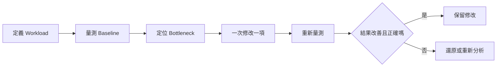
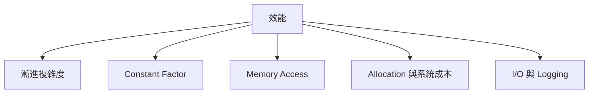
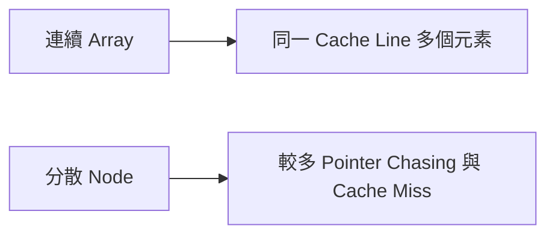
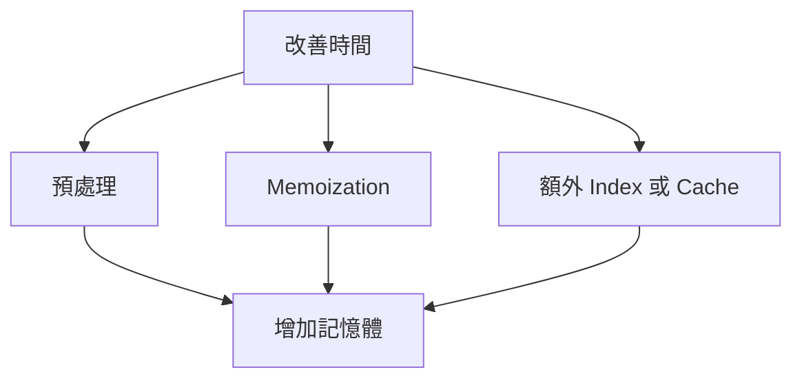

### 第 58 章　效能分析與最佳化

#### 適用範圍

本章介紹如何以量測為基礎改善程式效能，包括理論複雜度、實際執行時間、Constant Factor、Cache Locality、Allocation、Recursion Cost、時間與空間取捨，以及 Bottleneck 定位。

效能最佳化不是看到慢就立刻改程式，也不是把所有程式碼改得更短、更難讀。有效的效能改善應該是一個閉環：

1. 先定義要改善的 Workload。
2. 建立可重現的 Baseline。
3. 量測並定位 Bottleneck。
4. 一次只修改一項。
5. 重新量測。
6. 確認結果仍正確。
7. 保留效能 Regression Benchmark。



本章重點是建立一套可重複的效能分析流程，而不是列出零散技巧。原始章節也已指出，效能改善應從可重現的 Baseline 開始，並記錄輸入規模、資料分布、編譯設定、執行環境、重複次數與統計方式。citeturn32search1

#### 適用讀者

- 程式通過正確性測試，但在大資料下超時的讀者。
- 看到 TLE 時會先改細節，但沒有先定位 Bottleneck 的讀者。
- 不確定 Big-O 與實際秒數如何對應的讀者。
- 想理解 Cache、Allocation、Recursion 與 Constant Factor 的讀者。
- 想建立 Benchmark 與 Regression 流程的讀者。

#### 快速導覽

- [58.1 先量測再改善](#581-先量測再改善)
- [58.2 理論複雜度與實際時間](#582-理論複雜度與實際時間)
- [58.3 Benchmark 基本原則](#583-benchmark-基本原則)
- [58.4 Constant Factor](#584-constant-factor)
- [58.5 Cache Locality](#585-cache-locality)
- [58.6 Allocation Cost](#586-allocation-cost)
- [58.7 Recursion Cost](#587-recursion-cost)
- [58.8 時間與空間取捨](#588-時間與空間取捨)
- [58.9 尋找 Bottleneck](#589-尋找-bottleneck)
- [58.10 演算法層級改善](#5810-演算法層級改善)
- [58.11 Microbenchmark 與 End-to-end Benchmark](#5811-microbenchmark-與-end-to-end-benchmark)
- [58.12 C++ 常見效能陷阱](#5812-c-常見效能陷阱)
- [58.13 正確性與 Regression](#5813-正確性與-regression)
- [58.14 效能分析紀錄模板](#5814-效能分析紀錄模板)
- [58.15 常見問題與判讀](#5815-常見問題與判讀)
- [58.16 本章檢查表](#5816-本章檢查表)
- [58.17 本章重點](#5817-本章重點)

#### 58.1 先量測再改善

效能改善前，先建立可重現 Baseline。

Baseline 至少要記錄：

<table>
<tr><th>項目</th><th>應記錄內容</th></tr>
<tr><td>輸入規模</td><td>n、V、E、字串長度、Query 數等</td></tr>
<tr><td>資料分布</td><td>隨機、已排序、反向、全部相同、最差分布</td></tr>
<tr><td>編譯設定</td><td>Debug / Release、最佳化選項、編譯器版本</td></tr>
<tr><td>執行環境</td><td>機器、OS、CPU、記憶體、是否有背景工作</td></tr>
<tr><td>重複次數</td><td>至少多次執行，觀察波動</td></tr>
<tr><td>統計方式</td><td>Median、平均、最小值、最大值、分布</td></tr>
<tr><td>正確性檢查</td><td>輸出是否與 Baseline 或 Oracle 一致</td></tr>
</table>

如果沒有 Baseline，就很難判斷修改是否真的有效。單次執行可能受到系統排程、暖機、快取狀態與背景工作影響。

#### 58.2 理論複雜度與實際時間

Big-O 描述輸入成長時的主要趨勢，不直接等於秒數。

例如兩個 O(n) 解法：

```text
版本 A：一次順序掃描 vector
版本 B：每次都走 Pointer 到散布在記憶體各處的 Node
```

兩者雖然都是 O(n)，實際時間可能差很多。原因可能包含：

- Constant Factor。
- Memory Access Pattern。
- Cache Locality。
- Allocation。
- Branch Prediction。
- I/O 或 Logging。

原始章節也指出，兩個 O(n) 解法可能因記憶體配置、分支、資料布局與常數工作量而有明顯差異。citeturn32search1



先避免不可接受的複雜度，再針對實際 Bottleneck 調整常數成本。若 n 很大，O(n²) 通常無法靠小技巧補救；若演算法階數已合適，再看常數與記憶體行為。

#### 58.3 Benchmark 基本原則

Benchmark 不是用 `cout` 印一下時間就結束。至少要注意以下原則。

##### 1. Workload 要足夠大

如果工作太短，計時器解析度、排程與背景雜訊會佔很大比例。

```cpp
const auto begin = std::chrono::steady_clock::now();
auto result = solve(input);
const auto end = std::chrono::steady_clock::now();
consume(result);
```

##### 2. 不要把不相關工作混入核心計時

例如要測 `solve()`，就不要把輸入生成與輸出列印放進同一段計時，除非它們本來就是需求的一部分。

錯誤方向：

```cpp
auto input = generateHugeInput();
auto result = solve(input);
std::cout << result << '\n';
```

這會把輸入生成與 I/O 混入核心計時。

##### 3. 確保結果被使用

如果結果完全沒有被使用，編譯器可能移除部分工作。可使用測試中的 `consume(result)` 或和預期答案比較，確保計算結果有意義。

##### 4. 多次執行並看分布

只看一次時間不可靠。建議記錄：

- Median。
- 最小值與最大值。
- 是否有異常離群值。
- 是否隨輸入規模呈現預期成長。

##### 5. 比較版本必須有相同 Postcondition

若版本 B 少做了一部分檢查，變快不代表合理改善。所有版本應產生相同答案與副作用。

原始章節也提醒，Microbenchmark 無法完全代表正式系統，仍需以實際 Workload 驗證。citeturn32search1

#### 58.4 Constant Factor

Constant Factor 是 Big-O 省略掉的常數成本。當兩個方法複雜度相同，Constant Factor 可能決定實際速度。

常見來源：

- 重複 Hash。
- 重複比較大型物件。
- 不必要的型別轉換。
- 不必要的資料複製。
- 迴圈內配置與釋放。
- 虛擬呼叫或昂貴抽象。
- Debug Logging。
- I/O。

##### 不必要複製

```cpp
for (auto item : largeObjects)
{
    process(item);
}
```

如果 `item` 很大，這會每輪複製。可改為：

```cpp
for (const auto& item : largeObjects)
{
    process(item);
}
```

##### 迴圈內重複做相同工作

```cpp
for (int i = 0; i < n; ++i)
{
    auto value = expensivePreprocess(config);
    use(value, i);
}
```

若 `expensivePreprocess(config)` 與 i 無關，應移出迴圈。

##### 不要過早犧牲可讀性

原始章節也提醒，不要在尚未定位 Bottleneck 時，為微小常數犧牲可讀性與正確性。citeturn32search1

#### 58.5 Cache Locality

Cache Locality 影響 CPU 讀取資料的效率。

連續記憶體通常較容易有效利用 Cache。例如 `std::vector<int>` 連續存放，多個相鄰元素可能位於同一個 Cache Line。Linked List 的 Node 可能散布在記憶體各處，每次走到下一個 Node 都可能需要新的記憶體存取。



##### 順序走訪通常友善

```cpp
long long sum = 0;
for (int value : values)
{
    sum += value;
}
```

這種順序讀取通常比隨機跳躍更容易被硬體預取。

##### 資料結構仍要符合操作需求

不能只因 Locality 就把所有資料結構改成 Array。例如若需求是頻繁在已知 Node 前後插入與刪除，Linked List 或其他結構仍可能符合主要操作。

原始章節也指出，資料結構選擇仍要符合主要操作，不能只因 Locality 就把需求全部改成 Array。citeturn32search1

#### 58.6 Allocation Cost

Allocation 包含配置與釋放記憶體的成本。若在內層迴圈反覆建立大型容器，實際成本可能很高。

##### 問題範例

```cpp
for (int i = 0; i < n; ++i)
{
    std::vector<int> buffer;
    for (int j = 0; j < m; ++j)
    {
        buffer.push_back(compute(i, j));
    }
    use(buffer);
}
```

每輪都建立新 vector，且可能多次重新配置。

##### 改善方向

- 已知大小時 `reserve()`。
- 可重用 Buffer 時放到迴圈外。
- 若每次都需要清空，可使用 `clear()` 保留 Capacity。
- 避免在最內層建立 Map、Set、大型 String。
- Object Pool 只有在 Allocation 已確認為 Bottleneck 時再考慮。

```cpp
std::vector<int> buffer;
buffer.reserve(m);

for (int i = 0; i < n; ++i)
{
    buffer.clear();
    for (int j = 0; j < m; ++j)
    {
        buffer.push_back(compute(i, j));
    }
    use(buffer);
}
```

原始章節也列出 `reserve`、Buffer 重用、避免內層迴圈反覆建立大型容器等改善方向。citeturn32search1

#### 58.7 Recursion Cost

遞迴成本包含：

- Function Call Overhead。
- Stack Frame。
- 最大遞迴深度。
- Stack Overflow 風險。

```cpp
void dfs(int node)
{
    visited[node] = true;
    for (int next : graph[node])
    {
        if (!visited[next])
        {
            dfs(next);
        }
    }
}
```

若 Graph 是一條長鏈，遞迴深度可能是 O(n)。大輸入下可能 Stack Overflow。

##### Iterative 不一定總是比較快

Recursive 與 Iterative 誰更快不能只靠推測。Iterative 版本可能需要手動維護 Stack 與額外狀態，程式也可能較複雜。原始章節也指出，兩者誰較快應以同等正確版本量測。citeturn32search1

##### 遞迴改迭代時要確認語意

Recursive DFS 的 Call Stack 會保存「回到哪個鄰居繼續」。若 Iterative 版本只是把 Node 放入 Stack，走訪順序與 Entry / Exit 時機可能不同。Tree DP、Postorder 或 Backtracking 不一定能直接改成簡單 Stack。

#### 58.8 時間與空間取捨

很多改善是用空間換時間。



常見例子：

<table>
<tr><th>技巧</th><th>減少的時間</th><th>增加的空間</th></tr>
<tr><td>Prefix Sum</td><td>Range Sum O(n) 變 O(1)</td><td>O(n)</td></tr>
<tr><td>Hash Table</td><td>查找平均 O(n) 變 O(1)</td><td>O(n)</td></tr>
<tr><td>Memoization</td><td>避免重複遞迴</td><td>State Table</td></tr>
<tr><td>DP Table</td><td>保存子問題答案</td><td>與 State 數量相關</td></tr>
<tr><td>Index / Cache</td><td>避免重複掃描</td><td>額外結構與同步成本</td></tr>
</table>

評估時要看：

- 峰值記憶體是否可接受。
- 資料生命週期是否過長。
- Cache 是否因資料變大而變差。
- 是否增加同步或更新成本。

原始章節也提醒，Prefix Sum、Hash Table、DP Memo 都是以空間換取時間，需同時評估峰值記憶體、資料生命週期與 Cache 影響。citeturn32search1

#### 58.9 尋找 Bottleneck

最佳化應從整體時間占比最大的路徑開始，而不是最顯眼或最想改的函式。

若某函式只占總時間 5%，即使加速 10 倍，整體也不會變成 10 倍快。原始章節也提醒，總改善上限受未改善部分限制。citeturn32search1

##### 簡化理解

假設總時間 100 ms，其中：

```text
讀取輸入：20 ms
核心計算：70 ms
輸出：10 ms
```

若只把輸出從 10 ms 改成 1 ms，總時間是：

```text
20 + 70 + 1 = 91 ms
```

整體只改善 9%。

##### 定位方式

可使用：

- End-to-end Profile。
- 手動計時區段。
- Allocation 統計。
- 取樣 Profiler。
- 硬體 Counter。
- Log，但要避免 Log 本身改變效能。

#### 58.10 演算法層級改善

優先檢查演算法階數。原始章節也指出，演算法階數改善通常比微調單行程式更具影響。citeturn32search1

常見改善方向：

<table>
<tr><th>原本瓶頸</th><th>可能改善</th><th>例子</th></tr>
<tr><td>O(n²) Pair 掃描</td><td>Hash、排序、Two Pointers</td><td>Two Sum、3Sum</td></tr>
<tr><td>重複區間計算</td><td>Prefix Sum、Fenwick Tree</td><td>Range Sum</td></tr>
<tr><td>重複 State</td><td>Memoization、DP</td><td>Fibonacci、Knapsack</td></tr>
<tr><td>反覆找極值</td><td>Heap、Deque</td><td>Top K、Sliding Window Maximum</td></tr>
<tr><td>逐筆處理很慢</td><td>批次處理、排序後掃描</td><td>Interval、Line Sweep</td></tr>
<tr><td>Graph 重複走訪</td><td>Visited、Component、DSU</td><td>Connectivity</td></tr>
</table>

若 n 很大且方法階數不符，先尋找資料性質，而不是先改變語法細節。

#### 58.11 Microbenchmark 與 End-to-end Benchmark

##### Microbenchmark

Microbenchmark 測試某個小函式或小片段，例如 Hash 查詢、排序一段資料、某個 Parser。

優點：

- 能隔離特定成本。
- 容易重複測量。
- 可比較局部實作差異。

限制：

- 不一定反映正式系統的資料分布。
- 不一定包含 I/O、Allocation、Cache Interference。
- 可能被編譯器最佳化成非真實工作。

##### End-to-end Benchmark

End-to-end Benchmark 測完整流程。

優點：

- 更接近使用者感受到的時間。
- 能看出真正 Bottleneck。

限制：

- 雜訊較多。
- 較難隔離單項原因。
- 需要更完整的測試資料。

建議流程：先用 End-to-end 找大方向，再用 Microbenchmark 分析局部，最後回到 End-to-end 驗證。

#### 58.12 C++ 常見效能陷阱

##### 1. `endl` 強制 Flush

```cpp
std::cout << value << std::endl;
```

`std::endl` 會換行並 Flush。大量輸出時可能很慢。若只需要換行：

```cpp
std::cout << value << '\n';
```

##### 2. 沒關閉同步 I/O

演算法題常見：

```cpp
std::ios::sync_with_stdio(false);
std::cin.tie(nullptr);
```

但如果混用 C I/O 與 C++ I/O，要理解同步關閉後的影響。

##### 3. Range-based for 複製大型物件

```cpp
for (auto edge : graph[node])
```

若 Edge 很大，可能複製。唯讀時可用：

```cpp
for (const auto& edge : graph[node])
```

##### 4. 反覆建立 String

在迴圈中大量使用 `substr()` 或字串拼接，可能造成大量 Allocation。可考慮使用 Index 範圍、`string_view`，或重用 Buffer，但要注意生命週期。

##### 5. Hash 容器未預估容量

大量插入時可考慮 `reserve()`，降低 Rehash 次數。但應根據實際元素數與 Load Factor 驗證。

##### 6. Comparator 成本過高

排序需要大量比較。若 Comparator 每次都做昂貴計算，可先預處理 Key。

#### 58.13 正確性與 Regression

每次最佳化後都應：

- 執行既有 Unit Test。
- 和 Baseline 或 Brute Force 對拍。
- 測試邊界及最差資料分布。
- 檢查 Overflow、Iterator Invalid、Race 與 Ownership。
- 保存效能 Regression Benchmark。

原始章節也明確列出這些項目。citeturn32search1

##### 為什麼最佳化容易破壞正確性

常見原因：

- 為了少一次檢查，破壞邊界條件。
- 為了重用 Buffer，忘記清空或重設 State。
- 為了壓縮空間，覆蓋仍需使用的舊值。
- 為了改成迭代，改變 DFS Entry / Exit 時機。
- 為了減少 Copy，讓 Reference 指向已失效物件。

因此，每次只修改一項，較容易定位問題。

#### 58.14 效能分析紀錄模板

```markdown
# 效能分析紀錄

## 1. 問題描述
- 慢在哪個流程：
- 目前輸入規模：
- 目前資料分布：
- 使用者可感知的影響：

## 2. Baseline
- 版本：
- 編譯設定：
- 執行環境：
- Workload：
- 重複次數：
- 統計方式：
- 時間結果：
- 記憶體結果：

## 3. Bottleneck 定位
- 最耗時區段：
- 占比：
- Allocation 統計：
- I/O 成本：
- 可疑資料結構：

## 4. 修改計畫
- 修改項目：
- 預期改善：
- 可能風險：
- 正確性測試：

## 5. 修改後結果
- 新時間：
- 新記憶體：
- 是否通過測試：
- 是否比 Baseline 改善：
- 是否保留修改：

## 6. Regression
- 加入的效能測試：
- 加入的正確性測試：
- 後續追蹤：
```

#### 58.15 常見問題與判讀

<table>
<tr><th>現象</th><th>可能原因</th><th>檢查方向</th></tr>
<tr><td>Benchmark 波動很大</td><td>Workload 太短或環境雜訊</td><td>增加執行時間與重複次數</td></tr>
<tr><td>Microbenchmark 快，正式系統沒改善</td><td>Bottleneck 不在該函式</td><td>看 End-to-end Profile</td></tr>
<tr><td>空間改善反而變慢</td><td>Cache 或額外計算增加</td><td>同時量測時間與記憶體</td></tr>
<tr><td>`reserve` 後仍 Rehash</td><td>預估不足</td><td>檢查實際元素數與 Load Factor</td></tr>
<tr><td>最佳化後答案偶爾錯</td><td>未保留原 Invariant</td><td>對拍與 Sanitizer</td></tr>
<tr><td>只降低常數仍超時</td><td>複雜度階數不符限制</td><td>重新分析演算法</td></tr>
<tr><td>改成 Iterative 後結果不同</td><td>Entry / Exit 時機改變</td><td>追蹤遞迴與 Stack 狀態</td></tr>
<tr><td>減少 Copy 後偶爾崩潰</td><td>Reference 或 Iterator 失效</td><td>檢查生命週期與容器修改</td></tr>
</table>

#### 58.16 本章檢查表

- 我有可重現的 Baseline 與 Workload。
- 我有記錄輸入規模、資料分布、編譯設定與執行環境。
- 我先定位 Bottleneck，再修改程式。
- 我一次只修改一項。
- 我能區分 Big-O、Constant Factor 與 Memory Behavior。
- 我會控制 Benchmark 的編譯與輸入條件。
- 我知道 Cache Locality、Allocation 與 Recursion 的成本來源。
- 我會同時評估時間、空間與正確性。
- 我會用 Baseline 或 Brute Force 對拍。
- 我以 Regression Test 與 Benchmark 驗證修改。

#### 58.17 本章重點

- 效能改善應從量測、定位 Bottleneck、單一修改與重新量測形成閉環。
- 理論複雜度決定成長趨勢，Constant Factor 與 Memory Behavior 影響實際時間。
- Benchmark 要記錄 Workload、環境、重複次數與統計方式。
- 連續資料通常具有較好的 Cache Locality，但資料結構仍應符合操作需求。
- 預配置、Buffer 重用與減少內層 Allocation 可降低實際成本。
- Recursive 與 Iterative 誰較快應以同等正確版本量測。
- 演算法層級改善通常比微調單行程式更重要。
- Microbenchmark 要回到 End-to-end Workload 驗證。
- 最佳化不能犧牲 Postcondition、邊界安全與可維護性。
