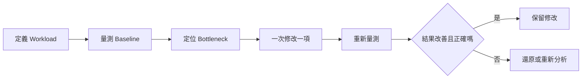
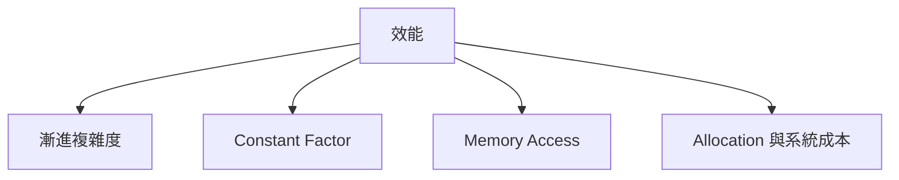
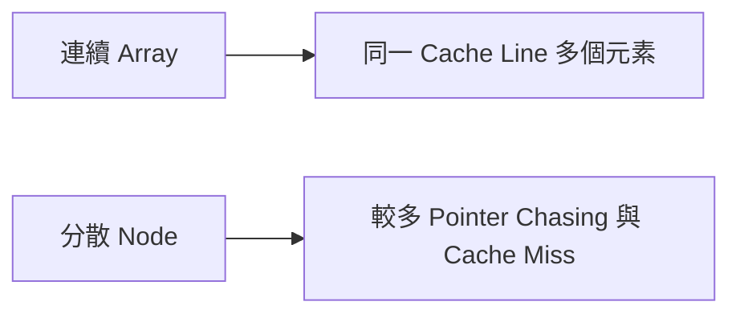
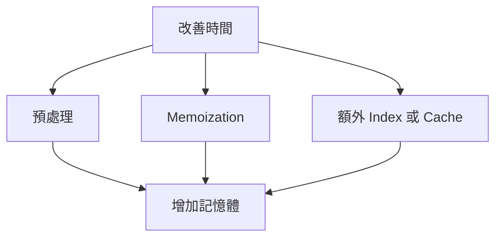

## 第 58 章　效能分析與最佳化

### 適用範圍

本章介紹如何以量測為基礎改善程式效能，包括理論複雜度、實際時間、Constant Factor、Cache Locality、Allocation、Recursion Cost、時間與空間取捨，以及 Bottleneck 定位。

### 58.1 先量測再改善

最佳化流程應從可重現的 Baseline 開始：



量測時記錄輸入規模、資料分布、編譯設定、執行環境、重複次數與統計方式。單次執行容易受到暖機、排程與背景工作影響。

### 58.2 理論複雜度與實際時間

Big-O 描述輸入成長時的主要趨勢，不直接等於秒數。兩個 O(n) 解法可能因記憶體配置、分支、資料布局與常數工作量而有明顯差異。



先避免不可接受的複雜度，再針對實際 Bottleneck 調整常數成本。

### 58.3 Benchmark 基本原則

- 使用足以超過計時器雜訊的 Workload。
- 重複執行並觀察 Median、分布或穩定區間。
- 避免把輸入生成與輸出列印混入核心計時，除非它們就是需求。
- 確保結果被使用，避免編譯器移除無效工作。
- 比較版本必須產生相同 Postcondition。

```cpp
const auto begin = std::chrono::steady_clock::now();
auto result = solve(input);
const auto end = std::chrono::steady_clock::now();
consume(result);
```

Microbenchmark 無法完全代表正式系統，仍需以實際 Workload 驗證。

### 58.4 Constant Factor

常見來源：

- 重複 Hash、比較或型別轉換。
- 不必要的資料複製。
- 迴圈內配置與釋放。
- 虛擬呼叫或昂貴抽象。
- Debug Logging 與 I/O。

不要在尚未定位 Bottleneck 時，為微小常數犧牲可讀性與正確性。

### 58.5 Cache Locality

連續記憶體通常較容易有效利用 Cache。Array 或 `std::vector` 的順序走訪，常比散布配置的 Node 結構更具 Locality。



資料結構選擇仍要符合主要操作。不能只因 Locality 就把需要頻繁局部鏈結修改的需求全部改成 Array。

### 58.6 Allocation 與 Recursion Cost

改善方向：

- 已知規模時使用 `reserve`。
- 重複使用 Buffer。
- 避免在內層迴圈反覆建立大型容器。
- 評估 Object Pool 是否真的必要。
- 深遞迴需考慮 Stack Overflow 與 Call Overhead。

Recursive 與 Iterative 誰較快不能只靠推測，應以同等正確版本量測。

### 58.7 時間與空間取捨



Prefix Sum、Hash Table、DP Memo 都是以空間換取時間。需同時評估峰值記憶體、資料生命週期與 Cache 影響。

### 58.8 尋找 Bottleneck

從整體時間占比最大的路徑開始，而不是最顯眼的函式。

```text
總改善上限受未改善部分限制
```

若核心函式只占總時間 5%，即使變快 10 倍，整體改善仍有限。Profiler、計時區段、Allocation 統計與硬體 Counter 可提供不同層次資訊。

### 58.9 演算法層級改善

優先檢查：

- O(n²) 是否可透過 Hash、排序或 Two Pointers 降低。
- 重複區間計算是否可用 Prefix。
- 重複 State 是否可 Memoize。
- 反覆找極值是否可用 Heap 或 Deque。
- 資料是否可批次處理。

演算法階數改善通常比微調單行程式更具影響。

### 58.10 正確性與 Regression

每次最佳化後都應：

- 執行既有 Unit Test。
- 和 Baseline 或 Brute Force 對拍。
- 測試邊界及最差資料分布。
- 檢查 Overflow、Iterator Invalid、Race 與 Ownership。
- 保存效能 Regression Benchmark。

### 58.11 常見問題與判讀

| 現象 | 可能原因 | 檢查方向 |
|---|---|---|
| Benchmark 波動很大 | Workload 太短或環境雜訊 | 增加執行時間與重複次數 |
| Microbenchmark 快、正式系統沒改善 | Bottleneck 不在該函式 | 看 End-to-end Profile |
| 空間改善反而變慢 | Cache 或額外計算增加 | 同時量測時間與記憶體 |
| `reserve` 後仍 Rehash | 預估不足 | 檢查實際元素數與 Load Factor |
| 最佳化後答案偶爾錯 | 未保留原 Invariant | 對拍與 Sanitizer |
| 只降低常數仍超時 | 複雜度階數不符限制 | 重新分析演算法 |

### 58.12 本章檢查表

- 我有可重現的 Baseline 與 Workload。
- 我先定位 Bottleneck，再修改程式。
- 我能區分 Big-O、Constant Factor 與 Memory Behavior。
- 我會控制 Benchmark 的編譯與輸入條件。
- 我知道 Cache Locality、Allocation 與 Recursion 的成本來源。
- 我會同時評估時間、空間與正確性。
- 我以 Regression Test 與 Benchmark 驗證修改。

### 58.13 本章重點

- 效能改善應從量測、定位 Bottleneck、單一修改與重新量測形成閉環。
- 理論複雜度決定成長趨勢，Constant Factor 與 Memory Behavior 影響實際時間。
- 連續資料通常具有較好的 Cache Locality，但資料結構仍應符合操作需求。
- 預配置、Buffer 重用與減少內層 Allocation 可降低實際成本。
- 算法層級改善通常比微調單行程式更重要。
- 最佳化不能犧牲 Postcondition、邊界安全與可維護性。
