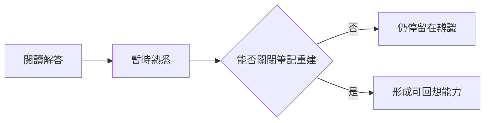
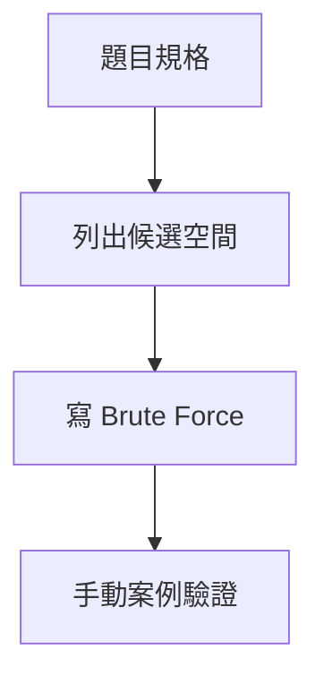
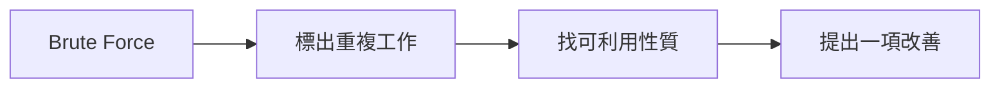
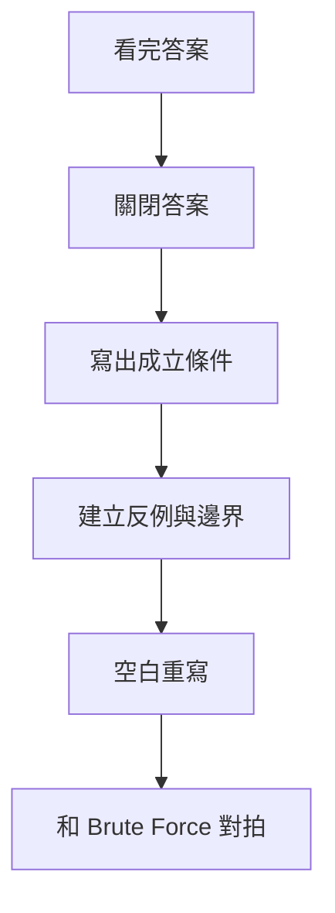

## 第 59 章　如何練習演算法

### 適用範圍

本章說明如何從「看懂解答」轉成能獨立分析、實作、測試與複習，並提供可直接使用的練習紀錄格式。

### 59.1 為什麼只看解答不容易進步

看懂是辨識，獨立完成是回想與建構。缺少輸出練習時，常只記得解答表面，無法重建成立條件與推理。



### 59.2 每題應保留的思考紀錄

```markdown
# 題目
## 規格與限制
## Brute Force
## 複雜度
## 關鍵性質
## 最佳化方法與成立條件
## Invariant / State
## 失敗案例
## 最終 C++ 實作
## 下次重寫日期
```

記錄應保留自己的第一版想法與錯誤原因，不只留下整理過的答案。

### 59.3 第一階段：完成暴力解

- 定義完整候選。
- 確認是否漏解或重複。
- 使用最小案例手動追蹤。
- 把它保留為 Oracle。



### 59.4 第二階段：分析複雜度

分開計算：

```text
候選數量 × 單一候選成本
```

另外記錄額外空間、遞迴深度、排序、Hash 與容器成本。不要只寫最終 Big-O，還要寫出成本來源。

### 59.5 第三階段：找出可利用的性質

檢查：

- 重複查找。
- 重複區間計算。
- 排序或單調性。
- 重複 State。
- 被支配候選。
- Graph Layer 或 Dependency。



### 59.6 第四階段：獨立重寫

看完提示或解答後：

1. 關閉解答。
2. 用自己的話寫 State、Invariant 或排除理由。
3. 從空白檔案重寫。
4. 自行建立測試。
5. 解釋每一行更新的理由。

如果只能逐行模仿，尚未完成這個階段。

### 59.7 第五階段：隔一段時間重新完成

可採用簡單週期：

```text
當天：整理與重寫
隔 1 天：不看筆記重寫核心
隔 7 天：重新解題與測試
隔 30 天：混合題型再次辨識
```


沒有必要固定照日期執行，重點是讓回想間隔逐步拉長，並依失敗程度調整。

### 59.8 如何使用提示

由小到大：

1. 題型方向。
2. 關鍵性質。
3. State 或 Invariant。
4. Transition 或 Pointer 更新。
5. Pseudocode。
6. 完整解答。

每取得一層提示，就先停止閱讀並重新嘗試。記錄「需要哪一層提示」可反映理解程度。

### 59.9 什麼時候可以看答案

若已完成：

- 寫清楚規格。
- 嘗試 Brute Force。
- 分析卡點。
- 建立至少一個反例。
- 設定合理時間限制。

就可以看提示或答案。目的不是耗盡時間，而是留下可診斷的思考紀錄。

### 59.10 看完答案後要做什麼



同時比較自己的版本與解答在 State、複雜度、可讀性與適用條件上的差異。

### 59.11 如何整理錯題

錯題分類可使用：

- 規格理解錯誤。
- 邊界錯誤。
- 模型或演算法選錯。
- State 定義不足。
- 更新順序錯誤。
- 複雜度不符。
- C++ 型別、Ownership 或 Iterator 問題。

每題留下「第一個錯誤狀態」與最小失敗案例，比只記正確答案更有複習價值。

### 59.12 如何判斷自己真的理解

- 能不看筆記說明 Precondition。
- 能由 State 推導 Transition。
- 能寫出反例說明錯誤方法。
- 能從空白重寫並通過測試。
- 能將方法遷移到外觀不同的題目。
- 能比較替代方法的時間與空間。

### 59.13 三種練習案例

#### 案例一：Two Sum

保留 O(n²) Pair Oracle，再重寫 Hash 版本，測試重複值與同一 Index。

#### 案例二：Sliding Window

先用 O(n²) 枚舉 Substring，再重寫 Frequency Window，記錄 Left 每次移動理由。

#### 案例三：Tree Height

先定義空 Tree 與 Leaf Height，再完成 Recursive 版本，最後用鏈狀 Tree 檢查 O(h) Stack。

### 59.14 常見問題與修正

| 問題 | 修正方式 |
|---|---|
| 只記演算法名稱 | 同時記成立條件與反例 |
| 只重看筆記 | 關閉筆記後重寫 |
| 沒有保存失敗案例 | 縮小並保存最小案例 |
| 一題卡太久 | 分層使用提示 |
| 題目做很多但常忘 | 安排間隔回想與混合練習 |
| 只測 Sample | 自建邊界與隨機對拍 |

### 59.15 本章檢查表

- 我保留規格、Brute Force、複雜度與失敗案例。
- 我知道自己需要哪一層提示。
- 我會關閉答案後從空白重寫。
- 我安排隔日、隔週與較長間隔的回想。
- 我能區分看懂、重現與遷移。
- 我把錯題原因分類，而不是只收藏題目。

### 59.16 本章重點

- 有效練習包含分析、實作、測試、回想與間隔複習。
- Brute Force 是理解候選空間與驗證改善版的重要基準。
- 提示應分層使用，每次只取得足以繼續思考的資訊。
- 看完答案後必須關閉答案、重建推理並從空白重寫。
- 錯題紀錄應保存第一個錯誤 State、反例與成立條件。
- 能獨立解釋、重寫、驗證與遷移，才較接近真正理解。
