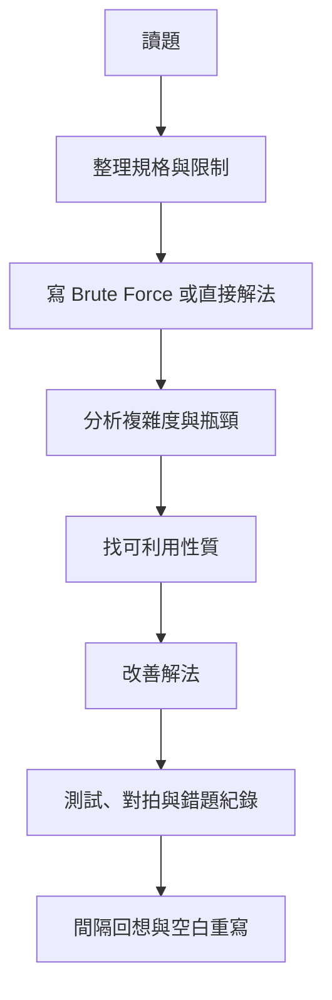
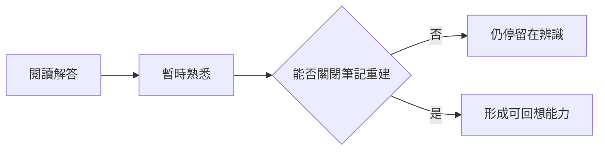
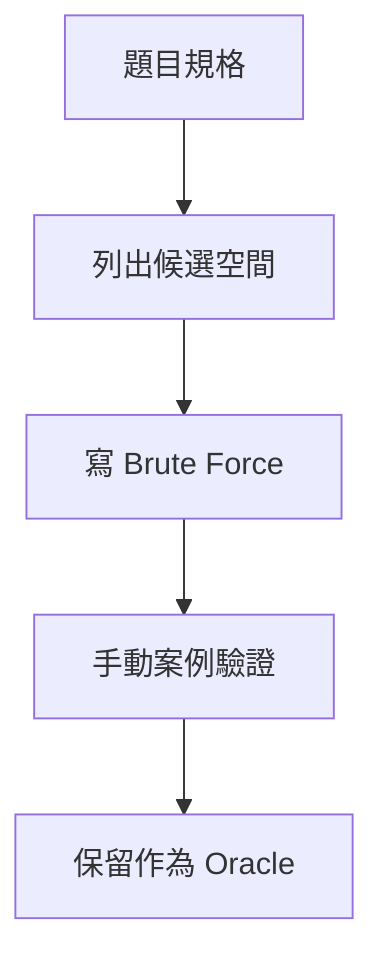
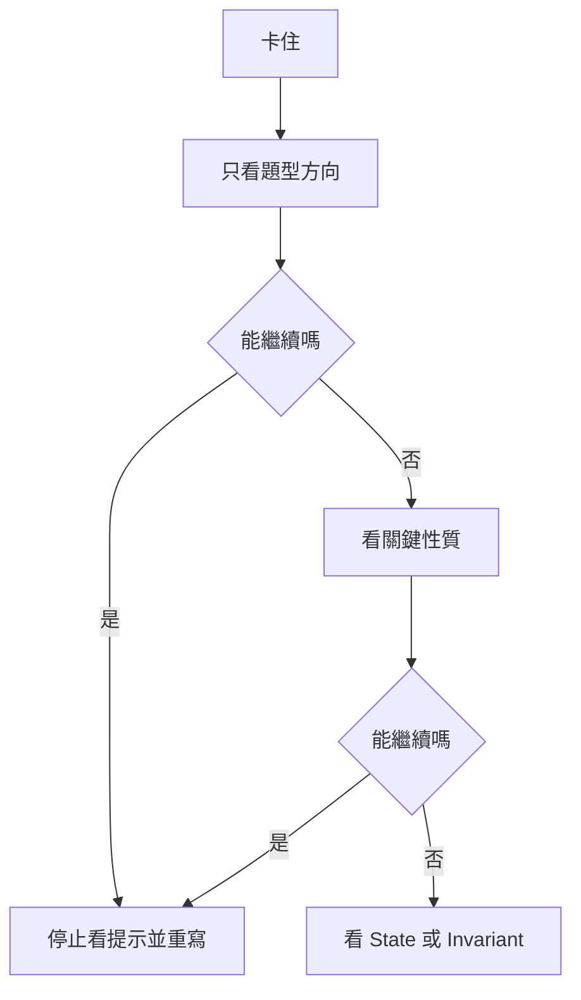
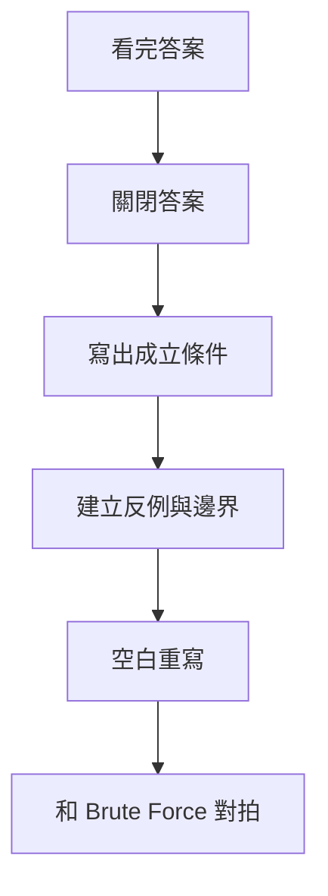

### 第 59 章　如何練習演算法

#### 適用範圍

本章說明如何從「看懂解答」轉成能獨立分析、實作、測試與複習。原本的章節已經包含 Brute Force、複雜度、可利用性質、分層提示、間隔回想與錯題整理等核心流程，本版補上更細的判斷標準、紀錄方式與可直接執行的練習範本。原始章節也強調，練習不應只留下整理過的答案，而要保留自己的第一版想法與錯誤原因。citeturn31search1

本章的目標不是要求每題寫長篇筆記，而是建立一套穩定流程：

- 先理解題目規格。
- 先完成可驗證的直接解法。
- 再分析複雜度與瓶頸。
- 找出可利用的資料性質。
- 看提示或答案後，必須關閉答案重新推導。
- 用間隔回想確認是否真的能獨立完成。
- 失敗時保留最小案例與第一個錯誤 State。



#### 適用讀者

- 看得懂題解，但關閉答案後寫不出來的讀者。
- 會背演算法名稱，但遇到變化題時無法調整 State 的讀者。
- 題目做很多，但一週後容易忘記的讀者。
- 常只測 Sample，沒有建立邊界與反例的讀者。
- 想把練習、錯題、複習與重寫流程固定下來的讀者。

#### 快速導覽

- [59.1 為什麼只看解答不容易進步](#591-為什麼只看解答不容易進步)
- [59.2 每題應保留的思考紀錄](#592-每題應保留的思考紀錄)
- [59.3 第一階段：完成直接解法](#593-第一階段完成直接解法)
- [59.4 第二階段：分析複雜度](#594-第二階段分析複雜度)
- [59.5 第三階段：找出可利用的性質](#595-第三階段找出可利用的性質)
- [59.6 第四階段：獨立重寫](#596-第四階段獨立重寫)
- [59.7 第五階段：隔一段時間重新完成](#597-第五階段隔一段時間重新完成)
- [59.8 如何使用提示](#598-如何使用提示)
- [59.9 什麼時候可以看答案](#599-什麼時候可以看答案)
- [59.10 看完答案後要做什麼](#5910-看完答案後要做什麼)
- [59.11 如何整理錯題](#5911-如何整理錯題)
- [59.12 如何判斷自己真的理解](#5912-如何判斷自己真的理解)
- [59.13 三種練習案例](#5913-三種練習案例)
- [59.14 一題練習的時間分配](#5914-一題練習的時間分配)
- [59.15 分層提示紀錄表](#5915-分層提示紀錄表)
- [59.16 錯題分類與回補方式](#5916-錯題分類與回補方式)
- [59.17 可直接使用的練習紀錄模板](#5917-可直接使用的練習紀錄模板)
- [59.18 每週練習安排](#5918-每週練習安排)
- [59.19 常見問題與修正](#5919-常見問題與修正)
- [59.20 本章檢查表](#5920-本章檢查表)
- [59.21 本章重點](#5921-本章重點)

#### 59.1 為什麼只看解答不容易進步

看懂解答是一種辨識能力。獨立完成則需要回想、建構與驗證。兩者需要的能力不同。

看解答時，很多資訊已經被整理好：

- 題目真正模型已被找出。
- State 或資料結構已經被定義。
- 邊界條件已經被處理。
- 複雜度瓶頸已經被指出。
- 程式更新順序已經整理完成。

因此，讀者常會覺得「我懂了」，但關閉答案後卻無法重新建立推理。



練習的重點是把辨識轉成輸出：

- 能用自己的話重述題目。
- 能先寫出直接解法。
- 能指出直接解法瓶頸。
- 能推導改善方向。
- 能空白重寫。
- 能用測試驗證。

#### 59.2 每題應保留的思考紀錄

每題至少保留以下內容：

```markdown
# 題目

## 規格與限制
- 輸入：
- 輸出：
- Constraint：
- 是否允許修改輸入：

## Brute Force / 直接解法
- 候選空間：
- 直接流程：
- 為什麼完整：

## 複雜度
- 候選數量：
- 每個候選成本：
- 時間：
- 空間：

## 關鍵性質
- 重複工作：
- 可利用性質：
- 成立條件：
- 反例：

## 改善方法
- 使用的資料結構或 State：
- 減少的工作：
- 核心流程：

## Invariant / State
- State 定義：
- Invariant：
- 終止條件：

## 測試與失敗案例
- 最小案例：
- 邊界案例：
- 反例：
- 第一個錯誤 State：

## 最終 C++ 實作
- Interface：
- 複雜度：

## 下次重寫日期
- Day 1：
- Day 7：
- Day 30：
```

紀錄不是越長越好，而是要留下下次能重新推導的關鍵資訊。尤其要保留自己的第一版想法與錯誤原因，不只留下整理後的標準答案。原始章節也明確提醒，紀錄應保留自己的第一版想法與錯誤原因。citeturn31search1

#### 59.3 第一階段：完成直接解法

直接解法的目的不是通過所有限制，而是建立正確答案的來源。

需要完成：

- 定義完整候選。
- 確認是否漏解或重複。
- 使用最小案例手動追蹤。
- 保留為 Oracle，之後可用來對拍。



常見候選空間：

<table>
<tr><th>題型</th><th>候選</th><th>常見數量</th></tr>
<tr><td>找最大值</td><td>每個元素</td><td>O(n)</td></tr>
<tr><td>Two Sum</td><td>所有 Index Pair</td><td>O(n²)</td></tr>
<tr><td>連續區間</td><td>所有 left、right</td><td>O(n²)</td></tr>
<tr><td>Subset</td><td>每個元素選或不選</td><td>O(2^n)</td></tr>
<tr><td>Permutation</td><td>所有排列</td><td>O(n!)</td></tr>
</table>

若直接解法都寫不出來，代表題目理解或候選空間尚未整理好。這時不建議直接背改善解法。

#### 59.4 第二階段：分析複雜度

複雜度應分開計算：

```text
時間 = 候選數量 × 單一候選成本
空間 = 額外資料結構 + 遞迴深度 + 輸出是否計入
```

例如 Two Sum 直接解法：

```text
候選：所有 i < j 的 Pair
候選數量：n(n - 1) / 2 = O(n²)
每個候選成本：比較一次 O(1)
時間：O(n²)
空間：O(1)
```

不要只寫最終 Big-O。要寫出來源，才能知道改善應該從哪裡開始。

額外記錄：

- 是否包含排序成本。
- 是否包含 Hash Table 建立成本。
- 是否包含 Graph 建圖成本。
- 是否包含遞迴 Call Stack。
- 是否包含輸出大小。

#### 59.5 第三階段：找出可利用的性質

改善解法通常不是憑空出現，而是對直接解法中的重複工作進行整理。

檢查：

- 重複查找。
- 重複區間計算。
- 排序或單調性。
- 重複 State。
- 被支配候選。
- Graph Layer 或 Dependency。


常見對照：

<table>
<tr><th>重複工作</th><th>可能工具</th><th>需確認</th></tr>
<tr><td>反覆查某值是否出現</td><td>Set、Map</td><td>是否需要 Index 或次數</td></tr>
<tr><td>反覆計算區間和</td><td>Prefix Sum</td><td>是否有動態更新</td></tr>
<tr><td>反覆求目前最小或最大</td><td>Heap</td><td>是否有 Stale Entry</td></tr>
<tr><td>反覆計算相同 State</td><td>Memoization、DP</td><td>State 是否完整</td></tr>
<tr><td>大量候選不可能成功</td><td>Pruning</td><td>剪枝條件是否一定成立</td></tr>
<tr><td>候選具單調分界</td><td>Binary Search</td><td>Predicate 是否單調</td></tr>
</table>

#### 59.6 第四階段：獨立重寫

看完提示或解答後，不應直接把答案整理成筆記就結束。

必須做：

- 關閉解答。
- 用自己的話寫 State、Invariant 或排除理由。
- 從空白檔案重寫。
- 自行建立測試。
- 解釋每一行更新的理由。

如果只能逐行模仿，尚未完成這個階段。原始章節也指出，如果只能逐行模仿，表示尚未完成獨立重寫階段。citeturn31search1

獨立重寫可分成三個層級：

<table>
<tr><th>層級</th><th>表現</th><th>下一步</th></tr>
<tr><td>重現</td><td>能照記憶寫出類似程式</td><td>補上 State 與 Invariant</td></tr>
<tr><td>推導</td><td>能從題目重新推導流程</td><td>加入變化題</td></tr>
<tr><td>遷移</td><td>外觀不同但結構相同時也能處理</td><td>加入混合題</td></tr>
</table>

#### 59.7 第五階段：隔一段時間重新完成

可採用簡單週期：

```text
當天：整理與重寫
隔 1 天：不看筆記重寫核心
隔 7 天：重新解題與測試
隔 30 天：混合題型再次辨識
```


沒有必要固定照日期執行，重點是讓回想間隔逐步拉長，並依失敗程度調整。原始章節也提到，不必僵化遵守日期，而是依回想結果調整。citeturn31search1

回想結果可分成：

<table>
<tr><th>回想結果</th><th>下次安排</th></tr>
<tr><td>完全想不起來</td><td>隔天重做，先補題目分析</td></tr>
<tr><td>知道方法但寫不出核心更新</td><td>2 到 3 天內重寫核心流程</td></tr>
<tr><td>能寫出但邊界錯</td><td>一週內加入邊界與反例題</td></tr>
<tr><td>能正確完成</td><td>延長到 2 到 4 週</td></tr>
<tr><td>能處理混合題</td><td>降低頻率，保留抽查</td></tr>
</table>

#### 59.8 如何使用提示

提示應由小到大使用：

1. 題型方向。
2. 關鍵性質。
3. State 或 Invariant。
4. Transition 或 Pointer 更新。
5. Pseudocode。
6. 完整解答。

每取得一層提示，就先停止閱讀並重新嘗試。記錄「需要哪一層提示」可反映理解程度。這也是原章節的核心建議之一。citeturn31search1



提示紀錄表：

<table>
<tr><th>提示層級</th><th>代表意義</th><th>後續練習</th></tr>
<tr><td>題型方向</td><td>能自己補上推導</td><td>做變化題</td></tr>
<tr><td>關鍵性質</td><td>辨識性質仍需訓練</td><td>多練問題分析</td></tr>
<tr><td>State / Invariant</td><td>核心建模不足</td><td>重寫 State 推導</td></tr>
<tr><td>Transition / Pointer 更新</td><td>流程轉程式不足</td><td>逐輪手動追蹤</td></tr>
<tr><td>Pseudocode</td><td>目前仍依賴骨架</td><td>隔日空白重寫</td></tr>
<tr><td>完整解答</td><td>需要補前置能力</td><td>回到對應基礎 Level</td></tr>
</table>

#### 59.9 什麼時候可以看答案

若已完成以下工作，就可以看提示或答案：

- 寫清楚規格。
- 嘗試直接解法。
- 分析卡點。
- 建立至少一個反例。
- 設定合理時間限制。

目的不是耗盡時間，而是留下可診斷的思考紀錄。這點原章節也有明確列出。citeturn31search1

建議時間限制：

<table>
<tr><th>題目狀態</th><th>建議嘗試時間</th></tr>
<tr><td>基礎題</td><td>20 到 30 分鐘</td></tr>
<tr><td>變化題</td><td>30 到 45 分鐘</td></tr>
<tr><td>新主題題</td><td>45 到 60 分鐘</td></tr>
<tr><td>重要錯題重做</td><td>先嘗試 20 分鐘，再看舊紀錄</td></tr>
</table>

若超過時間仍沒有進展，先看較低層提示，而不是直接看完整程式。

#### 59.10 看完答案後要做什麼

看完答案後，流程應該是：



同時比較自己的版本與解答：

<table>
<tr><th>比較項目</th><th>要問的問題</th></tr>
<tr><td>State</td><td>解答保存了哪些資訊？我的版本少了什麼？</td></tr>
<tr><td>複雜度</td><td>差異來自資料結構、排序還是剪枝？</td></tr>
<tr><td>可讀性</td><td>哪個版本較容易說明 Invariant？</td></tr>
<tr><td>成立條件</td><td>解答是否依賴排序、非負數或唯一性？</td></tr>
<tr><td>邊界</td><td>空、一筆、重複值、最大值如何處理？</td></tr>
</table>

#### 59.11 如何整理錯題

錯題分類可使用：

- 規格理解錯誤。
- 邊界錯誤。
- 模型或演算法選錯。
- State 定義不足。
- 更新順序錯誤。
- 複雜度不符。
- C++ 型別、Ownership 或 Iterator 問題。

每題留下「第一個錯誤狀態」與最小失敗案例，比只記正確答案更有複習價值。原始章節也提出，錯題應留下第一個錯誤 State 與最小失敗案例。citeturn31search1

錯題紀錄建議格式：

```markdown
## 錯題紀錄

- 現象：
- 最小失敗案例：
- 預期輸出：
- 實際輸出：
- 第一個錯誤 State：
- 原因分類：
- 修正方式：
- Regression Test：
- 下次回想日期：
```

避免只寫：

```text
粗心
想太複雜
忘記模板
```

這些描述無法轉成下一次可執行的檢查步驟。

#### 59.12 如何判斷自己真的理解

原章節列出的理解標準包括：能說明 Precondition、由 State 推導 Transition、寫出反例、空白重寫、遷移到外觀不同的題目，以及比較替代方法的時間與空間。citeturn31search1

可以將理解分成四層：

<table>
<tr><th>層級</th><th>狀態</th><th>檢查方式</th></tr>
<tr><td>看懂</td><td>讀解答時覺得合理</td><td>關閉答案後是否能重述？</td></tr>
<tr><td>重現</td><td>能寫出類似程式</td><td>改變變數名稱或邊界是否仍會？</td></tr>
<tr><td>推導</td><td>能從題目重新建立 State</td><td>能說明為什麼這樣更新？</td></tr>
<tr><td>遷移</td><td>能處理變化題</td><td>輸出或限制改變後能調整方法？</td></tr>
</table>

若只停在看懂或重現，之後遇到混合題時容易失效。

#### 59.13 三種練習案例

##### 案例一：Two Sum

練習流程：

1. 先枚舉所有 Pair。
2. 寫出 O(n²) Oracle。
3. 分析重複工作：每次都在找之前是否有互補值。
4. 使用 Hash Map 保存 value 到 index。
5. 測試重複值、同一 Index 與無答案。

要記錄：

```text
為什麼不能使用同一個 Index？
Hash Map 裡保存的是以前的值，還是目前值？
如果題目要求所有答案，流程如何改變？
```

##### 案例二：Sliding Window

練習流程：

1. 先用 O(n²) 枚舉所有 Substring。
2. 手動列出每個 Window 的 Frequency。
3. 定義 Window State。
4. 重寫 Frequency Window。
5. 記錄 Left 每次移動的理由。

要特別確認：

```text
Window 是 [left, right] 還是 [left, right)？
何時更新答案？
資料若含負數，這個 Window 邏輯是否仍成立？
```

##### 案例三：Tree Height

練習流程：

1. 定義空 Tree Height。
2. 定義 Leaf Height。
3. 寫出 Recursive Function 的回傳意義。
4. 使用鏈狀 Tree 測試 O(h) Stack。
5. 比較 Node 數與高度的差異。

要記錄：

```text
height(nullptr) 是 0 還是 -1？
height 以 Node 數算，還是 Edge 數算？
遞迴最大深度是多少？
```

#### 59.14 一題練習的時間分配

可依題型調整，但一題完整練習可以使用以下配置：

<table>
<tr><th>階段</th><th>建議時間</th><th>產出</th></tr>
<tr><td>讀題與規格整理</td><td>5 到 10 分鐘</td><td>輸入、輸出、Constraint、邊界</td></tr>
<tr><td>直接解法</td><td>10 到 20 分鐘</td><td>候選空間與 Oracle</td></tr>
<tr><td>複雜度與瓶頸</td><td>5 到 10 分鐘</td><td>成本來源與重複工作</td></tr>
<tr><td>改善推導</td><td>10 到 25 分鐘</td><td>資料結構或 State</td></tr>
<tr><td>實作與測試</td><td>15 到 30 分鐘</td><td>C++ 程式與測試案例</td></tr>
<tr><td>整理與複習安排</td><td>5 到 10 分鐘</td><td>失敗案例與重寫日期</td></tr>
</table>

若某階段明顯超時，先記錄卡點，再使用分層提示。

#### 59.15 分層提示紀錄表

每題可加入：

<table>
<tr><th>項目</th><th>紀錄</th></tr>
<tr><td>完全不看提示是否完成</td><td>是 / 否</td></tr>
<tr><td>需要的第一層提示</td><td>題型 / 性質 / State / Transition / Pseudocode / 完整答案</td></tr>
<tr><td>卡住位置</td><td>規格 / 候選空間 / State / 實作 / 測試</td></tr>
<tr><td>下次回補</td><td>對應章節或 Level</td></tr>
</table>

提示層級本身就是進步指標。如果從「需要完整答案」變成「只需要關鍵性質」，代表推導能力正在形成。

#### 59.16 錯題分類與回補方式

<table>
<tr><th>錯題類型</th><th>可能回補方向</th></tr>
<tr><td>規格理解錯誤</td><td>第 3 章問題分析與第 61 章紀錄模板</td></tr>
<tr><td>邊界錯誤</td><td>附錄 C、Level 1 走訪與區間</td></tr>
<tr><td>模型或演算法選錯</td><td>附錄 F 解法選擇速查表</td></tr>
<tr><td>State 定義不足</td><td>DP 基礎、Graph State、Tree Subtree State</td></tr>
<tr><td>更新順序錯誤</td><td>Sliding Window、DP 填表、Heap Lazy Deletion</td></tr>
<tr><td>複雜度不符</td><td>附錄 A、附錄 B</td></tr>
<tr><td>C++ 型別或 Iterator 問題</td><td>附錄 G 與附錄 C</td></tr>
</table>

錯題不是收藏越多越好，而是要能指向下一次具體訓練。

#### 59.17 可直接使用的練習紀錄模板

```markdown
# 題目名稱

## 1. 規格與限制
- 一句話摘要：
- 輸入：
- 輸出：
- Constraint：
- 是否允許修改輸入：
- 特殊規則：

## 2. 邊界條件
- 空輸入：
- 單一元素：
- 無答案：
- 重複值：
- 極端值：

## 3. Brute Force / 直接解法
- 候選空間：
- 直接流程：
- 為什麼不漏解：
- 時間：
- 空間：

## 4. 複雜度瓶頸
- 哪個工作被重複：
- 哪個成本最大：
- 是否能作為 Oracle：

## 5. 可利用性質
- 性質：
- 成立條件：
- 反例：

## 6. 改善方法
- 新增資料結構或 State：
- 核心 Invariant：
- 核心流程：
- 交換的時間 / 空間成本：

## 7. C++ 實作
- Interface：
- 主要變數語意：
- 容易錯的更新：

## 8. 測試
- Sample：
- 最小案例：
- 邊界案例：
- 反例：
- 隨機對拍：

## 9. 錯題紀錄
- 現象：
- 最小失敗案例：
- 第一個錯誤 State：
- 原因分類：
- 修正方式：
- Regression Test：

## 10. 複習
- 需要的提示層級：
- Day 1：
- Day 7：
- Day 30：
- 類似題型：
```

#### 59.18 每週練習安排

##### 輕量版本

```text
第 1 次：新概念 + 基礎題
第 2 次：空白重寫 + 邊界測試
第 3 次：變化題或混合題
第 4 次：錯題回想 + 反例整理
```

##### 標準版本

<table>
<tr><th>日程</th><th>主要工作</th><th>輸出</th></tr>
<tr><td>週一</td><td>新概念與小型手動追蹤</td><td>State、Invariant、範例</td></tr>
<tr><td>週二</td><td>基礎題空白重寫</td><td>可測試程式</td></tr>
<tr><td>週三</td><td>變化題</td><td>規格差異紀錄</td></tr>
<tr><td>週四</td><td>錯題與反例</td><td>最小失敗案例</td></tr>
<tr><td>週五</td><td>混合題</td><td>方法選擇理由</td></tr>
<tr><td>週末</td><td>限時重做與整理</td><td>下週計畫</td></tr>
</table>

#### 59.19 常見問題與修正

<table>
<tr><th>問題</th><th>修正方式</th></tr>
<tr><td>只記演算法名稱</td><td>同時記成立條件與反例</td></tr>
<tr><td>只重看筆記</td><td>關閉筆記後重寫</td></tr>
<tr><td>沒有保存失敗案例</td><td>縮小並保存最小案例</td></tr>
<tr><td>一題卡太久</td><td>分層使用提示</td></tr>
<tr><td>題目做很多但常忘</td><td>安排間隔回想與混合練習</td></tr>
<tr><td>只測 Sample</td><td>自建邊界與隨機對拍</td></tr>
<tr><td>看懂題解後不會寫</td><td>遮住答案，先寫 State 與核心流程</td></tr>
<tr><td>錯題反覆出現</td><td>記錄第一個錯誤 State 與 Regression Test</td></tr>
</table>

#### 59.20 本章檢查表

- 我保留規格、直接解法、複雜度與失敗案例。
- 我能列出候選空間，而不是直接背改善解法。
- 我知道直接解法的瓶頸來自哪個重複工作。
- 我知道自己需要哪一層提示。
- 我會關閉答案後從空白重寫。
- 我安排隔日、隔週與較長間隔的回想。
- 我能區分看懂、重現、推導與遷移。
- 我把錯題原因分類，而不是只收藏題目。
- 我保存最小失敗案例與第一個錯誤 State。
- 我會用直接解法作為 Oracle 對拍改善版。

#### 59.21 本章重點

- 有效練習包含分析、實作、測試、回想與間隔複習。
- 看懂是辨識，獨立完成需要回想與建構。
- Brute Force 是理解候選空間與驗證改善版的重要基準。
- 複雜度應寫出成本來源，而不是只寫最後 Big-O。
- 提示應分層使用，每次只取得足以繼續思考的資訊。
- 看完答案後必須關閉答案、重建推理並從空白重寫。
- 錯題紀錄應保存第一個錯誤 State、反例與成立條件。
- 能獨立解釋、重寫、驗證與遷移，才較接近真正理解。
