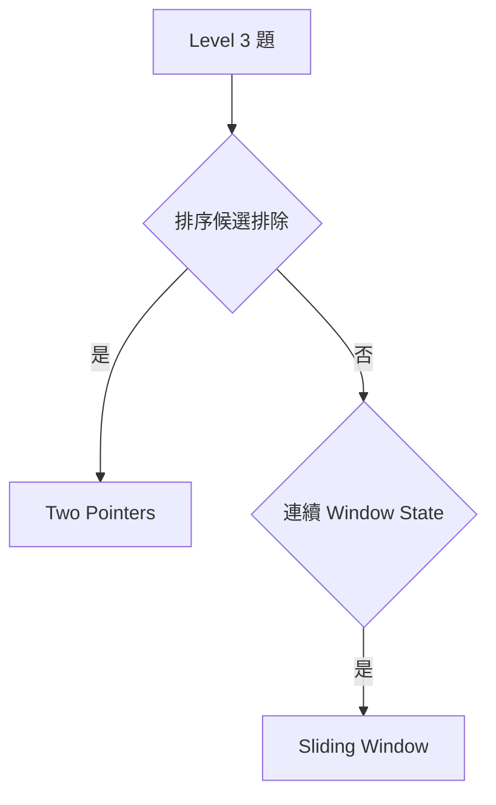
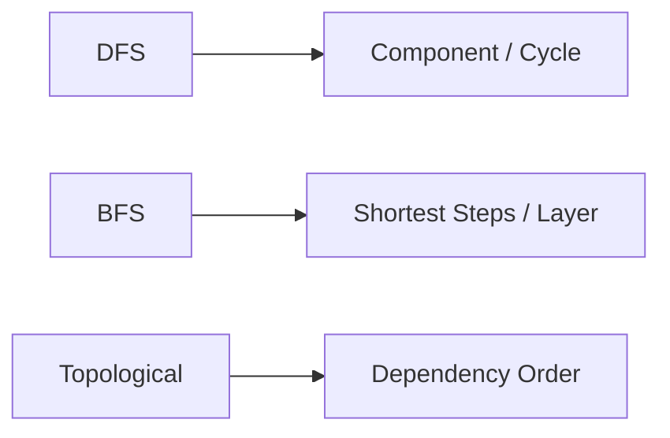
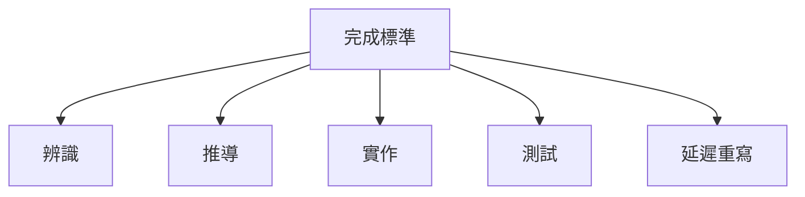
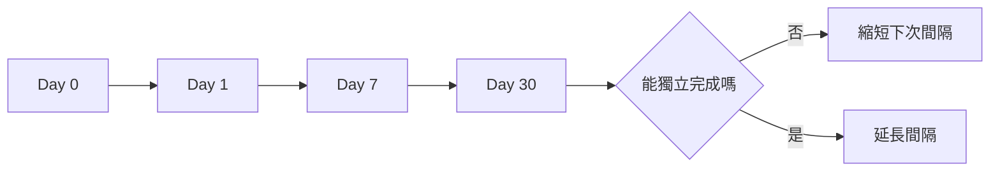
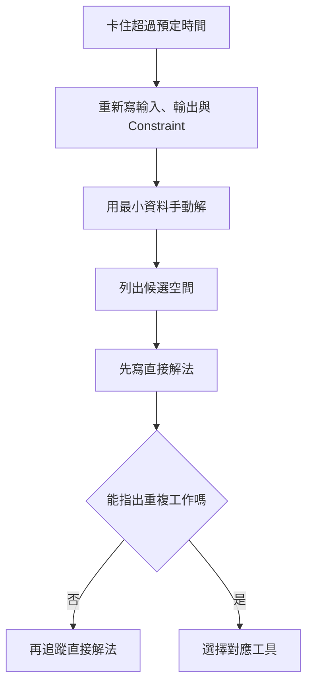

### 第 60 章　題目分級與練習路線

#### 適用範圍

本章將演算法練習依技能相依關係分成十個 Level，並定義每級的完成標準、題目配置、複習週期與升降級規則。

Level 是學習導航，不代表題目難度具有絕對分界。同一道題可能因輸出要求、限制條件或資料型態不同，而落在不同 Level。例如同樣是「找路」，若所有 Edge 成本相同，可能是 BFS；若 Edge 有非負 Weight，則可能需要 Dijkstra。

本章的目標不是讓你快速堆題數，而是建立一套可維持的練習節奏：

- 先補穩基本輸入、輸出、Index、State 與複雜度。
- 再依技能相依關係往上練習。
- 每個 Level 都要完成辨識、推導、實作、測試與延遲重寫。
- 高階題若反覆卡在基本 Bug，回補對應 Level。


可依既有能力跳級，但若高階題反覆卡在 Pointer、State、邊界或複雜度，應回到對應基礎 Level 補強。

#### 適用讀者

- 想從零散刷題改成系統化練習的讀者。
- 常做很多題，但一週後無法重寫的讀者。
- 看到題解能理解，但自己從空白開始困難的讀者。
- 想建立面試、Graph 或 DP 強化路線的讀者。
- 希望用完成標準，而不是題數，追蹤學習進度的讀者。

#### 快速導覽

- [60.1 整體路線](#601-整體路線)
- [60.2 如何判斷目前所在 Level](#602-如何判斷目前所在-level)
- [60.3 Level 1：走訪與基本模擬](#603-level-1走訪與基本模擬)
- [60.4 Level 2：Hash、Stack 與 Queue](#604-level-2hashstack-與-queue)
- [60.5 Level 3：Two Pointers 與 Sliding Window](#605-level-3two-pointers-與-sliding-window)
- [60.6 Level 4：Binary Search 與 Prefix Sum](#606-level-4binary-search-與-prefix-sum)
- [60.7 Level 5：Tree Traversal](#607-level-5tree-traversal)
- [60.8 Level 6：DFS、BFS 與 Topological Sort](#608-level-6dfsbfs-與-topological-sort)
- [60.9 Level 7：Heap、Greedy 與 Union Find](#609-level-7heapgreedy-與-union-find)
- [60.10 Level 8：基礎 Dynamic Programming](#6010-level-8基礎-dynamic-programming)
- [60.11 Level 9：Shortest Path 與進階 DP](#6011-level-9shortest-path-與進階-dp)
- [60.12 Level 10：Range Query 與進階資料結構](#6012-level-10range-query-與進階資料結構)
- [60.13 每個等級的完成標準](#6013-每個等級的完成標準)
- [60.14 題目配置](#6014-題目配置)
- [60.15 如何設計變化題與反例題](#6015-如何設計變化題與反例題)
- [60.16 複習週期](#6016-複習週期)
- [60.17 每週安排範本](#6017-每週安排範本)
- [60.18 升級與降級規則](#6018-升級與降級規則)
- [60.19 三條建議路線](#6019-三條建議路線)
- [60.20 卡題時的處理流程](#6020-卡題時的處理流程)
- [60.21 進度追蹤模板](#6021-進度追蹤模板)
- [60.22 常見問題與修正](#6022-常見問題與修正)
- [60.23 本章檢查表](#6023-本章檢查表)
- [60.24 本章重點](#6024-本章重點)

#### 60.1 整體路線

十個 Level 的順序如下：

<table>
<tr><th>Level</th><th>主題</th><th>核心能力</th></tr>
<tr><td>1</td><td>走訪與基本模擬</td><td>Index、區間、迴圈、邊界、O(n)、O(n²)</td></tr>
<tr><td>2</td><td>Hash、Stack、Queue</td><td>Key、Value、容器 State、平均 O(1)、Empty 檢查</td></tr>
<tr><td>3</td><td>Two Pointers、Sliding Window</td><td>候選排除、Window Boundary、Validity</td></tr>
<tr><td>4</td><td>Binary Search、Prefix Sum</td><td>單調性、Lower Bound、Prefix State、Range Query</td></tr>
<tr><td>5</td><td>Tree Traversal</td><td>Subtree Return、Pre/In/Postorder、Height、Diameter</td></tr>
<tr><td>6</td><td>DFS、BFS、Topological Sort</td><td>Graph、Visited、Component、Layer、Dependency</td></tr>
<tr><td>7</td><td>Heap、Greedy、DSU</td><td>動態極值、Greedy 證明、Connectivity</td></tr>
<tr><td>8</td><td>基礎 DP</td><td>State、Transition、Base Case、Order、Answer</td></tr>
<tr><td>9</td><td>Shortest Path、進階 DP</td><td>依 Weight 選方法、Path Reconstruction、Interval / Tree DP</td></tr>
<tr><td>10</td><td>Range Query、進階結構</td><td>Fenwick、Segment Tree、Sparse Table、Lazy State</td></tr>
</table>

這個順序的理由是：高階題常由多個低階技能組成。例如 Dijkstra 需要 Graph State、Heap、Stale Entry 與距離陣列；Segment Tree 需要區間定義、遞迴、Node State 與 Merge。

#### 60.2 如何判斷目前所在 Level

不要只依「做過哪些題」判斷。目前所在 Level 應看你能否完成一個完整循環。

<table>
<tr><th>能力</th><th>尚未穩定</th><th>已達成</th></tr>
<tr><td>辨識</td><td>看到題目只能猜演算法名稱</td><td>能從輸入、輸出與限制提出候選方法</td></tr>
<tr><td>推導</td><td>需要背程式或看提示</td><td>能從 State、Invariant 或候選空間推導核心流程</td></tr>
<tr><td>實作</td><td>邊界與型別反覆出錯</td><td>能從空白寫出清楚版本</td></tr>
<tr><td>測試</td><td>只跑 Sample</td><td>能自行建立邊界、反例與最差案例</td></tr>
<tr><td>延遲回想</td><td>隔天便無法重寫</td><td>一週後仍能說出成立條件並完成代表題</td></tr>
</table>

可以分主題標記，而不是整個 Level 一次打分：

```text
Level 4 Binary Search：穩定
Level 4 Prefix Sum：需補強
Level 4 Prefix + Hash：尚未開始
```

Level 是學習導航，不是能力評價。標記缺口的目的，是決定下一輪練習內容。

#### 60.3 Level 1：走訪與基本模擬

能力：

- 正確使用 Index 與區間。
- 寫 Loop Invariant。
- 處理空、一筆、邊界與 Overflow。
- 分析 O(n)、O(n²)。

題型：

- Array 走訪。
- String 逐字元處理。
- Matrix 模擬。
- Counting。
- 基礎最大值、最小值、Frequency。

練習重點：

- 每個迴圈開始前，說明 `i` 的範圍。
- 每個累積變數都要說明保存什麼。
- 空輸入與單一元素要先測。
- 中間結果可能超過 `int` 時，使用 `long long`。

代表題方向：

```text
找最大值與第二大值
計算 Frequency
字串反轉
矩陣逐列與逐欄走訪
依規則模擬狀態變化
```

完成訊號：不再因基本越界、空輸入或計數初始化而頻繁中斷主流程。

#### 60.4 Level 2：Hash、Stack 與 Queue

能力：

- 定義 Key、Value 與 Stack / Queue Element 語意。
- 安全處理 Empty。
- 區分平均 O(1) 與排序容器。

題型：

- Frequency。
- Two Sum。
- 括號匹配。
- Monotonic Stack 基礎。
- Queue 模擬。

練習時要能說明：

```text
Hash Set：以前看過哪些 Key？
Hash Map：Key 對應哪一項 State？
Stack：尚未配對或等待處理什麼？
Queue：已發現但尚未展開什麼？
```

常見混淆：

- `unordered_map[key]` 可能插入預設值。
- Stack 的 `top()` 前要確認非空。
- BFS 常在入列時標記 Visited，避免重複入列。

#### 60.5 Level 3：Two Pointers 與 Sliding Window

能力：

- 說明 Pointer 移動排除哪些候選。
- 定義 Window Boundary、State、Validity。
- 區分最長與最短更新時機。



Two Pointers 的紀錄重點：

```text
移動 left 或 right 時，排除了哪些候選？
為什麼被排除的候選不可能成為答案？
```

Sliding Window 的紀錄重點：

```text
Window 是 [left, right] 還是 [left, right)？
Window State 保存什麼？
何時擴張、何時收縮？
答案在有效時更新，還是失效前更新？
```

如果資料含負數，要重新確認以 Sum 為基礎的 Window 是否仍具單調性。

#### 60.6 Level 4：Binary Search 與 Prefix Sum

能力：

- 由區間定義推導 Binary Search 更新。
- 使用 Lower Bound、Upper Bound。
- 定義 `prefix[i]` 與 Half-open Query。
- 了解 Prefix + Hash。

Binary Search 至少要能處理：

- Exact Match。
- Lower Bound。
- Upper Bound。
- First True / Last True。
- Binary Search on Answer。

Prefix Sum 要固定寫出：

```text
prefix[i] 包含原資料的哪些位置？
Range Query 使用哪種區間語意？
```

混合題方向：排序 Pair、答案搜尋、Range Sum、Subarray Sum、Prefix + Hash。

#### 60.7 Level 5：Tree Traversal

能力：

- 定義 Recursive Function 對 Subtree 的回傳值。
- 完成 Preorder、Inorder、Postorder、Level-order。
- 計算 Height、Balance、Diameter。
- 分析 O(n) 與 O(h) Stack。

每個 Recursive Function 先寫一句定義：

```text
此函式接收某個 Node，回傳它的 Subtree 的什麼答案？
```

要能區分：

- Entry 時處理：Preorder。
- 左右 Child 之間處理：Inorder。
- Child 完成後處理：Postorder。
- 依層處理：BFS。

若 Tree 以無向 Adjacency List 保存，要排除 Parent 或使用 Visited。

#### 60.8 Level 6：DFS、BFS 與 Topological Sort

能力：

- 建立 Graph 與 Visited State。
- 解 Component、Unweighted Distance、Grid BFS。
- 使用 Indegree 或三色 DFS 處理 Dependency。



先整理 Graph：

```text
Node 是什麼？
Edge 是什麼？
有向或無向？
是否有 Weight？
Visited Key 是什麼？
```

方法選擇：

- DFS：Component、Cycle、Subtree 式聚合、走到底再返回。
- BFS：Unweighted Shortest Steps、Layer、最早到達。
- Topological Sort：DAG Dependency Order。

要特別測試孤立 Node、多個 Component 與 Cycle。

#### 60.9 Level 7：Heap、Greedy 與 Union Find

能力：

- 維持動態極值並處理 Stale Entry。
- 使用 Exchange 或 Stay-ahead 說明 Greedy。
- 使用 DSU 維護動態 Component。
- 完成 Kruskal、基礎 Prim。

Heap 題要先回答：

```text
需要快速淘汰哪個候選？
Heap Top 應該是最大值還是最小值？
是否可能有 Stale Entry？
```

Greedy 題不得只記「排序後選」。至少要提出 Exchange Argument、Stay-ahead 或其他安全性理由。

DSU 題則要確認只需 Connectivity 與 Union，不需要輸出實際 Path，也不需要任意刪除 Edge。

#### 60.10 Level 8：基礎 Dynamic Programming

能力：

- 寫出 State、Transition、Base Case、Order、Answer。
- 完成一維 DP、Grid DP、0/1 Knapsack。
- 區分不可達 State 與合法 0。
- 說明空間改善的更新方向。

每題固定填五欄：

```text
State
Transition
Base Case
計算順序
答案位置
```

若 Transition 寫不出來，先問最後一步有哪些合法來源。若 State 數量太多，檢查是否保存了不影響未來的資訊。

#### 60.11 Level 9：Shortest Path 與進階 DP

能力：

- 依 Weight 選 BFS、0-1 BFS、Dijkstra、Bellman-Ford。
- 處理 Negative Cycle 與 Path Reconstruction。
- 完成 LIS、LCS、Edit Distance、Interval 或 Tree DP 入門。

Shortest Path 先依 Weight 分類：

<table>
<tr><th>Weight 條件</th><th>優先檢查的方法</th></tr>
<tr><td>全部相同</td><td>BFS</td></tr>
<tr><td>只有 0 與 1</td><td>0-1 BFS</td></tr>
<tr><td>全部非負</td><td>Dijkstra</td></tr>
<tr><td>可能有負 Edge</td><td>Bellman-Ford 等</td></tr>
<tr><td>DAG</td><td>Topological Order 上的 DP</td></tr>
</table>

進階 DP 要開始練習二維 State、區間長度順序、Tree Subtree State 與 Reconstruction。

#### 60.12 Level 10：Range Query 與進階資料結構

能力：

- 區分靜態、Point Update、Range Update。
- 使用 Fenwick Tree、Segment Tree 或 Sparse Table。
- 清楚定義 Node State、Merge 與 Lazy State。
- 分析 O(log n) Update、Query 的由來。

先分類更新與查詢：

<table>
<tr><th>需求</th><th>可考慮</th></tr>
<tr><td>靜態 Range Sum</td><td>Prefix Sum</td></tr>
<tr><td>Point Update + Prefix / Range Sum</td><td>Fenwick Tree</td></tr>
<tr><td>一般 Range Query + Point Update</td><td>Segment Tree</td></tr>
<tr><td>Range Update + Range Query</td><td>Lazy Segment Tree 或特定差分技巧</td></tr>
<tr><td>靜態 RMQ</td><td>Sparse Table</td></tr>
</table>

學習目標不是背 Tree Array，而是能定義每個 Node 保存什麼、如何 Merge，以及 Lazy State 如何作用。

#### 60.13 每個等級的完成標準

不要只以完成題數判斷。每級至少應能：

- 不看筆記完成代表題。
- 說明成立條件與反例。
- 寫出時間、空間及成本來源。
- 建立邊界測試。
- 一週後重寫核心流程。
- 在混合題中辨識方法。



#### 60.14 題目配置

每個主題可以使用：

```text
2 題基礎：熟悉 State 與基本流程
3 題變化：改變邊界、輸出或限制
2 題混合：和其他工具組合
1 題反例：說明常見錯法為什麼不成立
```


若基礎題仍依賴答案，應先重寫而不是快速增加新題。

#### 60.15 如何設計變化題與反例題

不一定要一直找新題。可以修改已完成題目的規格：

- 存在性改成回傳位置。
- 任意答案改成全部答案。
- 不重複值改成含重複值。
- 已排序改成未排序。
- 允許修改輸入改成不可修改。
- Unweighted 改成 Weighted。
- 靜態資料改成動態更新。
- 線性結構改成 Circular。

反例題則用來測試推理成立條件：

<table>
<tr><th>直覺</th><th>可嘗試的反例</th></tr>
<tr><td>總和太大就移動左端</td><td>加入負數</td></tr>
<tr><td>每次選最大值最好</td><td>設計選大值後破壞後續選擇</td></tr>
<tr><td>BFS 能找最低成本</td><td>加入不同 Edge Weight</td></tr>
<tr><td>Hash Set 可直接輸出排序結果</td><td>要求穩定或排序順序</td></tr>
<tr><td>剪枝時 Sum 超過 Target 就停</td><td>加入負數</td></tr>
<tr><td>Heap 內部已完整排序</td><td>檢查同層非 Parent-Child 元素</td></tr>
</table>

#### 60.16 複習週期

建議起點：

```text
Day 0：完成與整理
Day 1：核心重寫
Day 7：整題重做
Day 30：混合題型測試
```



依回想結果調整：

<table>
<tr><th>回想結果</th><th>下次安排</th></tr>
<tr><td>完全無法開始</td><td>隔天重做，先補問題分析</td></tr>
<tr><td>能說方法但寫不出來</td><td>2 到 3 天內空白重寫</td></tr>
<tr><td>能完成但邊界出錯</td><td>一週內加入變化案例</td></tr>
<tr><td>能獨立完成並解釋</td><td>延長到 2 到 4 週</td></tr>
<tr><td>混合題也能辨識</td><td>降低頻率，保留抽查</td></tr>
</table>

真正應記錄的是回想結果，而不是只勾選日期。

#### 60.17 每週安排範本

##### 輕量版本

```text
第 1 次：新概念 30 分鐘 + 基礎題 30 分鐘
第 2 次：空白重寫 30 分鐘 + 邊界測試 20 分鐘
第 3 次：變化題或混合題 60 分鐘
第 4 次：錯題回想、反例與下週規劃 45 分鐘
```

若一週中斷，不需要補做全部欠題。保留下一次固定時段，從最近一次失敗紀錄重新開始。

##### 標準版本

<table>
<tr><th>日程</th><th>主要工作</th><th>輸出</th></tr>
<tr><td>週一</td><td>新概念與小型手動追蹤</td><td>State、Invariant、範例表</td></tr>
<tr><td>週二</td><td>基礎題空白重寫</td><td>可編譯程式與邊界測試</td></tr>
<tr><td>週三</td><td>變化題</td><td>規格差異與方法調整</td></tr>
<tr><td>週四</td><td>錯題與反例</td><td>最小失敗案例與 Regression Test</td></tr>
<tr><td>週五</td><td>混合題</td><td>方法選擇理由</td></tr>
<tr><td>週末</td><td>限時重做與整理</td><td>完成標準評估與下週計畫</td></tr>
</table>

#### 60.18 升級與降級規則

可以升級：

- 代表題能獨立完成。
- 一週後仍能推導。
- 遇到變化題能調整 State。
- 能說明方法成立條件與反例。
- 能寫出時間與空間成本來源。

應回補：

- 只能認出題型，不能說明條件。
- 常在相同邊界失敗。
- 依賴背誦程式。
- 複雜度與正確性說不清楚。
- 高階題卡在低階狀態或容器使用。

降級不是重頭學習，而是針對缺口回補。

<table>
<tr><th>高階題現象</th><th>可能回補方向</th></tr>
<tr><td>DP Index 一直錯</td><td>Level 1 區間與 Level 4 Prefix 定義</td></tr>
<tr><td>Graph DFS 無限循環</td><td>Level 2 Container State 與 Level 6 Visited</td></tr>
<tr><td>Dijkstra 不理解 Heap 資料</td><td>Level 7 Heap 與 Stale Entry</td></tr>
<tr><td>Segment Tree 邊界混亂</td><td>Level 1 區間、Level 4 Prefix、Level 10 Node Range</td></tr>
<tr><td>Backtracking 答案互相污染</td><td>Recursion 與 Mutable State 還原</td></tr>
</table>

#### 60.19 三條建議路線

##### 面試基礎路線

建議順序：

```text
Level 1 -> 2 -> 3 -> 4 -> 5 -> 6 -> 7 -> 8
```

如果時間有限，可優先：Array / Hash / Two Pointers / Binary Search / Tree / Graph / Heap / 基礎 DP。

##### Graph 強化路線

```text
Level 1、2 -> Graph 基礎 -> Level 5、6 -> Level 7 -> Level 9
```

Tree Traversal 對理解 DFS Return、Parent 與 Subtree State 有幫助，不建議完全略過。

##### DP 強化路線

```text
Level 1、3、4 -> Recursion / Backtracking -> Level 8 -> Level 9 -> Level 10
```

DP 前若不熟悉遞迴、候選空間與 State，容易只背 Transition。應先確保能從直接遞迴找出重複子問題。

#### 60.20 卡題時的處理流程



不要一卡住就搜尋完整答案。可分級取得提示：

1. 只看題型或資料性質提示。
2. 只看 State 定義。
3. 只看核心 Transition 或 Invariant。
4. 最後才看完整程式。

看過提示後，應關閉答案並從空白重寫。

#### 60.21 進度追蹤模板

```markdown
# 本週主題

## 目前 Level
- 主題：
- 自評：尚未開始 / 需要提示 / 可獨立完成 / 可處理變化

## 本週代表題
- 基礎題：
- 變化題：
- 混合題：
- 反例題：

## 每題最低紀錄
- State / Invariant：
- 成立條件：
- 時間 / 空間：
- 邊界案例：
- 常見錯法：

## 延遲回想
- Day 1：
- Day 7：
- Day 30：

## 本週失敗模式
- 現象：
- 最小案例：
- 回補 Level：
- 下週調整：
```

#### 60.22 常見問題與修正

<table>
<tr><th>問題</th><th>修正方式</th></tr>
<tr><td>題數增加但不會重寫</td><td>降低新題比例，加入延遲回想</td></tr>
<tr><td>一直停在簡單題</td><td>使用完成標準決定升級</td></tr>
<tr><td>高階題卡在基本 Bug</td><td>回補對應 Level 的代表題</td></tr>
<tr><td>只做同一類題</td><td>每週加入混合題</td></tr>
<tr><td>複習只看筆記</td><td>改成空白重寫與自建測試</td></tr>
<tr><td>路線太滿而中斷</td><td>減少題量，保留固定節奏</td></tr>
<tr><td>看過題解後以為會了</td><td>隔天遮住答案重寫</td></tr>
<tr><td>每次都卡在邊界</td><td>回補 Level 1 的區間與空輸入練習</td></tr>
</table>

#### 60.23 本章檢查表

- 我知道目前所在 Level 與缺少的前置能力。
- 我能分主題標記熟練程度，而不是整個 Level 一次評分。
- 我用完成標準而不是題數判斷進度。
- 我安排基礎、變化、混合與反例題。
- 我有 Day 1、Day 7 與較長間隔的重寫。
- 我會依回想結果調整週期。
- 我卡題時會先整理規格、最小案例與直接解法。
- 我看提示後會關閉答案重新完成。
- 我能選擇面試、Graph 或 DP 強化路線。
- 我能從高階題失敗現象判斷要回補哪個前置能力。

#### 60.24 本章重點

- 練習路線應依技能相依關係安排，而不是只依題目標示難度。
- 每個 Level 都應完成辨識、推導、實作、測試與延遲重寫。
- 題目配置要包含基礎、變化、混合與反例。
- 變化題可以由已完成題修改規格產生。
- 複習應以主動回想為主，並依結果調整間隔。
- 高階題反覆卡在基礎 Bug 時，回補對應 Level 通常比繼續堆題更有效。
- 卡題時先縮小問題，不要立即看完整答案。
- 穩定的小量節奏通常比短期高題量更容易長期維持。
