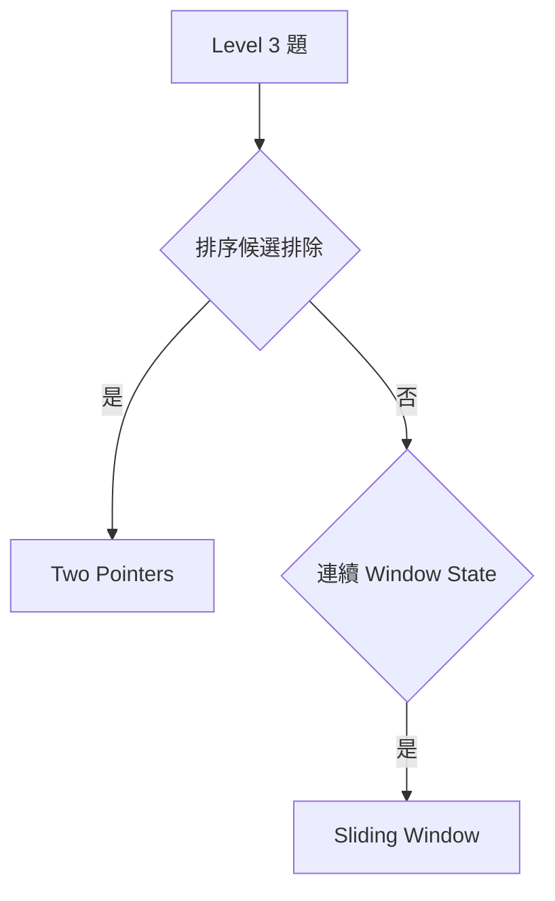
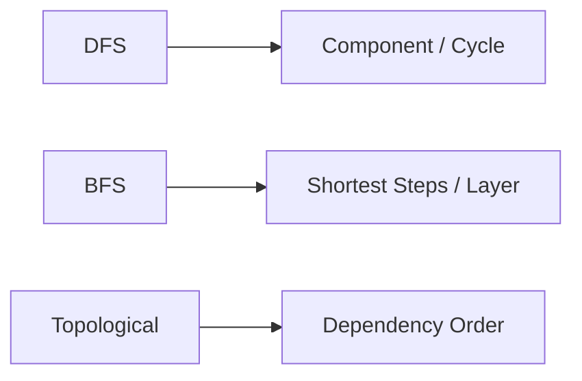
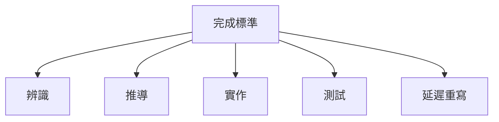
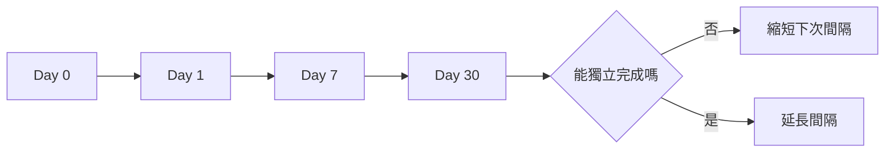

## 第 60 章　題目分級與練習路線

### 適用範圍

本章將演算法練習依技能相依關係分成十個 Level，並定義每級的完成標準、題目配置與複習週期。Level 是學習導航，不代表題目難度具有絕對分界。

### 60.1 整體路線


可依既有能力跳級，但若高階題反覆卡在 Pointer、State 或複雜度，應回到對應基礎 Level 補強。

### 60.2 Level 1：走訪與基本模擬

能力：

- 正確使用 Index 與區間。
- 寫 Loop Invariant。
- 處理空、一筆、邊界與 Overflow。
- 分析 O(n)、O(n²)。

題型：Array 走訪、String、Matrix 模擬、Counting。

完成標準：能在不看模板下寫出清楚版本，並自行設計邊界測試。

### 60.3 Level 2：Hash、Stack 與 Queue

能力：

- 定義 Key、Value 與 Stack/Queue Element 語意。
- 安全處理 Empty。
- 區分平均 O(1) 與排序容器。

題型：Frequency、Two Sum、括號匹配、Monotonic Stack 基礎、Queue 模擬。

### 60.4 Level 3：Two Pointers 與 Sliding Window

能力：

- 說明 Pointer 移動排除哪些候選。
- 定義 Window Boundary、State、Validity。
- 區分最長與最短更新時機。



### 60.5 Level 4：Binary Search 與 Prefix Sum

能力：

- 由區間定義推導 Binary Search 更新。
- 使用 Lower、Upper Bound。
- 定義 `prefix[i]` 與 Half-open Query。
- 了解 Prefix + Hash。

建議混合題：排序 Pair、答案搜尋、Range Sum、Subarray Sum。

### 60.6 Level 5：Tree Traversal

能力：

- 定義 Recursive Function 對 Subtree 的回傳值。
- 完成 Preorder、Inorder、Postorder、Level-order。
- 計算 Height、Balance、Diameter。
- 分析 O(n) 與 O(h) Stack。

### 60.7 Level 6：DFS、BFS 與 Topological Sort

能力：

- 建立 Graph 與 Visited State。
- 解 Component、Unweighted Distance、Grid BFS。
- 使用 Indegree 或三色 DFS 處理 Dependency。



### 60.8 Level 7：Heap、Greedy 與 Union Find

能力：

- 維持動態極值並處理 Stale Entry。
- 使用 Exchange 或 Stay-ahead 說明 Greedy。
- 使用 DSU 維護動態 Component。
- 完成 Kruskal、基礎 Prim。

### 60.9 Level 8：基礎 Dynamic Programming

能力：

- 寫出 State、Transition、Base Case、Order、Answer。
- 完成一維 DP、Grid DP、0/1 Knapsack。
- 區分不可達 State 與合法 0。
- 說明空間改善的更新方向。

### 60.10 Level 9：Shortest Path 與進階 DP

能力：

- 依 Weight 選 BFS、0-1 BFS、Dijkstra、Bellman-Ford。
- 處理 Negative Cycle 與 Path Reconstruction。
- 完成 LIS、LCS、Edit Distance、Interval 或 Tree DP 入門。

### 60.11 Level 10：Range Query 與進階資料結構

能力：

- 區分靜態、Point Update、Range Update。
- 使用 Fenwick Tree、Segment Tree 或 Sparse Table。
- 清楚定義 Node State、Merge 與 Lazy State。
- 分析 O(log n) Update、Query 的由來。

### 60.12 每個等級的完成標準

不要只以完成題數判斷。每級至少應能：

1. 不看筆記完成代表題。
2. 說明成立條件與反例。
3. 寫出時間、空間及成本來源。
4. 建立邊界測試。
5. 一週後重寫核心流程。
6. 在混合題中辨識方法。



### 60.13 題目配置

每個主題可使用：

```text
2 題基礎：熟悉 State 與模板
3 題變化：改變邊界與輸出
2 題混合：和其他工具組合
1 題反例：說明常見錯法
```

數量可調整。若基礎題仍依賴答案，應先重寫而不是快速增加新題。

### 60.14 複習週期

建議起點：

```text
Day 0：完成與整理
Day 1：核心重寫
Day 7：整題重做
Day 30：混合題型測試
```



應依回想結果調整，不必僵化遵守日期。

### 60.15 每週安排範本

```text
週一：新概念與基礎題
週二：基礎題空白重寫
週三：變化題
週四：錯題與反例
週五：混合題
週末：限時重做、整理與下週規劃
```

每次練習都保留一部分時間測試與寫紀錄。

### 60.16 升級與降級規則

可以升級：

- 代表題能獨立完成。
- 一週後仍能推導。
- 遇到變化題能調整 State。

應回補：

- 只能認出題型，不能說明條件。
- 常在相同邊界失敗。
- 依賴背誦程式。
- 複雜度與正確性說不清楚。

### 60.17 三條建議路線

#### 面試基礎路線

Level 1 → 4 → 5 → 6 → 7 → 8。

#### Graph 強化路線

Level 1、2 → 6 → 7 → 9。

#### DP 強化路線

Level 1、3、4 → 8 → 9 → 10。

前置能力不足時仍應補回，不建議只練單一高階分類。

### 60.18 常見問題與修正

| 問題 | 修正方式 |
|---|---|
| 題數增加但不會重寫 | 降低新題比例，加入延遲回想 |
| 一直停在簡單題 | 使用完成標準決定升級 |
| 高階題卡在基本 Bug | 回補對應 Level 的代表題 |
| 只做同一類題 | 每週加入混合題 |
| 複習只看筆記 | 改成空白重寫與自建測試 |
| 路線太滿而中斷 | 減少題量，保留固定節奏 |

### 60.19 本章檢查表

- 我知道目前所在 Level 與缺少的前置能力。
- 我用完成標準而不是題數判斷進度。
- 我安排基礎、變化、混合與反例題。
- 我有 Day 1、Day 7 與較長間隔的重寫。
- 我會依回想結果調整週期。
- 我能選擇面試、Graph 或 DP 強化路線。

### 60.20 本章重點

- 練習路線應依技能相依關係安排，而不是只依題目標示難度。
- 每個 Level 都應完成辨識、推導、實作、測試與延遲重寫。
- 題目配置要包含基礎、變化、混合與反例。
- 複習應以主動回想為主，並依結果調整間隔。
- 高階題反覆卡在基礎 Bug 時，回補對應 Level 通常比繼續堆題更有效。
- 穩定的小量節奏通常比短期高題量更容易長期維持。
