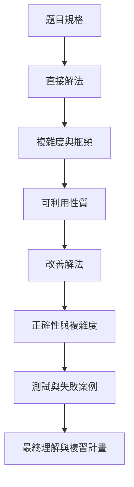
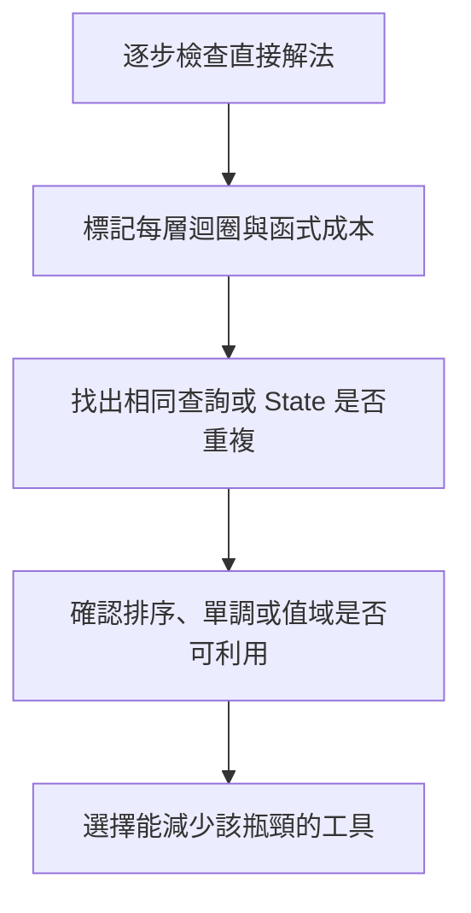

## 第 61 章　完整解題紀錄模板

### 適用範圍

本章提供一份可直接複製的解題紀錄模板，將題目理解、直接解法、改善過程、正確性、複雜度、測試與錯題整理放在同一份紀錄中。

解題紀錄的目的不是增加書寫負擔，而是保留真正影響解題的資訊。若只留下最後程式，過一段時間後常會忘記：

- 一開始如何理解題目。
- 哪個條件曾被忽略。
- 為什麼原本方法不可行。
- 改善版減少了哪一項重複工作。
- 哪個測試曾讓程式失敗。

本章會建立一套固定流程，讓每一題都能用相同格式整理。



### 適用讀者

- 想固定演算法學習流程的讀者。
- 看過解答後容易以為自己已經理解的讀者。
- 想保留失敗原因與反例的讀者。
- 需要建立可搜尋、可複習題庫筆記的讀者。

### 快速導覽

- [61.1 題目摘要](#611-題目摘要)
- [61.2 輸入與輸出](#612-輸入與輸出)
- [61.3 Constraint](#613-constraint)
- [61.4 邊界條件](#614-邊界條件)
- [61.5 直接解法](#615-直接解法)
- [61.6 直接解法複雜度](#616-直接解法複雜度)
- [61.7 可利用的資料性質](#617-可利用的資料性質)
- [61.8 改善解法](#618-改善解法)
- [61.9 正確性說明](#619-正確性說明)
- [61.10 時間與空間複雜度](#6110-時間與空間複雜度)
- [61.11 測試案例](#6111-測試案例)
- [61.12 失敗原因](#6112-失敗原因)
- [61.13 最終理解](#6113-最終理解)
- [61.14 類似題型與延伸](#6114-類似題型與延伸)
- [61.15 可直接複製的模板](#6115-可直接複製的模板)
- [61.16 完整案例：Contains Duplicate](#6116-完整案例contains-duplicate)
- [61.17 本章檢查表](#6117-本章檢查表)

### 61.1 題目摘要

移除故事背景，用一至三句話寫出資料模型與目標。

不要只複製題目。應能回答：

- 資料是 Array、String、Tree、Graph、Interval 還是 State？
- 要回傳存在性、數量、位置、全部答案或最佳答案？
- 是否要求連續、不同 Index 或固定順序？

### 61.2 輸入與輸出

<table>
<tr><th>欄位</th><th>要記錄的內容</th></tr>
<tr><td>輸入</td><td>型別、大小、值域、排序狀態、重複條件</td></tr>
<tr><td>輸出</td><td>型別、答案語意、無答案表示方式</td></tr>
<tr><td>修改限制</td><td>是否允許改變原始資料</td></tr>
<tr><td>順序要求</td><td>輸出是否需要固定順序</td></tr>
</table>

### 61.3 Constraint

Constraint 會決定方法是否可行。

至少記錄：

```text
n 的範圍
元素值域
記憶體限制
時間限制
是否包含負數
是否可能重複
```

若 n 為 100,000，O(n²) 可能不可接受。若值域只有 0 到 100，固定大小計數 Array 可能可行。

### 61.4 邊界條件

固定檢查：

- 空輸入。
- 單一元素。
- 無答案。
- 全部相同。
- 已排序與反向排序。
- 最小值與最大值。
- 重複值與極端 Index。

邊界條件應寫出預期答案，而不只列出名稱。

### 61.5 直接解法

先寫最容易確認完整性的解法。直接解法的用途包括：

- 確認候選空間。
- 建立正確答案來源。
- 分析重複工作。
- 作為改善版的對拍基準。

### 61.6 直接解法複雜度

不要只寫 Big-O，還要說明計算來源。

```text
共有多少候選？
每個候選要做多少工作？
是否能提前停止？
額外保存哪些資料？
```

### 61.7 可利用的資料性質

常見性質：

- 排序與單調性。
- 相同值或相近值會聚集。
- 連續區間。
- 重複子問題。
- 值域很小。
- Tree、DAG 或 Graph Connectivity。

工具應用來減少已確認的瓶頸，而不是只因題目出現某個關鍵字。

### 61.8 改善解法

寫明改善版相對直接解法改變了什麼：

```text
原本重複掃描哪些資料？
新增哪個 State 或資料結構？
如何減少工作？
新增了哪些前置條件或空間成本？
```

### 61.9 正確性說明

正確性可以使用：

- Invariant。
- 分類討論。
- 數學歸納。
- 交換論證。
- 反證法。
- 遞迴假設。

至少要能說明：

1. 演算法不會漏掉合法答案。
2. 演算法不會接受不合法答案。
3. 演算法會停止。

### 61.10 時間與空間複雜度

空間要包含：

- 額外 Array、Map、Set。
- Stack、Queue、Heap。
- 遞迴 Call Stack。
- 輸出結果是否計入，需明確說明。

### 61.11 測試案例

建議使用表格記錄：

<table>
<tr><th>輸入</th><th>預期輸出</th><th>測試目的</th><th>實際結果</th></tr>
<tr><td>最小輸入</td><td>依題目</td><td>Base Case</td><td>待填</td></tr>
<tr><td>一般案例</td><td>依題目</td><td>主流程</td><td>待填</td></tr>
<tr><td>反例</td><td>依題目</td><td>破壞錯誤直覺</td><td>待填</td></tr>
</table>

### 61.12 失敗原因

避免只寫「粗心」。應記錄可檢查的技術原因：

- 區間語意混用。
- 輸出需要 Index，但只保存數值。
- 剪枝條件不成立。
- Comparator 不符合嚴格弱序。
- Overflow。
- State 定義不足。
- Visited 標記時機錯誤。

### 61.13 最終理解

用自己的話回答：

- 這題真正考什麼？
- 關鍵轉折是什麼？
- 下次看到什麼條件會想到這個方法？
- 哪些條件改變後，方法會失效？
- 能否不看答案重新寫出核心流程？

### 61.14 類似題型與延伸

記錄「共同結構」，不要只列題名：

```text
同樣是查存在性，但輸出改成全部位置時要保存 Index。
同樣是區間題，但相接端點是否衝突會改變比較條件。
同樣是 DP，但加入另一個限制後 State 需要增加維度。
```

### 61.15 可直接複製的模板

```markdown
# 題目名稱

## 1. 題目摘要
- 資料模型：
- 目標：
- 一句話重述：

## 2. 輸入與輸出
- 輸入型別：
- 輸入大小：
- 數值範圍：
- 輸出型別：
- 無答案表示：
- 是否允許修改輸入：

## 3. Constraint
- n：
- 值域：
- 時間限制：
- 空間限制：

## 4. 邊界條件
- 空輸入：
- 單一元素：
- 無答案：
- 重複值：
- 極端值：

## 5. 候選空間與直接解法
- 候選是：
- 直接解法：
- 為什麼完整：

## 6. 直接解法複雜度
- 時間：
- 空間：
- 瓶頸：

## 7. 可利用性質
- 性質：
- 成立條件：
- 反例：

## 8. 改善解法
- 新增 State 或資料結構：
- 減少的重複工作：
- 核心流程：

## 9. 正確性
- Invariant 或分類：
- 不漏解原因：
- 不誤收原因：
- 終止原因：

## 10. 複雜度
- 時間：
- 額外空間：

## 11. 測試
- 一般案例：
- 邊界案例：
- 反例：
- 最差案例：

## 12. 失敗原因
- 現象：
- 第一個分歧 State：
- 原因：
- 修正：
- Regression Test：

## 13. 最終理解
- 關鍵轉折：
- 適用條件：
- 失效條件：
- 下次複習日期：

## 14. 類似題型與延伸
- 共同結構：
- 主要差異：
```

### 61.16 完整案例：Contains Duplicate

#### 題目摘要

給定整數 Array，判斷是否存在兩個不同 Index 具有相同數值。

#### 直接解法

枚舉所有 Index Pair，時間 O(n²)，空間 O(1)。

#### 可利用性質

掃描時只需知道目前值以前是否出現，因此使用 Hash Set 保存已看過的數值。

#### 改善解法

```cpp
#include <unordered_set>
#include <vector>

bool containsDuplicate(const std::vector<int>& nums)
{
    std::unordered_set<int> seen;

    for (int value : nums)
    {
        if (seen.contains(value))
        {
            return true;
        }

        seen.insert(value);
    }

    return false;
}
```

平均時間 O(n)，額外空間 O(n)。最差 Hash Table 行為需依實作與碰撞情況評估。

#### 測試

```text
[] -> false
[1] -> false
[1,2,1] -> true
[1,2,3] -> false
[0,0] -> true
```


### 61.17 如何決定這題要記錄到多詳細

不是每一題都需要寫成長篇報告。可以依題目狀況分成三種紀錄層級。

<table>
<tr><th>層級</th><th>適用情況</th><th>建議保留內容</th></tr>
<tr><td>快速紀錄</td><td>熟悉題型，一次完成</td><td>State、核心性質、複雜度、兩個邊界案例</td></tr>
<tr><td>標準紀錄</td><td>需要思考或曾出現 Bug</td><td>完整模板、直接解法、改善原因、失敗案例</td></tr>
<tr><td>深度紀錄</td><td>新觀念、重要錯題、反覆失敗</td><td>逐輪追蹤、錯誤版本、正確性、反例、重寫計畫</td></tr>
</table>

紀錄長度不是重點。重點是下次複習時，能快速找回當時真正卡住的位置。

### 61.18 如何寫「題目摘要」而不是重抄題目

題目摘要建議分三步：

1. 移除故事角色與場景。
2. 找出資料模型。
3. 寫出明確輸出。

例如原題描述登入紀錄：

```text
網站保存一天內的使用者 ID，判斷是否有人重複登入。
```

整理後：

```text
給定整數 Array，判斷是否存在重複值。
```

如果輸出改成「回傳第一次重複的 ID」，摘要也必須跟著改。相同輸入故事不代表相同問題。

#### 摘要自我檢查

- 是否說出資料是 Array、String、Tree、Graph 或其他 State？
- 是否說出要找存在性、數量、位置、全部答案或最佳答案？
- 是否保留會影響演算法的重要條件，例如連續、排序或不得重複使用？
- 是否移除不影響演算法的故事細節？

### 61.19 如何整理 Constraint

Constraint 不只抄下數字，還要寫出它對方法的影響。

<table>
<tr><th>Constraint</th><th>可能影響</th></tr>
<tr><td>`n <= 20`</td><td>可能容許 Subset Enumeration 或 Bitmask DP</td></tr>
<tr><td>`n <= 2,000`</td><td>O(n²) 可能需要評估常數與記憶體</td></tr>
<tr><td>`n <= 100,000`</td><td>常見目標為 O(n log n) 或 O(n)</td></tr>
<tr><td>值域很小</td><td>可能使用 Counting Array</td></tr>
<tr><td>可能有負數</td><td>部分 Sliding Window 或剪枝可能失效</td></tr>
<tr><td>輸入已排序</td><td>可能使用 Binary Search、Two Pointers 或提早停止</td></tr>
<tr><td>不能修改輸入</td><td>排序前需要副本，或改用其他方法</td></tr>
</table>

不要把上述 n 範圍當成固定標準。真正可接受的成本仍受時間限制、語言、常數與資料結構影響。

### 61.20 如何建立候選空間

候選空間是直接解法要檢查的所有可能答案。

常見候選：

<table>
<tr><th>題型</th><th>候選</th><th>常見數量</th></tr>
<tr><td>找最大值</td><td>每個元素</td><td>n</td></tr>
<tr><td>Two Sum</td><td>所有不同 Index Pair</td><td>O(n²)</td></tr>
<tr><td>連續區間</td><td>所有 left、right</td><td>O(n²)</td></tr>
<tr><td>Subset</td><td>每個元素選或不選</td><td>2^n</td></tr>
<tr><td>Permutation</td><td>所有排列</td><td>n!</td></tr>
<tr><td>Graph Path</td><td>符合 Edge 的路徑</td><td>可能非常多</td></tr>
</table>

先列候選空間，可以檢查直接解法是否完整，也能看出改善方法究竟刪掉或加速了哪一部分。

### 61.21 如何找出直接解法的瓶頸

不要只寫「太慢」。應指出哪個工作被重複執行。



常見對照：

- 一直檢查某值是否出現：Set 或 Map。
- 一直重新計算 Prefix：Prefix Sum。
- 一直求目前最小值：Heap。
- 一直重算相同 State：Memoization 或 DP。
- 一直檢查不可能分支：Pruning。
- 一直掃描已排序範圍：Binary Search 或 Two Pointers。

### 61.22 改善解法應寫出「交換了什麼成本」

改善通常不是免費的。

例如 Hash Set 查重：

```text
以 O(n) 額外空間，交換平均 O(n) 時間。
```

排序後 Two Pointers：

```text
以 O(n log n) 排序與可能改變順序，交換後續線性掃描。
```

Memoization：

```text
以保存 State 的空間，交換重複遞迴計算。
```

紀錄時建議寫：

- 減少了什麼工作？
- 增加了什麼空間或前置處理？
- 是否改變原輸入？
- 是否依賴平均成本？
- 方法在哪些條件下失效？

### 61.23 正確性說明的新手寫法

不一定每題都需要正式數學證明，但至少要能回答三件事。

#### 為什麼不漏解

說明所有合法答案都會在哪一步被考慮。

#### 為什麼不誤收

說明加入答案前檢查了哪些必要條件。

#### 為什麼會停止

說明哪個量每次都變小、變大或更接近終止狀態。

例如 Binary Search：

```text
Invariant：答案若存在，仍位於 [left, right) 中。
每輪會排除至少一個位置，使區間嚴格縮小。
left == right 時候選區間為空，流程停止。
```

### 61.24 如何寫複雜度來源

不建議只寫：

```text
時間 O(n log n)，空間 O(n)。
```

建議補充：

```text
排序 n 個元素需要 O(n log n)。
排序後只掃描一次，需 O(n)。
因此總時間為 O(n log n)。
額外副本與結果容器最多保存 n 個元素，因此額外空間為 O(n)。
```

DP 可用：

```text
時間 = State 數量 × 每個 State 的 Transition 數量
```

Graph 可用：

```text
Adjacency List 下，每個 Vertex 與每個 Edge Entry 被處理固定次數，因此 O(V + E)。
```

### 61.25 測試案例如何分類

一組完整測試至少可分成：

<table>
<tr><th>類型</th><th>目的</th></tr>
<tr><td>最小合法輸入</td><td>檢查 Base Case 與初始化</td></tr>
<tr><td>一般案例</td><td>檢查主流程</td></tr>
<tr><td>無答案案例</td><td>檢查不存在時的回傳方式</td></tr>
<tr><td>重複或相等案例</td><td>檢查 `>`、`>=` 與穩定性</td></tr>
<tr><td>極端順序</td><td>已排序、反向、全部相同</td></tr>
<tr><td>反例</td><td>破壞錯誤直覺或不成立的前置條件</td></tr>
<tr><td>最大規模</td><td>檢查複雜度、Overflow 與 Stack 深度</td></tr>
</table>

每筆測試要寫出測試目的。否則看到一串輸入時，很難知道它原本要保護哪個條件。

### 61.26 如何記錄失敗原因

失敗紀錄建議分成五欄：

```text
現象：看到了什麼錯誤？
最小案例：最小可重現輸入是什麼？
第一個分歧：預期 State 和實際 State 從哪一步不同？
原因：哪個規格、Invariant 或型別被破壞？
修正：改變了什麼，Regression Test 是什麼？
```

避免寫：

```text
太粗心
不熟
看錯題目
```

這些描述無法直接轉成下一次可執行的檢查步驟。

### 61.27 複習時如何使用紀錄

只重看筆記容易產生熟悉感，但不代表能獨立完成。

建議複習流程：

1. 遮住改善解法與程式。
2. 只看題目摘要與 Constraint。
3. 重新寫出直接解法。
4. 重新指出瓶頸。
5. 重新推導改善版。
6. 用原失敗案例測試。
7. 對照舊紀錄，更新仍不清楚的地方。

可在紀錄中加入：

```text
第一次完成日期：
第一次獨立重寫日期：
第二次複習日期：
目前仍不熟悉的部分：
```

### 61.28 快速版紀錄模板

適合已熟悉題型或時間有限時使用：

```markdown
# 題目名稱

- 問題模型：
- 輸入 / 輸出：
- 重要 Constraint：
- 候選空間：
- 直接解法與瓶頸：
- 核心性質：
- 改善解法：
- Invariant / 正確性：
- 時間 / 空間：
- 邊界案例：
- 失敗原因：
- 下次看到什麼條件會想到此方法：
```

### 61.29 深度版紀錄模板

適合新觀念、重要錯題與反覆失敗題：

```markdown
# 題目名稱

## A. 問題規格
- 一句話摘要：
- 資料模型：
- 輸入：
- 輸出：
- 無答案表示：
- 是否允許修改輸入：
- 輸出順序要求：

## B. Constraint 與影響
- n：
- 值域：
- 是否排序：
- 是否重複：
- 是否含負數：
- 可接受複雜度：

## C. 候選空間
- 候選是什麼：
- 候選數量：
- 如何確認完整：

## D. 直接解法
- 核心流程：
- 正確性：
- 時間：
- 空間：
- 明確瓶頸：

## E. 改善推導
- 可利用性質：
- 成立條件：
- 反例：
- 新增資料結構或 State：
- 減少的重複工作：
- 交換的時間 / 空間成本：

## F. 最終解法
- Interface：
- Invariant：
- 核心流程：
- 終止原因：
- 時間：
- 空間：

## G. 測試
- 最小輸入：
- 一般案例：
- 無答案：
- 重複值：
- 極端順序：
- 反例：
- 最大規模：

## H. 失敗紀錄
- 現象：
- 最小失敗案例：
- 第一個分歧 State：
- 原因：
- 修正：
- Regression Test：

## I. 複習
- 關鍵轉折：
- 適用條件：
- 失效條件：
- 類似題型：
- 第一次獨立重寫日期：
```

### 61.30 完整案例補充：Contains Duplicate 的推導紀錄

#### 問題規格

```text
輸入：未排序整數 Array。
輸出：是否存在任意兩個不同 Index 具有相同數值。
不需要回傳重複值、位置或出現次數。
```

#### 候選空間

所有不同 Index Pair：

```text
(i, j)，其中 0 <= i < j < n
```

共有 `n(n - 1) / 2` 組，因此直接解法為 O(n²)。

#### 直接解法

```cpp
bool containsDuplicateBruteForce(
    const std::vector<int>& nums)
{
    for (int i = 0; i < static_cast<int>(nums.size()); ++i)
    {
        for (int j = i + 1;
             j < static_cast<int>(nums.size());
             ++j)
        {
            if (nums[i] == nums[j])
            {
                return true;
            }
        }
    }

    return false;
}
```

#### 瓶頸

每看到一個數字，都要和許多其他位置重新比較。真正需要的資訊只有：

```text
目前數字以前是否出現過？
```

#### 改善版 State

```text
seen = 已經看過的數值集合
```

掃描 value 時：

- 若 value 已在 seen，找到重複，回傳 true。
- 否則將 value 加入 seen。

#### Invariant

每輪開始時，`seen` 恰好保存目前位置之前出現過的所有數值。

因此：

- 若 value 已在 seen，必定存在較早的不同 Index。
- 若 value 不在 seen，加入後 Invariant 仍成立。
- 掃描結束仍未找到，表示不存在重複值。

#### 複雜度

- 掃描 n 個元素。
- Hash Set 查詢與插入平均 O(1)。
- 平均時間 O(n)，額外空間 O(n)。
- 最差 Hash 行為依 Collision 與實作而定。

#### 測試

<table>
<tr><th>輸入</th><th>預期</th><th>目的</th></tr>
<tr><td>`[]`</td><td>false</td><td>空輸入</td></tr>
<tr><td>`[1]`</td><td>false</td><td>單一元素</td></tr>
<tr><td>`[1,2,1]`</td><td>true</td><td>一般重複</td></tr>
<tr><td>`[1,2,3]`</td><td>false</td><td>無答案</td></tr>
<tr><td>`[0,0]`</td><td>true</td><td>相鄰重複</td></tr>
<tr><td>`[-1,2,-1]`</td><td>true</td><td>負數 Key</td></tr>
</table>


### 61.31 本章檢查表

- 我保留了題目規格，而不只留下程式。
- 我先寫直接解法並指出瓶頸。
- 改善版有清楚的成立條件。
- 我能說明正確性與終止原因。
- 我記錄時間與空間複雜度的來源。
- 我保存失敗案例與 Regression Test。
- 我能區分「看懂答案」與「能從空白重寫」。
