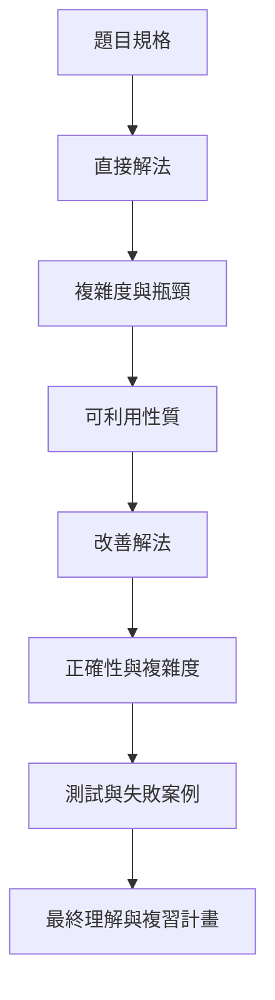

## 第 61 章　完整解題紀錄模板

### 適用範圍

本章提供一份可直接複製的解題紀錄模板，將題目理解、直接解法、改善過程、正確性、複雜度、測試與錯題整理放在同一份紀錄中。

解題紀錄的目的不是增加書寫負擔，而是保留真正影響解題的資訊。若只留下最後程式，過一段時間後常會忘記：

- 一開始如何理解題目。
- 哪個條件曾被忽略。
- 為什麼原本方法不可行。
- 改善版減少了哪一項重複工作。
- 哪個測試曾讓程式失敗。

本章會建立一套固定流程，讓每一題都能用相同格式整理。



### 適用讀者

- 想固定演算法學習流程的讀者。
- 看過解答後容易以為自己已經理解的讀者。
- 想保留失敗原因與反例的讀者。
- 需要建立可搜尋、可複習題庫筆記的讀者。

### 快速導覽

- [61.1 題目摘要](#611-題目摘要)
- [61.2 輸入與輸出](#612-輸入與輸出)
- [61.3 Constraint](#613-constraint)
- [61.4 邊界條件](#614-邊界條件)
- [61.5 直接解法](#615-直接解法)
- [61.6 直接解法複雜度](#616-直接解法複雜度)
- [61.7 可利用的資料性質](#617-可利用的資料性質)
- [61.8 改善解法](#618-改善解法)
- [61.9 正確性說明](#619-正確性說明)
- [61.10 時間與空間複雜度](#6110-時間與空間複雜度)
- [61.11 測試案例](#6111-測試案例)
- [61.12 失敗原因](#6112-失敗原因)
- [61.13 最終理解](#6113-最終理解)
- [61.14 類似題型與延伸](#6114-類似題型與延伸)
- [61.15 可直接複製的模板](#6115-可直接複製的模板)
- [61.16 完整案例：Contains Duplicate](#6116-完整案例contains-duplicate)
- [61.17 本章檢查表](#6117-本章檢查表)

### 61.1 題目摘要

移除故事背景，用一至三句話寫出資料模型與目標。

不要只複製題目。應能回答：

- 資料是 Array、String、Tree、Graph、Interval 還是 State？
- 要回傳存在性、數量、位置、全部答案或最佳答案？
- 是否要求連續、不同 Index 或固定順序？

### 61.2 輸入與輸出

<table>
<tr><th>欄位</th><th>要記錄的內容</th></tr>
<tr><td>輸入</td><td>型別、大小、值域、排序狀態、重複條件</td></tr>
<tr><td>輸出</td><td>型別、答案語意、無答案表示方式</td></tr>
<tr><td>修改限制</td><td>是否允許改變原始資料</td></tr>
<tr><td>順序要求</td><td>輸出是否需要固定順序</td></tr>
</table>

### 61.3 Constraint

Constraint 會決定方法是否可行。

至少記錄：

```text
n 的範圍
元素值域
記憶體限制
時間限制
是否包含負數
是否可能重複
```

若 n 為 100,000，O(n²) 可能不可接受。若值域只有 0 到 100，固定大小計數 Array 可能可行。

### 61.4 邊界條件

固定檢查：

- 空輸入。
- 單一元素。
- 無答案。
- 全部相同。
- 已排序與反向排序。
- 最小值與最大值。
- 重複值與極端 Index。

邊界條件應寫出預期答案，而不只列出名稱。

### 61.5 直接解法

先寫最容易確認完整性的解法。直接解法的用途包括：

- 確認候選空間。
- 建立正確答案來源。
- 分析重複工作。
- 作為改善版的對拍基準。

### 61.6 直接解法複雜度

不要只寫 Big-O，還要說明計算來源。

```text
共有多少候選？
每個候選要做多少工作？
是否能提前停止？
額外保存哪些資料？
```

### 61.7 可利用的資料性質

常見性質：

- 排序與單調性。
- 相同值或相近值會聚集。
- 連續區間。
- 重複子問題。
- 值域很小。
- Tree、DAG 或 Graph Connectivity。

工具應用來減少已確認的瓶頸，而不是只因題目出現某個關鍵字。

### 61.8 改善解法

寫明改善版相對直接解法改變了什麼：

```text
原本重複掃描哪些資料？
新增哪個 State 或資料結構？
如何減少工作？
新增了哪些前置條件或空間成本？
```

### 61.9 正確性說明

正確性可以使用：

- Invariant。
- 分類討論。
- 數學歸納。
- 交換論證。
- 反證法。
- 遞迴假設。

至少要能說明：

1. 演算法不會漏掉合法答案。
2. 演算法不會接受不合法答案。
3. 演算法會停止。

### 61.10 時間與空間複雜度

空間要包含：

- 額外 Array、Map、Set。
- Stack、Queue、Heap。
- 遞迴 Call Stack。
- 輸出結果是否計入，需明確說明。

### 61.11 測試案例

建議使用表格記錄：

<table>
<tr><th>輸入</th><th>預期輸出</th><th>測試目的</th><th>實際結果</th></tr>
<tr><td>最小輸入</td><td>依題目</td><td>Base Case</td><td>待填</td></tr>
<tr><td>一般案例</td><td>依題目</td><td>主流程</td><td>待填</td></tr>
<tr><td>反例</td><td>依題目</td><td>破壞錯誤直覺</td><td>待填</td></tr>
</table>

### 61.12 失敗原因

避免只寫「粗心」。應記錄可檢查的技術原因：

- 區間語意混用。
- 輸出需要 Index，但只保存數值。
- 剪枝條件不成立。
- Comparator 不符合嚴格弱序。
- Overflow。
- State 定義不足。
- Visited 標記時機錯誤。

### 61.13 最終理解

用自己的話回答：

- 這題真正考什麼？
- 關鍵轉折是什麼？
- 下次看到什麼條件會想到這個方法？
- 哪些條件改變後，方法會失效？
- 能否不看答案重新寫出核心流程？

### 61.14 類似題型與延伸

記錄「共同結構」，不要只列題名：

```text
同樣是查存在性，但輸出改成全部位置時要保存 Index。
同樣是區間題，但相接端點是否衝突會改變比較條件。
同樣是 DP，但加入另一個限制後 State 需要增加維度。
```

### 61.15 可直接複製的模板

```markdown
# 題目名稱

## 1. 題目摘要
- 資料模型：
- 目標：
- 一句話重述：

## 2. 輸入與輸出
- 輸入型別：
- 輸入大小：
- 數值範圍：
- 輸出型別：
- 無答案表示：
- 是否允許修改輸入：

## 3. Constraint
- n：
- 值域：
- 時間限制：
- 空間限制：

## 4. 邊界條件
- 空輸入：
- 單一元素：
- 無答案：
- 重複值：
- 極端值：

## 5. 候選空間與直接解法
- 候選是：
- 直接解法：
- 為什麼完整：

## 6. 直接解法複雜度
- 時間：
- 空間：
- 瓶頸：

## 7. 可利用性質
- 性質：
- 成立條件：
- 反例：

## 8. 改善解法
- 新增 State 或資料結構：
- 減少的重複工作：
- 核心流程：

## 9. 正確性
- Invariant 或分類：
- 不漏解原因：
- 不誤收原因：
- 終止原因：

## 10. 複雜度
- 時間：
- 額外空間：

## 11. 測試
- 一般案例：
- 邊界案例：
- 反例：
- 最差案例：

## 12. 失敗原因
- 現象：
- 第一個分歧 State：
- 原因：
- 修正：
- Regression Test：

## 13. 最終理解
- 關鍵轉折：
- 適用條件：
- 失效條件：
- 下次複習日期：

## 14. 類似題型與延伸
- 共同結構：
- 主要差異：
```

### 61.16 完整案例：Contains Duplicate

#### 題目摘要

給定整數 Array，判斷是否存在兩個不同 Index 具有相同數值。

#### 直接解法

枚舉所有 Index Pair，時間 O(n²)，空間 O(1)。

#### 可利用性質

掃描時只需知道目前值以前是否出現，因此使用 Hash Set 保存已看過的數值。

#### 改善解法

```cpp
#include <unordered_set>
#include <vector>

bool containsDuplicate(const std::vector<int>& nums)
{
    std::unordered_set<int> seen;

    for (int value : nums)
    {
        if (seen.contains(value))
        {
            return true;
        }

        seen.insert(value);
    }

    return false;
}
```

平均時間 O(n)，額外空間 O(n)。最差 Hash Table 行為需依實作與碰撞情況評估。

#### 測試

```text
[] -> false
[1] -> false
[1,2,1] -> true
[1,2,3] -> false
[0,0] -> true
```

### 61.17 本章檢查表

- 我保留了題目規格，而不只留下程式。
- 我先寫直接解法並指出瓶頸。
- 改善版有清楚的成立條件。
- 我能說明正確性與終止原因。
- 我記錄時間與空間複雜度的來源。
- 我保存失敗案例與 Regression Test。
- 我能區分「看懂答案」與「能從空白重寫」。
