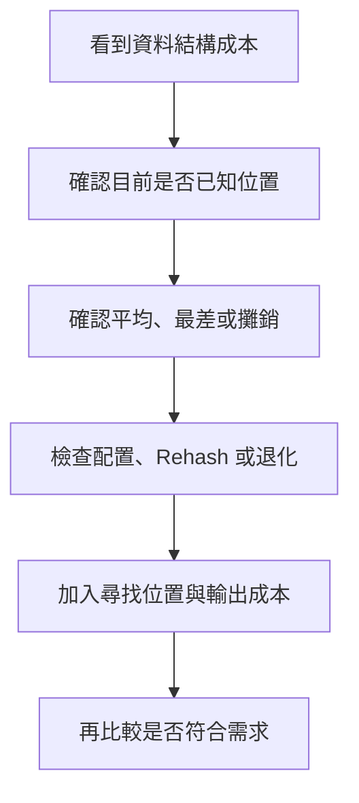
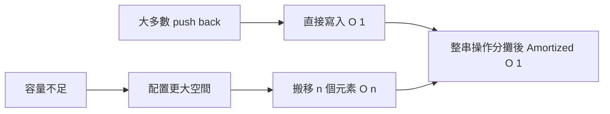
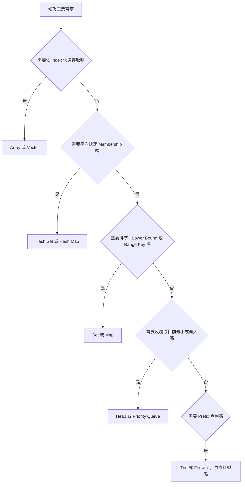

## 附錄 A　常見資料結構複雜度表

### 適用範圍

本附錄整理常見資料結構的時間與空間複雜度，並補充每個成本成立時的前提。

閱讀資料結構複雜度時，不能只看 O(1)、O(log n) 或 O(n)。還要確認：

- 是否已知元素位置或 Node。
- 成本是否包含尋找該位置。
- 是最差、平均、期望或攤銷成本。
- 容器是否可能重新配置、Rehash 或退化。
- 操作需要排序順序、Key Membership，還是 Priority。
- 空間是否包含 Node、Pointer、Bucket、Unused Capacity 與遞迴 Stack。

例如 Linked List 在「已知 Node」時插入可為 O(1)，但若要先找第 i 個 Node，尋找本身仍是 O(n)。`std::vector::push_back` 常見為 Amortized O(1)，但發生重新配置的單次操作可能為 O(n)。



### 適用讀者

- 會背資料結構 Big-O，但不清楚成本前提的讀者。
- 容易把 Linked List 插入一律寫成 O(1) 的讀者。
- 不清楚 `vector` Capacity、Reallocation 與 Iterator Invalidation 的讀者。
- 想比較 Hash Table、Balanced Tree、Heap 與 Trie 的讀者。
- 想依 Graph 密度選擇 Adjacency List 或 Matrix 的讀者。

### 快速導覽

- [A.1 如何閱讀資料結構複雜度](#a1-如何閱讀資料結構複雜度)
- [A.2 Array 與 Dynamic Array](#a2-array-與-dynamic-array)
- [A.3 Linked List](#a3-linked-list)
- [A.4 Stack、Queue 與 Deque](#a4-stackqueue-與-deque)
- [A.5 Hash Table](#a5-hash-table)
- [A.6 Binary Search Tree](#a6-binary-search-tree)
- [A.7 Balanced Search Tree](#a7-balanced-search-tree)
- [A.8 Heap 與 Priority Queue](#a8-heap-與-priority-queue)
- [A.9 Trie](#a9-trie)
- [A.10 Disjoint Set Union](#a10-disjoint-set-union)
- [A.11 Graph Representation](#a11-graph-representation)
- [A.12 Fenwick Tree](#a12-fenwick-tree)
- [A.13 Segment Tree](#a13-segment-tree)
- [A.14 常見 C++ 容器比較](#a14-常見-c-容器比較)
- [A.15 空間成本如何估算](#a15-空間成本如何估算)
- [A.16 從需求選擇資料結構](#a16-從需求選擇資料結構)
- [A.17 常見問題與判讀](#a17-常見問題與判讀)
- [A.18 使用檢查表](#a18-使用檢查表)
- [A.19 本附錄重點](#a19-本附錄重點)

### A.1 如何閱讀資料結構複雜度

#### 已知位置與未知位置是不同問題

假設要在 Linked List 的某個 Node 後插入新 Node：

```text
已持有該 Node Pointer：插入本身 O(1)
只知道它是第 i 個 Node：先走訪尋找 O(n)，再插入 O(1)
```

完整成本通常是 O(n)，不能只記錄最後改鏈結的 O(1)。

#### 操作成本與建立成本要分開

Hash Table Lookup 平均 O(1)，但資料結構本身需要先插入 n 筆資料，建立成本平均 O(n)。如果只查詢一次，建立 Hash Table 未必比直接掃描划算。

#### Amortized 不代表每次都相同

Dynamic Array 可能預留較大的 Capacity。大多數尾端加入只需寫入下一格，但 Capacity 不足時要配置新空間並搬移既有元素。



#### 本附錄的表格閱讀方式

後續較複雜的表格下方會附上「表格補充說明」，用來補足 Big-O 表格無法表達的前提、常數成本與常見誤解。閱讀時建議先看表格取得快速結論，再看補充說明確認：

- 成本是否已包含尋找位置。
- 常數成本是否可能影響實際速度。
- Iterator、Pointer 或 Reference 是否可能失效。
- 空間成本是否包含 Pointer、Bucket、Capacity、Weight 或其他欄位。

### A.2 Array 與 Dynamic Array

#### 固定 Array 與 Dynamic Array

- 固定 Array 的大小在建立時決定。
- `std::vector` 是 Dynamic Array，可調整 Size，並另外管理 Capacity。
- 兩者都提供連續儲存與 Random Access。

<table>
<tr><th>工作</th><th>成本</th><th>成立條件與注意事項</th></tr>
<tr><td>依 Index 讀寫</td><td>O(1)</td><td>Index 必須合法</td></tr>
<tr><td>取得 Size</td><td>O(1)</td><td>不掃描元素</td></tr>
<tr><td>線性搜尋</td><td>O(n)</td><td>未利用排序或額外索引</td></tr>
<tr><td>尾端加入</td><td>Amortized O(1)</td><td>重新配置那次可能 O(n)</td></tr>
<tr><td>尾端移除</td><td>O(1)</td><td>容器必須非空</td></tr>
<tr><td>中間插入</td><td>O(n)</td><td>搬移插入點後方元素</td></tr>
<tr><td>中間刪除</td><td>O(n)</td><td>搬移後方元素填補空位</td></tr>
<tr><td>排序</td><td>通常 O(n log n)</td><td>取決於排序方法</td></tr>
</table>

#### 表格補充說明

- 依 Index 讀寫是 O(1)，因為 Array 與 `std::vector` 使用連續儲存，可以用起始位址加上偏移量直接定位。這個成本不包含檢查 Index 是否合法。
- 線性搜尋是 O(n)，因為沒有額外索引時，最差需要逐一比較每個元素。若資料已排序，可以另外考慮 Binary Search，但插入與刪除仍可能需要搬移元素。
- 尾端加入是 Amortized O(1)，意思是多次 `push_back` 平均下來接近常數時間；但 Capacity 不足時，單次重新配置與搬移可能是 O(n)。
- 中間插入與刪除是 O(n)，主要成本不是找到位置，而是維持連續儲存所需的元素搬移。
- 排序通常寫 O(n log n)，但仍需看比較成本。例如排序字串時，單次比較不一定是 O(1)。


#### Size 與 Capacity

```cpp
std::vector<int> values;
values.reserve(100);
```

`reserve(100)` 改變 Capacity，不會把 Size 變成 100。此時仍不能直接存取 `values[50]`。

```cpp
values.resize(100);
```

`resize` 才會改變 Size，並建立對應元素。

#### Iterator、Pointer、Reference 失效

若 `push_back` 觸發 Reallocation，原本指向元素的 Iterator、Pointer 與 Reference 可能全部失效。`erase` 則通常使刪除位置及後方位置失效。

### A.3 Linked List

Linked List 以 Node 與 Link 串接，沒有連續儲存，也不支援 O(1) Random Access。

<table>
<tr><th>工作</th><th>Singly Linked List</th><th>Doubly Linked List</th><th>注意事項</th></tr>
<tr><td>讀取 Front</td><td>O(1)</td><td>O(1)</td><td>需非空</td></tr>
<tr><td>已知 Node 後插入</td><td>O(1)</td><td>O(1)</td><td>不含找 Node</td></tr>
<tr><td>已知 Node 前插入</td><td>通常需前一 Node</td><td>O(1)</td><td>Doubly 有 prev Link</td></tr>
<tr><td>刪除已知 Node</td><td>通常需前一 Node</td><td>O(1)</td><td>仍需處理 Head、Tail</td></tr>
<tr><td>依第 i 個位置存取</td><td>O(n)</td><td>O(n)</td><td>無 Random Access</td></tr>
<tr><td>依值搜尋</td><td>O(n)</td><td>O(n)</td><td>逐 Node 比較</td></tr>
</table>

#### 表格補充說明

- Linked List 的 O(1) 插入與刪除通常建立在「已經持有目標 Node 或相鄰 Node」的前提上。若要先找位置，尋找成本仍是 O(n)。
- Singly Linked List 沒有 `prev`，因此在某個 Node 前插入或刪除該 Node 時，通常需要先知道前一個 Node。
- Doubly Linked List 用額外 `prev` 指標換取較方便的雙向操作，但每個 Node 的空間成本也更高。
- Linked List 不支援 Random Access。即使要讀第 i 個元素，也只能從 Head 或 Tail 逐步走訪。


#### 為什麼 Linked List 插入不一定較快

若插入位置未知，先搜尋 O(n)。另外，Linked List Node 通常有額外 Pointer 與配置成本，記憶體區域也不一定連續，實際快取表現可能比 Dynamic Array 差。

#### `std::list` 的 Iterator 穩定性

插入通常不會讓其他 Node Iterator 失效。刪除時，被刪 Node 的 Iterator 失效。這和 `std::vector` 的失效規則不同。

### A.4 Stack、Queue 與 Deque

Stack 與 Queue 是抽象介面，底層可由不同容器提供。

<table>
<tr><th>工作</th><th>Stack</th><th>Queue</th><th>Deque</th></tr>
<tr><td>加入</td><td>push O(1)</td><td>push O(1)</td><td>兩端通常 O(1)</td></tr>
<tr><td>移除</td><td>pop O(1)</td><td>pop O(1)</td><td>兩端通常 O(1)</td></tr>
<tr><td>查看</td><td>top O(1)</td><td>front / back O(1)</td><td>front / back O(1)</td></tr>
<tr><td>依 Index 存取</td><td>不提供</td><td>不提供</td><td>O(1)（常數較 Vector 大，涉及 Chunk 定位）</td></tr>
<tr><td>任意搜尋</td><td>O(n)</td><td>O(n)</td><td>O(n)</td></tr>
</table>

#### 表格補充說明

- Stack 與 Queue 是抽象介面，重點是限制使用方式，而不是指定底層資料結構。
- Deque 支援兩端加入與移除，適合需要同時從頭尾處理資料的情境，例如單調佇列或 BFS 的雙端變形。
- C++ `std::deque` 的依 Index 存取是 O(1)，但通常不是整體連續記憶體。它需要先定位到分段 Chunk，再在 Chunk 內取元素，因此常數通常比 `std::vector` 大。
- 若主要需求是大量順序掃描與快取友善，`std::vector` 往往更直接；若需要頻繁頭端加入或移除，`std::deque` 才更有優勢。


`top()`、`front()`、`back()`、`pop()` 前要先確認容器非空。

#### Deque 不是 Linked List 的同義詞

Deque 支援兩端快速加入與移除，也常提供 Random Access。具體內部通常是分段配置，不保證像 Vector 一樣整體連續。

### A.5 Hash Table

C++ 常見容器為 `std::unordered_map` 與 `std::unordered_set`。

<table>
<tr><th>工作</th><th>平均或期望</th><th>最差</th></tr>
<tr><td>查詢</td><td>O(1)</td><td>O(n)</td></tr>
<tr><td>插入</td><td>O(1)</td><td>O(n)</td></tr>
<tr><td>刪除</td><td>O(1)</td><td>O(n)</td></tr>
<tr><td>走訪全部元素</td><td>O(n)</td><td>O(n)</td></tr>
</table>

#### 表格補充說明

- Hash Table 的 O(1) 是平均或期望成本，不是最差保證。若大量 Key 落在同一 Bucket，查詢、插入與刪除都可能退化。
- 查詢成本也包含 Hash 計算與 Equality 比較。若 Key 是長字串，單次 Hash 或比較本身就可能不是 O(1)。
- 走訪全部元素是 O(n)，但走訪順序通常不穩定，也不代表 Key 的排序順序。
- Rehash 會重新分配 Bucket 並移動或重新連結元素，除了成本變高，也可能影響 Iterator 的有效性。


#### 平均 O(1) 的前提

- Hash Function 能合理分散 Key。
- Equality 與 Hash 規則一致。
- Load Factor 受到控制。
- 沒有惡意或極端 Collision。

#### Rehash

Bucket 數調整時會 Rehash 大量元素，單次成本可達 O(n)。插入的平均成本仍可視為 O(1)，但不能假設每次都固定時間。

#### `operator[]` 可能插入

```cpp
int count = frequency[key];
```

若 key 不存在，`operator[]` 會插入預設值。唯讀查詢可使用 `find()` 或 `contains()`。

#### Hash Table 不提供一般排序順序

若需要依 Key 排序、Lower Bound 或範圍查詢，Balanced Search Tree 可能更合適。

### A.6 Binary Search Tree

BST Property 常見定義：左 Subtree 的 Key 較小，右 Subtree 的 Key 較大。重複 Key 的規則需由實作決定。

在 C++ 標準庫中，`std::set` 與 `std::map` 不允許重複 Key；`std::multiset` 與 `std::multimap` 則允許重複 Key。若自己實作 BST，重複 Key 可以選擇固定放左側、固定放右側，或在 Node 中保存 `count`。重點是規則必須一致，否則查詢、刪除與 Inorder Traversal 的語意會混亂.

<table>
<tr><th>工作</th><th>平均或 Tree 較平衡</th><th>最差退化</th></tr>
<tr><td>查詢</td><td>O(log n)</td><td>O(n)</td></tr>
<tr><td>插入</td><td>O(log n)</td><td>O(n)</td></tr>
<tr><td>刪除</td><td>O(log n)</td><td>O(n)</td></tr>
<tr><td>Min / Max</td><td>O(h)</td><td>O(n)</td></tr>
<tr><td>Inorder Traversal</td><td>O(n)</td><td>O(n)</td></tr>
</table>

#### 表格補充說明

- 普通 BST 的成本取決於高度 `h`，不是只取決於元素數量 `n`。Tree 接近平衡時 `h = O(log n)`；退化成鏈時 `h = O(n)`。
- Min / Max 需要一路往最左或最右走，因此成本是 O(h)。
- Inorder Traversal 會走訪每個 Node 一次，因此是 O(n)，並且在 BST Property 成立時會得到排序順序。


h 是 Tree 高度。依序插入已排序資料時，普通 BST 可能退化成長鏈，h = O(n)。

### A.7 Balanced Search Tree

Balanced Search Tree 透過旋轉或其他規則控制高度，使 h 維持 O(log n)。

<table>
<tr><th>工作</th><th>成本</th></tr>
<tr><td>查詢</td><td>O(log n)</td></tr>
<tr><td>插入</td><td>O(log n)</td></tr>
<tr><td>刪除</td><td>O(log n)</td></tr>
<tr><td>Lower Bound / Upper Bound</td><td>O(log n)</td></tr>
<tr><td>依 Key 順序走訪全部元素</td><td>O(n)</td></tr>
</table>

#### 表格補充說明

- Balanced Search Tree 花額外維護成本控制高度，換取查詢、插入與刪除的最差 O(log n) 保證。
- `Lower Bound` 與 `Upper Bound` 依賴 Key 的排序關係，Hash Table 通常無法直接提供。
- 依 Key 順序走訪全部元素是 O(n)，因為每個元素仍需輸出一次。


C++ `std::set` 與 `std::map` 提供排序關係與對數複雜度保證，但標準不要求特定平衡樹名稱。

#### Hash Table 與 Balanced Tree

<table>
<tr><th>需求</th><th>Hash Table</th><th>Balanced Tree</th></tr>
<tr><td>平均 Membership</td><td>O(1)</td><td>O(log n)</td></tr>
<tr><td>排序走訪</td><td>不提供</td><td>提供</td></tr>
<tr><td>Lower Bound</td><td>不直接支援</td><td>O(log n)</td></tr>
<tr><td>最差查找保證</td><td>一般 O(n)</td><td>O(log n)</td></tr>
</table>

### A.8 Heap 與 Priority Queue

Heap 維護 Parent 與 Children 的順序，不是完整排序。

<table>
<tr><th>工作</th><th>成本</th><th>說明</th></tr>
<tr><td>查看 Top</td><td>O(1)</td><td>Min Heap 最小值或 Max Heap 最大值</td></tr>
<tr><td>插入</td><td>O(log n)</td><td>Heapify Up</td></tr>
<tr><td>移除 Top</td><td>O(log n)</td><td>Heapify Down</td></tr>
<tr><td>Build Heap</td><td>O(n)</td><td>Bottom-up</td></tr>
<tr><td>查找任意值</td><td>O(n)</td><td>沒有完整排序</td></tr>
<tr><td>移除任意值</td><td>一般 O(n)</td><td>先尋找，再修復 Heap</td></tr>
</table>

#### 表格補充說明

- Heap 只保證 Parent 與 Child 的局部順序，因此 `top` 可以 O(1)，但任意值查找仍可能需要掃描全部元素。
- `push` 與 `pop` 的 O(log n) 來自沿著 Tree 高度向上或向下修復 Heap Property。
- Bottom-up Build Heap 是 O(n)，不是 O(n log n)。直覺上，很多節點靠近 Leaf，需要下沉的距離很短。
- 若題目需要同時快速查找任意值與取得最大或最小值，通常需要 Heap 搭配 Hash Table 或 Balanced Tree。


C++ `std::priority_queue` 預設為 Max Heap。`pop()` 不回傳被移除值，需要先讀 `top()`。

#### Top K

維護大小為 k 的 Heap，可將 n 筆資料處理成本控制為 O(n log k)，額外空間 O(k)。

### A.9 Trie

令 L 為單次字串長度，S 為所有插入字串的總字元數。

<table>
<tr><th>工作</th><th>時間</th><th>注意事項</th></tr>
<tr><td>插入字串</td><td>O(L)</td><td>逐字元建立或沿用節點</td></tr>
<tr><td>完整查詢</td><td>O(L)</td><td>最後節點需為完整單字</td></tr>
<tr><td>前綴查詢</td><td>O(L)</td><td>只需路徑存在</td></tr>
<tr><td>列出此前綴全部單字</td><td>O(L + output)</td><td>需從前綴節點 DFS</td></tr>
</table>

#### 表格補充說明

- Trie 的時間與字串長度 `L` 相關，而不是目前已存多少字串。這在大量共同 Prefix 的資料上很有用。
- 完整查詢需要確認最後節點是否標記為單字結尾；只檢查路徑存在只能得到 Prefix 是否存在。
- 列出某 Prefix 下所有字串時，成本一定包含輸出大小，因此寫成 O(L + output)。
- Trie 的主要風險是空間常數。固定 26 個 Child Pointer 的 Node 很快，卻可能浪費大量空指標空間。


最差節點數接近 O(S)。但實際空間還取決於：

- 每個 Node 的 Children 使用固定 Array 或 Map。
- 字元集合大小。
- Pointer、Allocator 與物件管理成本。
- 共同 Prefix 的比例。

Trie 的 O(L) 不代表一定比 Hash Table 更快，因為常數與空間配置差異可能很大。

### A.10 Disjoint Set Union

DSU 維護互不重疊集合。

<table>
<tr><th>工作</th><th>成本</th><th>前置條件</th></tr>
<tr><td>Find</td><td>攤銷 O(α(n))</td><td>Path Compression</td></tr>
<tr><td>Union</td><td>攤銷 O(α(n))</td><td>Union by Size 或 Rank</td></tr>
<tr><td>Connected</td><td>攤銷 O(α(n))</td><td>比較兩個 Root</td></tr>
<tr><td>建立</td><td>O(n)</td><td>每個元素先自成集合</td></tr>
<tr><td>空間</td><td>O(n)</td><td>Parent 與 Size / Rank</td></tr>
</table>

#### 表格補充說明

- DSU 的接近常數成本依賴 Path Compression 與 Union by Size / Rank 同時使用。缺少其中一項時，成本保證會變弱。
- `Find` 會回傳集合代表 Root；`Connected` 通常只是比較兩個元素的 Root 是否相同。
- DSU 適合處理「只合併、不拆分」的連通性問題。若需要刪除 Edge 後拆開集合，基礎 DSU 不適合直接使用。


`α(n)` 是 Inverse Ackermann Function，在實際規模下成長很慢。若沒有最佳化，Find 最差可退化成 O(n)。

基礎 DSU 擅長合併，不擅長將集合因刪除 Edge 而拆開。

### A.11 Graph Representation

令 V 為 Node 數，E 為 Edge 數。

<table>
<tr><th>表示方式</th><th>空間</th><th>列出 u 的 Neighbor</th><th>檢查 Edge u,v</th><th>適合情況</th></tr>
<tr><td>Adjacency List</td><td>O(V + E)</td><td>O(deg(u))</td><td>一般 O(deg(u))</td><td>Sparse Graph、常走訪 Neighbor</td></tr>
<tr><td>Adjacency Matrix</td><td>O(V²)</td><td>O(V)</td><td>O(1)</td><td>Dense Graph、頻繁任意 Edge Query</td></tr>
<tr><td>Edge List</td><td>O(E)</td><td>一般 O(E)</td><td>一般 O(E)</td><td>Kruskal、Bellman-Ford、逐 Edge 工作</td></tr>
</table>

#### 表格補充說明

- Adjacency List 適合 Sparse Graph，因為只保存實際存在的 Edge。列出鄰居很快，但檢查任意 `(u, v)` 是否存在通常需要掃描 `u` 的鄰接串列。
- Adjacency Matrix 適合 Dense Graph 或頻繁 Edge Query。它能 O(1) 檢查 Edge，但即使 Edge 很少也要保留 O(V²) 空間。
- Edge List 適合以 Edge 為主的演算法，例如 Kruskal 或 Bellman-Ford。它不適合頻繁查某個 Node 的所有鄰居，除非另外建立索引。


#### 無向 Graph 的儲存

Adjacency List 通常將每條無向 Edge 保存兩次：

```text
u 的 List 放 v
v 的 List 放 u
```

儲存項目約為 2E，但 Big-O 仍為 O(V + E)。

#### Weighted Graph

加權圖不會改變 Big-O 表示，但會改變每筆資料的大小與實作細節。

- Adjacency List：每個 Entry 通常需保存 `(to, weight)`，有時還會保存 Edge ID、Capacity 或 Reverse Edge Index。空間仍可寫 O(V + E)，但每條 Edge 的常數成本增加。
- Adjacency Matrix：每格不再只是 Boolean，而是保存 Weight、INF 或不存在標記。若使用 `int`、`long long` 或 `double`，空間可理解為 O(V²) 乘上該型別大小。
- Edge List：每條 Edge 通常保存 `(u, v, weight)`。若是無向圖，要確認是保存一條無向 Edge，還是展開成兩條有向 Entry。

因此，Weighted Graph 的複雜度表可保持相同 Big-O，但估算記憶體時不能只看 V 與 E，還要看每個 Entry 儲存哪些欄位。

### A.12 Fenwick Tree

Fenwick Tree 常用於 Point Update 與 Prefix Sum。

<table>
<tr><th>工作</th><th>成本</th><th>注意事項</th></tr>
<tr><td>Build，逐點加入</td><td>O(n log n)</td><td>容易理解</td></tr>
<tr><td>Build，線性方法</td><td>O(n)</td><td>將節點貢獻推到 Parent</td></tr>
<tr><td>Point Add</td><td>O(log n)</td><td>通常使用 1-based Index</td></tr>
<tr><td>Prefix Sum</td><td>O(log n)</td><td>依 Lowbit 跳動</td></tr>
<tr><td>Range Sum</td><td>O(log n)</td><td>兩個 Prefix Sum 相減</td></tr>
<tr><td>空間</td><td>O(n)</td><td>一個主要 Tree Array</td></tr>
</table>

#### 表格補充說明

- Fenwick Tree 的核心是把 Prefix 拆成若干段，因此 Point Add 與 Prefix Sum 都能在 O(log n) 內完成。
- Range Sum 透過 `prefix(right) - prefix(left - 1)` 取得，這要求運算可相減。
- 1-based Index 能讓 Lowbit 寫法更簡潔；若外部是 0-based，需要在介面層轉換清楚。


Fenwick Tree 適合可由 Prefix 組合的運算。一般 Range Minimum 不可直接用兩個 Prefix 結果相減。

### A.13 Segment Tree

Segment Tree 將區間分成節點，保存 Sum、Min、Max、GCD 或其他可結合資訊。

<table>
<tr><th>工作</th><th>成本</th><th>注意事項</th></tr>
<tr><td>Build</td><td>O(n)</td><td>由 Leaf 向上合併</td></tr>
<tr><td>Point Update</td><td>O(log n)</td><td>更新 Root 到 Leaf 路徑</td></tr>
<tr><td>Range Query</td><td>O(log n)</td><td>常見情況，依查詢形式</td></tr>
<tr><td>Range Update with Lazy</td><td>O(log n)</td><td>標記延後推送</td></tr>
<tr><td>空間</td><td>O(n)</td><td>實作常配置約 4n 或 2 倍基底</td></tr>
</table>

#### 表格補充說明

- Segment Tree 的 O(log n) 來自每次查詢或更新只接觸樹高等級的節點。
- Range Query 是否真的是 O(log n)，取決於查詢可否由少量節點合併完成，以及 Combine 是否為 O(1)。
- Lazy Propagation 適合大量 Range Update，透過延後下推標記避免每次更新整段元素。
- 空間 O(n) 的常見實作會配置 4n，這是為了簡化遞迴 Tree Index，而不是理論上真的需要四倍節點。


#### Combine 與 Identity

Segment Tree 需要定義：

- 如何合併兩個 Child 結果。
- 查詢沒有覆蓋時的 Identity Value。

例如 Sum 的 Identity 是 0，Min 常使用足夠大的 INF。Identity 必須不改變合法組合結果。

#### Fenwick Tree 與 Segment Tree

<table>
<tr><th>需求</th><th>Fenwick Tree</th><th>Segment Tree</th></tr>
<tr><td>實作長度</td><td>較短</td><td>較長</td></tr>
<tr><td>Prefix Sum</td><td>很適合</td><td>可支援</td></tr>
<tr><td>一般 Range Min / Max</td><td>不直接適合</td><td>適合</td></tr>
<tr><td>Range Update</td><td>可用特定差分技巧</td><td>Lazy Propagation 較一般</td></tr>
</table>

### A.14 常見 C++ 容器比較

<table>
<tr><th>容器</th><th>主要特性</th><th>常見查詢</th><th>常見修改</th></tr>
<tr><td>`std::vector`</td><td>連續、Random Access</td><td>Index O(1)</td><td>尾端 Amortized O(1)，中間 O(n)</td></tr>
<tr><td>`std::deque`</td><td>雙端快速修改</td><td>Index O(1)，常數較 vector 大</td><td>兩端 O(1)</td></tr>
<tr><td>`std::list`</td><td>Node-based Doubly List</td><td>搜尋 O(n)</td><td>已知位置插刪 O(1)</td></tr>
<tr><td>`std::set`</td><td>排序唯一 Key</td><td>O(log n)</td><td>O(log n)</td></tr>
<tr><td>`std::map`</td><td>排序 Key-Value</td><td>O(log n)</td><td>O(log n)</td></tr>
<tr><td>`std::unordered_set`</td><td>Hash 唯一 Key</td><td>平均 O(1)</td><td>平均 O(1)</td></tr>
<tr><td>`std::unordered_map`</td><td>Hash Key-Value</td><td>平均 O(1)</td><td>平均 O(1)</td></tr>
<tr><td>`std::priority_queue`</td><td>只維護最高 Priority</td><td>Top O(1)</td><td>Push / Pop O(log n)</td></tr>
</table>

這張表只提供高層比較。實際使用還要考慮 Iterator Invalidation、Ownership、Allocator、Comparator、Hash 與輸出順序。

### A.15 空間成本如何估算

Big-O 空間不只計算主要元素數量，也要留意每個元素的常數成本。

#### Linked List

每個 Node 除了 Value，還有一個或兩個 Pointer，再加上 Allocator 管理成本。

#### Hash Table

除了 Key / Value，還有 Bucket Array、Node、Hash Metadata 與未使用 Capacity。

#### Trie

每個字元節點若固定配置 26 個 Pointer，即使大部分為空，仍占用空間。

#### Graph

Adjacency List 的 O(V + E) 可能包含：

- V 個外層容器。
- 有向 Graph 約 E 個 Entry。
- 無向 Graph 約 2E 個 Entry。
- 每個 Entry 的 Weight、Edge ID 或其他欄位。

#### DP 與 Tree Structure

若資料結構還配合遞迴，額外空間要包含 Call Stack。若輸出本身很大，需註明是否將 Output Space 分開計算。

### A.16 從需求選擇資料結構



選擇時還要問：

- 是否需要保留插入順序？
- 是否需要原始 Index？
- 是否允許重複 Key？
- 更新、查詢與走訪比例是多少？
- 最差情況保證是否重要？

### A.17 常見問題與判讀

<table>
<tr><th>現象</th><th>可能原因</th><th>第一輪檢查</th></tr>
<tr><td>Linked List 插入仍很慢</td><td>每次都先線性尋找位置</td><td>將搜尋成本加入分析</td></tr>
<tr><td>Vector Pointer 偶爾失效</td><td>Push 觸發重新配置</td><td>檢查 Capacity 與失效規則</td></tr>
<tr><td>Deque 隨機存取比 Vector 慢</td><td>Deque 的 O(1) 常數較大，且記憶體不連續</td><td>若需要大量 Random Access 且不頻繁頭尾修改，優先考慮 Vector</td></tr>
<tr><td>Hash Table 查詢不穩定</td><td>Collision、Rehash 或不良 Hash</td><td>檢查 Load Factor 與 Key 規則</td></tr>
<tr><td>BST 變成 O(n)</td><td>Tree 退化</td><td>檢查高度或改 Balanced Tree</td></tr>
<tr><td>Heap 中找任意值很慢</td><td>Heap 不是完整排序</td><td>若需 Membership，搭配其他結構</td></tr>
<tr><td>Trie 記憶體過高</td><td>每 Node 配置大量空 Child</td><td>改用稀疏 Children 表示</td></tr>
<tr><td>Matrix Graph 記憶體不足</td><td>O(V²) 空間</td><td>Sparse Graph 改用 List</td></tr>
<tr><td>Fenwick 無法做 Min 相減</td><td>運算不具所需可逆性</td><td>考慮 Segment Tree</td></tr>
<tr><td>Segment Tree 查詢錯誤</td><td>Identity 或 Combine 定義錯誤</td><td>先驗證單一 Node 與空覆蓋</td></tr>
</table>

### A.18 使用檢查表

- 成本是平均、最差、期望還是攤銷？
- 是否已知 Node、Iterator 或 Index？
- 是否漏算尋找位置的成本？
- 是否需要排序順序、Lower Bound 或 Range Query？
- 是否需要快速取得 Min / Max，但不需完整排序？
- Dynamic Array 是否可能重新配置？
- 操作是否可能使 Iterator、Pointer 或 Reference 失效？失效範圍為何？
- Hash Table 是否可能 Rehash 或出現 Collision？
- Tree 是否保證平衡？
- Graph 是 Sparse 還是 Dense？
- Graph 表示方式和 V、E 是否一致？
- 額外空間是否包含 Pointer、Bucket、Capacity 與 Call Stack？
- 更新與查詢的比例是否符合所選資料結構？

### A.19 本附錄重點

- 資料結構成本必須搭配「是否已知位置」閱讀。
- Dynamic Array 尾端加入是 Amortized O(1)，重新配置單次可為 O(n)。
- Linked List 已知位置時可快速改鏈結，但搜尋與 Random Access 仍是 O(n)。
- Deque 支援 O(1) Random Access，但常數通常比 Vector 大；大量 Index 存取時仍應優先評估 Vector。
- Hash Table 平均查詢快，但不提供一般排序順序，最差仍可 O(n)。
- 普通 BST 依高度決定成本，Balanced Tree 才保證 O(log n)。
- Heap 只維護最高 Priority，不支援快速查找任意值。
- Trie 的時間與字串長度相關，但空間常數可能很高。
- DSU 最佳化後具有接近常數的攤銷 Find 與 Union。
- Graph Representation 會改變空間、Neighbor 走訪與 Edge Query 成本。
- Fenwick Tree 適合 Prefix Sum 類查詢，Segment Tree 支援較一般的區間資訊。
- Big-O 相同不代表記憶體常數、快取與實際速度相同。
- C++ 容器還需檢查 Iterator、Pointer 與 Reference 的失效規則。
- 加權圖通常不改變 Big-O，但會增加每個 Edge 或 Matrix Cell 的實際儲存成本。
