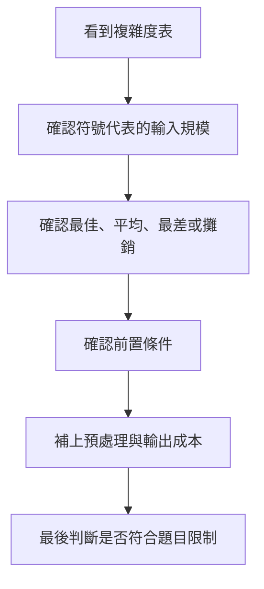
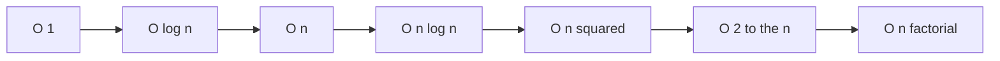
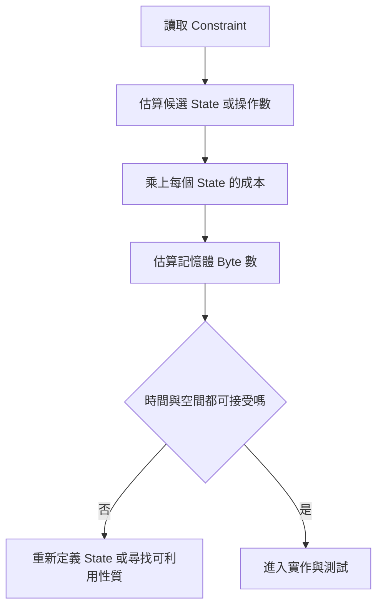

## 附錄 B　常見演算法複雜度表

### 適用範圍

本附錄整理常見演算法的時間與空間複雜度，並補充每項複雜度成立時所需的前置條件。

複雜度表不能只看 Big-O 符號。使用前還要確認：

- `n`、`V`、`E`、`K`、`m` 各代表什麼。
- 成本是最佳、平均、最差、期望或攤銷成本。
- 是否包含排序、建圖、預處理與輸出成本。
- 使用的是 Adjacency List、Adjacency Matrix，還是其他表示方式。
- 遞迴 Stack、Heap、DP Table 與輸出結果是否列入空間。
- 演算法的前置條件是否成立。

例如 Binary Search 的 O(log n) 依賴排序或單調性；普通 BFS 的最短路保證依賴所有 Edge 具有相同成本；Dijkstra 則要求 Weight 非負。



### 適用讀者

- 會背 Big-O，但不容易說明複雜度來源的讀者。
- 容易漏算排序、建圖、遞迴 Stack 或輸出成本的讀者。
- 不清楚 Average、Expected 與 Amortized 差異的讀者。
- 想快速比較搜尋、排序、Graph、DP 與 Range Query 方法的讀者。

### 快速導覽

- [B.1 如何閱讀複雜度](#b1-如何閱讀複雜度)
- [B.2 常見成長速度](#b2-常見成長速度)
- [B.3 搜尋](#b3-搜尋)
- [B.4 排序](#b4-排序)
- [B.5 Tree Traversal](#b5-tree-traversal)
- [B.6 Graph Traversal](#b6-graph-traversal)
- [B.7 Shortest Path](#b7-shortest-path)
- [B.8 Minimum Spanning Tree](#b8-minimum-spanning-tree)
- [B.9 String Matching](#b9-string-matching)
- [B.10 Dynamic Programming](#b10-dynamic-programming)
- [B.11 Backtracking 與列舉](#b11-backtracking-與列舉)
- [B.12 Range Query](#b12-range-query)
- [B.13 常見資料結構相關演算法](#b13-常見資料結構相關演算法)
- [B.14 輸出大小與 Output-sensitive](#b14-輸出大小與-output-sensitive)
- [B.15 從 Constraint 反推可接受複雜度](#b15-從-constraint-反推可接受複雜度)
- [B.16 常見問題與判讀](#b16-常見問題與判讀)
- [B.17 使用檢查表](#b17-使用檢查表)
- [B.18 本附錄重點](#b18-本附錄重點)

### B.1 如何閱讀複雜度

#### Big-O 描述成長上界

若演算法為 O(n²)，表示當 n 成長時，工作量上界可由某個常數倍的 n² 控制。Big-O 省略常數與較低次項：

```text
3n² + 5n + 7 = O(n²)
```

這不代表任何 O(n²) 程式速度都完全相同。常數、記憶體存取、快取、資料分布與語言實作仍會影響實際時間。

#### 最佳、平均、最差

<table>
<tr><th>術語</th><th>意思</th></tr>
<tr><td>Best-case</td><td>所有合法輸入中成本最低的情況</td></tr>
<tr><td>Average-case</td><td>在指定輸入分布下的平均或期望成本</td></tr>
<tr><td>Worst-case</td><td>所有合法輸入中成本最高的情況</td></tr>
<tr><td>Expected</td><td>依賴演算法隨機性或機率模型的期望成本</td></tr>
<tr><td>Amortized</td><td>將一連串操作總成本分攤到每次操作</td></tr>
</table>

`vector::push_back` 常見為 Amortized O(1)，不是說每次都 O(1)。觸發重新配置時，單次可能需要 O(n)。

#### 時間與空間要分開

演算法可能用更多空間換取更少時間。例如：

- Brute Force 查重：O(n²) 時間、O(1) 額外空間。
- Hash Set 查重：平均 O(n) 時間、O(n) 額外空間。

沒有單一方法在所有限制下都最好。

### B.2 常見成長速度

<table>
<tr><th>複雜度</th><th>常見情況</th><th>n 增大時的特性</th></tr>
<tr><td>O(1)</td><td>Array Index、Heap Top</td><td>與輸入規模無關的固定步驟</td></tr>
<tr><td>O(log n)</td><td>Binary Search、Heap Update</td><td>每次排除固定比例或沿 Tree 高度移動</td></tr>
<tr><td>O(n)</td><td>完整掃描</td><td>資料加倍，工作量約加倍</td></tr>
<tr><td>O(n log n)</td><td>Comparison Sort</td><td>大資料常見可接受等級</td></tr>
<tr><td>O(n²)</td><td>所有 Pair、雙層掃描</td><td>n 加倍，工作量約四倍</td></tr>
<tr><td>O(n³)</td><td>三層 DP、Floyd-Warshall</td><td>通常只適合較小 n</td></tr>
<tr><td>O(2^n)</td><td>Subset Enumeration</td><td>n 每增加 1，State 約加倍</td></tr>
<tr><td>O(n!)</td><td>Permutation Enumeration</td><td>只適合非常小的 n</td></tr>
</table>



這張排序只描述漸近成長，不代表在任何小輸入上都依此排列實際執行時間。

### B.3 搜尋

<table>
<tr><th>演算法</th><th>時間</th><th>額外空間</th><th>前置條件</th></tr>
<tr><td>Linear Search</td><td>O(n)</td><td>O(1)</td><td>無</td></tr>
<tr><td>Binary Search，Iterative</td><td>O(log n)</td><td>O(1)</td><td>已排序或 Predicate 單調</td></tr>
<tr><td>Binary Search，Recursive</td><td>O(log n)</td><td>O(log n)</td><td>遞迴 Stack</td></tr>
<tr><td>Hash Lookup</td><td>平均 O(1)，最差 O(n)</td><td>資料結構 O(n)</td><td>Hash 與 Equality 規則正確</td></tr>
<tr><td>Balanced BST Lookup</td><td>O(log n)</td><td>資料結構 O(n)</td><td>Tree 維持平衡</td></tr>
</table>

#### Binary Search 為什麼是 O(log n)

若每一輪將候選數量減半：

```text
n -> n/2 -> n/4 -> ... -> 1
```

需要約 `log₂ n` 輪。

但若更新後區間沒有嚴格縮小，程式可能無法停止，即使外觀看起來是 Binary Search。

#### Binary Search on Answer

若答案範圍大小是 R，每次檢查一個候選需要 O(f(n))：

```text
總時間 = O(f(n) log R)
```

不能只寫 O(log n)，因為搜尋的是答案範圍，而每次還要執行可行性檢查。

### B.4 排序

<table>
<tr><th>演算法</th><th>最佳</th><th>平均</th><th>最差</th><th>額外空間</th><th>穩定性</th></tr>
<tr><td>Bubble Sort，含提前停止</td><td>O(n)</td><td>O(n²)</td><td>O(n²)</td><td>O(1)</td><td>可穩定</td></tr>
<tr><td>Selection Sort</td><td>O(n²)</td><td>O(n²)</td><td>O(n²)</td><td>O(1)</td><td>一般交換版不穩定</td></tr>
<tr><td>Insertion Sort</td><td>O(n)</td><td>O(n²)</td><td>O(n²)</td><td>O(1)</td><td>可穩定</td></tr>
<tr><td>Merge Sort</td><td>O(n log n)</td><td>O(n log n)</td><td>O(n log n)</td><td>O(n)</td><td>可穩定</td></tr>
<tr><td>Heap Sort</td><td>O(n log n)</td><td>O(n log n)</td><td>O(n log n)</td><td>O(1)</td><td>不穩定</td></tr>
<tr><td>Quick Sort，典型</td><td>O(n log n)</td><td>O(n log n)</td><td>O(n²)</td><td>依遞迴深度</td><td>一般不穩定</td></tr>
<tr><td>Counting Sort</td><td>O(n + K)</td><td>O(n + K)</td><td>O(n + K)</td><td>O(n + K) 或 O(K)</td><td>可穩定</td></tr>
<tr><td>Radix Sort</td><td colspan="3">O(d × (n + b))</td><td>O(n + b)</td><td>依每輪排序</td></tr>
</table>

其中：

- K 是 Key Range 大小。
- d 是位數或處理輪數。
- b 是每輪的基底或 Bucket 數。

#### Comparison Sort 下界

只靠比較的完整排序，在一般模型下需要 Ω(n log n) 次比較。Counting Sort、Radix Sort 能避開此限制，是因為它們使用了 Key Range 或位數等額外性質。

#### `std::sort` 與 `std::stable_sort`

C++ 標準函式的複雜度與保證應以所使用標準版本與函式規格為準。選擇時還要確認：

- 是否需要 Stable。
- Comparator 是否符合嚴格弱序。
- 是否允許修改輸入。

### B.5 Tree Traversal

令 n 為 Node 數、h 為 Tree 高度、w 為最大寬度。

<table>
<tr><th>工作</th><th>時間</th><th>額外空間</th></tr>
<tr><td>Recursive DFS</td><td>O(n)</td><td>O(h)</td></tr>
<tr><td>Iterative DFS</td><td>O(n)</td><td>O(h) 到 O(n)，依形狀</td></tr>
<tr><td>BFS</td><td>O(n)</td><td>O(w)</td></tr>
<tr><td>計算 Subtree Size</td><td>O(n)</td><td>O(h) + 結果 O(n)</td></tr>
</table>

#### Tree 形狀會影響空間

- 平衡 Binary Tree：h 約為 O(log n)。
- 完全偏斜 Tree：h 可達 O(n)。

因此 Recursive DFS 的最差空間仍可能是 O(n)。

### B.6 Graph Traversal

令 V 為 Vertex 數，E 為 Edge 數。

<table>
<tr><th>表示方式</th><th>DFS / BFS 時間</th><th>額外演算法空間</th><th>Graph 儲存空間</th></tr>
<tr><td>Adjacency List</td><td>O(V + E)</td><td>O(V)</td><td>O(V + E)</td></tr>
<tr><td>Adjacency Matrix</td><td>O(V²)</td><td>O(V)</td><td>O(V²)</td></tr>
</table>

Adjacency List 下，每個 Vertex 被發現有限次，每個 Adjacency Entry 被檢查一次。無向 Graph 通常保存 2E 個 Entry，但 Big-O 仍是 O(V + E)。

#### Disconnected Graph

若要走訪全部 Graph，外層必須檢查每個尚未 Visited 的 Node。即使有多個 Component，總時間仍是 O(V + E)，因為每個 Node 與 Edge 仍只被處理固定次數。

### B.7 Shortest Path

<table>
<tr><th>演算法</th><th>常見時間</th><th>空間</th><th>主要條件</th></tr>
<tr><td>BFS</td><td>O(V + E)</td><td>O(V)</td><td>Unweighted 或相同 Edge Cost</td></tr>
<tr><td>0-1 BFS</td><td>O(V + E)</td><td>O(V)</td><td>Weight 只有 0 或 1</td></tr>
<tr><td>Dijkstra，Binary Heap</td><td>O((V + E) log V)</td><td>O(V + E)</td><td>Weight 非負</td></tr>
<tr><td>Bellman-Ford</td><td>O(VE)</td><td>O(V)</td><td>可處理負 Edge 並偵測可達負環</td></tr>
<tr><td>Floyd-Warshall</td><td>O(V³)</td><td>O(V²)</td><td>All-Pairs</td></tr>
<tr><td>DAG Shortest Path</td><td>O(V + E)</td><td>O(V)</td><td>Directed Acyclic Graph</td></tr>
</table>

#### Dijkstra 為什麼有 log V

每次從 Heap 取出候選或加入更新資料，需要 O(log V) 或和 Heap 大小相關的對數成本。若使用 Lazy Deletion，同一 Node 可能有多個 Heap Entry，因此常見寫法也會表達為 O((V + E) log V) 或 O(E log V)。

#### BFS 不等於所有最短路

BFS 保證最少 Edge 數。若 Edge Weight 不同，最少 Edge 數不一定是最低 Weight Sum。

### B.8 Minimum Spanning Tree

適用於 Weighted Undirected Graph。

<table>
<tr><th>演算法</th><th>常見時間</th><th>主要成本</th></tr>
<tr><td>Kruskal</td><td>O(E log E)</td><td>排序全部 Edge，DSU 接近線性</td></tr>
<tr><td>Prim，Binary Heap</td><td>O((V + E) log V)</td><td>Heap 維護跨 Cut 候選</td></tr>
<tr><td>Prim，Adjacency Matrix</td><td>O(V²)</td><td>每輪線性找下一 Vertex</td></tr>
</table>

當 E 接近 V² 時，`log E` 與 `log V` 只差常數倍，因此 Kruskal 常寫 O(E log E)，也可在特定推導下比較為 O(E log V)。

### B.9 String Matching

令 n 為 Text 長度，m 為 Pattern 長度。

<table>
<tr><th>方法</th><th>時間</th><th>額外空間</th><th>注意事項</th></tr>
<tr><td>Naive Matching</td><td>O(nm)</td><td>O(1)</td><td>每個起點重新比較</td></tr>
<tr><td>KMP</td><td>O(n + m)</td><td>O(m)</td><td>建立 Prefix Function</td></tr>
<tr><td>Z Algorithm</td><td>O(n + m)</td><td>O(n + m)</td><td>常將 Pattern 與 Text 串接</td></tr>
<tr><td>Rabin-Karp</td><td>平均接近 O(n + m)，最差可 O(nm)</td><td>O(1) 或依 Hash 設計</td><td>Hash Collision 需驗證</td></tr>
<tr><td>Trie 查詢</td><td>O(m)</td><td>結構依總字元數</td><td>適合多字串與前綴</td></tr>
</table>

輸出所有匹配位置時，還要加入輸出數量 k，成本可能寫成 O(n + m + k)。

### B.10 Dynamic Programming

DP 沒有固定複雜度。一般估算：

```text
時間 = 可達 State 數量 × 每個 State 的 Transition 數量
空間 = 保存的 State + Memo / Table + 遞迴 Stack
```

<table>
<tr><th>類型</th><th>常見 State 數</th><th>常見時間</th><th>常見空間</th></tr>
<tr><td>一維 DP</td><td>O(n)</td><td>O(n) 或 O(nk)</td><td>O(n)，可壓縮時 O(1)</td></tr>
<tr><td>二維 Grid DP</td><td>O(rows × cols)</td><td>依每格 Transition 數</td><td>O(rows × cols)</td></tr>
<tr><td>Knapsack</td><td>O(nW)</td><td>O(nW)</td><td>O(nW) 或 O(W)</td></tr>
<tr><td>Interval DP</td><td>O(n²)</td><td>常見 O(n³)</td><td>O(n²)</td></tr>
<tr><td>Tree DP</td><td>每 Node 固定 State 時 O(V)</td><td>依 Child 合併成本</td><td>O(V) + Stack</td></tr>
<tr><td>DAG DP</td><td>O(V) State</td><td>常見 O(V + E)</td><td>O(V)</td></tr>
<tr><td>Bitmask DP</td><td>O(2^n × n)</td><td>常見 O(2^n × n²)</td><td>O(2^n × n)</td></tr>
</table>

#### Top-down 不一定計算全部 State

Memoization 只計算從起始問題實際可達的 State。Bottom-up 常填完整表。兩者最差複雜度可能相同，但實際計算 State 數可能不同。

#### 空間壓縮

如果目前 State 只依賴前一列或前幾格，可壓縮空間。但若需要 Reconstruction，可能仍要保存 Parent、Decision 或完整 Table。

### B.11 Backtracking 與列舉

<table>
<tr><th>問題</th><th>答案數量或常見上界</th></tr>
<tr><td>n 個元素的 Subset</td><td>2^n</td></tr>
<tr><td>n 個元素的 Permutation</td><td>n!</td></tr>
<tr><td>從 n 個選 k 個</td><td>C(n, k)</td></tr>
<tr><td>長度 n 的二元決策</td><td>2^n</td></tr>
</table>

若每個答案還要複製長度 O(n) 的 Path，總成本可能多一個 n：

```text
列出所有 Subset：O(n × 2^n)
列出所有 Permutation：O(n × n!)
```

Pruning 可以降低實際搜尋節點數，但除非能證明更緊上界，最差情況通常仍保留指數級。

### B.12 Range Query

<table>
<tr><th>方法</th><th>Build</th><th>Query</th><th>Update</th><th>主要用途</th></tr>
<tr><td>直接 Array</td><td>O(1)</td><td>O(n)</td><td>Point O(1)</td><td>查詢少</td></tr>
<tr><td>Prefix Sum</td><td>O(n)</td><td>O(1)</td><td>一般 O(n)</td><td>靜態 Range Sum</td></tr>
<tr><td>Difference Array</td><td>O(n)</td><td>重建後讀取</td><td>Range Update O(1)</td><td>離線多次區間增量</td></tr>
<tr><td>Fenwick Tree</td><td>O(n) 或 O(n log n)</td><td>O(log n)</td><td>O(log n)</td><td>動態 Prefix / Range Sum</td></tr>
<tr><td>Segment Tree</td><td>O(n)</td><td>O(log n)</td><td>O(log n)</td><td>一般可合併 Range Query</td></tr>
<tr><td>Segment Tree with Lazy</td><td>O(n)</td><td>O(log n)</td><td>Range Update O(log n)</td><td>區間更新</td></tr>
<tr><td>Sparse Table</td><td>O(n log n)</td><td>靜態 Idempotent Query 常見 O(1)</td><td>不適合更新</td><td>Static RMQ</td></tr>
</table>

Sparse Table 的 O(1) Query 常見於 Min、Max、GCD 等 Idempotent Operation。若是一般 Range Sum，需使用不同組合方式，不能只看到 Sparse Table 就假設 O(1)。

### B.13 常見資料結構相關演算法

<table>
<tr><th>結構或演算法</th><th>常見時間</th><th>注意事項</th></tr>
<tr><td>Heap Push / Pop</td><td>O(log n)</td><td>Top 為 O(1)</td></tr>
<tr><td>Build Heap</td><td>O(n)</td><td>不是 n 次 O(log n) 的唯一建立法</td></tr>
<tr><td>DSU Find / Union</td><td>攤銷 O(α(n))</td><td>需 Path Compression 與 Union by Size/Rank</td></tr>
<tr><td>Trie Insert / Search</td><td>O(L)</td><td>L 為字串長度</td></tr>
<tr><td>Top K with Heap</td><td>O(n log k)</td><td>Heap 大小維持 k</td></tr>
<tr><td>K-way Merge</td><td>O(N log k)</td><td>N 為總元素數，k 為序列數</td></tr>
</table>

### B.14 輸出大小與 Output-sensitive

演算法不能比寫出輸出本身更快。

例如列出所有 Subset，即使搜尋每個答案的成本很低，答案數仍有 2^n 個。若每個答案平均長度 O(n)，輸出成本可達 O(n × 2^n)。

常見寫法：

```text
O(n + k)
```

其中 k 是輸出數量或匹配數量。

常見 Output-sensitive 問題：

- 列出所有匹配位置。
- 列出所有 Graph Path。
- 列出全部 Subset 或 Permutation。
- Range Reporting。

### B.15 從 Constraint 反推可接受複雜度

以下只是粗略思考起點，不是所有平台的固定限制。實際可接受時間會受常數、語言、硬體、資料分布與時間限制影響。

<table>
<tr><th>n 的等級</th><th>常見可開始考慮的複雜度</th></tr>
<tr><td>n <= 10</td><td>n!、較複雜列舉</td></tr>
<tr><td>n <= 20</td><td>2^n、Bitmask DP</td></tr>
<tr><td>n <= 200</td><td>O(n³) 需看常數</td></tr>
<tr><td>n <= 2,000</td><td>O(n²) 需看常數與記憶體</td></tr>
<tr><td>n <= 100,000</td><td>O(n log n)、O(n)</td></tr>
<tr><td>n >= 1,000,000</td><td>通常偏向 O(n) 或更低常數</td></tr>
</table>

除了時間，也要估算記憶體。例如 `dp[n][n]` 對 n = 100,000 完全不可行，即使 Transition 看起來簡單。



### B.16 常見問題與判讀

<table>
<tr><th>現象</th><th>可能原因</th><th>第一輪檢查</th></tr>
<tr><td>寫成 O(n) 但實際較慢</td><td>迴圈內包含非 O(1) 容器工作</td><td>逐項標記每個 API 的成本</td></tr>
<tr><td>漏算排序</td><td>只看排序後掃描</td><td>加上 O(n log n) 預處理</td></tr>
<tr><td>DFS 誤寫 O(V + E)</td><td>實際使用 Matrix 掃描每一列</td><td>Matrix 版本通常 O(V²)</td></tr>
<tr><td>DP 複雜度低估</td><td>只算 State，漏算 Transition</td><td>使用 State 數 × 每 State 工作</td></tr>
<tr><td>空間寫 O(1)</td><td>忽略遞迴 Stack</td><td>加入最大深度</td></tr>
<tr><td>Backtracking 寫 O(2^n)</td><td>每個答案還複製 O(n) Path</td><td>加入輸出複製成本</td></tr>
<tr><td>Hash Table 一律寫 O(1)</td><td>忽略平均與最差差異</td><td>標明 Average 或 Expected</td></tr>
<tr><td>Binary Search 寫 O(log n)</td><td>漏算每次 Predicate 成本</td><td>改寫為 O(f(n) log R)</td></tr>
</table>

### B.17 使用檢查表

- 複雜度中的每個符號代表什麼？
- 是 Best、Average、Worst、Expected 還是 Amortized？
- 是否包含排序、建圖、預處理與初始化？
- 每個容器 API 的成本是多少？
- Graph 使用 List 還是 Matrix？
- DP 是否同時計算 State 數與 Transition 數？
- 是否漏算遞迴 Stack、Heap、Queue、Visited 與 DP Table？
- 是否需要保留或複製輸出結果？
- 演算法前置條件是否成立？
- Constraint 下的總操作數與記憶體是否可接受？

### B.18 本附錄重點

- Big-O 必須搭配輸入規模符號、成本類型與前置條件閱讀。
- 最差、平均、期望與攤銷成本不能混用。
- Binary Search 的成本還要加上 Predicate 計算。
- 排序後掃描的總成本通常包含 O(n log n) 排序。
- Graph Traversal 複雜度取決於 Graph 表示方式。
- DP 時間通常是 State 數量乘上每個 State 的 Transition 成本。
- Backtracking 與列舉必須考慮答案數量與 Path 複製成本。
- 遞迴 Stack、預處理、建圖與輸出大小都可能影響完整複雜度。
- Constraint 反推只是初步估算，還需考慮常數、語言與記憶體。
