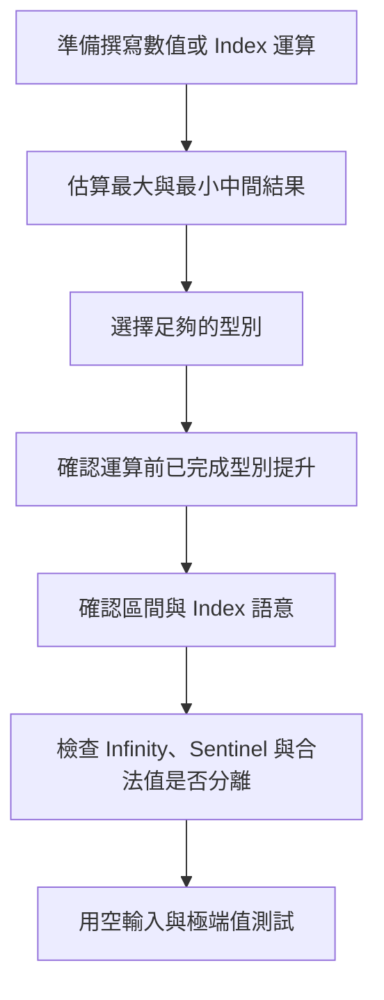
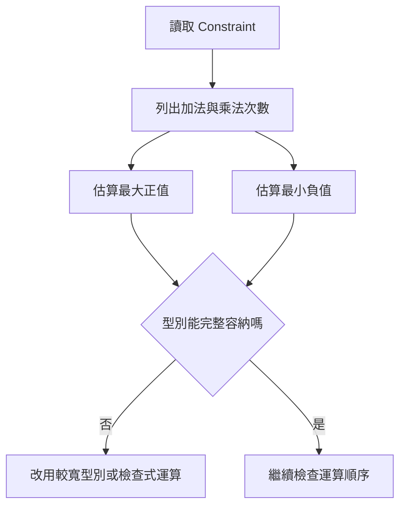
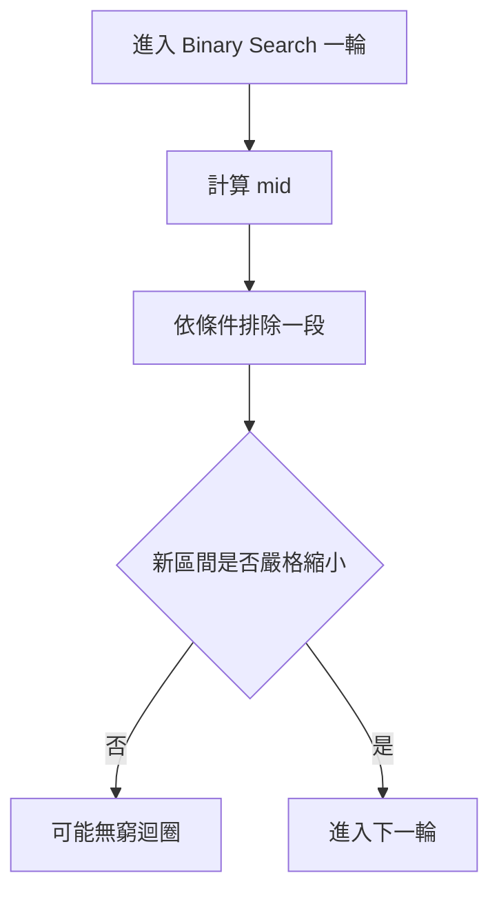
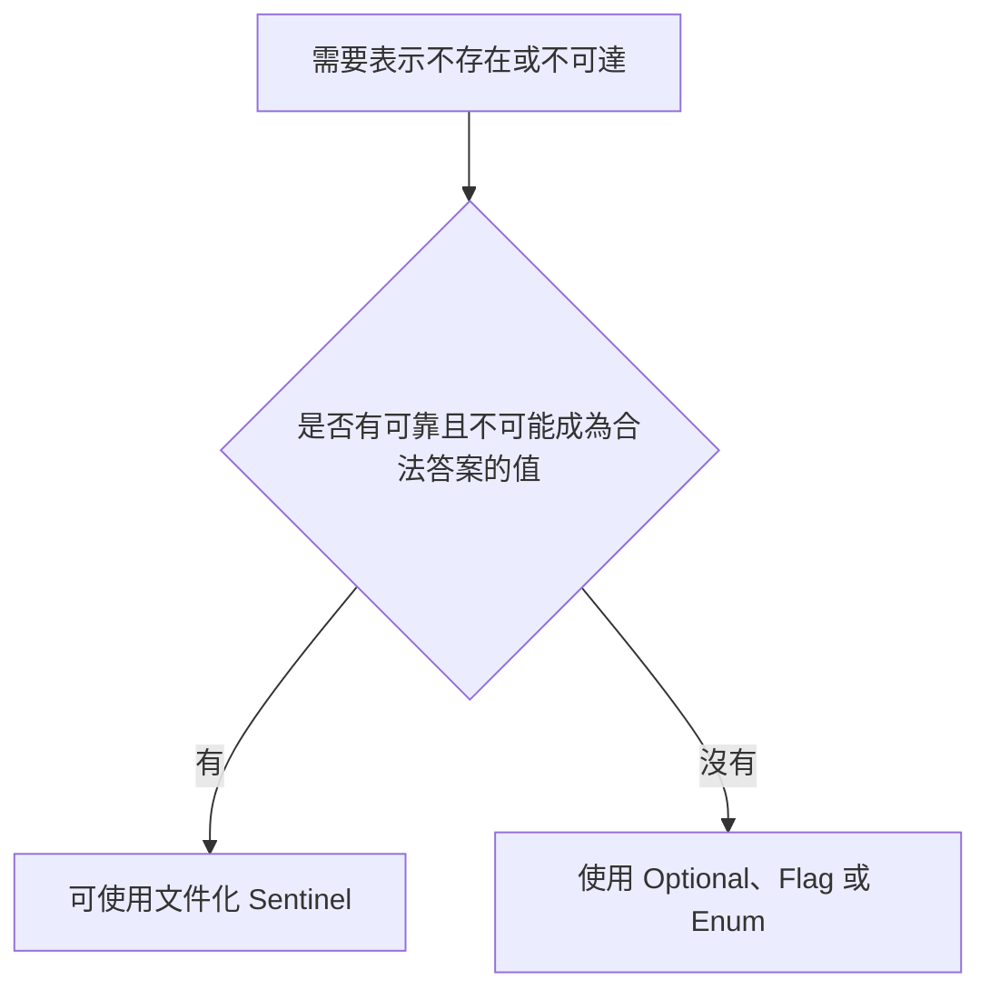

## 附錄 C　常見數值與邊界問題

### 適用範圍

本附錄整理 C++ 演算法中常見的數值、型別與邊界風險，包括整數範圍、Signed 與 Unsigned、Overflow、Floating-point Precision、Infinity、Sentinel、Modulo、Index 與區間端點。

這類問題的困難是，程式可能可以編譯，也能通過小型測試，但在空輸入、極端值或大資料下才失敗。常見現象包括：

- 小資料正確，大資料得到負數或異常值。
- 空容器時，`size() - 1` 變成很大的正數。
- 已將結果宣告為 `long long`，乘法仍先發生 Overflow。
- Binary Search 少一格、多一格，或無法停止。
- 使用 `INT_MAX` 表示 Infinity，後續加上 Weight 時 Overflow。
- 浮點數在畫面上看起來相同，使用 `==` 卻判斷不相等。
- `%` 遇到負數後，結果不是預期的非負餘數。

本附錄會建立固定檢查流程：

1. 先估算最大與最小中間結果。
2. 再選擇資料型別。
3. 在運算發生前完成型別提升。
4. 明確定義區間端點與 Index 型別。
5. 將合法值、不可達狀態與不存在狀態分開。
6. 使用空輸入、最小值、最大值與溢位邊界測試。



### 適用讀者

- 常在大資料才遇到錯誤答案的讀者。
- 不熟悉 `int`、`long long`、`int64_t` 與 `size_t` 差異的讀者。
- 容易混淆 Signed Overflow 與 Unsigned Wraparound 的讀者。
- 常在 Binary Search、反向迴圈與區間端點出錯的讀者。
- 需要在 Graph、DP、Prefix Sum 中使用 Infinity 或 Sentinel 的讀者。

### 快速導覽

- [C.1 先估算中間結果](#c1-先估算中間結果)
- [C.2 固定寬度整數與常見範圍](#c2-固定寬度整數與常見範圍)
- [C.3 Overflow 發生在指定之前](#c3-overflow-發生在指定之前)
- [C.4 Signed 與 Unsigned](#c4-signed-與-unsigned)
- [C.5 size_t 與反向迴圈](#c5-size_t-與反向迴圈)
- [C.6 Index 與區間端點](#c6-index-與區間端點)
- [C.7 Binary Search 的 Mid 與邊界](#c7-binary-search-的-mid-與邊界)
- [C.8 Floating-point Precision](#c8-floating-point-precision)
- [C.9 Infinity](#c9-infinity)
- [C.10 Sentinel Value](#c10-sentinel-value)
- [C.11 Modulo 與負數](#c11-modulo-與負數)
- [C.12 加法、乘法與比較前的安全檢查](#c12-加法乘法與比較前的安全檢查)
- [C.13 常見問題與判讀](#c13-常見問題與判讀)
- [C.14 邊界測試設計](#c14-邊界測試設計)
- [C.15 本附錄檢查表](#c15-本附錄檢查表)
- [C.16 本附錄重點](#c16-本附錄重點)

### C.1 先估算中間結果

型別選擇不能只看單一輸入值，還要看中間運算。

假設：

```text
n <= 100,000
每個 value <= 1,000,000,000
```

單一 value 可以放入 32-bit `int`，但全部加總最多約為：

```text
100,000 × 1,000,000,000 = 100,000,000,000,000
```

這已超過 32-bit Integer 範圍，因此總和要使用 64-bit Integer。

常見估算方式：

<table>
<tr><th>問題</th><th>應估算的中間結果</th></tr>
<tr><td>Prefix Sum</td><td>最大元素絕對值 × 元素數量</td></tr>
<tr><td>最短路</td><td>最大 Edge Weight × 最多 Path Edge 數</td></tr>
<tr><td>Pair Count</td><td>`n × (n - 1) / 2`</td></tr>
<tr><td>面積</td><td>最大寬度 × 最大高度</td></tr>
<tr><td>Matrix Chain</td><td>三個 Dimension 的乘積與多次成本加總</td></tr>
<tr><td>方法數 DP</td><td>答案成長速度，可能遠快於輸入值</td></tr>
</table>



### C.2 固定寬度整數與常見範圍

若需要明確位數，可以使用 `<cstdint>` 中的固定寬度型別。

<table>
<tr><th>型別</th><th>範圍</th></tr>
<tr><td>`std::int32_t`</td><td>-2,147,483,648 到 2,147,483,647</td></tr>
<tr><td>`std::uint32_t`</td><td>0 到 4,294,967,295</td></tr>
<tr><td>`std::int64_t`</td><td>-9,223,372,036,854,775,808 到 9,223,372,036,854,775,807</td></tr>
<tr><td>`std::uint64_t`</td><td>0 到 18,446,744,073,709,551,615</td></tr>
</table>

可使用 `std::numeric_limits<T>` 查詢實際型別限制：

```cpp
#include <iostream>
#include <limits>

int main()
{
    std::cout << std::numeric_limits<int>::min() << '\n';
    std::cout << std::numeric_limits<int>::max() << '\n';
    std::cout << std::numeric_limits<long long>::max() << '\n';
}
```

`long long` 至少能保存 64-bit 範圍，但若程式介面要求精確寬度，使用 `std::int64_t` 可讓意圖更明確。

### C.3 Overflow 發生在指定之前

以下寫法看起來結果是 `long long`：

```cpp
int width = 100000;
int height = 100000;
long long area = width * height;
```

但右側的 `width * height` 會先以 `int` 運算。若已溢位，再指定給 `long long` 也無法恢復正確結果。

應在乘法發生前提升型別：

```cpp
long long area = 1LL * width * height;
```

或：

```cpp
long long area = static_cast<long long>(width) * height;
```

同樣問題也會出現在：

```cpp
long long pairCount = n * (n - 1) / 2;
```

若 n 是 int，前半段仍可能先 Overflow。較安全的寫法：

```cpp
long long pairCount = 1LL * n * (n - 1) / 2;
```

#### 加法也可能先 Overflow

```cpp
int a = 2'000'000'000;
int b = 2'000'000'000;
long long sum = a + b;
```

應改成：

```cpp
long long sum = static_cast<long long>(a) + b;
```

#### Signed Overflow 與 Unsigned Wraparound

- Signed Integer Overflow 在 C++ 中屬於 Undefined Behavior。
- Unsigned Arithmetic 會依 `2^N` 模數回繞。

Unsigned Wraparound 雖有定義，但通常仍不是演算法想要的答案。

### C.4 Signed 與 Unsigned

Signed 型別可表示負數，Unsigned 型別只表示非負值。

常見風險是混合比較：

```cpp
int index = -1;
std::vector<int> values{1, 2, 3};

if (index < values.size())
{
    // 結果可能和直覺不同
}
```

`values.size()` 通常是 Unsigned。比較時，負數 index 可能被轉成很大的 Unsigned 值。

較清楚的寫法：

```cpp
if (index >= 0 &&
    index < static_cast<int>(values.size()))
{
}
```

前提是 `values.size()` 能安全轉成 int。正式介面若可能處理超大型容器，應統一使用能完整表示範圍的 Signed 型別，例如 `std::ptrdiff_t` 或容器對應的 difference type。

### C.5 size_t 與反向迴圈

`std::size_t` 適合表示物件大小與合法非負 Index，但不能表示 -1。

錯誤反向迴圈：

```cpp
for (std::size_t i = values.size() - 1;
     i >= 0;
     --i)
{
}
```

問題有兩個：

1. 空容器時，`values.size() - 1` 會 Underflow。
2. `i >= 0` 對 Unsigned 永遠成立。

#### 使用 Signed Index

```cpp
for (int i = static_cast<int>(values.size()) - 1;
     i >= 0;
     --i)
{
    use(values[i]);
}
```

#### 使用 Unsigned 慣用寫法

```cpp
for (std::size_t i = values.size(); i-- > 0; )
{
    use(values[i]);
}
```

這種寫法合法，但較不直覺，應搭配團隊慣例與註解。

#### 使用反向 Iterator

```cpp
for (auto it = values.rbegin(); it != values.rend(); ++it)
{
    use(*it);
}
```

如果只需要反向走訪，不需要 Index，Reverse Iterator 通常更清楚。

### C.6 Index 與區間端點

區間錯誤常不是單一比較符號問題，而是整段程式混用不同區間語意。

#### 閉區間 `[left, right]`

- 包含 left 與 right。
- 長度是 `right - left + 1`。
- 空區間常需要額外表示。

#### 半開區間 `[left, right)`

- 包含 left，不包含 right。
- 長度是 `right - left`。
- `left == right` 自然表示空區間。
- STL Iterator Range 使用此語意。

<table>
<tr><th>問題</th><th>閉區間</th><th>半開區間</th></tr>
<tr><td>整個 Array</td><td>`[0, n - 1]`</td><td>`[0, n)`</td></tr>
<tr><td>長度</td><td>`right - left + 1`</td><td>`right - left`</td></tr>
<tr><td>空輸入</td><td>`right = -1` 等特殊情況</td><td>`left == right == 0`</td></tr>
<tr><td>切成兩段</td><td>需小心 `mid + 1`</td><td>`[left, mid)` 與 `[mid, right)`</td></tr>
</table>

同一函式中應固定一種表示法，並在註解或 Interface 中說明。

### C.7 Binary Search 的 Mid 與邊界

傳統寫法：

```cpp
int mid = (left + right) / 2;
```

如果 left 與 right 很大，`left + right` 可能 Overflow。

較安全：

```cpp
int mid = left + (right - left) / 2;
```

但這仍假設：

- left 與 right 的差可表示。
- left 不大於 right。
- 型別一致。

#### Half-open Binary Search

```cpp
int left = 0;
int right = static_cast<int>(values.size());

while (left < right)
{
    int mid = left + (right - left) / 2;

    if (values[mid] < target)
    {
        left = mid + 1;
    }
    else
    {
        right = mid;
    }
}
```

每一輪後 `[left, right)` 必須縮小。若寫成 `left = mid`，當 mid 等於 left 時可能無法前進。



### C.8 Floating-point Precision

Binary Floating-point 無法精確表示所有十進位小數。

```cpp
double value = 0.1 + 0.2;
```

value 不一定精確等於十進位的 0.3，因此經過運算後不宜直接使用：

```cpp
if (value == 0.3)
```

#### 絕對誤差

```cpp
bool nearlyEqualAbsolute(double a, double b)
{
    return std::abs(a - b) <= 1e-9;
}
```

只使用固定絕對誤差，對非常大或非常小的值未必合適。

#### 結合相對尺度

```cpp
#include <algorithm>
#include <cmath>

bool nearlyEqual(double a, double b)
{
    const double scale = std::max(
        {1.0, std::abs(a), std::abs(b)});

    return std::abs(a - b) <= 1e-12 * scale;
}
```

Tolerance 必須依題目誤差規格決定，不能把同一常數套用到所有領域。

#### 金額

若需要精確到分，可考慮使用整數最小單位：

```text
NT$ 123.45 -> 12345 分
```

但匯率、利息、稅務與捨入規則仍需依業務規格處理，不能只靠改成整數解決全部問題。

### C.9 Infinity

最短路與 DP 常需要表示不可達或尚未得到答案。

不宜直接使用最大值後無條件加成本：

```cpp
long long candidate = distance[u] + weight;
```

如果 `distance[u]` 是 `LLONG_MAX`，加法可能 Overflow。

常見方式：

```cpp
#include <limits>

constexpr long long INF =
    std::numeric_limits<long long>::max() / 4;
```

使用前先檢查：

```cpp
if (distance[u] != INF)
{
    long long candidate = distance[u] + weight;
}
```

`max() / 4` 只是保留運算餘裕，不代表自動安全。仍要估算最大合法 Path Cost，確認它明顯小於 INF。

### C.10 Sentinel Value

Sentinel 是用特殊值表示「不存在」、「未初始化」或「已結束」。

例如：

```cpp
int answer = -1;
```

只有在 -1 不可能是合法答案時才安全。

若所有 int 都可能是合法值，不應使用 `INT_MIN` 表示不存在。

替代方法：

- `std::optional<T>`。
- 額外 Boolean。
- Enum State。
- 分離的 `visited`、`reachable` 或 `computed` Array。



#### DP 中 -1 不一定安全

若 DP 合法答案可能是 -1，就不能用 -1 同時表示「尚未計算」。可以增加：

```cpp
std::vector<bool> computed;
```

或使用 `std::optional<long long>` 保存 Memo State。

### C.11 Modulo 與負數

在 C++ 中，負數 `%` 的結果可能為負：

```cpp
-1 % 5 // 結果為 -1
```

若需要正規化到 `[0, mod)`，且 `mod > 0`：

```cpp
int normalized = ((value % mod) + mod) % mod;
```

如果 value 的負值幅度很大，第一次 `% mod` 會先縮小範圍。

#### 乘法取模

```cpp
long long result =
    (static_cast<long long>(a) * b) % mod;
```

轉型必須在乘法前完成。

若 a、b 本身接近 64-bit 上限，即使 `long long` 也可能不足，需要使用更寬中間型別、分解乘法或專門的 Modular Multiplication。

#### 加法取模

```cpp
int result = (a + b) % mod;
```

如果 a、b 尚未正規化且可能很大，加法仍可能 Overflow。先正規化或使用較寬型別。

### C.12 加法、乘法與比較前的安全檢查

有些情況不能只換成較寬型別，還需要在運算前檢查。

#### 檢查正整數加法是否超過上限

```cpp
bool canAdd(long long a, long long b)
{
    return b <= std::numeric_limits<long long>::max() - a;
}
```

這個版本只適用特定非負前置條件。若包含負數，需要分別檢查上下界。

#### 使用更寬中間型別

在支援的編譯器環境中，可使用 `__int128` 作為 64-bit 乘法的中間結果，但它不是標準 C++ 固定寬度型別，移植性需要另行考量。

#### 比較乘積時避免直接相乘

若要比較 `a * b` 與 `c * d`，直接相乘可能 Overflow。可以使用更寬型別，或依正負與除法條件重新推導安全比較方式。不要在未確認符號與零值時直接改成除法，因為整數除法會截斷且可能除以零。

### C.13 常見問題與判讀

<table>
<tr><th>現象</th><th>可能原因</th><th>第一輪檢查</th></tr>
<tr><td>大資料答案變負數</td><td>Signed Overflow</td><td>檢查中間加法與乘法型別</td></tr>
<tr><td>空容器時 Index 變很大</td><td>`size() - 1` Unsigned Underflow</td><td>先處理空輸入或改區間表示</td></tr>
<tr><td>反向迴圈無法停止</td><td>`size_t` 永遠不小於 0</td><td>改 Signed Index、Reverse Iterator 或安全模式</td></tr>
<tr><td>Binary Search 卡住</td><td>區間沒有嚴格縮小</td><td>追蹤 left、right、mid</td></tr>
<tr><td>DP 不可達 State 變成合法值</td><td>Sentinel 與合法答案衝突</td><td>分離 Reachable 或 Computed 狀態</td></tr>
<tr><td>最短路產生極小負數</td><td>INF 參與加法造成 Overflow</td><td>Relax 前先檢查可達性</td></tr>
<tr><td>浮點比較偶爾失敗</td><td>直接使用 `==`</td><td>依題目誤差規格設計 Tolerance</td></tr>
<tr><td>Modulo 出現負數</td><td>未做非負正規化</td><td>確認 mod 大於 0 並正規化</td></tr>
<tr><td>已使用 long long 仍錯</td><td>轉型發生在運算後</td><td>在第一個乘法或加法前提升型別</td></tr>
</table>

### C.14 邊界測試設計

不要只測隨機一般值。建議包含：

#### 數量邊界

```text
n = 0
n = 1
n = 2
n = 最大限制
```

#### 數值邊界

```text
0
1
-1
INT_MAX
INT_MIN
接近 Overflow 的加法與乘法
```

#### Index 邊界

```text
第一個位置
最後一個位置
left == right
空區間
right == size
```

#### 浮點邊界

```text
非常接近的數字
很大的數字
接近 0 的數字
正負 0
Infinity 與 NaN，若題目可能出現
```

NaN 和任何值比較，包括自己，通常都不相等。若輸入可能包含 NaN，需要明確決定排序、比較與輸出規則。

### C.15 本附錄檢查表

- 我已估算最大與最小中間結果。
- 型別能保存中間結果，而不只是輸入值。
- 型別提升發生在可能 Overflow 的運算之前。
- 我已檢查 Signed 與 Unsigned 混合比較。
- 空容器下的 `size() - 1` 是安全的。
- 反向迴圈不依賴 Unsigned 變成負數。
- Inclusive 與 Half-open Interval 沒有混用。
- Binary Search 每一輪都會嚴格縮小區間。
- Infinity 不會無條件參與加法。
- Sentinel 不會和合法答案衝突。
- Modulo 已依需求正規化到非負範圍。
- Floating-point Tolerance 符合題目誤差規格。
- 我已測試空輸入、最小值、最大值與大資料。

### C.16 本附錄重點

- 數值型別應依最大中間結果選擇。
- 指定給 `long long` 不代表右側運算自動使用 64-bit。
- Signed Overflow 是 Undefined Behavior；Unsigned Wraparound 雖有定義，通常仍是邏輯錯誤。
- `size_t` 適合非負大小，但不適合依賴 -1 的流程。
- 區間端點必須固定使用閉區間或半開區間。
- Binary Search 的安全性同時依賴 Mid 算法與區間嚴格縮小。
- Floating-point 比較應依規格使用合適的絕對或相對誤差。
- Infinity、Sentinel、不可達狀態與合法值必須分離。
- Modulo、乘法與加法都要在 Overflow 前完成型別與範圍處理。
- 邊界測試應包含數量、數值、Index 與型別極限。
