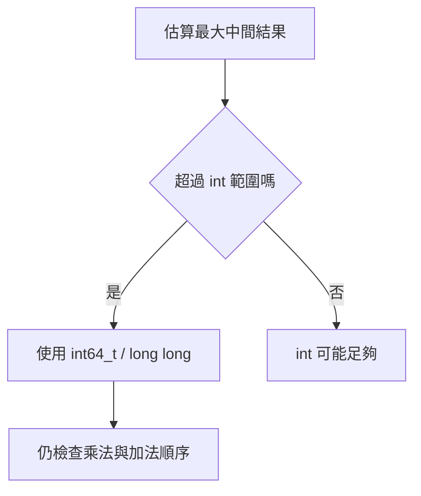
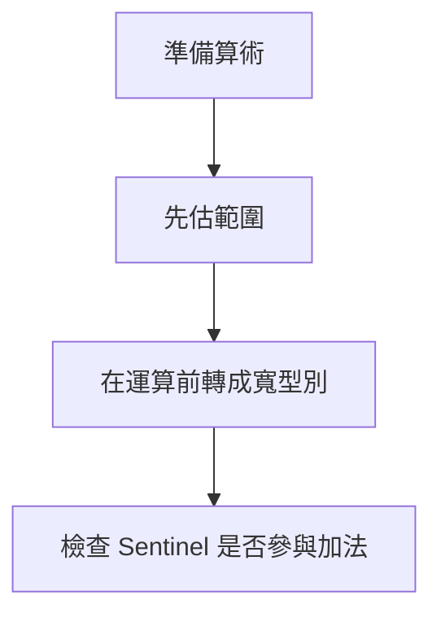
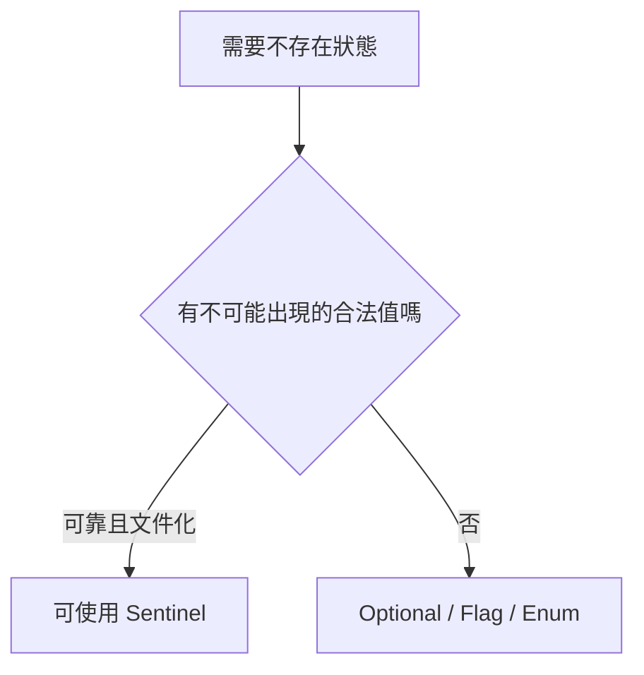

## 附錄 C　常見數值與邊界問題

### 適用範圍

本附錄整理 C++ 演算法中最常見的數值、型別與邊界風險，包括 32-bit 與 64-bit Integer、Signed 與 Unsigned、Overflow、Floating-point Precision、Infinity、Sentinel、Modulo 與 Index Type。

### C.1 32-bit 與 64-bit Integer

常見範圍：

| 型別 | 典型範圍 |
|---|---|
| `int32_t` | -2,147,483,648 到 2,147,483,647 |
| `uint32_t` | 0 到 4,294,967,295 |
| `int64_t` | 約 -9.22×10^18 到 9.22×10^18 |
| `uint64_t` | 0 到約 1.84×10^19 |

型別選擇應根據中間結果，而不只看單一輸入值：

```text
最大元素 × 元素數量
最大 Edge Weight × 最多 Edge 數
Pair 數 n(n-1)/2
```



### C.2 Signed 與 Unsigned

`size_t` 適合表示大小與合法 Index，但無法表示 -1。常見風險：

```cpp
std::size_t right = values.size() - 1; // 空容器時 Underflow
```

安全方式：

```cpp
if (values.empty())
{
    return;
}

std::size_t right = values.size() - 1;
```

Signed 與 Unsigned 比較時可能先轉成 Unsigned，讓負值變成很大的正值。建議在邊界清楚處完成顯式、安全的型別轉換。

### C.3 Overflow 與 Underflow

Signed Integer Overflow 在 C++ 屬於未定義行為。Unsigned Arithmetic 依模數回繞，但通常仍不是演算法想要的結果。

錯誤：

```cpp
long long product = a * b; // 若 a、b 是 int，乘法先以 int 執行
```

較安全：

```cpp
long long product = static_cast<long long>(a) * b;
```

Binary Search Mid：

```cpp
int mid = left + (right - left) / 2;
```



### C.4 Floating-point Precision

Floating-point 無法精確表示所有十進位小數。避免直接用 `==` 比較經過多次運算的結果。

常見近似比較：

```cpp
bool nearlyEqual(double a, double b)
{
    const double scale = std::max({1.0, std::abs(a), std::abs(b)});
    return std::abs(a - b) <= 1e-12 * scale;
}
```

Tolerance 應依問題誤差規格決定，不應固定套用同一常數。金額與精確計數通常可考慮 Integer 最小單位或 Decimal 類型。

### C.5 Infinity 的表示

最短路與 DP 常需要 Infinity。不要直接使用最大值後再無條件加 Weight：

```cpp
constexpr long long INF =
    std::numeric_limits<long long>::max() / 4;

if (distance[u] != INF)
{
    long long candidate = distance[u] + weight;
}
```

保留餘裕可降低加法 Overflow 風險，但仍需估算最大合法成本。

### C.6 Sentinel Value

Sentinel 必須和合法資料範圍分離。若所有 `int` 都可能是合法 Key，便不應用 `INT_MIN` 表示「不存在」。

替代方式：

- `std::optional<T>`。
- 額外 Boolean。
- Enum State。
- 分離的 Visited / Reachable Array。



### C.7 Modulo 與負數

C++ 的 `%` 對負數結果可為負：

```cpp
int normalized = ((value % mod) + mod) % mod;
```

前提是 `mod > 0`。加法、乘法取模仍需在 Overflow 前轉成較寬型別：

```cpp
long long result =
    (static_cast<long long>(a) * b) % mod;
```

### C.8 Index Type 的選擇

- 容器 Size、Iterator 差值與對外介面需保持一致。
- 需要 -1 Sentinel 或反向到負值時，Signed Index 較方便。
- 使用 `size_t` 反向迴圈時避免 `i >= 0`。

安全反向走訪：

```cpp
for (std::size_t i = values.size(); i-- > 0; )
{
    use(values[i]);
}
```

或在已確認 Size 可轉換後使用 Signed Index。

### C.9 邊界檢查表

- 空輸入是否先處理？
- `n-1` 在 n=0 時是否安全？
- Inclusive 與 Half-open 是否一致？
- `right+1` 是否可能越界？
- 乘法是否在轉型前 Overflow？
- Infinity 是否參與運算？
- Sentinel 是否和合法值衝突？
- Signed / Unsigned 比較是否可預期？
- Modulo 是否正規化？

### C.10 本附錄重點

- 型別應依最大中間結果選擇。
- 轉成寬型別必須發生在可能 Overflow 的運算之前。
- Unsigned Underflow 雖有定義，通常仍是邏輯錯誤。
- Infinity、Sentinel 與合法資料範圍必須清楚分離。
- Index、區間與算術邊界應以空輸入和極端值測試。
