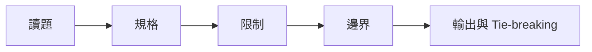
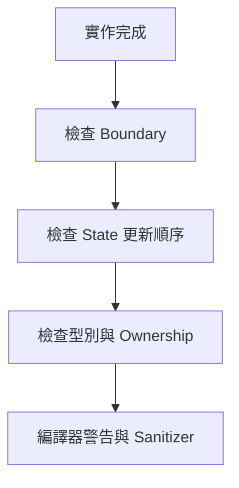
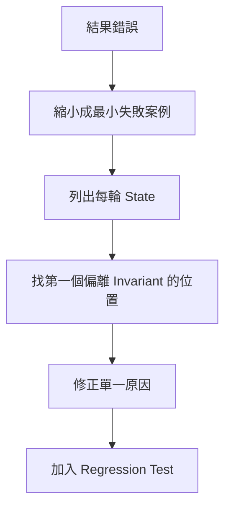

## 附錄 D　解題檢查表

### 適用範圍

本附錄提供從讀題、解法設計、複雜度、實作、測試到錯題整理的一套快速檢查流程，可在寫題或 Code Review 時直接使用。

### D.1 讀題檢查表

- 輸入與輸出型別是什麼？
- 一個合法答案的完整定義是什麼？
- 是否允許空集合、空區間或空 Tree？
- 重複值按 Value 還是 Index 區分？
- 是否要求原始順序、穩定性或原始 Index？
- Graph Edge 是否有方向與 Weight？
- 若有多個答案，Tie-breaking 是什麼？
- 輸入規模與數值範圍是多少？



### D.2 解法設計檢查表

- 先寫得出完整 Brute Force 嗎？
- 候選數量是多少？
- 哪些工作重複發生？
- 是否有排序、單調性、連續性或相依關係？
- State、Invariant 或容器 Element 的語意是什麼？
- 每次 Pointer 移動、Pop、剪枝排除什麼？
- 方法成立的 Precondition 是否滿足？
- 是否需要保存 Path、Parent、Index 或完整 Frame？

### D.3 複雜度檢查表

- 時間是候選數 × 單次成本，還是攤銷分析？
- 排序、Hash、Heap、Tree、遞迴成本是否計入？
- 每個元素最大 Push、Pop、Relax 或更新次數？
- 最差資料分布是什麼？
- 空間是否包含輸出、Call Stack、Queue、Visited、DP Table？
- 型別與記憶體是否符合限制？

### D.4 實作檢查表

- 區間是 `[l,r)` 還是 `[l,r]`？
- `top/front/back` 前是否檢查非空？
- Pointer / Iterator 是否可能失效？
- 更新順序是否先保存之後仍需使用的 State？
- 一維 DP 走訪方向是否符合使用次數？
- Parent、Distance、Visited 是否同步更新？
- Signed / Unsigned 與 Overflow 是否安全？
- Ownership、Allocation、Deallocation 是否明確？



### D.5 測試案例檢查表

- 空輸入。
- 單一元素或 Node。
- 兩個元素。
- 全部相同。
- 已排序、反向排序。
- 答案在開頭、結尾、整段或不存在。
- 多個合法答案。
- 最大、最小、0、負數與 Overflow 邊界。
- Graph 的孤立 Node、Cycle、Self-loop、Disconnected。
- Tree 的鏈狀、單側、完整形狀。
- 能觸發最差複雜度的資料。

### D.6 提交前檢查表

- Sample 與自建案例都通過。
- Debug Output 已移除。
- 函式符合指定 Signature。
- 沒有讀取區間外或空容器。
- 不可達、找不到與空答案政策一致。
- 複雜度符合最大輸入。
- C++ Include、Namespace、型別轉換完整。
- 若允許，使用 Compiler Warning、AddressSanitizer、UndefinedBehaviorSanitizer。

### D.7 錯題整理檢查表

記錄：

```markdown
## 第一版想法
## 第一個錯誤 State
## 最小失敗案例
## 錯誤分類
## 正確方法的成立條件
## 反例
## 下次複習日期
```

錯誤分類：規格、模型、Boundary、State、更新順序、複雜度、型別、Ownership、測試不足。

### D.8 Debug 流程



不要只觀察最終輸出。第一個錯誤 State 通常更接近需要修正的位置。

### D.9 Review 問題

- 這個方法最關鍵的 Precondition 是什麼？
- 若移除該條件，有反例嗎？
- State 是否最小且足夠？
- 有沒有更簡單且已符合限制的版本？
- 複雜度描述是平均、攤銷還是最差？
- 介面是否清楚表達錯誤與 Ownership？

### D.10 本附錄重點

- 檢查表的目的在降低遺漏，不取代推理。
- 讀題時先固定規格、限制與輸出語意。
- 設計時從 Brute Force、重複工作與成立條件出發。
- 實作時同步檢查 Boundary、State、型別與 Ownership。
- 測試應包含邊界、反例與最差資料。
- 錯題要保留第一個錯誤 State 與最小失敗案例。
