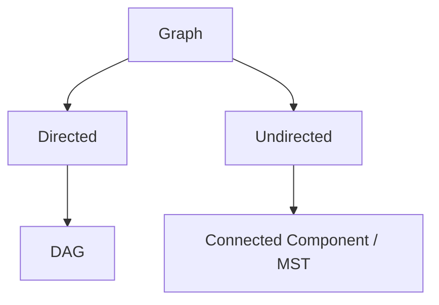
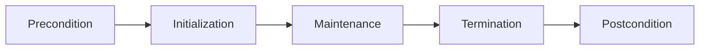

## 附錄 E　演算法名詞表

### 適用範圍

本附錄提供正文常見名詞的快速定義、用途與注意事項。遇到不同教材定義時，應以該章明確規格為準。

### E.1 資料結構名詞

| 名詞 | 英文與簡要定義 | 注意事項 |
|---|---|---|
| Array | 連續儲存的元素序列 | 隨機存取 O(1)，中間插入常需搬移 |
| Linked List | 由 Node 與 Pointer 串接 | 已知位置可局部改鏈結，搜尋仍可能 O(n) |
| Stack | Last In, First Out | `top/pop` 前需非空 |
| Queue | First In, First Out | BFS 常在入列時標記 Visited |
| Deque | Double-ended Queue | 支援兩端加入與移除 |
| Set | 保存 Key Membership | 不保存額外 Mapping Value |
| Map | Key 對應 Value State | `operator[]` 可能插入預設值 |
| Heap | 維持最小或最大 Priority | 不提供完整排序走訪 |
| DSU | Disjoint Set Union | 支援 Find 與 Union Component |

### E.2 搜尋與排序名詞

| 名詞 | 定義 |
|---|---|
| Binary Search | 在有序或單調候選空間排除一半 |
| Lower Bound | 第一個不小於 Target 的 Position |
| Upper Bound | 第一個大於 Target 的 Position |
| Stable Sort | 相同 Key 元素保留原相對順序 |
| Partition | 依 Pivot 或 Predicate 將資料分區 |
| In-place | 通常表示不使用隨輸入線性成長的輔助容器，仍需看具體定義 |
| Amortized | 一連串操作平均分攤後的成本 |

### E.3 Tree 與 Graph 名詞

| 名詞 | 定義 |
|---|---|
| Root | Rooted Tree 中沒有 Parent 的 Node |
| Leaf | 沒有 Child 的 Node |
| Depth | Root 到目前 Node 的距離 |
| Height | 目前 Node 到最深 Leaf 的最大距離 |
| Subtree | 某 Node 與所有 Descendant |
| DAG | Directed Acyclic Graph |
| Path | 依 Edge 連接的 Node 序列，是否允許重複依題目定義 |
| Cycle | 從某 Node 出發並回到原 Node 的閉合路徑 |
| Connected Component | Undirected Graph 中最大互相可達 Node 集合 |
| Indegree | Directed Graph 中指向 Node 的 Edge 數 |
| Relaxation | 用新 Path 嘗試降低 Distance |
| Spanning Tree | 連接全部 Node 的無 Cycle Subgraph |

### E.4 Dynamic Programming 名詞

| 名詞 | 定義 |
|---|---|
| State | 足以描述 Subproblem 的資訊 |
| Transition | 由已知 State 計算新 State 的規則 |
| Base Case | 無需再拆分即可直接知道答案的 State |
| Memoization | Top-down 遞迴並快取 Result |
| Tabulation | Bottom-up 依 Dependency 填表 |
| Optimal Substructure | 最佳解可由 Subproblem 最佳解組成 |
| Overlapping Subproblems | 相同 State 會被重複求解 |
| Reconstruction | 由 Parent 或 Decision 還原實際方案 |
| Unreachable State | 目前無合法方法抵達的 State，需和合法 0 分離 |

### E.5 複雜度名詞

| 名詞 | 定義 |
|---|---|
| Time Complexity | 工作量隨輸入規模成長的描述 |
| Space Complexity | 額外記憶體隨輸入規模成長的描述 |
| Worst-case | 所有合法輸入中的最大成本 |
| Average-case | 在指定輸入分布下的期望成本 |
| Amortized Analysis | 對操作序列總成本進行分攤 |
| Output-sensitive | 成本包含輸出大小，例如 O(n+k) |
| V、E | Graph Node 數與 Edge 數 |
| h、w | Tree Height 與最大寬度 |

### E.6 正確性與證明名詞

| 名詞 | 定義 |
|---|---|
| Precondition | 函式或演算法開始前必須成立的條件 |
| Postcondition | 完成後必須成立的結果規格 |
| Invariant | 過程中指定時間點持續成立的性質 |
| Initialization | 證明 Invariant 在開始時成立 |
| Maintenance | 證明每輪更新後仍成立 |
| Termination | 證明流程結束，並由 Invariant 推出答案 |
| Exchange Argument | 將最佳解交換成含 Greedy Choice 且不更差 |
| Cut Property | MST 中跨 Cut 的安全 Edge 性質 |
| Counterexample | 推翻某個一般主張的具體案例 |
| Oracle | 用來提供可靠預期結果的參考解法 |

### E.7 常見英文名詞翻譯

- **Invariant**：不變量。描述迴圈或資料結構在指定時間點持續成立的性質。  
  Example: “The stack invariant holds after every iteration.”  
  中文：每輪結束後，Stack 的不變量仍成立。

- **Predecessor**：前驅。依問題可指 Graph 前一個 Node、BST 中較小的最近 Key，或 DP 的前一個 State。  
  Example: “Store the predecessor to reconstruct the path.”  
  中文：保存前驅以還原路徑。

- **Successor**：後繼。語意需依資料結構與順序定義。  
  Example: “The inorder successor is the next node in sorted order.”  
  中文：Inorder Successor 是排序順序中的下一個 Node。

- **Stale Entry**：過期項目。常指 Heap 內已不等於目前最佳 State 的舊資料。  
  Example: “Skip stale heap entries before relaxing edges.”  
  中文：Relax Edge 前先略過 Heap 中的過期項目。

### E.8 使用方式

- 先查快速定義，再回正文閱讀完整 Precondition 與案例。
- 同一名詞若有多種定義，例如 Height、Path、In-place，應以該章規格為準。
- 寫題後用名詞反問自己：State、Invariant、Postcondition 與 Complexity 是否都已明確。

### E.9 本附錄重點

- 名詞表用於快速同步語意，不取代完整推導。
- 同一名詞在不同教材可能有細節差異，應先固定本題定義。
- 資料結構名稱不代表演算法自動正確，仍需說明 State 與 Precondition。
- 複雜度應標明平均、攤銷或最差語意。
- 正確性討論可由 Precondition、Invariant、Termination 與 Postcondition 組織。
