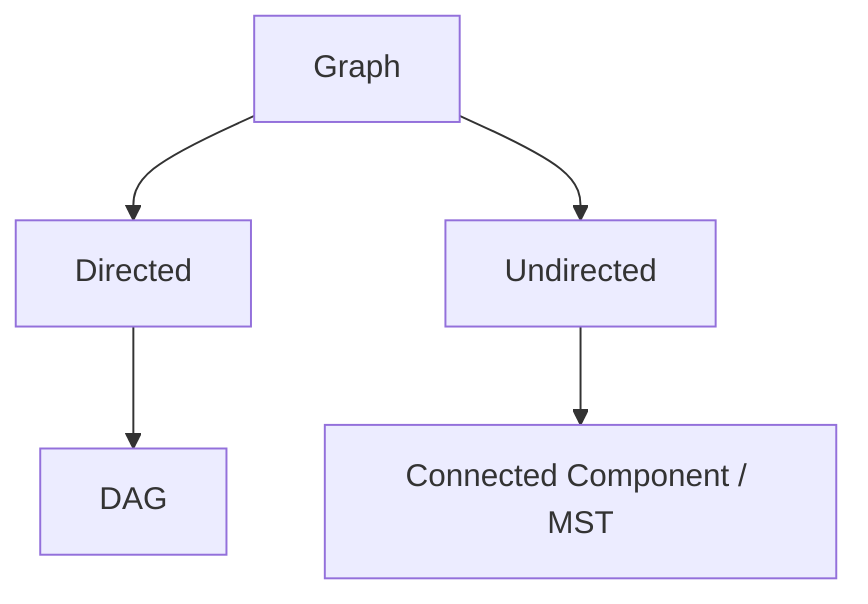
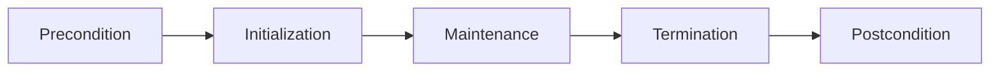

## 附錄 E　演算法名詞表

### 適用範圍

本附錄提供正文常見名詞的快速定義、用途與注意事項。遇到不同教材定義時，應以該章明確規格為準。

### E.1 資料結構名詞

| 名詞 | 英文與簡要定義 | 注意事項 |
|---|---|---|
| Array | 連續儲存的元素序列 | 隨機存取 O(1)，中間插入常需搬移 |
| Linked List | 由 Node 與 Pointer 串接 | 已知位置可局部改鏈結，搜尋仍可能 O(n) |
| Stack | Last In, First Out | `top/pop` 前需非空 |
| Queue | First In, First Out | BFS 常在入列時標記 Visited |
| Deque | Double-ended Queue | 支援兩端加入與移除 |
| Set | 保存 Key Membership | 不保存額外 Mapping Value |
| Map | Key 對應 Value State | `operator[]` 可能插入預設值 |
| Heap | 維持最小或最大 Priority | 不提供完整排序走訪 |
| DSU | Disjoint Set Union | 支援 Find 與 Union Component |


#### E.1.1 補充資料結構名詞

<table>
<tr><th>名詞</th><th>英文與簡要定義</th><th>注意事項</th></tr>
<tr><td>Tree</td><td>連通且沒有 Cycle 的特殊 Graph</td><td>指定 Root 後才有 Parent、Child 與 Subtree</td></tr>
<tr><td>Graph</td><td>由 Vertex 與 Edge 組成的關係模型</td><td>可能有方向、權重、Cycle 與多個 Component</td></tr>
<tr><td>Trie</td><td>Prefix Tree</td><td>路徑存在不一定代表完整單字存在</td></tr>
<tr><td>Fenwick Tree</td><td>Binary Indexed Tree</td><td>常用於 Point Update 與 Prefix Query</td></tr>
<tr><td>Segment Tree</td><td>以區間節點保存聚合資訊</td><td>適合較一般的 Range Query 與 Update</td></tr>
<tr><td>Priority Queue</td><td>優先佇列</td><td>快速取得最高優先權元素，不提供完整排序</td></tr>
</table>


### E.2 搜尋與排序名詞

| 名詞 | 定義 |
|---|---|
| Binary Search | 在有序或單調候選空間排除一半 |
| Lower Bound | 第一個不小於 Target 的 Position |
| Upper Bound | 第一個大於 Target 的 Position |
| Stable Sort | 相同 Key 元素保留原相對順序 |
| Partition | 依 Pivot 或 Predicate 將資料分區 |
| In-place | 通常表示不使用隨輸入線性成長的輔助容器，仍需看具體定義 |
| Amortized | 一連串操作平均分攤後的成本 |

### E.3 Tree 與 Graph 名詞

| 名詞 | 定義 |
|---|---|
| Root | Rooted Tree 中沒有 Parent 的 Node |
| Leaf | 沒有 Child 的 Node |
| Depth | Root 到目前 Node 的距離 |
| Height | 目前 Node 到最深 Leaf 的最大距離 |
| Subtree | 某 Node 與所有 Descendant |
| DAG | Directed Acyclic Graph |
| Path | 依 Edge 連接的 Node 序列，是否允許重複依題目定義 |
| Cycle | 從某 Node 出發並回到原 Node 的閉合路徑 |
| Connected Component | Undirected Graph 中最大互相可達 Node 集合 |
| Indegree | Directed Graph 中指向 Node 的 Edge 數 |
| Relaxation | 用新 Path 嘗試降低 Distance |
| Spanning Tree | 連接全部 Node 的無 Cycle Subgraph |



### E.4 Dynamic Programming 名詞

| 名詞 | 定義 |
|---|---|
| State | 足以描述 Subproblem 的資訊 |
| Transition | 由已知 State 計算新 State 的規則 |
| Base Case | 無需再拆分即可直接知道答案的 State |
| Memoization | Top-down 遞迴並快取 Result |
| Tabulation | Bottom-up 依 Dependency 填表 |
| Optimal Substructure | 最佳解可由 Subproblem 最佳解組成 |
| Overlapping Subproblems | 相同 State 會被重複求解 |
| Reconstruction | 由 Parent 或 Decision 還原實際方案 |
| Unreachable State | 目前無合法方法抵達的 State，需和合法 0 分離 |

### E.5 複雜度名詞

| 名詞 | 定義 |
|---|---|
| Time Complexity | 工作量隨輸入規模成長的描述 |
| Space Complexity | 額外記憶體隨輸入規模成長的描述 |
| Worst-case | 所有合法輸入中的最大成本 |
| Average-case | 在指定輸入分布下的期望成本 |
| Amortized Analysis | 對操作序列總成本進行分攤 |
| Output-sensitive | 成本包含輸出大小，例如 O(n+k) |
| V、E | Graph Node 數與 Edge 數 |
| h、w | Tree Height 與最大寬度 |

### E.6 正確性與證明名詞

| 名詞 | 定義 |
|---|---|
| Precondition | 函式或演算法開始前必須成立的條件 |
| Postcondition | 完成後必須成立的結果規格 |
| Invariant | 過程中指定時間點持續成立的性質 |
| Initialization | 證明 Invariant 在開始時成立 |
| Maintenance | 證明每輪更新後仍成立 |
| Termination | 證明流程結束，並由 Invariant 推出答案 |
| Exchange Argument | 將最佳解交換成含 Greedy Choice 且不更差 |
| Cut Property | MST 中跨 Cut 的安全 Edge 性質 |
| Counterexample | 推翻某個一般主張的具體案例 |
| Oracle | 用來提供可靠預期結果的參考解法 |



### E.7 常見英文名詞翻譯

- **Invariant**：不變量。描述迴圈或資料結構在指定時間點持續成立的性質。  
  Example: “The stack invariant holds after every iteration.”  
  中文：每輪結束後，Stack 的不變量仍成立。

- **Predecessor**：前驅。依問題可指 Graph 前一個 Node、BST 中較小的最近 Key，或 DP 的前一個 State。  
  Example: “Store the predecessor to reconstruct the path.”  
  中文：保存前驅以還原路徑。

- **Successor**：後繼。語意需依資料結構與順序定義。  
  Example: “The inorder successor is the next node in sorted order.”  
  中文：Inorder Successor 是排序順序中的下一個 Node。

- **Stale Entry**：過期項目。常指 Heap 內已不等於目前最佳 State 的舊資料。  
  Example: “Skip stale heap entries before relaxing edges.”  
  中文：Relax Edge 前先略過 Heap 中的過期項目。


#### E.7.1 Array、Subarray、Subsequence 與 Subset

<table>
<tr><th>名詞</th><th>中文說明</th><th>是否要求連續</th><th>是否保留順序</th></tr>
<tr><td>Array</td><td>陣列或序列容器</td><td>不適用</td><td>是</td></tr>
<tr><td>Subarray</td><td>原 Array 中的一段連續區間</td><td>是</td><td>是</td></tr>
<tr><td>Subsequence</td><td>刪除部分元素後留下的序列</td><td>否</td><td>是</td></tr>
<tr><td>Subset</td><td>從集合中選出的元素集合</td><td>否</td><td>通常不重視順序</td></tr>
</table>

對 `[1, 2, 3]`：

- `[1, 2]` 是 Subarray、Subsequence，也是 Subset。
- `[1, 3]` 不是 Subarray，但可以是 Subsequence 與 Subset。
- `[3, 1]` 不是原序列的 Subsequence，但若只看集合內容，可視為 `{1, 3}` 的同一個 Subset。

#### E.7.2 Index、Position、Iterator 與 Pointer

- **Index**：索引。通常是容器中的整數位置，例如 `values[3]` 的 3。
- **Position**：位置。語意比 Index 廣，可指 Iterator、Node 或答案中的次序。
- **Iterator**：迭代器。用來表示容器中的走訪位置，通常支援前進與解參考。
- **Pointer**：指標。保存物件位址，可為 `nullptr`，也涉及物件生命週期。

Example: “Return the index of the first matching element.”  
中文：回傳第一個符合元素的索引。

Example: “The iterator becomes invalid after vector reallocation.”  
中文：Vector 重新配置後，該 Iterator 會失效。

#### E.7.3 Inclusive、Exclusive 與 Half-open Interval

- **Inclusive**：包含端點。
- **Exclusive**：不包含端點。
- **Half-open Interval**：半開區間，常寫成 `[left, right)`，包含 left，不包含 right。

Half-open Interval 的長度可直接寫成：

```text
right - left
```

空區間則是：

```text
left == right
```

Example: “The range uses a half-open interval from left to right.”  
中文：此範圍使用從 left 到 right 的半開區間。

#### E.7.4 Vertex、Node、Edge 與 Neighbor

- **Vertex**：頂點。Graph 理論中常用的正式名稱。
- **Node**：節點。Tree、Graph 與資料結構中常見的通用名稱。
- **Edge**：邊。描述兩個 Vertex 之間的關係。
- **Neighbor**：鄰居。和目前 Node 有 Edge 相連的 Node。

在本教材中，Graph 的 Node 與 Vertex 多半可互換，但閱讀外部教材時仍應確認用語。

#### E.7.5 Ancestor、Descendant、Parent、Child 與 Sibling

- **Parent**：父節點。Rooted Tree 中目前 Node 的上一層直接節點。
- **Child**：子節點。由目前 Node 往下一層直接連接的節點。
- **Ancestor**：祖先。沿 Parent 方向可到達的節點。
- **Descendant**：後代。位於目前 Node 的 Subtree 中，但通常不包含自己，依題目定義。
- **Sibling**：兄弟節點。具有相同 Parent 的 Node。

Example: “Every non-root node has exactly one parent in a rooted tree.”  
中文：在 Rooted Tree 中，每個非 Root Node 都恰好有一個 Parent。

#### E.7.6 Sparse、Dense、Degree、Indegree 與 Outdegree

- **Sparse Graph**：稀疏圖。Edge 數相對 Node 數較少。
- **Dense Graph**：稠密圖。Edge 數接近可能上限。
- **Degree**：無向 Graph 中和 Node 相連的 Edge 數。
- **Indegree**：有向 Graph 中指向目前 Node 的 Edge 數。
- **Outdegree**：有向 Graph 中由目前 Node 指出的 Edge 數。

Sparse 與 Dense 沒有單一固定分界，主要用來協助選擇 Adjacency List 或 Matrix。

#### E.7.7 Reachability、Connectivity 與 Component

- **Reachability**：可達性。是否存在從 u 到 v 的合法 Path。
- **Connectivity**：連通性。描述 Node 之間是否位於同一連通關係。
- **Connected Component**：無向 Graph 中最大互相可達 Node 集合。
- **Strongly Connected Component**：有向 Graph 中任意兩 Node 都能互相到達的最大集合。
- **Weakly Connected**：忽略有向 Edge 方向後連通。

Example: “Reachability is not symmetric in a directed graph.”  
中文：在 Directed Graph 中，Reachability 不具對稱性。

#### E.7.8 Candidate、State、Choice 與 Decision

- **Candidate**：候選。可能成為答案或下一步選擇的項目。
- **State**：狀態。足以描述目前子問題的資訊。
- **Choice**：選擇。從目前 State 採取的一個合法行動。
- **Decision**：決策。通常強調選或不選、走哪一條分支等判斷。

Backtracking 中，Path 表示目前已做出的 Choice；DP 中，State 則用來合併具有相同未來條件的子問題。

#### E.7.9 Greedy、Brute Force、Pruning 與 Backtracking

- **Brute Force**：直接解法或暴力列舉。完整檢查候選空間。
- **Greedy**：貪心法。每一步做局部選擇，並需證明不會失去全域最佳解。
- **Backtracking**：回溯法。做選擇、往下探索，再撤銷選擇。
- **Pruning**：剪枝。提早停止不可能形成答案的分支。

Example: “Pruning is valid only when the discarded branch cannot contain a solution.”  
中文：只有在被排除分支不可能包含答案時，Pruning 才成立。

#### E.7.10 Monotonic、Nondecreasing 與 Strictly Increasing

- **Monotonic**：單調。整體只朝一個方向變化，但要確認是否允許相等。
- **Nondecreasing**：非遞減。後一項不小於前一項，允許相等。
- **Strictly Increasing**：嚴格遞增。後一項必須大於前一項，不允許相等。
- **Nonincreasing**：非遞增。後一項不大於前一項。
- **Strictly Decreasing**：嚴格遞減。

Binary Search on Answer 需要 Predicate 具有單調分界；只有數值大致變大並不足夠。

#### E.7.11 Lower Bound 與 Upper Bound 的例子

對：

```text
[1, 2, 2, 2, 5]
```

Target 為 2：

- Lower Bound 是 Index 1，第一個不小於 2 的位置。
- Upper Bound 是 Index 4，第一個大於 2 的位置。
- 2 的出現次數是 `upperBound - lowerBound = 3`。

#### E.7.12 Ownership、Lifetime、Dangling 與 RAII

- **Ownership**：所有權。誰負責管理與釋放資源。
- **Lifetime**：生命週期。物件從建立到失效的期間。
- **Dangling Pointer / Reference**：懸空指標或參考。仍保存位置資訊，但原物件已失效。
- **RAII**：Resource Acquisition Is Initialization。讓資源管理綁定物件生命週期。
- **Move**：移動語意。轉移資源，而非複製相同內容。

Example: “A raw pointer does not automatically imply ownership.”  
中文：Raw Pointer 不會自動表示它擁有該物件。

#### E.7.13 Average、Amortized 與 Expected

- **Average-case**：在指定輸入分布下，所有輸入成本的平均或期望。
- **Amortized**：同一資料結構的一連串操作總成本分攤到每次操作。
- **Expected**：期望成本。通常依賴演算法隨機性或機率模型。

`vector::push_back` 常寫 Amortized O(1)，不是說每一次都 O(1)。觸發重新配置的那次可能需要 O(n)。

#### E.7.14 Sentinel、INF 與 Unreachable State

- **Sentinel**：哨兵值。用特殊值表示邊界、未找到或未初始化。
- **INF**：用來表示非常大或不可達的值，不一定是真正數學無限大。
- **Unreachable State**：不可達狀態。沒有合法方法抵達，必須和合法答案 0 分開。

使用 Sentinel 前要確認它不會和合法答案衝突。使用 INF 相加前要避免 Overflow。

#### E.7.15 Lazy Deletion 與 Stale Entry

- **Lazy Deletion**：延遲刪除。先標記資料失效，等它到可移除位置時再真正刪除。
- **Stale Entry**：過期項目。容器中的舊資料已不等於目前最佳 State。

Dijkstra 常將同一 Node 的不同距離放入 Heap，因此取出後要比較目前距離，略過 Stale Entry。

#### E.7.16 Relaxation、Distance 與 Predecessor

- **Distance**：從起點到目前 Node 的已知成本或距離。
- **Relaxation**：使用一條 Edge 嘗試改善另一個 Node 的 Distance。
- **Predecessor**：前驅。保存最佳 Path 中目前 Node 的前一個 Node，以便 Reconstruction。

Example: “Relax the edge if the new distance is smaller.”  
中文：若新距離較小，就對這條 Edge 執行 Relaxation。

#### E.7.17 Stable、In-place 與 Adaptive

- **Stable Sort**：相同 Key 元素保留原始相對順序。
- **In-place**：通常不使用隨輸入線性成長的額外容器，但仍應查看該教材定義。
- **Adaptive Sort**：能利用輸入原本接近排序完成的狀態。

這三個性質彼此獨立。排序可以穩定但不 In-place，也可以 In-place 但不穩定。

#### E.7.18 Complete、Full、Perfect 與 Balanced Binary Tree

- **Complete Binary Tree**：除最後一層外皆填滿，最後一層由左到右填入。
- **Full Binary Tree**：每個 Node 都有 0 或 2 個 Child。
- **Perfect Binary Tree**：所有內部 Node 都有兩個 Child，而且所有 Leaf 同層。
- **Balanced Binary Tree**：高度受到控制，但精確定義依資料結構而異。

Heap 使用 Complete Binary Tree，不代表它是 Full 或 Perfect。

#### E.7.19 Topological Order、DAG 與 Dependency

- **Dependency**：依賴關係。某個 State 或工作開始前，需要先完成其他項目。
- **Topological Order**：拓樸順序。對每條 Edge `u -> v`，u 出現在 v 前面。
- **DAG**：Directed Acyclic Graph，沒有 Directed Cycle 的有向 Graph。

只有 DAG 才存在包含全部 Node 的 Topological Order。

#### E.7.20 Prefix、Suffix 與 Substring

- **Prefix**：前綴。從序列起點開始的一段。
- **Suffix**：後綴。到序列終點結束的一段。
- **Substring**：字串中的連續片段。

例如 `algorithm`：

- `algo` 是 Prefix。
- `rithm` 是 Suffix。
- `gori` 是 Substring。

#### E.7.21 常見縮寫

<table>
<tr><th>縮寫</th><th>完整英文</th><th>中文說明</th></tr>
<tr><td>BFS</td><td>Breadth-First Search</td><td>廣度優先搜尋</td></tr>
<tr><td>DFS</td><td>Depth-First Search</td><td>深度優先搜尋</td></tr>
<tr><td>DP</td><td>Dynamic Programming</td><td>動態規劃</td></tr>
<tr><td>DSU</td><td>Disjoint Set Union</td><td>互斥集合併集</td></tr>
<tr><td>BIT</td><td>Binary Indexed Tree</td><td>Fenwick Tree 的另一名稱</td></tr>
<tr><td>BST</td><td>Binary Search Tree</td><td>二元搜尋樹</td></tr>
<tr><td>DAG</td><td>Directed Acyclic Graph</td><td>有向無環圖</td></tr>
<tr><td>MST</td><td>Minimum Spanning Tree</td><td>最小生成樹</td></tr>
<tr><td>LCA</td><td>Lowest Common Ancestor</td><td>最低共同祖先</td></tr>
<tr><td>TSP</td><td>Traveling Salesperson Problem</td><td>旅行推銷員問題</td></tr>
</table>


### E.8 使用方式

- 先查快速定義，再回正文閱讀完整 Precondition 與案例。
- 同一名詞若有多種定義，例如 Height、Path、In-place，應以該章規格為準。
- 寫題後用名詞反問自己：State、Invariant、Postcondition 與 Complexity 是否都已明確。

### E.9 本附錄重點

- 名詞表用於快速同步語意，不取代完整推導。
- 同一名詞在不同教材可能有細節差異，應先固定本題定義。
- 資料結構名稱不代表演算法自動正確，仍需說明 State 與 Precondition。
- 複雜度應標明平均、攤銷或最差語意。
- 正確性討論可由 Precondition、Invariant、Termination 與 Postcondition 組織。
