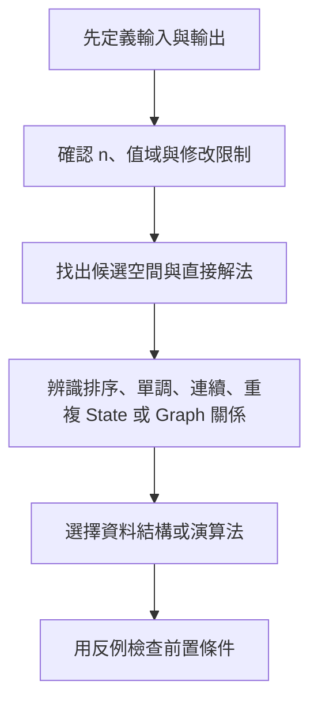

## 附錄 F　解法選擇速查表

### 適用範圍

本附錄用來快速產生排查方向，不取代題目分析。使用方式是先確認輸入、輸出與限制，再依可利用性質縮小候選方法。

### F.1 查找類問題

<table>
<tr><th>現象</th><th>可考慮</th><th>先確認</th></tr>
<tr><td>未排序資料找一個值</td><td>Linear Search、Hash Set</td><td>只查一次或多次</td></tr>
<tr><td>已排序資料查找</td><td>Binary Search</td><td>單調性與邊界語意</td></tr>
<tr><td>找 Pair</td><td>Hash Map、排序加 Two Pointers</td><td>是否需要原始 Index</td></tr>
<tr><td>反覆取最小或最大</td><td>Heap</td><td>資料是否動態變化</td></tr>
</table>

### F.2 區間類問題

<table>
<tr><th>需求</th><th>可考慮</th><th>先確認</th></tr>
<tr><td>合併重疊區間</td><td>依 Start 排序後掃描</td><td>開閉區間</td></tr>
<tr><td>選最多不衝突活動</td><td>依 End 排序的 Greedy</td><td>相接是否衝突</td></tr>
<tr><td>同時發生數量</td><td>Line Sweep、Min Heap</td><td>同時間事件順序</td></tr>
<tr><td>多次 Range Sum</td><td>Prefix Sum</td><td>是否有更新</td></tr>
<tr><td>Range Query 與 Update</td><td>Fenwick、Segment Tree</td><td>運算類型與更新型態</td></tr>
</table>

### F.3 順序與排程類問題

- 需要完整排序：`std::sort` 或 `std::stable_sort`。
- 只需 Top K：Heap 或 Selection 類方法。
- 有先後依賴：Topological Sort。
- 每次選局部最佳：先證明 Greedy 選擇不會破壞全域答案。

### F.4 Tree 類問題

<table>
<tr><th>需求</th><th>可考慮</th></tr>
<tr><td>走訪全部 Node</td><td>DFS、BFS</td></tr>
<tr><td>依層處理</td><td>BFS</td></tr>
<tr><td>Subtree 聚合</td><td>Postorder DFS、Tree DP</td></tr>
<tr><td>Ancestor、LCA</td><td>Parent、Binary Lifting 等</td></tr>
<tr><td>每個 Root 的答案</td><td>Rerooting</td></tr>
</table>

### F.5 Graph 類問題

<table>
<tr><th>需求</th><th>可考慮</th><th>前置條件</th></tr>
<tr><td>可達性、Component</td><td>DFS、BFS、DSU</td><td>是否需要實際 Path</td></tr>
<tr><td>最少 Edge 數</td><td>BFS</td><td>Edge Cost 相同</td></tr>
<tr><td>非負 Weighted 最短路</td><td>Dijkstra</td><td>Weight 非負</td></tr>
<tr><td>負 Edge</td><td>Bellman-Ford 等</td><td>負環語意</td></tr>
<tr><td>Directed 先後關係</td><td>Topological Sort</td><td>DAG</td></tr>
<tr><td>Undirected 連通合併</td><td>DSU</td><td>多為新增 Edge</td></tr>
</table>

### F.6 最佳化問題

先問：

- 是否有重複子問題與 Optimal Substructure？可考慮 DP。
- 局部選擇是否可證明安全？可考慮 Greedy。
- 答案空間是否具有單調性？可考慮 Binary Search on Answer。
- n 很小但需枚舉集合？可考慮 Bitmask DP。
- 只需要前 k 個候選？可考慮 Heap。

### F.7 字串問題

<table>
<tr><th>需求</th><th>可考慮</th></tr>
<tr><td>完整字串存在性</td><td>Hash Set</td></tr>
<tr><td>前綴查詢與 Autocomplete</td><td>Trie</td></tr>
<tr><td>單一 Pattern Matching</td><td>KMP、Z Algorithm</td></tr>
<tr><td>多 Pattern</td><td>Trie、Aho-Corasick</td></tr>
<tr><td>Palindrome</td><td>Two Pointers、DP、Manacher，依需求</td></tr>
</table>

### F.8 動態查詢問題

- 動態最小、最大：Heap、Balanced Tree。
- 動態 Connectivity，只新增 Edge：DSU。
- 動態 Prefix Sum：Fenwick Tree。
- 一般 Range Query 與 Update：Segment Tree。
- Sliding Window 內最大最小：Monotonic Deque。

### 使用前檢查表

- 我是否已定義真正的輸出需求？
- 我是否需要原始 Index 或順序？
- n 與值域允許哪種複雜度？
- 是否存在負數、重複值或空輸入？
- 方法的前置條件是否成立？
- 是否有小型反例能破壞目前想法？
