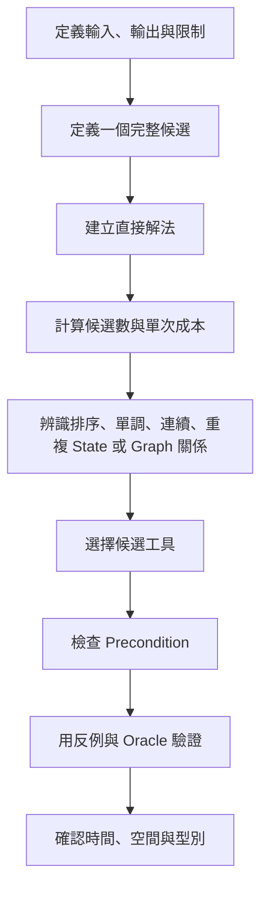
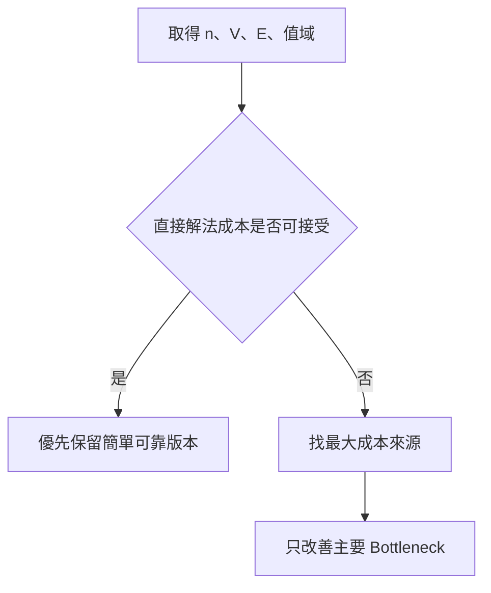
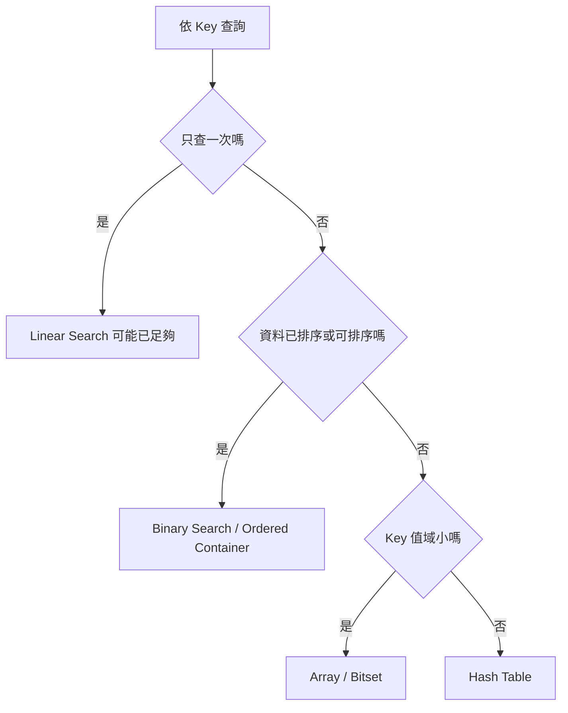
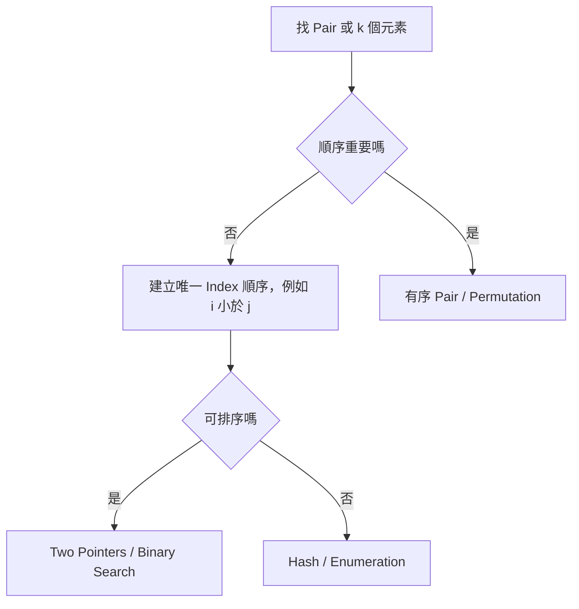
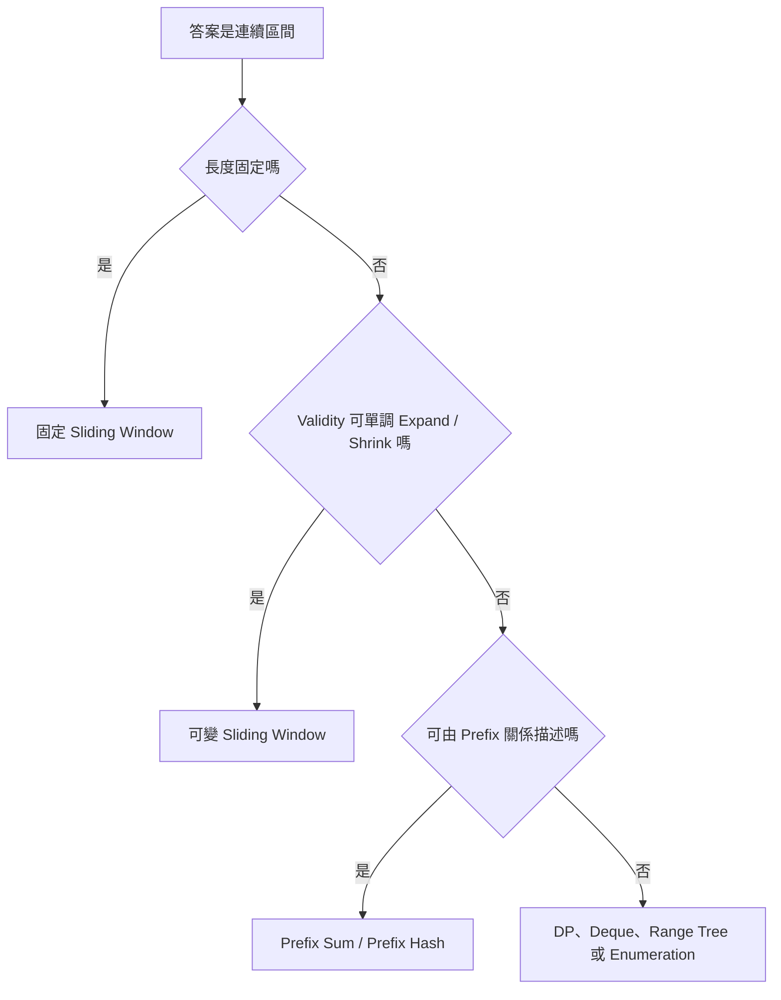
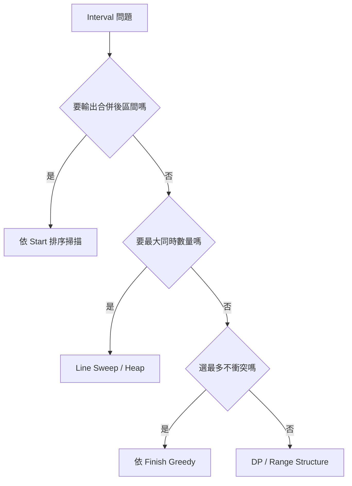
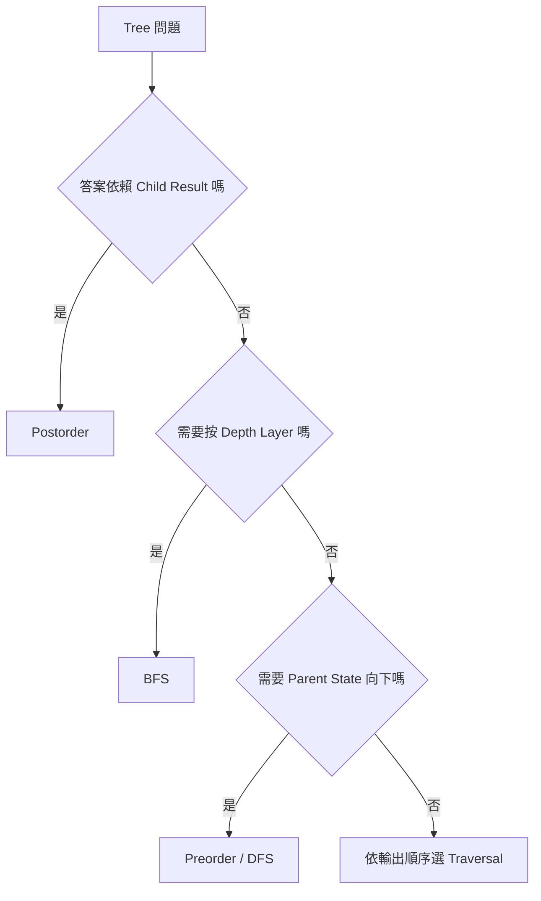
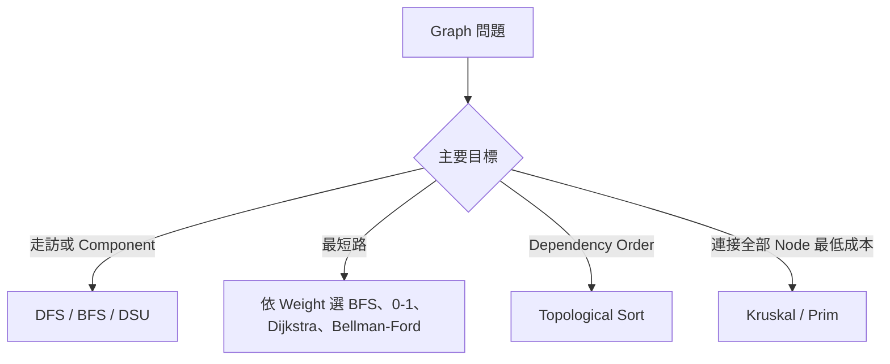

## 附錄 F　解法選擇速查表

### 適用範圍

本附錄提供一套由題目特徵縮小解法範圍的快速排查流程。它的用途不是看到關鍵字就套用演算法，而是協助依序確認：

- 真正的輸入、輸出與 Postcondition。
- 候選答案是元素、Pair、區間、Subset、Path，還是某個最佳值。
- 是否需要原始 Index、穩定順序、實際 Path 或全部答案。
- n、值域、更新次數與查詢次數允許什麼複雜度。
- 是否存在排序、單調性、連續性、重複 State、Graph 關係或局部最佳性。
- 候選方法的 Precondition 是否確實成立。

速查表只負責產生排查方向。最後仍需回到題目規格，寫出 State、Invariant、排除理由、終止性、複雜度與反例。

### 使用流程



### F.1 第一輪：先判斷答案結構

| 題目要求 | 先問 | 常見方向 |
|---|---|---|
| 是否存在 | 是否只需 Boolean，不需實際方案？ | Set、Search、DFS/BFS、DP Boolean State |
| 出現次數 | 是 Value Frequency、Path Count，還是方案數？ | Frequency Map、Counting DP、Prefix Hash |
| 最佳值 | 最大、最小、最短、最少步數的候選是什麼？ | Greedy、DP、Shortest Path、Binary Search on Answer |
| 實際方案 | 是否需要 Index、Parent、Decision 或完整 Path？ | Parent Array、Reconstruction、保存原 Index |
| 全部答案 | 輸出大小是否已是指數級？是否需去重？ | Backtracking、Enumeration、Output-sensitive 分析 |
| 第 k 個 | 是按 Value、不同值，還是包含重複的排名？ | Heap、Quick Select、Binary Search、Order Statistic |

若只需最佳值，通常不必保留完整方案。若需要實際方案，空間改善可能丟失 Reconstruction 所需資訊。

### F.2 由輸入規模過濾方法

以下只作量級判讀，實際可行性仍受常數、語言、記憶體與時間限制影響。

| 規模特徵 | 需要警覺的成本 | 可優先調查 |
|---|---|---|
| n 約 10^5 或更大 | O(n²) 通常過高 | O(n)、O(n log n)、攤銷分析 |
| n 約 10^3 | O(n²) 可能可行 | 二維 DP、Pair Enumeration |
| n 約 20 | 2^n 可能可行 | Bitmask、Subset DP、Meet-in-the-middle |
| n 約 10 | n! 仍需評估 | Permutation、Backtracking、Pruning |
| V、E 很大且 Sparse | O(V²) 不理想 | Adjacency List、O(V+E) 走訪 |
| 值域小但 n 大 | 依值域建立 Array 可能有效 | Counting、Frequency Array、Bitset |



### F.3 查找、Membership 與 Frequency

| 需求 | 可考慮 | 先確認 |
|---|---|---|
| 未排序資料只查一次 | Linear Search | O(n) 是否已足夠 |
| 未排序資料反覆查詢 | Hash Set / Map | 平均複雜度、記憶體、Hash Key |
| 已排序資料查找 | Binary Search | Lower、Upper、Exact 的 Postcondition |
| 小型固定值域 | Array / Bitset | Value 可否安全映射成 Index |
| 需要 Key 排序 | `std::set` / `std::map` | O(log n)、Range Query、最小最大 Key |
| Frequency | Hash Map / Array | Key 值域、輸出順序 |
| First / Last Index | Map | 重複 Key 更新政策 |
| 查詢是否存在且不能插入 | `find` / `contains` | 避免 `operator[]` 無意插入 |



Hash Table 的 Key 與 Value 應用一句話定義，例如：

```text
Key   = 已處理過的 Value
Value = 該 Value 的先前 Index
```

### F.4 Pair 與多元素組合

#### Two Sum 類

- 未排序且需原始 Index：Hash Map。
- 可排序且只需存在性或 Value Pair：Sorting + Two Pointers。
- n 小、需可靠基準：O(n²) Pair Enumeration。
- 需要全部唯一 Pair：排序、Two Pointers 與重複值政策。

#### Three Sum / Four Sum 類

- 固定部分元素，把剩餘問題降成 Two Sum。
- Meet-in-the-middle 可把四重枚舉拆成兩組 Pair Sum。
- 需分析輸出去重按 Value 還是 Index。



### F.5 連續區間、Subarray 與 Substring

| 需求 | 可考慮 | 必要檢查 |
|---|---|---|
| 固定長度 Window | Sliding Window | Enter、Leave State 是否 O(1) 更新 |
| 最長合法 Window | Variable Sliding Window | Shrink 後 Validity 是否單調恢復 |
| 最短滿足條件 Window | Sliding Window | Expand、Shrink 對條件是否單調 |
| 多次靜態 Range Sum | Prefix Sum | 區間採 `[left,right)` |
| Sum 等於 k，可含負數 | Prefix Sum + Hash | Prefix Frequency 與先查再插 |
| Window Maximum / Minimum | Monotonic Deque | Front 過期、Back 支配 |
| 所有區間都要評估 | Enumeration / DP | O(n²) 候選與單次成本 |
| 動態 Range Query | Fenwick / Segment Tree | Update、Query 類型 |



含負數不會讓所有 Window 都失效。固定長度 Window 仍可使用；失效的是依 Sum 單調性決定 Left 的特定可變 Window。

### F.6 Interval 與排程

| 需求 | 可考慮 | 先確認 |
|---|---|---|
| 合併重疊 Interval | 依 Start 排序後掃描 | Closed 或 Half-open、相接是否合併 |
| 選最多不衝突活動 | 依 Finish 排序的 Greedy | Exchange Argument、相接是否衝突 |
| 最少 Meeting Room | Line Sweep / Min-heap | 同時間 End 與 Start 的順序 |
| 最大同時發生數 | Line Sweep / Difference Event | 同座標 Group |
| Interval Union Length | Event Sweep | 先計上一段再更新 Event |
| 動態新增、查詢重疊 | Ordered Structure / Segment Tree | 座標值域與 Update 型態 |



### F.7 排序、單調性與 Binary Search

可考慮 Binary Search 的情況：

- 已排序 Array 的 Exact、Lower、Upper Bound。
- Predicate 呈 `false...false true...true`。
- 答案空間可定義 `feasible(x)`，而且具有單調性。

不可只因答案是數字或範圍很大就使用 Binary Search。

Two Pointers 需要 Pointer 移動能安全排除候選。Greedy 需要局部選擇的證明。排序可能破壞原始 Index、穩定性與 Subarray 連續性。

### F.8 Stack、Queue、Deque 與 Heap

| State 處理順序 | 工具 |
|---|---|
| 最近建立、最先完成 | Stack |
| 最早到達、先處理 | Queue |
| 兩端有不同移除規則 | Deque |
| 依最小或最大 Priority | Heap / Priority Queue |

常見配對：

- 括號、Expression、DFS Frame：Stack。
- BFS Layer、事件到達順序：Queue。
- Sliding Window Maximum、0-1 BFS：Deque。
- Top K、Dijkstra、Prim、動態極值：Heap。

Heap 只保證 Top，不代表整個容器已排序。Heap 中可能有 Stale Entry，需在 Pop 時驗證。

### F.9 Tree 類問題

| 需求 | 可考慮 | State 語意 |
|---|---|---|
| 走訪全部 Node | DFS / BFS | Node 或 Frame |
| 依層處理 | BFS | Queue 中待展開 Node |
| Subtree 聚合 | Postorder DFS / Tree DP | Child Result 向上組合 |
| Root 到 Node Path | Preorder / DFS | 向下傳遞 Path State |
| Height、Balance、Diameter | Postorder | Height 與全域答案分離 |
| BST Search / Range | 利用 Key 排序 | 候選 Subtree |
| Ancestor / LCA | Parent、DFS、Binary Lifting | Node Identity 與 Depth |
| 每個 Root 的答案 | Rerooting DP | Down State 與 Up State |



Tree 遞迴的空間需包含 O(h) Call Stack，鏈狀 Tree 的 h 可達 n。

### F.10 Graph 類問題

先確認：Directed / Undirected、Weighted / Unweighted、V、E、是否有負 Weight、是否要 Path。

| 需求 | 可考慮 | Precondition |
|---|---|---|
| Reachability | DFS / BFS | Visited State 完整 |
| Connected Component | DFS / BFS | Undirected 或明確連通定義 |
| 動態合併連通 | DSU | 主要是新增與同組查詢 |
| 最少 Edge 數 | BFS | 每條 Edge Cost 相同 |
| Weight 0/1 | 0-1 BFS | Weight 只含 0、1 |
| 非負 Weighted Shortest Path | Dijkstra | 所有 Weight 非負 |
| 可含負 Edge | Bellman-Ford 等 | Negative Cycle 政策 |
| All-pairs Shortest Path | Floyd-Warshall | V 較小、O(V³) 可接受 |
| Directed Dependency | Topological Sort | 完整順序要求 DAG |
| Undirected 全域最低連接成本 | MST | Connected 或 Forest 政策 |



### F.11 Dynamic Programming

可考慮 DP 的訊號：

- 相同 State 由多條路徑重複到達。
- 最佳解可由較小 Subproblem 組成。
- State 數量有限且可估算。
- Transition 可由已完成 State 計算。

固定流程：

```text
State → Transition → Base Case → Order → Answer → Reconstruction
```

常見分類：

| 題型 | 常見 State |
|---|---|
| 一維序列 | 前 i 個元素的最佳值 |
| Grid | 到 `(r,c)` 的方法數或成本 |
| 0/1 Knapsack | 前 i 個 Item、容量 c |
| LIS | 以 i 結尾的最佳長度 |
| LCS / Edit Distance | 兩個 Prefix `(i,j)` |
| Interval DP | 區間 `[l,r)` 的答案 |
| Tree DP | 以 Node 為 Root 的 Subtree State |
| Bitmask DP | 已選集合 Mask 加其他必要 State |

一維空間改善前，先寫出更新前後每個 Cell 代表哪一列。走訪方向會影響是否重複使用 State。

### F.12 Greedy、完整搜尋與剪枝

Greedy 需要：

- Greedy Choice Property。
- Exchange Argument、Stay-ahead 或其他證明。
- 明確 Precondition。

若無法證明，優先保留 Enumeration、Backtracking 或 DP。

剪枝必須能排除整棵 Subtree，而不是只覺得「看起來不會更好」。非負、排序與上界估計等條件需明確記錄。

### F.13 字串問題

| 需求 | 可考慮 | 先確認 |
|---|---|---|
| 完整字串 Membership | Hash Set | Unicode 正規化、Case Policy |
| Prefix Query / Autocomplete | Trie | Alphabet、Node 空間 |
| 單一 Pattern Matching | KMP、Z Algorithm | Pattern / Text 邊界 |
| 多 Pattern | Trie、Aho-Corasick | 總 Pattern 長度 |
| Palindrome 判斷 | Two Pointers | 比較單位與正規化 |
| 最長 Palindrome | Expand、DP、Manacher | 只需長度或實際區間 |
| Subsequence 關係 | Two Pointers / DP | 是否單次或多次查詢 |
| Edit / LCS | 二維 DP | Byte、Code Point、Grapheme |

`std::string` 是 Byte 序列。若需求對應使用者看見的字形，不能自動假設每個 Byte 是一個字元。

### F.14 動態查詢與 Range Structure

| 需求 | 可考慮 |
|---|---|
| 靜態 Range Sum | Prefix Sum |
| 靜態 Min/Max，無 Update | Sparse Table |
| Point Update + Prefix Sum | Fenwick Tree |
| Point Update + 一般 Range Query | Segment Tree |
| Range Update + Range Query | Lazy Segment Tree |
| 批次 Range Add，最後一次輸出 | Difference Array |
| Sliding Window Max/Min | Monotonic Deque |
| 動態 Ordered Key | Balanced Tree / Ordered Map |

選擇時要定義 Merge、Identity、Update 與 Query 是否可逆、是否交換，以及資料是否離線處理。

### F.15 幾何、事件與巨大座標

- 一維 Interval Event：Line Sweep。
- 大量稀疏座標：Coordinate Compression。
- Sweep 一維、維護另一維 Count：Fenwick Tree。
- Sweep 一維、維護另一維 Cover Length：Segment Tree。
- Rectangle Union Area：x Event + y Compression + Lazy Segment Tree。

Compression 只保留順序，不保留距離。Length 與 Area 必須使用原座標差。

### F.16 常見誤判

| 誤判 | 應重新確認 |
|---|---|
| 有兩個 Index 就是 Two Pointers | Pointer 移動是否安全排除候選 |
| 有 Left、Right 就是 Sliding Window | 是否維護連續 Window State |
| 有「最短」就用 BFS | Edge Cost 是否全部相同 |
| 有「區間」就用 Prefix Sum | Query 是否靜態、Operation 是否可抵消 |
| 有最佳化就用 Greedy | 是否能證明局部選擇安全 |
| 有重複工作就一定用 DP | State 是否有限且完整 |
| 有排序資料就一定 Binary Search | 是否要找單調分界 |
| 有 Tree 就一定遞迴 | 深度、Frame State 與 Stack Risk |
| 有更新就 Segment Tree | Fenwick、Difference 或簡單重建是否足夠 |

### F.17 最終驗證清單

- 我能用一句話定義答案與每個主要 State。
- 我知道方法最關鍵的 Precondition。
- 我能提供一個違反 Precondition 的反例。
- 我能說明每次移動、Pop、Relax、Merge 或剪枝的理由。
- 我確認空輸入、重複值、負數與極端值。
- 我把排序、Hash、Heap、Call Stack 與輸出成本計入複雜度。
- 我確認型別、Infinity、Sentinel 與 Index 安全。
- 我保留小型 Brute Force 或其他 Oracle 進行對拍。

### F.18 本附錄重點

- 先定義答案，再依連續性、排序、單調性、Graph 關係與重複 State 選擇工具。
- 輸入規模先排除不可行複雜度，但不能單靠 n 決定演算法。
- 相同關鍵字可能對應不同問題，例如最短 Edge 數、最低成本與 MST。
- 資料結構名稱不是正確性證明，必須定義 State、Invariant 與更新語意。
- 每個候選方法都要檢查 Precondition、反例、時間、空間與型別。
- 無法判斷時，先建立可靠 Brute Force，標出重複工作，再逐步改善。
