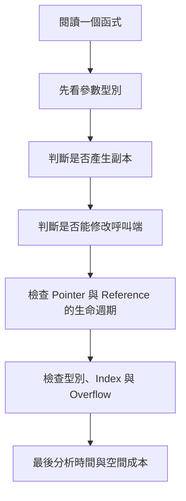
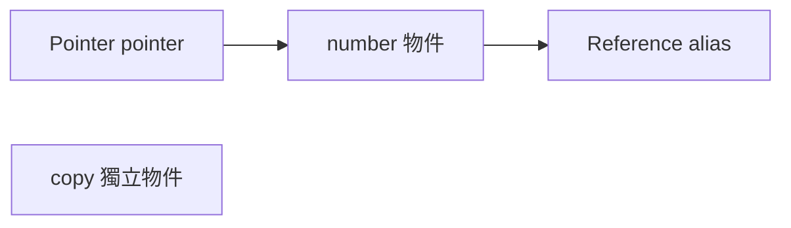
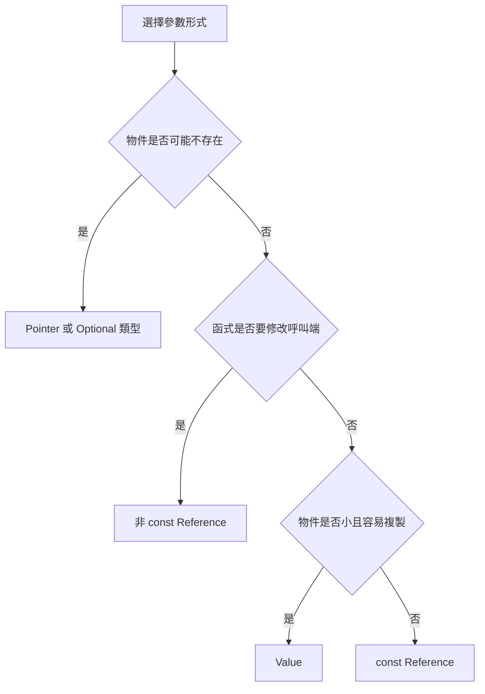
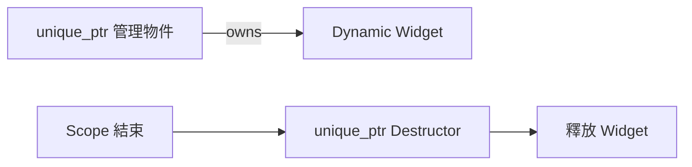
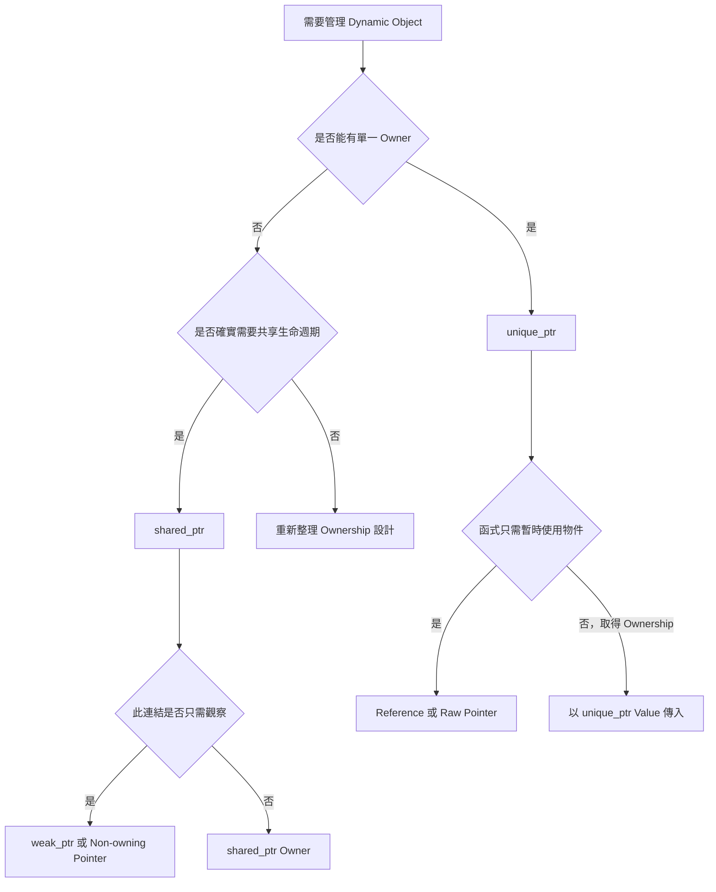

## 附錄 G　C++ 演算法基礎

### 適用範圍

本附錄整理閱讀與撰寫 C++ 演算法程式時會反覆使用的語言觀念。目標不是完整介紹 C++，而是回答下列實作問題：

- 函式收到的是副本，還是原物件的別名？
- 函式是否可以修改呼叫端資料？
- Pointer、Reference 與 Object 的生命週期有什麼關係？
- `std::vector` 為什麼有時會讓 Iterator、Pointer 與 Reference 失效？
- `int`、`long long`、`size_t` 混用時，為什麼結果可能和預期不同？
- Recursive DFS 使用的 Stack，和 `std::stack` 是否為同一個東西？
- 演算法的空間複雜度應如何計入容器、動態配置與 Call Stack？

很多錯誤不是演算法方向不正確，而是函式介面、資料 Ownership、型別或生命週期沒有先整理清楚。本附錄會使用小型程式逐步說明，並建立一套閱讀 C++ 演算法程式的固定流程。



### 適用讀者

- 能看懂基本 C++ 語法，但不熟悉 Value、Reference、Pointer 差異的讀者。
- 常因為函式沒有修改到原資料，或意外修改原資料而困惑的讀者。
- 使用 TreeNode、ListNode、Iterator 或 Smart Pointer 時，容易混淆 Ownership 的讀者。
- 常遇到 `size_t`、signed、unsigned、Overflow 與反向迴圈問題的讀者。
- 想從函式宣告判斷複製成本與副作用的讀者。

### 快速導覽

- [G.1 先從一段函式宣告看起](#g1-先從一段函式宣告看起)
- [G.2 Value、Reference 與 Pointer](#g2-valuereference-與-pointer)
- [G.3 Call by Value](#g3-call-by-value)
- [G.4 Call by Reference](#g4-call-by-reference)
- [G.5 const Reference](#g5-const-reference)
- [G.6 Pointer Parameter](#g6-pointer-parameter)
- [G.7 Pointer 本身與 Pointer 指向的物件](#g7-pointer-本身與-pointer-指向的物件)
- [G.8 參數傳遞如何選擇](#g8-參數傳遞如何選擇)
- [G.9 Object Lifetime](#g9-object-lifetime)
- [G.10 Stack Memory、Dynamic Storage 與 Call Stack](#g10-stack-memorydynamic-storage-與-call-stack)
- [G.11 Stack Container 與 Call Stack](#g11-stack-container-與-call-stack)
- [G.12 RAII 與 Smart Pointer](#g12-raii-與-smart-pointer)
- [G.13 常見 STL 傳遞方式](#g13-常見-stl-傳遞方式)
- [G.14 Iterator、Pointer 與 Reference 失效](#g14-iteratorpointer-與-reference-失效)
- [G.15 int、long long 與 Integer Overflow](#g15-intlong-long-與-integer-overflow)
- [G.16 size_t、signed 與 unsigned](#g16-size_tsigned-與-unsigned)
- [G.17 Integer Promotion 與運算順序](#g17-integer-promotion-與運算順序)
- [G.18 常見 C++ 演算法介面模式](#g18-常見-c-演算法介面模式)
- [G.19 常見問題與判讀](#g19-常見問題與判讀)
- [G.20 程式閱讀檢查表](#g20-程式閱讀檢查表)
- [G.21 本附錄重點](#g21-本附錄重點)

### G.1 先從一段函式宣告看起

看到函式時，不要先跳進函式內容。先看參數與回傳型別：

```cpp
long long rangeSum(
    const std::vector<int>& values,
    int left,
    int right);
```

這段宣告已經提供很多資訊：

<table>
<tr><th>部分</th><th>可以讀出的資訊</th></tr>
<tr><td>`long long`</td><td>答案可能超過 int 可保存範圍</td></tr>
<tr><td>`const std::vector<int>&`</td><td>不複製整個 vector，而且函式承諾不修改它</td></tr>
<tr><td>`int left`</td><td>left 以 Value 傳入，函式內修改 left 不影響呼叫端</td></tr>
<tr><td>`int right`</td><td>right 同樣是獨立副本</td></tr>
</table>

接著才檢查：

- 區間是 `[left, right]` 還是 `[left, right)`？
- 空區間如何表示？
- left 與 right 是否可能越界？
- 加總前是否需要轉成 `long long`？

函式宣告是程式規格的一部分，不只是語法外殼。

### G.2 Value、Reference 與 Pointer

先用一個整數觀察三者：

```cpp
int number = 10;
int copy = number;
int& alias = number;
int* pointer = &number;
```

此時：

- `copy` 是獨立整數，初始值從 number 複製而來。
- `alias` 是 number 的別名。
- `pointer` 保存 number 的位址。

```cpp
copy = 20;      // number 仍是 10
alias = 30;     // number 變成 30
*pointer = 40;  // number 變成 40
```



Reference 與 Pointer 都能間接接觸原物件，但語意不同：

<table>
<tr><th>項目</th><th>Reference</th><th>Pointer</th></tr>
<tr><td>是否可為空</td><td>正常使用下不可</td><td>可以是 `nullptr`</td></tr>
<tr><td>是否可重新指向</td><td>綁定後不能改綁其他物件</td><td>可以改存其他位址</td></tr>
<tr><td>使用方式</td><td>像一般物件</td><td>需解參考或使用 `->`</td></tr>
<tr><td>常見語意</td><td>必須存在的別名</td><td>可選物件、節點連結、位址關係</td></tr>
</table>

### G.3 Call by Value

Call by Value 會讓函式參數成為獨立物件。

```cpp
void increment(int value)
{
    ++value;
}

int main()
{
    int number = 5;
    increment(number);
    // number 仍是 5
}
```

#### vector 以 Value 傳入

```cpp
void sortCopy(std::vector<int> values)
{
    std::sort(values.begin(), values.end());
}
```

這會建立一份 vector 副本。排序只影響副本，呼叫端不變。

這不一定是錯誤。若函式本來就要產生修改後的副本，可以利用 Value 語意：

```cpp
std::vector<int> sortedCopy(std::vector<int> values)
{
    std::sort(values.begin(), values.end());
    return values;
}
```

呼叫：

```cpp
std::vector<int> sorted = sortedCopy(original);
```

如果傳入 lvalue `original`，通常需要複製。如果傳入可移動的暫時物件，編譯器與標準函式庫可能使用 Move，降低複製成本。

#### 何時適合 Value

- `int`、`char`、`bool`、Enum 等小型型別。
- 小型且容易複製的 Struct。
- 函式需要一份獨立副本。
- 函式預計取得 Ownership 或修改本地副本。

### G.4 Call by Reference

非 const Reference 可修改呼叫端物件。

```cpp
void normalize(std::vector<int>& values)
{
    for (int& value : values)
    {
        if (value < 0)
        {
            value = 0;
        }
    }
}
```

這裡有兩層 Reference：

- `values` 是呼叫端 vector 的 Reference。
- `int& value` 是 vector 中每個元素的 Reference。

如果 Range-based for 寫成：

```cpp
for (int value : values)
```

`value` 是每個元素的副本，修改它不會改到 vector。

#### Reference 作為輸出參數

```cpp
bool findMinimum(
    const std::vector<int>& values,
    int& result)
{
    if (values.empty())
    {
        return false;
    }

    result = *std::min_element(values.begin(), values.end());
    return true;
}
```

這種介面用 bool 表示是否找到答案，再透過 `result` 輸出。若專案可使用 `std::optional<int>`，通常能讓「可能沒有答案」更直接。

### G.5 const Reference

`const T&` 表示：

- 不複製整個物件。
- 函式不能透過這個 Reference 修改物件。

```cpp
long long sum(const std::vector<int>& values)
{
    long long answer = 0;

    for (int value : values)
    {
        answer += value;
    }

    return answer;
}
```

這是唯讀大型容器常見的參數形式。

#### const 不代表原物件永遠不會改

`const Reference` 只表示「不能透過這個介面修改」。如果其他地方仍持有非 const Reference 或 Pointer，原物件可能被其他路徑修改。

#### 不要回傳區域物件的 const Reference

```cpp
const std::string& badName()
{
    std::string name = "David";
    return name; // 錯誤：函式返回後 name 已失效
}
```

`const` 不會延長已命名區域物件的生命週期。

### G.6 Pointer Parameter

Pointer 適合表示：

- 參數可能不存在。
- Tree 或 Linked List 的節點連結。
- 需要直接處理位址。
- 與既有 C 介面互動。

```cpp
int treeHeight(const TreeNode* node)
{
    if (node == nullptr)
    {
        return 0;
    }

    return 1 + std::max(
        treeHeight(node->left),
        treeHeight(node->right));
}
```

`const TreeNode*` 表示不能透過 node 修改 TreeNode。Pointer 本身仍是區域副本，可以在函式內重新指向其他節點。

#### `T* const` 與 `const T*`

```cpp
const TreeNode* node;
```

Pointer 可改指向，但不能透過它修改 Node。

```cpp
TreeNode* const node = root;
```

Pointer 不能改指向，但可透過它修改 Node。

```cpp
const TreeNode* const node = root;
```

Pointer 不能改指向，也不能透過它修改 Node。

讀型別時可以從變數名稱往外看，並搭配實際修改權限驗證。

### G.7 Pointer 本身與 Pointer 指向的物件

以下函式不會改變呼叫端 Pointer 的指向：

```cpp
void moveToNext(ListNode* node)
{
    if (node != nullptr)
    {
        node = node->next;
    }
}
```

因為 node 本身以 Value 傳入，是一份位址副本。

但它可以修改指向的物件：

```cpp
void clearValue(ListNode* node)
{
    if (node != nullptr)
    {
        node->value = 0;
    }
}
```

若要修改呼叫端 Pointer，可以使用 Pointer Reference：

```cpp
void moveToNext(ListNode*& node)
{
    if (node != nullptr)
    {
        node = node->next;
    }
}
```

需要先區分：

```text
修改 Pointer 變數本身
修改 Pointer 指向的物件
```

這兩件事不同。

### G.8 參數傳遞如何選擇



這是一般起點，不是不可改變的規則。還要考慮：

- 函式是否要取得 Ownership。
- 是否要保存參數到函式外。
- 是否接受 Temporary Object。
- API 是否需要表達 null。
- 複製或 Move 成本。

### G.9 Object Lifetime

Pointer 與 Reference 本身不保證物件仍存在。

#### 回傳區域變數位址

```cpp
int* badPointer()
{
    int value = 10;
    return &value;
}
```

函式返回後，value 的生命週期結束，回傳 Pointer 變成 Dangling Pointer。

#### 保存 vector 元素位址後再 push_back

```cpp
std::vector<int> values{1, 2, 3};
int* first = &values[0];
values.push_back(4);
```

若 push_back 觸發重新配置，`first` 可能失效。

#### Reference 捕捉與 Lambda

若 Lambda 保存區域變數的 Reference，Lambda 被帶到區域外使用時，要確認被捕捉物件仍存在。

演算法題雖少見長生命週期 Callback，但理解此規則有助於避免隱性 Dangling Reference。

### G.10 Stack Memory、Dynamic Storage 與 Call Stack

「Stack」在 C++ 學習中常指不同概念：

- 區域變數常具有 Automatic Storage Duration。
- 函式呼叫使用 Call Stack。
- `std::stack` 是容器介面。

動態配置的物件通常具有 Dynamic Storage Duration：

```cpp
TreeNode* node = new TreeNode();
delete node;
```

直接使用 `new`、`delete` 容易產生漏釋放、重複釋放與例外安全問題。在具有 Ownership 的一般 C++ 程式中，應優先考慮 RAII 與 Smart Pointer。

#### Recursive Algorithm 的空間

```cpp
int factorial(int n)
{
    if (n == 0)
    {
        return 1;
    }

    return n * factorial(n - 1);
}
```

最大遞迴深度為 O(n)，因此額外空間也要列入 O(n)，即使沒有建立任何 STL 容器。

### G.11 Stack Container 與 Call Stack

`std::stack<int>` 是由程式明確控制的容器：

```cpp
std::stack<int> pending;
pending.push(0);
int node = pending.top();
pending.pop();
```

Call Stack 由函式呼叫機制維護。Recursive DFS 使用 Call Stack 保存返回位置，Iterative DFS 使用 `std::stack` 保存待處理 Node。

兩者都呈現 LIFO，但來源、生命週期與可控制程度不同。

### G.12 RAII 與 Smart Pointer

RAII 是 **Resource Acquisition Is Initialization** 的縮寫，可譯為「資源取得即初始化」。名稱看起來強調「取得」，實際上更重要的是以下配對：

```text
物件建構時取得資源
物件解構時釋放資源
```

RAII 的目標不是只處理 Dynamic Memory。任何需要成對取得與歸還的資源，都可以使用相同模型：

- Dynamic Memory：`new` 與 `delete`。
- Dynamic Array：`new[]` 與 `delete[]`。
- File：開啟與關閉。
- Mutex：上鎖與解鎖。
- Socket、Database Connection、Thread Handle 等系統資源。
- 暫時修改後必須恢復的程式狀態。

#### G.12.1 先區分 Object 與 Resource

Object 是 C++ 語言中的物件；Resource 是程式必須在適當時機歸還的東西。物件可以負責管理資源，但兩者不是同義詞。

以下程式建立一個 Dynamic Object：

```cpp
Widget* widget = new Widget();
```

這裡有兩個不同項目：

- `widget` 是一個 Raw Pointer 物件，通常位於目前 Scope。
- `new Widget()` 建立的 `Widget` 位於 Dynamic Storage，生命週期不會因 `widget` 離開 Scope 而自動結束。

因此，只讓 Pointer 離開 Scope 並不會釋放 `Widget`：

```cpp
void process() {
    Widget* widget = new Widget();
} // widget 消失，但 Dynamic Widget 仍未釋放
```

這會造成 Memory Leak。Raw Pointer 只保存位址，本身沒有「離開 Scope 時呼叫 `delete`」的責任。

RAII 的做法是把 Resource 放進一個管理物件：

```cpp
void process() {
    auto widget = std::make_unique<Widget>();
} // widget 解構，所管理的 Widget 自動釋放
```

此時 `std::unique_ptr<Widget>` 是管理物件，Dynamic `Widget` 是它擁有的資源。



#### G.12.2 為什麼手動清理容易漏掉

考慮一個需要配置物件的函式：

```cpp
void process(bool stopEarly) {
    Widget* widget = new Widget();

    if (stopEarly) {
        return; // 忘記 delete
    }

    use(*widget);
    delete widget;
}
```

正常走到函式尾端時會執行 `delete`，但 Early Return 會略過清理。

加入 Exception 後，控制流程更難完整列舉：

```cpp
void process() {
    Widget* widget = new Widget();
    use(*widget); // 可能丟出 Exception
    delete widget;
}
```

若 `use()` 丟出 Exception，最後一行不會執行。程式需要在每一條離開路徑都正確清理，包含：

- 正常抵達函式尾端。
- 任一個 Early Return。
- 中途的 Exception。
- 未來維護時新增的條件分支。

RAII 將這些路徑統一成「Scope 結束時執行區域物件的 Destructor」：

```cpp
void process(bool stopEarly) {
    auto widget = std::make_unique<Widget>();

    if (stopEarly) {
        return;
    }

    use(*widget);
} // 不必手動 delete
```

無論是正常返回、Early Return，或 Exception 展開 Stack，已完成建構的區域物件都會依規則解構。

#### G.12.3 Destructor 是 RAII 的釋放入口

自訂型別可以在 Constructor 取得資源，在 Destructor 歸還資源：

```cpp
class IntBuffer {
public:
    explicit IntBuffer(std::size_t size)
        : data_(new int[size]), size_(size) {
    }

    ~IntBuffer() {
        delete[] data_;
    }

private:
    int* data_;
    std::size_t size_;
};
```

使用方式：

```cpp
void calculate() {
    IntBuffer buffer(1000);
    // 使用 buffer
} // 自動呼叫 buffer.~IntBuffer()
```

這已展現 RAII 的核心，但這個類別仍不完整。編譯器產生的預設 Copy 會只複製 `data_` 位址：

```cpp
IntBuffer a(1000);
IntBuffer b = a; // 若允許淺層 Copy，兩者可能持有同一個位址
```

`a` 與 `b` 解構時可能對同一位址執行兩次 `delete[]`。因此，擁有資源的型別必須同時思考 Copy 與 Move 語意，不能只寫 Destructor。

對 Dynamic Array，通常直接使用標準容器更安全：

```cpp
class IntBuffer {
public:
    explicit IntBuffer(std::size_t size)
        : data_(size) {
    }

private:
    std::vector<int> data_;
};
```

`std::vector` 已封裝配置、釋放、Copy 與 Move。這種「由已完成 RAII 的型別組成自己的類別」通常稱為 **Rule of Zero**：自己的類別不必直接撰寫 Destructor、Copy Constructor 或 Move Constructor。

#### G.12.4 Scope 與解構順序

區域物件通常在離開所在 Scope 時解構。已完成建構的區域物件，會依建構的相反順序解構：

```cpp
void example() {
    Resource first;
    Resource second;
} // 先解構 second，再解構 first
```

巢狀 Scope 可以縮短資源持有時間：

```cpp
void example() {
    prepare();

    {
        std::lock_guard<std::mutex> lock(mutex);
        updateSharedState();
    } // 鎖在這裡解除，而不是等到整個函式結束

    continueWithoutLock();
}
```

RAII 不只避免忘記釋放，也能讓「資源應持有多久」由 Scope 清楚表達。

需要注意，`std::exit()`、直接終止程序或嚴重執行環境錯誤，不一定會進行一般的 Stack Unwinding。RAII 保證建立在 C++ 正常 Scope 離開與 Exception 處理規則上，不代表所有程序終止方式都會執行每個區域 Destructor。

#### G.12.5 `unique_ptr`：單一 Ownership

`std::unique_ptr<T>` 表示目前只有一個 Owner 負責 `T` 的生命週期：

```cpp
#include <memory>

std::unique_ptr<Widget> widget = std::make_unique<Widget>();
```

通常可使用 `auto` 簡化：

```cpp
auto widget = std::make_unique<Widget>();
```

Ownership 關係可畫成：

```text
widget ── owns ──> Widget
```

`unique_ptr` 離開 Scope 時，會釋放所擁有的物件：

```cpp
void process() {
    auto widget = std::make_unique<Widget>();
    widget->run();
} // Widget 自動銷毀
```

##### 為什麼不能 Copy

若允許 Copy：

```cpp
std::unique_ptr<Widget> a = std::make_unique<Widget>();
std::unique_ptr<Widget> b = a; // 編譯錯誤
```

`a` 與 `b` 都會看起來像 Owner，違反「單一 Ownership」，也帶來重複釋放問題。因此 `unique_ptr` 禁止 Copy。

##### 可以 Move Ownership

```cpp
std::unique_ptr<Widget> a = std::make_unique<Widget>();
std::unique_ptr<Widget> b = std::move(a);
```

Move 後：

```text
移動前：a ── owns ──> Widget
移動後：a = null，b ── owns ──> Widget
```

標準保證 Move 後來源 `unique_ptr` 為空，可用布林判斷：

```cpp
if (a == nullptr) {
    // a 已不再擁有 Widget
}
```

`std::move(a)` 本身不會搬動 `Widget`。它把 `a` 轉成可供 Move 的表達式，接著 `unique_ptr` 的 Move Constructor 轉移內部位址與 Ownership。Dynamic `Widget` 通常仍位於原本的位置。

##### 暫時借用，不轉移 Ownership

若函式只需要使用 Widget，不應要求 Ownership：

```cpp
void inspect(const Widget& widget);
void modify(Widget& widget);
void inspectOptional(const Widget* widget);
```

呼叫：

```cpp
auto owner = std::make_unique<Widget>();
inspect(*owner);
modify(*owner);
inspectOptional(owner.get());
```

- `*owner` 取得所指物件的 Reference。
- `owner.get()` 取得 Raw Pointer，但 Ownership 仍在 `owner`。
- 不應對 `owner.get()` 的結果執行 `delete`。
- 借用端不能活得比 Owner 更久。

##### 交出與接回 Raw Pointer

`release()` 會放棄 Ownership 並回傳 Raw Pointer：

```cpp
Widget* raw = owner.release();
```

此後 `owner` 為空，呼叫端必須重新安排 Owner，否則容易 Leak：

```cpp
std::unique_ptr<Widget> ownerAgain(raw);
```

`reset()` 則會釋放目前物件，並可接管另一個位址：

```cpp
owner.reset();                    // 釋放目前物件，變成空
owner.reset(new Widget());        // 接管新物件
```

一般建立物件時仍優先使用 `std::make_unique`，`release()` 與直接接管 Raw Pointer 應保留給確實需要轉接舊介面的地方。

#### G.12.6 函式介面如何表達 Ownership

Smart Pointer 出現在參數或回傳型別時，應先讀它的 Ownership 語意。

##### 函式取得單一 Ownership

```cpp
void registerWidget(std::unique_ptr<Widget> widget);
```

呼叫端需要明確 Move：

```cpp
auto widget = std::make_unique<Widget>();
registerWidget(std::move(widget));
```

函式收到後負責該物件。呼叫完成後，原本的 `widget` 不再擁有它。

##### 函式建立並交出 Ownership

```cpp
std::unique_ptr<Widget> createWidget() {
    return std::make_unique<Widget>();
}
```

回傳 `unique_ptr` 表示呼叫端接收新物件的 Ownership：

```cpp
auto widget = createWidget();
```

##### 函式只借用物件

```cpp
void draw(const Widget& widget);  // 必須存在，只讀
void update(Widget& widget);      // 必須存在，可修改
void draw(const Widget* widget);  // 可以不存在，只讀
```

只借用時直接接收 Reference 或 Raw Pointer，通常比 `const std::unique_ptr<Widget>&` 更能表達真正需求，因為函式需要的是 `Widget`，不是特定 Owner 類型。

##### 不建議用 `unique_ptr&` 表示一般借用

```cpp
void update(std::unique_ptr<Widget>& widget);
```

這個介面表示函式需要接觸 Owner 本身，可能執行 `reset()` 或轉移其內容。若函式只修改 `Widget`，應改成：

```cpp
void update(Widget& widget);
```

#### G.12.7 `shared_ptr`：共享 Ownership

當多個物件確實需要共同延長同一資源生命週期時，可以使用 `std::shared_ptr<T>`：

```cpp
#include <memory>

auto first = std::make_shared<Widget>();
auto second = first;
```

概念上：

```text
first  ─┐
        ├── shared ownership ──> Widget
second ─┘
```

`shared_ptr` 維護共享 Ownership Count。複製 `shared_ptr` 會增加 Owner 數；Owner 銷毀或改指向時會減少。最後一個 Owner 離開後，所管理的物件才會銷毀。

```cpp
void example() {
    auto first = std::make_shared<Widget>(); // Owner 數 1

    {
        auto second = first;                 // Owner 數 2
    }                                        // 回到 1
}                                            // 回到 0，銷毀 Widget
```

`use_count()` 可用於觀察或 Debug，但通常不應作為同步控制或核心業務邏輯，因為其他 `shared_ptr` 可能隨時改變計數。

##### `shared_ptr` 不是「比較安全的普通 Pointer」

它有額外成本與語意：

- 需要維護 Control Block 與共享計數。
- Copy 會改變 Ownership 狀態。
- 生命週期可能延長到不易定位的時間點。
- 互相強連結可能形成 Ownership Cycle。
- 多執行緒下，Control Block 的計數管理安全，不代表被指物件本身可由多執行緒任意讀寫。

只有在需求確實是共享 Ownership 時才使用。若所有權可以明確交給一個 Owner，優先使用 `unique_ptr`。

#### G.12.8 `weak_ptr`：不延長生命週期的觀察者

`std::weak_ptr<T>` 觀察由 `shared_ptr` 管理的物件，但不增加 Shared Ownership Count。

```cpp
std::shared_ptr<Widget> owner = std::make_shared<Widget>();
std::weak_ptr<Widget> observer = owner;
```

`weak_ptr` 不能直接使用 `->`。使用前要嘗試取得暫時的 `shared_ptr`：

```cpp
if (std::shared_ptr<Widget> widget = observer.lock()) {
    widget->run();
} else {
    // 原物件已銷毀
}
```

`lock()` 成功時，回傳的 `shared_ptr` 會在目前 Scope 內暫時延長物件生命週期；失敗時回傳空 `shared_ptr`。

也可用 `expired()` 查詢，但若查詢後才使用，兩個動作之間的狀態可能改變。通常直接以 `lock()` 的結果作為使用依據較完整。

#### G.12.9 `shared_ptr` Cycle 為什麼不會自動釋放

假設兩個物件互相以 `shared_ptr` 持有：

```cpp
struct Person {
    std::shared_ptr<Person> partner;
};

void example() {
    auto a = std::make_shared<Person>();
    auto b = std::make_shared<Person>();

    a->partner = b;
    b->partner = a;
}
```

函式結束後，區域變數 `a` 與 `b` 消失，但兩個物件仍互相持有：

```text
Person A ── shared_ptr ──> Person B
Person B ── shared_ptr ──> Person A
```

每個物件的 Shared Ownership Count 都未降為 0，因此兩者都不會銷毀。

若其中一個方向只代表觀察或反向關係，應改用 `weak_ptr`：

```cpp
struct Person {
    std::weak_ptr<Person> partner;
};
```

更常見的 Tree 模型是：

```cpp
struct TreeNode {
    int value;
    std::vector<std::shared_ptr<TreeNode>> children;
    std::weak_ptr<TreeNode> parent;
};
```

- Parent 以 `shared_ptr` 擁有 Children。
- Child 的 `parent` 只觀察 Parent，不反向延長 Parent 生命週期。

是否使用 `shared_ptr` 仍取決於整體資料模型。若 Tree 有清楚的單一 Root Owner，也可能使用 `unique_ptr` 管理 Children，並以非擁有 Raw Pointer 表示 Parent。

#### G.12.10 Linked List 使用 `unique_ptr`

若 Singly Linked List 的 Ownership 規則是「List 擁有 Head，每個 Node 唯一擁有下一個 Node」，可以寫成：

```cpp
#include <memory>

struct OwnedListNode {
    int value;
    std::unique_ptr<OwnedListNode> next;
};
```

鏈結為：

```text
head owns Node A
Node A owns Node B
Node B owns Node C
Node C owns null
```

Head 也應由 `unique_ptr` 管理：

```cpp
auto head = std::make_unique<OwnedListNode>();
head->value = 1;
head->next = std::make_unique<OwnedListNode>();
head->next->value = 2;
```

當 `head` 銷毀時：

1. Node A 銷毀。
2. A 的成員 `next` 銷毀，進而銷毀 Node B。
3. B 的 `next` 再銷毀 Node C。

這讓整條 List 的釋放責任由型別表達，不需要手動逐 Node `delete`。

##### 反轉時必須轉移 Ownership

Raw Pointer 版本只改寫位址；`unique_ptr` 版本每次鏈結調整都涉及 Ownership Move：

```cpp
std::unique_ptr<OwnedListNode> reverseOwnedList(
    std::unique_ptr<OwnedListNode> head) {

    std::unique_ptr<OwnedListNode> previous = nullptr;

    while (head != nullptr) {
        std::unique_ptr<OwnedListNode> next = std::move(head->next);
        head->next = std::move(previous);
        previous = std::move(head);
        head = std::move(next);
    }

    return previous;
}
```

三個變數的 Ownership Invariant：

1. `previous` 唯一擁有已反轉 Prefix。
2. `head` 唯一擁有尚未處理 Suffix。
3. 兩段合起來恰好擁有全部原始 Node。
4. `next` 只在單輪中暫時接住剩餘 Suffix，避免 `head->next` 改寫後遺失。
5. 同一時間不會有兩個 `unique_ptr` 擁有同一個 Node。

逐輪觀察：

```text
初始：previous owns null，head owns 1 → 2 → 3
第 1 輪：previous owns 1，head owns 2 → 3
第 2 輪：previous owns 2 → 1，head owns 3
第 3 輪：previous owns 3 → 2 → 1，head owns null
```

##### 為什麼每一步都要 `std::move`

`unique_ptr` 不可 Copy。以下指派若使用 Copy，會讓兩個 Owner 同時指向同一 Node，因此編譯器禁止：

```cpp
previous = head; // 編譯錯誤
```

正確方式是轉移 Ownership：

```cpp
previous = std::move(head);
```

Move 完成後，來源 `head` 變成空，目的 `previous` 成為唯一 Owner。

##### 遞迴解構深度

單向 `unique_ptr` 鏈結的預設解構會沿 `next` 連續觸發 Destructor。非常長的 List 可能造成很深的解構呼叫鏈。若資料規模可能極大，可在 List 容器的 Destructor 中採用迭代方式逐一 Move 並銷毀 Head，避免深層遞迴解構：

```cpp
while (head != nullptr) {
    head = std::move(head->next);
}
```

實際設計時要把這段邏輯放在擁有 Head 的容器類別中，並確認成員解構順序與程式需求。

#### G.12.11 Algorithm Pointer 與 Ownership Pointer 分開看

同一個演算法中，可以同時存在：

- `unique_ptr`：表示 Owner。
- Raw Pointer：暫時觀察某個 Node。
- Reference：表示必須存在的借用。

例如，List 由 `unique_ptr` 擁有，但搜尋只需回傳觀察位置：

```cpp
OwnedListNode* findValue(
    OwnedListNode* head,
    int target) {

    while (head != nullptr) {
        if (head->value == target) {
            return head;
        }
        head = head->next.get();
    }

    return nullptr;
}
```

回傳 Raw Pointer 不代表呼叫端取得 Ownership。它只在原 List 仍存在，而且目標 Node 尚未被移除時有效。

這帶出重要原則：

```text
誰擁有物件，和目前用哪個 Pointer 走訪物件，是兩個不同問題。
```

Smart Pointer 主要表達 Ownership；Raw Pointer 與 Reference 仍適合表達 Non-owning Access。

#### G.12.12 RAII 與 Exception Safety

RAII 是 Exception Safety 的基礎，但「沒有 Resource Leak」不等於「整個動作具有完整交易語意」。常見保證可分成：

- No-throw Guarantee：動作承諾不丟出 Exception。
- Strong Guarantee：失敗時，外部可觀察狀態維持原狀。
- Basic Guarantee：失敗時物件仍有效且不漏資源，但內容可能已部分改變。

例如，以區域 RAII 物件先建立新結果，成功後再交換，可以降低部分更新風險：

```cpp
void replaceValues(std::vector<int>& values) {
    std::vector<int> replacement = buildReplacement();
    values.swap(replacement);
}
```

若 `buildReplacement()` 失敗，原本 `values` 尚未修改；區域 `replacement` 已配置的資源也會由 `vector` 自動清理。

在演算法題中不一定需要逐一標記 Exception Guarantee，但應理解 RAII 解決的是資源生命週期問題，演算法狀態是否能回復仍要另外分析。

#### G.12.13 Smart Pointer 選擇流程



這是一般起點，不是唯一設計方式。還應檢查：

- 物件是否真的需要 Dynamic Allocation。
- 能否直接使用區域物件、Member Object 或 STL Container。
- Ownership 是否可由更上層容器統一管理。
- 非擁有 Pointer 的有效期間是否清楚。
- 資料結構是否允許 Cycle。

### G.13 常見 STL 傳遞方式

#### vector

唯讀：

```cpp
void analyze(const std::vector<int>& values);
```

原地修改：

```cpp
void sortInPlace(std::vector<int>& values);
```

取得副本後修改：

```cpp
std::vector<int> sortedCopy(std::vector<int> values);
```

#### string

與 vector 類似。Substring 可能產生新字串與複製成本，需依實作方式分析。

#### unordered_map 與 unordered_set

唯讀查詢可用 const Reference；要更新則用非 const Reference。`operator[]` 在 Key 不存在時會插入預設值：

```cpp
int count = frequency[key];
```

這可能改變 Map。若只想查詢，可使用 `find()` 或 `contains()`。

#### pair 與 struct

小型 pair 可 Value 傳遞。大型 Struct 或含大型容器的 Struct，唯讀時通常用 const Reference。

#### Range-based for

```cpp
for (const auto& edge : graph[node])
```

避免複製 Edge 物件，且不修改元素。

```cpp
for (auto& edge : graph[node])
```

可修改元素。

```cpp
for (auto edge : graph[node])
```

每輪建立副本。

### G.14 Iterator、Pointer 與 Reference 失效

容器修改後，先前取得的位置資訊可能失效。

#### vector

- 重新配置後，所有元素 Pointer、Reference、Iterator 可能失效。
- `erase` 後，被刪位置及後方位置通常失效。
- `reserve()` 可降低重新配置次數，但仍需遵守失效規則。

#### unordered_map / unordered_set

Rehash 會使 Iterator 失效。對元素的 Pointer 與 Reference 是否失效，需依標準容器保證與具體操作判斷，不應憑直覺推測。

#### erase 迴圈

安全模式之一：

```cpp
for (auto it = values.begin(); it != values.end(); )
{
    if (*it < 0)
    {
        it = values.erase(it);
    }
    else
    {
        ++it;
    }
}
```

`erase` 回傳下一個有效 Iterator。

### G.15 int、long long 與 Integer Overflow

#### 指定給 long long 不代表運算使用 long long

```cpp
int width = 100000;
int height = 100000;
long long area = width * height;
```

右側先以 int 相乘，可能在指定前已溢位。

正確方向：

```cpp
long long area = 1LL * width * height;
```

#### 常見需要 long long 的位置

- Prefix Sum。
- Path Cost。
- Pair Count。
- 面積與乘積。
- 大型 DP 計數。
- Inversion Count。

#### INF 加法

```cpp
const long long INF = std::numeric_limits<long long>::max() / 4;
```

使用較小安全上限能降低 `INF + cost` 溢位風險，但仍應先略過不可達 State：

```cpp
if (distance[node] == INF)
{
    continue;
}
```

### G.16 size_t、signed 與 unsigned

`container.size()` 回傳 `size_type`，通常是 unsigned。

錯誤反向迴圈：

```cpp
for (std::size_t i = values.size() - 1; i >= 0; --i)
{
}
```

`i >= 0` 對 unsigned 永遠成立。減到 0 後會 underflow 成很大的值。

#### 可讀性較高的 signed 寫法

```cpp
for (int i = static_cast<int>(values.size()) - 1;
     i >= 0;
     --i)
{
}
```

前提是 values.size() 能安全轉成 int。演算法題通常規模可控，但正式程式仍應驗證。

#### 純 unsigned 反向模式

```cpp
for (std::size_t i = values.size(); i-- > 0; )
{
    // 使用 values[i]
}
```

語法較不直覺，應搭配註解與團隊慣例。

#### 混合比較

```cpp
int index = -1;
if (index < values.size())
{
}
```

比較時 index 可能轉成 unsigned，導致結果與直覺不同。應先確認 index 非負，再轉型或統一型別。

### G.17 Integer Promotion 與運算順序

`char`、`short` 等較小整數型別做運算時，常先提升為 int。

位移也要注意左側型別：

```cpp
1 << 40
```

如果 int 只有 32-bit，這不是想要的 64-bit Mask。應使用：

```cpp
1LL << 40
```

Operator Precedence 也可能造成誤讀：

```cpp
if (mask & (1 << i))
```

建議使用括號，明確表達先建立 Bit Mask，再做 AND。

### G.18 常見 C++ 演算法介面模式

#### 唯讀輸入，回傳答案

```cpp
long long solve(const std::vector<int>& values);
```

#### 原地修改

```cpp
void sortValues(std::vector<int>& values);
```

#### 可能沒有答案

```cpp
std::optional<int> findValue(
    const std::vector<int>& values);
```

#### 回傳多項結果

```cpp
struct SearchResult
{
    bool found;
    int index;
    int comparisons;
};
```

#### Tree / List 節點

```cpp
int height(const TreeNode* root);
ListNode* reverseList(ListNode* head);
```

第二個函式回傳新的 Head，因為反轉後原本 Head 不再是 List 開頭。

### G.19 常見問題與判讀

<table>
<tr><th>現象</th><th>可能原因</th><th>第一輪檢查</th></tr>
<tr><td>函式沒有修改原資料</td><td>參數以 Value 傳入</td><td>確認是否需要非 const Reference</td></tr>
<tr><td>函式意外修改原資料</td><td>使用非 const Reference 或 Pointer</td><td>改成 const Reference 或副本</td></tr>
<tr><td>Pointer 偶爾失效</td><td>物件生命週期結束或 vector 重新配置</td><td>追蹤 Ownership 與容器修改</td></tr>
<tr><td>大資料答案變負數</td><td>Integer Overflow</td><td>檢查中間運算型別</td></tr>
<tr><td>反向迴圈無法停止</td><td>使用 unsigned Index</td><td>檢查 size_t underflow</td></tr>
<tr><td>讀 Map 竟新增 Key</td><td>使用 `operator[]`</td><td>唯讀查詢改用 find 或 contains</td></tr>
<tr><td>遞迴大輸入崩潰</td><td>Call Stack 過深</td><td>估算最大深度或改 Iterative</td></tr>
<tr><td>Range-based for 修改無效</td><td>元素以 Value 取得</td><td>需要修改時使用 `auto&`</td></tr>
</table>

### G.20 程式閱讀檢查表

- 參數是 Value、Reference、const Reference 還是 Pointer？
- 哪些參數可能被修改？
- 是否存在大型容器複製？
- 回傳值是否表達「可能沒有答案」？
- Pointer 是否可能為 null？
- Pointer 或 Reference 指向的物件能活多久？
- 容器修改是否造成 Iterator、Pointer 或 Reference 失效？
- Range-based for 是副本、唯讀 Reference 還是可修改 Reference？
- `operator[]` 是否會意外插入 Map？
- signed 與 unsigned 是否混合比較？
- 中間乘法、加法與位移使用什麼型別？
- 遞迴的最大 Call Stack 深度是多少？
- Smart Pointer 表達的是哪一種 Ownership？
- 空間複雜度是否包含副本、容器與 Call Stack？

### G.21 本附錄重點

- Value 會建立獨立參數；Reference 與 Pointer 可以接觸原物件。
- 非 const Reference 適合明確的原地修改；const Reference 適合唯讀大型物件。
- Pointer 可以為 null，也能改指向，因此要額外檢查有效性與生命週期。
- 修改 Pointer 本身與修改 Pointer 指向的物件是兩件不同的事。
- Raw Pointer 不會自動表示 Ownership。
- RAII 與 Smart Pointer 用型別表達資源生命週期與 Ownership。
- `std::stack` 與 Call Stack 都是 LIFO，但不是同一個結構。
- vector 重新配置可能讓既有 Iterator、Pointer 與 Reference 失效。
- 指定給 `long long` 前，中間 int 運算可能已經 Overflow。
- `size_t` 是 unsigned，反向迴圈與負數比較要特別處理。
- 閱讀演算法程式時，先看函式介面、修改權限與生命週期，再進入迴圈與演算法細節。
